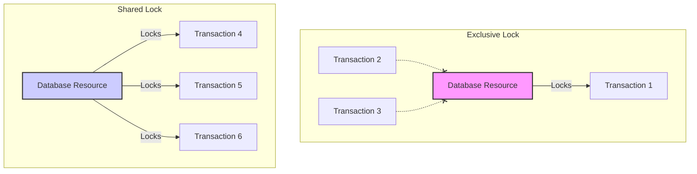

## Concurrency Control

### Exclusive Lock vs Shared Lock

Exclusive locks and shared locks are mechanisms used in database systems to manage concurrent access to data. Let's explain these concepts with a graphical example:



#### Explanation:

##### Exclusive Lock (X-Lock)
- Only one transaction can hold an exclusive lock on a resource at a time
- Prevents other transactions from reading or writing to the locked resource
- Used for write operations to ensure data consistency
- In the diagram, Transaction 1 has an exclusive lock, blocking Transactions 2 and 3

##### Shared Lock (S-Lock)
- Multiple transactions can hold shared locks on the same resource simultaneously
- Allows concurrent read access but prevents write access
- Used for read operations to improve concurrency
- In the diagram, Transactions 4, 5, and 6 all have shared locks on the same resource

This visual representation illustrates how exclusive locks provide strict isolation for write operations, while shared locks allow concurrent read access, enhancing overall system performance in scenarios where multiple transactions need to read the same data simultaneously.

---

### Dead Lock


In this case, the one who enters in dead lock first will get chance to execute the query and others will be aborted.

If the second transaction only had executed the first command and skipped the second command that would put it in a dead lock situation and made commit, then the first transaction will fail with duplicate key violation exception as the second insert is already committed in the table and due to primary key constraint it cannot add.

#### Question:
```sql
Deadlock when inserting 20

In the deadlock video, you are trying to insert 20, which means 20 doesn't 
exist in the table yet. So when transaction A inserts 20 but doesn't commit it,
why is transaction B getting a lock issue when it tries to also insert it? 
Because both transactions should be isolated right? For B, 20 doesn't exist yet,
so the question of lock or no lock should not even arise right?

Or this is a scenario where its not 100% isolation and transactions can read each other metadata?
```

#### Answer:
```sql
This happens in all isolation levels., both transactions are racing to acquire
a key lock on the unique primary key. Since tx1 wrote 20 it acquires a lock on 
that value, so no other transactions attempt to write a similar value to 
guarantee uniqueness. Tx2 attempting to write 20 will be blocked by the lock from
tx2.

The dead lock happens when we do the following

Tx1 and Tx2 begin
Tx1 writes 20 (succeeds and locks the row value 20)
Tx2 writes 30 (succeeds and locks the row with value 30)
Tx1 writes 30 (blocks waiting for tx2 to either commit or rollback to 
release the lock on 30)
Tx2 writes 20 (blocks waiting for tx1 to either commit or rollback to 
release the lock on 20)
Dead lock as both transactions are waiting on each other
```

#### Follow-up Question:
```sql
but why would Tx1 and Tx2 wait on each other. For example, Tx1 writes 20, 
but the value has not been committed to table right? So how can you acquire a
lock for a row that doesn't exist yet in the table? The row only exists if
commit has happened isn't it?
```

#### Follow-up Answer:
```sql
Fantastic question! The row is not committed yet to disk because we did 
not commit but it is available in memory (dirty page) so postgres checks 
its memory for row 20 and perform the locking to prevent multiple entries
```

---

### Two-Phase Locking

One use case is a movie ticket booking system where for a Cinema, show and seat multiple booking problem can happen as at microsecond level this is difficult to handle for the database.

One solution is Two-phase locking.

In this at database level, it is about acquiring exclusive lock at row level for a row id.

Using below to acquire lock on a table:

```sql
select * from seats where id=15 for update;
```

Above command will acquire exclusive write lock. Now if other transactions attempt to acquire any lock it will be blocked until the first transaction rollbacks or commits which basically releases the lock.

So the above command for other transactions will return the updated data which was committed by the first transaction.

#### Spring Boot Example with JDBC Template:

```java
@Service
public class TicketBookingService {

    @Autowired
    private JdbcTemplate jdbcTemplate;

    @Transactional
    public boolean bookSeat(Long seatId, Long userId) {
        try {
            // Phase 1: Acquire lock
            String lockSql = "SELECT * FROM seats WHERE id = ? FOR UPDATE";
            jdbcTemplate.queryForObject(lockSql, new Object[]{seatId}, (rs, rowNum) -> {
                return rs.getLong("id");
            });

            // Check if seat is available
            String checkSql = "SELECT is_booked FROM seats WHERE id = ?";
            boolean isBooked = jdbcTemplate.queryForObject(checkSql, new Object[]{seatId}, Boolean.class);

            if (!isBooked) {
                // Phase 2: Perform update
                String updateSql = "UPDATE seats SET is_booked = true, user_id = ? WHERE id = ?";
                int updatedRows = jdbcTemplate.update(updateSql, userId, seatId);
                return updatedRows > 0;
            }

            return false;
        } catch (Exception e) {
            // Handle exceptions (e.g., deadlock)
            return false;
        }
    }
}
```

This example uses Spring's JdbcTemplate to implement Two-Phase Locking:

- **Phase 1 (Acquiring the lock)**: The "SELECT ... FOR UPDATE" statement acquires an exclusive lock on the seat row.
- **Phase 2 (Performing the update)**: If the seat is available, the code updates it to mark it as booked.

The `@Transactional` annotation ensures that the entire method runs within a single transaction, maintaining consistency.

> **Note**: This is a simplified example. In a production environment, you'd need to handle more edge cases, implement proper error handling, and possibly use more sophisticated locking mechanisms depending on your specific requirements and database capabilities.

#### Spring Data JPA Implementation:

```java
import org.springframework.data.jpa.repository.JpaRepository;
import org.springframework.data.jpa.repository.Lock;
import org.springframework.data.jpa.repository.Query;
import org.springframework.data.repository.query.Param;

import javax.persistence.LockModeType;
import java.util.Optional;

public interface SeatRepository extends JpaRepository<Seat, Long> {

    @Lock(LockModeType.PESSIMISTIC_WRITE)
    @Query("SELECT s FROM Seat s WHERE s.id = :id")
    Optional<Seat> findByIdAndLock(@Param("id") Long id);
}

@Service
public class TicketBookingService {

    @Autowired
    private SeatRepository seatRepository;

    @Transactional
    public boolean bookSeat(Long seatId, Long userId) {
        try {
            // Phase 1: Acquire lock
            Optional<Seat> seatOptional = seatRepository.findByIdAndLock(seatId);

            if (seatOptional.isPresent()) {
                Seat seat = seatOptional.get();

                // Check if seat is available
                if (!seat.isBooked()) {
                    // Phase 2: Perform update
                    seat.setBooked(true);
                    seat.setUserId(userId);
                    seatRepository.save(seat);
                    return true;
                }
            }

            return false;
        } catch (Exception e) {
            // Handle exceptions (e.g., deadlock)
            return false;
        }
    }
}

@Entity
@Table(name = "seats")
public class Seat {
    @Id
    @GeneratedValue(strategy = GenerationType.IDENTITY)
    private Long id;

    @Column(name = "is_booked")
    private boolean isBooked;

    @Column(name = "user_id")
    private Long userId;

    // Getters and setters
}
```

In this example:

- We define a custom query method `findByIdAndLock` in the `SeatRepository` interface. This method uses the `@Lock` annotation with `LockModeType.PESSIMISTIC_WRITE` to acquire an exclusive lock on the seat row.
- The `TicketBookingService` uses this repository method to implement the Two-Phase Locking:
  - **Phase 1**: Acquiring the lock with `findByIdAndLock`
  - **Phase 2**: Performing the update if the seat is available

This approach leverages Spring Data JPA's features to implement the locking mechanism, making the code more concise and easier to maintain compared to the JDBC Template version.

---

### Two-Phase Locking: Alternative Approach

The core idea is the same: the database will acquire an exclusive lock. Instead of checking whether the seat is booked, we will execute the update command with the condition that `is_booked` is false. The update command will internally acquire a row lock (internal lock, not user lock).

```sql
UPDATE seats SET is_booked=1, u='Pravin' WHERE id=1 AND is_booked=0;
```

If transaction 1 executes the above command, it will fetch the record and see that the row is not locked, so it will acquire the lock as it can see the condition is met.

Now if transaction 2 also executes the above command, it will see the condition is met but the row is currently locked as this information is stored in heap at row level. So it will be blocked.

Now if transaction 1 commits, that data is saved in the heap/table. Transaction 2 ideally will get unblocked and update the data, but **PostgreSQL does this differently** - it will refresh the data as this is stored at row level for lock info. So now on refresh it will see the condition is failed and it will not update.

> **Important**: This behavior is database-specific and we cannot guarantee similar behavior in different database systems.

For the above approach to work, you need to be in read commit mode of isolation.

---

### SQL Pagination with Offset Is Very Slow

[offset.mp4]({{page.attachment_path}}/offset.mp4)

Using offset puts the database to do a lot of work. It will fetch all the records matching the condition and then apply offset and use limit to retrieve the selected rows.

This is fine for small datasets but for large datasets when in a single TCP connection we are requesting multiple pages, our DB is fetching the same rows again from the beginning and doing the same operation multiple times. Such a wastage!

Also, if some new records get added to the table, then the offset approach can give you duplicate records in the response.

Let's take an example to understand:

```sql
EXPLAIN ANALYZE SELECT * FROM employees ORDER BY id DESC OFFSET 1000 LIMIT 10;

Limit  (cost=31.51..31.82 rows=10 width=10) (actual time=92.830..93.295 rows=10 loops=1)
  ->  Index Scan Backward using employees_pkey on employees  (cost=0.42..31085.44 rows=1000001 width=10) (actual time=0.040..76.360 rows=1010 loops=1)
Planning Time: 0.297 ms
Execution Time: 93.534 ms
```

You can see 1010 rows are fetched → 1000 due to offset and 10 due to limit. Let's increase the offset:

```sql
EXPLAIN ANALYZE SELECT * FROM employees ORDER BY id DESC OFFSET 100000 LIMIT 10;

Limit  (cost=3108.92..3109.23 rows=10 width=10) (actual time=2940.183..2940.972 rows=10 loops=1)
  ->  Index Scan Backward using employees_pkey on employees  (cost=0.42..31085.44 rows=1000001 width=10) (actual time=0.030..1721.297 rows=100010 loops=1)
Planning Time: 0.086 ms
Execution Time: 2941.167 ms
```

OMG! You can see the number of rows retrieved is 100010 which causes the execution time to go around 100x times the previous query just to retrieve 10 rows. Obviously, the database will do the caching but that is not the solution.

#### Better Approach: Using ID for Pagination

A better approach would be to use the ID to tell the DB not to reach anything before that. If let's say the last ID read by the database is 999992 then we can use it to retrieve from that onwards:

```sql
EXPLAIN ANALYZE SELECT * FROM employees WHERE id < 999992 ORDER BY id DESC LIMIT 10;

Limit  (cost=0.42..0.76 rows=10 width=10) (actual time=0.054..0.521 rows=10 loops=1)
  ->  Index Scan Backward using employees_pkey on employees  (cost=0.42..33585.25 rows=999990 width=10) (actual time=0.023..0.183 rows=10 loops=1)
        Index Cond: (id < 999992)
Planning Time: 0.106 ms
Execution Time: 0.750 ms
```

Data is already cached so it will be quite fast, but the above query is fast as we are using the index to decide from where to start the scan and it will eliminate the need to scan entire rows from offset 0.

Also, the number of rows retrieved is 10 so it is better for the DB as well since data read by the DB is less.

---

### Database Connection Pooling

Database connection pooling is a technique used to manage and reuse database connections efficiently. In a production system, it offers several benefits:

- **Improved performance**: Reusing existing connections reduces the overhead of creating new ones
- **Better resource management**: It limits the number of open connections, preventing database overload
- **Reduced latency**: Connections are readily available, minimizing wait times for database operations
- **Enhanced scalability**: It allows applications to handle more concurrent users with fewer resources

Here's an example of how to configure connection pooling in a Spring Boot application using HikariCP (the default connection pool):

```properties
# application.properties

# DataSource configuration
spring.datasource.url=jdbc:postgresql://localhost:5432/mydb
spring.datasource.username=myuser
spring.datasource.password=mypassword

# HikariCP settings
spring.datasource.hikari.maximum-pool-size=10
spring.datasource.hikari.minimum-idle=5
spring.datasource.hikari.idle-timeout=600000
spring.datasource.hikari.max-lifetime=1800000
```

In this configuration:

- `maximum-pool-size`: Sets the maximum number of connections in the pool
- `minimum-idle`: Sets the minimum number of idle connections to maintain in the pool
- `idle-timeout`: Specifies how long a connection can remain idle in the pool before being removed
- `max-lifetime`: Defines the maximum lifetime of a connection in the pool

With this setup, Spring Boot will automatically use the connection pool for database operations. The benefits in a production system include:

- **Developers**: Simplified code as connection management is handled automatically
- **Operations team**: Improved application stability and easier resource management
- **End-users**: Faster response times and better overall application performance
- **Business**: Increased system capacity and potential cost savings on infrastructure

By efficiently managing database connections, connection pooling helps create more robust and scalable applications in production environments.

---

## Replication

### Master/Backup Replication
- One Master/Leader node that accepts writes/ddls
- One or more backup/standby nodes that receive those writes from the master
- Simple to implement no conflicts

### Multi-Master Replication
- Multiple Master/Leader node that accepts writes/ddls
- One or more backup/follower nodes that receive those writes from the masters
- Need to resolves conflict

### Synchronous vs Asynchronous Replication
- Synchronous Replication, A write transaction to the master will be blocked until it is written to the backup/standby nodes
- First 2, First 1 or Any
- Asynchronous Rep, A write transaction is considered successful if it written to the master, then asynchronously the writes are applied to backup nodes

### Pros & Cons of Replication

**Pros**
- Horizontal Scaling
- Region based queries - DB per region

**Cons**
- Eventual Consistency
- Slow Writes (synchronous)
- Complex to Implement (multi-master)

### SQL vs NoSQL Architecture

- [**MongoDB internal Architecture**](mongodb-internal-architecture)
- [**MongoDB collection clustered index**](mongodb-collection-clustered-index)
- [**MemCached In-Memory database Architecture**](memcached-in-memory-database-architecture)