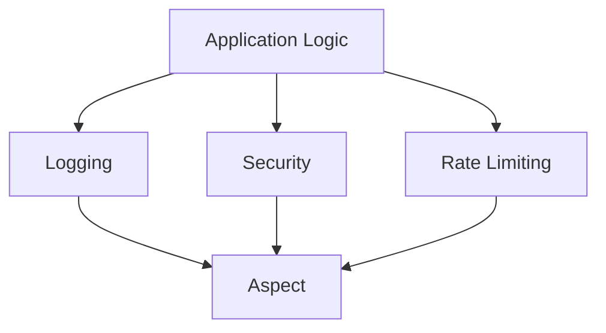
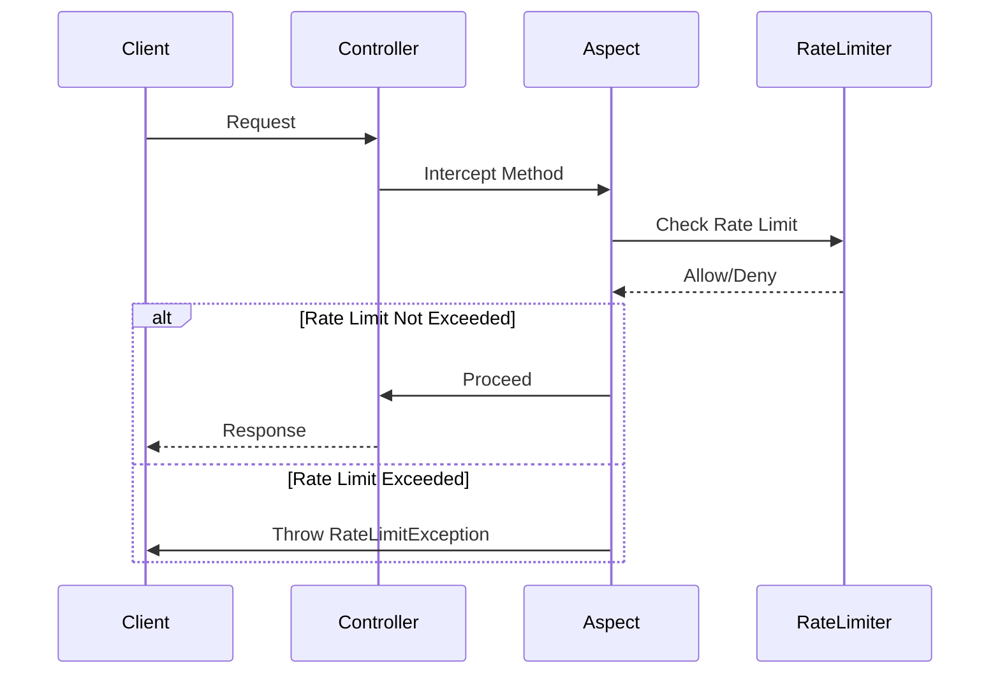
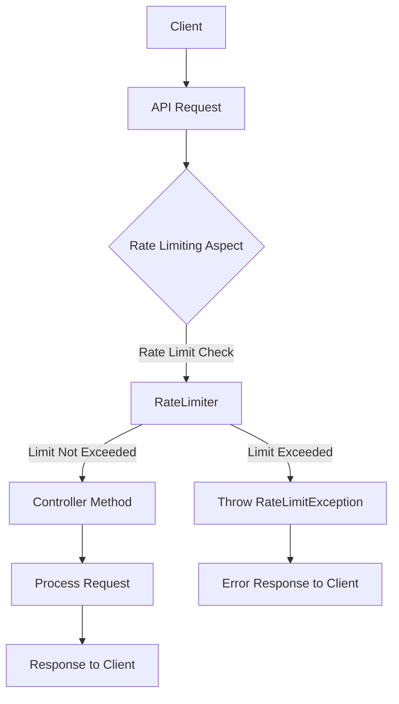

## Introduction
Aspect-Oriented Programming (AOP) is a powerful technique in Spring Boot for separating cross-cutting concerns from the main application logic. One common use case of AOP is implementing rate limiting in APIs, where you restrict the number of requests a client can make within a certain period. In this article, we'll explore how to leverage AOP to implement rate limiting in Spring Boot APIs, ensuring optimal performance and resource utilization.

## Table of Contents
1. [Understanding Aspect-Oriented Programming (AOP)](#1-understanding-aspect-oriented-programming-aop)
2. [Implementing Rate Limiting with AOP in Spring Boot](#2-implementing-rate-limiting-with-aop-in-spring-boot)
3. [Example: Rate Limiting in a Spring Boot API](#3-example-rate-limiting-in-a-spring-boot-api)
4. [Conclusion](#4-conclusion)

## 1. Understanding Aspect-Oriented Programming (AOP)
Aspect-Oriented Programming is a programming paradigm that aims to modularize cross-cutting concerns in software development. Cross-cutting concerns are aspects of a program that affect multiple modules and are difficult to modularize using traditional approaches. Examples include logging, security, and transaction management.

AOP introduces the concept of aspects, which encapsulate cross-cutting concerns. Aspects are modular units that can be applied across different parts of the application without modifying the core logic. AOP frameworks, such as Spring AOP, provide mechanisms for defining aspects and applying them to specific join points in the application's execution flow.

### Mermaid Diagram: AOP Overview


In the diagram above, the application logic is separated from cross-cutting concerns like logging, security, and rate limiting. These concerns are encapsulated in aspects, which are applied to the application logic at specific join points.

## 2. Implementing Rate Limiting with AOP in Spring Boot
Rate limiting is a common requirement in web APIs to prevent abuse and ensure fair usage of resources. With AOP in Spring Boot, we can implement rate limiting by intercepting method invocations and enforcing restrictions on the number of requests allowed within a certain time frame.

To implement rate limiting with AOP in Spring Boot, we typically follow these steps:

1. Define a custom annotation to mark methods that should be rate-limited.
2. Create an aspect class that intercepts method invocations annotated with the custom annotation.
3. Use a rate limiter component to track and enforce rate limits.
4. Handle rate limit exceeded scenarios gracefully, such as by throwing a custom exception.

### Rate Limiting Flow


In the diagram above, the client makes a request to the controller. The aspect intercepts the method call and checks the rate limit using the rate limiter component. If the rate limit is not exceeded, the request proceeds to the controller. If the rate limit is exceeded, the aspect throws a `RateLimitException`.

## 3. Example: Rate Limiting in a Spring Boot API
Implementing rate limiting in a Spring Boot API can be achieved using various techniques. One common approach is to use Spring AOP (Aspect-Oriented Programming) to intercept incoming requests and enforce rate limits.

### Step 1 - Define Rate Limiting Configuration
Add application properties and create a configuration class where you define the rate limit parameters such as the number of requests allowed and the time period.

```properties
rate.limit.requests=10
rate.limit.seconds=60
```

```java
@Component
@ConfigurationProperties(prefix = "rate.limit")
@Getter
@Setter
public class RateLimitConfig {
    private int requests;
    private int seconds;
}
```

### Step 2 - Define RateLimited Annotation
Create a custom annotation to mark the methods that should be rate-limited.

```java
@Target(ElementType.METHOD)
@Retention(RetentionPolicy.RUNTIME)
public @interface RateLimited { }
```

### Step 3 — Create a Rate Limiting Aspect
Implement an aspect using Spring AOP to intercept method calls and enforce rate limits.

```java
@Aspect
@Component
@RequiredArgsConstructor
public class RateLimitAspect {
    private final RateLimiter rateLimiter;

    @Around("@annotation(RateLimited)")
    public Object enforceRateLimit(ProceedingJoinPoint joinPoint) throws Throwable {
        String key = getIpAddress();
        if (!rateLimiter.tryAcquire(key)) {
            throw new RateLimitException("Rate limit exceeded");
        }
        return joinPoint.proceed();
    }

    private String getIpAddress() {
        ServletRequestAttributes requestAttributes = (ServletRequestAttributes) RequestContextHolder.getRequestAttributes();
        HttpServletRequest request = requestAttributes.getRequest();
        return request.getRemoteAddr();
    }
}
```

### Step 4 — Implement Rate Limiter
Create a rate limiter component to manage rate limits using a token bucket algorithm or any other suitable algorithm.

```java
@Component
@RequiredArgsConstructor
public class RateLimiter {
    private final RateLimitConfig rateLimitConfig;
    private final Map<String, RateLimitedSemaphore> semaphores = new ConcurrentHashMap<>();

    public boolean tryAcquire(String key) {
        long currentTime = System.currentTimeMillis();
        long startTime = getStartTime(currentTime);
        cleanupExpiredEntries(startTime);
        return isRequestAllowed(key, currentTime);
    }

    private long getStartTime(long currentTime) {
        return currentTime - rateLimitConfig.getSeconds() * 1000L;
    }

    private boolean isRequestAllowed(String key, long currentTime) {
        RateLimitedSemaphore semaphore = getRateLimitedSemaphore(key, currentTime);
        boolean acquired = semaphore.tryAcquire();
        if (acquired) {
            semaphore.setLastAcquireTime(currentTime);
        }
        return acquired;
    }

    private RateLimitedSemaphore getRateLimitedSemaphore(String key, long currentTime) {
        return semaphores.computeIfAbsent(key, k -> {
            RateLimitedSemaphore newSemaphore = new RateLimitedSemaphore(rateLimitConfig.getRequests());
            newSemaphore.setLastAcquireTime(currentTime);
            return newSemaphore;
        });
    }

    private void cleanupExpiredEntries(long startTime) {
        Iterator<Map.Entry<String, RateLimitedSemaphore>> iterator = semaphores.entrySet().iterator();
        while (iterator.hasNext()) {
            Map.Entry<String, RateLimitedSemaphore> entry = iterator.next();
            RateLimitedSemaphore semaphore = entry.getValue();
            if (semaphore.getLastAcquireTime() < startTime) {
                iterator.remove();
            }
        }
    }

    @Setter
    @Getter
    private class RateLimitedSemaphore extends Semaphore {
        private volatile long lastAcquireTime;
        public RateLimitedSemaphore(int permits) {
            super(permits);
        }
    }
}
```

### Step 5 - Define Exception and Handling
Define a custom exception for rate limit exceeded scenarios and handle it globally.

**Custom Exception**:
```java
public class RateLimitException extends RuntimeException {
    public RateLimitException(String message) {
        super(message);
    }
}
```

**Error Response**:
```java
@Getter
@Builder
@AllArgsConstructor
public class ErrorResponse {
    private String errorCode;
    private String message;
}
```

**Global Exception handler (another usecase of AOP)**:
```java
@RestControllerAdvice
@RequestMapping(produces = "application/json")
public class GlobalExceptionAdvice {

    @ExceptionHandler(RateLimitException.class)
    public ResponseEntity<ErrorResponse> handleRateLimitException(Exception ex) {
        ErrorResponse errorResponse = ErrorResponse.builder()
                .errorCode("ERROR-01")
                .message(ex.getMessage())
                .build();
        return ResponseEntity.status(HttpStatus.TOO_MANY_REQUESTS).body(errorResponse);
    }

    @ExceptionHandler(Exception.class)
    public ResponseEntity<ErrorResponse> handleGenericException(Exception ex) {
        ErrorResponse errorResponse = ErrorResponse.builder()
                .message(ex.getMessage())
                .errorCode("")
                .build();
        return ResponseEntity.status(HttpStatus.INTERNAL_SERVER_ERROR).body(errorResponse);
    }
}
```

### Step 6 — Annotate Controller Methods
Annotate the controller methods that should be rate-limited with `@RateLimited`.

```java
@RestController
@RequiredArgsConstructor
public class FinanceController {
    private final FinanceClient financeClient;

    @RateLimited
    @GetMapping("/finance/historical-data")
    public FinanceHistoricalData getHistoricalData(
            @RequestParam String userId,
            @RequestParam long from,
            @RequestParam long to) {
        return financeClient.getHistoricalData(userId, from, to);
    }
}
```

In this example, we define a custom annotation `@RateLimited` to mark methods that should be rate-limited. We then create an aspect `RateLimitAspect` that intercepts method invocations annotated with `@RateLimited`. Inside the aspect, we enforce rate limits using a `RateLimiter` component.

## 4. Conclusion
In this article, we've explored how to implement rate limiting in Spring Boot APIs using Aspect-Oriented Programming (AOP). By separating cross-cutting concerns such as rate limiting from the core application logic, we can ensure better modularity, maintainability, and scalability of our applications. AOP provides a powerful mechanism for addressing such concerns, allowing developers to focus on building robust and efficient APIs.

By following the steps outlined in this article and leveraging AOP capabilities in Spring Boot, developers can easily implement rate limiting and other cross-cutting concerns in their applications, leading to more resilient and high-performing APIs.

### Overall Flow


In the final diagram, the overall flow of the rate limiting process is illustrated. The client makes a request to the controller, which is intercepted by the aspect. The aspect checks the rate limit using the rate limiter and either allows the request to proceed or throws a `RateLimitException`.

#spring-boot #rate-limit #spring-aop