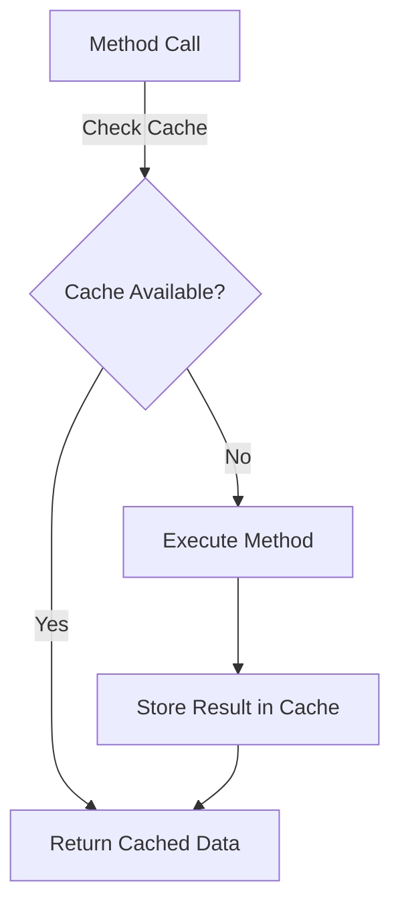
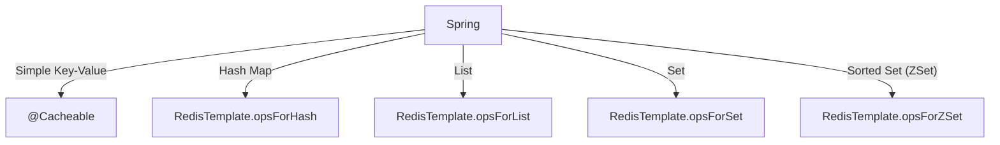

## **Introduction**

Caching is a crucial optimization technique that enhances application performance by reducing database load and response time. **Spring Boot** provides built-in support for caching via the **Spring Cache Abstraction**, which allows developers to integrate various cache providers, including **Redis**.

In this article, we will cover:

1. **Caching in Spring Boot** – key interfaces, annotations, and underlying design patterns.
2. **Configuration required to enable caching**.
3. **Different eviction policies supported by Redis in Spring Boot**.
4. **Default eviction policy used by Redis**.
5. **Key generation strategy and its default behavior**.
6. **How cached data is stored in Redis and how to query it via terminal**.
7. **Data structures supported by Redis and how to use them in Spring**.
8. **When to use different Redis data types for caching.**
9. **Real-world use cases and best practices for caching in Spring Boot with Redis.**

---

## **1. Caching in Spring Boot: Interfaces, Annotations & Design Pattern**

Spring Boot provides the **Spring Cache Abstraction**, which enables caching without binding the application to a specific caching solution.

### **Key Interfaces Used in Spring Boot Caching**

- **`CacheManager`** – Manages different cache regions.
- **`Cache`** – Represents an individual cache region.
- **`CacheResolver`** – Determines which cache should be used.
- **`CacheWriter`** – Defines how cache entries are written.

### **Common Caching Annotations and Their Meaning**

| Annotation                                     | Purpose                                                   |
| ---------------------------------------------- | --------------------------------------------------------- |
| `@Cacheable(value = "products", key = "#id")`  | Caches method output. If key exists, returns cached data. |
| `@CachePut(value = "products", key = "#id")`   | Updates cache and ensures method execution.               |
| `@CacheEvict(value = "products", key = "#id")` | Removes a specific cache entry.                           |
| `@Caching`                                     | Groups multiple caching operations.                       |
| `@CacheConfig`                                 | Specifies common cache settings at the class level.       |
| `@EnableCaching`                               | Enables Spring’s caching mechanism.                       |

### **Behind the Scenes: Design Pattern Used**

Spring Boot’s caching abstraction follows the **Proxy Design Pattern**. When a method annotated with `@Cacheable` is called, Spring first checks if the result exists in the cache. If it does, the method execution is skipped, and the cached result is returned. Otherwise, the method executes, and the result is cached.



---

## **2. Enabling Caching in Spring Boot**

To enable caching in a Spring Boot application, follow these steps:

### **Step 1: Add Dependencies (Spring + Redis)**

**Maven (pom.xml):**
```xml
<dependency>
    <groupId>org.springframework.boot</groupId>
    <artifactId>spring-boot-starter-cache</artifactId>
</dependency>
<dependency>
    <groupId>org.springframework.boot</groupId>
    <artifactId>spring-boot-starter-data-redis</artifactId>
</dependency>
```

**application.properties:**
```properties
spring.redis.host=localhost
spring.redis.port=6379
```

### **Step 2: Enable Caching in Configuration Class**

```java
@Configuration
@EnableCaching
public class CacheConfig {

    @Bean
    @Primary
    public RedisCacheConfiguration defaultCacheConfig() {
        StringRedisSerializer keySerializer = new StringRedisSerializer();
        Jackson2JsonRedisSerializer<Object> valueSerializer = new Jackson2JsonRedisSerializer<>(Object.class);

        return RedisCacheConfiguration.defaultCacheConfig()
                .entryTtl(Duration.ofMinutes(2)) // Set cache expiration
                .serializeKeysWith(RedisSerializationContext.SerializationPair.fromSerializer(keySerializer))
                .serializeValuesWith(RedisSerializationContext.SerializationPair.fromSerializer(valueSerializer));
    }
}
```

---

## **3. Different Eviction Policies in Spring Boot with Redis**

Eviction policies determine how data is removed when memory is full. Spring Boot allows configuring different strategies:

| Eviction Policy                 | Description                                       |
| ------------------------------- | ------------------------------------------------- |
| **LRU (Least Recently Used)**   | Removes least accessed items when memory is full. |
| **LFU (Least Frequently Used)** | Removes least frequently used items first.        |
| **FIFO (First In, First Out)**  | Evicts oldest stored items first.                 |
| **TTL-Based Eviction**          | Removes data after a set time (Time-To-Live).     |

---

## **4. Default Eviction Policy in Redis**

By default, Redis uses **noeviction** for eviction. To check the policy:

```sh
127.0.0.1:6379> CONFIG GET maxmemory-policy
1) "maxmemory-policy"
2) "noeviction"
```

To change the policy:

```sh
127.0.0.1:6379> CONFIG SET maxmemory-policy allkeys-lru
OK

127.0.0.1:6379> CONFIG GET maxmemory-policy
1) "maxmemory-policy"
2) "allkeys-lru"
```

---

## **5. Key Generation Strategy in Spring Boot**

Spring Boot uses a **Simple Key Generator** by default, which constructs keys as follows:

- **Single argument:** Uses the argument value as the key.
- **Multiple arguments:** Uses an array containing all arguments.
- **No arguments:** Uses a default key `SimpleKey.EMPTY`.

### **Example: Custom Key Generator**

```java
@Bean
public KeyGenerator customKeyGenerator() {
    return (target, method, params) -> method.getName() + "::" + Arrays.toString(params);
}
```

---

## **6. Using String and Hash Data Types in Redis with Spring**

Redis provides multiple data structures for caching, with `String` and `Hash` being two of the most commonly used. `String` is often used for simple key-value caching, while `Hash` is beneficial for storing structured objects and updating specific fields efficiently.

### **Using String Data Type with Annotations**

The `@Cacheable` annotation in Spring enables automatic caching of method return values. The following example demonstrates how to cache product details using the `String` data type in Redis:

#### **Product Service Implementation**
```java
@Service
public class ProductService {
    private final ProductRepository productRepository;

    public ProductService(final ProductRepository productRepository) {
        this.productRepository = productRepository;
    }

    @Cacheable(value = "productCache", key = "#id")
    public ProductDto get(final Long id) {
        return productRepository.findById(id)
                .map(product -> mapToDTO(product, new ProductDto()))
                .orElseThrow(NotFoundException::new);
    }
}
```
#### **Product Controller**
```java
@CrossOrigin(origins = "*", maxAge = 3600)
@RestController
@RequestMapping(value = "/api/products", produces = MediaType.APPLICATION_JSON_VALUE)
public class ProductController {

    private final ProductService productService;
    
    public ProductController(ProductService productService) {
        this.productService = productService;
    }

    @GetMapping("/{id}")
    public ResponseEntity<ProductDto> getProduct(@PathVariable final Long id) {
        return ResponseEntity.ok(productService.get(id));
    }
}
```

#### **Adding a Product to the Database**
```sh
curl --request POST \
  --url http://localhost:8080/api/products \
  --header 'Content-Type: application/json' \
  --header 'User-Agent: insomnia/10.2.0' \
  --data '{
	"id" : 1,
	"name": "iphone",
	"category": "phone",
	"availableItems": 12,
	"price": "50000",
	"description": "2025 model",
	"manufacturer": "Apple Inc"
}'
```

#### **Retrieving a Product**
When fetching a product, the service first checks Redis. If the entry is found in the cache, it is returned directly; otherwise, the database is queried, and the result is stored in the cache before returning it.

```sh
curl --request GET --url http://localhost:8080/api/products/1
```

#### **Checking Redis Cache**
```sh
127.0.0.1:6379> GET productCache::1
"{\"id\":1,\"name\":\"iphone\",\"category\":\"phone\",\"price\":50000.0,\"description\":\"2025 model\",\"manufacturer\":\"Apple Inc\",\"availableItems\":12}"
```

#### **After Expiry**
```sh
127.0.0.1:6379> GET productCache::1
(nil)
```

### **Using Hash Data Type Programmatically**
The `Hash` data type in Redis is useful for efficiently storing structured objects. It allows updating specific fields without replacing the entire object, making it ideal for frequently updated records.

#### **Setting Up RedisTemplate Bean**
Modify `CacheConfig.java` to include a Redis template:
```java
    @Bean
    public RedisTemplate<String, Object> redisTemplate(RedisConnectionFactory connectionFactory) {
        RedisTemplate<String, Object> template = new RedisTemplate<>();
        template.setConnectionFactory(connectionFactory);

        // JSON Serializer
        Jackson2JsonRedisSerializer<Object> jsonSerializer = new Jackson2JsonRedisSerializer<>(Object.class);

        // Set Key and HashKey as String
        template.setKeySerializer(new StringRedisSerializer());
        template.setHashKeySerializer(new StringRedisSerializer());

        // Value and HashValue as JSON
        template.setValueSerializer(jsonSerializer);
        template.setHashValueSerializer(jsonSerializer);
        template.afterPropertiesSet();
        return template;
    }
```

#### **Modifying ProductService to Store Data as Hash**
```java
@Service
public class ProductService {
    private final RedisTemplate<String, Object> redisTemplate;
    private final ObjectMapper objectMapper;
    private final ProductRepository productRepository;

    public ProductService(RedisTemplate<String, Object> redisTemplate, ObjectMapper objectMapper, ProductRepository productRepository) {
        this.redisTemplate = redisTemplate;
        this.objectMapper = objectMapper;
        this.productRepository = productRepository;
    }

    public ProductDto getModified(final Long id) {
        HashOperations<String, Object, Object> hashOps = redisTemplate.opsForHash();
        Map<Object, Object> productMap = hashOps.entries("product:" + id);

        if (productMap.isEmpty()) {
            ProductDto productDto = productRepository.findById(id)
                    .map(product -> mapToDTO(product, new ProductDto()))
                    .orElseThrow(NotFoundException::new);
            cacheProduct(productDto);
            return productDto;
        }

        return objectMapper.convertValue(productMap, ProductDto.class);
    }

    public Long create(final ProductDto productDTO) {
        final Product product = new Product();
        mapToEntity(productDTO, product);
        Product saved = productRepository.save(product);
        cacheProduct(productDTO);
        return saved.getId();
    }

    private void cacheProduct(ProductDto product) {
        HashOperations<String, Object, Object> hashOps = redisTemplate.opsForHash();
        Map<String, Object> productMap = objectMapper.convertValue(product, Map.class);
        hashOps.putAll("product:" + product.getId(), productMap);
    }
}
```

---

### **Updating Stock Availability in Cache Using Order Service**
To keep stock availability updated, an `OrderService` modifies only the `availableItems` field in the Redis cache without rewriting the entire product object.

```java
@Service
public class OrderService {
    private final RedisTemplate<String, Object> redisTemplate;
    private final OrderRepository orderRepository;
    private final ProductRepository productRepository;

    public OrderService(RedisTemplate<String, Object> redisTemplate, final OrderRepository orderRepository, final UserRepository userRepository, final ProductRepository productRepository) {
        this.redisTemplate = redisTemplate;
        this.orderRepository = orderRepository;
        this.productRepository = productRepository;
    }

    public OrderDto get(final Long id) {
        return orderRepository.findById(id)
                .map(order -> mapToDTO(order, new OrderDto()))
                .orElseThrow(NotFoundException::new);
    }

    public Long create(final OrderDto orderDTO) {
        final Order order = new Order();
        mapToEntity(orderDTO, order);
        Order saved =  orderRepository.save(order);
        saved.getLineItems().forEach(this::updateProductAvailability);
        return saved.getId();
    }

    private void updateProductAvailability(LineItem lineItem) {
        Long productId = lineItem.getProduct().getId();
        Integer quantity = lineItem.getQuantity();
        HashOperations<String, Object, Object> hashOps = redisTemplate.opsForHash();

        Long newStock = hashOps.increment("product:" + productId, "availableItems", -quantity);
        hashOps.put("product:" + productId, "lastUpdate", System.currentTimeMillis());
        if (newStock < 0) {
            hashOps.put("product:" + productId, "availableItems", 0); // Reset to zero
            throw new IllegalArgumentException("Stock is insufficient!");
        }
    }
}
```

---

### **Final Redis Structure**
#### **After Adding a Product**
```sh
127.0.0.1:6379> HGETALL product:1
 1) "id"
 2) "1"
 3) "name"
 4) "\"iphone\""
 5) "category"
 6) "\"phone\""
 7) "price"
 8) "50000.0"
 9) "description"
10) "\"2025 model\""
11) "manufacturer"
12) "\"Apple Inc\""
13) "availableItems"
14) "12"
15) "lineItems"
16) ""
17) "dateCreated"
18) ""
19) "lastUpdated"
20) ""
127.0.0.1:6379>
```

#### **After Placing an Order**
Once we place order for this product, we are saving in the DB and also updating cache for available count quit as only specific field is updated.

**API curl:**
```sh
curl --request POST \
  --url http://localhost:8080/api/orders \
  --header 'Content-Type: application/json' \
  --header 'Correlation-Id: ALPHA-123' \
  --header 'User-Agent: insomnia/10.2.0' \
  --data '{
	"id" : 1,
	"userId": 1,
	"lineItems": [
		{
			"productId": 1,
			"quantity": 4
		}
	]
}'
```

**Redis Terminal**
```sh
127.0.0.1:6379> HGETALL product:1
 1) "id"
 2) "1"
 3) "name"
 4) "\"iphone\""
 5) "category"
 6) "\"phone\""
 7) "price"
 8) "50000.0"
 9) "description"
10) "\"2025 model\""
11) "manufacturer"
12) "\"Apple Inc\""
13) "availableItems"
14) "8"
15) "lineItems"
16) ""
17) "dateCreated"
18) ""
19) "lastUpdated"
20) ""
21) "lastUpdate"
22) "1741976096813"
127.0.0.1:6379>
```

---

## **7. Supported Redis Data Structures & Usage in Spring**



---

## **8. When to Use Which Data Type?**

### **String Data Type**
- **Use Case:** Simple key-value pairs where the value is a single object or a serialized object.
- **Example:** Caching user sessions, configuration settings, or individual product details.

### **Hash Data Type**
- **Use Case:** Storing objects with multiple fields, where each field can be accessed individually.
- **Example:** Caching user profiles, where each user has multiple attributes like name, email, and address.

### **List Data Type**
- **Use Case:** Storing ordered collections of items, where the order of insertion is important.
- **Example:** Caching recent activities or logs.

### **Set Data Type**
- **Use Case:** Storing unique items where the order does not matter.
- **Example:** Caching unique tags or categories.

### **Sorted Set (ZSet) Data Type**
- **Use Case:** Storing ordered collections of items with associated scores, where items can be retrieved based on their scores.
- **Example:** Caching leaderboard data or ranked items.

---

## **9. Real-World Use Cases and Best Practices**

### **Real-World Use Cases**

1. **E-commerce Applications:**
   - **Product Catalog:** Cache product details to reduce database load during high traffic.
   - **Shopping Cart:** Use Redis to store temporary shopping cart data.

2. **Social Media Platforms:**
   - **User Feeds:** Cache user feeds to improve read performance.
   - **Notifications:** Store and retrieve user notifications efficiently.

3. **Gaming Applications:**
   - **Leaderboards:** Use Redis Sorted Sets to maintain and display leaderboard data.
   - **Session Management:** Cache user sessions to ensure quick access and scalability.

### **Best Practices**

1. **Cache Invalidation:**
   - Implement proper cache invalidation strategies to ensure data consistency.
   - Use `@CacheEvict` to remove stale data from the cache.

   ```java
   @Service
   public class ProductService {

       @CacheEvict(value = "productCache", key = "#id")
       public void evictProductById(Long id) {
           // This method will remove the cached product with the given id
       }
   }
   ```

2. **Cache Expiration:**
   - Set appropriate TTL (Time-To-Live) values to automatically expire stale data.
   - Use Redis' TTL-based eviction policy to manage cache expiration.

   ```java
   @Bean
   public RedisCacheManager cacheManager(RedisConnectionFactory factory) {
       RedisCacheConfiguration config = RedisCacheConfiguration.defaultCacheConfig()
           .entryTtl(Duration.ofMinutes(10)); // Set TTL to 10 minutes
       return RedisCacheManager.builder(factory)
           .cacheDefaults(config)
           .build();
   }
   ```

3. **Monitoring and Logging:**
   - Monitor cache hit and miss ratios to optimize cache usage.
   - Log cache operations to diagnose and troubleshoot issues.

   ```java
   @Service
   public class ProductService {

       private static final Logger logger = LoggerFactory.getLogger(ProductService.class);

       @Cacheable(value = "productCache", key = "#id")
       public Product getProductById(Long id) {
           logger.info("Fetching product from database with id: {}", id);
           // Simulate database call
           return new Product(id, "Laptop", 1200);
       }
   }
   ```

4. **Scalability:**
   - Use Redis clustering to distribute cache data across multiple nodes for scalability.
   - Implement cache sharding to handle large datasets efficiently.

   ```java
   @Bean
   public RedisConnectionFactory redisConnectionFactory() {
       RedisClusterConfiguration clusterConfig = new RedisClusterConfiguration();
       clusterConfig.clusterNode("127.0.0.1", 6379);
       clusterConfig.clusterNode("127.0.0.1", 6380);
       return new JedisConnectionFactory(clusterConfig);
   }
   ```

---

## **Conclusion**

Caching is a powerful technique to enhance the performance of Spring Boot applications. By leveraging Redis as a cache provider, developers can achieve significant improvements in response times and database load. This guide has covered the essential aspects of caching in Spring Boot with Redis, including configuration, eviction policies, key generation, and data structures. By following best practices and understanding real-world use cases, you can effectively implement caching in your applications to deliver a seamless user experience.