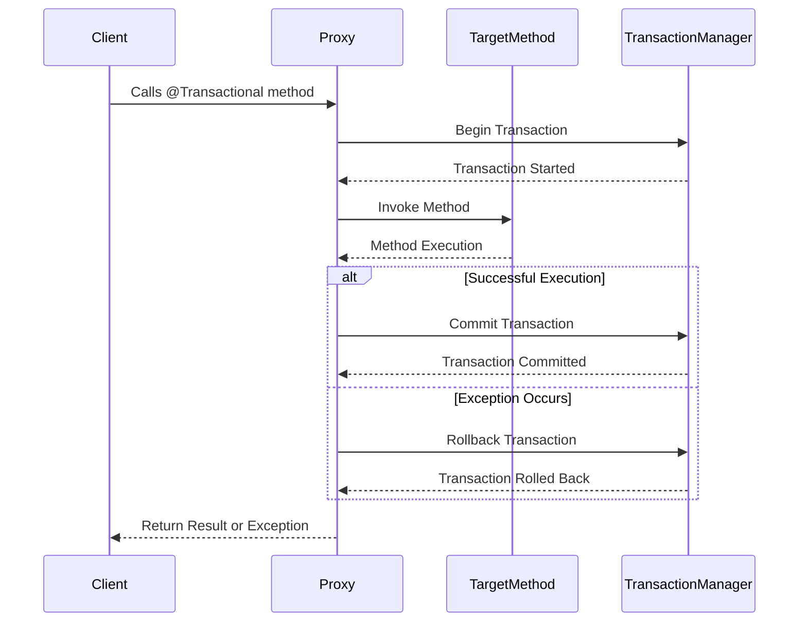

Spring's `@Transactional` annotation is a powerful tool for managing transactions in Java applications. It simplifies transaction management by allowing developers to define transactional behavior declaratively, eliminating the need for boilerplate code. In this blog post, we’ll explore how `@Transactional` works, its key attributes, common pitfalls, and best practices to help you master transaction management in Spring.

## Table of Contents  
1. [How @Transactional Works](#how-transactional-works)  
2. [Key Attributes of @Transactional](#key-attributes-of-transactional)  
   - [Propagation](#propagation)  
   - [Isolation](#isolation)  
   - [Rollback Behavior](#rollback-behavior)  
   - [Read-Only Transactions](#read-only-transactions)  
   - [Timeout](#timeout)  
3. [Common Pitfalls](#common-pitfalls)  
   - [Self-Invocation](#self-invocation)  
   - [Checked Exceptions](#checked-exceptions)  
   - [Visibility Issues](#visibility-issues)  
4. [Best Practices](#best-practices)  
5. [Conclusion](#conclusion)  

## How @Transactional Works  

When a method is annotated with `@Transactional`, Spring creates a proxy that wraps the method call. This proxy manages the transaction boundaries:  
- A new transaction is started before method execution (if required).  
- The transaction is committed if the method executes successfully.  
- The transaction is rolled back if an exception occurs (based on the rollback rules).  

Here’s a visual representation of how `@Transactional` works:  



## Key Attributes of @Transactional  

### 1. **Propagation**  
Propagation defines how transactions behave when a method is called within another transaction. It determines whether a new transaction should be created, an existing one should be used, or no transaction should be used at all.  

#### **Propagation Types at a Glance**  

| Propagation Type | Short Description |  
|------------------|-------------------|  
| **`REQUIRED`** (default) | Uses an existing transaction if available; otherwise, starts a new one. |  
| **`REQUIRES_NEW`** | Suspends the current transaction and starts a new one. |  
| **`MANDATORY`** | Throws an exception if no existing transaction is found. |  
| **`SUPPORTS`** | Runs within a transaction if one exists; otherwise, runs non-transactionally. |  
| **`NOT_SUPPORTED`** | Runs the method outside of any transaction, suspending an existing one if necessary. |  
| **`NEVER`** | Throws an exception if an active transaction exists. |  
| **`NESTED`** | Executes within a nested transaction if an existing transaction is found. |  


#### **Detailed Breakdown with Examples**  

1. **`REQUIRED`**  
   - Uses an existing transaction if available; otherwise, starts a new one.  
   - **Example:**  
     ```java
     @Transactional(propagation = Propagation.REQUIRED)
     public void methodA() {
         methodB(); // Reuses the same transaction if called within methodA
     }
     ```  
   - **Explanation:** If `methodA` is called without an existing transaction, a new transaction is started. If `methodB` is called within `methodA`, it reuses the same transaction.  

2. **`REQUIRES_NEW`**  
   - Suspends the current transaction and starts a new one.  
   - **Example:**  
     ```java
     @Transactional(propagation = Propagation.REQUIRES_NEW)
     public void methodB() {
         // Business logic in a new transaction
     }
     ```  
   - **Explanation:** If `methodB` is called within an existing transaction, the current transaction is suspended, and a new transaction is started for `methodB`. After `methodB` completes, the original transaction resumes.  

3. **`MANDATORY`**  
   - Throws an exception if no existing transaction is found.  
   - **Example:**  
     ```java
     @Transactional(propagation = Propagation.MANDATORY)
     public void methodC() {
         // Business logic that requires an existing transaction
     }
     ```  
   - **Explanation:** If `methodC` is called without an existing transaction, a `TransactionRequiredException` is thrown.  

4. **`SUPPORTS`**  
   - Runs within a transaction if one exists; otherwise, runs non-transactionally.  
   - **Example:**  
     ```java
     @Transactional(propagation = Propagation.SUPPORTS)
     public void methodD() {
         // Business logic that can run with or without a transaction
     }
     ```  
   - **Explanation:** If `methodD` is called within a transaction, it runs within that transaction. If no transaction exists, it runs without one.  

5. **`NOT_SUPPORTED`**  
   - Runs the method outside of any transaction, suspending an existing one if necessary.  
   - **Example:**  
     ```java
     @Transactional(propagation = Propagation.NOT_SUPPORTED)
     public void methodE() {
         // Business logic that should not run within a transaction
     }
     ```  
   - **Explanation:** If `methodE` is called within a transaction, the transaction is suspended, and the method runs without a transaction. After the method completes, the original transaction resumes.  

6. **`NEVER`**  
   - Throws an exception if an active transaction exists.  
   - **Example:**  
     ```java
     @Transactional(propagation = Propagation.NEVER)
     public void methodF() {
         // Business logic that must not run within a transaction
     }
     ```  
   - **Explanation:** If `methodF` is called within an active transaction, an `IllegalTransactionStateException` is thrown.  

7. **`NESTED`**  
   - Executes within a nested transaction if an existing transaction is found.  
   - **Example:**  
     ```java
     @Transactional(propagation = Propagation.NESTED)
     public void methodG() {
         // Business logic that runs in a nested transaction
     }
     ```  
   - **Explanation:** If `methodG` is called within an existing transaction, a nested transaction is created. If the outer transaction fails, the nested transaction is rolled back. If the nested transaction fails, the outer transaction can decide whether to commit or rollback.  

### 2. **Isolation**  
Defines how data modifications in one transaction are visible to others.  

| Isolation Level | Description |
|----------------|-------------|
| `DEFAULT` | Uses the database default isolation level. |
| `READ_UNCOMMITTED` | Allows dirty reads (reading uncommitted changes from other transactions). |
| `READ_COMMITTED` | Prevents dirty reads; a transaction sees only committed changes. |
| `REPEATABLE_READ` | Prevents non-repeatable reads; data read within a transaction remains consistent. |
| `SERIALIZABLE` | Ensures complete isolation but may cause performance overhead. |

#### **Example:**  
```java
@Transactional(isolation = Isolation.REPEATABLE_READ)
public void updateAccountBalance() {
    // Business logic to update balance
}
```

### 3. **Rollback Behavior**  
Specifies conditions under which transactions should be rolled back.  

| Rollback Rule | Description |
|--------------|-------------|
| `rollbackFor` | Defines exceptions that trigger rollback (e.g., `rollbackFor = Exception.class`). |
| `noRollbackFor` | Defines exceptions that should **not** trigger rollback. |

#### **Example:**  
```java
@Transactional(rollbackFor = SQLException.class)
public void saveData() throws SQLException {
    // Database operations that should roll back on SQL exception
}
```

### 4. **Read-Only Transactions**  
Indicates that a transaction will not perform write operations, allowing optimizations.  

#### **Example:**  
```java
@Transactional(readOnly = true)
public List<User> getUsers() {
    return userRepository.findAll();
}
```

### 5. **Timeout**  
Specifies the maximum time (in seconds) a transaction can run before rollback.  

#### **Example:**  
```java
@Transactional(timeout = 5)
public void processLongRunningTask() {
    // Business logic
}
```

## Common Pitfalls  

### 1. **Self-Invocation**  
Transactional methods calling each other within the same class do not trigger transactional behavior due to proxy-based AOP. This happens because the proxy is bypassed during self-invocation.  

**Solution:** Use `AopContext.currentProxy()` or refactor the code to call the method from another bean.  

```java
@Service
public class MyService {
    public void outerMethod() {
        ((MyService) AopContext.currentProxy()).innerMethod();
    }

    @Transactional
    public void innerMethod() {
        // Business logic
    }
}
```

---

### 2. **Checked Exceptions**  
By default, transactions roll back only on unchecked exceptions (`RuntimeException` or `Error`). Checked exceptions do not trigger rollback unless explicitly configured.  

**Solution:** Use the `rollbackFor` attribute to specify checked exceptions.  

```java
@Transactional(rollbackFor = CustomCheckedException.class)
public void myMethod() throws CustomCheckedException {
    // Business logic
}
```

### 3. **Visibility Issues**  
The method must be `public` to ensure Spring’s proxy mechanism applies correctly. Non-public methods (e.g., `private`, `protected`) will not be transactional.  

**Solution:** Always declare transactional methods as `public`.  

## Best Practices  

1. **Use `@Transactional` at the Service Layer:**  
   - Apply `@Transactional` to service methods rather than DAO or repository methods. This ensures that business logic is executed within a single transaction.  

2. **Avoid Long-Running Transactions:**  
   - Use the `timeout` attribute to prevent transactions from holding database resources for too long.  

3. **Leverage Read-Only Transactions:**  
   - Mark read-only methods with `readOnly = true` to optimize database performance.  

4. **Test Transactional Behavior:**  
   - Write unit and integration tests to verify that transactions behave as expected, especially for rollback scenarios.  

5. **Monitor Transaction Performance:**  
   - Use tools like Spring Boot Actuator or database monitoring tools to track transaction performance and identify bottlenecks.  

## Conclusion  

Spring’s `@Transactional` annotation provides a powerful way to manage transactions declaratively. By understanding attributes like **propagation, isolation, rollback, read-only, and timeout**, developers can fine-tune transaction management to optimize performance and consistency.  

### **Key Takeaways**  
- Use `propagation` to control how transactions interact.  
- Choose the right `isolation` level for data consistency.  
- Define rollback rules for specific exceptions.  
- Mark read-only methods with `readOnly = true` for performance benefits.  
- Be cautious of self-invocation and proxy limitations.  
- Test and monitor transactional behavior to ensure reliability.  
