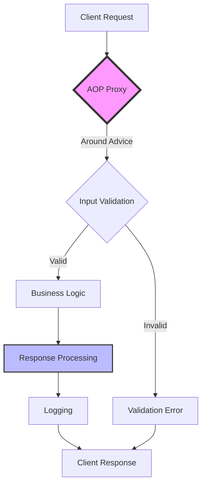
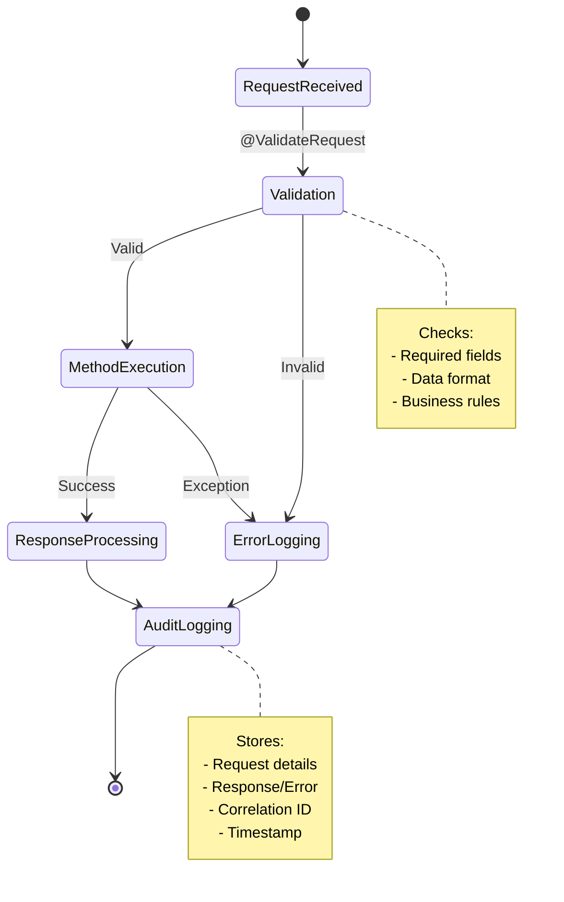
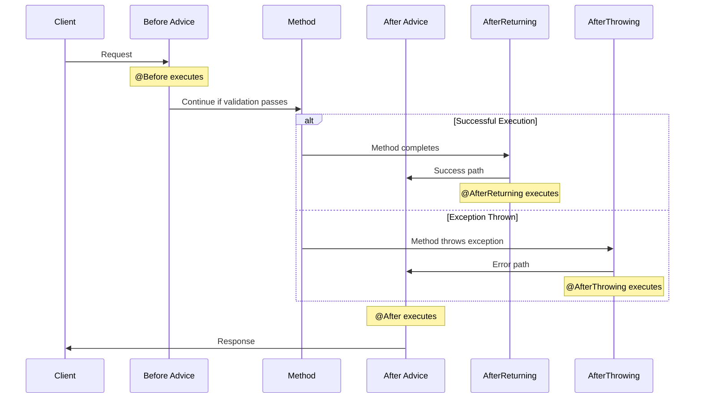
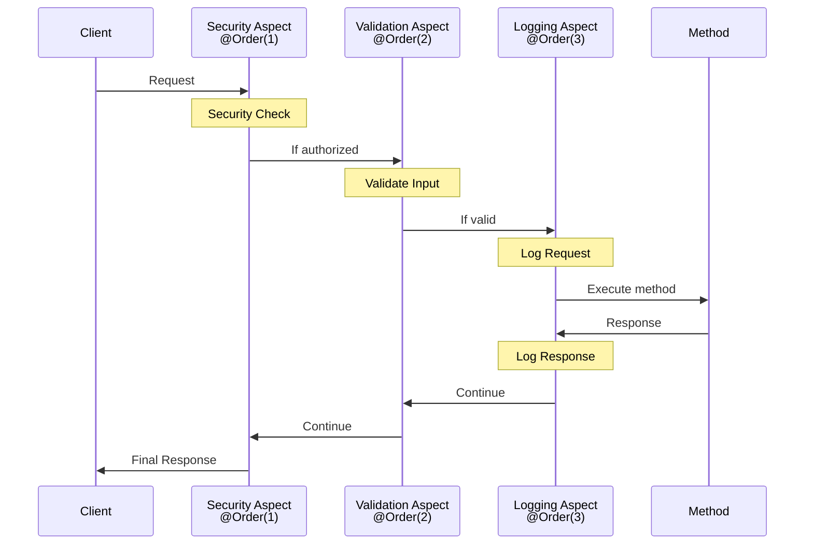

## Introduction
Aspect-Oriented Programming (AOP) in Spring Boot allows developers to handle cross-cutting concerns (common code) such as logging, authentication, and validation in a modular way. AOP helps keep the main business logic clean by separating these concerns into reusable components called aspects.

In this article, we will implement AOP in a Spring Boot application for a `Users and Orders` API. We will define aspects to:
1. Validate incoming requests.
2. Log invalid requests to the database.
3. Log successful request and response details.

As part of auditing, these three steps are common in applications that are expected to keep track of incoming requests and outgoing responses for specific or all important API calls.

## Key AOP Concepts
Before diving into implementation, let's briefly cover some key AOP concepts:

- **Aspect**: A class containing cross-cutting concerns.
- **Advice**: The action taken by an aspect at a specific point (e.g., before, after, or around method execution).
- **Join Point**: A specific point in the execution flow of the application (e.g., method execution).
- **Pointcut**: A predicate that matches join points, defining where advice should be applied.
- **Custom Annotation**: A user-defined annotation that can be used as a pointcut marker for AOP.

## Implementing AOP in a Spring Boot

### Step 1: Define a Custom Annotation for Validate And Logging request and response
```java
@Target(ElementType.METHOD)
@Retention(RetentionPolicy.RUNTIME)
public @interface ValidateRequest {
}
```
This code defines a custom annotation `@ValidateRequest` in Java. The `@Target(ElementType.METHOD)` specifies that this annotation can only be applied to methods.
The `@Retention(RetentionPolicy.RUNTIME)` indicates that the annotation will be available at runtime, allowing it to be accessed through reflection.


### Step 2: Create Users and Orders API Controllers
```java
@RestController
@RequestMapping(value = "/api/orders", produces = MediaType.APPLICATION_JSON_VALUE)
@RequiredArgsConstructor
public class OrderController {
    private final OrderService orderService;

    @GetMapping
    public ResponseEntity<List<OrderDto>> getAllOrders() {
        return ResponseEntity.ok(orderService.findAll());
    }

    @PostMapping
    @ValidateRequest
    public ResponseEntity<Long> createOrder(@RequestBody final OrderDto orderDTO) {
        return new ResponseEntity<>(orderService.create(orderDTO), HttpStatus.CREATED);
    }
}
```

```java
@RestController
@RequestMapping(value = "/api/users", produces = MediaType.APPLICATION_JSON_VALUE)
@RequiredArgsConstructor
public class UserController {
    private final UserService userService;

    @GetMapping
    public ResponseEntity<List<UserDto>> getAllUsers() {
        return ResponseEntity.ok(userService.findAll());
    }

    @PostMapping
    @ValidateRequest
    public ResponseEntity<Long> createUser(@RequestBody final UserDto userDto) {
        return new ResponseEntity<>(userService.create(userDto), HttpStatus.CREATED);
    }
}
```

### Step 3: Define an Aspect for validating and auditing Annotation-Based Pointcuts
```java
@Aspect
@Component
@RequiredArgsConstructor
public class RequestValidationAndAuditingAspect {
    private final AuditRepository auditRepository;
    private final HttpServletRequest requestServlet;
    private final Validator validator;

    @Pointcut("@annotation(dev.pravin.ecombackend.annotations.ValidateRequest)")
    public void validateRequestPointcut() {}

    @Around("validateRequestPointcut() && args(request,..)")
    public Object validateAndAuditRequest(ProceedingJoinPoint joinPoint, Object request) throws Throwable {
        validateRequest(request);
        Object response = joinPoint.proceed();
        auditDetails(request, response);
        return response;
    }

    private void auditDetails(Object request, Object response) {
        String correlationId = this.requestServlet.getHeader("Correlation-Id");
        String requestDetails = request.toString();
        ObjectMapper objectMapper = new ObjectMapper();
        String responseJson = objectMapper.writeValueAsString(response)
        String requestJson = objectMapper.writeValueAsString(request)
        logAudit(correlationId, requestJson, responseJson);
    }

    private void validateRequest(Object request) {
        Set<ConstraintViolation<Object>> violations = validator.validate(request);
        if (!violations.isEmpty()) {
            logBadRequest(request, violations);
            throw new BadRequestException("Invalid request parameters.");
        }
    }

    private void logBadRequest(Object request, Set<ConstraintViolation<Object>> violations) {
        String violationDetails = violations.toString();
        String correlationId = this.requestServlet.getHeader("Correlation-Id");
        auditRepository.save(AuditLog.builder().status("BAD_REQUEST")
                .requestDetails(correlationId + "--" + request.toString())
                .responseDetails(violationDetails)
                .build());
    }

    private void logAudit(String correlationId, String requestDetails, Object response) {
        auditRepository.save(AuditLog.builder().status("SUCCESS")
                .requestDetails(correlationId + "--" + requestDetails)
                .responseDetails(response.toString())
                .build());
    }
}
```
This code defines an aspect `RequestValidationAndAuditingAspect` for validating and auditing requests and responses in a Spring Boot application. 

- The `@Aspect` annotation indicates that this class is an aspect.
- The `@Component` annotation makes it a Spring-managed bean.
- The `@RequiredArgsConstructor` annotation generates a constructor with required arguments.

The aspect contains:
- A pointcut `validateRequestPointcut` that matches methods annotated with `@ValidateRequest`.
- An around advice `validateAndAuditRequest` that:
  - Validates the request using `validateRequest`.
  - Proceeds with the method execution.
  - Audits the request and response using `auditDetails`.

The `auditDetails` method logs the request and response details. The `validateRequest` method validates the request and logs bad requests if there are validation errors. The `logBadRequest` and `logAudit` methods save audit logs to the database.

### Step 4: Create a Database Entity
```java
@Builder
@Entity
@AllArgsConstructor
public class AuditLog {

    @Id
    @GeneratedValue(strategy = GenerationType.IDENTITY)
    private Long id;
    private String status;
    private String requestDetails;
    private String responseDetails;
}
```

### Step 5: Define the Repository for Logging Requests
```java
@Repository
public interface AuditRepository extends JpaRepository<AuditLog, Long> {
}
```
let's visualize the AOP concept and how aspects interact with business logic:


## Explanation of AOP Usage
- **Join Point**: Any execution of a method in `OrderController` and `UserController`.
- **Pointcut**: Defined by `@Pointcut("@annotation(dev.pravin.ecombackend.annotations.ValidateRequest)")` to apply advice for annotated methods in `OrderController` and `UserController`.

## Types of Advice


### Before Advice
- **Description**: This advice runs before the method execution. It is used to perform actions such as logging or security checks before the actual method logic is executed.
- **Example**: Validates the token in the API request for all `RestController` methods.

### After Advice
- **Description**: This advice runs after the method execution, regardless of its outcome. It is useful for cleanup actions or logging that should happen whether the method succeeds or fails.
- **Example**: Logs a message after the method execution.

### AfterReturning Advice
- **Description**: This advice runs after the method successfully returns a result. It can be used to log the return value or perform actions based on the result.
- **Example**: Tracks successful API calls as part of observability.

### AfterThrowing Advice
- **Description**: This advice runs if the method throws an exception. It is useful for logging errors or performing actions in response to an error.
- **Example**: Tracks failed API calls and logs the HTTP status code.

### Around Advice
- **Description**: This advice runs before and after the method execution. It can control whether the method executes at all, and can modify the return value or throw an exception.
- **Example**: Validates the request and audits the request and response.

### AOP Advice Execution Sequence


## More Examples for Different Types of Advice
### Before Advice
This advice runs before the method execution. Let's take a simple example that validates the token in the API request for all `RestController` methods.

```java
@Service
@RequiredArgsConstructor
public class TokenValidationService {
    private final HttpServletRequest requestServlet;

    public boolean validateToken(String authToken) {
        if (authToken == null || !isValid(authToken)) {
            return false;
        }
        return true;
    }

    private boolean isValid(String token) {
        // token validation logic
        return true; // Return true if valid, false otherwise
    }
}

@Aspect
@Component
@RequiredArgsConstructor
public class TokenValidationAspect {
    private final TokenValidationService tokenValidationService;

    @Pointcut("within(@org.springframework.web.bind.annotation.RestController *)")
    public void controllerMethods() {}

    @Before("controllerMethods()")
    public void validateToken(JoinPoint joinPoint) {
        if (!tokenValidationService.validateToken()) {
            throw new UnauthorizedException("Invalid or missing authentication token.");
        }
    }
}
```

### After Advice
This advice runs after the method execution, regardless of its outcome.
```java
@After("validateRequestPointcut()")
public void logAfter(JoinPoint joinPoint) {
    System.out.println("After method: " + joinPoint.getSignature().getName());
}
```

### AfterReturning And AfterThrowing Advice
AfterReturning advice runs after the method successfully returns a result, and AfterThrowing advice runs if the method throws an exception. Let's take an example of tracking the API call as part of observability.

```xml
<dependency>
    <groupId>io.micrometer</groupId>
    <artifactId>micrometer-core</artifactId>
</dependency>
<dependency>
    <groupId>io.micrometer</groupId>
    <artifactId>micrometer-registry-prometheus</artifactId>
</dependency>
```

```java
@Aspect
@Component
@RequiredArgsConstructor
public class ApiHealthAspect {
    private final MeterRegistry meterRegistry;

    @Pointcut("within(@org.springframework.web.bind.annotation.RestController *)")
    public void controllerMethods() {}

    @AfterReturning(pointcut = "controllerMethods()", returning = "result")
    public void logAfterReturning(JoinPoint joinPoint, Object result) {
        String apiName = joinPoint.getSignature().getName();
        meterRegistry.counter("api.success", "api", apiName).increment();
    }

    @AfterThrowing(pointcut = "controllerMethods()", throwing = "error")
    public void logAfterThrowing(JoinPoint joinPoint, Throwable error) {
        String apiName = joinPoint.getSignature().getName();
        meterRegistry.counter("api.failure", "api", apiName, "status", getStatus(error)).increment();
    }

    private String getStatus(Throwable error) {
        if (error instanceof BadRequestException) {
            return "4xx";
        } else {
            return "5xx";
        }
    }
}
```

## Comparison: Annotation-Based vs. Regular Expression-Based Pointcuts

| Criteria              | Annotation-Based (`@ValidateRequest`) | Regex-Based (`execution(..)`) |
|----------------------|--------------------------------|--------------------------------|
| **Granularity**      | More flexible, can be applied selectively | Matches all methods matching the pattern |
| **Code Intrusiveness** | Requires modifying methods with annotations | No modifications needed in the target methods |
| **Maintainability**  | Easier to manage since it explicitly marks important methods | Might require frequent updates if method signatures change |
| **Performance**      | Slightly better as only annotated methods are intercepted | Can be less efficient if applied broadly |
| **Use Case**        | Best for selective logging where explicit annotation is preferred | Best for applying to multiple methods with a common pattern |

## Aspect Ordering with @Order
In Spring AOP, you can control the order in which aspects are applied using the `@Order` annotation. This is useful when you have multiple aspects that should be applied in a specific sequence.

### Example code
```java
@Aspect
@Component
@Order(1)
public class FirstAspect {
    @Before("execution(* dev.pravin.ecombackend.service.*.*(..))")
    public void beforeAdvice(JoinPoint joinPoint) {
        System.out.println("First Aspect - Before method: " + joinPoint.getSignature().getName());
    }
}

@Aspect
@Component
@Order(2)
public class SecondAspect {
    @Before("execution(* dev.pravin.ecombackend.service.*.*(..))")
    public void beforeAdvice(JoinPoint joinPoint) {
        System.out.println("Second Aspect - Before method: " + joinPoint.getSignature().getName());
    }
}
```
In this example, FirstAspect will be applied before SecondAspect due to the @Order annotation.

### AOP order Sequence


## When to Use Which?
- **Use annotation-based pointcuts** when you need explicit control over which methods should be intercepted.
- **Use regex-based execution pointcuts** when you want to apply AOP to multiple methods following a common pattern without modifying the source code.

## Best Practices and Design Patterns
### Design Patterns Commonly Used with AOP
1. **Proxy Pattern**: AOP uses the proxy pattern to create a proxy object that wraps the target object and intercepts method calls.
2. **Decorator Pattern**: Similar to the proxy pattern, the decorator pattern adds additional behavior to objects dynamically.
3. **Chain of Responsibility**: Multiple aspects can be applied in a chain, where each aspect handles a specific concern.

### Anti-Patterns to Avoid
1. **Overusing Aspects**: Avoid using aspects for every cross-cutting concern. Use them judiciously to prevent code complexity.
2. **Tight Coupling**: Ensure that aspects are loosely coupled with the business logic. Avoid direct dependencies between aspects and business classes.
3. **Performance Impact**: Be mindful of the performance impact of aspects, especially if they are applied to frequently called methods.

### Guidelines for Aspect Design
1. **Single Responsibility**: Each aspect should handle a single cross-cutting concern to promote modularity and maintainability.
2. **Reusability**: Design aspects to be reusable across different parts of the application.
3. **Granularity**: Use fine-grained pointcuts to apply aspects selectively and avoid broad application that can impact performance.
4. **Testing**: Thoroughly test aspects to ensure they work as expected and do not introduce unintended side effects.

## Conclusion

In this article, we demonstrated how **Aspect-Oriented Programming (AOP)** in Spring Boot can handle cross-cutting concerns like request validation and auditing. By using custom annotations, pointcuts, and aspects, AOP keeps the business logic clean while modularizing tasks such as validation and logging.

We also compared **annotation-based** and **regex-based** pointcuts. Annotation-based pointcuts offer precise control for selective interception, while regex-based pointcuts can apply AOP broadly. 

Overall, AOP helps improve code maintainability and separation of concerns in Spring Boot applications.