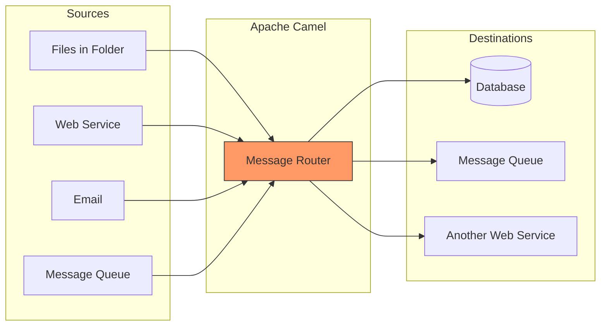
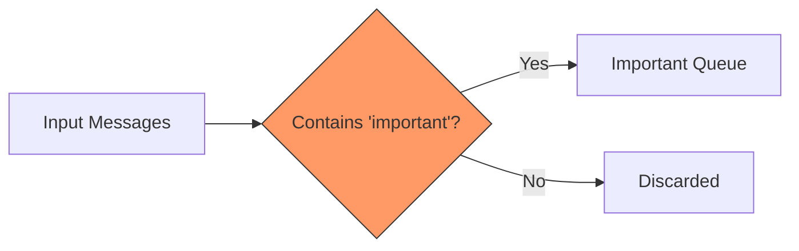
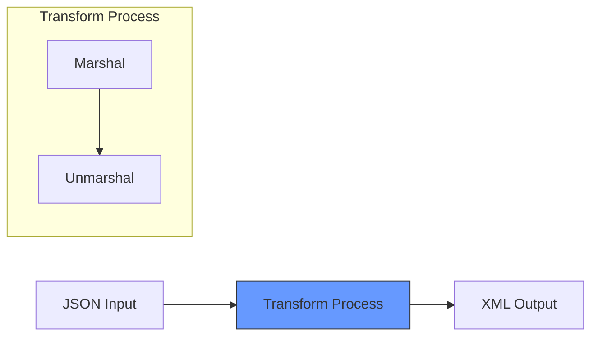
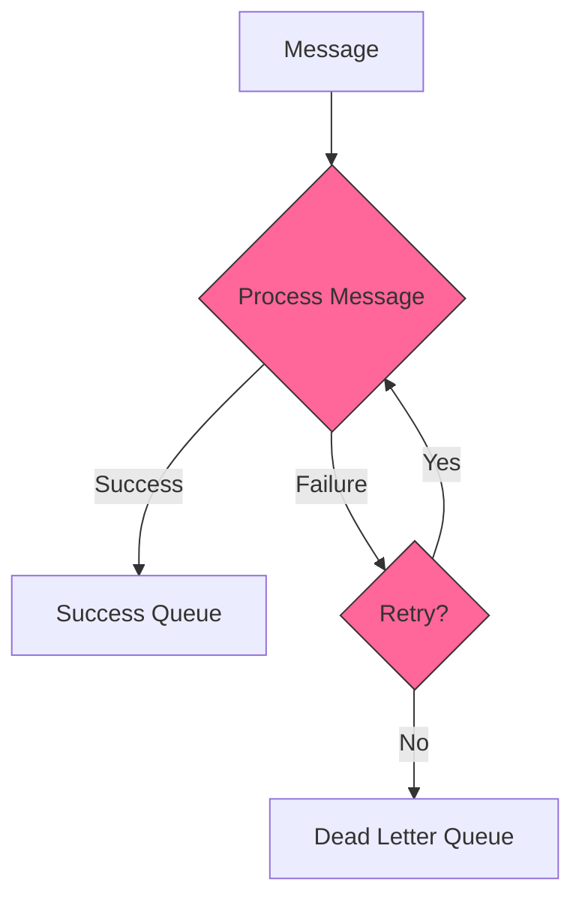
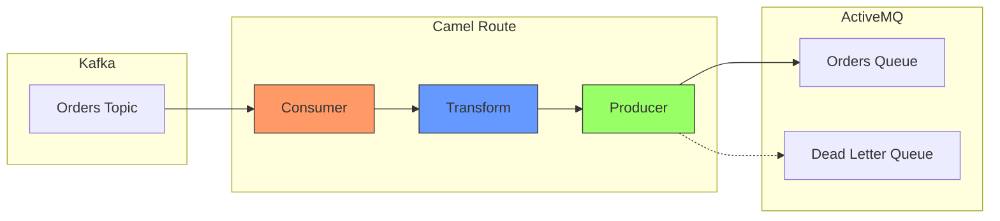
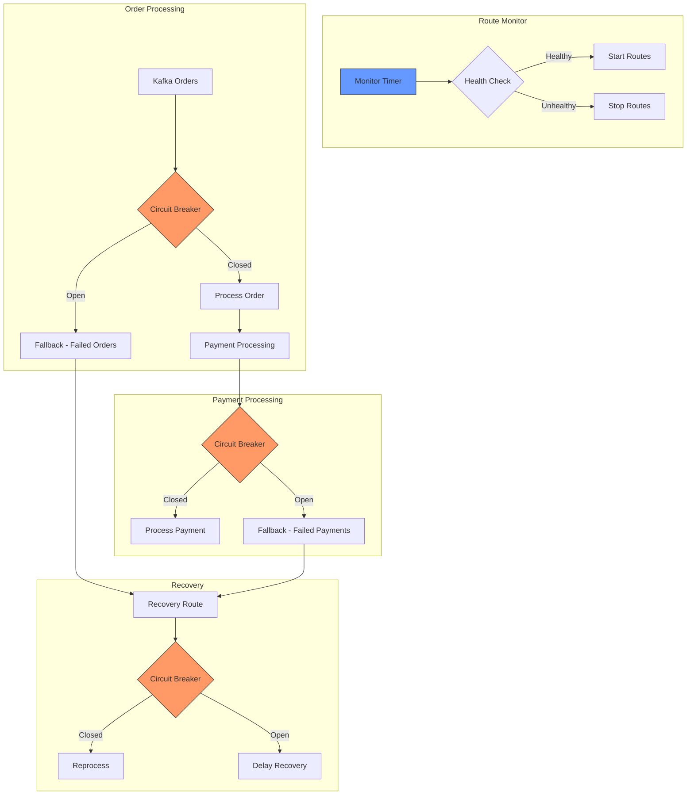
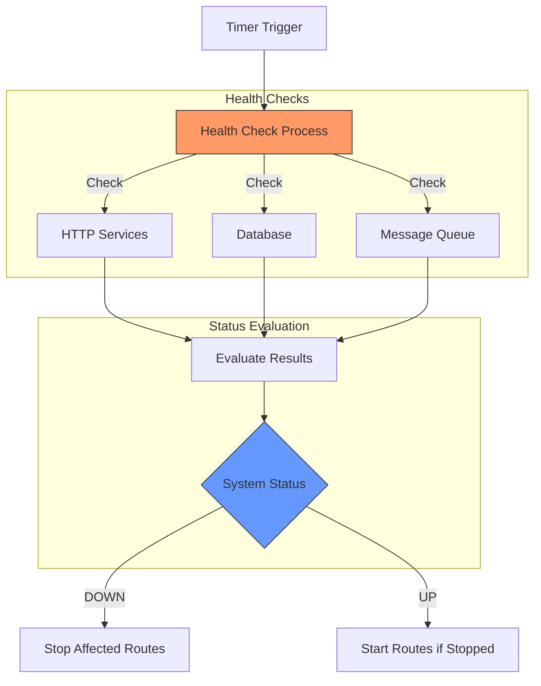

## Table of Contents
1. [Introduction to Apache Camel](#introduction)
2. [Understanding Camel Routes](#camel-routes)
3. [Essential Integration Patterns](#integration-patterns)
4. [Real-World Integration Examples](#real-world-examples)
5. [Advanced System Management](#advanced-management)
6. [Health Check](#health-checks)

## Introduction {#introduction}

Apache Camel is like a universal translator and message router for different software systems. Think of it as a postal service for your applications - it picks up messages from one place, maybe transforms them, and delivers them to another place.



## Understanding Camel Routes {#camel-routes}

A Camel route is like a set of instructions telling Camel how to move messages from point A to point B. Here's a simple example:

```java
// This route moves files from an 'orders' folder to a 'processed' folder
from("file:orders")              // 1. Watch the 'orders' folder for new files
    .log("Found file: ${file:name}")  // 2. Log the filename
    .to("file:processed");       // 3. Move the file to 'processed' folder

// This route reads files and sends important ones to a different place
from("file:inbox")               // 1. Watch the 'inbox' folder
    .choice()                    // 2. Make a decision based on file content
        .when(simple("${file:name} contains 'urgent'"))  // 3. If filename has 'urgent'
            .to("direct:urgent")                         // 4. Send to urgent processor
        .otherwise()                                     // 5. If not urgent
            .to("direct:normal");                        // 6. Send to normal processor

```
Let's break down what this code does:
- The first route is like having someone watch a folder called "orders" for new files, and when they find one, they log its name and move it to a "processed" folder.
- The second route shows how to make decisions - it's like a mail sorter who looks at each envelope and sends urgent mail to one place and regular mail to another.

## Essential Integration Patterns {#integration-patterns}

### 1. Content-Based Router
Routes messages based on their content:

```java
from("file:incoming-orders")
    .choice()
        .when(simple("${body.orderType} == 'RUSH'"))
            .to("direct:rush-orders")
        .otherwise()
            .to("direct:regular-orders")
    .end();
```
This pattern is like a traffic controller that:
1. Examines the content of each message (the orderType)
2. Routes rush orders one way
3. Routes regular orders another way


### 2. Filter Pattern
Filters messages based on criteria:

```java
from("direct:start")
    .filter(simple("${body} contains 'important'"))
    .to("direct:important-messages");
```
This pattern works like a sieve that:
1. Examines each message
2. Only lets through messages matching certain criteria
3. Discards or ignores non-matching messages


### 3. Transformer Pattern
Converts messages between formats:

```java
from("direct:start")
    .marshal().json()
    .unmarshal().xml()
    .to("direct:xml-processor");
```
This pattern acts like a format converter that:
1. Takes input in one format (like JSON)
2. Transforms it to another format (like XML)
3. Useful when connecting systems that speak different "languages"


### 4. Dead Letter Channel Pattern
Handles failed messages by moving them to a Dead Letter Queue (DLQ).


```java
errorHandler(deadLetterChannel("direct:dead-letter")
  .maximumRedeliveries(3)
  .redeliveryDelay(1000)
  .backOffMultiplier(2));

from("direct:start")
  .to("direct:possibly-failing-service")
  .log("Message processed successfully");
```
This pattern works like a safety net that:
1. Attempts to process a message.
2. If processing fails, retries up to 3 times.
3. Increases the delay between retries.
4. If all retries fail, moves the message to a "dead letter" queue for further investigation.


### 5. Splitter Pattern
Splits a single message into multiple messages:

```java
from("direct:start")
  .split(body().tokenize(","))
  .to("direct:process-split-message");
```

This pattern works like a paper cutter that:
1. Takes a single message containing multiple items (e.g., a comma-separated list)
2. Splits it into individual messages for each item
3. Processes each item separately

### 6. Aggregator Pattern
Combines multiple messages into a single message:

```java
from("direct:start")
  .aggregate(header("orderId"), new GroupedExchangeAggregationStrategy())
  .completionSize(5)
  .to("direct:process-aggregated-message");
```

This pattern works like a collector that:
1. Groups messages based on a common attribute (e.g., orderId)
2. Aggregates them into a single message once a condition is met (e.g., 5 messages received)
3. Processes the aggregated message


### 7. Wire Tap Pattern (Logging Implementation)
```java
from("file:incoming-orders")
    .wireTap("direct:audit-log")      
    .log("Received order: ${file:name}")
    .to("direct:process-order");

from("direct:audit-log")
    .log("Audit: ${file:name} received at ${date:now:yyyy-MM-dd HH:mm:ss}")
    .to("file:audit-logs");
```
This pattern works like a phone tap that:
1. Creates a copy of each message
2. Sends the copy to a logging/monitoring system
3. Allows the original message to continue its journey
4. Useful for audit trails and monitoring


### 8. Error handler
```java
from("direct:start")
    .errorHandler(defaultErrorHandler()
        .maximumRedeliveries(3)
        .redeliveryDelay(1000))
    .to("direct:possibly-failing-service")
    .log("Message processed successfully");
```
This pattern help implement simple error handling,
1. Like a persistent delivery person who tries multiple times if nobody answers the door
2. If sending a message fails, it will retry up to 3 times
3. Between each retry, it waits for 1 second
4. If all retries fail, it gives up and reports an error


## Real-World Integration Examples {#real-world-examples}
Here's an example that tries to show different patterns in use.
```java
// Order Processing Route
from("file:incoming-orders")     // 1. Watch 'incoming-orders' folder for new files
    .log("Received order: ${file:name}")  // 2. Log when we find a new order
    
    // 3. Convert the file content to JSON
    .unmarshal().json()          
    
    // 4. Add current timestamp to the order
    .setHeader("ProcessingTime", simple("${date:now:yyyy-MM-dd HH:mm:ss}"))
    
    // 5. Make decisions based on order type
    .choice()
        .when(simple("${body.orderType} == 'RUSH'"))
            .log("Rush order detected!")
            .to("direct:rush-orders")
        .otherwise()
            .log("Regular order received")
            .to("direct:regular-orders")
    .end()
    
    // 6. Move processed file to archive
    .to("file:processed-orders");

// Rush Order Handler
from("direct:rush-orders")
    .log("Processing rush order")
    .to("direct:notify-shipping")
    .to("direct:update-inventory");

// Regular Order Handler
from("direct:regular-orders")
    .log("Processing regular order")
    .delay(simple("${random(1000,5000)}"))  // Simulate processing time
    .to("direct:update-inventory");

```
Let's break down what this order processing system does:

1. File Monitoring:
   - Watches a folder called "incoming-orders" for new order files
   - When a new file appears, it starts processing it

2. Initial Processing:
   - Logs the filename so we know which order is being processed
   - Converts the file content from JSON format (like a digital order form)

3. Adding Information:
   - Adds a timestamp to track when the order was processed

4. Decision Making:
   - Checks if it's a rush order or regular order
   - Rush orders get special handling
   - Regular orders follow the normal process

5. Different Handling:
   - Rush orders: Immediately notify shipping and update inventory
   - Regular orders: Process with some delay and update inventory

6. File Management:
   - Moves the processed order file to a different folder for record-keeping

This example shows how Camel can:
- Monitor folders for new files
- Make decisions based on content
- Process different types of orders differently
- Keep track of what's happening (logging)
- Archive processed files

In previous example, different patterns work together to create a robust system:

1. **Content-Based Router** sorts orders into rush and regular
2. **Wire Tap** logs all activities for monitoring
3. **Transformer** converts file contents into processable formats
4. **Dead Letter Channel** handles any processing failures
5. **Filter** could be used to only process orders meeting certain criteria

These patterns are like building blocks that can be combined in different ways to handle various integration scenarios. They help solve common problems in a standardized way, making the system more maintainable and reliable.

### Kafka to ActiveMQ Integration

This example demonstrates consuming messages from Kafka and pushing them to ActiveMQ:

```java
import org.apache.camel.builder.RouteBuilder;
import org.apache.camel.component.kafka.KafkaConstants;
import org.apache.camel.LoggingLevel;

public class KafkaToMQRoute extends RouteBuilder {
    @Override
    public void configure() throws Exception {
        // Error Handler Configuration
        errorHandler(deadLetterChannel("activemq:queue:dead.letter")
            .maximumRedeliveries(3)
            .redeliveryDelay(1000)
            .backOffMultiplier(2)
            .useExponentialBackOff()
            .logRetryAttempted(true));

        // Main route: Kafka → ActiveMQ
        from("kafka:orders-topic?" +
             "brokers=localhost:9092" +           
             "&groupId=orders-group" +            
             "&autoOffsetReset=earliest" +        
             "&consumersCount=3" + 
             "&maxPollRecords=100")
            // Add correlation ID for tracking
            .setHeader("correlationId", simple("${random(1000,9999)}"))
            .log(LoggingLevel.INFO, "Received from Kafka: ${body} with key: ${headers[kafka.KEY]}")
            .process(exchange -> {
                // Example message transformation
                String kafkaMessage = exchange.getIn().getBody(String.class);
                OrderMessage order = convertToOrderMessage(kafkaMessage);
                exchange.getIn().setBody(order);
            })
            .setHeader("JMSPriority", simple("${headers[kafka.PRIORITY]}"))
            // Send to ActiveMQ queue
            .to("activemq:queue:orders?" +
                "timeToLive=86400000" +           
                "&deliveryPersistent=true")
            .log(LoggingLevel.INFO, "Successfully sent to ActiveMQ: ${header.correlationId}");

        // Dead Letter Queue Handler
        from("activemq:queue:dead.letter")
            .log(LoggingLevel.ERROR, 
                 "Failed to process message: ${body}. Error: ${exception.message}")
            .process(handleError)
            .to("activemq:queue:failed.orders");
    }

    private OrderMessage convertToOrderMessage(String kafkaMessage) {
        //conversion logic here
        return new OrderMessage(/* converted message */);
    }
}

@Getter
@Setter
@Builder
class OrderMessage {
    private String orderId;
    private String customerInfo;
    private Double amount;
}

```

Let's break down this example in detail:

1. **Main Components**:
   - Kafka Consumer: Reads messages from a Kafka topic named "orders-topic"
   - Message Transformer: Converts Kafka messages to ActiveMQ format
   - ActiveMQ Producer: Sends messages to ActiveMQ queue named "orders"

2. **Kafka Consumer Configuration**:
   ```java
   "kafka:orders-topic?brokers=localhost:9092" +           
             "&groupId=orders-group" +            
             "&autoOffsetReset=earliest" +        
             "&consumersCount=3" + 
             "&maxPollRecords=100"
   ```
   - `brokers`: Kafka server address
   - `groupId`: Consumer group for load balancing
   - `autoOffsetReset`: Start reading position
   - `consumersCount`: Number of parallel consumers
   - `maxPollRecords`: Batch size for each poll

3. **Error Handling**:
   ```java
   errorHandler(deadLetterChannel("activemq:queue:dead.letter")
   ```
   - Retries failed messages 3 times
   - Uses exponential backoff (delays increase between retries)
   - Failed messages go to a dead letter queue

4. **Message Processing**:
   - Adds correlation ID for tracking
   - Logs incoming messages
   - Transforms message format
   - Sets JMS properties

5. **ActiveMQ Configuration**:
   ```java
   activemq:queue:orders?timeToLive=86400000
   ```
   - Sets message expiry time (24 hours)
   - Uses persistent delivery for reliability

Here's a visualization of the message flow:



To use this route, you would need:

1. Dependencies in your `pom.xml`:  

```xml
<dependencies>
    <dependency>
        <groupId>org.apache.camel</groupId>
        <artifactId>camel-kafka</artifactId>
    </dependency>
    <dependency>
        <groupId>org.apache.camel</groupId>
        <artifactId>camel-activemq</artifactId>
    </dependency>
</dependencies>

```

2. Configure connection properties in your application.properties:  

```properties
kafka.bootstrap.servers=localhost:9092
activemq.broker.url=tcp://localhost:61616

```

Some key features of this implementation:
- Reliable message delivery with retry mechanism
- Message tracking with correlation IDs
- Comprehensive logging
- Dead letter queue for failed messages
- Scalable with multiple consumers
- Message transformation capability

## Advanced System Management {#advanced-management}
System outages are common and can impact your services. One common approach is to use circuit breakers and route-level control to manage system outages.

### Circuit Breaker

```java
// Order Processing Route with Circuit Breaker
from("kafka:orders-topic")
    .routeId("order-processing-route")
    .circuitBreaker()
        .resilience4jConfiguration()
            .failureRateThreshold(50)
            // 50% failure rate to open circuit
            .waitDurationInOpenState(10000)
            // Wait 10 seconds in open state
        .end()
        .to("http://order-service/api/orders")
    .onFallback()
        .to("kafka:failed-orders")
    .end();
```
This code sets up a route in Apache Camel that reads messages from a Kafka topic named `orders-topic`. It uses a circuit breaker pattern to handle failures gracefully. If the failure rate exceeds 50%, the circuit breaker will open and stop sending requests to the primary endpoint (http://order-service/api/orders) for 10 seconds. During this time, any incoming messages will be sent to a fallback Kafka topic named `failed-orders`. This helps to prevent overwhelming the order service with requests when it is experiencing issues.

Implementing the circuit breaker pattern in a route is quite straightforward as it is provided out of the box by Camel.

Let's take another example to understand how we can apply this in a Camel route.

```java
import org.apache.camel.builder.RouteBuilder;
import org.apache.camel.model.CircuitBreakerDefinition;
import org.apache.camel.builder.DeadLetterChannelBuilder;
import org.apache.camel.LoggingLevel;

public class MultiRouteWithCircuitBreaker extends RouteBuilder {
    
    private static final int THRESHOLD = 5;
    private static final int HALF_OPEN_AFTER = 10000;
    
    @Override
    public void configure() throws Exception {
        // Global error handler
        errorHandler(deadLetterChannel("direct:errorHandler")
            .maximumRedeliveries(3)
            .redeliveryDelay(1000)
            .useExponentialBackOff()
            .logRetryAttempted(true));

        // Route Control and Monitoring
        from("timer:routeMonitor?period=60000")
            .routeId("monitor-route")
            .process(exchange -> {
                checkDestinationHealth(exchange);
            })
            .choice()
                .when(header("systemStatus").isEqualTo("DOWN"))
                    .process(exchange -> {
                        // Stop affected routes
                        getContext().getRouteController().stopRoute("order-processing-route");
                        getContext().getRouteController().stopRoute("payment-processing-route");
                    })
                .otherwise()
                    .process(exchange -> {
                        // Start routes if they're stopped
                        if (!getContext().getRouteController().getRouteStatus("order-processing-route").isStarted()) {
                            getContext().getRouteController().startRoute("order-processing-route");
                        }
                        if (!getContext().getRouteController().getRouteStatus("payment-processing-route").isStarted()) {
                            getContext().getRouteController().startRoute("payment-processing-route");
                        }
                    });

        // Order Processing Route with Circuit Breaker
        from("kafka:orders-topic")
            .routeId("order-processing-route")
            .circuitBreaker()
                .resilience4jConfiguration()
                    .failureRateThreshold(50)
                    .waitDurationInOpenState(10000)
                    .minimumNumberOfCalls(10)       // Minimum calls before calculating failure rate
                .end()
                .log("Processing order: ${body}")
                .to("http://order-service/api/orders")
                .to("direct:payment-processor")
            .onFallback()
                .log(LoggingLevel.ERROR, "Circuit Breaker triggered for order processing")
                .to("kafka:failed-orders")
            .end();

        // Payment Processing Route with Circuit Breaker
        from("direct:payment-processor")
            .routeId("payment-processing-route")
            .circuitBreaker()
                .resilience4jConfiguration()
                    .failureRateThreshold(50)
                    .waitDurationInOpenState(10000)
                .end()
                .log("Processing payment for order")
                .to("http://payment-service/api/process")
            .onFallback()
                .log(LoggingLevel.ERROR, "Circuit Breaker triggered for payment processing")
                .to("kafka:failed-payments")
            .end();

        // Error Handler Route
        from("direct:errorHandler")
            .routeId("error-handler-route")
            .log(LoggingLevel.ERROR, "Error processing message: ${exception.message}")
            .choice()
                .when(header("routeId").isEqualTo("order-processing-route"))
                    .to("kafka:failed-orders")
                .when(header("routeId").isEqualTo("payment-processing-route"))
                    .to("kafka:failed-payments")
                .otherwise()
                    .to("kafka:dead-letter-queue");

        // Recovery Route - Processes failed messages when system recovers
        from("kafka:failed-orders")
            .routeId("recovery-route")
            .circuitBreaker()
                .resilience4jConfiguration()
                    .failureRateThreshold(50)
                    .waitDurationInOpenState(30000)
                .end()
                .log("Attempting to recover failed order")
                .to("http://order-service/api/orders")
            .onFallback()
                .log(LoggingLevel.ERROR, "Recovery still not possible")
            .end();
    }
}

```

Let's visualize the route structure and circuit breaker flow:  


Key features of this implementation:

1. **Route Monitoring**:
   - Periodic health checks of destination systems
   - Automatic route stopping/starting based on system health
   - Configurable monitoring intervals

2. **Circuit Breaker Pattern**:
   - Uses Resilience4j for circuit breaker implementation
   - Configurable failure thresholds and recovery times
   - Separate circuit breakers for different routes
   - Fallback mechanisms for handling failures

3. **Multiple Routes**:
   - Order processing route
   - Payment processing route
   - Error handling route
   - Recovery route

4. **Error Handling**:
   - Dead letter channel for failed messages
   - Different error queues for different types of failures
   - Retry mechanism with exponential backoff

5. **Recovery Mechanism**:
   - Separate route for processing failed messages
   - Circuit breaker protection for recovery attempts
   - Longer wait times during recovery

To use this in your application:

1. Add dependencies to `pom.xml`:  

```xml
<dependencies>
    <dependency>
        <groupId>org.apache.camel</groupId>
        <artifactId>camel-resilience4j</artifactId>
    </dependency>
    <dependency>
        <groupId>org.apache.camel</groupId>
        <artifactId>camel-kafka</artifactId>
    </dependency>
</dependencies>
```
{: file='pom.xml'}

2. Configure in `application.properties`:  

```properties
# Circuit Breaker Configuration
camel.circuitbreaker.threshold=5
camel.circuitbreaker.half-open-after=10000

# Kafka Configuration
kafka.bootstrap.servers=localhost:9092

# Health Check Configuration
health.check.interval=60000
```
{: file='application.properties'}

## Health Check (Optional) {#health-checks}

In the previous example, we saw how based on a health check we can stop and start routes. The timer will invoke the health check route at fixed intervals. Let's zoom into the implementation of the health check and see how it can be implemented to consider various different systems.

```java
import org.apache.camel.Exchange;
import org.apache.camel.builder.RouteBuilder;
import org.apache.http.client.config.RequestConfig;
import org.apache.http.impl.client.CloseableHttpClient;
import org.apache.http.impl.client.HttpClientBuilder;
import org.apache.http.client.methods.HttpGet;
import javax.sql.DataSource;
import java.sql.Connection;
import java.util.HashMap;
import java.util.Map;
import java.net.Socket;
import lombok.extern.slf4j.Slf4j;

@Slf4j
public class HealthCheckRoute extends RouteBuilder {
    private static final int TIMEOUT = 5000;
    private static final String ORDER_SERVICE_URL = "http://order-service/health";
    private static final String PAYMENT_SERVICE_URL = "http://payment-service/health";
    private static final String MQ_HOST = "localhost";
    private static final int MQ_PORT = 61616;
    
    private final DataSource dataSource;

    public HealthCheckRoute(DataSource dataSource) {
        this.dataSource = dataSource;
    }

    @Override
    public void configure() throws Exception {
        from("timer:routeMonitor?period=60000")
            .routeId("health-check-route")
            .process(this::checkDestinationHealth)
            .choice()
                .when(header("systemStatus").isEqualTo("DOWN"))
                    .log("System status is DOWN. Stopping routes...")
                    .process(exchange -> stopAffectedRoutes(exchange))
                .otherwise()
                    .log("System status is UP. Starting routes if needed...")
                    .process(exchange -> startRoutes(exchange));
    }

    private void checkDestinationHealth(Exchange exchange) {
        Map<String, ServiceHealth> healthResults = new HashMap<>();
        
        // Check each service and store results
        healthResults.put("orderService", checkHttpService(ORDER_SERVICE_URL));
        healthResults.put("paymentService", checkHttpService(PAYMENT_SERVICE_URL));
        healthResults.put("database", checkDatabase());
        healthResults.put("messageQueue", checkMessageQueue());
        
        // Determine overall system status
        boolean isSystemHealthy = healthResults.values().stream()
                .allMatch(ServiceHealth::isHealthy);
        
        // Set headers with detailed health information
        exchange.getIn().setHeader("systemStatus", isSystemHealthy ? "UP" : "DOWN");
        exchange.getIn().setHeader("healthResults", healthResults);
        
        // Store specific service statuses for granular route control
        exchange.getIn().setHeader("orderServiceStatus", 
            healthResults.get("orderService").isHealthy() ? "UP" : "DOWN");
        exchange.getIn().setHeader("paymentServiceStatus", 
            healthResults.get("paymentService").isHealthy() ? "UP" : "DOWN");
    }

    private ServiceHealth checkHttpService(String url) {
        try (CloseableHttpClient client = createHttpClient()) {
            HttpGet request = new HttpGet(url);
            int responseCode = client.execute(request)
                    .getStatusLine()
                    .getStatusCode();
            
            boolean isHealthy = responseCode >= 200 && responseCode < 300;
            return new ServiceHealth(
                isHealthy,
                isHealthy ? "Service responding normally" : 
                           "Service returned status code: " + responseCode
            );
        } catch (Exception e) {
            log.error("Error checking HTTP service {}: {}", url, e.getMessage());
            return new ServiceHealth(false, "Service check failed: " + e.getMessage());
        }
    }

    private ServiceHealth checkDatabase() {
        try (Connection conn = dataSource.getConnection()) {
            boolean isValid = conn.isValid(TIMEOUT);
            return new ServiceHealth(
                isValid,
                isValid ? "Database connection is valid" : 
                         "Database connection test failed"
            );
        } catch (Exception e) {
            log.error("Database health check failed: {}", e.getMessage());
            return new ServiceHealth(false, "Database check failed: " + e.getMessage());
        }
    }

    private ServiceHealth checkMessageQueue() {
        try (Socket socket = new Socket(MQ_HOST, MQ_PORT)) {
            boolean isConnected = socket.isConnected();
            return new ServiceHealth(
                isConnected,
                isConnected ? "Message queue is accessible" : 
                             "Could not connect to message queue"
            );
        } catch (Exception e) {
            log.error("Message queue health check failed: {}", e.getMessage());
            return new ServiceHealth(false, "Message queue check failed: " + e.getMessage());
        }
    }

    private CloseableHttpClient createHttpClient() {
        RequestConfig config = RequestConfig.custom()
                .setConnectTimeout(TIMEOUT)
                .setConnectionRequestTimeout(TIMEOUT)
                .setSocketTimeout(TIMEOUT)
                .build();
                
        return HttpClientBuilder.create()
                .setDefaultRequestConfig(config)
                .build();
    }

    private void stopAffectedRoutes(Exchange exchange) {
        Map<String, ServiceHealth> healthResults = 
            exchange.getIn().getHeader("healthResults", Map.class);
        
        try {
            if (!healthResults.get("orderService").isHealthy()) {
                getContext().getRouteController().stopRoute("order-processing-route");
                log.info("Stopped order-processing-route due to health check failure");
            }
            
            if (!healthResults.get("paymentService").isHealthy()) {
                getContext().getRouteController().stopRoute("payment-processing-route");
                log.info("Stopped payment-processing-route due to health check failure");
            }
        } catch (Exception e) {
            log.error("Error stopping routes: {}", e.getMessage());
        }
    }

    private void startRoutes(Exchange exchange) {
        Map<String, ServiceHealth> healthResults = 
            exchange.getIn().getHeader("healthResults", Map.class);
            
        try {
            if (healthResults.get("orderService").isHealthy() && 
                !getContext().getRouteController()
                    .getRouteStatus("order-processing-route").isStarted()) {
                getContext().getRouteController().startRoute("order-processing-route");
                log.info("Started order-processing-route after health check recovery");
            }
            
            if (healthResults.get("paymentService").isHealthy() && 
                !getContext().getRouteController()
                    .getRouteStatus("payment-processing-route").isStarted()) {
                getContext().getRouteController().startRoute("payment-processing-route");
                log.info("Started payment-processing-route after health check recovery");
            }
        } catch (Exception e) {
            log.error("Error starting routes: {}", e.getMessage());
        }
    }
}

@lombok.Value
class ServiceHealth {
    boolean healthy;
    String message;
}

```

### Health Check Visualization

Key points about the implementation:

1. **Health Check Process**:
   - Checks multiple services: HTTP endpoints, database, message queue
   - Each check has a timeout (5 seconds)
   - Results are stored in a `ServiceHealth` object containing:
     - `healthy`: boolean status
     - `message`: detailed status message

2. **Status Headers**:
   - `systemStatus`: Overall system status ("UP" or "DOWN")
   - `healthResults`: Map containing detailed health check results
   - `orderServiceStatus`: Specific status for order service
   - `paymentServiceStatus`: Specific status for payment service

3. **Route Control**:
   - Routes are stopped/started based on their specific service health
   - Order processing route depends on order service health
   - Payment processing route depends on payment service health

To use this implementation:

1. Add required dependencies:  

```xml
<dependencies>
    <dependency>
        <groupId>org.apache.httpcomponents</groupId>
        <artifactId>httpclient</artifactId>
    </dependency>
    <dependency>
        <groupId>org.projectlombok</groupId>
        <artifactId>lombok</artifactId>
    </dependency>
</dependencies>
```

2. Configure in `application.properties`:  

```properties
# Health Check Configuration
health.check.timeout=5000
health.check.order.service.url=http://order-service/health
health.check.payment.service.url=http://payment-service/health
health.check.mq.host=localhost
health.check.mq.port=61616
```

## Conclusion

Apache Camel provides a powerful framework for implementing enterprise integration patterns. By combining these patterns with robust system management features like circuit breakers and health checks, you can build reliable, scalable integration solutions.

Remember to always:
- Implement proper error handling
- Monitor system health
- Use circuit breakers to prevent cascade failures
- Maintain clear logging and monitoring
- Consider message persistence and reliability requirements

For more information, visit the [Apache Camel documentation](https://camel.apache.org/documentation/).