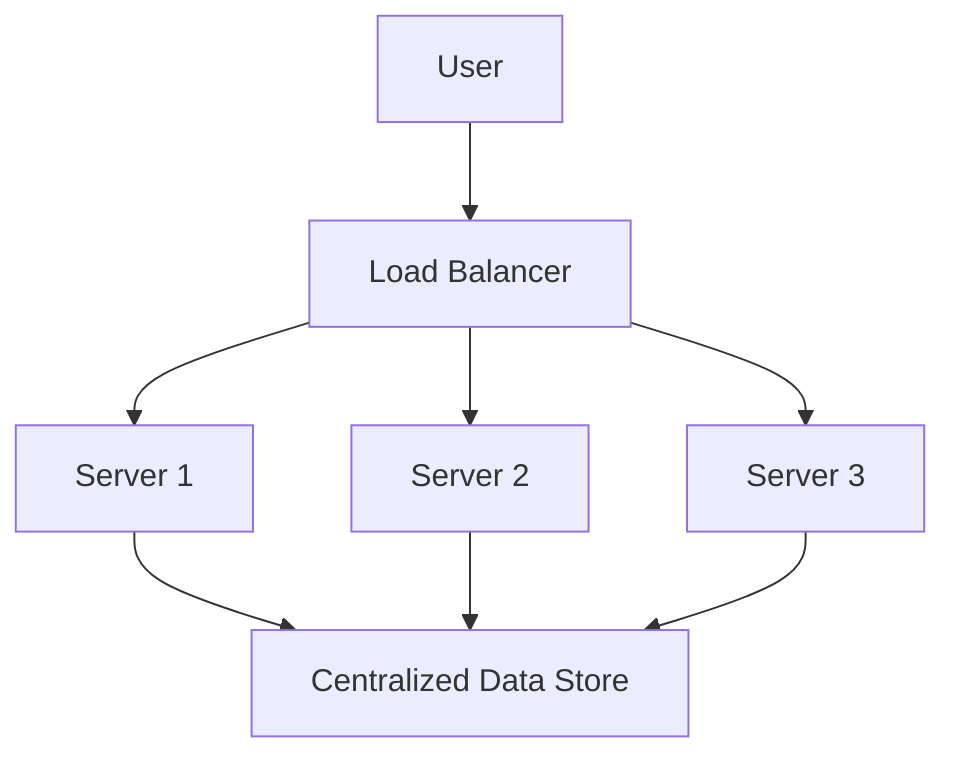
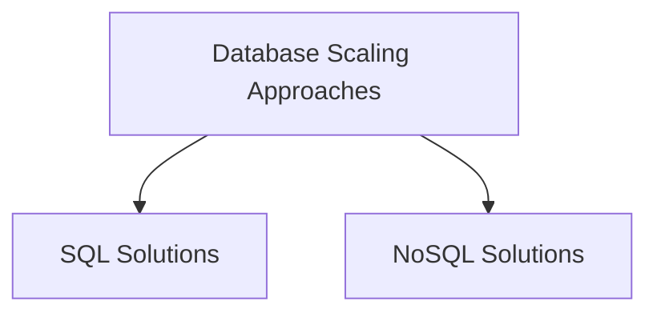
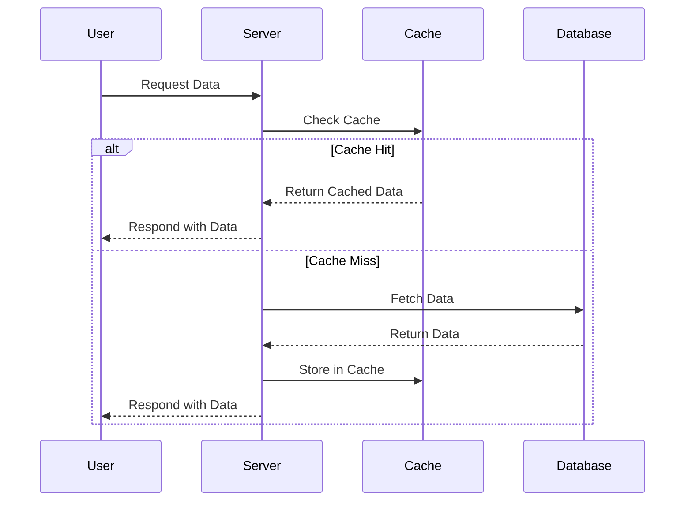
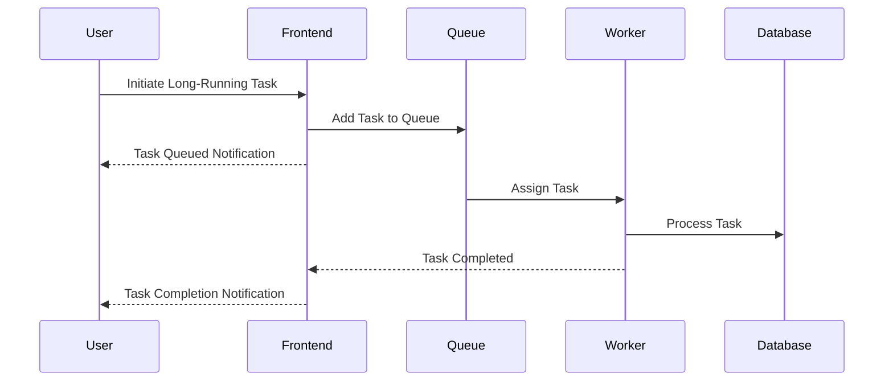

Scalability is a critical aspect of modern web services, especially as user bases grow and traffic increases. In this blog series, we'll break down the key concepts of scalability into digestible parts, starting with the basics and gradually diving into more advanced topics. Whether you're a beginner or an experienced developer, this guide will help you understand how to design and implement scalable systems.

---

## Part 1: Clones - The Foundation of Scalability

### Introduction to Scalability
When building a web service, one of the first challenges you'll face is handling increasing traffic. The key to scalability lies in distributing the load efficiently across multiple servers. In this section, we'll explore how to achieve this using **clones**—identical copies of your application servers.

### Load Balancers and Application Servers
In a scalable web service, public servers are hidden behind a **load balancer**. The load balancer evenly distributes incoming requests across a cluster of application servers. For example, if a user named Rakesh makes multiple requests, his first request might be handled by Server 2, the second by Server 9, and the third by Server 2 again.

**Key Point:** Rakesh should always receive the same response, regardless of which server handles his request. This leads us to the first golden rule of scalability:

> **Every server must contain the same codebase and must not store user-related data (like sessions or profile pictures) locally.**

### Centralized Data Storage
To ensure consistency across servers, user-related data such as sessions should be stored in a **centralized data store** accessible to all application servers. This could be an external database or a persistent cache like Redis. Redis, being an in-memory data store, offers better performance compared to traditional databases.

**Why Centralized Storage?**
- Prevents data inconsistency across servers.
- Ensures seamless user experience, even if requests are handled by different servers.

### Modern Deployment with CI/CD
Deploying code changes across multiple servers can be tricky. How do you ensure that all servers are running the latest version of your code? This is where modern **CI/CD pipelines** come in. Tools like GitHub Actions, GitLab CI/CD, or ArgoCD automate the deployment process, ensuring that all servers are updated simultaneously. These tools integrate seamlessly with your version control system and provide powerful automation capabilities for testing, building, and deploying your code.

### Containerization and Orchestration
Instead of creating traditional server images (AMIs), modern scalable applications leverage **containerization** with Docker. Containers package your application and its dependencies into a standardized unit that can run consistently across different environments. For orchestrating these containers at scale, **Kubernetes** has become the industry standard, allowing you to deploy, scale, and manage containerized applications with ease.

When you need to deploy a new instance, simply pull the latest container image from a registry like Docker Hub or Amazon ECR, and Kubernetes will handle the deployment across your cluster.

---

## Part 2: Database Scalability - Beyond Clones

### The Database Bottleneck
After implementing clones, your web service can handle thousands of concurrent requests. However, as traffic grows, you'll likely encounter a new bottleneck: **the database**. Whether you're using MySQL or another relational database, scaling your database is more complex than simply adding more servers.

### Path #1: Scaling with Modern SQL Solutions
If you choose to stick with SQL databases, you'll need to implement strategies like:
- **Master-Slave Replication:** Write operations go to the master, while read operations are distributed across slaves.
- **Sharding:** Splitting your database into smaller, more manageable pieces.
- **Denormalization:** Reducing the number of joins by duplicating data.

Modern solutions like **Amazon Aurora**, **Vitess** (used by YouTube and GitHub), or **CockroachDB** can help manage these complexities by providing built-in sharding, replication, and high availability features while maintaining SQL compatibility.

### Path #2: Embracing NoSQL
A more radical approach is to switch to a **NoSQL database** like MongoDB, DynamoDB, or Cassandra. NoSQL databases are designed for scalability and can handle large datasets more efficiently. By eliminating joins and denormalizing your data from the start, you can simplify your database architecture and improve performance.

**Key Point:** Even with NoSQL, you'll eventually need to introduce a **cache** to handle increasing database requests.

---

## Part 3: Caching - Speeding Up Your Application

### Why Caching Matters
As your database grows, fetching data can become slow, leading to poor user experience. The solution is **caching**—storing frequently accessed data in memory for quick retrieval.

### In-Memory Caching
Always use **in-memory caches** like Redis or managed services such as AWS ElastiCache or Redis Enterprise. Avoid file-based caching, as it complicates server cloning and auto-scaling.

### Caching Patterns
There are two primary caching patterns:

1. **Cached Database Queries:** Store the result of database queries in the cache. The query itself is hashed and used as the cache key. While this approach is common, it has limitations, especially when it comes to cache expiration.

2. **Cached Objects:** Store entire objects or datasets in the cache. This approach is more efficient and easier to manage. For example, instead of caching individual database queries, cache the entire "Product" object, including prices, descriptions, and reviews.

**Benefits of Cached Objects:**
- Simplifies cache management.
- Enables asynchronous processing.
- Reduces database load.

### Multi-Level Caching
Modern applications often implement **multi-level caching** strategies:
- **Application-level caching:** Libraries like Caffeine (Java) or quick.cache (Node.js)
- **Distributed caching:** Redis or Memcached
- **CDN caching:** Cloudflare, Fastly, or AWS CloudFront for static assets and API responses

---

## Part 4: Asynchronism - Handling Time-Consuming Tasks

### The Problem with Synchronous Processing
Imagine walking into a bakery and being told to wait two hours for your bread. This is similar to what happens when your web service handles time-consuming tasks synchronously. Users are forced to wait, leading to a poor experience.

### Async #1: Pre-Computing Data
One way to handle this is by **pre-computing data**. For example, a bakery might bake bread at night and sell it in the morning. Similarly, you can pre-render dynamic content as static HTML files and serve them to users. This approach is highly scalable and can be combined with Content Delivery Networks (CDNs) like AWS CloudFront or Cloudflare.

### Async #2: Modern Message Queues and Event Streaming
For tasks that can't be pre-computed, use **message queues** or **event streaming platforms**. When a user initiates a time-consuming task, the frontend adds the task to a queue and immediately notifies the user that the task is in progress. Workers process the queue and notify the frontend when the task is complete.

**Modern Tools for Asynchronism:**
- **Apache Kafka:** A high-throughput distributed streaming platform.
- **AWS SQS/SNS:** Managed queue and notification services.
- **Google Pub/Sub:** A scalable, real-time messaging service.
- **Serverless Functions:** AWS Lambda, Google Cloud Functions, or Azure Functions for event-driven processing.

### Benefits of Asynchronism
- Improves user experience by reducing wait times.
- Makes your backend infinitely scalable.
- Simplifies the handling of complex, time-consuming tasks.

---

## Conclusion
Scalability is a journey, not a destination. By implementing containerized applications, optimizing your database with modern solutions, leveraging multi-level caching, and embracing event-driven architectures, you can build web services that handle millions of users with ease. Stay tuned for the next parts of this series, where we'll dive deeper into advanced scalability techniques.

Happy scaling!