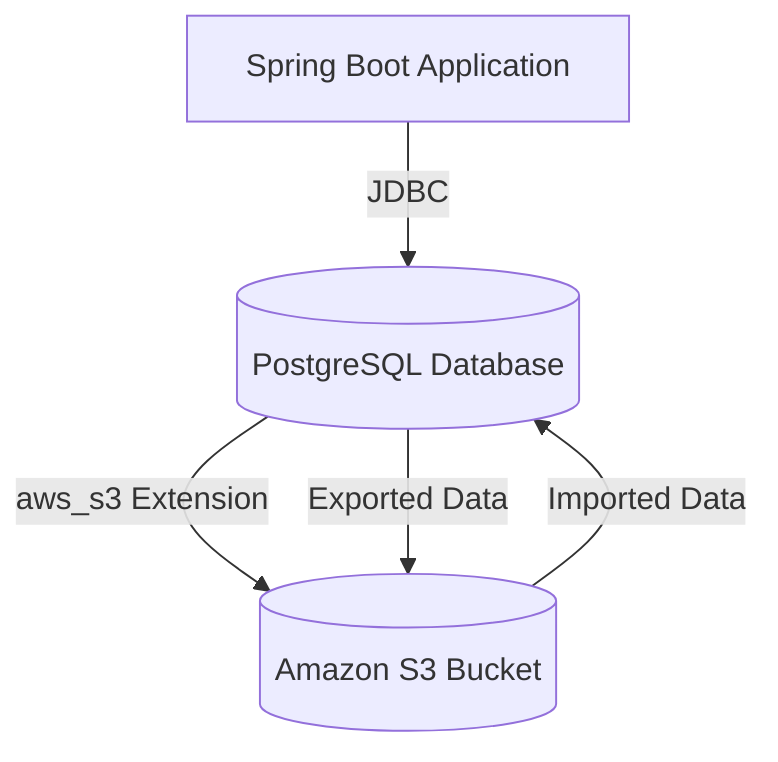
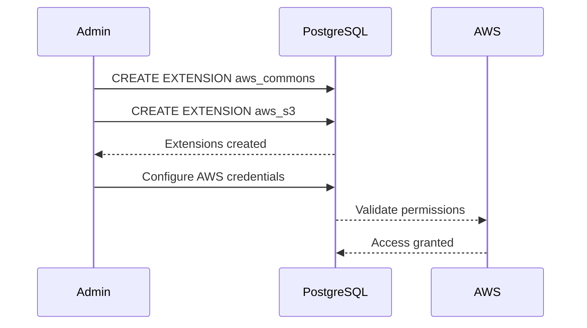
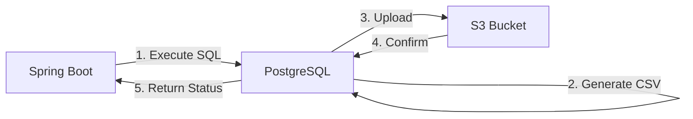
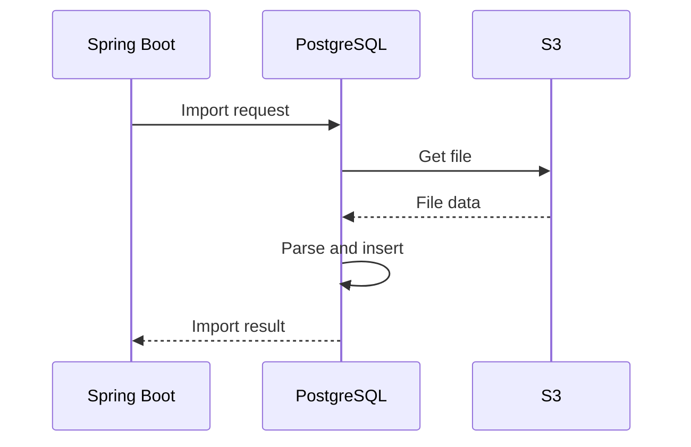

# Overview

This guide demonstrates how to leverage PostgreSQL's native AWS S3 integration to directly export and import table data between your database and Amazon S3 - all through SQL commands executed from a Spring Boot application.



# Prerequisites

## 1. Database Requirements
- PostgreSQL 12+ (Amazon RDS or self-managed)
- `aws_s3` and `aws_commons` extensions installed
- Proper IAM permissions for S3 access

## 2. Application Requirements
- Spring Boot 2.7+
- Spring Data JDBC or JPA
- PostgreSQL JDBC driver

# Setup Instructions

## 1. Enable Required PostgreSQL Extensions

```sql
-- For self-managed PostgreSQL:
CREATE EXTENSION IF NOT EXISTS aws_commons;
CREATE EXTENSION IF NOT EXISTS aws_s3;

-- Verify installation
SELECT * FROM pg_available_extensions WHERE name LIKE 'aws%';
```

## 2. Configure AWS Credentials

### Option A: IAM Role (Recommended for RDS)
For RDS PostgreSQL, attach an IAM role with these permissions:
```json
{
  "Version": "2012-10-17",
  "Statement": [
    {
      "Effect": "Allow",
      "Action": [
        "s3:PutObject",
        "s3:GetObject",
        "s3:DeleteObject"
      ],
      "Resource": "arn:aws:s3:::your-bucket-name/*"
    }
  ]
}
```

### Option B: Access Keys (For non-RDS)
```sql
SELECT aws_commons.set_aws_credentials(
  'your-access-key-id',
  'your-secret-access-key',
  'us-east-1'
);
```


# Exporting Data to S3

## SQL Command Structure
```sql
SELECT aws_s3.query_export_to_s3(
  'SELECT * FROM your_table',          -- Query to export
  aws_commons.create_s3_uri(            -- S3 destination
    'your-bucket', 
    'path/to/file.csv', 
    'aws-region'
  ),
  options := 'format csv, header'       -- Export options
);
```

## Supported Export Formats

| Format | Options Example | Notes |
|--------|-----------------|-------|
| CSV | `'format csv, header'` | Most common format |
| Text | `'format text'` | Tab-delimited |
| Binary | `'format binary'` | PostgreSQL binary format |



# Importing Data from S3

## SQL Command Structure
```sql
SELECT aws_s3.table_import_from_s3(
  'target_table',                      -- Target table name
  'col1,col2,col3',                    -- Optional column list
  '(format csv, header)',              -- Import options
  aws_commons.create_s3_uri(           -- S3 source
    'your-bucket', 
    'path/to/file.csv', 
    'aws-region'
  )
);
```


# Spring Boot Implementation

## 1. Database Configuration

```properties
spring.datasource.url=jdbc:postgresql://localhost:5432/yourdb
spring.datasource.username=user
spring.datasource.password=password
spring.datasource.driver-class-name=org.postgresql.Driver
spring.datasource.hikari.maximum-pool-size=10

spring.jpa.hibernate.ddl-auto=none
spring.jpa.properties.hibernate.dialect=org.hibernate.dialect.PostgreSQLDialect
```

## 2. S3 Export/Import Repository and Service

```java
@Repository
public interface S3DataRepository extends Repository<Object, Long> {

    @Modifying
    @Query(value = """
        SELECT aws_s3.query_export_to_s3(
          :query,
          aws_commons.create_s3_uri(:bucket, :key, :region),
          :options
        )
        """, nativeQuery = true)
    void exportToS3(
        @Param("query") String query,
        @Param("bucket") String bucket,
        @Param("key") String key,
        @Param("region") String region,
        @Param("options") String options
    );

    @Modifying
    @Query(value = """
        SELECT aws_s3.table_import_from_s3(
          :table,
          :columns,
          :options,
          aws_commons.create_s3_uri(:bucket, :key, :region)
        )
        """, nativeQuery = true)
    void importFromS3(
        @Param("table") String table,
        @Param("columns") String columns,
        @Param("options") String options,
        @Param("bucket") String bucket,
        @Param("key") String key,
        @Param("region") String region
    );
}
```

```java
@Service
@RequiredArgsConstructor
public class S3DataService {

    private final S3DataRepository s3DataRepository;

    @Transactional
    public void exportToS3(String query, String bucket, String key, 
                           String region, String formatOptions) {
        s3DataRepository.exportToS3(query, bucket, key, region, formatOptions);
    }

    @Transactional
    public void importFromS3(String table, String columns, 
                             String bucket, String key, 
                             String region, String formatOptions) {
        s3DataRepository.importFromS3(table, columns, formatOptions, bucket, key, region);
    }
}
```

## 3. REST Controller

```java
@RestController
@RequestMapping("/api/data")
@RequiredArgsConstructor
public class DataTransferController {

    private final S3DataService s3DataService;

    @PostMapping("/export")
    public ResponseEntity<String> exportData(
            @RequestParam String query,
            @RequestParam String bucket,
            @RequestParam String key,
            @RequestParam(defaultValue = "us-east-1") String region,
            @RequestParam(defaultValue = "format csv, header") String options) {
        
        s3DataService.exportToS3(query, bucket, key, region, options);
        return ResponseEntity.ok("Data exported successfully to s3://%s/%s".formatted(bucket, key));
    }

    @PostMapping("/import")
    public ResponseEntity<String> importData(
            @RequestParam String table,
            @RequestParam(required = false) String columns,
            @RequestParam String bucket,
            @RequestParam String key,
            @RequestParam(defaultValue = "us-east-1") String region,
            @RequestParam(defaultValue = "(format csv, header)") String options) {
        
        s3DataService.importFromS3(table, columns, bucket, key, region, options);
        return ResponseEntity.ok("Data imported successfully from s3://%s/%s".formatted(bucket, key));
    }
}
```

# Advanced Usage

## 1. Handling Large Exports
```sql
-- Export in chunks
SELECT aws_s3.query_export_to_s3(
  'SELECT * FROM large_table WHERE id BETWEEN 1 AND 100000',
  aws_commons.create_s3_uri('bucket', 'chunk1.csv', 'region'),
  'format csv'
);
```

## 2. Custom Delimiters
```sql
-- Using pipe delimiter
SELECT aws_s3.query_export_to_s3(
  'SELECT * FROM employees',
  aws_commons.create_s3_uri('bucket', 'file.psv', 'region'),
  'format csv, delimiter ''|'', header'
);
```

# ⚠️ Troubleshooting

| Issue | Solution |
|-------|----------|
| Permission denied | Verify IAM role or access keys |
| Extension not found | Install aws_s3 extension |
| Invalid S3 URI | Check bucket/region spelling |
| Malformed CSV | Verify format options |

# Performance Considerations

1. **Network Throughput**: S3 transfers are network-bound
2. **File Size**: Optimal chunk size 100MB-1GB
3. **Database Load**: Schedule large exports during off-peak hours

# Security Best Practices

1. Use IAM roles instead of access keys when possible
2. Restrict S3 bucket access with bucket policies
3. Enable S3 server-side encryption
4. Use VPC endpoints for private network access

# Additional Resources

1. [AWS Documentation on PostgreSQL S3 Extension](https://docs.aws.amazon.com/AmazonRDS/latest/PostgreSQLReleaseNotes/postgresql-extensions.html)
2. [PostgreSQL Foreign Data Wrappers](https://www.postgresql.org/docs/current/postgres-fdw.html)