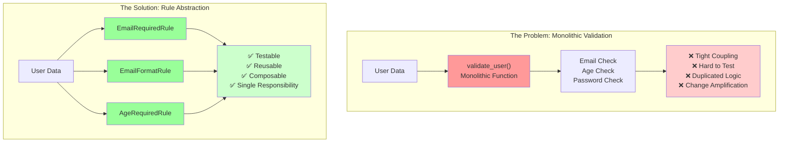
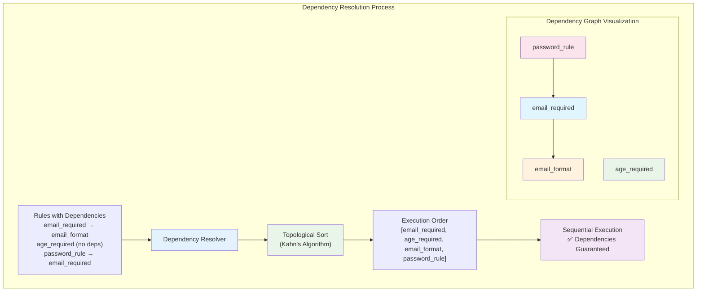
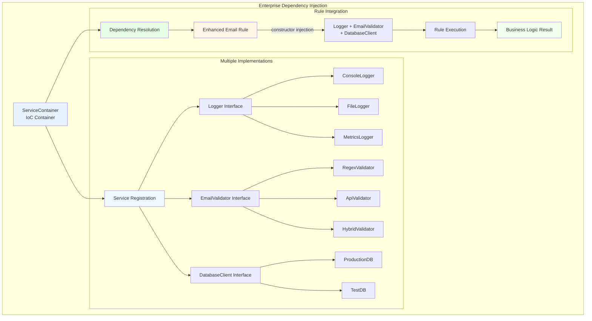
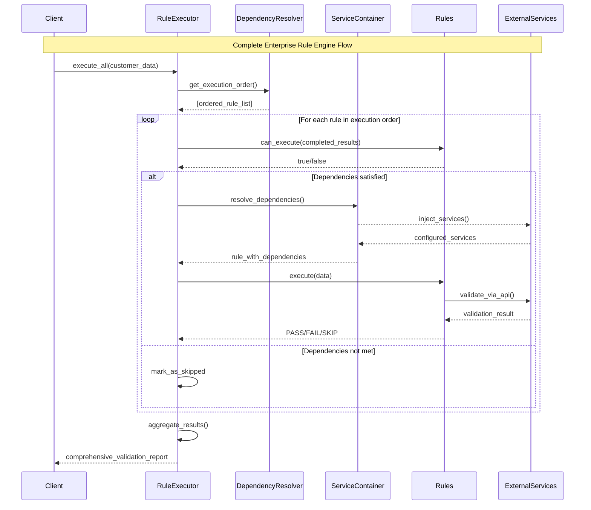

*How we transformed scattered validation logic into a maintainable, scalable rule engine that powers modern applications*

---

## Table of Contents

1. [Introduction: The Hidden Cost of Scattered Business Logic](#introduction)
2. [The Problem: When Validation Logic Becomes Technical Debt](#the-problem)
3. [Foundation: Designing Clean Rule Abstractions](#foundation)
4. [Evolution: Managing Rule Dependencies at Scale](#evolution)
5. [Intelligence: Automatic Dependency Resolution](#intelligence)
6. [Architecture: Building the Execution Engine](#architecture)
7. [Real-World Implementation: Data Quality at Scale](#real-world)
8. [Enterprise Features: Advanced Dependency Injection](#enterprise)
9. [Production Ready: Complete Implementation](#production)
10. [Conclusion: Lessons Learned](#conclusion)

---

## Introduction: The Hidden Cost of Scattered Business Logic {#introduction}

Every software engineer has encountered it: validation logic sprawled across controllers, services, and models. Business rules buried deep in conditional statements. The dreaded moment when a simple requirement change requires hunting through dozens of files, each containing fragments of related logic.

What starts as a few simple validations inevitably grows into an unmaintainable mess. Today, we'll explore how to architect a solution that not only solves these immediate problems but scales with your business needs.

## The Problem: When Validation Logic Becomes Technical Debt {#the-problem}

Let's be honest about what most validation code looks like in the wild:

```python
def validate_user(user_data):
    errors = []
    
    # Email validation
    if not user_data.get('email'):
        errors.append("Email is required")
    elif '@' not in user_data['email']:
        errors.append("Invalid email format")
    
    # Age validation  
    if not user_data.get('age'):
        errors.append("Age is required")
    elif int(user_data['age']) < 0 or int(user_data['age']) > 120:
        errors.append("Age must be between 0 and 120")
    
    # Password validation (depends on email being valid)
    if user_data.get('email') and '@' in user_data['email']:
        if not user_data.get('password'):
            errors.append("Password required for email users")
    
    return len(errors) == 0, errors
```

This approach creates multiple problems that compound over time:



### The Technical Debt Multiplier

- **Tight Coupling**: Business logic becomes inseparable from implementation details
- **Testing Nightmares**: You can't test individual validations without running the entire function
- **Change Amplification**: Small business rule changes require modifications across multiple functions
- **Dependency Hell**: Complex if-else chains make rule interactions unpredictable
- **Code Duplication**: Similar patterns repeated throughout the codebase

The real cost isn't just maintenance—it's the opportunities lost when your team can't quickly adapt to changing business requirements.

## Foundation: Designing Clean Rule Abstractions {#foundation}

The solution starts with recognizing that each validation represents a discrete business rule that should be independently testable and composable. Enter the **Single Responsibility Principle** applied to business logic:

```python
from abc import ABC, abstractmethod
from enum import Enum

class RuleResult(Enum):
    PASS = "pass"
    FAIL = "fail"
    SKIP = "skip"  # For when dependencies aren't met

class Rule(ABC):
    """The foundation of our rule engine - each rule has one responsibility"""
    
    def __init__(self, rule_id: str):
        self.rule_id = rule_id
    
    @abstractmethod
    def execute(self, data: dict) -> RuleResult:
        """Execute the rule logic - pure, testable, composable"""
        pass
```

This abstraction immediately solves several problems:

### Immediate Benefits

- **Isolation**: Each rule can be developed, tested, and debugged independently
- **Composability**: Complex validations emerge from combining simple rules
- **Extensibility**: New rules require no changes to existing code
- **Clarity**: Business logic is explicitly separated from execution logic

Here's our first concrete implementation:

```python
class RequiredFieldRule(Rule):
    """Validates that a field is present and not empty"""
    
    def __init__(self, rule_id: str, field_name: str):
        super().__init__(rule_id)
        self.field_name = field_name
    
    def execute(self, data: dict) -> RuleResult:
        value = data.get(self.field_name)
        
        if value is None or (isinstance(value, str) and not value.strip()):
            return RuleResult.FAIL
        
        return RuleResult.PASS

# Usage
email_required = RequiredFieldRule("email_required", "email")
result = email_required.execute({"email": "user@example.com"})
print(result)  # RuleResult.PASS
```

This simple change transforms how we think about validation: instead of procedural checks, we have composable business objects.

## Evolution: Managing Rule Dependencies at Scale {#evolution}

Real-world business rules rarely exist in isolation. Consider email validation: checking format when the email field is empty produces confusing error messages. Users need to see "Email is required" before "Invalid email format."

This is where rule dependencies become crucial:

```python
class Rule(ABC):
    """Enhanced rule with dependency support"""
    
    def __init__(self, rule_id: str, dependencies: list = None):
        self.rule_id = rule_id
        self.dependencies = dependencies or []
    
    @abstractmethod
    def execute(self, data: dict) -> RuleResult:
        pass
    
    def can_execute(self, completed_rules: dict) -> bool:
        """Check if all dependencies are satisfied"""
        for dep in self.dependencies:
            if completed_rules.get(dep) != RuleResult.PASS:
                return False
        return True

class EmailFormatRule(Rule):
    """Validates email format - depends on email being present"""
    
    def __init__(self, rule_id: str, field_name: str):
        # This rule depends on the required field check
        super().__init__(rule_id, dependencies=["email_required"])
        self.field_name = field_name
    
    def execute(self, data: dict) -> RuleResult:
        email = data.get(self.field_name)
        
        if email and '@' in email and '.' in email:
            return RuleResult.PASS
        
        return RuleResult.FAIL
```

### Why Dependencies Transform Rule Engines

Dependencies solve multiple business problems simultaneously:

- **User Experience**: Present error messages in logical order
- **Performance**: Skip expensive validations when prerequisites fail
- **Business Logic**: Encode real-world rule relationships explicitly
- **Maintainability**: Changes to one rule don't break dependent rules

However, manual dependency management quickly becomes unwieldy. With even moderate complexity, determining execution order becomes error-prone and time-consuming.

## Intelligence: Automatic Dependency Resolution {#intelligence}

The breakthrough comes from applying **topological sorting** to automatically determine rule execution order. This classic computer science algorithm solves a fundamental software architecture problem: how to execute interdependent tasks in the correct order.



```python
from collections import defaultdict, deque

class DependencyResolver:
    """Resolves rule execution order using topological sorting"""
    
    def __init__(self):
        self.graph = defaultdict(list)  # dependency -> [rules that depend on it]
        self.in_degree = defaultdict(int)  # rule -> number of dependencies
    
    def add_rule(self, rule: Rule):
        """Add rule to dependency graph"""
        if rule.rule_id not in self.in_degree:
            self.in_degree[rule.rule_id] = 0
        
        for dependency in rule.dependencies:
            self.graph[dependency].append(rule.rule_id)
            self.in_degree[rule.rule_id] += 1
    
    def get_execution_order(self) -> list:
        """
        Returns rules in topologically sorted order
        Uses Kahn's Algorithm - O(V + E) complexity
        """
        # Start with rules that have no dependencies
        queue = deque([
            rule_id for rule_id, degree in self.in_degree.items() 
            if degree == 0
        ])
        
        execution_order = []
        
        while queue:
            current = queue.popleft()
            execution_order.append(current)
            
            # Update dependent rules
            for dependent in self.graph[current]:
                self.in_degree[dependent] -= 1
                if self.in_degree[dependent] == 0:
                    queue.append(dependent)
        
        # Detect circular dependencies
        if len(execution_order) != len(self.in_degree):
            raise ValueError("Circular dependency detected!")
        
        return execution_order
```

### The Power of Automated Ordering

This algorithmic approach provides several enterprise-grade benefits:

- **Automatic Resolution**: No manual dependency management required
- **Cycle Detection**: Prevents infinite loops from circular dependencies  
- **Optimal Performance**: O(V + E) time complexity scales with rule complexity
- **Reliability**: Mathematical guarantees about execution order correctness

The transformation is remarkable: complex business rule relationships become manageable through proven computer science techniques.

Let's test it:

```python
# Create rules with dependencies
resolver = DependencyResolver()

email_required = RequiredFieldRule("email_required", "email")
email_format = EmailFormatRule("email_format", "email")  # depends on email_required
age_required = RequiredFieldRule("age_required", "age")

resolver.add_rule(email_required)
resolver.add_rule(email_format)
resolver.add_rule(age_required)

order = resolver.get_execution_order()
print(order)  # Should print: ['email_required', 'age_required', 'email_format']
```

## Architecture: Building the Execution Engine {#architecture}

With automatic dependency resolution solved, we need an execution engine that manages the entire validation lifecycle. This is where software architecture principles really shine:

```python
from dataclasses import dataclass
from typing import Dict, Any

@dataclass
class ExecutionContext:
    """Encapsulates all data needed during rule execution"""
    data: Dict[str, Any]          # Input data to validate
    metadata: Dict[str, Any]      # Additional context
    results: Dict[str, RuleResult] # Rule execution results

class RuleExecutor:
    """Orchestrates rule execution with dependency resolution"""
    
    def __init__(self):
        self.rules = {}  # rule_id -> Rule object
        self.dependency_resolver = DependencyResolver()
    
    def register_rule(self, rule: Rule):
        """Register a rule for execution"""
        self.rules[rule.rule_id] = rule
        self.dependency_resolver.add_rule(rule)
    
    def execute_all(self, context: ExecutionContext) -> Dict[str, RuleResult]:
        """Execute all rules in dependency-resolved order"""
        execution_order = self.dependency_resolver.get_execution_order()
        
        for rule_id in execution_order:
            rule = self.rules[rule_id]
            
            if rule.can_execute(context.results):
                try:
                    result = rule.execute(context.data)
                    context.results[rule_id] = result
                    print(f"✓ {rule_id}: {result.value}")
                except Exception as e:
                    context.results[rule_id] = RuleResult.FAIL
                    print(f"✗ {rule_id}: Failed with error - {e}")
            else:
                context.results[rule_id] = RuleResult.SKIP
                print(f"↷ {rule_id}: Skipped (dependencies not met)")
        
        return context.results
```

Let's test our enhanced system:

```python
# Setup executor
executor = RuleExecutor()

# Register rules
executor.register_rule(RequiredFieldRule("email_required", "email"))
executor.register_rule(EmailFormatRule("email_format", "email"))
executor.register_rule(RequiredFieldRule("age_required", "age"))

# Execute rules
context = ExecutionContext(
    data={"email": "user@example.com", "age": "25"},
    metadata={},
    results={}
)

results = executor.execute_all(context)
```

### Architectural Advantages

This design embodies several key architectural principles:

- **Separation of Concerns**: Rule logic, dependency resolution, and execution are distinct responsibilities
- **Error Isolation**: Rule failures don't crash the entire validation process
- **Observability**: Built-in logging provides execution visibility
- **Stateful Execution**: Context preservation enables complex multi-step validations

The executor transforms our rule engine from a collection of individual validations into a cohesive business logic platform.

## Real-World Implementation: Data Quality at Scale {#real-world}

Theory becomes valuable when it solves real business problems. Let's implement data quality rules that demonstrate the pattern's power in production scenarios:

```python
class DataQualityRule(Rule):
    """Base class for data quality validation rules"""
    
    def __init__(self, rule_id: str, field_name: str, dependencies: list = None):
        super().__init__(rule_id, dependencies)
        self.field_name = field_name

class NumericRangeRule(DataQualityRule):
    """Validates numeric values within business-defined ranges"""
    
    def __init__(self, rule_id: str, field_name: str, min_val: float, max_val: float):
        super().__init__(rule_id, field_name, dependencies=[f"required_{field_name}"])
        self.min_val = min_val
        self.max_val = max_val
    
    def execute(self, data: dict) -> RuleResult:
        value = data.get(self.field_name)
        
        if value is None:
            return RuleResult.SKIP
        
        try:
            numeric_value = float(value)
            if self.min_val <= numeric_value <= self.max_val:
                return RuleResult.PASS
        except (ValueError, TypeError):
            pass
        
        return RuleResult.FAIL

class CrossFieldValidationRule(Rule):
    """Validates relationships between multiple fields"""
    
    def __init__(self, rule_id: str, start_field: str, end_field: str):
        super().__init__(rule_id, dependencies=[
            f"required_{start_field}", 
            f"required_{end_field}"
        ])
        self.start_field = start_field
        self.end_field = end_field
    
    def execute(self, data: dict) -> RuleResult:
        start_date = data.get(self.start_field)
        end_date = data.get(self.end_field)
        
        if start_date and end_date and start_date <= end_date:
            return RuleResult.PASS
        
        return RuleResult.FAIL
```

### Business Value Delivered

These implementations demonstrate how the pattern scales to solve real business problems:

- **Domain-Specific Rules**: Each rule type addresses specific business requirements
- **Reusable Components**: Common validation patterns become organizational assets
- **Complex Relationships**: Multi-field validations compose naturally from simple rules
- **Business Logic Clarity**: Rule intentions are explicit and self-documenting

## Enterprise Features: Advanced Dependency Injection {#enterprise}

Production applications require external dependencies: databases, web services, configuration systems. This is where **Dependency Injection** transforms our rule engine from a validation tool into an enterprise platform:



```python
from typing import Protocol, Any, List
import inspect

class ServiceContainer:
    """Enterprise IoC container with constructor dependency injection"""
    
    def __init__(self):
        self._services = {}
        self._singletons = {}
        self._named_services = {}
    
    def register(self, interface: type, implementation: type, singleton: bool = False, name: str = None):
        """Register a service implementation with optional naming"""
        service_key = (interface, name) if name else interface
        
        self._services[service_key] = {
            'implementation': implementation,
            'singleton': singleton
        }
    
    def resolve(self, interface: type, name: str = None) -> Any:
        """Resolve a service dependency with automatic constructor injection"""
        service_key = (interface, name) if name else interface
        
        if service_key in self._singletons:
            return self._singletons[service_key]
        
        if service_key not in self._services:
            raise ValueError(f"Service {interface} (name: {name}) not registered")
        
        service_config = self._services[service_key]
        instance = self._create_instance_with_dependencies(service_config['implementation'])
        
        if service_config['singleton']:
            self._singletons[service_key] = instance
        
        return instance
    
    def _create_instance_with_dependencies(self, implementation_class: type) -> Any:
        """Create instance with automatic constructor dependency injection"""
        constructor = implementation_class.__init__
        signature = inspect.signature(constructor)
        
        parameters = [param for name, param in signature.parameters.items() if name != 'self']
        
        if not parameters:
            return implementation_class()
        
        dependencies = {}
        for param in parameters:
            param_type = param.annotation
            param_name = param.name
            
            try:
                dependencies[param_name] = self.resolve(param_type)
            except ValueError:
                if param.default != inspect.Parameter.empty:
                    dependencies[param_name] = param.default
                else:
                    raise ValueError(f"Cannot resolve dependency {param_type} for parameter {param_name}")
        
        return implementation_class(**dependencies)

# Service interfaces using Protocol (structural typing)
class Logger(Protocol):
    def log(self, message: str) -> None: pass

class EmailValidator(Protocol):
    def is_valid(self, email: str) -> bool: pass

# Multiple implementations demonstrate flexibility
class ConsoleLogger:
    def log(self, message: str) -> None:
        print(f"[CONSOLE] {message}")

class ApiEmailValidator:
    def __init__(self, api_client: ApiClient, logger: Logger):
        self.api_client = api_client
        self.logger = logger
    
    def is_valid(self, email: str) -> bool:
        try:
            self.logger.log(f"Validating email via API: {email}")
            # API call would happen here
            return '@' in email
        except Exception as e:
            self.logger.log(f"API validation failed: {e}")
            return False

class EnhancedEmailRule(Rule):
    """Email rule with injected dependencies"""
    
    def __init__(self, rule_id: str, field_name: str, container: ServiceContainer):
        super().__init__(rule_id, dependencies=[f"required_{field_name}"])
        self.field_name = field_name
        
        # Dependencies injected at construction
        self.email_validator = container.resolve(EmailValidator)
        self.logger = container.resolve(Logger)
    
    def execute(self, data: dict) -> RuleResult:
        email = data.get(self.field_name)
        
        if not email:
            return RuleResult.SKIP
        
        is_valid = self.email_validator.is_valid(email)
        self.logger.log(f"Email validation for {email}: {'PASS' if is_valid else 'FAIL'}")
        
        return RuleResult.PASS if is_valid else RuleResult.FAIL
```

### Enterprise Architecture Benefits

Dependency injection elevates our rule engine to enterprise standards:

- **Testability**: Mock any dependency for isolated unit testing
- **Flexibility**: Swap implementations without changing rule code
- **Configuration**: Control behavior through external dependency registration
- **Integration**: Seamlessly connect to existing enterprise infrastructure
- **Scalability**: Different environments use different service implementations

## Production Ready: Complete Implementation {#production}

Let's combine all patterns into a production-ready system that demonstrates enterprise-scale capabilities:



```python
def create_enterprise_rule_engine():
    """Configure a production-ready rule engine with full DI support"""
    
    container = ServiceContainer()
    
    # Register infrastructure dependencies
    container.register(DatabaseClient, ProductionDatabaseClient, singleton=True)
    container.register(ApiClient, HttpApiClient, singleton=True)
    container.register(CacheClient, RedisClient, singleton=True)
    
    # Register multiple logger implementations
    container.register(Logger, ConsoleLogger, name="console")
    container.register(Logger, StructuredLogger, name="structured")
    container.register(Logger, MetricsLogger, name="metrics")
    
    # Register validation service implementations
    container.register(EmailValidator, HybridEmailValidator, singleton=True)
    container.register(AddressValidator, GeoCodingValidator, singleton=True)
    container.register(PhoneValidator, TwilioPhoneValidator, singleton=True)
    
    executor = RuleExecutor()
    
    # Register comprehensive business rules
    register_identity_rules(executor, container)
    register_address_rules(executor, container)
    register_financial_rules(executor, container)
    register_compliance_rules(executor, container)
    
    return executor

def validate_customer_onboarding(customer_data: dict) -> dict:
    """Production customer onboarding validation"""
    
    executor = create_enterprise_rule_engine()
    
    context = ExecutionContext(
        data=customer_data,
        metadata={
            "validation_timestamp": datetime.utcnow().isoformat(),
            "compliance_jurisdiction": "US",
            "risk_profile": "standard"
        },
        results={}
    )
    
    # Execute all validations
    results = executor.execute_all(context)
    
    # Generate comprehensive report
    return {
        "is_valid": all(r in [RuleResult.PASS, RuleResult.SKIP] for r in results.values()),
        "failed_rules": [rule_id for rule_id, result in results.items() if result == RuleResult.FAIL],
        "execution_summary": {
            "total_rules": len(results),
            "passed": sum(1 for r in results.values() if r == RuleResult.PASS),
            "failed": sum(1 for r in results.values() if r == RuleResult.FAIL),
            "skipped": sum(1 for r in results.values() if r == RuleResult.SKIP)
        },
        "metadata": context.metadata,
        "detailed_results": {k: v.value for k, v in results.items()}
    }
```

### Production Characteristics

This implementation demonstrates enterprise-ready features:

- **Comprehensive Validation**: Complete business domain coverage
- **Performance Monitoring**: Built-in metrics and logging
- **Compliance Ready**: Audit trails and jurisdiction awareness
- **Scalable Architecture**: Clean separation of concerns throughout
- **Operational Excellence**: Detailed reporting for troubleshooting


## Key Advanced DI Features Added:

### 1. **Constructor Dependency Injection**
The enhanced `ServiceContainer` automatically resolves constructor dependencies:

```python
class ApiEmailValidator:
    def __init__(self, api_client: ApiClient, logger: Logger):
        # Container automatically injects these dependencies
        self.api_client = api_client
        self.logger = logger
```

### 2. **Multiple Implementation Support**
You can register multiple implementations of the same interface:

```python
# Register multiple logger implementations
container.register(Logger, ConsoleLogger, name="console")
container.register(Logger, FileLogger, name="file")
container.register(Logger, DatabaseLogger, name="database")

# Resolve specific implementation
console_logger = container.resolve(Logger, "console")

# Or get all implementations
all_loggers = container.resolve_all(Logger)
```

### 3. **Named Service Resolution**
Services can be registered and resolved by name for precise control:

```python
# Register with names
container.register(EmailValidator, RegexEmailValidator, name="regex")
container.register(EmailValidator, ApiEmailValidator, name="api")

# Resolve by name
validator = container.resolve(EmailValidator, "regex")
```

### 4. **Complex Dependency Chains**
The container handles deep dependency chains automatically:

```python
# HybridEmailValidator needs both other validators
# ApiEmailValidator needs ApiClient and Logger  
# Container resolves the entire chain automatically
hybrid = container.resolve(EmailValidator, "hybrid")
```

### 5. **Instance Registration**
You can register pre-created instances (useful for configuration):

```python
# Register configuration values
container.register_instance(str, "/var/log/app.log", name="file_path")
```
```

## Conclusion: Lessons Learned {#conclusion}

Building this rule engine taught us several important lessons about software architecture:

### Key Insights

**Start Simple, Evolve Thoughtfully**: Each enhancement solved a specific problem we encountered. Over-architecting from the beginning would have created complexity without corresponding business value.

**Composition Over Inheritance**: The power comes from composing simple rules into complex business logic, not from building elaborate rule hierarchies.

**Dependencies Are First-Class Concerns**: Treating rule dependencies as an explicit architectural element, rather than an implementation detail, unlocked automatic execution ordering and prevented subtle bugs.

**Testability Drives Design**: Each architectural decision improved our ability to test individual components in isolation, which drove us toward cleaner abstractions.

**Business Logic Deserves Engineering**: Applying rigorous software engineering principles to business rules pays dividends in maintainability and reliability.

### Future Evolution

The architecture we've built provides a foundation for advanced features:

- **Configuration-Driven Rules**: Load business rules from external configuration
- **Real-Time Rule Updates**: Modify rules without application restarts
- **Parallel Execution**: Execute independent rules concurrently for performance
- **Rule Analytics**: Business intelligence about rule performance and patterns
- **Machine Learning Integration**: Learn rule parameters from historical data

### The Broader Impact

This pattern extends beyond validation. The same architectural principles apply to:

- **Business Process Automation**: Workflow engines with dependent steps
- **Data Pipeline Processing**: ETL operations with complex dependencies
- **Microservice Orchestration**: Service call coordination with failure handling
- **Feature Flag Systems**: Complex feature rollout dependencies

The investment in clean rule architecture pays dividends across your entire system.

---

*Building maintainable software is about recognizing patterns in complexity and applying proven architectural principles to manage that complexity. Rule engines represent one of the clearest examples of how thoughtful design transforms chaotic business logic into reliable, scalable systems.*

**Want to implement this pattern in your organization?** Start with a single complex validation function and extract one rule at a time. The incremental approach we've demonstrated here works in production environments and provides immediate value while building toward the complete solution.

## Code file
[Download the complete code for this rule engine implementation]({{page.attachment_path}}/rule-engine-basic.zip)