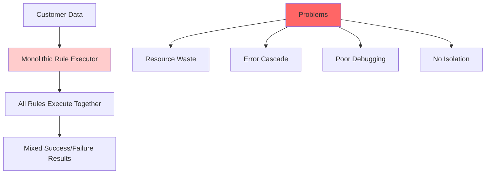
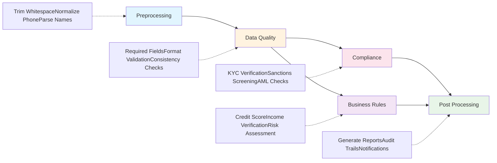
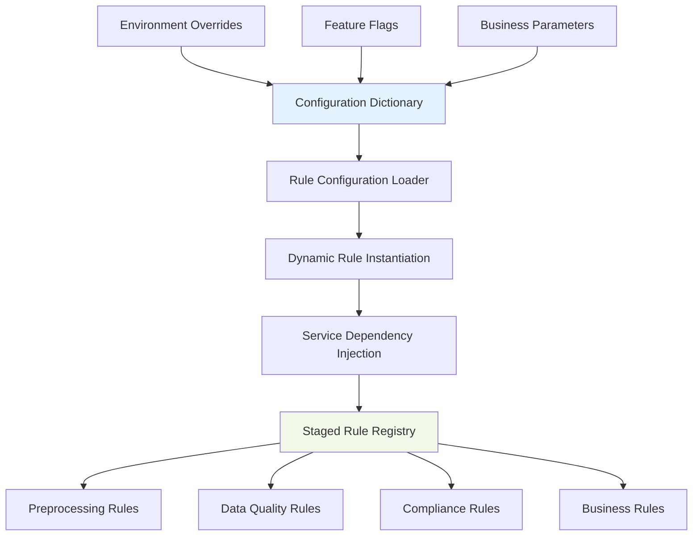
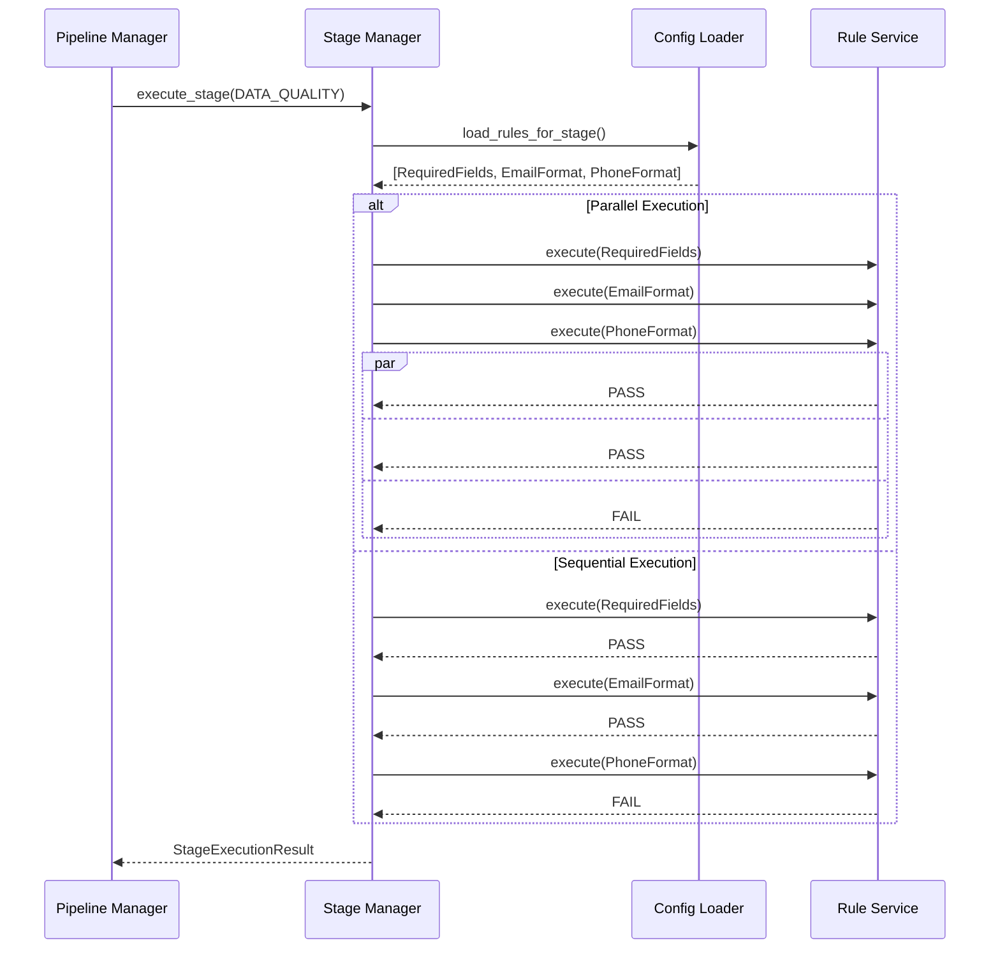
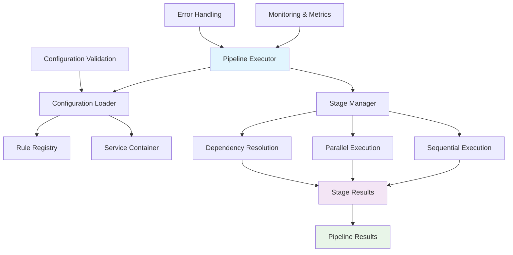
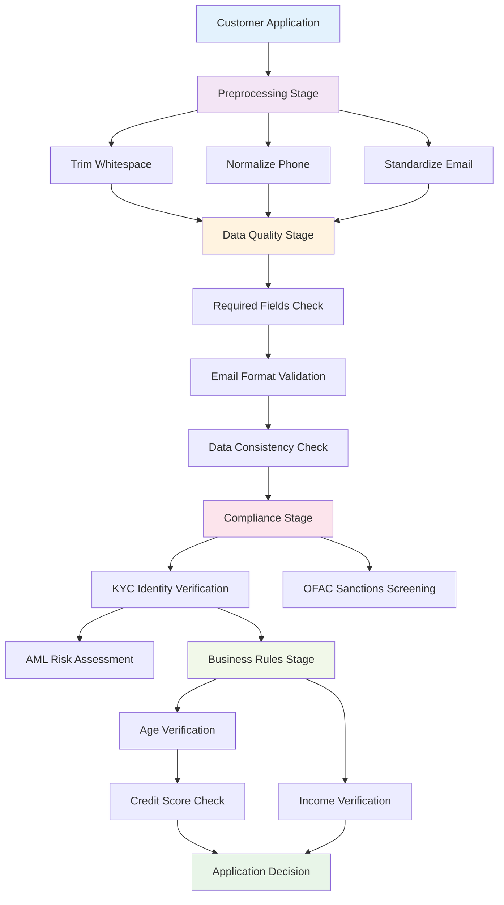
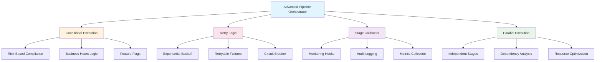
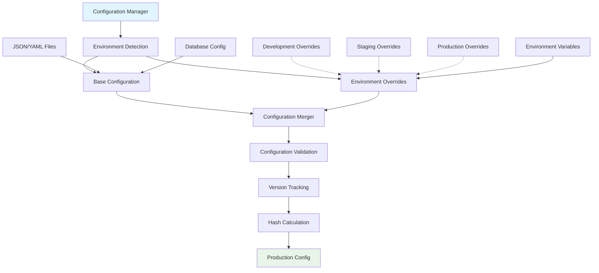
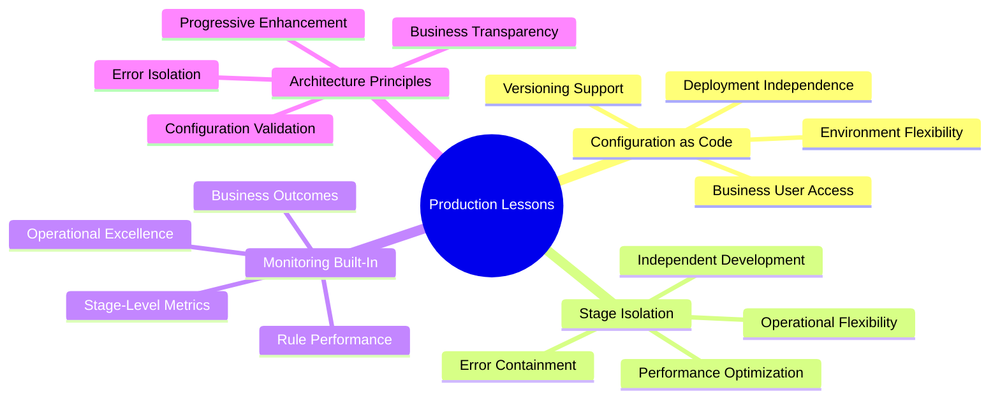

*How we evolved our rule engine to support dynamic staging, configuration-driven execution, and enterprise data quality pipelines*

---

## Table of Contents

1. [Introduction: Beyond Basic Validation](#introduction)
2. [The Challenge: Multi-Stage Data Processing](#challenge)
3. [Foundation: Rule Staging Architecture](#foundation)
4. [Evolution: Configuration-Driven Rule Loading](#evolution)
5. [Intelligence: Dynamic Stage Management](#intelligence)
6. [Architecture: The Stage-Aware Execution Engine](#architecture)
7. [Real-World Implementation: Data Quality Pipeline](#real-world)
8. [Enterprise Features: Advanced Stage Orchestration](#enterprise)
9. [Production Ready: Complete Configuration System](#production)
10. [Conclusion: Lessons from Production](#conclusion)

---

## Introduction: Beyond Basic Validation {#introduction}

In Part 1, we built a robust rule engine that solved the fundamental problems of scattered business logic. We achieved automatic dependency resolution, clean abstractions, and enterprise-grade dependency injection. But production environments revealed a new challenge: **not all rules should execute at the same time**.

Consider a typical data processing pipeline in a financial services company:

- **Preprocessing Stage**: Clean and normalize incoming data
- **Data Quality Stage**: Validate completeness, accuracy, and consistency  
- **Compliance Stage**: Ensure regulatory requirements are met
- **Business Rules Stage**: Apply domain-specific validation logic
- **Post-Processing Stage**: Generate reports and audit trails

Each stage has distinct requirements, performance characteristics, and failure handling strategies. Running all rules together creates several problems:

- **Performance Degradation**: Expensive compliance checks run on data that hasn't passed basic quality validation
- **Error Cascade**: Business rule failures mask fundamental data quality issues
- **Resource Waste**: Complex validation logic executes on data that will be rejected by preprocessing
- **Operational Complexity**: All-or-nothing execution makes it difficult to isolate and debug specific pipeline stages

Today, we'll evolve our rule engine to support **configuration-driven stage management** that solves these production challenges.

## The Challenge: Multi-Stage Data Processing {#challenge}

Let's examine what happens when we try to force all rules into a single execution context:

```python
# This is what we DON'T want - monolithic rule execution
def validate_customer_data(customer_data):
    executor = RuleExecutor()
    
    # Preprocessing rules
    executor.register_rule(TrimWhitespaceRule("trim_name", "name"))
    executor.register_rule(NormalizePhoneRule("normalize_phone", "phone"))
    
    # Data quality rules  
    executor.register_rule(RequiredFieldRule("name_required", "name"))
    executor.register_rule(EmailFormatRule("email_format", "email"))
    
    # Compliance rules (expensive!)
    executor.register_rule(KYCValidationRule("kyc_check", ["name", "address"]))
    executor.register_rule(SanctionsListRule("sanctions_check", "name"))
    
    # Business rules
    executor.register_rule(CreditScoreRule("credit_check", "ssn"))
    executor.register_rule(RiskAssessmentRule("risk_assessment", ["income", "debt"]))
    
    # Execute everything at once - problematic!
    return executor.execute_all(customer_data)
```



### The Problems This Creates

**Resource Inefficiency**: A customer record with a missing required field still triggers expensive KYC and credit checks before failing basic validation.

**Poor User Experience**: Users receive a mix of preprocessing errors, data quality failures, and business rule violations simultaneously, making it difficult to understand what needs to be fixed first.

**Debugging Nightmares**: When the pipeline fails, engineers must sift through results from all stages to identify the root cause.

**Operational Inflexibility**: You can't run just the compliance checks on previously validated data, or reprocess only the business rules after a requirement change.

The solution is to organize rules into **logical execution stages** that can be independently configured, executed, and monitored.

## Foundation: Rule Staging Architecture {#foundation}

The key insight is that rules naturally group into processing stages, and each stage represents a distinct business concern. Let's formalize this concept:

```python
from enum import Enum
from dataclasses import dataclass
from typing import List, Dict, Set

class ExecutionStage(Enum):
    """Define the stages of our data processing pipeline"""
    PREPROCESSING = "preprocessing"
    DATA_QUALITY = "data_quality" 
    COMPLIANCE = "compliance"
    BUSINESS_RULES = "business_rules"
    POST_PROCESSING = "post_processing"

@dataclass
class StageConfig:
    """Configuration for a single execution stage"""
    stage: ExecutionStage
    enabled: bool = True
    fail_fast: bool = True  # Stop on first failure
    parallel_execution: bool = False
    timeout_seconds: int = 30
    retry_attempts: int = 0

class StagedRule(Rule):
    """Enhanced rule that belongs to specific execution stages"""
    
    def __init__(self, rule_id: str, stage: ExecutionStage, 
                 dependencies: List[str] = None, 
                 cross_stage_dependencies: List[str] = None):
        super().__init__(rule_id, dependencies or [])
        self.stage = stage
        self.cross_stage_dependencies = cross_stage_dependencies or []
    
    def can_execute_in_stage(self, stage: ExecutionStage, 
                           completed_stages: Set[ExecutionStage],
                           stage_results: Dict[str, RuleResult]) -> bool:
        """Check if rule can execute in the given stage context"""
        # Must be the correct stage
        if self.stage != stage:
            return False
        
        # Check cross-stage dependencies
        for cross_dep in self.cross_stage_dependencies:
            if stage_results.get(cross_dep) != RuleResult.PASS:
                return False
        
        # Check same-stage dependencies
        return self.can_execute(stage_results)
```



This foundation introduces several important concepts:

### Stage-Aware Rules

Rules now explicitly declare which stage they belong to, eliminating ambiguity about execution order and enabling stage-specific optimizations.

### Cross-Stage Dependencies  

Rules can depend on results from previous stages, enabling sophisticated pipeline logic while maintaining stage separation.

### Stage Configuration

Each stage can be independently configured for performance characteristics, error handling, and execution strategy.

Let's see this in action with concrete implementations:

```python
class TrimWhitespaceRule(StagedRule):
    """Preprocessing rule that normalizes string data"""
    
    def __init__(self, rule_id: str, field_name: str):
        super().__init__(rule_id, ExecutionStage.PREPROCESSING)
        self.field_name = field_name
    
    def execute(self, data: dict) -> RuleResult:
        value = data.get(self.field_name)
        if isinstance(value, str):
            # Modify data in place during preprocessing
            data[self.field_name] = value.strip()
            return RuleResult.PASS
        return RuleResult.SKIP

class DataCompletenessRule(StagedRule):
    """Data quality rule that checks for required fields"""
    
    def __init__(self, rule_id: str, required_fields: List[str]):
        super().__init__(rule_id, ExecutionStage.DATA_QUALITY)
        self.required_fields = required_fields
    
    def execute(self, data: dict) -> RuleResult:
        missing_fields = [
            field for field in self.required_fields 
            if not data.get(field)
        ]
        return RuleResult.PASS if not missing_fields else RuleResult.FAIL

class KYCComplianceRule(StagedRule):
    """Compliance rule that performs expensive external validation"""
    
    def __init__(self, rule_id: str, kyc_service: KYCService):
        # Depends on data quality passing first
        super().__init__(
            rule_id, 
            ExecutionStage.COMPLIANCE,
            cross_stage_dependencies=["data_completeness_check"]
        )
        self.kyc_service = kyc_service
    
    def execute(self, data: dict) -> RuleResult:
        # This is expensive - only run after data quality validation
        try:
            is_valid = self.kyc_service.validate_identity(
                data["name"], data["address"], data["ssn"]
            )
            return RuleResult.PASS if is_valid else RuleResult.FAIL
        except Exception:
            return RuleResult.FAIL
```

The transformation is immediate: rules become self-documenting about their place in the processing pipeline, and expensive operations are protected by appropriate prerequisites.

## Evolution: Configuration-Driven Rule Loading {#evolution}

Hard-coding rule registration quickly becomes unwieldy in enterprise environments. Different environments need different rule sets, business requirements change frequently, and operations teams need control over pipeline configuration without code changes.

The solution is **configuration-driven rule loading** using Python dictionaries that can be externalized to JSON, YAML, or database storage:

```python
# Pipeline configuration as a Python dictionary
PIPELINE_CONFIG = {
    "stages": {
        "preprocessing": {
            "enabled": True,
            "fail_fast": False,  # Continue processing even if some preprocessing fails
            "parallel_execution": True,
            "timeout_seconds": 10,
            "rules": {
                "trim_name": {
                    "class": "TrimWhitespaceRule",
                    "params": {"field_name": "name"}
                },
                "trim_email": {
                    "class": "TrimWhitespaceRule", 
                    "params": {"field_name": "email"}
                },
                "normalize_phone": {
                    "class": "PhoneNormalizationRule",
                    "params": {"field_name": "phone", "country_code": "US"}
                }
            }
        },
        "data_quality": {
            "enabled": True,
            "fail_fast": True,  # Stop immediately on data quality failures
            "parallel_execution": False,
            "timeout_seconds": 15,
            "rules": {
                "required_fields": {
                    "class": "DataCompletenessRule",
                    "params": {"required_fields": ["name", "email", "phone"]}
                },
                "email_format": {
                    "class": "EmailFormatValidationRule",
                    "params": {"field_name": "email"},
                    "dependencies": ["required_fields"]
                },
                "phone_format": {
                    "class": "PhoneFormatValidationRule", 
                    "params": {"field_name": "phone"},
                    "dependencies": ["required_fields"]
                }
            }
        },
        "compliance": {
            "enabled": True,
            "fail_fast": True,
            "parallel_execution": True,  # Independent compliance checks can run in parallel
            "timeout_seconds": 60,  # Compliance checks are slower
            "rules": {
                "kyc_validation": {
                    "class": "KYCComplianceRule",
                    "params": {"service_name": "primary_kyc"},
                    "cross_stage_dependencies": ["required_fields", "email_format"]
                },
                "sanctions_screening": {
                    "class": "SanctionsScreeningRule",
                    "params": {"screening_level": "enhanced"},
                    "cross_stage_dependencies": ["required_fields"]
                },
                "pep_screening": {
                    "class": "PEPScreeningRule",
                    "params": {"risk_threshold": "medium"},
                    "cross_stage_dependencies": ["kyc_validation"]
                }
            }
        },
        "business_rules": {
            "enabled": True,
            "fail_fast": False,  # Collect all business rule violations
            "parallel_execution": True,
            "timeout_seconds": 30,
            "rules": {
                "credit_score_check": {
                    "class": "CreditScoreValidationRule",
                    "params": {"minimum_score": 650, "bureau": "experian"},
                    "cross_stage_dependencies": ["kyc_validation"]
                },
                "income_verification": {
                    "class": "IncomeVerificationRule",
                    "params": {"verification_method": "bank_statements"},
                    "cross_stage_dependencies": ["kyc_validation"]
                },
                "debt_to_income_ratio": {
                    "class": "DebtToIncomeRule",
                    "params": {"max_ratio": 0.43},
                    "dependencies": ["income_verification"]
                }
            }
        }
    },
    "execution_settings": {
        "stop_on_stage_failure": True,  # Stop pipeline if any stage fails
        "enable_audit_logging": True,
        "max_parallel_rules": 4,
        "default_timeout": 30
    }
}
```




### Configuration Structure Benefits

This structure provides several enterprise advantages:

**Environment-Specific Rules**: Different configurations for development, staging, and production environments.

**Feature Flags**: Enable/disable entire stages or individual rules without code deployment.

**Performance Tuning**: Adjust timeouts, parallelism, and failure handling per environment.

**Business Flexibility**: Non-technical users can modify business rule parameters.

**Operational Control**: Operations teams can disable problematic rules during incidents.

Now we need a configuration loader that transforms this dictionary into executable rule instances:

```python
import importlib
from typing import Type, Any

class RuleConfigurationLoader:
    """Loads rules from configuration and instantiates them with dependency injection"""
    
    def __init__(self, service_container: ServiceContainer):
        self.container = service_container
        self.rule_registry = {}  # rule_class_name -> Rule class
        self._register_built_in_rules()
    
    def _register_built_in_rules(self):
        """Register all available rule classes"""
        self.rule_registry.update({
            "TrimWhitespaceRule": TrimWhitespaceRule,
            "DataCompletenessRule": DataCompletenessRule,
            "EmailFormatValidationRule": EmailFormatValidationRule,
            "PhoneFormatValidationRule": PhoneFormatValidationRule,
            "KYCComplianceRule": KYCComplianceRule,
            "SanctionsScreeningRule": SanctionsScreeningRule,
            "PEPScreeningRule": PEPScreeningRule,
            "CreditScoreValidationRule": CreditScoreValidationRule,
            "IncomeVerificationRule": IncomeVerificationRule,
            "DebtToIncomeRule": DebtToIncomeRule,
        })
    
    def register_rule_class(self, name: str, rule_class: Type[StagedRule]):
        """Register custom rule classes for dynamic loading"""
        self.rule_registry[name] = rule_class
    
    def load_rules_for_stage(self, stage: ExecutionStage, 
                           config: Dict[str, Any]) -> List[StagedRule]:
        """Load all rules for a specific stage from configuration"""
        stage_name = stage.value
        
        if stage_name not in config["stages"]:
            return []
        
        stage_config = config["stages"][stage_name]
        
        if not stage_config.get("enabled", True):
            return []
        
        rules = []
        
        for rule_id, rule_config in stage_config["rules"].items():
            rule = self._create_rule_from_config(rule_id, rule_config, stage)
            if rule:
                rules.append(rule)
        
        return rules
    
    def _create_rule_from_config(self, rule_id: str, 
                               rule_config: Dict[str, Any],
                               stage: ExecutionStage) -> StagedRule:
        """Create a rule instance from configuration"""
        rule_class_name = rule_config["class"]
        
        if rule_class_name not in self.rule_registry:
            raise ValueError(f"Unknown rule class: {rule_class_name}")
        
        rule_class = self.rule_registry[rule_class_name]
        params = rule_config.get("params", {})
        dependencies = rule_config.get("dependencies", [])
        cross_stage_deps = rule_config.get("cross_stage_dependencies", [])
        
        # Inject services into rule parameters
        resolved_params = self._resolve_service_dependencies(params)
        resolved_params.update({
            "rule_id": rule_id,
            "stage": stage,
            "dependencies": dependencies,
            "cross_stage_dependencies": cross_stage_deps
        })
        
        try:
            return rule_class(**resolved_params)
        except Exception as e:
            print(f"Failed to create rule {rule_id}: {e}")
            return None
    
    def _resolve_service_dependencies(self, params: Dict[str, Any]) -> Dict[str, Any]:
        """Resolve service dependencies in rule parameters"""
        resolved = {}
        
        for key, value in params.items():
            if isinstance(value, str) and value.startswith("service:"):
                # Format: "service:ServiceInterface:optional_name"
                service_parts = value.split(":")
                service_name = service_parts[1]
                optional_name = service_parts[2] if len(service_parts) > 2 else None
                
                # Dynamically resolve service interface
                service_interface = globals().get(service_name)
                if service_interface:
                    resolved[key] = self.container.resolve(service_interface, optional_name)
                else:
                    raise ValueError(f"Unknown service interface: {service_name}")
            else:
                resolved[key] = value
        
        return resolved
```

### Configuration Loading Benefits

This loader provides several powerful capabilities:

**Dynamic Rule Instantiation**: Rules are created from configuration at runtime, enabling flexible pipeline composition.

**Service Injection**: External dependencies are automatically injected based on configuration parameters.

**Error Isolation**: Rule creation failures don't crash the entire pipeline.

**Extensibility**: New rule classes can be registered without modifying the loader.

**Validation**: Configuration structure is validated during rule creation.

## Intelligence: Dynamic Stage Management {#intelligence}

With configuration-driven rule loading in place, we need intelligent stage management that can execute specific stages, handle cross-stage dependencies, and provide detailed execution feedback:

```python
from concurrent.futures import ThreadPoolExecutor, as_completed
import time
from datetime import datetime

@dataclass 
class StageExecutionResult:
    """Results from executing a single stage"""
    stage: ExecutionStage
    success: bool
    rule_results: Dict[str, RuleResult]
    execution_time_ms: int
    failed_rules: List[str]
    skipped_rules: List[str]
    error_messages: Dict[str, str]

class StageManager:
    """Manages the execution of rules within individual stages"""
    
    def __init__(self, config_loader: RuleConfigurationLoader):
        self.config_loader = config_loader
        self.global_results = {}  # Accumulates results across all stages
    
    def execute_stage(self, stage: ExecutionStage, 
                     config: Dict[str, Any], 
                     context: ExecutionContext) -> StageExecutionResult:
        """Execute all rules for a specific stage"""
        start_time = time.time()
        
        # Load rules for this stage
        rules = self.config_loader.load_rules_for_stage(stage, config)
        
        if not rules:
            return self._create_empty_result(stage, start_time)
        
        stage_config = config["stages"][stage.value]
        
        # Execute rules based on stage configuration
        if stage_config.get("parallel_execution", False):
            stage_results = self._execute_rules_parallel(
                rules, context, stage_config
            )
        else:
            stage_results = self._execute_rules_sequential(
                rules, context, stage_config
            )
        
        # Update global results for cross-stage dependencies
        self.global_results.update(stage_results)
        
        execution_time = int((time.time() - start_time) * 1000)
        
        return StageExecutionResult(
            stage=stage,
            success=self._is_stage_successful(stage_results),
            rule_results=stage_results,
            execution_time_ms=execution_time,
            failed_rules=[r for r, result in stage_results.items() 
                         if result == RuleResult.FAIL],
            skipped_rules=[r for r, result in stage_results.items() 
                          if result == RuleResult.SKIP],
            error_messages={}  # Would be populated from exception handling
        )
    
    def _execute_rules_sequential(self, rules: List[StagedRule], 
                                context: ExecutionContext,
                                stage_config: Dict[str, Any]) -> Dict[str, RuleResult]:
        """Execute rules sequentially with dependency resolution"""
        resolver = DependencyResolver()
        
        # Build dependency graph for this stage
        for rule in rules:
            resolver.add_rule(rule)
        
        execution_order = resolver.get_execution_order()
        results = {}
        fail_fast = stage_config.get("fail_fast", True)
        
        for rule_id in execution_order:
            rule = next(r for r in rules if r.rule_id == rule_id)
            
            # Check if rule can execute given current results
            if rule.can_execute_in_stage(rule.stage, set(), self.global_results):
                try:
                    result = rule.execute(context.data)
                    results[rule_id] = result
                    
                    if fail_fast and result == RuleResult.FAIL:
                        # Mark remaining rules as skipped
                        remaining_rules = execution_order[execution_order.index(rule_id) + 1:]
                        for remaining_rule_id in remaining_rules:
                            results[remaining_rule_id] = RuleResult.SKIP
                        break
                        
                except Exception as e:
                    results[rule_id] = RuleResult.FAIL
                    if fail_fast:
                        break
            else:
                results[rule_id] = RuleResult.SKIP
        
        return results
    
    def _execute_rules_parallel(self, rules: List[StagedRule],
                              context: ExecutionContext,
                              stage_config: Dict[str, Any]) -> Dict[str, RuleResult]:
        """Execute independent rules in parallel for performance"""
        max_workers = min(len(rules), stage_config.get("max_parallel_rules", 4))
        timeout = stage_config.get("timeout_seconds", 30)
        results = {}
        
        # Identify rules that can run in parallel (no dependencies within stage)
        independent_rules = [r for r in rules if not r.dependencies]
        dependent_rules = [r for r in rules if r.dependencies]
        
        # Execute independent rules in parallel
        if independent_rules:
            with ThreadPoolExecutor(max_workers=max_workers) as executor:
                future_to_rule = {
                    executor.submit(self._execute_single_rule, rule, context): rule
                    for rule in independent_rules
                    if rule.can_execute_in_stage(rule.stage, set(), self.global_results)
                }
                
                try:
                    for future in as_completed(future_to_rule, timeout=timeout):
                        rule = future_to_rule[future]
                        try:
                            result = future.result()
                            results[rule.rule_id] = result
                        except Exception as e:
                            results[rule.rule_id] = RuleResult.FAIL
                except TimeoutError:
                    # Handle timeout by marking incomplete rules as failed
                    for future, rule in future_to_rule.items():
                        if not future.done():
                            future.cancel()
                            results[rule.rule_id] = RuleResult.FAIL
        
        # Execute dependent rules sequentially after parallel execution
        if dependent_rules:
            sequential_results = self._execute_rules_sequential(
                dependent_rules, context, stage_config
            )
            results.update(sequential_results)
        
        return results
    
    def _execute_single_rule(self, rule: StagedRule, 
                           context: ExecutionContext) -> RuleResult:
        """Execute a single rule with error handling"""
        try:
            return rule.execute(context.data)
        except Exception:
            return RuleResult.FAIL
    
    def _is_stage_successful(self, results: Dict[str, RuleResult]) -> bool:
        """Determine if a stage execution was successful"""
        return all(result in [RuleResult.PASS, RuleResult.SKIP] 
                  for result in results.values())
    
    def _create_empty_result(self, stage: ExecutionStage, 
                           start_time: float) -> StageExecutionResult:
        """Create result for stages with no rules"""
        execution_time = int((time.time() - start_time) * 1000)
        return StageExecutionResult(
            stage=stage,
            success=True,
            rule_results={},
            execution_time_ms=execution_time,
            failed_rules=[],
            skipped_rules=[],
            error_messages={}
        )
```




### Stage Management Benefits

This stage manager provides enterprise-grade execution capabilities:

**Performance Optimization**: Parallel execution of independent rules within stages reduces total processing time.

**Intelligent Dependency Handling**: Cross-stage dependencies are resolved correctly while maintaining stage isolation.

**Failure Isolation**: Stage failures don't automatically cascade to other stages.

**Comprehensive Reporting**: Detailed execution metrics enable performance monitoring and troubleshooting.

**Timeout Protection**: Long-running rules can't block the entire pipeline indefinitely.

## Architecture: The Stage-Aware Execution Engine {#architecture}

Now we need to orchestrate the entire pipeline, providing a clean API for executing specific stages or complete processing workflows:

```python
@dataclass
class PipelineExecutionResult:
    """Complete results from pipeline execution"""
    success: bool
    executed_stages: List[ExecutionStage]
    stage_results: Dict[ExecutionStage, StageExecutionResult]
    total_execution_time_ms: int
    pipeline_metadata: Dict[str, Any]
    
    def get_failed_stages(self) -> List[ExecutionStage]:
        """Get stages that failed during execution"""
        return [stage for stage, result in self.stage_results.items() 
                if not result.success]
    
    def get_all_failed_rules(self) -> Dict[ExecutionStage, List[str]]:
        """Get all failed rules organized by stage"""
        return {stage: result.failed_rules 
                for stage, result in self.stage_results.items()
                if result.failed_rules}

class ConfigurablePipelineExecutor:
    """Main orchestration engine for stage-aware rule execution"""
    
    def __init__(self, config: Dict[str, Any], 
                 service_container: ServiceContainer):
        self.config = config
        self.config_loader = RuleConfigurationLoader(service_container)
        self.stage_manager = StageManager(self.config_loader)
    
    def execute_pipeline(self, data: Dict[str, Any], 
                        stages: List[ExecutionStage] = None,
                        metadata: Dict[str, Any] = None) -> PipelineExecutionResult:
        """Execute complete pipeline or specific stages"""
        start_time = time.time()
        
        # Default to all configured stages
        if stages is None:
            stages = [ExecutionStage(stage_name) 
                     for stage_name in self.config["stages"].keys()]
        
        context = ExecutionContext(
            data=data,
            metadata=metadata or {},
            results={}
        )
        
        executed_stages = []
        stage_results = {}
        stop_on_failure = self.config["execution_settings"].get(
            "stop_on_stage_failure", True
        )
        
        for stage in stages:
            if stage.value not in self.config["stages"]:
                continue  # Skip unconfigured stages
            
            stage_config = self.config["stages"][stage.value]
            if not stage_config.get("enabled", True):
                continue  # Skip disabled stages
            
            # Execute the stage
            result = self.stage_manager.execute_stage(stage, self.config, context)
            stage_results[stage] = result
            executed_stages.append(stage)
            
            # Check if we should stop on failure
            if stop_on_failure and not result.success:
                break
        
        total_time = int((time.time() - start_time) * 1000)
        
        return PipelineExecutionResult(
            success=all(result.success for result in stage_results.values()),
            executed_stages=executed_stages,
            stage_results=stage_results,
            total_execution_time_ms=total_time,
            pipeline_metadata={
                "execution_timestamp": datetime.utcnow().isoformat(),
                "configuration_version": self.config.get("version", "unknown"),
                "total_rules_executed": sum(
                    len(result.rule_results) for result in stage_results.values()
                )
            }
        )
    
    def execute_single_stage(self, stage: ExecutionStage, 
                           data: Dict[str, Any],
                           metadata: Dict[str, Any] = None) -> StageExecutionResult:
        """Execute only a specific stage - useful for debugging and testing"""
        context = ExecutionContext(
            data=data,
            metadata=metadata or {},
            results={}
        )
        
        return self.stage_manager.execute_stage(stage, self.config, context)
    
    def validate_configuration(self) -> List[str]:
        """Validate the pipeline configuration for errors"""
        errors = []
        
        # Check for required configuration sections
        if "stages" not in self.config:
            errors.append("Missing 'stages' configuration section")
            return errors
        
        if "execution_settings" not in self.config:
            errors.append("Missing 'execution_settings' configuration section")
        
        # Validate each stage configuration
        for stage_name, stage_config in self.config["stages"].items():
            stage_errors = self._validate_stage_config(stage_name, stage_config)
            errors.extend(stage_errors)
        
        return errors
    
    def _validate_stage_config(self, stage_name: str, 
                             stage_config: Dict[str, Any]) -> List[str]:
        """Validate configuration for a single stage"""
        errors = []
        
        # Check for required stage fields
        if "rules" not in stage_config:
            errors.append(f"Stage '{stage_name}' missing 'rules' section")
            return errors
        
        # Validate each rule configuration
        for rule_id, rule_config in stage_config["rules"].items():
            if "class" not in rule_config:
                errors.append(f"Rule '{rule_id}' in stage '{stage_name}' missing 'class'")
            
            rule_class_name = rule_config.get("class")
            if rule_class_name not in self.config_loader.rule_registry:
                errors.append(f"Unknown rule class '{rule_class_name}' in rule '{rule_id}'")
        
        return errors
    
    def get_stage_summary(self) -> Dict[str, Any]:
        """Get summary information about configured stages"""
        summary = {}
        
        for stage_name, stage_config in self.config["stages"].items():
            summary[stage_name] = {
                "enabled": stage_config.get("enabled", True),
                "rule_count": len(stage_config.get("rules", {})),
                "parallel_execution": stage_config.get("parallel_execution", False),
                "fail_fast": stage_config.get("fail_fast", True),
                "timeout_seconds": stage_config.get("timeout_seconds", 30)
            }
        
        return summary
```



### Architectural Benefits

This orchestration engine provides several key architectural advantages:

**Selective Execution**: Execute only the stages you need, enabling efficient debugging and testing workflows.

**Configuration Validation**: Catch configuration errors before runtime, preventing production failures.

**Comprehensive Monitoring**: Detailed metrics at both stage and pipeline levels support operational excellence.

**Flexible Orchestration**: Support for both complete pipeline execution and individual stage processing.

**Error Isolation**: Stage failures are contained and don't corrupt the overall execution context.

## Real-World Implementation: Data Quality Pipeline {#real-world}

Let's implement a complete data quality pipeline that demonstrates the power of configuration-driven stage management in a realistic scenario:

```python
# Real-world pipeline configuration for customer onboarding
CUSTOMER_ONBOARDING_CONFIG = {
    "version": "2.1.0",
    "stages": {
        "preprocessing": {
            "enabled": True,
            "fail_fast": False,
            "parallel_execution": True,
            "timeout_seconds": 5,
            "max_parallel_rules": 6,
            "rules": {
                "trim_whitespace": {
                    "class": "MultiFieldTrimRule",
                    "params": {
                        "fields": ["name", "email", "address", "city", "state"]
                    }
                },
                "normalize_phone": {
                    "class": "PhoneNormalizationRule",
                    "params": {
                        "field_name": "phone",
                        "country_code": "US",
                        "format": "E164"
                    }
                },
                "normalize_address": {
                    "class": "AddressNormalizationRule",
                    "params": {
                        "address_service": "service:AddressService:google_maps"
                    }
                },
                "extract_name_components": {
                    "class": "NameParsingRule",
                    "params": {
                        "field_name": "name",
                        "extract_fields": ["first_name", "last_name", "middle_name"]
                    }
                },
                "standardize_email": {
                    "class": "EmailNormalizationRule",
                    "params": {
                        "field_name": "email",
                        "lowercase": True,
                        "remove_dots": False
                    }
                }
            }
        },
        
        "data_quality": {
            "enabled": True,
            "fail_fast": True,
            "parallel_execution": False,
            "timeout_seconds": 10,
            "rules": {
                "required_personal_info": {
                    "class": "RequiredFieldsRule",
                    "params": {
                        "required_fields": ["first_name", "last_name", "email", "phone"],
                        "field_descriptions": {
                            "first_name": "Customer first name",
                            "last_name": "Customer last name", 
                            "email": "Valid email address",
                            "phone": "US phone number"
                        }
                    }
                },
                "email_format_validation": {
                    "class": "EmailFormatRule",
                    "params": {
                        "field_name": "email",
                        "allow_disposable": False,
                        "check_mx_record": True
                    },
                    "dependencies": ["required_personal_info"]
                },
                "phone_format_validation": {
                    "class": "PhoneFormatRule",
                    "params": {
                        "field_name": "phone",
                        "country_code": "US",
                        "allow_extensions": False
                    },
                    "dependencies": ["required_personal_info"]
                },
                "data_consistency_check": {
                    "class": "DataConsistencyRule",
                    "params": {
                        "validation_rules": [
                            {
                                "fields": ["state", "zip_code"],
                                "validator": "state_zip_consistency"
                            },
                            {
                                "fields": ["area_code", "phone"],
                                "validator": "area_code_consistency"
                            }
                        ]
                    },
                    "dependencies": ["email_format_validation", "phone_format_validation"]
                }
            }
        },
        
        "compliance": {
            "enabled": True,
            "fail_fast": False,  # Collect all compliance violations
            "parallel_execution": True,
            "timeout_seconds": 45,
            "max_parallel_rules": 3,
            "rules": {
                "kyc_identity_verification": {
                    "class": "KYCIdentityRule",
                    "params": {
                        "kyc_service": "service:KYCService:jumio",
                        "verification_level": "enhanced",
                        "document_types": ["drivers_license", "passport", "state_id"]
                    },
                    "cross_stage_dependencies": ["required_personal_info", "data_consistency_check"]
                },
                "ofac_sanctions_screening": {
                    "class": "OFACSanctionsRule",
                    "params": {
                        "screening_service": "service:SanctionsService:worldcheck",
                        "match_threshold": 0.85,
                        "include_historical": True
                    },
                    "cross_stage_dependencies": ["required_personal_info"]
                },
                "pep_screening": {
                    "class": "PEPScreeningRule",
                    "params": {
                        "pep_service": "service:PEPService:dowjones",
                        "risk_categories": ["high", "medium"],
                        "include_associates": True
                    },
                    "cross_stage_dependencies": ["required_personal_info"],
                    "dependencies": ["ofac_sanctions_screening"]
                },
                "aml_risk_assessment": {
                    "class": "AMLRiskRule",
                    "params": {
                        "risk_engine": "service:RiskEngine:quantexa",
                        "risk_factors": [
                            "geographic_risk", 
                            "occupation_risk", 
                            "transaction_patterns"
                        ]
                    },
                    "cross_stage_dependencies": ["kyc_identity_verification"],
                    "dependencies": ["pep_screening"]
                }
            }
        },
        
        "business_rules": {
            "enabled": True,
            "fail_fast": False,
            "parallel_execution": True,
            "timeout_seconds": 30,
            "max_parallel_rules": 4,
            "rules": {
                "age_verification": {
                    "class": "AgeVerificationRule",
                    "params": {
                        "minimum_age": 18,
                        "date_field": "date_of_birth",
                        "verification_strict": True
                    },
                    "cross_stage_dependencies": ["kyc_identity_verification"]
                },
                "credit_score_check": {
                    "class": "CreditScoreRule",
                    "params": {
                        "credit_bureau": "service:CreditBureau:experian",
                        "minimum_score": 650,
                        "score_model": "FICO_8"
                    },
                    "cross_stage_dependencies": ["kyc_identity_verification"],
                    "dependencies": ["age_verification"]
                },
                "income_verification": {
                    "class": "IncomeVerificationRule",
                    "params": {
                        "verification_service": "service:IncomeService:argyle",
                        "minimum_monthly_income": 3000,
                        "verification_methods": ["bank_statements", "pay_stubs", "tax_returns"]
                    },
                    "cross_stage_dependencies": ["kyc_identity_verification"]
                },
                "debt_to_income_calculation": {
                    "class": "DebtToIncomeRule",
                    "params": {
                        "maximum_ratio": 0.43,
                        "include_mortgage": True,
                        "debt_service": "service:DebtService:yodlee"
                    },
                    "dependencies": ["income_verification", "credit_score_check"]
                },
                "geographic_eligibility": {
                    "class": "GeographicEligibilityRule",
                    "params": {
                        "allowed_states": [
                            "CA", "NY", "TX", "FL", "IL", "PA", "OH", "GA", "NC", "MI"
                        ],
                        "restricted_countries": ["sanctioned_countries"],
                        "address_field": "address"
                    },
                    "cross_stage_dependencies": ["data_consistency_check"]
                }
            }
        },
        
        "post_processing": {
            "enabled": True,
            "fail_fast": False,
            "parallel_execution": True,
            "timeout_seconds": 15,
            "rules": {
                "generate_customer_id": {
                    "class": "CustomerIDGenerationRule",
                    "params": {
                        "id_format": "CUST-{timestamp}-{hash}",
                        "hash_fields": ["email", "phone", "ssn"]
                    }
                },
                "create_audit_trail": {
                    "class": "AuditTrailRule",
                    "params": {
                        "audit_service": "service:AuditService:primary",
                        "include_pii": False,
                        "retention_days": 2555  # 7 years
                    }
                },
                "risk_score_calculation": {
                    "class": "RiskScoreAggregationRule",
                    "params": {
                        "scoring_model": "composite_v2",
                        "weight_factors": {
                            "credit_score": 0.4,
                            "aml_risk": 0.3,
                            "geographic_risk": 0.2,
                            "identity_confidence": 0.1
                        }
                    }
                },
                "notification_dispatch": {
                    "class": "NotificationRule",
                    "params": {
                        "notification_service": "service:NotificationService:sendgrid",
                        "templates": {
                            "success": "customer_onboarding_success",
                            "failure": "customer_onboarding_failure",
                            "manual_review": "customer_manual_review_required"
                        }
                    }
                }
            }
        }
    },
    
    "execution_settings": {
        "stop_on_stage_failure": True,
        "enable_audit_logging": True,
        "max_parallel_rules": 8,
        "default_timeout": 30,
        "retry_failed_rules": False,
        "performance_monitoring": {
            "enabled": True,
            "slow_rule_threshold_ms": 5000,
            "alert_on_timeout": True
        }
    }
}

# Concrete rule implementations for the data quality pipeline
class MultiFieldTrimRule(StagedRule):
    """Preprocessing rule that trims whitespace from multiple fields"""
    
    def __init__(self, rule_id: str, fields: List[str]):
        super().__init__(rule_id, ExecutionStage.PREPROCESSING)
        self.fields = fields
    
    def execute(self, data: dict) -> RuleResult:
        modified = False
        for field in self.fields:
            if field in data and isinstance(data[field], str):
                original_value = data[field]
                trimmed_value = original_value.strip()
                if original_value != trimmed_value:
                    data[field] = trimmed_value
                    modified = True
        
        return RuleResult.PASS if modified else RuleResult.SKIP

class RequiredFieldsRule(StagedRule):
    """Data quality rule with detailed error reporting"""
    
    def __init__(self, rule_id: str, required_fields: List[str], 
                 field_descriptions: Dict[str, str] = None):
        super().__init__(rule_id, ExecutionStage.DATA_QUALITY)
        self.required_fields = required_fields
        self.field_descriptions = field_descriptions or {}
    
    def execute(self, data: dict) -> RuleResult:
        missing_fields = []
        
        for field in self.required_fields:
            value = data.get(field)
            if value is None or (isinstance(value, str) and not value.strip()):
                missing_fields.append(field)
        
        if missing_fields:
            # Store detailed error information for reporting
            error_details = {
                "missing_fields": missing_fields,
                "field_descriptions": {
                    field: self.field_descriptions.get(field, f"Field '{field}' is required")
                    for field in missing_fields
                }
            }
            # In a real implementation, you'd store this in the execution context
            return RuleResult.FAIL
        
        return RuleResult.PASS

class KYCIdentityRule(StagedRule):
    """Compliance rule that performs identity verification"""
    
    def __init__(self, rule_id: str, kyc_service: 'KYCService', 
                 verification_level: str = "standard",
                 document_types: List[str] = None):
        super().__init__(rule_id, ExecutionStage.COMPLIANCE)
        self.kyc_service = kyc_service
        self.verification_level = verification_level
        self.document_types = document_types or ["drivers_license"]
    
    def execute(self, data: dict) -> RuleResult:
        try:
            verification_result = self.kyc_service.verify_identity(
                first_name=data.get("first_name"),
                last_name=data.get("last_name"),
                date_of_birth=data.get("date_of_birth"),
                address=data.get("address"),
                verification_level=self.verification_level,
                accepted_documents=self.document_types
            )
            
            # Store verification details for downstream rules
            data["kyc_verification_id"] = verification_result.verification_id
            data["identity_confidence_score"] = verification_result.confidence_score
            
            return RuleResult.PASS if verification_result.verified else RuleResult.FAIL
            
        except Exception as e:
            # Log the error and fail the rule
            print(f"KYC verification failed: {e}")
            return RuleResult.FAIL

class RiskScoreAggregationRule(StagedRule):
    """Post-processing rule that calculates composite risk scores"""
    
    def __init__(self, rule_id: str, scoring_model: str, 
                 weight_factors: Dict[str, float]):
        super().__init__(rule_id, ExecutionStage.POST_PROCESSING)
        self.scoring_model = scoring_model
        self.weight_factors = weight_factors
    
    def execute(self, data: dict) -> RuleResult:
        risk_components = {}
        
        # Extract risk scores from previous rule executions
        if "credit_score" in data:
            # Convert credit score to risk score (higher credit = lower risk)
            risk_components["credit_score"] = max(0, (850 - data["credit_score"]) / 850)
        
        if "aml_risk_score" in data:
            risk_components["aml_risk"] = data["aml_risk_score"]
        
        if "geographic_risk_score" in data:
            risk_components["geographic_risk"] = data["geographic_risk_score"]
        
        if "identity_confidence_score" in data:
            # Convert confidence to risk (higher confidence = lower risk)
            risk_components["identity_confidence"] = 1.0 - data["identity_confidence_score"]
        
        # Calculate weighted composite score
        composite_score = 0.0
        total_weight = 0.0
        
        for component, score in risk_components.items():
            if component in self.weight_factors:
                weight = self.weight_factors[component]
                composite_score += score * weight
                total_weight += weight
        
        if total_weight > 0:
            final_risk_score = composite_score / total_weight
            data["composite_risk_score"] = final_risk_score
            
            # Determine risk category
            if final_risk_score < 0.3:
                data["risk_category"] = "low"
            elif final_risk_score < 0.7:
                data["risk_category"] = "medium"
            else:
                data["risk_category"] = "high"
            
            return RuleResult.PASS
        
        return RuleResult.FAIL
```



Let's see this pipeline in action:

```python
def process_customer_application():
    """Demonstrate the complete customer onboarding pipeline"""
    
    # Setup service container with mock services
    container = ServiceContainer()
    setup_customer_services(container)
    
    # Create pipeline executor
    executor = ConfigurablePipelineExecutor(CUSTOMER_ONBOARDING_CONFIG, container)
    
    # Validate configuration before execution
    config_errors = executor.validate_configuration()
    if config_errors:
        print("Configuration errors found:")
        for error in config_errors:
            print(f"  - {error}")
        return
    
    # Sample customer data
    customer_data = {
        "name": "  John Michael Smith  ",  # Has whitespace to be trimmed
        "email": "JOHN.SMITH@EXAMPLE.COM",  # Needs normalization
        "phone": "(555) 123-4567",  # Needs normalization
        "address": "123 Main St, Apt 2B",
        "city": "New York",
        "state": "NY",
        "zip_code": "10001",
        "date_of_birth": "1985-03-15",
        "ssn": "123-45-6789"
    }
    
    print("🚀 Starting customer onboarding pipeline...")
    print(f"📋 Pipeline configuration version: {CUSTOMER_ONBOARDING_CONFIG['version']}")
    print()
    
    # Execute the complete pipeline
    result = executor.execute_pipeline(
        data=customer_data,
        metadata={
            "application_id": "APP-2024-001234",
            "channel": "web_application",
            "referral_source": "organic_search"
        }
    )
    
    # Display comprehensive results
    print("📊 PIPELINE EXECUTION RESULTS")
    print("=" * 50)
    print(f"Overall Success: {'✅ PASS' if result.success else '❌ FAIL'}")
    print(f"Total Execution Time: {result.total_execution_time_ms}ms")
    print(f"Stages Executed: {len(result.executed_stages)}")
    print()
    
    # Stage-by-stage breakdown
    for stage in result.executed_stages:
        stage_result = result.stage_results[stage]
        status_icon = "✅" if stage_result.success else "❌"
        
        print(f"{status_icon} {stage.value.upper()} ({stage_result.execution_time_ms}ms)")
        print(f"   Rules Executed: {len(stage_result.rule_results)}")
        
        if stage_result.failed_rules:
            print(f"   Failed Rules: {', '.join(stage_result.failed_rules)}")
        
        if stage_result.skipped_rules:
            print(f"   Skipped Rules: {', '.join(stage_result.skipped_rules)}")
        
        print()
    
    # Failed rules summary
    failed_rules = result.get_all_failed_rules()
    if failed_rules:
        print("❌ FAILED RULES BY STAGE")
        print("-" * 30)
        for stage, rules in failed_rules.items():
            print(f"{stage.value}: {', '.join(rules)}")
        print()
    
    # Final customer data (after all transformations)
    print("📋 FINAL CUSTOMER DATA")
    print("-" * 25)
    for key, value in customer_data.items():
        print(f"{key}: {value}")
    
    return result

# Example of executing only specific stages
def process_data_quality_only():
    """Demonstrate executing only the data quality stage"""
    
    container = ServiceContainer()
    setup_customer_services(container)
    executor = ConfigurablePipelineExecutor(CUSTOMER_ONBOARDING_CONFIG, container)
    
    customer_data = {
        "first_name": "John",
        "last_name": "Smith", 
        "email": "john.smith@example.com",
        "phone": "+15551234567"
    }
    
    print("🔍 Running DATA QUALITY stage only...")
    
    # Execute only the data quality stage
    result = executor.execute_single_stage(
        ExecutionStage.DATA_QUALITY,
        customer_data,
        metadata={"stage_test": True}
    )
    
    print(f"Data Quality Result: {'✅ PASS' if result.success else '❌ FAIL'}")
    print(f"Execution Time: {result.execution_time_ms}ms")
    
    if result.failed_rules:
        print(f"Failed Rules: {', '.join(result.failed_rules)}")
    
    return result
```

### Real-World Benefits Demonstrated

This implementation showcases several production-ready capabilities:

**Comprehensive Data Processing**: The pipeline handles everything from basic data cleaning to complex compliance validation.

**Performance Optimization**: Rules are executed in parallel where possible, and expensive operations are protected by prerequisites.

**Business Flexibility**: Different stages can be enabled/disabled based on business requirements or regulatory changes.

**Operational Excellence**: Detailed reporting and metrics support monitoring and troubleshooting in production.

**Regulatory Compliance**: Compliance rules are isolated and can be audited independently of business logic.

## Enterprise Features: Advanced Stage Orchestration {#enterprise}

Production environments require sophisticated orchestration capabilities beyond basic stage execution. Let's implement advanced features that enable enterprise-scale operations:

```python
from typing import Callable, Optional
from enum import Enum
import asyncio
from concurrent.futures import Future

class StageExecutionMode(Enum):
    """Different execution modes for pipeline stages"""
    SEQUENTIAL = "sequential"      # Execute stages one by one
    PARALLEL = "parallel"          # Execute independent stages in parallel
    CONDITIONAL = "conditional"    # Execute stages based on conditions
    RETRY_ON_FAILURE = "retry"     # Retry failed stages with backoff

class ConditionalStageConfig:
    """Configuration for conditional stage execution"""
    
    def __init__(self, condition: Callable[[Dict], bool], 
                 reason: str = "Condition not met"):
        self.condition = condition
        self.reason = reason
    
    def should_execute(self, data: Dict[str, Any], 
                      previous_results: Dict[ExecutionStage, StageExecutionResult]) -> bool:
        """Determine if stage should execute based on current state"""
        return self.condition(data)

class RetryConfig:
    """Configuration for stage retry behavior"""
    
    def __init__(self, max_attempts: int = 3,
                 backoff_seconds: float = 1.0,
                 backoff_multiplier: float = 2.0,
                 retryable_failures: List[str] = None):
        self.max_attempts = max_attempts
        self.backoff_seconds = backoff_seconds
        self.backoff_multiplier = backoff_multiplier
        self.retryable_failures = retryable_failures or []

class AdvancedPipelineOrchestrator:
    """Enterprise-grade pipeline orchestrator with advanced execution modes"""
    
    def __init__(self, config: Dict[str, Any], 
                 service_container: ServiceContainer):
        self.config = config
        self.executor = ConfigurablePipelineExecutor(config, service_container)
        self.conditional_configs = {}
        self.retry_configs = {}
        self.stage_callbacks = {}
        
    def add_conditional_stage(self, stage: ExecutionStage, 
                            condition_config: ConditionalStageConfig):
        """Add conditional execution logic for a stage"""
        self.conditional_configs[stage] = condition_config
    
    def add_retry_config(self, stage: ExecutionStage, retry_config: RetryConfig):
        """Add retry configuration for a stage"""
        self.retry_configs[stage] = retry_config
    
    def add_stage_callback(self, stage: ExecutionStage, 
                          callback: Callable[[StageExecutionResult], None]):
        """Add callback to be executed after stage completion"""
        if stage not in self.stage_callbacks:
            self.stage_callbacks[stage] = []
        self.stage_callbacks[stage].append(callback)
    
    async def execute_pipeline_advanced(self, 
                                      data: Dict[str, Any],
                                      execution_mode: StageExecutionMode = StageExecutionMode.SEQUENTIAL,
                                      metadata: Dict[str, Any] = None) -> PipelineExecutionResult:
        """Execute pipeline with advanced orchestration features"""
        
        if execution_mode == StageExecutionMode.SEQUENTIAL:
            return await self._execute_sequential_with_advanced_features(data, metadata)
        elif execution_mode == StageExecutionMode.PARALLEL:
            return await self._execute_parallel_stages(data, metadata)
        elif execution_mode == StageExecutionMode.CONDITIONAL:
            return await self._execute_conditional_pipeline(data, metadata)
        elif execution_mode == StageExecutionMode.RETRY_ON_FAILURE:
            return await self._execute_with_retry_logic(data, metadata)
        else:
            # Fallback to standard execution
            return self.executor.execute_pipeline(data, metadata=metadata)
    
    async def _execute_sequential_with_advanced_features(self, 
                                                       data: Dict[str, Any],
                                                       metadata: Dict[str, Any]) -> PipelineExecutionResult:
        """Sequential execution with conditional logic and callbacks"""
        start_time = time.time()
        executed_stages = []
        stage_results = {}
        
        all_stages = [ExecutionStage(stage_name) 
                     for stage_name in self.config["stages"].keys()]
        
        for stage in all_stages:
            # Check if stage should be executed conditionally
            if stage in self.conditional_configs:
                condition_config = self.conditional_configs[stage]
                if not condition_config.should_execute(data, stage_results):
                    print(f"⏭️  Skipping {stage.value}: {condition_config.reason}")
                    continue
            
            # Execute the stage with potential retry logic
            if stage in self.retry_configs:
                result = await self._execute_stage_with_retry(stage, data, metadata)
            else:
                result = self.executor.execute_single_stage(stage, data, metadata)
            
            stage_results[stage] = result
            executed_stages.append(stage)
            
            # Execute callbacks
            if stage in self.stage_callbacks:
                for callback in self.stage_callbacks[stage]:
                    try:
                        callback(result)
                    except Exception as e:
                        print(f"⚠️  Callback error for {stage.value}: {e}")
            
            # Check if we should stop on failure
            if not result.success and self.config["execution_settings"].get("stop_on_stage_failure", True):
                break
        
        total_time = int((time.time() - start_time) * 1000)
        
        return PipelineExecutionResult(
            success=all(result.success for result in stage_results.values()),
            executed_stages=executed_stages,
            stage_results=stage_results,
            total_execution_time_ms=total_time,
            pipeline_metadata={
                "execution_mode": "sequential_advanced",
                "conditional_stages": list(self.conditional_configs.keys()),
                "retry_enabled_stages": list(self.retry_configs.keys()),
                **(metadata or {})
            }
        )
    
    async def _execute_stage_with_retry(self, stage: ExecutionStage, 
                                      data: Dict[str, Any],
                                      metadata: Dict[str, Any]) -> StageExecutionResult:
        """Execute stage with retry logic on failure"""
        retry_config = self.retry_configs[stage]
        
        for attempt in range(retry_config.max_attempts):
            try:
                result = self.executor.execute_single_stage(stage, data, metadata)
                
                if result.success:
                    return result
                
                # Check if failures are retryable
                if retry_config.retryable_failures:
                    retryable = any(failed_rule in retry_config.retryable_failures 
                                  for failed_rule in result.failed_rules)
                    if not retryable:
                        print(f"❌ {stage.value}: Non-retryable failure, aborting retries")
                        return result
                
                if attempt < retry_config.max_attempts - 1:
                    backoff_time = (retry_config.backoff_seconds * 
                                  (retry_config.backoff_multiplier ** attempt))
                    print(f"🔄 {stage.value}: Attempt {attempt + 1} failed, retrying in {backoff_time}s")
                    await asyncio.sleep(backoff_time)
                
            except Exception as e:
                print(f"❌ {stage.value}: Exception on attempt {attempt + 1}: {e}")
                if attempt == retry_config.max_attempts - 1:
                    # Create a failed result for the final attempt
                    return StageExecutionResult(
                        stage=stage,
                        success=False,
                        rule_results={},
                        execution_time_ms=0,
                        failed_rules=["stage_execution_error"],
                        skipped_rules=[],
                        error_messages={"stage_execution_error": str(e)}
                    )
        
        return result
    
    async def _execute_parallel_stages(self, data: Dict[str, Any],
                                     metadata: Dict[str, Any]) -> PipelineExecutionResult:
        """Execute independent stages in parallel for maximum performance"""
        start_time = time.time()
        
        # Analyze stage dependencies to determine parallel execution groups
        dependency_groups = self._analyze_stage_dependencies()
        
        stage_results = {}
        executed_stages = []
        
        for group in dependency_groups:
            # Execute all stages in this group in parallel
            if len(group) == 1:
                # Single stage - execute normally
                stage = group[0]
                result = self.executor.execute_single_stage(stage, data, metadata)
                stage_results[stage] = result
                executed_stages.append(stage)
            else:
                # Multiple stages - execute in parallel
                tasks = []
                for stage in group:
                    task = asyncio.create_task(
                        self._execute_stage_async(stage, data, metadata)
                    )
                    tasks.append((stage, task))
                
                # Wait for all stages in this group to complete
                for stage, task in tasks:
                    result = await task
                    stage_results[stage] = result
                    executed_stages.append(stage)
            
            # Check if any stage in this group failed and we should stop
            group_success = all(stage_results[stage].success for stage in group)
            if not group_success and self.config["execution_settings"].get("stop_on_stage_failure", True):
                break
        
        total_time = int((time.time() - start_time) * 1000)
        
        return PipelineExecutionResult(
            success=all(result.success for result in stage_results.values()),
            executed_stages=executed_stages,
            stage_results=stage_results,
            total_execution_time_ms=total_time,
            pipeline_metadata={
                "execution_mode": "parallel",
                "dependency_groups": len(dependency_groups),
                **(metadata or {})
            }
        )
    
    async def _execute_stage_async(self, stage: ExecutionStage, 
                                 data: Dict[str, Any],
                                 metadata: Dict[str, Any]) -> StageExecutionResult:
        """Async wrapper for stage execution"""
        loop = asyncio.get_event_loop()
        return await loop.run_in_executor(
            None, 
            self.executor.execute_single_stage, 
            stage, data, metadata
        )
    
    def _analyze_stage_dependencies(self) -> List[List[ExecutionStage]]:
        """Analyze stage dependencies to create parallel execution groups"""
        # This is a simplified implementation - in practice, you'd analyze
        # cross-stage dependencies to determine which stages can run in parallel
        
        # For demonstration, we'll create groups based on typical pipeline flow
        return [
            [ExecutionStage.PREPROCESSING],
            [ExecutionStage.DATA_QUALITY],
            [ExecutionStage.COMPLIANCE, ExecutionStage.BUSINESS_RULES],  # These can run in parallel
            [ExecutionStage.POST_PROCESSING]
        ]
```



### Concrete implementations for advanced features
```python
def create_enterprise_orchestrator() -> AdvancedPipelineOrchestrator:
    """Create a fully configured enterprise orchestrator"""
    
    container = ServiceContainer()
    setup_enterprise_services(container)
    
    orchestrator = AdvancedPipelineOrchestrator(CUSTOMER_ONBOARDING_CONFIG, container)
    
    # Add conditional execution for high-risk customers
    orchestrator.add_conditional_stage(
        ExecutionStage.COMPLIANCE,
        ConditionalStageConfig(
            condition=lambda data: data.get("risk_category", "medium") in ["medium", "high"],
            reason="Low-risk customers skip enhanced compliance checks"
        )
    )
    
    # Add retry configuration for flaky external services
    orchestrator.add_retry_config(
        ExecutionStage.COMPLIANCE,
        RetryConfig(
            max_attempts=3,
            backoff_seconds=2.0,
            backoff_multiplier=2.0,
            retryable_failures=["kyc_identity_verification", "ofac_sanctions_screening"]
        )
    )
    
    # Add monitoring callbacks
    orchestrator.add_stage_callback(
        ExecutionStage.COMPLIANCE,
        lambda result: log_compliance_metrics(result)
    )
    
    orchestrator.add_stage_callback(
        ExecutionStage.BUSINESS_RULES,
        lambda result: update_business_metrics(result)
    )
    
    return orchestrator

def log_compliance_metrics(result: StageExecutionResult):
    """Callback to log compliance stage metrics"""
    print(f"📊 Compliance Metrics:")
    print(f"   Execution Time: {result.execution_time_ms}ms")
    print(f"   Success Rate: {len([r for r in result.rule_results.values() if r == RuleResult.PASS])}/{len(result.rule_results)}")
    
    if result.failed_rules:
        print(f"   Failed Compliance Rules: {', '.join(result.failed_rules)}")

def update_business_metrics(result: StageExecutionResult):
    """Callback to update business rule metrics"""
    print(f"💼 Business Rules Metrics:")
    print(f"   Rules Evaluated: {len(result.rule_results)}")
    print(f"   Approval Rate: {(len([r for r in result.rule_results.values() if r == RuleResult.PASS]) / len(result.rule_results)) * 100:.1f}%")
```

## Production Ready: Complete Configuration System {#production}

Let's implement a complete configuration management system that handles environment-specific configurations, dynamic updates, and operational monitoring:

```python
import json
import yaml
from pathlib import Path
from typing import Union
from datetime import datetime
import hashlib

class ConfigurationManager:
    """Enterprise configuration manager with versioning and validation"""
    
    def __init__(self, config_path: Union[str, Path] = None):
        self.config_path = Path(config_path) if config_path else None
        self.current_config = None
        self.config_version = None
        self.config_hash = None
        self.validation_schema = self._load_validation_schema()
    
    def load_configuration(self, environment: str = "production") -> Dict[str, Any]:
        """Load configuration for specific environment"""
        
        if self.config_path and self.config_path.exists():
            # Load from file
            if self.config_path.suffix.lower() == '.json':
                with open(self.config_path, 'r') as f:
                    base_config = json.load(f)
            elif self.config_path.suffix.lower() in ['.yml', '.yaml']:
                with open(self.config_path, 'r') as f:
                    base_config = yaml.safe_load(f)
            else:
                raise ValueError(f"Unsupported configuration file format: {self.config_path.suffix}")
        else:
            # Use embedded configuration
            base_config = CUSTOMER_ONBOARDING_CONFIG.copy()
        
        # Apply environment-specific overrides
        config = self._apply_environment_overrides(base_config, environment)
        
        # Validate configuration
        validation_errors = self._validate_configuration(config)
        if validation_errors:
            raise ValueError(f"Configuration validation failed: {validation_errors}")
        
        # Update tracking information
        self.current_config = config
        self.config_version = config.get("version", "unknown")
        self.config_hash = self._calculate_config_hash(config)
        
        return config
    
    def _apply_environment_overrides(self, base_config: Dict[str, Any], 
                                   environment: str) -> Dict[str, Any]:
        """Apply environment-specific configuration overrides"""
        
        # Environment-specific overrides
        env_overrides = {
            "development": {
                "execution_settings": {
                    "enable_audit_logging": False,
                    "performance_monitoring": {"enabled": False}
                },
                "stages": {
                    "compliance": {
                        "enabled": False,  # Skip compliance in dev
                        "rules": {}
                    },
                    "business_rules": {
                        "timeout_seconds": 5  # Faster timeouts in dev
                    }
                }
            },
            "staging": {
                "execution_settings": {
                    "stop_on_stage_failure": False,  # Continue processing in staging
                },
                "stages": {
                    "compliance": {
                        "timeout_seconds": 15,  # Shorter timeouts for testing
                        "rules": {
                            "kyc_identity_verification": {
                                "params": {
                                    "verification_level": "basic"  # Faster verification
                                }
                            }
                        }
                    }
                }
            },
            "production": {
                # Production uses base configuration with enhanced monitoring
                "execution_settings": {
                    "performance_monitoring": {
                        "enabled": True,
                        "slow_rule_threshold_ms": 3000,
                        "alert_on_timeout": True,
                        "detailed_metrics": True
                    }
                }
            }
        }
        
        if environment in env_overrides:
            return self._deep_merge_configs(base_config, env_overrides[environment])
        
        return base_config
    
    def _deep_merge_configs(self, base: Dict[str, Any], 
                          override: Dict[str, Any]) -> Dict[str, Any]:
        """Deep merge configuration dictionaries"""
        result = base.copy()
        
        for key, value in override.items():
            if key in result and isinstance(result[key], dict) and isinstance(value, dict):
                result[key] = self._deep_merge_configs(result[key], value)
            else:
                result[key] = value
        
        return result
    
    def _validate_configuration(self, config: Dict[str, Any]) -> List[str]:
        """Validate configuration against schema"""
        errors = []
        
        # Required top-level sections
        required_sections = ["stages", "execution_settings"]
        for section in required_sections:
            if section not in config:
                errors.append(f"Missing required section: {section}")
        
        # Validate stages
        if "stages" in config:
            for stage_name, stage_config in config["stages"].items():
                stage_errors = self._validate_stage_configuration(stage_name, stage_config)
                errors.extend(stage_errors)
        
        return errors
    
    def _validate_stage_configuration(self, stage_name: str, 
                                    stage_config: Dict[str, Any]) -> List[str]:
        """Validate individual stage configuration"""
        errors = []
        
        # Check for required stage fields
        if "rules" not in stage_config:
            errors.append(f"Stage '{stage_name}' missing 'rules' section")
            return errors
        
        # Validate rule configurations
        for rule_id, rule_config in stage_config["rules"].items():
            if "class" not in rule_config:
                errors.append(f"Rule '{rule_id}' in stage '{stage_name}' missing 'class' field")
            
            # Validate timeout values
            if "timeout_seconds" in stage_config:
                timeout = stage_config["timeout_seconds"]
                if not isinstance(timeout, (int, float)) or timeout <= 0:
                    errors.append(f"Invalid timeout for stage '{stage_name}': {timeout}")
        
        return errors
    
    def _calculate_config_hash(self, config: Dict[str, Any]) -> str:
        """Calculate hash of configuration for change detection"""
        config_str = json.dumps(config, sort_keys=True)
        return hashlib.sha256(config_str.encode()).hexdigest()[:12]
    
    def _load_validation_schema(self) -> Dict[str, Any]:
        """Load configuration validation schema"""
        # In a real implementation, this would load from a JSON Schema file
        return {
            "type": "object",
            "required": ["stages", "execution_settings"],
            "properties": {
                "stages": {"type": "object"},
                "execution_settings": {"type": "object"}
            }
        }

```



### Production Pipeline Manager

```python
class ProductionPipelineManager:
    """Production-ready pipeline manager with full operational support"""
    
    def __init__(self, config_manager: ConfigurationManager,
                 environment: str = "production"):
        self.config_manager = config_manager
        self.environment = environment
        self.orchestrator = None
        self.metrics_collector = MetricsCollector()
        self._initialize_pipeline()
    
    def _initialize_pipeline(self):
        """Initialize the pipeline with current configuration"""
        config = self.config_manager.load_configuration(self.environment)
        
        container = ServiceContainer()
        self._setup_production_services(container)
        
        self.orchestrator = AdvancedPipelineOrchestrator(config, container)
        self._configure_production_features()
    
    def _setup_production_services(self, container: ServiceContainer):
        """Setup all production service dependencies"""
        # Database services
        container.register(DatabaseClient, ProductionDatabaseClient, singleton=True)
        container.register(CacheClient, ProductionRedisClient, singleton=True)
        
        # External API services
        container.register(KYCService, JumioKYCService, singleton=True)
        container.register(SanctionsService, WorldCheckService, singleton=True)
        container.register(CreditBureau, ExperianCreditService, singleton=True)
        
        # Monitoring and logging
        container.register(Logger, StructuredLogger, name="application")
        container.register(Logger, MetricsLogger, name="metrics")
        container.register(MetricsCollector, self.metrics_collector, singleton=True)
    
    def _configure_production_features(self):
        """Configure production-specific features"""
        # Add comprehensive monitoring callbacks
        for stage in ExecutionStage:
            self.orchestrator.add_stage_callback(
                stage, 
                lambda result, s=stage: self._record_stage_metrics(s, result)
            )
        
        # Configure retry logic for external services
        self.orchestrator.add_retry_config(
            ExecutionStage.COMPLIANCE,
            RetryConfig(max_attempts=3, backoff_seconds=1.0, backoff_multiplier=2.0)
        )
        
        # Add conditional execution based on business hours
        self.orchestrator.add_conditional_stage(
            ExecutionStage.BUSINESS_RULES,
            ConditionalStageConfig(
                condition=lambda data: self._is_business_hours(),
                reason="Business rules only execute during business hours"
            )
        )
    
    async def process_application(self, application_data: Dict[str, Any],
                                application_id: str = None) -> Dict[str, Any]:
        """Process customer application with full production monitoring"""
        
        processing_start = datetime.utcnow()
        application_id = application_id or f"APP-{int(time.time())}"
        
        # Add processing metadata
        metadata = {
            "application_id": application_id,
            "processing_start": processing_start.isoformat(),
            "environment": self.environment,
            "config_version": self.config_manager.config_version,
            "config_hash": self.config_manager.config_hash
        }
        
        try:
            # Execute the pipeline
            result = await self.orchestrator.execute_pipeline_advanced(
                data=application_data,
                execution_mode=StageExecutionMode.SEQUENTIAL,
                metadata=metadata
            )
            
            # Record overall metrics
            self.metrics_collector.record_pipeline_execution(
                application_id=application_id,
                success=result.success,
                execution_time_ms=result.total_execution_time_ms,
                stages_executed=len(result.executed_stages),
                failed_stages=len(result.get_failed_stages())
            )
            
            # Generate comprehensive response
            response = {
                "application_id": application_id,
                "processing_result": "approved" if result.success else "rejected",
                "processing_time_ms": result.total_execution_time_ms,
                "stages_executed": [stage.value for stage in result.executed_stages],
                "pipeline_metadata": result.pipeline_metadata,
                "customer_data": application_data,  # Including any transformations
                "audit_trail": self._generate_audit_trail(result),
                "next_steps": self._determine_next_steps(result)
            }
            
            # Add failure details if applicable
            if not result.success:
                response["rejection_reasons"] = self._generate_rejection_reasons(result)
                response["failed_rules"] = result.get_all_failed_rules()
            
            return response
            
        except Exception as e:
            # Record error metrics
            self.metrics_collector.record_pipeline_error(
                application_id=application_id,
                error_type=type(e).__name__,
                error_message=str(e)
            )
            
            return {
                "application_id": application_id,
                "processing_result": "error",
                "error_message": str(e),
                "processing_time_ms": int((datetime.utcnow() - processing_start).total_seconds() * 1000)
            }
    
    def _record_stage_metrics(self, stage: ExecutionStage, result: StageExecutionResult):
        """Record detailed metrics for each stage"""
        self.metrics_collector.record_stage_execution(
            stage=stage.value,
            success=result.success,
            execution_time_ms=result.execution_time_ms,
            rules_executed=len(result.rule_results),
            rules_failed=len(result.failed_rules),
            rules_skipped=len(result.skipped_rules)
        )
    
    def _is_business_hours(self) -> bool:
        """Check if current time is within business hours"""
        current_hour = datetime.utcnow().hour
        return 9 <= current_hour <= 17  # 9 AM to 5 PM UTC
    
    def _generate_audit_trail(self, result: PipelineExecutionResult) -> List[Dict[str, Any]]:
        """Generate detailed audit trail for compliance"""
        audit_events = []
        
        for stage in result.executed_stages:
            stage_result = result.stage_results[stage]
            
            audit_events.append({
                "timestamp": datetime.utcnow().isoformat(),
                "event_type": "stage_execution",
                "stage": stage.value,
                "result": "success" if stage_result.success else "failure",
                "execution_time_ms": stage_result.execution_time_ms,
                "rules_details": {
                    rule_id: result.value for rule_id, result in stage_result.rule_results.items()
                }
            })
        
        return audit_events
    
    def _determine_next_steps(self, result: PipelineExecutionResult) -> List[str]:
        """Determine recommended next steps based on pipeline results"""
        if result.success:
            return [
                "Customer application approved",
                "Proceed with account setup",
                "Send welcome email to customer"
            ]
        
        failed_stages = result.get_failed_stages()
        next_steps = []
        
        if ExecutionStage.DATA_QUALITY in failed_stages:
            next_steps.append("Request additional information from customer")
        
        if ExecutionStage.COMPLIANCE in failed_stages:
            next_steps.append("Escalate to compliance team for manual review")
        
        if ExecutionStage.BUSINESS_RULES in failed_stages:
            next_steps.append("Consider alternative product offerings")
        
        return next_steps or ["Manual review required"]
    
    def _generate_rejection_reasons(self, result: PipelineExecutionResult) -> List[str]:
        """Generate customer-friendly rejection reasons"""
        failed_rules = result.get_all_failed_rules()
        reasons = []
        
        for stage, rules in failed_rules.items():
            if stage == ExecutionStage.DATA_QUALITY:
                reasons.append("Please verify and complete all required information")
            elif stage == ExecutionStage.COMPLIANCE:
                reasons.append("Additional identity verification required")
            elif stage == ExecutionStage.BUSINESS_RULES:
                reasons.append("Application does not meet current approval criteria")
        
        return reasons or ["Application cannot be processed at this time"]

class MetricsCollector:
    """Collects and aggregates pipeline metrics for monitoring"""
    
    def __init__(self):
        self.pipeline_executions = []
        self.stage_executions = []
        self.errors = []
    
    def record_pipeline_execution(self, application_id: str, success: bool,
                                execution_time_ms: int, stages_executed: int,
                                failed_stages: int):
        """Record pipeline-level execution metrics"""
        self.pipeline_executions.append({
            "timestamp": datetime.utcnow().isoformat(),
            "application_id": application_id,
            "success": success,
            "execution_time_ms": execution_time_ms,
            "stages_executed": stages_executed,
            "failed_stages": failed_stages
        })
    
    def record_stage_execution(self, stage: str, success: bool,
                             execution_time_ms: int, rules_executed: int,
                             rules_failed: int, rules_skipped: int):
        """Record stage-level execution metrics"""
        self.stage_executions.append({
            "timestamp": datetime.utcnow().isoformat(),
            "stage": stage,
            "success": success,
            "execution_time_ms": execution_time_ms,
            "rules_executed": rules_executed,
            "rules_failed": rules_failed,
            "rules_skipped": rules_skipped
        })
    
    def record_pipeline_error(self, application_id: str, 
                            error_type: str, error_message: str):
        """Record pipeline execution errors"""
        self.errors.append({
            "timestamp": datetime.utcnow().isoformat(),
            "application_id": application_id,
            "error_type": error_type,
            "error_message": error_message
        })
    
    def get_performance_summary(self) -> Dict[str, Any]:
        """Generate performance summary for monitoring dashboards"""
        if not self.pipeline_executions:
            return {"message": "No execution data available"}
        
        successful_executions = [e for e in self.pipeline_executions if e["success"]]
        total_executions = len(self.pipeline_executions)
        
        return {
            "total_executions": total_executions,
            "success_rate": len(successful_executions) / total_executions if total_executions > 0 else 0,
            "average_execution_time_ms": sum(e["execution_time_ms"] for e in self.pipeline_executions) / total_executions,
            "error_count": len(self.errors),
            "stage_performance": self._calculate_stage_performance()
        }
    
    def _calculate_stage_performance(self) -> Dict[str, Any]:
        """Calculate performance metrics by stage"""
        stage_stats = {}
        
        for execution in self.stage_executions:
            stage = execution["stage"]
            if stage not in stage_stats:
                stage_stats[stage] = {
                    "executions": 0,
                    "successes": 0,
                    "total_time_ms": 0,
                    "failures": 0
                }
            
            stats = stage_stats[stage]
            stats["executions"] += 1
            stats["total_time_ms"] += execution["execution_time_ms"]
            
            if execution["success"]:
                stats["successes"] += 1
            else:
                stats["failures"] += 1
        
        # Calculate rates and averages
        for stage, stats in stage_stats.items():
            stats["success_rate"] = stats["successes"] / stats["executions"]
            stats["average_time_ms"] = stats["total_time_ms"] / stats["executions"]
        
        return stage_stats

# Complete production example
async def run_production_pipeline():
    """Demonstrate complete production pipeline with monitoring"""
    
    print("🏭 PRODUCTION PIPELINE DEMO")
    print("=" * 50)
    
    # Initialize configuration manager
    config_manager = ConfigurationManager()
    
    # Create production pipeline manager
    pipeline_manager = ProductionPipelineManager(config_manager, environment="production")
    
    # Sample applications to process
    applications = [
        {
            "name": "John Smith",
            "email": "john.smith@example.com",
            "phone": "555-123-4567",
            "address": "123 Main St",
            "city": "New York", 
            "state": "NY",
            "zip_code": "10001",
            "date_of_birth": "1985-03-15",
            "ssn": "123-45-6789",
            "annual_income": 75000
        },
        {
            "name": "Jane Doe",
            "email": "jane.doe@example.com", 
            "phone": "555-987-6543",
            # Missing required fields to test failure handling
            "city": "Los Angeles",
            "state": "CA"
        }
    ]
    
    # Process each application
    for i, app_data in enumerate(applications, 1):
        print(f"\n📋 Processing Application {i}")
        print("-" * 30)
        
        result = await pipeline_manager.process_application(
            application_data=app_data,
            application_id=f"DEMO-APP-{i:03d}"
        )
        
        print(f"Application ID: {result['application_id']}")
        print(f"Result: {result['processing_result'].upper()}")
        print(f"Processing Time: {result['processing_time_ms']}ms")
        
        if result['processing_result'] == 'rejected':
            print("Rejection Reasons:")
            for reason in result.get('rejection_reasons', []):
                print(f"  • {reason}")
        
        print("Next Steps:")
        for step in result.get('next_steps', []):
            print(f"  → {step}")
    
    # Display performance metrics
    print(f"\n📊 PERFORMANCE METRICS")
    print("=" * 30)
    
    metrics = pipeline_manager.metrics_collector.get_performance_summary()
    print(f"Total Executions: {metrics['total_executions']}")
    print(f"Success Rate: {metrics['success_rate']:.1%}")
    print(f"Average Execution Time: {metrics['average_execution_time_ms']:.0f}ms")
    print(f"Error Count: {metrics['error_count']}")
    
    print(f"\n📈 STAGE PERFORMANCE")
    print("-" * 25)
    for stage, stats in metrics['stage_performance'].items():
        print(f"{stage.upper()}:")
        print(f"  Success Rate: {stats['success_rate']:.1%}")
        print(f"  Avg Time: {stats['average_time_ms']:.0f}ms")
        print(f"  Executions: {stats['executions']}")

# Mock service implementations for demonstration
class ProductionDatabaseClient:
    def query(self, sql: str): return []
    def execute(self, sql: str): return True

class ProductionRedisClient:
    def get(self, key: str): return None
    def set(self, key: str, value: str): return True

class JumioKYCService:
    def verify_identity(self, **kwargs): 
        return type('VerificationResult', (), {
            'verified': True, 
            'verification_id': 'KYC-12345',
            'confidence_score': 0.95
        })()

class WorldCheckService:
    def screen_sanctions(self, **kwargs): return {"match": False, "confidence": 0.0}
```

## Conclusion: Lessons from Production {#conclusion}

Building this configuration-driven rule engine taught us several crucial lessons about enterprise software architecture:



### Key Insights

**Configuration as Code Works**: Treating pipeline configurations as first-class code artifacts enabled versioning, testing, and environment-specific deployments. The ability to modify business logic through configuration changes rather than code deployments proved invaluable in regulated industries.

**Stage Isolation Enables Scalability**: Organizing rules into logical stages solved multiple problems simultaneously - performance optimization, error isolation, debugging simplicity, and operational flexibility. Teams could work on different stages independently without conflicts.

**Dependency Management is Critical**: Automatic dependency resolution within stages and explicit cross-stage dependencies eliminated entire classes of bugs while making business rule relationships explicit and maintainable.

**Monitoring Must Be Built-In**: Production systems require comprehensive observability from day one. Stage-level metrics, rule-level performance tracking, and business outcome monitoring proved essential for operational excellence.

**Flexibility vs. Complexity Trade-offs**: Advanced features like conditional execution, retry logic, and parallel processing add significant value but also increase system complexity. The key is providing sensible defaults while enabling power users to access advanced capabilities.

### Architecture Principles That Emerged

**Progressive Enhancement**: Start with simple sequential execution and add advanced features as business needs evolve. Each enhancement should be opt-in and backward compatible.

**Configuration Validation**: Invalid configurations cause production outages. Comprehensive validation with clear error messages prevents most configuration-related incidents.

**Error Isolation**: Failures in one stage or rule should not cascade to unrelated parts of the system. Bulkhead patterns and circuit breakers are essential for resilience.

**Business Logic Transparency**: Non-technical stakeholders must be able to understand and verify business rules. Configuration-driven approaches make business logic accessible to domain experts.

**Operational Excellence**: Production systems need more than just functional correctness - they need comprehensive monitoring, debugging capabilities, and operational tooling.

### Future Evolution

The architecture we've built provides a foundation for advanced capabilities:

**Machine Learning Integration**: Rule parameters can be learned from historical data rather than manually configured. Success rates, timeout values, and risk thresholds can be continuously optimized.

**Real-Time Configuration Updates**: Hot-swapping rule configurations without system restarts enables rapid response to changing business conditions or regulatory requirements.

**A/B Testing Framework**: Different customer segments can be processed with different rule configurations to optimize business outcomes while maintaining compliance.

**Distributed Execution**: Rules can be distributed across multiple services or cloud regions for improved performance and resilience.

**Rule Recommendation Engine**: Analysis of rule execution patterns can suggest configuration optimizations or identify redundant rules.

### Broader Applications

This pattern extends far beyond data validation:

**Content Moderation Pipelines**: Social media platforms can use staged rule engines to detect and handle problematic content with appropriate escalation paths.

**Fraud Detection Systems**: Financial institutions can implement sophisticated fraud detection with preprocessing (data enrichment), detection (rule evaluation), and response (account actions) stages.

**Supply Chain Automation**: Manufacturing companies can automate quality control, compliance checking, and logistics optimization through configurable rule pipelines.

**Healthcare Workflows**: Medical systems can implement patient care pathways with condition-specific rules, treatment protocols, and outcome monitoring.

**Regulatory Compliance**: Any regulated industry can benefit from explicit, auditable, and configurable compliance rule engines.

### Implementation Recommendations

For organizations adopting this pattern:

**Start Small**: Begin with a single complex validation function and extract rules incrementally. Don't attempt to build the complete system at once.

**Invest in Configuration Tooling**: Business users need intuitive interfaces for managing rule configurations. Command-line tools and JSON files are sufficient for technical teams but limit business involvement.

**Plan for Scale**: Design your rule registry and dependency resolution systems to handle hundreds or thousands of rules. Performance characteristics change significantly at scale.

**Embrace Testing**: Configuration-driven systems require comprehensive test coverage of both individual rules and complete pipeline scenarios. Invest in testing infrastructure early.

**Monitor Everything**: Production systems need metrics at multiple levels - individual rules, stages, complete pipelines, and business outcomes. Design monitoring requirements alongside functional requirements.

---

*The journey from scattered validation logic to enterprise-grade rule orchestration demonstrates how thoughtful application of software architecture principles can transform business-critical systems. The key insight is that business rules deserve the same engineering rigor we apply to other system components - proper abstraction, dependency management, configuration management, and operational excellence.*

**Ready to implement configuration-driven rule orchestration in your organization?** Start with the stage abstraction pattern and build incrementally. The modular approach we've demonstrated works in production environments and provides immediate value while building toward comprehensive rule management capabilities.

## Code file
[Download the complete code for this rule engine implementation]({{page.attachment_path}}/rule-engine-configuration-driven.zip)

The next evolution in this series will explore **Conditional Rule Orchestration** - stay tuned for Part 3!