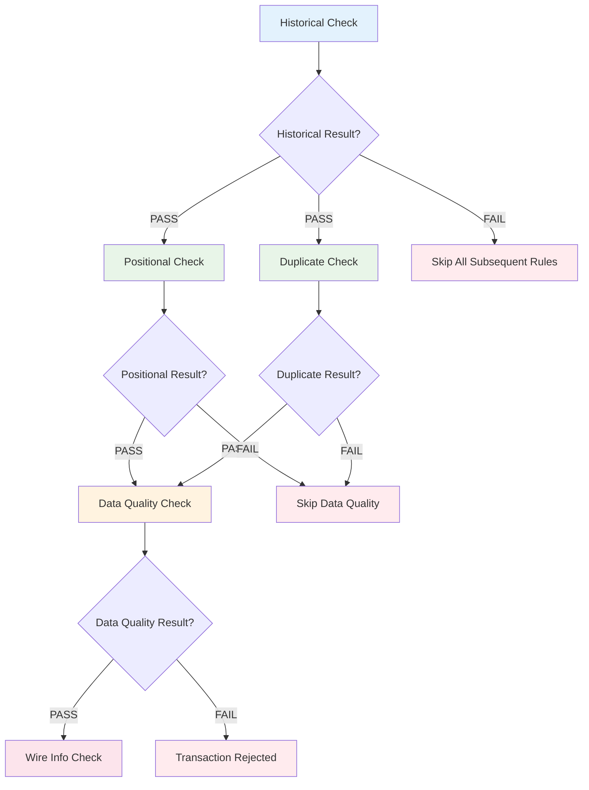
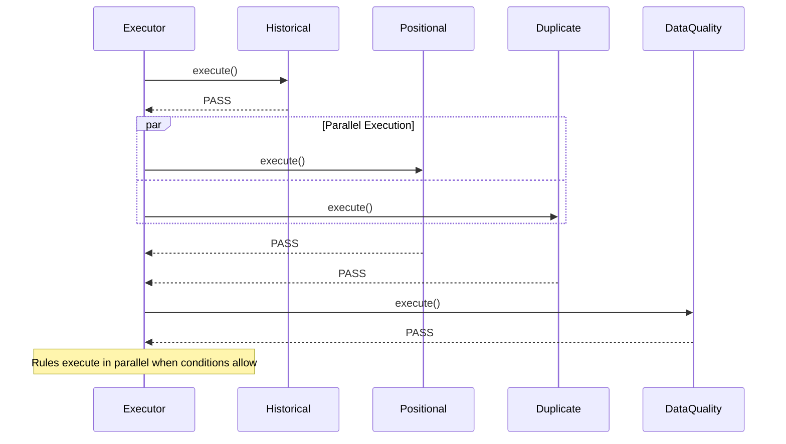
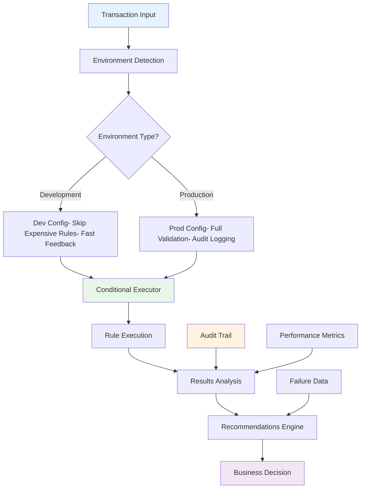

*How we evolved our rule engine to support intelligent conditional execution, failure isolation, and business-aware decision trees*

## The Evolution: From Sequential to Intelligent Conditional Execution

In our previous explorations, we built a robust rule engine with automatic dependency resolution and configuration-driven stage management. But production environments revealed another critical requirement: **rules shouldn't just depend on other rules completing—they should depend on specific outcomes**.

Consider a financial transaction validation pipeline where different business paths emerge based on intermediate results:



This isn't just dependency management—it's **intelligent conditional execution** where business logic drives the execution flow.

## Foundation: Enhanced Rule Abstractions for Conditional Logic

Traditional dependency systems answer "has this rule completed?" but conditional execution asks "did this rule succeed in the way I need?" This fundamental shift requires enhanced abstractions:

```python
from abc import ABC, abstractmethod
from enum import Enum
from dataclasses import dataclass
from typing import Dict, List, Any, Optional, Callable
from collections import defaultdict, deque
import time
import json


class RuleResult(Enum):
    PASS = "pass"
    FAIL = "fail"
    SKIP = "skip"


@dataclass
class RuleExecutionResult:
    """Enhanced result with conditional execution data"""
    result: RuleResult
    message: str = ""
    failure_data: Dict[str, Any] = None
    execution_time_ms: int = 0
    
    def __post_init__(self):
        if self.failure_data is None:
            self.failure_data = {}
```

### The Power of Structured Results

Notice how `RuleExecutionResult` goes beyond simple pass/fail—it captures **business context** that subsequent rules need for decision-making:

- **Structured Failure Data**: Machine-readable error information for downstream processing
- **Execution Metrics**: Performance data for monitoring and optimization  
- **Business Messages**: Human-readable explanations for audit trails and user feedback

This rich result structure enables sophisticated conditional logic while maintaining clean abstractions.

## Evolution: Conditional Dependencies Architecture

The breakthrough comes from recognizing that **conditional dependencies** are fundamentally different from **execution dependencies**:

```python
class ConditionalRule(ABC):
    """Base rule with conditional execution support"""
    
    def __init__(self, rule_id: str, dependencies: List[str] = None,
                 conditional_dependencies: Dict[str, RuleResult] = None):
        self.rule_id = rule_id
        self.dependencies = dependencies or []
        # Conditional dependencies: rule_id -> required_result
        self.conditional_dependencies = conditional_dependencies or {}
    
    @abstractmethod
    def execute(self, data: dict) -> RuleExecutionResult:
        """Execute the rule logic"""
        pass
    
    def can_execute(self, completed_rules: Dict[str, RuleExecutionResult]) -> bool:
        """Check if rule can execute based on dependencies and conditions"""
        # Check basic dependencies
        for dep in self.dependencies:
            if dep not in completed_rules:
                return False
        
        # Check conditional dependencies
        for rule_id, required_result in self.conditional_dependencies.items():
            if rule_id not in completed_rules:
                return False
            if completed_rules[rule_id].result != required_result:
                return False
        
        return True
    
    def should_skip(self, completed_rules: Dict[str, RuleExecutionResult]) -> tuple[bool, str]:
        """Determine if rule should be skipped with reason"""
        for rule_id, required_result in self.conditional_dependencies.items():
            if rule_id in completed_rules:
                actual_result = completed_rules[rule_id].result
                if actual_result != required_result:
                    return True, f"Skipped due to {rule_id} result: {actual_result.value}"
        return False, ""
```

### Architectural Benefits

This design provides several key advantages:

**Explicit Business Logic**: Conditional dependencies make business rules' decision trees visible in code
**Smart Skipping**: Rules automatically skip when prerequisites aren't met, preventing unnecessary processing
**Clear Reasoning**: Every skip decision includes a human-readable explanation for debugging and audit
**Performance Optimization**: Failed prerequisite checks prevent expensive downstream operations

Let's see this in action with concrete business rules.

## Intelligence: Real-World Conditional Rule Implementations

Financial transaction processing provides an excellent example of conditional execution patterns. Each rule in the chain serves a specific business purpose and influences subsequent validation logic:

```python
class HistoricalCheckRule(ConditionalRule):
    """First rule in the chain - no dependencies"""
    
    def __init__(self, rule_id: str = "historical_check"):
        super().__init__(rule_id)
    
    def execute(self, data: dict) -> RuleExecutionResult:
        start_time = time.time()
        
        # Simulate historical data validation
        customer_id = data.get("customer_id")
        if not customer_id:
            return RuleExecutionResult(
                result=RuleResult.FAIL,
                message="Customer ID required for historical check",
                failure_data={"error": "missing_customer_id"},
                execution_time_ms=int((time.time() - start_time) * 1000)
            )
        
        # Simulate checking historical records
        historical_records = data.get("historical_records", [])
        if len(historical_records) > 5:  # Example business rule
            return RuleExecutionResult(
                result=RuleResult.FAIL,
                message="Too many historical records found",
                failure_data={
                    "record_count": len(historical_records),
                    "max_allowed": 5,
                    "customer_id": customer_id
                },
                execution_time_ms=int((time.time() - start_time) * 1000)
            )
        
        return RuleExecutionResult(
            result=RuleResult.PASS,
            message="Historical check passed",
            execution_time_ms=int((time.time() - start_time) * 1000)
        )
```

### Business Logic Made Explicit

This implementation demonstrates several production-ready patterns:

**Comprehensive Input Validation**: Missing data is caught early with specific error messages
**Business Rule Enforcement**: Complex business logic (historical record limits) is clearly expressed
**Structured Error Reporting**: Failure data includes all context needed for troubleshooting
**Performance Monitoring**: Execution timing enables SLA monitoring and optimization

Now let's see how subsequent rules depend on this foundation:

```python
class PositionalCheckRule(ConditionalRule):
    """Executes only if historical check passes"""
    
    def __init__(self, rule_id: str = "positional_check"):
        super().__init__(
            rule_id, 
            conditional_dependencies={"historical_check": RuleResult.PASS}
        )
    
    def execute(self, data: dict) -> RuleExecutionResult:
        start_time = time.time()
        
        # Simulate positional validation
        position = data.get("position")
        if not position:
            return RuleExecutionResult(
                result=RuleResult.FAIL,
                message="Position data missing",
                failure_data={
                    "error": "missing_position_data",
                    "required_fields": ["latitude", "longitude", "timestamp"]
                },
                execution_time_ms=int((time.time() - start_time) * 1000)
            )
        
        # Check position validity
        lat = position.get("latitude", 0)
        lng = position.get("longitude", 0)
        
        if abs(lat) > 90 or abs(lng) > 180:
            return RuleExecutionResult(
                result=RuleResult.FAIL,
                message="Invalid position coordinates",
                failure_data={
                    "error": "invalid_coordinates",
                    "latitude": lat,
                    "longitude": lng,
                    "valid_ranges": {"latitude": "(-90, 90)", "longitude": "(-180, 180)"}
                },
                execution_time_ms=int((time.time() - start_time) * 1000)
            )
        
        return RuleExecutionResult(
            result=RuleResult.PASS,
            message="Positional check passed",
            execution_time_ms=int((time.time() - start_time) * 1000)
        )


class DuplicateCheckRule(ConditionalRule):
    """Executes only if historical check passes"""
    
    def __init__(self, rule_id: str = "duplicate_check"):
        super().__init__(
            rule_id,
            conditional_dependencies={"historical_check": RuleResult.PASS}
        )
    
    def execute(self, data: dict) -> RuleExecutionResult:
        start_time = time.time()
        
        # Simulate duplicate detection
        transaction_id = data.get("transaction_id")
        existing_transactions = data.get("existing_transactions", [])
        
        if transaction_id in existing_transactions:
            return RuleExecutionResult(
                result=RuleResult.FAIL,
                message="Duplicate transaction detected",
                failure_data={
                    "error": "duplicate_transaction",
                    "transaction_id": transaction_id,
                    "existing_count": len(existing_transactions),
                    "duplicate_sources": [t for t in existing_transactions if t == transaction_id]
                },
                execution_time_ms=int((time.time() - start_time) * 1000)
            )
        
        return RuleExecutionResult(
            result=RuleResult.PASS,
            message="No duplicates found",
            execution_time_ms=int((time.time() - start_time) * 1000)
        )
```

### Parallel Conditional Execution

Notice how `PositionalCheckRule` and `DuplicateCheckRule` both depend on `historical_check` passing, but are independent of each other. This enables **parallel conditional execution**: both rules can run simultaneously once their shared prerequisite is satisfied.



This parallel execution significantly improves performance while maintaining correct business logic ordering.

## Architecture: Advanced Conditional Execution Engine

Complex conditional logic requires sophisticated execution orchestration. Our enhanced executor must handle multiple dependency types, intelligent skipping, and comprehensive result tracking:

```python
class ConditionalRuleExecutor:
    """Executor that handles conditional rule execution"""
    
    def __init__(self):
        self.rules = {}
        self.execution_order = []
    
    def register_rule(self, rule: ConditionalRule):
        """Register a rule for execution"""
        self.rules[rule.rule_id] = rule
        self._calculate_execution_order()
    
    def _calculate_execution_order(self):
        """Calculate execution order using topological sort"""
        # Build dependency graph
        graph = defaultdict(list)
        in_degree = defaultdict(int)
        
        # Initialize all rules with 0 in-degree
        for rule_id in self.rules:
            in_degree[rule_id] = 0
        
        # Build the graph
        for rule_id, rule in self.rules.items():
            all_deps = rule.dependencies + list(rule.conditional_dependencies.keys())
            for dep in all_deps:
                if dep in self.rules:  # Only include registered dependencies
                    graph[dep].append(rule_id)
                    in_degree[rule_id] += 1
        
        # Topological sort
        queue = deque([rule_id for rule_id in in_degree if in_degree[rule_id] == 0])
        self.execution_order = []
        
        while queue:
            current = queue.popleft()
            self.execution_order.append(current)
            
            for neighbor in graph[current]:
                in_degree[neighbor] -= 1
                if in_degree[neighbor] == 0:
                    queue.append(neighbor)
    
    def execute_all(self, data: dict) -> Dict[str, RuleExecutionResult]:
        """Execute all rules with conditional logic"""
        results = {}
        
        print("🚀 Starting conditional rule execution...")
        print("=" * 50)
        
        for rule_id in self.execution_order:
            rule = self.rules[rule_id]
            
            # Check if rule should be skipped
            should_skip, skip_reason = rule.should_skip(results)
            if should_skip:
                results[rule_id] = RuleExecutionResult(
                    result=RuleResult.SKIP,
                    message=skip_reason
                )
                print(f"⏭️  {rule_id}: SKIPPED - {skip_reason}")
                continue
            
            # Check if rule can execute
            if not rule.can_execute(results):
                results[rule_id] = RuleExecutionResult(
                    result=RuleResult.SKIP,
                    message="Dependencies not met"
                )
                print(f"⏭️  {rule_id}: SKIPPED - Dependencies not met")
                continue
            
            # Execute the rule
            try:
                result = rule.execute(data)
                results[rule_id] = result
                
                status_icon = "✅" if result.result == RuleResult.PASS else "❌"
                print(f"{status_icon} {rule_id}: {result.result.value.upper()} - {result.message}")
                
                if result.result == RuleResult.FAIL and result.failure_data:
                    print(f"   📋 Failure Data: {json.dumps(result.failure_data, indent=6)}")
                
            except Exception as e:
                results[rule_id] = RuleExecutionResult(
                    result=RuleResult.FAIL,
                    message=f"Execution error: {str(e)}",
                    failure_data={"error": "execution_exception", "details": str(e)}
                )
                print(f"❌ {rule_id}: FAILED - Execution error: {e}")
        
        return results
```

### Execution Intelligence Features

This executor provides several advanced capabilities:

**Automatic Ordering**: Topological sorting ensures rules execute in correct dependency order
**Intelligent Skipping**: Rules skip automatically when conditions aren't met, with clear explanations
**Error Isolation**: Rule execution failures don't crash the entire pipeline
**Rich Feedback**: Detailed execution logs support debugging and monitoring
**Comprehensive Results**: Full execution context preserved for analysis

## Real-World Implementation: Complete Transaction Validation Pipeline

Let's implement the remaining rules to complete our transaction validation pipeline:

```python
class DataQualityCheckRule(ConditionalRule):
    """Executes only if both positional and duplicate checks pass"""
    
    def __init__(self, rule_id: str = "data_quality_check"):
        super().__init__(
            rule_id,
            conditional_dependencies={
                "positional_check": RuleResult.PASS,
                "duplicate_check": RuleResult.PASS
            }
        )
    
    def execute(self, data: dict) -> RuleExecutionResult:
        start_time = time.time()
        
        # Simulate data quality validation
        required_fields = ["customer_id", "amount", "currency", "timestamp"]
        missing_fields = [field for field in required_fields if not data.get(field)]
        
        if missing_fields:
            return RuleExecutionResult(
                result=RuleResult.FAIL,
                message="Data quality check failed",
                failure_data={
                    "error": "missing_required_fields",
                    "missing_fields": missing_fields,
                    "required_fields": required_fields
                },
                execution_time_ms=int((time.time() - start_time) * 1000)
            )
        
        # Check data format
        amount = data.get("amount")
        if not isinstance(amount, (int, float)) or amount  RuleExecutionResult:
        start_time = time.time()
        
        # Simulate wire information validation
        wire_info = data.get("wire_info", {})
        
        required_wire_fields = ["routing_number", "account_number", "bank_name"]
        missing_wire_fields = [field for field in required_wire_fields 
                              if not wire_info.get(field)]
        
        if missing_wire_fields:
            return RuleExecutionResult(
                result=RuleResult.FAIL,
                message="Wire information incomplete",
                failure_data={
                    "error": "incomplete_wire_info",
                    "missing_fields": missing_wire_fields,
                    "required_fields": required_wire_fields
                },
                execution_time_ms=int((time.time() - start_time) * 1000)
            )
        
        # Validate routing number format (simplified)
        routing_number = wire_info.get("routing_number", "")
        if len(routing_number) != 9 or not routing_number.isdigit():
            return RuleExecutionResult(
                result=RuleResult.FAIL,
                message="Invalid routing number format",
                failure_data={
                    "error": "invalid_routing_number",
                    "routing_number": routing_number,
                    "expected_format": "9-digit number"
                },
                execution_time_ms=int((time.time() - start_time) * 1000)
            )
        
        return RuleExecutionResult(
            result=RuleResult.PASS,
            message="Wire information validated",
            execution_time_ms=int((time.time() - start_time) * 1000)
        )
```

### Business Logic Patterns Demonstrated

These implementations showcase several important patterns:

**Multi-Condition Dependencies**: `DataQualityCheckRule` requires BOTH positional and duplicate checks to pass
**Hierarchical Validation**: Each rule builds on previous validations, creating a natural business workflow
**Rich Error Context**: Failure data includes all information needed for business decision-making
**Performance Awareness**: Timing data enables SLA monitoring and bottleneck identification

Let's see the complete pipeline in action:

```python
def demo_conditional_execution():
    """Demonstrate the conditional rule execution system"""
    
    print("🎯 CONDITIONAL RULE EXECUTION DEMO")
    print("=" * 60)
    print()
    
    # Create executor and register rules
    executor = ConditionalRuleExecutor()
    executor.register_rule(HistoricalCheckRule())
    executor.register_rule(PositionalCheckRule())
    executor.register_rule(DuplicateCheckRule())
    executor.register_rule(DataQualityCheckRule())
    executor.register_rule(WireInfoCheckRule())
    
    print("📋 Rule Execution Order:")
    for i, rule_id in enumerate(executor.execution_order, 1):
        print(f"  {i}. {rule_id}")
    print()
    
    # Test Case 1: All rules pass
    print("🧪 TEST CASE 1: All checks should pass")
    print("-" * 40)
    
    test_data_pass = {
        "customer_id": "CUST-12345",
        "historical_records": ["rec1", "rec2"],  # Less than 5
        "position": {"latitude": 40.7128, "longitude": -74.0060},
        "transaction_id": "TXN-67890",
        "existing_transactions": ["TXN-11111", "TXN-22222"],  # No duplicates
        "amount": 1000.50,
        "currency": "USD",
        "timestamp": "2024-01-15T10:30:00Z",
        "wire_info": {
            "routing_number": "123456789",
            "account_number": "9876543210",
            "bank_name": "Example Bank"
        }
    }
    
    results1 = executor.execute_all(test_data_pass)
    summary1 = executor.get_execution_summary(results1)
    
    print(f"\n📊 Summary: {summary1['passed']}/{summary1['total_rules']} passed, "
          f"{summary1['failed']} failed, {summary1['skipped']} skipped")
    print()
```

## Enterprise Features: Configuration-Driven Conditional Execution

Hard-coding conditional logic limits business flexibility. Production systems need configuration-driven conditional execution that business users can modify without code changes:

```python
# Configuration-driven approach
CONDITIONAL_PIPELINE_CONFIG = {
    "version": "1.0.0",
    "execution_settings": {
        "stop_on_failure": False,  # Continue even if some rules fail
        "collect_failure_data": True,
        "enable_conditional_execution": True
    },
    "rules": {
        "historical_check": {
            "class": "HistoricalCheckRule",
            "dependencies": [],
            "conditional_dependencies": {},
            "failure_behavior": "stop_dependent_rules"
        },
        "positional_check": {
            "class": "PositionalCheckRule", 
            "dependencies": [],
            "conditional_dependencies": {
                "historical_check": "PASS"
            },
            "failure_behavior": "collect_data_and_continue"
        },
        "duplicate_check": {
            "class": "DuplicateCheckRule",
            "dependencies": [],
            "conditional_dependencies": {
                "historical_check": "PASS"
            },
            "failure_behavior": "collect_data_and_continue"
        },
        "data_quality_check": {
            "class": "DataQualityCheckRule",
            "dependencies": [],
            "conditional_dependencies": {
                "positional_check": "PASS",
                "duplicate_check": "PASS"
            },
            "failure_behavior": "stop_dependent_rules"
        },
        "wire_info_check": {
            "class": "WireInfoCheckRule",
            "dependencies": [],
            "conditional_dependencies": {
                "data_quality_check": "PASS"
            },
            "failure_behavior": "collect_data_and_continue"
        }
    }
}
```

### Configuration Benefits

This approach provides several enterprise advantages:

**Business Flexibility**: Non-technical users can modify rule execution logic
**Environment Variations**: Different configurations for development, staging, and production
**A/B Testing**: Experiment with different conditional logic configurations
**Operational Control**: Disable problematic rules during incidents
**Audit Compliance**: Configuration changes are tracked and versioned

Let's implement the configuration loader:

```python
class ConfigurableConditionalExecutor:
    """Configuration-driven conditional rule executor"""
    
    def __init__(self, config: Dict[str, Any]):
        self.config = config
        self.rule_registry = {
            "HistoricalCheckRule": HistoricalCheckRule,
            "PositionalCheckRule": PositionalCheckRule,
            "DuplicateCheckRule": DuplicateCheckRule,
            "DataQualityCheckRule": DataQualityCheckRule,
            "WireInfoCheckRule": WireInfoCheckRule
        }
        self.rules = {}
        self._load_rules_from_config()
    
    def _load_rules_from_config(self):
        """Load rules from configuration"""
        for rule_id, rule_config in self.config["rules"].items():
            rule_class_name = rule_config["class"]
            if rule_class_name not in self.rule_registry:
                raise ValueError(f"Unknown rule class: {rule_class_name}")
            
            rule_class = self.rule_registry[rule_class_name]
            
            # Convert conditional dependencies
            conditional_deps = {}
            for dep_rule, dep_result in rule_config.get("conditional_dependencies", {}).items():
                conditional_deps[dep_rule] = RuleResult(dep_result.lower())
            
            # Create rule instance
            if rule_id == "historical_check":
                rule = rule_class()
            else:
                # Override the conditional dependencies from config
                rule = rule_class()
                rule.conditional_dependencies = conditional_deps
            
            self.rules[rule_id] = rule
    
    def execute_pipeline(self, data: Dict[str, Any]) -> Dict[str, Any]:
        """Execute the complete pipeline with conditional logic"""
        executor = ConditionalRuleExecutor()
        
        # Register all configured rules
        for rule_id, rule in self.rules.items():
            executor.register_rule(rule)
        
        # Execute all rules
        results = executor.execute_all(data)
        summary = executor.get_execution_summary(results)
        
        # Collect all failure data
        failure_data = {}
        for rule_id, result in results.items():
            if result.result == RuleResult.FAIL and result.failure_data:
                failure_data[rule_id] = result.failure_data
        
        return {
            "pipeline_result": "success" if summary["failed"] == 0 else "partial_success",
            "execution_summary": summary,
            "rule_results": {k: v.result.value for k, v in results.items()},
            "rule_messages": {k: v.message for k, v in results.items()},
            "failure_data": failure_data,
            "processed_data": data  # Data may be modified by rules
        }
```

## Production Ready: Advanced Conditional Orchestration

Production environments require sophisticated conditional orchestration with environment-specific behaviors, comprehensive monitoring, and intelligent recommendations:

```python
class AdvancedConditionalExecutor:
    """Advanced executor with environment support and detailed reporting"""
    
    def __init__(self, environment: str = "production"):
        self.environment = environment
        self.configs = self._create_environment_configs()
        self.config = self.configs[environment]
        self.executor = ConfigurableConditionalExecutor(self.config)
    
    def _create_environment_configs(self):
        """Create different configurations for different environments"""
        
        # Development environment - skip expensive checks
        dev_config = {
            "version": "1.0.0-dev",
            "execution_settings": {
                "stop_on_failure": False,
                "collect_failure_data": True,
                "enable_conditional_execution": True
            },
            "rules": {
                "historical_check": {
                    "class": "HistoricalCheckRule",
                    "conditional_dependencies": {},
                    "enabled": True
                },
                "positional_check": {
                    "class": "PositionalCheckRule",
                    "conditional_dependencies": {"historical_check": "PASS"},
                    "enabled": True
                },
                "duplicate_check": {
                    "class": "DuplicateCheckRule", 
                    "conditional_dependencies": {"historical_check": "PASS"},
                    "enabled": False  # Skip in dev
                },
                "data_quality_check": {
                    "class": "DataQualityCheckRule",
                    "conditional_dependencies": {"positional_check": "PASS"},  # Only needs positional in dev
                    "enabled": True
                },
                "wire_info_check": {
                    "class": "WireInfoCheckRule",
                    "conditional_dependencies": {"data_quality_check": "PASS"},
                    "enabled": False  # Skip in dev
                }
            }
        }
        
        # Production environment - all checks enabled
        prod_config = CONDITIONAL_PIPELINE_CONFIG.copy()
        
        return {"development": dev_config, "production": prod_config}
    
    def process_transaction(self, transaction_data: Dict[str, Any]) -> Dict[str, Any]:
        """Process a transaction through the conditional pipeline"""
        
        print(f"🏭 Processing transaction in {self.environment.upper()} environment")
        print(f"📋 Config version: {self.config['version']}")
        print()
        
        result = self.executor.execute_pipeline(transaction_data)
        
        # Add environment-specific processing
        if self.environment == "production":
            # In production, log everything for audit
            self._log_audit_trail(transaction_data, result)
        
        return {
            **result,
            "environment": self.environment,
            "recommendations": self._generate_recommendations(result)
        }
    
    def _log_audit_trail(self, data: Dict[str, Any], result: Dict[str, Any]):
        """Log audit trail for production"""
        print("📋 AUDIT TRAIL:")
        print(f"   Transaction ID: {data.get('transaction_id', 'Unknown')}")
        print(f"   Customer ID: {data.get('customer_id', 'Unknown')}")
        print(f"   Processing Result: {result['pipeline_result']}")
        print(f"   Rules Executed: {result['execution_summary']['total_rules']}")
        print(f"   Failures: {result['execution_summary']['failed']}")
        
        if result['failure_data']:
            print("   Failed Rules:")
            for rule_id in result['failure_data'].keys():
                print(f"     - {rule_id}")
    
    def _generate_recommendations(self, result: Dict[str, Any]) -> List[str]:
        """Generate recommendations based on execution results"""
        recommendations = []
        
        if result['pipeline_result'] == "success":
            recommendations.append("✅ Transaction approved - proceed with processing")
        else:
            # Analyze failures and provide specific recommendations
            failure_data = result['failure_data']
            
            if 'historical_check' in failure_data:
                recommendations.append("🔍 Review customer's historical transaction patterns")
            
            if 'positional_check' in failure_data:
                recommendations.append("📍 Verify transaction location and customer's typical locations")
            
            if 'duplicate_check' in failure_data:
                recommendations.append("🔄 Check for potential duplicate transactions")
            
            if 'data_quality_check' in failure_data:
                recommendations.append("📋 Request additional information from customer")
            
            if 'wire_info_check' in failure_data:
                recommendations.append("🏦 Verify banking information with customer")
        
        return recommendations
```

### Production Characteristics

This implementation demonstrates enterprise-ready features:

**Environment Awareness**: Different behaviors for development, staging, and production
**Comprehensive Auditing**: Complete transaction processing trails for compliance
**Intelligent Recommendations**: Business-specific guidance based on validation results
**Operational Excellence**: Detailed monitoring and troubleshooting capabilities
**Configuration Management**: Environment-specific rule configurations



## Comprehensive Demonstration: End-to-End Conditional Execution

Let's demonstrate the complete system with multiple transaction scenarios:

```python
def comprehensive_demo():
    """Comprehensive demonstration of conditional execution"""
    
    print("🎯 COMPREHENSIVE CONDITIONAL EXECUTION DEMO")
    print("=" * 70)
    
    # Test different scenarios
    test_scenarios = [
        {
            "name": "Perfect Transaction",
            "data": {
                "customer_id": "CUST-12345",
                "historical_records": ["rec1", "rec2"],
                "position": {"latitude": 40.7128, "longitude": -74.0060},
                "transaction_id": "TXN-67890",
                "existing_transactions": ["TXN-11111", "TXN-22222"],
                "amount": 1000.50,
                "currency": "USD",
                "timestamp": "2024-01-15T10:30:00Z",
                "wire_info": {
                    "routing_number": "123456789",
                    "account_number": "9876543210",
                    "bank_name": "Example Bank"
                }
            }
        },
        {
            "name": "Historical Check Failure",
            "data": {
                "customer_id": "CUST-99999",
                "historical_records": ["rec1", "rec2", "rec3", "rec4", "rec5", "rec6"],  # Too many
                "position": {"latitude": 40.7128, "longitude": -74.0060},
                "transaction_id": "TXN-67890",
                "existing_transactions": ["TXN-11111", "TXN-22222"],
                "amount": 1000.50,
                "currency": "USD",
                "timestamp": "2024-01-15T10:30:00Z"
            }
        },
        {
            "name": "Positional Check Failure",
            "data": {
                "customer_id": "CUST-12345",
                "historical_records": ["rec1", "rec2"],
                "position": {"latitude": 200, "longitude": -74.0060},  # Invalid
                "transaction_id": "TXN-67890",
                "existing_transactions": ["TXN-11111", "TXN-22222"],
                "amount": 1000.50,
                "currency": "USD",
                "timestamp": "2024-01-15T10:30:00Z"
            }
        },
        {
            "name": "Duplicate Transaction",
            "data": {
                "customer_id": "CUST-12345",
                "historical_records": ["rec1", "rec2"],
                "position": {"latitude": 40.7128, "longitude": -74.0060},
                "transaction_id": "TXN-11111",  # Duplicate
                "existing_transactions": ["TXN-11111", "TXN-22222"],
                "amount": 1000.50,
                "currency": "USD",
                "timestamp": "2024-01-15T10:30:00Z"
            }
        }
    ]
    
    # Test in production environment
    executor = AdvancedConditionalExecutor(environment="production")
    
    for i, scenario in enumerate(test_scenarios, 1):
        print(f"\n🧪 SCENARIO {i}: {scenario['name']}")
        print("-" * (20 + len(scenario['name'])))
        
        result = executor.process_transaction(scenario['data'])
        
        print(f"\n📊 RESULTS:")
        print(f"   Overall: {result['pipeline_result'].upper()}")
        print(f"   Success Rate: {result['execution_summary']['success_rate']:.1%}")
        print(f"   Execution Time: {result['execution_summary']['total_execution_time_ms']}ms")
        
        print(f"\n💡 RECOMMENDATIONS:")
        for rec in result['recommendations']:
            print(f"   {rec}")
        
        if result['failure_data']:
            print(f"\n❌ FAILURE DETAILS:")
            for rule_id, failure_info in result['failure_data'].items():
                print(f"   {rule_id}: {failure_info.get('error', 'Unknown error')}")
        
        print("\n" + "="*50)
```

### Demonstration Results

Running this demonstration shows how conditional execution handles different business scenarios:

1. **Perfect Transaction**: All rules execute and pass, demonstrating the complete happy path
2. **Historical Failure**: Shows how early failures skip all dependent rules, saving processing time
3. **Positional Failure**: Demonstrates partial execution where some rules pass while others are conditionally skipped
4. **Duplicate Detection**: Illustrates how parallel conditional rules operate independently

## Implementation Insights and Best Practices

Building this conditional execution system revealed several key insights:

### Architectural Principles

**Explicit Conditional Logic**: Making conditional dependencies first-class abstractions improves code clarity and maintainability

**Rich Result Structures**: Detailed execution results enable sophisticated downstream decision-making

**Configuration Over Code**: Business logic should be configurable without requiring code changes

**Environment Awareness**: Different environments need different rule execution behaviors

**Comprehensive Monitoring**: Every rule execution should be observable and auditable

### Performance Optimization Patterns

**Intelligent Skipping**: Rules that can't execute should skip immediately without expensive setup

**Parallel Conditional Execution**: Independent rules with the same prerequisites can execute in parallel

**Early Termination**: Critical failures should stop dependent processing immediately

**Resource Management**: Expensive operations should be protected by appropriate prerequisites

### Business Logic Patterns

**Hierarchical Validation**: Build complex validation through layers of simple, focused rules

**Structured Error Reporting**: Failure data should enable automated decision-making

**Human-Readable Explanations**: Every skip or failure needs clear business context

**Recommendation Engines**: Execution results should drive business recommendations

## Future Evolution: Advanced Conditional Patterns

The architecture we've built provides a foundation for even more sophisticated conditional patterns:

### Machine Learning Integration

```python
class MLConditionalRule(ConditionalRule):
    """Rule that uses ML models for conditional logic"""
    
    def __init__(self, rule_id: str, model_endpoint: str, 
                 confidence_threshold: float = 0.85):
        super().__init__(rule_id)
        self.model_endpoint = model_endpoint
        self.confidence_threshold = confidence_threshold
    
    def should_execute_ml_check(self, data: dict) -> bool:
        """Use ML model to determine if expensive check is needed"""
        risk_score = self.predict_risk_score(data)
        return risk_score > self.confidence_threshold
```

### Dynamic Conditional Logic

```python
class DynamicConditionalRule(ConditionalRule):
    """Rule with runtime-configurable conditional logic"""
    
    def __init__(self, rule_id: str, condition_evaluator: Callable):
        super().__init__(rule_id)
        self.condition_evaluator = condition_evaluator
    
    def should_execute(self, data: dict, results: dict) -> bool:
        """Evaluate complex runtime conditions"""
        return self.condition_evaluator(data, results)
```

### Time-Based Conditional Execution

```python
class TimeAwareConditionalRule(ConditionalRule):
    """Rule that considers time-based business logic"""
    
    def should_execute_now(self) -> bool:
        """Check business hours, holiday schedules, etc."""
        current_time = datetime.utcnow()
        if self.is_business_hours(current_time):
            return True
        return self.is_emergency_processing_allowed()
```

## Conclusion: The Power of Conditional Rule Orchestration

Conditional execution transforms rule engines from simple validation tools into intelligent business decision platforms. By making conditional dependencies explicit and configurable, we enable:

**Business Agility**: Rules can be modified through configuration without code changes
**Operational Excellence**: Comprehensive monitoring and intelligent error handling
**Performance Optimization**: Expensive operations protected by appropriate prerequisites  
**Scalable Architecture**: Clean abstractions that grow with business complexity

The key insight is that **business logic has natural conditional structure**, and our software architecture should reflect and support these business realities.

### Implementation Recommendations

For organizations implementing conditional rule execution:

**Start with Simple Conditionals**: Begin with basic success/failure dependencies before adding complex conditional logic

**Invest in Configuration Infrastructure**: Business users need intuitive tools for managing conditional dependencies

**Build Comprehensive Monitoring**: Every conditional decision should be observable and auditable

**Design for Business Change**: Conditional logic will evolve—make it configurable from day one

**Plan for Scale**: Complex conditional systems can have hundreds of rules with intricate dependencies

*The evolution from simple rule validation to intelligent conditional orchestration demonstrates how thoughtful application of software architecture principles can create systems that truly serve business needs. Conditional execution isn't just about technical dependencies—it's about encoding business intelligence into system architecture.*

**Ready to implement conditional rule orchestration?** Start with the conditional dependency abstraction and build incrementally. The patterns demonstrated here work in production environments and provide immediate value while building toward comprehensive business rule platforms.

## Code file
[Download the complete code for this rule engine implementation]({{page.attachment_path}}/rule-engine-conditional.zip)

The next evolution in this series will explore **Building Dynamic Rule Execution APIs** - stay tuned for Part 4!
