In today's data-driven landscape, the ability to search, analyze, and visualize massive volumes of data in real-time has become essential for successful digital operations. **OpenSearch** stands at the forefront of this revolution, offering a powerful, open-source search and analytics suite that addresses complex data management needs while maintaining complete transparency and community-driven development.

This guide will take you from understanding OpenSearch's core architecture to implementing practical solutions with clear examples. Whether you're building search functionality, analyzing logs, or creating real-time dashboards, this guide provides the essential knowledge for experienced software engineers.

## Table of Contents

1. [Understanding the Problem OpenSearch Solves](#understanding-the-problem-opensearch-solves)
2. [OpenSearch Architecture Deep Dive](#opensearch-architecture-deep-dive)  
3. [When to Use OpenSearch (and When Not To)](#when-to-use-opensearch)
4. [Core Components and Internal Mechanisms](#core-components-and-internal-mechanisms)
5. [Installation and Environment Setup](#installation-and-environment-setup)
6. [Hands-On Implementation Guide](#hands-on-implementation-guide)
7. [Advanced Data Processing Pipelines](#advanced-data-processing-pipelines)
8. [Monitoring and Performance Optimization](#monitoring-and-performance-optimization)
9. [Production Best Practices](#production-best-practices)
10. [Troubleshooting and Maintenance](#troubleshooting-and-maintenance)

***

## Understanding the Problem OpenSearch Solves

### The Modern Data Challenge

Traditional relational databases excel at structured queries and ACID transactions, but they struggle with several modern requirements:

**Full-Text Search Limitations**: SQL's `LIKE` operator doesn't provide relevance scoring, fuzzy matching, or language-aware search. Searching for "running shoes" should match documents containing "athletic footwear" or handle typos like "runing shoes."

**Scale and Performance**: A typical e-commerce site might need to search through millions of products in milliseconds. Traditional databases require expensive full-table scans for unindexed text searches.

**Real-Time Analytics**: Business intelligence increasingly demands sub-second response times for complex aggregations across time-series data.

### Real-World Problem Examples

**E-commerce Search**:
```sql
-- Traditional SQL approach (slow and limited)
SELECT * FROM products 
WHERE name LIKE '%laptop%' OR description LIKE '%laptop%'
ORDER BY popularity DESC;
```

**Log Analysis Challenge**:
```bash
# Searching through GBs of log files
grep -r "ERROR" /var/logs/* | grep "payment"
# This becomes impractical with terabytes of historical data
```

**Business Intelligence Bottleneck**:
```sql
-- Complex aggregation that takes minutes in traditional RDBMS
SELECT 
    DATE(created_at) as day,
    COUNT(*) as orders,
    AVG(total_amount) as avg_order_value,
    COUNT(DISTINCT customer_id) as unique_customers
FROM orders 
WHERE created_at >= '2024-01-01'
GROUP BY DATE(created_at)
ORDER BY day;
```

OpenSearch solves these problems by providing:
- **Relevance-based search** with scoring algorithms
- **Horizontal scaling** across commodity hardware
- **Real-time indexing** and sub-second query response
- **Rich aggregation framework** for analytics

***

## OpenSearch Architecture Deep Dive

### Distributed Foundation

OpenSearch operates on a **shared-nothing architecture** where data is automatically distributed across multiple nodes. This design provides both horizontal scalability and fault tolerance.

```mermaid
graph TB
    subgraph "OpenSearch Cluster"
        subgraph "Master Nodes"
            M1[Master Node 1• Cluster State• Node Discovery• Index Creation]
            M2[Master Node 2• Backup Master• State Replication]
            M3[Master Node 3• Backup Master• State Replication]
        end
        
        subgraph "Data Nodes"
            D1[Data Node 1• Primary Shards• Replica Shards• Query Execution]
            D2[Data Node 2• Primary Shards• Replica Shards• Query Execution]
            D3[Data Node 3• Primary Shards• Replica Shards• Query Execution]
        end
        
        subgraph "Coordinating Nodes"
            C1[Coordinator 1• Request Routing• Result Aggregation]
            C2[Coordinator 2• Load Balancing• Query Distribution]
        end
        
        Client[Client Application] --> C1
        Client --> C2
        
        M1 -.-> M2
        M1 -.-> M3
        M2 -.-> M3
        
        C1 --> D1
        C1 --> D2
        C1 --> D3
        C2 --> D1
        C2 --> D2
        C2 --> D3
    end
```



### Node Specialization

**Master Nodes**: Manage cluster state and coordinate operations  
**Data Nodes**: Store actual data and execute queries  
**Ingest Nodes**: Pre-process documents before indexing  
**Coordinating Nodes**: Route requests and aggregate results


### When to Use OpenSearch (and When Not To)

#### ✅ Ideal Use Cases

**Full-Text Search Applications**:
- E-commerce product search with autocomplete and filters
- Document management systems
- Content management platforms
- Knowledge bases with semantic search

**Log Analytics and Observability**:
- Centralized application logging
- Security event monitoring (SIEM)
- Performance monitoring and APM
- Infrastructure metrics analysis

**Real-Time Analytics**:
- Business intelligence dashboards
- User behavior tracking
- IoT sensor data analysis
- Financial transaction monitoring

#### ❌ When Not to Use OpenSearch

**Simple CRUD Operations**:
```python
# Don't use OpenSearch for this
user = User.objects.get(id=123)
user.email = "new@email.com"
user.save()
```

**Complex Transactions**:
```sql
-- OpenSearch can't handle ACID transactions
BEGIN TRANSACTION;
UPDATE accounts SET balance = balance - 100 WHERE id = 1;
UPDATE accounts SET balance = balance + 100 WHERE id = 2;
COMMIT;
```

**Small Data Sets**: If your data fits comfortably in a traditional database (e.g., less than a few million records and simple queries), OpenSearch is likely overkill—stick with a relational database for simplicity and efficiency.

***

### Indexing Flow Example

This diagram illustrates how a document is indexed in a distributed search system like OpenSearch. The process starts with the client sending an index request, which is routed by the coordinator node to the appropriate primary shard. The primary shard indexes the document using Lucene, then replicates the change to replica shards for redundancy. Once all steps succeed, a confirmation is sent back to the client.


### Text Analysis Pipeline

OpenSearch transforms text through a sophisticated analysis pipeline before indexing:


### Search Query Execution Flow

The search query execution in OpenSearch involves multiple phases, including parsing, scattering, gathering, and fetching results. The coordinator node orchestrates the entire process:


### Lucene Segments and Merging
OpenSearch uses Lucene's segment-based storage model, where each index is composed of multiple immutable segments. Over time, small segments are merged into larger ones to optimize search performance and storage efficiency.

```mermaid
graph TD
    subgraph "Lucene Index Structure"
        subgraph "Shard"
            S1[Segment 11000 docsImmutable]
            S2[Segment 2800 docsImmutable]
            S3[Segment 31200 docsImmutable]
            S4[Segment 4500 docsImmutable]
        end
        
        subgraph "Merge Process"
            Merge[Merge Policy• Combines small segments• Removes deleted docs• Optimizes storage]
        end
        
        subgraph "After Merge"
            S5[Segment 53500 docsOptimized]
        end
    end
    
    S1 --> Merge
    S2 --> Merge
    S3 --> Merge
    S4 --> Merge
    Merge --> S5
```



### Inverted Index Structure

OpenSearch uses an **inverted index** to enable fast full-text search. Instead of storing documents as-is, it breaks them into terms (tokens) and builds a mapping from each term to the documents (and positions) where it appears. Here’s a clear breakdown:

#### Example Documents

| Doc ID | Content                              |
|--------|--------------------------------------|
| 1      | "MacBook Pro laptop computer"        |
| 2      | "Dell laptop affordable price"       |
| 3      | "iPad tablet computer device"        |

#### Tokenization

Each document is split into terms (lowercased, punctuation removed):

- **Doc 1:** macbook, pro, laptop, computer
- **Doc 2:** dell, laptop, affordable, price
- **Doc 3:** ipad, tablet, computer, device

#### Inverted Index Table

| Term        | Postings List (Doc ID : Positions)      |
|-------------|----------------------------------------|
| macbook     | 1 : [0]                                |
| pro         | 1 : [1]                                |
| laptop      | 1 : [2], 2 : [1]                       |
| computer    | 1 : [3], 3 : [2]                       |
| dell        | 2 : [0]                                |
| affordable  | 2 : [2]                                |
| price       | 2 : [3]                                |
| ipad        | 3 : [0]                                |
| tablet      | 3 : [1]                                |
| device      | 3 : [3]                                |

#### Visual Diagram


**How it works:**  
When you search for a term (e.g., `laptop`), OpenSearch looks up the postings list for `laptop` and instantly finds all matching documents and their positions. This structure enables fast, scalable search across large datasets.

### Memory Management and Caching

OpenSearch optimizes memory usage through a combination of JVM heap and off-heap memory management. It uses Lucene's efficient segment storage and caching mechanisms to ensure high performance even with large datasets.

The following diagram illustrates how OpenSearch manages memory and storage across different layers, each optimized for performance and durability:


#### Phases of Data Flow with Example

Suppose you search for `"laptop"` in your product catalog:

1. **JVM Heap (In-Memory Caches)**
   - **Query Cache**: If you recently searched for `"laptop"`, the filter results may be cached here for instant retrieval.
   - **Field Data Cache**: If your query sorts by price, the sorted field values are loaded and cached here.
   - **Request Cache**: If the exact same search (including filters and sorting) was run before, the entire response may be cached and returned immediately.

2. **Off-Heap Memory**
   - **Segment Memory**: If the result isn't cached, OpenSearch reads Lucene segments (the searchable data structures) from off-heap memory, which is managed outside the JVM for efficiency.
   - **Buffer Cache**: The operating system may keep frequently accessed segment files in its own file system cache, speeding up repeated disk reads.

3. **Disk Storage**
   - **Index Files**: If the required data isn't in memory, OpenSearch reads the actual segment files from disk.
   - **Transaction Log**: When you index (add) a new product, the operation is first written to the transaction log to ensure durability before being committed to the index files.

## The Journey of Data: End-to-End Ingestion and Indexing
let's combine all we've learned about OpenSearch's architecture and flow into a cohesive understanding of how data moves through the system, from ingestion to searchability.

> **The process by which a piece of data—such as a log line or a product document—is ingested, processed, and made searchable within OpenSearch is a sophisticated, multi-stage journey.**  
This journey is a carefully engineered balance between two competing goals: write performance and data durability on one hand, and search latency (i.e., making data searchable quickly) on the other. Understanding this lifecycle is critical for performance tuning and troubleshooting. The entire system is explicitly tunable, allowing architects to adjust this balance to fit their specific workload requirements.

---

### **Stage 1: Data Sourcing and Pipeline Initiation**

The journey begins at the source. Data can originate from a vast array of systems: web servers generating access logs, applications emitting structured logs, IoT devices sending metrics, or cloud services publishing events to a stream.  
This raw data is then sent by a data shipper (like **Fluent Bit**, **Logstash**, or a custom application) to an ingestion endpoint.

For robust, production-grade systems, this endpoint is typically a dedicated ingestion layer, such as a self-hosted **Data Prepper** instance or a managed **Amazon OpenSearch Ingestion** pipeline. For simpler use cases, the data might be sent directly to an **Ingest Node** within the OpenSearch cluster itself.

---

### **Stage 2: Pre-Processing with Processors**

Once the data enters an ingest pipeline, it undergoes a series of transformations. This pre-processing stage is where raw, often messy, data is cleaned, structured, and enriched to maximize its value for search and analysis. The pipeline executes a sequence of processors, each performing a specific task:

- **Parsing:**  
    A processor like **Grok** uses regular-expression-like patterns to parse a raw log line (e.g., an Apache access log) into a structured JSON document with named fields like `client_ip`, `http_verb`, and `response_code`.

- **Enriching:**  
    The structured document is then augmented with additional context. The **GeoIP** processor can take an IP address field and add geographic information like city, country, and coordinates. The **Enrich** processor can perform a lookup against a separate "enrich" index to add metadata, such as looking up a product ID to add the product name and category.

- **Transforming:**  
    The structure of the document itself can be modified. Processors can be used to rename fields for consistency, remove sensitive or unnecessary fields (like PII), convert data types (e.g., changing a numeric string to an integer), or run custom scripts for more complex logic.

> _This pre-processing is a critical architectural concern. It ensures that the data being indexed is clean, consistent, and optimized for the queries that will be run against it._

---

### **Stage 3: The Indexing Process – From Request to Persistence**

After pre-processing, the clean JSON document is sent to the OpenSearch cluster for indexing. This final stage is a finely tuned sequence of operations involving memory buffers and disk writes to achieve both speed and safety.

#### **Routing and In-Memory Buffering**

The request arrives at a data node, which uses the document's ID (or a specified routing value) to calculate which primary shard should receive the document. The request is then forwarded to the node holding that shard.  
Upon arrival, the document is added to an **in-memory buffer**. Writing to memory is extremely fast, allowing OpenSearch to handle very high indexing throughput.

#### **The Transaction Log (Translog) for Durability**

While writing to an in-memory buffer is fast, it is also volatile; if the node were to crash, that data would be lost. To prevent this, OpenSearch simultaneously writes the indexing operation to an on-disk **transaction log** (translog).  
This write to the translog is a lightweight append operation that is persisted to disk. In the event of a node failure, OpenSearch can replay any operations from the translog that had not yet been permanently written, thus ensuring data durability and preventing data loss.

#### **The `refresh` Operation: The Path to Near Real-Time Searchability**

The data in the in-memory buffer is not yet visible to search queries. To make it searchable, OpenSearch performs a periodic **refresh** operation. By default, this happens every one second for indices that have received a search request recently.  
During a refresh, the contents of the in-memory buffer are written to a new, immutable **Lucene segment file** in the operating system's filesystem cache. Once this segment is written, the documents within it become available for search.  
This slight delay between indexing and visibility is why OpenSearch is described as providing _"near"_ real-time search. A refresh is a relatively lightweight operation, but it does not guarantee durability, as the filesystem cache has not necessarily been fsync'd to the physical disk.

#### **The `flush` Operation: The Commitment to Durable Storage**

To guarantee that data is permanently and safely stored, OpenSearch performs a heavier operation called a **flush**. A flush is a full Lucene commit. It achieves two things:

1. It forces an fsync on all segment files in the filesystem cache, writing them durably to the physical disk.
2. It purges the old translog, as the operations recorded within it are now safely stored in the committed segments.

OpenSearch triggers flushes automatically based on factors like the size of the translog (controlled by `index.translog.flush_threshold_size`, default 512 MB).  
Because flushes are resource-intensive, performing them less frequently (by increasing the threshold) can improve indexing performance at the cost of using more disk space for the translog in the interim.

#### **Long-Term Health: Segment Merging**

The refresh process results in the creation of many small segment files. Searching a large number of small segments is inefficient. To maintain long-term search performance, OpenSearch runs a background process that periodically merges smaller segments into fewer, larger ones.  
This segment merging process is crucial for managing resource usage and ensuring fast query performance over the life of an index.

---

#### **OpenSearch Indexing Lifecycle: State-by-State Analysis**

| Stage            | Action                                                        | Data Location                | Searchable? | Durable?                |
|------------------|---------------------------------------------------------------|------------------------------|-------------|-------------------------|
| Document Arrival | Added to memory buffer and written to translog                | Memory & Translog (disk)     | No          | Yes (via translog)      |
| refresh          | Buffer written to new segment file (not fsync'd)              | Filesystem cache             | Yes         | Not guaranteed          |
| flush            | Segments fsync'd to disk, translog purged                     | Physical disk                | Yes         | Fully durable           |
| merge            | Small segments merged into larger ones (background process)   | Physical disk                | No change   | No change               |


## Installation and Environment Setup

### Docker Setup (Quickest Start)

```yaml
# docker-compose.yml
version: '3'
services:
  opensearch-node1:
    image: opensearchproject/opensearch:latest
    container_name: opensearch-node1
    environment:
      # Set cluster name for node identification
      - cluster.name=opensearch-cluster
      # Set unique node name
      - node.name=opensearch-node1
      # Configure discovery for single-node cluster
      - discovery.seed_hosts=opensearch-node1
      - cluster.initial_cluster_manager_nodes=opensearch-node1
      # Lock memory to prevent swapping (improves performance)
      - bootstrap.memory_lock=true
      # Set JVM heap size (50% of available RAM, max 32GB)
      - "OPENSEARCH_JAVA_OPTS=-Xms512m -Xmx512m"
      # Disable security for development (NEVER in production)
      - "DISABLE_SECURITY_PLUGIN=true"
    ports:
      # OpenSearch API port
      - 9200:9200
      # Node communication port
      - 9600:9600

  opensearch-dashboards:
    image: opensearchproject/opensearch-dashboards:latest
    container_name: opensearch-dashboards
    ports:
      # Dashboards web interface port
      - 5601:5601
    environment:
      # Point dashboards to OpenSearch cluster
      OPENSEARCH_HOSTS: '["http://opensearch-node1:9200"]'
      # Disable security for development
      DISABLE_SECURITY_DASHBOARDS_PLUGIN: "true"
```

Start the cluster:
```bash
# Start all services in detached mode
docker-compose up -d
```

### Verify Installation

```bash
# Check cluster health endpoint
curl -X GET "localhost:9200/_cluster/health?pretty"

# Expected response
{
  "cluster_name" : "opensearch-cluster",
  "status" : "yellow",  # Yellow is normal for single-node
  "timed_out" : false,
  "number_of_nodes" : 1,
  "number_of_data_nodes" : 1
}
```

***

## Hands-On Implementation Guide

### Setting Up Python Client

```python
# Install the official OpenSearch Python client
# pip install opensearch-py

from opensearchpy import OpenSearch

# Create client connection with detailed configuration
client = OpenSearch([
    {'host': 'localhost', 'port': 9200}  # Define OpenSearch endpoint
],
http_auth=None,      # No authentication for development
use_ssl=False,       # Disable SSL for local development
verify_certs=False   # Skip certificate verification
)

# Test connection and get cluster information
info = client.info()
print(f"Connected to OpenSearch {info['version']['number']}")
```

### Creating Your First Index

```python
# Define comprehensive index mapping with field types and analyzers
index_mapping = {
    "settings": {
        # Number of primary shards (cannot be changed after creation)
        "number_of_shards": 1,
        # Number of replica shards (can be changed dynamically)
        "number_of_replicas": 0
    },
    "mappings": {
        "properties": {
            "title": {
                # Full-text searchable field
                "type": "text",
                # Use standard analyzer (tokenizes, lowercases, removes punctuation)
                "analyzer": "standard"
            },
            "content": {
                # Another full-text field without explicit analyzer
                "type": "text"
            },
            "author": {
                # Exact-match only field (no analysis)
                "type": "keyword"
            },
            "published_date": {
                # Date field with automatic parsing
                "type": "date"
            },
            "tags": {
                # Array of exact-match strings
                "type": "keyword"
            }
        }
    }
}

# Create the index with the defined mapping
response = client.indices.create(index="blog_posts", body=index_mapping)
print("Index created successfully!")
```

### Indexing Sample Data

```python
# Sample blog posts data structure
blog_posts = [
    {
        "title": "Getting Started with OpenSearch",
        "content": "OpenSearch is a powerful search and analytics engine...",
        "author": "john_doe",
        "published_date": "2024-01-15",
        "tags": ["opensearch", "tutorial", "beginners"]
    },
    {
        "title": "Advanced OpenSearch Queries",
        "content": "Learn complex query techniques for better search results...",
        "author": "jane_smith",
        "published_date": "2024-01-20", 
        "tags": ["opensearch", "advanced", "queries"]
    },
    {
        "title": "OpenSearch vs Elasticsearch",
        "content": "Comparing the features and performance of OpenSearch...",
        "author": "bob_wilson",
        "published_date": "2024-01-25",
        "tags": ["comparison", "opensearch", "elasticsearch"]
    }
]

# Index each document with explicit ID and immediate refresh
for i, post in enumerate(blog_posts, 1):
    response = client.index(
        index="blog_posts",    # Target index name
        id=i,                  # Document ID (can be auto-generated if omitted)
        body=post,            # Document content as dictionary
        refresh=True          # Force immediate refresh for searchability
    )
    print(f"Indexed post {i}: {response['result']}")
```

### Basic Search Operations

```python
# 1. Simple term search with detailed explanation
def search_by_term(term):
    """Search for documents containing a specific term"""
    
    search_body = {
        "query": {
            "match": {
                # Search in the 'content' field for the given term
                "content": term
            }
        }
    }
    
    # Execute search query
    results = client.search(index="blog_posts", body=search_body)
    
    # Extract and display results
    total_hits = results['hits']['total']['value']
    print(f"Found {total_hits} results for '{term}':")
    
    for hit in results['hits']['hits']:
        # Extract document source and relevance score
        doc = hit['_source']
        score = hit['_score']
        print(f"- {doc['title']} (Score: {score})")

# 2. Multi-field search with boosting
def search_multiple_fields(query):
    """Search across multiple fields with different importance weights"""
    
    search_body = {
        "query": {
            "multi_match": {
                "query": query,
                # Search across multiple fields with boost values
                "fields": ["title^2", "content", "tags"],  # Title has 2x importance
                # Use best_fields for most relevant field match
                "type": "best_fields"
            }
        }
    }
    
    results = client.search(index="blog_posts", body=search_body)
    return results

# 3. Filtered search with boolean query
def search_with_filters(query, author=None, date_from=None):
    """Combine text search with exact-match filters"""
    
    search_body = {
        "query": {
            "bool": {
                # Documents must match this text query
                "must": [
                    {
                        "multi_match": {
                            "query": query,
                            "fields": ["title", "content"]
                        }
                    }
                ],
                # Additional filters that don't affect scoring
                "filter": []
            }
        }
    }
    
    # Add author filter if specified
    if author:
        search_body["query"]["bool"]["filter"].append({
            "term": {"author": author}  # Exact match on author field
        })
    
    # Add date range filter if specified
    if date_from:
        search_body["query"]["bool"]["filter"].append({
            "range": {
                "published_date": {"gte": date_from}  # Greater than or equal
            }
        })
    
    return client.search(index="blog_posts", body=search_body)

# Execute example searches
search_by_term("OpenSearch")
print("\n" + "="*50 + "\n")

results = search_multiple_fields("advanced queries")
print("Multi-field search results:")
for hit in results['hits']['hits']:
    print(f"- {hit['_source']['title']}")

print("\n" + "="*50 + "\n")

filtered_results = search_with_filters("OpenSearch", author="john_doe")
print("Filtered search results:")
for hit in filtered_results['hits']['hits']:
    source = hit['_source']
    print(f"- {source['title']} by {source['author']}")
```

### Aggregations (Analytics)

```python
# Analytics queries for data insights
def analyze_blog_data():
    """Perform various analytics on blog post data"""
    
    # 1. Count posts by author with sub-aggregations
    agg_body = {
        "size": 0,  # Don't return documents, only aggregation results
        "aggs": {
            "authors": {
                "terms": {
                    "field": "author",  # Group by author field
                    "size": 10         # Return top 10 authors
                }
            }
        }
    }
    
    results = client.search(index="blog_posts", body=agg_body)
    
    print("Posts by author:")
    # Navigate to aggregation results
    author_buckets = results['aggregations']['authors']['buckets']
    for bucket in author_buckets:
        author_name = bucket['key']      # Author name
        post_count = bucket['doc_count'] # Number of posts
        print(f"- {author_name}: {post_count} posts")
    
    # 2. Posts over time using date histogram
    time_agg_body = {
        "size": 0,
        "aggs": {
            "posts_over_time": {
                "date_histogram": {
                    "field": "published_date",    # Date field to group by
                    "calendar_interval": "day"    # Daily intervals
                }
            }
        }
    }
    
    time_results = client.search(index="blog_posts", body=time_agg_body)
    
    print("\nPosts over time:")
    time_buckets = time_results['aggregations']['posts_over_time']['buckets']
    for bucket in time_buckets:
        # Extract date and count from bucket
        date = bucket['key_as_string'][:10]  # Just the date part (YYYY-MM-DD)
        count = bucket['doc_count']
        print(f"- {date}: {count} posts")

# Execute analytics
analyze_blog_data()
```

***

## Advanced Data Processing Pipelines

### Ingest Pipelines

Ingest pipelines allow you to transform documents before indexing:

```python
# Create a comprehensive log processing pipeline
log_pipeline = {
    "description": "Parse and enrich application logs",
    "processors": [
        {
            # Parse log format using Grok patterns (similar to Logstash)
            "grok": {
                "field": "message",  # Source field containing raw log line
                "patterns": [
                    # Pattern: timestamp loglevel [service] message
                    "%{TIMESTAMP_ISO8601:timestamp} %{LOGLEVEL:level} \\[%{DATA:service}\\] %{GREEDYDATA:log_message}"
                ]
            }
        },
        {
            # Convert timestamp string to date object
            "date": {
                "field": "timestamp",           # Source timestamp field
                "formats": ["ISO8601"],         # Expected date format
                "target_field": "@timestamp"    # Standard timestamp field
            }
        },
        {
            # Remove original timestamp field (cleanup)
            "remove": {
                "field": "timestamp"
            }
        },
        {
            # Normalize log level to lowercase
            "lowercase": {
                "field": "level"
            }
        },
        {
            # Add processing timestamp
            "set": {
                "field": "processed_at",
                "value": "{{_ingest.timestamp}}"  # Built-in ingest timestamp
            }
        }
    ]
}

# Register the pipeline with OpenSearch
response = client.ingest.put_pipeline(id="log_pipeline", body=log_pipeline)
print("✅ Ingest pipeline created successfully")

# Use the pipeline when indexing documents
log_entry = {
    "message": "2024-01-15T10:30:00Z INFO [auth-service] User logged in successfully"
}

# Index document using the pipeline
result = client.index(
    index="application_logs",
    body=log_entry,
    pipeline="log_pipeline"  # Apply pipeline during indexing
)

print(f"Document indexed with pipeline: {result['result']}")
```

### Bulk Indexing for High Volume Data

```python
from opensearchpy.helpers import bulk

def bulk_index_logs():
    """Efficiently index large volumes of log data"""
    
    # Generator function to produce log documents
    def generate_logs():
        import random
        from datetime import datetime, timedelta
        
        # Sample data for realistic logs
        levels = ["INFO", "WARN", "ERROR", "DEBUG"]
        services = ["web-app", "api-service", "database", "auth-service", "worker"]
        messages = [
            "User authentication successful",
            "Database connection established", 
            "Cache miss for key user_123",
            "Request processed in 45ms",
            "Payment transaction completed"
        ]
        
        # Generate 1000 sample log documents
        for i in range(1000):
            # Random timestamp within last 24 hours
            timestamp = datetime.now() - timedelta(minutes=random.randint(1, 1440))
            
            # Yield document in bulk API format
            yield {
                "_index": "application_logs",  # Target index
                "_source": {                   # Document content
                    "level": random.choice(levels),
                    "message": random.choice(messages),
                    "timestamp": timestamp.isoformat(),
                    "service": f"service_{random.randint(1, 5)}",
                    "request_id": f"req_{i}_{random.randint(1000, 9999)}"
                }
            }
    
    # Execute bulk indexing with error handling
    try:
        success, failed = bulk(
            client,                    # OpenSearch client
            generate_logs(),          # Document generator
            chunk_size=100,           # Process in batches of 100
            request_timeout=60        # 60 second timeout per batch
        )
        
        print(f"✅ Bulk indexed: {success} successful, {len(failed)} failed")
        
        # Print any failures for debugging
        if failed:
            print("Failed documents:")
            for failure in failed[:5]:  # Show first 5 failures
                print(f"- {failure}")
                
    except Exception as e:
        print(f"❌ Bulk indexing error: {e}")

# Execute bulk indexing
bulk_index_logs()
```

***

## Monitoring and Performance Optimization

### Basic Health Monitoring

```python
def check_cluster_health():
    """Monitor cluster health and node performance metrics"""
    
    # Get overall cluster health
    health = client.cluster.health()
    
    print("🏥 Cluster Health Overview:")
    print(f"Status: {health['status']}")                    # green/yellow/red
    print(f"Nodes: {health['number_of_nodes']}")            # Total nodes
    print(f"Active Shards: {health['active_shards']}")      # Working shards
    print(f"Unassigned Shards: {health['unassigned_shards']}")  # Problematic shards
    
    # Get detailed node statistics
    stats = client.nodes.stats(metric=['jvm', 'os', 'indices'])
    
    print("\n💻 Node Performance:")
    for node_id, node_data in stats['nodes'].items():
        node_name = node_data['name']
        
        # Extract JVM memory usage
        jvm_stats = node_data['jvm']['mem']
        heap_percent = jvm_stats['heap_used_percent']
        heap_used_gb = jvm_stats['heap_used_in_bytes'] / (1024**3)
        heap_max_gb = jvm_stats['heap_max_in_bytes'] / (1024**3)
        
        # Extract CPU usage
        cpu_percent = node_data['os']['cpu']['percent']
        
        print(f"Node {node_name}:")
        print(f"  Heap Usage: {heap_percent}% ({heap_used_gb:.1f}GB / {heap_max_gb:.1f}GB)")
        print(f"  CPU Usage: {cpu_percent}%")

# Execute health check
check_cluster_health()
```

### Query Performance Analysis

```python
def analyze_slow_queries():
    """Analyze index performance and identify slow queries"""
    
    # Configure slow query logging thresholds
    slow_log_settings = {
        # Log queries slower than 2 seconds as warnings
        "index.search.slowlog.threshold.query.warn": "2s",
        # Log queries slower than 1 second as info
        "index.search.slowlog.threshold.query.info": "1s",
        # Log fetch operations slower than 1 second as warnings  
        "index.search.slowlog.threshold.fetch.warn": "1s"
    }
    
    # Apply settings to all indices
    client.indices.put_settings(index="*", body=slow_log_settings)
    print("✅ Slow query logging configured")
    
    # Analyze current index statistics
    stats = client.indices.stats(metric=['search'])
    
    print("\n📊 Index Performance Analysis:")
    for index_name, index_data in stats['indices'].items():
        # Skip system indices
        if index_name.startswith('.'):
            continue
            
        search_stats = index_data['total']['search']
        
        # Calculate average query time if queries have been executed
        if search_stats['query_total'] > 0:
            avg_query_time = search_stats['query_time_in_millis'] / search_stats['query_total']
            total_queries = search_stats['query_total']
            
            print(f"Index: {index_name}")
            print(f"  Total Queries: {total_queries}")
            print(f"  Average Query Time: {avg_query_time:.2f}ms")
            
            # Flag potentially slow indices
            if avg_query_time > 1000:
                print(f"  ⚠️ SLOW: Consider optimization")

# Execute performance analysis
analyze_slow_queries()
```

***

## Production Best Practices

### Essential Production Settings

```yaml
# opensearch.yml - Production configuration with explanations
cluster.name: production-cluster

# Memory settings - prevent swapping which kills performance
bootstrap.memory_lock: true

# Discovery for multi-node cluster - list all master-eligible nodes
discovery.seed_hosts: ["node-1", "node-2", "node-3"]
cluster.initial_cluster_manager_nodes: ["node-1", "node-2", "node-3"]

# Performance optimizations
indices.memory.index_buffer_size: 10%      # Memory for indexing buffer
indices.fielddata.cache.size: 20%         # Memory for field data cache
indices.queries.cache.size: 10%           # Memory for query cache

# Thread pool settings - tune based on your workload
thread_pool.write.queue_size: 1000        # Queue size for write operations
thread_pool.search.queue_size: 1000       # Queue size for search operations

# Network settings
network.host: 0.0.0.0                     # Bind to all interfaces
http.port: 9200                           # REST API port
transport.port: 9300                      # Inter-node communication port
```

### Index Lifecycle Management (ILM)

```python
def create_log_lifecycle_policy():
    """Create automated index lifecycle policy for log rotation"""
    
    policy = {
        "policy": {
            "description": "Automated log rotation policy",
            "default_state": "hot",      # Starting state for new indices
            "states": [
                {
                    "name": "hot",           # Active writing phase
                    "actions": [
                        {
                            "rollover": {
                                "min_size": "5gb",      # Roll over when index reaches 5GB
                                "min_index_age": "1d"   # Or after 1 day
                            }
                        }
                    ],
                    "transitions": [
                        {
                            "state_name": "warm",
                            "conditions": {
                                "min_index_age": "7d"   # Move to warm after 7 days
                            }
                        }
                    ]
                },
                {
                    "name": "warm",          # Read-only optimization phase
                    "actions": [
                        {
                            "replica_count": {
                                "number_of_replicas": 0  # Remove replicas to save space
                            }
                        },
                        {
                            "force_merge": {
                                "max_num_segments": 1    # Optimize to single segment
                            }
                        }
                    ],
                    "transitions": [
                        {
                            "state_name": "delete",
                            "conditions": {
                                "min_index_age": "30d"   # Delete after 30 days total
                            }
                        }
                    ]
                },
                {
                    "name": "delete",        # Deletion phase
                    "actions": [
                        {"delete": {}}           # Remove index entirely
                    ]
                }
            ]
        }
    }
    
    # Create the ILM policy using transport client
    try:
        response = client.transport.perform_request(
            'PUT',
            '/_plugins/_ism/policies/log_policy',
            body=policy
        )
        print("✅ ILM policy created successfully")
        return response
    except Exception as e:
        print(f"❌ Error creating ILM policy: {e}")
        return None

# Apply the lifecycle policy
create_log_lifecycle_policy()
```

### Backup Strategy

```python
def setup_backup_repository():
    """Configure automated snapshot backups"""
    
    # Define repository for storing snapshots
    repository_config = {
        "type": "fs",                    # File system repository
        "settings": {
            "location": "/backup/opensearch",  # Backup directory path
            "compress": True,            # Compress snapshots to save space
            "chunk_size": "1gb",         # Split large files into 1GB chunks
            "max_snapshot_bytes_per_sec": "50mb",  # Throttle snapshot creation
            "max_restore_bytes_per_sec": "50mb"    # Throttle snapshot restoration
        }
    }
    
    try:
        # Create snapshot repository
        client.snapshot.create_repository(
            repository="backup_repo",
            body=repository_config
        )
        print("✅ Backup repository created")
        
        # Create initial snapshot
        snapshot_config = {
            "indices": "*",                    # Snapshot all indices
            "ignore_unavailable": True,        # Skip missing indices
            "include_global_state": False      # Exclude cluster settings
        }
        
        snapshot_name = f"snapshot_{datetime.now().strftime('%Y%m%d_%H%M%S')}"
        
        # Initiate snapshot creation (asynchronous)
        client.snapshot.create(
            repository="backup_repo",
            snapshot=snapshot_name,
            body=snapshot_config,
            wait_for_completion=False      # Don't block, return immediately
        )
        
        print(f"✅ Snapshot '{snapshot_name}' initiated")
        
    except Exception as e:
        print(f"❌ Backup setup error: {e}")

# Set up backup system
setup_backup_repository()
```

***

## Troubleshooting and Maintenance

### Common Issues and Quick Fixes

**Cluster Status Red**:
```python
def diagnose_red_cluster():
    """Diagnose and resolve red cluster status"""
    
    try:
        # Get detailed cluster health information
        health = client.cluster.health(level="indices")
        
        if health["status"] != "red":
            print("✅ Cluster is not red")
            return False
        
        unassigned_shards = health['unassigned_shards']
        print(f"🔴 Cluster is RED with {unassigned_shards} unassigned shards")
        
        # Get shard allocation explanation
        try:
            allocation_explain = client.cluster.allocation_explain()
            print("🔍 Shard allocation details:")
            
            # Extract key information from allocation explanation
            current_node = allocation_explain.get('current_node')
            allocation_explanation = allocation_explain.get('can_allocate', 'unknown')
            
            print(f"  Current node: {current_node}")
            print(f"  Can allocate: {allocation_explanation}")
            
        except Exception as e:
            print(f"  Unable to get allocation explanation: {e}")
        
        # Check individual index health
        indices = health.get("indices", {})
        for index_name, index_info in indices.items():
            if index_info["status"] == "red":
                print(f"❌ Index '{index_name}' is RED")
                print(f"   Unassigned shards: {index_info['unassigned_shards']}")
        
        # Provide resolution steps
        print("\n🔧 Resolution Steps:")
        print("1. Check node disk space: df -h")
        print("2. Verify node connectivity: curl -X GET 'node:9200/_cat/nodes'")
        print("3. Check OpenSearch logs for errors")
        print("4. Consider manual shard allocation if nodes are healthy")
        
        return True
        
    except Exception as e:
        print(f"❌ Error diagnosing cluster: {e}")
        return False

# Execute diagnosis
if diagnose_red_cluster():
    print("Red cluster detected - follow resolution steps above")
```

**Performance Issues**:
```python
def diagnose_performance_issues():
    """Identify and report performance bottlenecks"""
    
    print("🔍 Performance Diagnostics:\n")
    
    # Check for large shards
    try:
        shards = client.cat.shards(format="json", h="index,shard,prirep,store")
        
        large_shards = []
        for shard in shards:
            # Parse shard size if available
            store_size = shard.get('store', '')
            if 'gb' in store_size.lower():
                try:
                    size_value = float(store_size.replace('gb', '').strip())
                    if size_value > 50:  # Flag shards larger than 50GB
                        large_shards.append({
                            'index': shard['index'],
                            'shard': shard['shard'], 
                            'size_gb': size_value,
                            'type': shard['prirep']  # primary or replica
                        })
                except ValueError:
                    continue
        
        if large_shards:
            print("⚠️ Large Shards Detected (>50GB):")
            for shard in large_shards:
                print(f"  {shard['index']}[{shard['shard']}]: {shard['size_gb']}GB ({shard['type']})")
            print("  Recommendation: Consider reindexing with more primary shards\n")
        else:
            print("✅ No oversized shards detected\n")
            
    except Exception as e:
        print(f"❌ Error checking shard sizes: {e}\n")
    
    # Check index segment counts
    try:
        indices_stats = client.indices.stats()
        
        high_segment_indices = []
        for index_name, stats in indices_stats['indices'].items():
            if index_name.startswith('.'):  # Skip system indices
                continue
                
            segment_count = stats['total'].get('segments', {}).get('count', 0)
            if segment_count > 100:  # Flag indices with many segments
                high_segment_indices.append({
                    'index': index_name,
                    'segments': segment_count
                })
        
        if high_segment_indices:
            print("⚠️ High Segment Count Detected:")
            for idx in high_segment_indices:
                print(f"  {idx['index']}: {idx['segments']} segments")
            print("  Recommendation: Run force merge during low-traffic periods\n")
        else:
            print("✅ Segment counts are healthy\n")
            
    except Exception as e:
        print(f"❌ Error checking segment counts: {e}\n")

# Run performance diagnostics
diagnose_performance_issues()
```

### Maintenance Tasks

```python
def routine_maintenance():
    """Perform regular cluster maintenance tasks"""
    
    print("🔧 Starting Routine Maintenance\n")
    
    # 1. Clear caches to free memory
    try:
        # Clear field data cache (used for sorting/aggregations)
        client.indices.clear_cache(fielddata=True)
        print("✅ Cleared field data cache")
        
        # Clear query cache (used for filter caching)
        client.indices.clear_cache(query=True)
        print("✅ Cleared query cache")
        
    except Exception as e:
        print(f"❌ Error clearing caches: {e}")
    
    # 2. Check and clean old snapshots
    try:
        snapshots = client.snapshot.get(repository="backup_repo", snapshot="*")
        snapshot_list = snapshots.get('snapshots', [])
        
        print(f"\n📸 Found {len(snapshot_list)} snapshots")
        
        if len(snapshot_list) > 10:  # Keep only latest 10 snapshots
            print("ℹ️ Consider cleaning old snapshots to free storage space")
            
            # Show oldest snapshots for manual review
            sorted_snapshots = sorted(snapshot_list, key=lambda x: x['start_time'])
            old_snapshots = sorted_snapshots[:-10]  # All but latest 10
            
            print("  Snapshots eligible for deletion:")
            for snap in old_snapshots[:5]:  # Show first 5 old snapshots
                print(f"    {snap['snapshot']} ({snap['start_time']})")
                
    except Exception as e:
        print(f"❌ Error checking snapshots: {e}")
    
    # 3. Monitor cluster statistics
    try:
        stats = client.cluster.stats()
        
        # Extract key metrics
        total_docs = stats['indices']['docs']['count']
        total_size_gb = stats['indices']['store']['size_in_bytes'] / (1024**3)
        node_count = stats['nodes']['count']['total']
        
        print(f"\n📊 Cluster Statistics:")
        print(f"  Total Documents: {total_docs:,}")
        print(f"  Total Size: {total_size_gb:.2f} GB") 
        print(f"  Active Nodes: {node_count}")
        
    except Exception as e:
        print(f"❌ Error getting cluster stats: {e}")
    
    print("\n✅ Maintenance completed")

# Execute routine maintenance
routine_maintenance()
```

***

## Key Takeaways for Software Engineers

1. **Start Simple**: Begin with basic indices and queries, then add complexity as needed
2. **Design for Scale**: Consider shard sizing and cluster topology from the beginning  
3. **Monitor Early**: Set up health checks and performance monitoring before issues arise
4. **Test Thoroughly**: Always test your mappings and queries with realistic data volumes
5. **Backup Strategy**: Implement automated backups before going to production

OpenSearch provides powerful search and analytics capabilities, but like any distributed system, it requires understanding of its core concepts and careful operational practices. This guide provides the foundation - continue learning through experimentation and the excellent OpenSearch documentation.

The examples shown here include detailed explanations to help you understand not just what each line does, but why it's structured that way. In production, you'll want to implement proper error handling, logging, and monitoring around these operations.

## More Resources
- [OpenSearch Documentation](https://opensearch.org/docs/latest/)
- [opensearch in short]({{page.attachment_path}}/opensearch.pdf)
