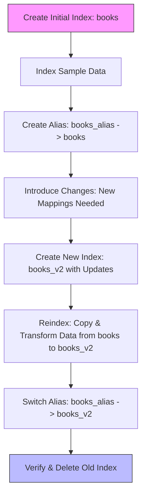
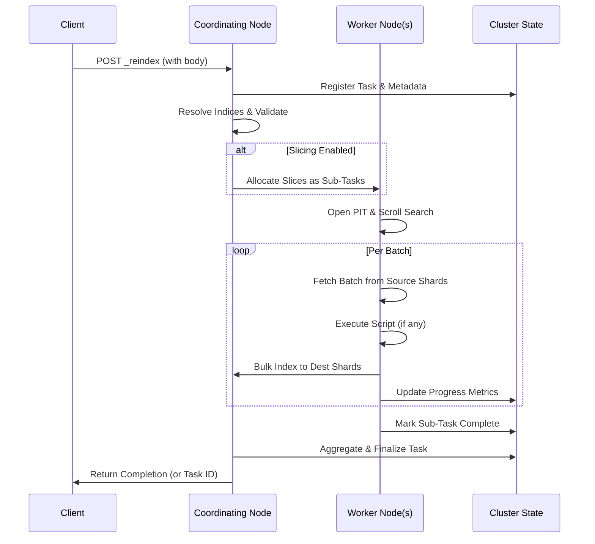

Hello, fellow developers and data enthusiasts! If you've ever worked with search engines like OpenSearch (the open-source fork of Elasticsearch), you know that managing indices is a core part of the game. But what happens when your data needs evolve? Enter **reindexing**—a powerful operation that lets you copy data from one index to another while applying changes like updated mappings or settings. In this post, we'll walk through reindexing iteratively: starting with creating an initial index, introducing changes that necessitate reindexing, and detailing the steps involved. We'll also cover using aliases for zero-downtime deployments (like blue-green strategies), handling large indices with slicing and async execution, and more. We'll keep things simple, use practical examples, and include Python code snippets for hands-on implementation.

Whether you're optimizing for performance, fixing mapping issues, or migrating data, reindexing is your go-to tool. Let's dive in!

## What is Reindexing in OpenSearch?

Reindexing is essentially a data migration tool within OpenSearch. It allows you to copy documents from a source index to a destination index, optionally transforming them along the way using scripts or queries. This is crucial because OpenSearch doesn't allow direct modifications to certain index properties (like mappings) once data is indexed. Instead, you create a new index with the desired changes and reindex your data into it.

Think of it like moving furniture in a house: sometimes, you need to rearrange (or rebuild) rooms to fit new needs, and reindexing is the moving truck that gets everything there safely.

## Why Do You Need Reindexing?

Common scenarios include:

- **Updating mappings**: Changing field types or adding analyzers.
- **Changing index settings**: Adjusting shard counts or replicas.
- **Data transformation**: Filtering, enriching, or modifying documents during migration.
- **Index consolidation**: Merging multiple indices or splitting one.
- **Version upgrades or cluster migrations**: Moving data to a new setup.

Without reindexing, you'd be stuck with outdated structures, leading to inefficient searches or errors.

## Step 1: Creating Your Initial Index

Let's start iteratively by setting up a basic index. We'll use Python with the `opensearch-py` library (install it via `pip install opensearch-py` if needed). Assume you have an OpenSearch cluster running locally at `http://localhost:9200`.

Here's how to create an index called `books` with simple mappings for book data:

```python
from opensearchpy import OpenSearch

# Connect to OpenSearch
client = OpenSearch(
    hosts=[{'host': 'localhost', 'port': 9200}],
    http_auth=('admin', 'admin'),  # Replace with your credentials
    use_ssl=False,  # Set to True for production
    verify_certs=False
)

# Define initial mappings
index_name = 'books'
mappings = {
    "mappings": {
        "properties": {
            "title": {"type": "text"},
            "author": {"type": "keyword"},
            "publish_date": {"type": "date"}
        }
    }
}

# Create the index
if not client.indices.exists(index=index_name):
    client.indices.create(index=index_name, body=mappings)
    print(f"Index '{index_name}' created successfully!")
else:
    print(f"Index '{index_name}' already exists.")
```

This creates an index where:

- `title` is searchable as text.
- `author` is treated as a keyword for exact matches.
- `publish_date` handles dates properly.

Simple enough, right? Now, let's add some data.

## Step 2: Indexing Sample Data

With the index ready, we'll index a few book documents. This simulates real-world data ingestion.

```python
# Sample documents
documents = [
    {"title": "The Great Gatsby", "author": "F. Scott Fitzgerald", "publish_date": "1925-04-10"},
    {"title": "1984", "author": "George Orwell", "publish_date": "1949-06-08"},
    {"title": "To Kill a Mockingbird", "author": "Harper Lee", "publish_date": "1960-07-11"}
]

# Index the documents
for doc in documents:
    client.index(index=index_name, body=doc)
    print(f"Indexed document: {doc['title']}")

# Refresh the index to make documents searchable
client.indices.refresh(index=index_name)
```

Now your `books` index has three documents. You can query it with something like `client.search(index='books', body={"query": {"match_all": {}}})` to verify.

## Step 3: Introducing Changes That Require Reindexing

Here's where things get iterative. Suppose your requirements evolve: you want to add a new field for `genre` (as a keyword) and change `publish_date` to include time zones for better accuracy. You can't modify the existing mappings directly—OpenSearch will throw an error if you try.

Instead, create a **new index** with the updated mappings:

```python
new_index_name = 'books_v2'
new_mappings = {
    "mappings": {
        "properties": {
            "title": {"type": "text"},
            "author": {"type": "keyword"},
            "publish_date": {"type": "date", "format": "strict_date_optional_time"},  # Updated format
            "genre": {"type": "keyword"}  # New field
        }
    }
}

# Create the new index
if not client.indices.exists(index=new_index_name):
    client.indices.create(index=new_index_name, body=new_mappings)
    print(f"New index '{new_index_name}' created with updated mappings!")
```

The old index remains intact, but now we need to move the data over—enter reindexing.

## Step 4: Performing the Reindex Operation

Reindexing copies data from the source (`books`) to the destination (`books_v2`). You can add transformations, like setting a default `genre` for existing documents.

Use the reindex API:

```python
reindex_body = {
    "source": {
        "index": "books"
    },
    "dest": {
        "index": "books_v2"
    },
    "script": {
        "source": "ctx._source.genre = 'Fiction'"  # Add default genre during reindex
    }
}

# Perform reindex
response = client.reindex(body=reindex_body, wait_for_completion=True)
print(f"Reindex completed: {response}")
```

This:

- Copies all documents.
- Applies a Painless script to add `genre: "Fiction"` to each.
- Waits for completion (set to `False` for large datasets to run in the background).

After reindexing, you can query `books_v2` and see the updates. Optionally, delete the old index with `client.indices.delete(index='books')` once verified.

## Using Aliases for Zero-Downtime Reindexing (Blue-Green Deployment)

OpenSearch aliases act as virtual pointers to one or more indices, allowing you to abstract the actual index name from your applications. This is perfect for **blue-green deployments**, a strategy where you maintain two environments: "blue" (live, old index) and "green" (new index being prepared). Once the green is ready, you switch traffic instantly via the alias, achieving zero downtime.

Here's why it's useful for reindexing:

- Your app queries the alias, not the index directly.
- Reindex to a new index without interrupting service.
- If issues arise, rollback by switching the alias back.


### Example: Blue-Green Reindex with Aliases

Building on our `books` example, let's create an alias `books_alias` pointing to the initial `books` index (blue). After reindexing to `books_v2` (green), we'll switch the alias.

```python
# Step 1: Create alias pointing to initial index (blue)
alias_name = 'books_alias'
if not client.indices.exists_alias(name=alias_name):
    client.indices.put_alias(index='books', name=alias_name)
    print(f"Alias '{alias_name}' created pointing to 'books'.")

# Now, your app queries 'books_alias' instead of 'books'.

# (Perform Steps 3 and 4: Create books_v2 and reindex as above)

# Step 2: Switch alias to new index (green) atomically
actions = {
    "actions": [
        {"remove": {"index": "books", "alias": alias_name}},
        {"add": {"index": "books_v2", "alias": alias_name}}
    ]
}
client.indices.update_aliases(body=actions)
print(f"Alias '{alias_name}' now points to 'books_v2'.")

# Optional: Delete old index after verification
client.indices.delete(index='books')
```

This switch is atomic—no downtime! If `books_v2` has problems, reverse the `remove` and `add` actions to rollback.

## Handling Large Indices During Reindexing

For large indices (e.g., millions of documents), a basic reindex can be slow or resource-heavy. OpenSearch provides tools to handle this efficiently:

- **Slicing**: Split the reindex into parallel tasks based on document IDs or shards. This allows running multiple reindex operations concurrently, speeding up the process by distributing the load across your cluster.
- **Async execution**: Run the reindex in the background as a task, so your script doesn't block while waiting. You can then poll the task status to monitor progress.
- **Throttling**: Control requests per second to avoid overwhelming your cluster.
- **Query filtering**: Reindex only a subset of data if possible.


### Example: Sliced Reindex for Large Indices

Slicing divides the source index into parts (slices), each handling a portion of the documents. You specify the total number of slices (`max`) and an ID for each slice (from 0 to max-1). For best performance, match the number of slices to your cluster's available resources (e.g., CPU cores). You can run each slice in a separate process or sequentially.

Here's a complete code example that starts async reindex tasks for all slices (using a loop for simplicity; in production, use multiprocessing for true parallelism) and monitors them until completion:

```python
import time
from multiprocessing import Pool  # For parallelism

# Function to perform a single slice reindex
def reindex_slice(slice_id, max_slices=4):
    reindex_body = {
        "source": {
            "index": "books",
            "slice": {
                "id": slice_id,
                "max": max_slices
            }
        },
        "dest": {
            "index": "books_v2"
        },
        "script": {
            "source": "ctx._source.genre = 'Fiction'"
        }
    }
    response = client.reindex(body=reindex_body, wait_for_completion=False)
    return response['task']  # Return task ID

# Main execution
max_slices = 4  # Adjust based on your cluster
task_ids = []

# Use multiprocessing to run slices in parallel
with Pool(processes=max_slices) as pool:
    task_ids = pool.map(reindex_slice, range(max_slices))

print(f"Started {max_slices} sliced reindex tasks: {task_ids}")

# Monitor all tasks until completion
while task_ids:
    for task_id in list(task_ids):
        status = client.tasks.get(task_id=task_id)
        if status['completed']:
            print(f"Task {task_id} completed: {status['response']}")
            task_ids.remove(task_id)
        else:
            print(f"Task {task_id} progress: {status['task']['status']}")
    if task_ids:
        time.sleep(10)  # Poll every 10 seconds
```

Explanation:

- `reindex_slice` function: Defines the reindex body for a specific slice and starts it asynchronously, returning the task ID.
- `Pool(map)`: Runs each slice in parallel using multiprocessing, starting all tasks concurrently.
- Monitoring loop: Polls each task's status periodically. Removes completed tasks from the list and continues until all are done.
- This ensures the entire reindex is handled efficiently for large indices. If errors occur (e.g., in `status['response']['failures']`), handle them accordingly.


### Async Execution for Reindex

Async execution is key for non-blocking operations. By setting `wait_for_completion=False`, the reindex runs as a background task, returning immediately with a `task_id`. You can then query the tasks API to check status, progress, or cancel if needed. This is especially useful for large reindexes that might take hours.

The sliced example above already incorporates async execution and monitoring. For a non-sliced async reindex, simply use `wait_for_completion=False` in the basic reindex call and monitor similarly.

This approach ensures your reindex scales without downtime or overload.

## Visualizing the Reindex Process

To make the flow clearer, here's a simple Mermaid diagram showing the iterative steps, now including aliases:



This flowchart illustrates the progression: start simple, evolve, reindex, and switch seamlessly.

## What Happens Under the Hood?

But what really happens when you fire off that _reindex API call? What makes reindexing efficient, resilient, and scalable? Let's uncover the internals of OpenSearch's reindex operation. 

We'll break it down stage by stage, explaining how OpenSearch orchestrates this distributed task. Expect insights into why things work the way they do, potential pitfalls, and tips for optimization.

You might call it like this in Python (using `opensearch-py`):

```python
reindex_body = {
    "source": {"index": "books"},
    "dest": {"index": "books_v2"},
    "script": {"source": "ctx._source.genre = 'Fiction'"}
}
client.reindex(body=reindex_body, wait_for_completion=False)
```

But under the hood, this isn't a simple loop—it's a sophisticated, cluster-wide operation leveraging OpenSearch's search, ingest, and indexing engines.

### High-Level Overview of Reindex Internals

When you submit a reindex request, OpenSearch treats it as a long-running task managed by the cluster's task management system. The process is distributed across nodes: a coordinating node handles setup, worker nodes execute the heavy lifting, and everything is fault-tolerant. Key principles include snapshot consistency (to avoid data races), batch processing for efficiency, and optional parallelism via slicing.

Think of reindex as a pipeline: read batches from source → transform → write to destination, all while monitoring and throttling to keep the cluster healthy.

### Stage 1: Task Registration and Initialization

The journey starts when your API call hits a node (usually the coordinating node). OpenSearch creates a **persistent task object** in the cluster state, storing details like source/dest indices, query filters, scripts, and parameters (e.g., `requests_per_second` for throttling).

- **Depth**: This task is registered in the `.tasks` index or cluster metadata, making it resilient to node failures. If `wait_for_completion=False`, the API returns immediately with a `task_id`, and the task runs asynchronously.
- **Example**: For a sliced reindex with 4 slices, the parent task spawns 4 child tasks, each with its own metadata.
- **Pitfall**: High task concurrency can overload the cluster—limit via cluster settings like `cluster.max_task_concurrency`.

### Stage 2: Index Resolution and Validation

Before any data moves, OpenSearch resolves index names (e.g., expanding wildcards like `books-*`) and validates everything.

- **Depth**: The index resolver checks existence, aliases, and permissions using the security plugin (e.g., OpenSearch Security). It ensures the destination index exists (or auto-creates if specified) and that mappings are compatible. If there's a type mismatch, it fails early.
- **Example**: If source is `books` and dest is `books_v2`, it verifies `books_v2`'s shards are ready and replicas are healthy.
- **Pitfall**: Permission denials here can halt the task—always check roles for `_reindex` actions.

### Stage 3: Slice Allocation (For Parallelism)

If slicing is enabled (e.g., `"slice": {"id": 0, "max": 4}`), OpenSearch divides the work.

- **Depth**: Slices are allocated based on shard distribution or a hash of document IDs, ensuring even partitioning. Each slice becomes a sub-task routed to nodes with source shards for data locality, reducing network hops.
- **Example**: For a 5-shard index with 4 slices, slices might overlap shards but process disjoint document sets via ID hashing.
- **Pitfall**: Too many slices can cause overhead; aim for 1-2 per available CPU core.

### Stage 4: Scroll Search and Data Retrieval

Data extraction uses an internal scroll search to fetch batches efficiently.

- **Depth**: A **point-in-time (PIT)** snapshot is created for consistency—documents are read from the index state at task start, ignoring later updates. Scrolls pull batches (size configurable via `size`) using Lucene's segment readers, minimizing I/O.
- **Example**: Batches of 1000 docs are scrolled, with each worker node handling its local shards.
- **Pitfall**: Large batches consume memory; tune via `source.size` if OOM errors occur.

### Stage 5: Script Execution and Document Transformation

If a script is provided, each document is transformed in-memory.

- **Depth**: The Painless scripting engine (or Groovy if enabled) executes on the `_source` field via the ingest pipeline. This is single-threaded per batch but efficient for simple ops.
- **Example**: `ctx._source.genre = 'Fiction'` adds a field without re-parsing the entire doc.
- **Pitfall**: Complex scripts can slow things down—profile with `_reindex?refresh=true` for tests.

### Stage 6: Bulk Indexing to Destination

Transformed docs are bulk-indexed to the destination.

- **Depth**: Using the Bulk API, requests are routed to destination shards. Versioning handles conflicts (e.g., `version_type: external`), and replicas sync asynchronously.
- **Example**: A batch of 1000 docs is split across shards based on routing keys.
- **Pitfall**: If dest shards are unbalanced, hotspots can form—use custom routing in scripts.

### Stage 7: Throttling and Back-Pressure Mechanisms

To prevent overload, OpenSearch applies controls.

- **Depth**: A token-bucket algorithm enforces `requests_per_second`, pausing if exceeded. Back-pressure from full queues triggers retries with exponential backoff.
- **Example**: Setting `requests_per_second: 1000` limits to 1000 ops/sec across all slices.
- **Pitfall**: Ignoring throttling can spike CPU—I/O; monitor with `_nodes/stats`.

### Stage 8: Progress Tracking and Monitoring

Real-time stats are aggregated.

- **Depth**: Sub-tasks report metrics (e.g., docs processed, failures) to the parent task, stored in cluster state. Query via `_tasks/<task_id>`.
- **Example**: `GET _tasks/<task_id>` shows `{"status": {"total": 10000, "created": 5000}}`.
- **Pitfall**: Tasks can "hang" if nodes fail—use `actions=*reindex` to list all.

### Stage 9: Completion and Cleanup

Once all data is moved, the task wraps up.

- **Depth**: Scrolls and PITs are closed, resources freed. The task is marked completed, with final stats.
- **Example**: If failures occur, they're logged in the response.
- **Pitfall**: Long-running tasks can accumulate—set retention via `persistent_tasks.retention`.

### Visualizing the Reindex Internals

Here's a Mermaid sequence diagram (different from our previous flowchart) showing the interactions between components:



This illustrates the flow from client to cleanup, highlighting distribution.

### Why This Architecture Matters: Performance and Resilience

OpenSearch's design ensures reindex is snapshot-isolated, parallelizable, and fault-tolerant. Performance scales with cluster size, but resilience shines: node failures trigger re-routing without data loss. However, it's not free—expect CPU and I/O spikes.

### Practical Examples and Tips

- **Tuning Example**: For a 10M-doc index, use 8 slices and `requests_per_second: 5000`—monitor via Kibana.
- **Debug Tip**: Enable verbose logging with `logger.org.opensearch.tasks=TRACE`.
- **Optimization**: Combine with aliases for zero-downtime, as in our previous post.

## Best Practices and Common Pitfalls

- **Handle large datasets**: Use slicing for parallel reindexing and async execution with task monitoring.
- **Zero-downtime**: Always leverage aliases for production reindexing.
- **Avoid data loss**: Verify the new index before deleting the old one.
- **Pitfall**: Reindexing can be resource-intensive—run during off-peak hours, throttle if needed, and monitor cluster health.
- **Error handling**: Use scripts to add retries or logging for robustness.


## Conclusion

Reindexing in OpenSearch is a lifesaver for evolving data needs, and by following this iterative approach—create, index, change, reindex—you can manage it like a pro. We started with a basic `books` index, added data, introduced mapping updates, and used Python to reindex into `books_v2` with transformations. Plus, with aliases enabling blue-green deployments, you get zero-downtime switches, and slicing with async execution handles large indices smoothly. Experiment with your own setup, and remember: simplicity leads to mastery.

Happy indexing! If you have questions or want to share your experiences, drop a comment below.