The **Model Context Protocol (MCP)** is a standardized protocol that enables Large Language Models (LLMs) to securely access external tools, data sources, and services. Instead of hardcoding API integrations into your AI applications, MCP provides a universal interface that allows LLMs to dynamically invoke tools while maintaining clean separation of concerns.

In this comprehensive tutorial, we will explore MCP concepts from the ground up using real-world integration examples. We'll examine how an AI agent can intelligently query emails, fetch stock prices, and provide meaningful responses by orchestrating multiple MCP servers running on different transports.

---

## Table of Contents

1. [Core MCP Concepts](#core-mcp-concepts)
2. [Architecture Overview](#architecture-overview)
3. [MCP Server Implementation](#mcp-server-implementation)
   - [Gmail MCP Server](#gmail-mcp-server-example)
   - [Stock Price MCP Server](#stock-price-mcp-server-implementation)
4. [MCP Clients and Transport](#mcp-clients-and-transport)
5. [The Orchestration Layer](#the-orchestration-layer)
6. [Building the AI Agent](#building-the-ai-agent)
7. [Complete Workflow Example](#complete-workflow-example)
8. [Deployment with Docker](#deployment-with-docker)

---

## Core MCP Concepts

### What is MCP?

MCP solves a fundamental integration challenge in AI systems: **how can an LLM safely and standardly access external tools without custom code for each integration?**

### The Standard Interface Problem (Before MCP)

Imagine you want to build an AI agent that can:
- Query Gmail for emails
- Fetch stock prices from a financial API
- Query a database
- Call a custom microservice

Traditionally, you would need to:
1. Write custom code to integrate each API
2. Teach the LLM about each API's specific requirements
3. Handle authentication separately for each service
4. Update application code every time you add a new tool

This creates an **N-by-M integration nightmare**: N different tools × M different LLM models = O(N×M) custom integration code.

### How MCP Solves This

MCP introduces a **universal, standardized protocol** where:
- **MCP Servers** expose tools and data sources with machine-readable manifests
- **MCP Clients** communicate with servers using JSON-RPC 2.0 messages
- **Transports** abstract the communication layer (stdio, HTTP, WebSocket, gRPC)
- **Orchestrators** route tool calls from LLMs to appropriate servers

This transforms the integration problem to O(N+M): each tool implements MCP once, and each LLM uses MCP once.

---

## Architecture Overview

### High-Level System Architecture
`
The diagram below illustrates how all components of our MCP system interact:

- **User** initiates a query to the AI Agent
- **AI Agent** (powered by Groq LLM) receives the question and determines which tools are needed
- **Orchestration Layer** acts as the central router, deciding which MCP server can handle each request
- **MCP Client Registry** maintains mappings between available tools and their corresponding servers
- **Gmail MCP Server** (stdio transport) handles email-related queries via Gmail API
- **Stock MCP Server** (HTTP transport) provides real-time stock price information
- **Results flow back** through the orchestrator to the agent, which synthesizes a final answer

This architecture demonstrates MCP's power: a single AI agent can seamlessly access multiple external services without needing custom integration code for each one. The agent simply asks for what it needs, and the orchestrator routes the request to the appropriate server.

```mermaid
graph TB
    User["👤 User"]
    Agent["🤖 AI Agent (Groq/OpenAI)"]
    Orchestrator["🔄 Orchestration Layer"]
    Registry["📋 MCP Client Registry"]
    
    GmailServer["📧 Gmail MCP Server<br/>(Python/stdio)"]
    StockServer["📈 Stock MCP Server<br/>(Python/HTTP)"]
    
    GmailAPI["Gmail API"]
    StockDB["Stock Data"]
    
    User -->|Query| Agent
    Agent -->|Tool Request| Orchestrator
    Orchestrator -->|Route & Execute| Registry
    
    Registry -->|stdio| GmailServer
    Registry -->|HTTP| StockServer
    
    GmailServer -->|Query| GmailAPI
    StockServer -->|Fetch| StockDB
    
    GmailServer -->|Result| Orchestrator
    StockServer -->|Result| Orchestrator
    
    Orchestrator -->|Response| Agent
    Agent -->|Answer| User
```




### Key Components

| Component | Role |
|-----------|------|
| **MCP Server** | Exposes tools and capabilities; handles tool execution |
| **MCP Client** | Connects to server; sends tool calls; receives results |
| **Transport** | Communication channel (stdio, HTTP, WebSocket) |
| **Orchestrator** | Routes tool calls to correct MCP client; manages context |
| **AI Agent** | LLM + reasoning loop; decides which tools to use |
| **MCP Registry** | Maintains mappings between tools and servers |

---

## MCP Server Implementation

### Understanding MCP Servers

An **MCP Server** is a program that:
1. Exposes a set of tools with standardized descriptions
2. Listens for JSON-RPC requests from MCP clients
3. Executes tool functions and returns results
4. Provides a manifest of capabilities

### Gmail MCP Server Example

Let's examine the Gmail MCP server implementation. This server provides tools to query Gmail emails with various filters. For simplicity, we will focus on two main tools:
1. `list_messages_with_attachments`: Lists emails with attachments
2. `list_filtered_messages`: Lists emails based on sender, subject, and time filters

To implement this server, we will use the `fastmcp` library for MCP functionality and the `google-api-python-client` for Gmail API access.

#### Server Initialization and Gmail Authentication

```python
# From: gmail_mcp_server.py

import os
from mcp.server.fastmcp import FastMCP
from google.oauth2.credentials import Credentials
from google.auth.transport.requests import Request
from google.auth.exceptions import RefreshError
from googleauthoauthlib.flow import InstalledAppFlow
from googleapiclient.discovery import build

# MCP Server instance
mcp = FastMCP("gmail-mcp-server")

# Gmail API scopes
SCOPES = ["https://www.googleapis.com/auth/gmail.readonly"]

gmail_service = None  # Global service instance
token_path = "token.json"
credentials_path = "credentials.json"

def get_gmail_service():
    """Initialize and return Gmail API service with automatic token recovery."""
    global gmail_service
    if gmail_service:
        return gmail_service
    
    creds = None
    try:
        if os.path.exists(token_path):
            creds = Credentials.from_authorized_user_file(token_path, SCOPES)
    except Exception:
        # If token is corrupt, remove it so we re-auth
        try:
            os.remove(token_path)
        except Exception:
            pass
        creds = None
    
    if not creds or not creds.valid:
        if creds and creds.expired and creds.refresh_token:
            try:
                creds.refresh(Request())
            except RefreshError:
                # Token revoked or expired server-side - delete and force re-auth
                try:
                    os.remove(token_path)
                except Exception:
                    pass
                creds = None
    
    if not creds:
        flow = InstalledAppFlow.from_client_secrets_file(
            credentials_path, SCOPES
        )
        creds = flow.run_local_server(port=0)
        with open(token_path, "w") as token:
            token.write(creds.to_json())
    
    try:
        gmail_service = build("gmail", "v1", credentials=creds)
        return gmail_service
    except HttpError as error:
        raise Exception(f"An error occurred: {error}")
```

**Key Points:**
- Uses Google OAuth2 for secure authentication
- Manages token persistence and automatic refresh
- Handles token revocation gracefully
- Returns a reusable Gmail API service object

#### Exposing Tools as MCP Methods

```python
# From: gmail_mcp_server.py

@mcp.tool()
def list_messages_with_attachments(max_results: int = 10) -> list:
    """Lists messages with attachments, extracts subject, sender, and attachment info."""
    try:
        service = get_gmail_service()
        response = service.users().messages().list(
            userId="me",
            maxResults=max_results,
            q="has:attachment"
        ).execute()
        
        messages = response.get("messages", [])
        email_data_list = []
        
        for msg_id_dict in messages:
            msg_id = msg_id_dict["id"]
            message = service.users().messages().get(
                userId="me",
                id=msg_id,
                format="full"
            ).execute()
            
            payload = message.get("payload", {})
            headers = payload.get("headers", [])
            
            subject = get_header_value(headers, "Subject")
            sender = get_header_value(headers, "From")
            attachments_info = []
            
            # Extract attachment metadata
            parts = payload.get("parts", [])
            def get_attachment_parts(parts):
                for part in parts:
                    if part.get("filename") and part.get("body") and part.get("body").get("attachmentId"):
                        attachments_info.append({
                            "filename": part["filename"],
                            "attachmentId": part["body"]["attachmentId"]
                        })
                    if part.get("parts"):
                        get_attachment_parts(part["parts"])
            
            get_attachment_parts(parts)
            
            email_data_list.append({
                "id": msg_id,
                "subject": subject,
                "sender": sender,
                "attachments": attachments_info
            })
        
        return email_data_list
    except HttpError as error:
        return {"error": f"An HTTP error occurred: {error}"}
```

#### Filtered Email Queries

```python
# From: gmail_mcp_server.py

@mcp.tool()
def list_filtered_messages(
    sender: str = None,
    subject_substring: str = None,
    time_query: str = None,
    max_results: int = 10
) -> list:
    """
    Lists filtered mail messages with optional sender, subject, and time filters.
    
    Example time queries: after:20250101, before:20251101, newer_than:30d
    """
    try:
        service = get_gmail_service()
        query_parts = []
        
        if sender:
            query_parts.append(f"from:{sender}")
        if subject_substring:
            query_parts.append(f"subject:{subject_substring}")
        if time_query:
            query_parts.append(time_query)
        
        final_query = " ".join(query_parts) if query_parts else ""
        
        response = service.users().messages().list(
            userId="me",
            maxResults=max_results,
            q=final_query
        ).execute()
        
        messages = response.get("messages", [])
        email_data_list = []
        
        for msg_id_dict in messages:
            msg_id = msg_id_dict["id"]
            message = service.users().messages().get(
                userId="me",
                id=msg_id,
                format="full"
            ).execute()
            
            # Parse email headers and body...
            payload = message.get("payload", {})
            headers = payload.get("headers", [])
            
            subject = get_header_value(headers, "Subject")
            sender_info = get_header_value(headers, "From")
            
            # Extract body text...
            body_text = ""
            if "parts" in payload:
                for part in payload["parts"]:
                    if part["mimeType"] == "text/plain":
                        data = part["body"].get("data", "")
                        if data:
                            body_text = base64.urlsafe_b64decode(data).decode("utf-8")
                            break
            else:
                data = payload["body"].get("data", "")
                if data:
                    body_text = base64.urlsafe_b64decode(data).decode("utf-8")
            
            email_data_list.append({
                "id": msg_id,
                "subject": subject,
                "sender": sender_info,
                "body": body_text,
                "attachments": attachments_info
            })
        
        return email_data_list
    except HttpError as error:
        return {"error": f"An HTTP error occurred: {error}"}
```

#### Running the Gmail MCP Server

Lets run the server using stdio transport:

```python
# From: gmail_mcp_server.py

if __name__ == "__main__":
    mcp.run(transport="stdio")
```

**Key Points:**
- The `@mcp.tool()` decorator registers functions as callable MCP tools
- Each tool has clear input parameters and return types
- The server handles all error cases gracefully
- Tools are exposed via the MCP protocol automatically

### Gmail Tool Manifest

When an MCP client connects to this server, it automatically discovers these tools:

```json
{
  "tools": [
    {
      "name": "list_messages_with_attachments",
      "description": "Lists messages with attachments, extracts subject, sender, and attachment info.",
      "params": {
        "max_results": {"type": "integer", "default": 10}
      },
      "returns": "list"
    },
    {
      "name": "list_filtered_messages",
      "description": "Lists filtered mail messages with optional sender, subject, and time filters.",
      "params": {
        "sender": {"type": "string", "optional": true},
        "subject_substring": {"type": "string", "optional": true},
        "time_query": {"type": "string", "optional": true},
        "max_results": {"type": "integer", "default": 10}
      },
      "returns": "list"
    }
  ]
}
```

---

## Stock Price MCP Server Implementation

Alongside the Gmail server, we have a **Stock Price MCP Server** that provides real-time stock price information via HTTP transport. This server demonstrates a simpler MCP implementation optimized for remote deployment.

### Stock Server Architecture

The stock server differs from the Gmail server in several fundamental ways:

| Aspect | Gmail Server | Stock Server |
|--------|--------------|--------------|
| **Transport** | stdio | HTTP |
| **Deployment** | Local subprocess | Remote/containerized |
| **Authentication** | OAuth2 (Gmail) | None (demo) |
| **Tools** | list_filtered_messages, list_messages_with_attachments | get_latest_price |
| **Data Source** | External API (Gmail) | Mock data |
| **Startup** | Spawned by MCP client | Pre-running service |
| **Use Case** | Local tools with state | Remote APIs |

### Stock Server Implementation

```python
# From: stock_server.py

from fastmcp import FastMCP

# Create MCP server instance with HTTP transport
mcp = FastMCP("stock-data-server")

@mcp.tool()
def get_latest_price(stock: str) -> float:
    """Fetch latest stock ticker price."""
    prices = {
        "Reliance": 2480.0,
        "TCS": 3300.5,
        "AAPL": 180.0
    }
    return prices.get(stock, 0.0)


if __name__ == "__main__":
    # Run the server with HTTP transport on port 8000
    mcp.run(transport="http", host="0.0.0.0", port=8000)
```

**Key Implementation Details:**

1. **HTTP Transport**: Uses `transport="http"` instead of `transport="stdio"`
2. **Host Binding**: `host="0.0.0.0"` allows connections from any network interface
3. **Port Configuration**: Listens on port `8000` (customizable via environment variables in production)
4. **Stateless Design**: No persistent authentication state like Gmail OAuth2
5. **Simple Tool**: Single tool function for stock price lookup
6. **Mock Data**: For demonstration, uses in-memory dictionary; production would query external APIs

### Why HTTP for Stock Server?

- **Remote Accessibility**: Clients from different machines/containers can access it
- **Scalability**: Can be deployed as a microservice behind a load balancer
- **Standardization**: Follows REST/JSON-RPC conventions
- **Container Friendly**: Easily exposed via Docker port mapping
- **Multiple Clients**: Many clients can connect simultaneously (vs stdio's one-per-client)

### Stock Tool Manifest

The stock server exposes a simple manifest:

```json
{
  "tools": [
    {
      "name": "get_latest_price",
      "description": "Fetch latest stock ticker price.",
      "params": {
        "stock": {"type": "string", "description": "Stock symbol or name"}
      },
      "returns": "float"
    }
  ]
}
```

### Extending the Stock Server

In production, you might extend this to:

```python
# Example production-ready extension

import yfinance  # Real financial data library

@mcp.tool()
def get_latest_price(stock: str) -> float:
    """Fetch real stock price from Yahoo Finance."""
    try:
        ticker = yfinance.Ticker(stock)
        price = ticker.info.get("currentPrice", 0.0)
        return price
    except Exception as e:
        return {"error": str(e)}


@mcp.tool()
def get_stock_history(stock: str, period: str = "1mo") -> list:
    """Get historical stock data."""
    try:
        ticker = yfinance.Ticker(stock)
        hist = ticker.history(period=period)
        return hist[["Close", "Volume"]].to_dict("records")
    except Exception as e:
        return {"error": str(e)}


@mcp.tool()
def compare_stocks(stocks: list) -> dict:
    """Compare multiple stocks."""
    results = {}
    for stock in stocks:
        ticker = yfinance.Ticker(stock)
        results[stock] = {
            "price": ticker.info.get("currentPrice"),
            "pe_ratio": ticker.info.get("trailingPE"),
            "market_cap": ticker.info.get("marketCap")
        }
    return results
```

---

## MCP Clients and Transport

### Understanding Transports

MCP supports multiple transport mechanisms to move JSON-RPC messages between clients and servers:

| Transport | Use Case | Example |
|-----------|----------|---------|
| **stdio** | Local subprocess communication | MCP client spawns server process |
| **HTTP/HTTPS** | Remote servers over network | Server deployed as REST API |
| **WebSocket** | Bidirectional real-time | Server in different process/machine |
| **gRPC** | High-performance infrastructure | When your platform already uses gRPC |

### MCP Client Protocol

Both stdio and HTTP clients implement the same conceptual protocol:

```python
# From: clients.py

class MCPClientProtocol:
    """Protocol that all MCP clients should follow."""
    
    async def connect(self) -> None:
        """Connect to the MCP server."""
        ...
    
    async def call_tool(self, tool_name: str, tool_args: Dict[str, Any]) -> Any:
        """Execute a tool on the server."""
        ...
    
    async def list_tools(self) -> List[Dict[str, Any]]:
        """Fetch available tools and their schemas."""
        ...
    
    async def close(self) -> None:
        """Close the connection."""
        ...
```

### Stdio MCP Client (Local Servers)

For servers running as local processes, use stdio transport:

```python
# From: clients.py

from mcp import ClientSession
from mcp.client.stdio import stdio_client, StdioServerParameters

class StdioMCPClient:
    """MCP Client for local subprocess servers using stdio."""
    
    def __init__(self, command: str, args: list, server_alias: str = None):
        self.server_params = StdioServerParameters(command=command, args=args)
        self.stdio_ctx = None
        self.session_ctx = None
        self.reader_writer = None
        self.session: Optional[ClientSession] = None
        self.server_alias = server_alias
    
    async def connect(self, retries: int = 3, backoff: float = 0.5) -> None:
        """Create stdio subprocess and initialize ClientSession.
        
        Retries on transient failures (e.g., server startup delay).
        """
        last_exc = None
        
        for attempt in range(1, retries + 1):
            try:
                # Enter the stdio context manager and keep the context object
                self.stdio_ctx = stdio_client(self.server_params)
                self.reader_writer = await self.stdio_ctx.__aenter__()
                reader, writer = self.reader_writer
                
                # Create and enter ClientSession context
                self.session_ctx = ClientSession(reader, writer)
                self.session = await self.session_ctx.__aenter__()
                
                # Initialize the session (fetches capabilities)
                await self.session.initialize()
                return
            
            except Exception as exc:
                last_exc = exc
                await self.cleanup_partial()
                if attempt < retries:
                    await asyncio.sleep(backoff * attempt)
                else:
                    raise RuntimeError(
                        f"Failed to start stdio MCP server after {retries} attempts"
                    ) from last_exc
    
    async def cleanup_partial(self) -> None:
        """Teardown any partially created contexts safely."""
        if self.session is not None and self.session_ctx is not None:
            try:
                await self.session_ctx.__aexit__(None, None, None)
            except Exception:
                pass
            self.session = None
            self.session_ctx = None
        
        if self.stdio_ctx is not None:
            try:
                await self.stdio_ctx.__aexit__(None, None, None)
            except Exception:
                pass
            self.stdio_ctx = None
            self.reader_writer = None
    
    async def call_tool(self, tool_name: str, tool_args: Dict[str, Any]) -> Any:
        """Execute a tool by name."""
        if not self.session:
            raise RuntimeError("StdioMCPClient not connected")
        return await self.session.call_tool(tool_name, tool_args)
    
    async def list_tools(self) -> List[Dict[str, Any]]:
        """Fetch list of available tools."""
        if not self.session:
            raise RuntimeError("StdioMCPClient not connected")
        result = await self.session.list_tools()
        return result.tools
    
    async def close(self) -> None:
        """Close the connection."""
        await self.cleanup_partial()
```

**Key Implementation Details:**

1. **Context Manager Retention**: We explicitly call `__aenter__()` and store the context managers to keep them alive during the session lifetime. This is crucial—exiting the context would close the connection.

2. **Retry Logic**: The connect method includes exponential backoff to handle server startup delays.

3. **Tool Execution**: `call_tool()` sends a JSON-RPC request through the MCP session and returns results.

4. **Proper Cleanup**: `cleanup_partial()` ensures resources are released safely even if intermediate steps fail.

### HTTP MCP Client (Remote Servers)

For servers deployed remotely as HTTP endpoints:

```python
# From: clients.py

from fastmcp import Client

class HTTPMCPClient:
    """MCP Client for remote HTTP/WebSocket servers."""
    
    def __init__(self, base_url: str):
        self.base_url = base_url.rstrip("/")
        # FastMCP infers HTTP transport automatically
        self.client = Client(self.base_url)
        self.entered = False
    
    async def connect(self) -> None:
        """Open connection and initialize MCP."""
        if self.entered:
            return
        
        # Enter the async context
        await self.client.__aenter__()
        self.entered = True
    
    async def call_tool(self, tool_name: str, tool_args: Dict[str, Any]) -> Any:
        """Call a tool by name via HTTP."""
        if not self.entered:
            await self.connect()
        
        # FastMCP.Client.call_tool returns a ToolResult-like object
        result = await self.client.call_tool(tool_name, tool_args)
        return getattr(result, "data", result)
    
    async def list_tools(self) -> List[Dict[str, Any]]:
        """List available tools."""
        if not self.entered:
            await self.connect()
        
        tools = await self.client.list_tools()
        # Normalize to plain dicts
        return [t.model_dump() for t in tools]
    
    async def close(self) -> None:
        """Close the connection."""
        if not self.entered:
            return
        await self.client.__aexit__(None, None, None)
        self.entered = False
```

**Key Implementation Details:**

1. **FastMCP Library**: Uses `fastmcp.Client` which handles HTTP transport automatically
2. **URL Format**: Expects a base URL like `http://localhost:8000`
3. **Tool Normalization**: Converts Pydantic models to plain dictionaries for consistency
4. **Lazy Connection**: Connection established only when first tool call is made

### Comparing Stdio vs HTTP Clients
Both clients implement the same interface but differ in transport. It's important to choose the right client based on server deployment:

```python
# Using stdio client for Gmail server (local)
gmail_client = StdioMCPClient(
    command="python",
    args=["gmail_mcp_server.py"]
)
await gmail_client.connect()
emails = await gmail_client.call_tool("list_filtered_messages", {
    "sender": "no-reply@example.com"
})

# Using HTTP client for Stock server (remote)
stock_client = HTTPMCPClient("http://localhost:8000")
await stock_client.connect()
price = await stock_client.call_tool("get_latest_price", {
    "stock": "AAPL"
})
```

---

## The Orchestration Layer

### Purpose of Orchestration

The **orchestration layer** is the central "brain" that:

1. **Routes Tool Calls**: Determines which MCP server to use for each tool
2. **Manages Context**: Maintains conversation history and updates prompts
3. **Registry Management**: Registers and manages multiple MCP clients
4. **Error Handling**: Handles failures and provides fallbacks
5. **Capability Discovery**: Fetches and aggregates tool manifests

### MCP Client Registry

The registry maintains relationships between tools, servers, and clients:

```python
# From: clients.py

class MCPClientRegistry:
    """Registry for managing multiple MCP clients and their tools."""
    
    def __init__(self):
        self.clients: Dict[str, MCPClient] = {}
        self.tools_server_map: Dict[str, str] = {}  # tool_name -> server_name
        self.capabilities: list = []
    
    async def register_stdio(self, alias: str, command: str, args: list) -> None:
        """Register a stdio-based MCP server."""
        client = StdioMCPClient(command, args, server_alias=alias)
        await client.connect()
        
        # Fetch tools from server
        tools = await client.list_tools()
        
        # Map each tool to this server
        for tool in tools:
            self.tools_server_map[tool["name"]] = alias
        
        # Store client and capabilities
        self.clients[alias] = client
        self.capabilities.extend(tools)
    
    async def register_http(self, alias: str, base_url: str) -> None:
        """Register an HTTP-based MCP server."""
        client = HTTPMCPClient(base_url)
        await client.connect()
        
        # Fetch tools from server
        tools = await client.list_tools()
        
        # Map each tool to this server
        for tool in tools:
            self.tools_server_map[tool["name"]] = alias
        
        # Store client and capabilities
        self.clients[alias] = client
        self.capabilities.extend(tools)
    
    def get_client_for_tool(self, tool_name: str) -> Tuple[str, MCPClient]:
        """Get the server name and client for a given tool.
        
        Returns:
            Tuple of (server_name, client_instance)
        """
        server_name = self.tools_server_map.get(tool_name)
        if not server_name:
            raise KeyError(f"No server registered for tool '{tool_name}'")
        
        client = self.clients.get(server_name)
        if not client:
            raise KeyError(f"No client instance found for server '{server_name}'")
        
        return server_name, client
    
    def get_all_capabilities(self) -> list[Dict[str, Any]]:
        """Get all capabilities from all servers."""
        return self.capabilities
    
    async def close_all(self) -> None:
        """Close all client connections."""
        for client in list(self.clients.values()):
            try:
                await client.close()
            except Exception:
                pass
        
        self.clients.clear()
        self.tools_server_map.clear()
```

**Key Data Structures:**

```
clients = {
    "email_server": StdioMCPClient(...),
    "stock_server": HTTPMCPClient(...)
}

tools_server_map = {
    "list_filtered_messages": "email_server",
    "list_messages_with_attachments": "email_server",
    "get_latest_price": "stock_server"
}

capabilities = [
    {"name": "list_filtered_messages", "description": "...", ...},
    {"name": "list_messages_with_attachments", "description": "...", ...},
    {"name": "get_latest_price", "description": "...", ...}
]
```

### The Orchestrator

The main orchestrator coordinates everything:

```python
# From: orchestrator.py

import asyncio
from typing import Dict, Any
from gateway.clients import MCPClientRegistry

async def setup_mcp_clients() -> MCPClientRegistry:
    """Initialize and register MCP clients."""
    registry = MCPClientRegistry()
    
    # Register local Gmail server (stdio)
    await registry.register_stdio(
        "email_server",
        "python",
        ["local_services/gmail_mcp_server.py"]
    )
    
    # Register remote stock server (HTTP)
    await registry.register_http(
        "stock_server",
        "http://localhost:8000"
    )
    
    return registry


class Orchestrator:
    """Main orchestration layer for routing tool calls and managing context."""
    
    def __init__(self, registry: MCPClientRegistry):
        self.registry = registry
    
    async def fetch_details(self, tool_name: str, args: Dict[str, Any]) -> Any:
        """
        Route a tool call to the appropriate MCP server.
        
        Args:
            tool_name: Name of the tool to call
            args: Arguments to pass to the tool
        
        Returns:
            Tool execution result
        """
        # Get the server and client for this tool
        server_name, client = self.registry.get_client_for_tool(tool_name)
        
        # Execute the tool
        return await client.call_tool(tool_name, args)
    
    @property
    def all_capabilities(self) -> list:
        """Get all available capabilities from all servers."""
        return self.registry.get_all_capabilities()
    
    @classmethod
    async def create(cls) -> "Orchestrator":
        """Factory method to create an Orchestrator with all MCP clients."""
        registry = await setup_mcp_clients()
        return cls(registry)
    
    async def close(self) -> None:
        """Close all connections."""
        await self.registry.close_all()


async def main() -> None:
    """Example usage of the orchestrator."""
    orchestrator = await Orchestrator.create()
    
    print("Capabilities:")
    print(orchestrator.all_capabilities)
    
    try:
        # Example: List emails with filters
        tool_name = "list_filtered_messages"
        search_sender = "no-reply@screener.in"
        search_subject = "Screener.in"
        search_time_period = "newer_than:90d"
        
        args = {
            "sender": search_sender,
            "subject_substring": search_subject,
            "time_query": search_time_period,
            "max_results": 25
        }
        
        result = await orchestrator.fetch_details(tool_name, args)
        print(result)
        
        # Example: Get stock price
        stock_result = await orchestrator.fetch_details("get_latest_price", {"stock": "AAPL"})
        print(f"AAPL Price: {stock_result}")
    
    finally:
        await orchestrator.close()


if __name__ == "__main__":
    asyncio.run(main())
```

**Orchestration Flow:**


---

## Building the AI Agent

### Agent Architecture

The AI agent is the component that:
1. Receives user queries
2. Decides which tools to invoke (using the LLM's reasoning)
3. Executes tools via the orchestrator
4. Provides intelligent responses

### System Prompt and Tool Definitions

```python
# From: ai_agent.py

SYSTEM_PROTOCOL = """You are a helpful assistant. Use the provided tools to answer 
questions about stock prices, emails, and other data. When a tool is needed, call it 
directly. Otherwise, answer using your knowledge."""


class Agent:
    def __init__(
        self,
        client: Groq,
        mcp_orchestrator: Orchestrator,
        system_messages: List[Dict[str, str]],
        tools: List[Dict[str, Any]],
    ):
        self.client = client  # Groq LLM client
        self.mcp_orchestrator = mcp_orchestrator
        self.conversation_history = system_messages
        self.tools = tools
```

### Converting MCP Tools to LLM Tool Format

The AI agent must translate MCP capabilities into a format the LLM understands:

```python
# From: ai_agent.py

@classmethod
def build_groq_tools(cls, mcp_orchestrator: Orchestrator) -> List[Dict[str, Any]]:
    """Convert MCP tools to Groq tool format."""
    tools = []
    
    for capability in mcp_orchestrator.all_capabilities:
        tool_def = {
            "type": "function",
            "function": {
                "name": capability["name"],
                "description": capability.get("description", ""),
                "parameters": capability.get("inputSchema", {}),
            },
        }
        tools.append(tool_def)
    
    return tools


@classmethod
async def create(
    cls, client: Groq, mcp_orchestrator: Orchestrator
) -> "Agent":
    """Factory to build Agent with MCP tools as Groq tool definitions."""
    system_messages = [
        {"role": "system", "content": SYSTEM_PROTOCOL},
    ]
    
    # Convert MCP capabilities to Groq tools
    tools = cls.build_groq_tools(mcp_orchestrator)
    
    return cls(client, mcp_orchestrator, system_messages, tools)
```

**Tool Format Translation:**

```
MCP Capability:
{
  "name": "list_filtered_messages",
  "description": "Lists filtered mail messages...",
  "inputSchema": {
    "type": "object",
    "properties": {
      "sender": {"type": "string"},
      "subject_substring": {"type": "string"},
      ...
    }
  }
}

↓ Transforms to ↓

Groq Tool Definition:
{
  "type": "function",
  "function": {
    "name": "list_filtered_messages",
    "description": "Lists filtered mail messages...",
    "parameters": {
      "type": "object",
      "properties": {
        "sender": {"type": "string"},
        "subject_substring": {"type": "string"},
        ...
      }
    }
  }
}
```

### The Reasoning Loop

The core of the AI agent is the **reasoning loop**—an iterative process where:
1. The LLM receives context and makes a decision (text answer or tool call)
2. If a tool is needed, execute it and capture the result
3. Return the result to the LLM for further reasoning
4. Repeat until the LLM provides a final answer

```python
# From: ai_agent.py

async def get_groq_response(self) -> str:
    """Call Groq with tool definitions and handle tool calls iteratively."""
    
    def call():
        return self.client.chat.completions.create(
            model="openai/gpt-4o-oss-120b",
            messages=self.conversation_history,
            tools=self.tools,
            tool_choice="auto",  # Let model decide when to call tools
            temperature=0.7,
            max_completion_tokens=1024,
        )
    
    while True:
        # Call the LLM
        completion = await asyncio.to_thread(call)
        response_message = completion.choices[0].message
        
        # If no tool calls, return the text response
        if not response_message.tool_calls:
            return response_message.content or ""
        
        # Append assistant's response (may contain text + tool calls)
        self.conversation_history.append({
            "role": "assistant",
            "content": response_message.content or ""
        })
        
        # Execute each tool call and collect results
        tool_results = []
        for tool_call in response_message.tool_calls:
            tool_name = tool_call.function.name
            
            try:
                tool_args = json.loads(tool_call.function.arguments)
            except Exception:
                tool_args = tool_call.function.arguments or {}
            
            # Call the tool via orchestrator
            try:
                tool_result = await self.mcp_orchestrator.fetch_details(
                    tool_name, tool_args
                )
            except Exception as ex:
                tool_result = {"error": str(ex)}
            
            # Serialize result for JSON compatibility
            serializable_result = Agent.to_serializable(tool_result)
            
            tool_results.append({
                "tool_use_id": tool_call.id,
                "parameter": tool_args,
                "content": json.dumps(serializable_result),
            })
        
        # Append tool results to conversation so LLM can see them
        for tr in tool_results:
            self.conversation_history.append({
                "role": "user",
                "content": f"Tool result from {tr['tool_use_id']} "
                          f"with parameter {tr['parameter']}: {tr['content']}"
            })
```

**Reasoning Loop Flow:**


### Serialization for JSON Compatibility

LLM APIs require JSON-serializable responses:

```python
# From: ai_agent.py

@classmethod
def to_serializable(cls, obj):
    """Recursively convert objects to JSON-serializable primitives."""
    if obj is None:
        return None
    
    if isinstance(obj, (str, int, float, bool)):
        return obj
    
    if isinstance(obj, dict):
        return {k: cls.to_serializable(v) for k, v in obj.items()}
    
    if isinstance(obj, (list, tuple, set)):
        return [cls.to_serializable(i) for i in obj]
    
    # Handle custom objects with attributes
    if hasattr(obj, "content") and not isinstance(obj.content, (str, bytes)):
        return {
            "meta": cls.to_serializable(getattr(obj, "meta", None)),
            "content": cls.to_serializable(getattr(obj, "content", None)),
            "structuredContent": cls.to_serializable(
                getattr(obj, "structuredContent", None)
            ),
            "isError": cls.to_serializable(getattr(obj, "isError", None)),
        }
    
    if hasattr(obj, "text") and hasattr(obj, "type"):
        return {
            "type": getattr(obj, "type", None),
            "text": getattr(obj, "text", None),
        }
    
    if hasattr(obj, "__dict__"):
        return {
            k: cls.to_serializable(v)
            for k, v in vars(obj).items()
            if not k.startswith("_")
        }
    
    return str(obj)
```

### User Interaction

We expose a simple `talk()` method for user interaction. Inside, it appends the user message, invokes the reasoning loop, and returns the final response. conversation history is updated accordingly which maintains context across turns.

```python
# From: ai_agent.py

async def talk(self, prompt: str) -> str:
    """Send a user message and get a response."""
    self.conversation_history.append({
        "role": "user",
        "content": prompt
    })
    
    response = await self.get_groq_response()
    
    self.conversation_history.append({
        "role": "assistant",
        "content": response
    })
    
    return response


async def close(self) -> None:
    """Close the orchestrator."""
    await self.mcp_orchestrator.close()
```

---

## Complete Workflow Example

### Putting It All Together

Let's trace through a complete example where a user asks an email-related question:

```python
# From: test_agent.py

import asyncio
import os
from dotenv import load_dotenv
from groq import Groq
from ai_agent import Agent
from gateway.orchestrator import Orchestrator


async def create_agent_instance() -> Agent:
    """Create and initialize the AI agent."""
    api_key = os.getenv("GROQ_API_KEY")
    if not api_key:
        raise RuntimeError(
            "Missing GROQ_API_KEY environment variable. "
            "Set it in .env or env."
        )
    
    # Initialize Groq client
    client = Groq(api_key=api_key)
    
    # Initialize MCP orchestrator (sets up all servers)
    mcp_orchestrator = await Orchestrator.create()
    
    # Create agent with MCP tools
    return await Agent.create(client, mcp_orchestrator)


async def main():
    load_dotenv()
    agent = await create_agent_instance()
    
    try:
        print("Agent with Native Tool Support")
        print("-" * 40)
        
        # User query
        query = (
            "Hello! Can you find email from last 3 days from sender "
            "'no-reply@screener.in' with subject containing 'Screener.in'?"
        )
        print(f"Query: {query}")
        
        # Get response (agent will use tools as needed)
        reply = await agent.talk(query)
        print(f"Response: {reply}")
    
    finally:
        await agent.close()


if __name__ == "__main__":
    asyncio.run(main())
```

### Step-by-Step Execution Flow

**Step 1: Initialization**
```
User runs test_agent.py
  ↓
create_agent_instance() is called
  ├─ Groq client initialized with API key
  ├─ Orchestrator.create() runs
  │  ├─ MCPClientRegistry created
  │  ├─ StdioMCPClient connects to gmail_mcp_server.py
  │  │  └─ Fetches tools: list_filtered_messages, list_messages_with_attachments
  │  ├─ HTTPMCPClient connects to stock server (localhost:8000)
  │  │  └─ Fetches tools: get_latest_price
  │  └─ Registry maps tools to servers
  └─ Agent.create() runs
     └─ Converts MCP capabilities to Groq tool definitions
```

**Step 2: User Query**
```
User: "Can you find emails from last 3 days from sender 'no-reply@screener.in'..."
  ↓
agent.talk(query) is called
  ↓
Query added to conversation history
  ↓
LLM receives: [
  {"role": "system", "content": "You are a helpful assistant..."},
  {"role": "user", "content": "Can you find emails..."}
]
```

**Step 3: LLM Decision**
```
LLM processes query and decides:
  "The user is asking about emails. I should use list_filtered_messages tool."
  
LLM outputs:
{
  "tool_calls": [
    {
      "id": "call_1",
      "function": {
        "name": "list_filtered_messages",
        "arguments": "{
          \"sender\": \"no-reply@screener.in\",
          \"subject_substring\": \"Screener.in\",
          \"time_query\": \"newer_than:3d\",
          \"max_results\": 25
        }"
      }
    }
  ]
}
```

**Step 4: Tool Execution via Orchestrator**
```
Agent parses tool call:
  tool_name = "list_filtered_messages"
  args = {"sender": "...", "subject_substring": "...", ...}

orchestrator.fetch_details(tool_name, args) is called:
  ├─ Registry looks up: tools_server_map["list_filtered_messages"]
  │  └─ Returns "email_server"
  ├─ Registry retrieves: clients["email_server"]
  │  └─ Returns StdioMCPClient instance
  └─ client.call_tool("list_filtered_messages", args)
     ├─ StdioMCPClient sends JSON-RPC to gmail_mcp_server.py:
     │  {
     │    "jsonrpc": "2.0",
     │    "id": 1,
     │    "method": "list_filtered_messages",
     │    "params": {"sender": "...", ...}
     │  }
     ├─ gmail_mcp_server.py executes function
     │  └─ Queries Gmail API with filters
     └─ Returns results to client
```

**Step 5: Result Processing**
```
Tool result received:
[
  {
    "id": "msg_123",
    "subject": "Your Stock Screener Results",
    "sender": "no-reply@screener.in",
    "body": "...",
    "attachments": []
  },
  ...
]

Result serialized and added to conversation history:
{
  "role": "user",
  "content": "Tool result from call_1 with parameter {...}: [...]"
}
```

**Step 6: LLM Final Response**
```
LLM receives updated conversation with tool results
  ↓
LLM processes and decides no more tools needed
  ↓
LLM generates final answer:
"I found 5 emails from no-reply@screener.in from the last 3 days
with 'Screener.in' in the subject. Here's a summary:
1. Stock Screener Results - [date]
2. Market Alert - [date]
..."
```

---

## Advanced Concepts

### Context Management

The orchestrator and agent manage context through conversation history. As interactions progress, the history grows and may require strategies to handle length. For example:

```python
# Conversation state grows as interaction progresses

conversation_history = [
    {"role": "system", "content": "You are a helpful assistant..."},
    {"role": "user", "content": "Find me recent emails..."},
    {"role": "assistant", "content": "I'll search for those emails..."},
    {"role": "user", "content": "Tool result from call_1: [email data]"},
    {"role": "assistant", "content": "Found 5 emails. Here are..."},
    ...
]

```
For long conversations, implement:
1. Context pruning: 
    - Remove less relevant messages
    - Keep recent exchanges

2. Summarization:
    - Summarize earlier parts of the conversation

3. Token counting:
    - Respect model limits
    - Truncate or summarize as needed

### Security Considerations

1. **Authentication**: Each MCP server handles its own auth (Gmail uses OAuth2)
2. **Authorization**: Validate that users can access returned data
3. **Rate Limiting**: Implement limits on tool calls to prevent abuse
4. **Audit Logging**: Log all tool invocations for compliance
5. **Input Validation**: Sanitize tool arguments before execution

---

## Deployment with Docker

### Containerizing MCP Servers

For production, deploy MCP servers as containerized services:

```dockerfile
# Dockerfile for Gmail MCP Server

FROM python:3.11-slim

WORKDIR /app

# Copy server code
COPY gmail_mcp_server.py .
COPY requirements.txt .

# Install dependencies
RUN pip install --no-cache-dir -r requirements.txt

# Set environment variables
ENV PYTHONUNBUFFERED=1

# Gmail credentials must be mounted at runtime
VOLUME ["/app/credentials"]

# Run the MCP server
CMD ["python", "gmail_mcp_server.py"]
```

```dockerfile
# Dockerfile for Stock Price MCP Server (HTTP)

FROM python:3.11-slim

WORKDIR /app

COPY stock_server.py .
COPY requirements.txt .

RUN pip install --no-cache-dir -r requirements.txt

ENV PYTHONUNBUFFERED=1

EXPOSE 8000

CMD ["python", "stock_server.py"]
```

### Docker Compose for Multi-Service Setup

```yaml
version: "3.8"

services:
  gmail-mcp-server:
    build:
      context: .
      dockerfile: Dockerfile.gmail
    Ports:
      - "8001:8000"
    volumes:
      - ./credentials:/app/credentials
    environment:
      - PYTHONUNBUFFERED=1
    networks:
      - mcp-network

  stock-mcp-server:
    build:
      context: .
      dockerfile: Dockerfile.stock
    ports:
      - "8000:8000"
    environment:
      - PYTHONUNBUFFERED=1
    networks:
      - mcp-network

  ai-agent:
    build:
      context: .
      dockerfile: Dockerfile.agent
    environment:
      - GROQ_API_KEY=${GROQ_API_KEY}
      - GMAIL_SERVER_URL=http://gmail-mcp-server:8000
      - STOCK_SERVER_URL=http://stock-mcp-server:8000
    depends_on:
      - gmail-mcp-server
      - stock-mcp-server
    networks:
      - mcp-network

networks:
  mcp-network:
    driver: bridge
```

---

## Summary: Key Takeaways

### What We've Learned

1. **MCP Solves the Integration Problem**: By providing a standard protocol, MCP eliminates the need for N×M custom integrations.

2. **Three Core Components**:
   - **MCP Servers**: Expose tools with standardized manifests
   - **MCP Clients**: Connect to servers via various transports
   - **Orchestrator**: Routes calls and manages context

3. **Two Transport Mechanisms**:
   - **Stdio**: For local subprocess servers (fast, simple)
   - **HTTP**: For remote servers (scalable, distributed)

4. **Multiple MCP Servers**:
   - Gmail server: Complex, stateful, local (stdio)
   - Stock server: Simple, stateless, remote (HTTP)
   - Both exposed through unified orchestration interface

5. **Tool Execution Flow**:
   - LLM decides if a tool is needed
   - Orchestrator routes to correct MCP server
   - Server executes and returns result
   - Orchestrator feeds result back to LLM
   - Loop continues until final answer

6. **Orchestration is Central**:
   - Maintains tool-to-server mappings
   - Manages conversation context
   - Handles errors gracefully
   - Enables dynamic tool discovery

7. **The AI Agent**:
   - Receives user queries
   - Converts MCP tools to LLM-compatible format
   - Implements the reasoning loop
   - Provides intelligent responses

### Architecture at a Glance

```mermaid
graph LR
    User["👤 User"] -->|Question| Agent["🤖 AI Agent"]
    Agent -->|Tool Name + Args| Orch["Orchestrator"]
    Orch -->|Route| Reg["Registry"]
    Reg -->|Get Client| Client1["Stdio Client<br/>(Gmail)"]
    Reg -->|Get Client| Client2["HTTP Client<br/>(Stock)"]
    Client1 -->|JSON-RPC| Server1["Gmail Server"]
    Client2 -->|JSON-RPC| Server2["Stock Server"]
    Server1 -->|Result| Orch
    Server2 -->|Result| Orch
    Orch -->|Context| Agent
    Agent -->|Answer| User
```



---

## Conclusion

The Model Context Protocol represents a paradigm shift in how AI systems access external tools. By standardizing the interface between LLMs and external services, MCP enables developers to build scalable, maintainable, and extensible AI applications.

The example implementation with both Gmail and Stock servers demonstrates that MCP is not just theoretical—it provides practical benefits:
- Clean separation of concerns (agent, orchestrator, servers)
- Easy to add new tools without changing existing code
- Supports multiple transports for different deployment scenarios
- Enables dynamic capability discovery
- Scales naturally as you add more servers
- Handles both simple stateless services and complex stateful integrations

Whether you're building an AI assistant for email, financial data, customer support, or any domain, MCP provides the foundation for building robust, professional-grade AI applications that can seamlessly integrate multiple services and scale to production demands.

Download the code: [mcp-example.zip]({{page.attachment_path}}/mcp-example.zip)
