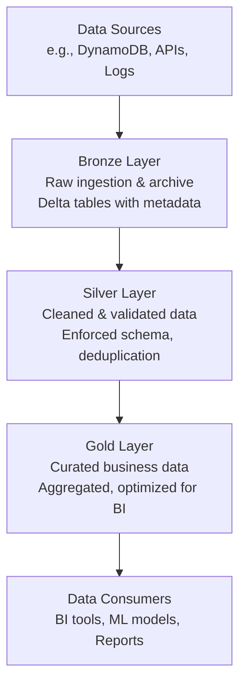

Modern data platforms are converging around the **Lakehouse** idea: a single system that combines the scalability of data lakes with the reliability and governance of data warehouses. Databricks is one of the main platforms enabling this pattern, letting the same data serve data engineering, BI, and machine learning workloads without duplication.

To make such a Lakehouse usable at scale, you need a **logical design pattern** that keeps data organized, understandable, and progressively higher quality. That is where the **Medallion architecture**—Bronze, Silver, and Gold layers—comes in.

In this first part of the series, the focus is:

- What the Lakehouse and Medallion architecture are trying to solve.
- How Bronze, Silver, and Gold layers differ conceptually.
- How to ingest data from **Amazon DynamoDB** into a **Bronze Delta table** on Databricks.
- A beginner‑friendly explanation of the core PySpark code and methods used for the Bronze layer.


## Lakehouse in a nutshell

Traditional architectures separated the **data warehouse** (for BI) and the **data lake** (for raw files and data science). That led to duplicated pipelines, inconsistent definitions, and slow iteration. The Lakehouse model aims to unify these into one system that:

- Stores data in **open formats** (e.g., Parquet, Delta) on cheap object storage.
- Adds **warehouse‑like features** (ACID transactions, schemas, governance, performance optimizations).
- Allows the same datasets to drive ETL, analytics, ML, and streaming workloads.

Databricks implements the Lakehouse on top of **Delta Lake** and **Unity Catalog**, giving you both the flexibility of a lake and the structure of a warehouse.


## Medallion Architecture: Bronze, Silver, Gold

The **Medallion architecture** is a multi‑layered pattern that organizes Lakehouse data into three tiers:


| Layer | Purpose | Data quality | Schema | Primary goal |
| :-- | :-- | :-- | :-- | :-- |
| Bronze | Raw ingestion & historical archive | Unvalidated | Flexible/source‑like | Preserve source truth |
| Silver | Conformed analytical foundation | Cleaned & validated | Enforced | Integration & quality |
| Gold | Curated business data | Highly refined | Optimized for BI | KPIs & insights |


### Bronze – Immutable foundation

The **Bronze layer** is the landing zone for data ingested from operational systems such as Amazon DynamoDB. 

Key characteristics:

- Stores **raw “as‑is” data** as it appears in the source system, often including unflattened JSON structures. 
- Adds **ingestion metadata** such as timestamps, source system IDs, and batch IDs.  
- Is mostly **append‑only**, acting as an immutable **historical archive** for all events. 
- Typically implemented as **Delta tables**, giving ACID transactions, schema evolution, and time travel. 

Because raw data is preserved in Bronze, you can **rebuild Silver and Gold** layers if your business logic changes, without ever hitting DynamoDB again. 

### Silver – Engine of integration

The **Silver layer** takes Bronze data and turns it into a clean, integrated view: 

- Enforces a consistent schema and data types.
- Deduplicates records and resolves late or out‑of‑order events.
- Flattens nested structures.
- Applies “**expectations**” (data quality rules) that decide whether to accept, drop, or quarantine records.
- Often models business entities in 3rd Normal Form or Data Vault style, making it an “enterprise view”. 

Silver tables are still fairly general‑purpose; they are not yet tuned to one specific report or dashboard.

### Gold – Apex of curation

The **Gold layer** is where data is shaped into datasets that directly answer business questions: 

- Denormalized **star schemas** for BI tools.
- Aggregated tables (daily/monthly revenue, customer lifetime value, churn cohorts).
- Heavy performance optimization: partitioning, clustering (e.g., Z‑Order), and indexing. 

Gold datasets are what executives, analysts, and ML serving systems usually interact with.

In this series, you will see the same DynamoDB‑derived data flow through **Bronze → Silver → Gold**, with each layer adding structure, quality, and business meaning.


## DynamoDB as a Lakehouse source

Many modern applications use **Amazon DynamoDB** for high‑throughput, low‑latency operations. However, DynamoDB’s design is very different from that of Spark and analytical systems: 

- DynamoDB is optimized for **single‑item lookups** and key‑based access.
- Spark is optimized for **large sequential scans** and distributed computation.

To ingest data from DynamoDB into Databricks safely and efficiently, there are three main strategies.

### DynamoDB → S3 → Databricks (decoupled ingestion)

A robust pattern is to use **Amazon S3 as a staging area**: 

1. Use DynamoDB’s native **export to S3** feature to dump full tables or incremental changes into an S3 bucket in JSON or Parquet form.
2. In Databricks, use **Auto Loader** (`cloud_files`) or `COPY INTO` to incrementally ingest those files into Bronze Delta tables. 
3. Optionally use S3 event notifications so Databricks can react to **file arrivals** and trigger ingestion jobs automatically. 

Advantages:

- Completely **decouples** Spark from DynamoDB RCUs, so analytics cannot throttle your production workloads. 
- Scales well for large tables and high event rates.
- Allows Bronze ingest jobs to be **event‑driven** (file arrival triggers).


### Direct Spark connectivity to DynamoDB

For smaller tables or lower‑latency use cases, Spark can read DynamoDB directly using a connector: 

- The connector splits the DynamoDB table into **segments** and lets Spark executors read them in parallel.
- You must tune segment count and parallelism to avoid overrunning the table’s read capacity and causing throttling. 
- Some connectors support schema inference and adaptive throttling based on available throughput. 

This approach is good for:

- Smaller tables that are safe to scan.
- Development or exploratory analysis.
- Use cases that need to avoid the extra hop through S3.


### Lakeflow Connect (managed connectors)

Databricks is rolling out **Lakeflow Connect**, a managed ingestion service: 

- Provides native connectors for popular databases and SaaS systems.
- Handles **Change Data Capture (CDC)**, schema evolution, and auth configuration for you. 
- Integrates with **Unity Catalog** (governance) and **Lakeflow Jobs** (orchestration).

As DynamoDB connectors in Lakeflow Connect mature, many manual ingestion patterns will be replaced with **configuration‑driven** connectors, further reducing the amount of custom ETL code you need to maintain. 

In this series, however, the focus remains on patterns you can implement today using PySpark and Delta.


## Implementing the Bronze layer: DynamoDB → Delta

The rest of this part walks through a simple but realistic **Bronze ingestion** implementation using PySpark on Databricks.

### Bronze ingestion code

```python
from pyspark.sql import SparkSession
from pyspark.sql.functions import col, current_timestamp, lit, current_date
import datetime

# Initialize Spark session
spark = SparkSession.builder \
    .appName("BronzeIngest") \
    .getOrCreate()

def read_dynamodb_table(table_name: str, region: str = "us-east-1"):
    """
    Read entire DynamoDB table into a Spark DataFrame.
    Requires a DynamoDB connector configured on the cluster.
    """
    df = spark.read.format("dynamodb") \
        .option("dynamodb.region", region) \
        .option("dynamodb.table", table_name) \
        .option("dynamodb.read.throughput", "100") \
        .load()
    return df

print("Reading customer transactions from DynamoDB...")
source_df = read_dynamodb_table("customer_transactions")

print(f"Record count: {source_df.count():,}")
print("\nSchema:")
source_df.printSchema()

# Add ingestion metadata
ingestion_timestamp = datetime.datetime.now()

bronze_df = source_df \
    .withColumn("_ingestion_timestamp", current_timestamp()) \
    .withColumn("_ingestion_date", current_date()) \
    .withColumn("_source_system", lit("dynamodb")) \
    .withColumn("_source_table", lit("customer_transactions")) \
    .withColumn("_batch_id", lit(f"batch_{ingestion_timestamp.isoformat()}"))

# Write to Delta Lake as Bronze layer
BRONZE_PATH = "s3a://my-data-lake/bronze/customer_transactions"

bronze_df.write \
    .format("delta") \
    .mode("append") \
    .option("mergeSchema", "true") \
    .save(BRONZE_PATH)

print("\n✓ Bronze ingestion complete!")
print(f"  Records written: {bronze_df.count():,}")
print(f"  Location: {BRONZE_PATH}")
print(f"  Timestamp: {ingestion_timestamp.isoformat()}")
```


### High‑level: what this code is doing?

At a birds‑eye view, the script:

1. **Creates a Spark session** so you can run DataFrame operations on the cluster. 
2. **Reads the entire DynamoDB table** `customer_transactions` into a DataFrame using a connector.  
3. Prints a quick **row count and schema** for sanity checks. 
4. Adds a set of **metadata columns**:
    - `_ingestion_timestamp` – when the batch hit the lake.
    - `_ingestion_date` – the date, useful for partitioning.
    - `_source_system` and `_source_table` – provenance.
    - `_batch_id` – unique ID to trace a particular load run. 
5. Writes that DataFrame as a **Delta table in the Bronze folder**, appending new data and allowing schema evolution.  

No business logic, no filtering, no quality rules—that is by design. Bronze is about **capture everything reliably**.

### PySpark method explanations

To make this more accessible, here is what the main methods do.

#### SparkSession

```python
spark = SparkSession.builder \
    .appName("BronzeIngest") \
    .getOrCreate()
```

- `SparkSession` is your **entry point** into Spark.
- `.builder.appName(...)` names your application (shows up in UI/logs).
- `.getOrCreate()` reuses an existing session if one exists, otherwise creates a new one. 

Think of `spark` as your “connection” to the cluster and data.

#### Reading from DynamoDB

```python
df = spark.read.format("dynamodb") \
    .option("dynamodb.region", region) \
    .option("dynamodb.table", table_name) \
    .option("dynamodb.read.throughput", "100") \
    .load()
```

- `spark.read` returns a **DataFrameReader**.
- `.format("dynamodb")` tells Spark to use the DynamoDB connector.
- `.option(...)` sets connector options (region, table name, read throughput).
- `.load()` executes the read and returns a **DataFrame** where each row is a DynamoDB item.  

The result `df` behaves like a table: you can count rows, print schema, filter, join, etc.

#### Inspecting the data

```python
source_df.count()
source_df.printSchema()
```

- `.count()` – returns the number of rows in the DataFrame (requires a cluster‑wide read).
- `.printSchema()` – prints the schema tree (column names and types). 

You use these to sanity‑check what you ingested before moving further.

#### Adding metadata columns

```python
bronze_df = source_df \
    .withColumn("_ingestion_timestamp", current_timestamp()) \
    .withColumn("_ingestion_date", current_date()) \
    .withColumn("_source_system", lit("dynamodb")) \
    .withColumn("_source_table", lit("customer_transactions")) \
    .withColumn("_batch_id", lit(f"batch_{ingestion_timestamp.isoformat()}"))
```

- `.withColumn(name, expr)` – adds or replaces a column.
- `current_timestamp()` – returns the current time as a timestamp column.
- `current_date()` – returns the current date as a date column.
- `lit("value")` – creates a constant column (same value in every row). 

These fields are crucial later for debugging, lineage, and incremental processing (for example, filtering by `_ingestion_date`).

#### Writing to Delta (Bronze)

```python
bronze_df.write \
    .format("delta") \
    .mode("append") \
    .option("mergeSchema", "true") \
    .save(BRONZE_PATH)
```

- `.write` begins a write operation.
- `.format("delta")` stores the data in **Delta Lake** format (Parquet + transaction log).  
- `.mode("append")` adds new data to existing data without deleting previous batches.
- `.option("mergeSchema","true")` lets new columns appear over time without failing the write.
- `.save(path)` writes these files to the specified object storage path. 

This path effectively becomes your **Bronze table**. You may also register it in a catalog with a `CREATE TABLE` statement pointing at this location.


## 5. Why Bronze matters?

It might be tempting to “skip” Bronze and ingest directly into a cleaned‑up table, but the Bronze layer is the foundation for a robust Lakehouse pipeline: 

- **Auditability** – You keep every version of every record as received from DynamoDB.
- **Reproducibility** – If Silver or Gold logic changes, you can recompute them from Bronze without touching the source again.
- **Debugging** – When something looks wrong in a report, you can trace it back through Silver to the exact Bronze batch and even the original DynamoDB record. 
- **Decoupling** – Production app teams only care that their data lands in DynamoDB; the Databricks team only needs to guarantee it is faithfully mirrored into Bronze. 

By the end of Part 1, you have:

- A clear understanding of Lakehouse and Medallion architecture.
- DynamoDB ingestion patterns that protect production workloads.
- A working Bronze ingestion job that captures raw data with rich metadata.
- A basic understanding of the core PySpark methods used (`SparkSession`, `read`, `withColumn`, `write`).  

In **Part 2**, the focus will shift to the **Silver layer**: enforcing data quality, cleaning and standardizing fields, joining with dimension tables, and making the pipeline usable for analytics and machine learning. [Read Part 2 →](/posts/building-databricks-medallion-pipelines-with-dynamodb-2/)
