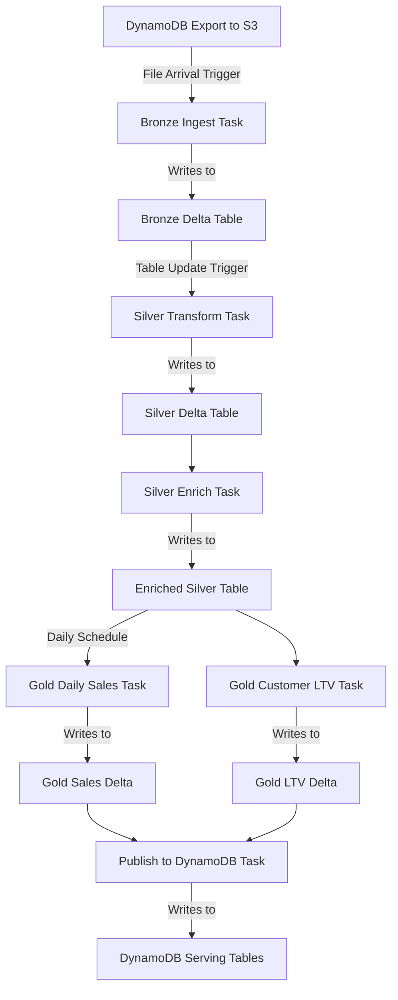

In Parts 1–3, you learned the architectural concepts and transformation logic for Bronze, Silver, and Gold layers, but the **orchestration glue** that ties them together into a production streaming pipeline deserves its own deep dive.  

This article shows:

- A complete **Databricks Workflow JSON** configuration linking Bronze → Silver → Gold.
- How **file arrival triggers**, **table update triggers**, and **dependencies** create an event-driven DAG.
- Python code for accessing trigger context (commit versions, updated tables).
- Monitoring and observability patterns for multi-stage workflows.
- How to deploy and manage workflows via Databricks CLI/API.  


## Event-driven orchestration overview

A production Medallion pipeline should react to **data events**, not just time-based schedules: 

1. **New DynamoDB export lands in S3** → Bronze ingestion starts automatically.
2. **Bronze table commits new data** → Silver transformation starts.
3. **Silver table updates** → Gold aggregation runs.
4. **Gold completes** → Metrics are published to DynamoDB for serving.

This creates a **loosely coupled, event-driven DAG** where each stage only runs when upstream data changes, minimizing wasted compute and reducing end-to-end latency. 


## Complete workflow configuration

Below is a **full Databricks Workflow JSON** that implements the Bronze → Silver → Gold → DynamoDB pattern with event triggers.  

```json
{
  "name": "medallion_dynamodb_pipeline",
  "description": "Event-driven Bronze→Silver→Gold pipeline with DynamoDB source and target",
  "max_concurrent_runs": 3,
  "timeout_seconds": 0,
  "email_notifications": {
    "on_success": ["data-team@company.com"],
    "on_failure": ["data-ops@company.com", "oncall@company.com"],
    "no_alert_for_skipped_runs": false
  },
  
  "tasks": [
    {
      "task_key": "bronze_ingest_transactions",
      "description": "Ingest new DynamoDB exports from S3 into Bronze layer",
      
      "notebook_task": {
        "notebook_path": "/Repos/production/etl-pipelines/bronze/01_ingest_transactions",
        "base_parameters": {
          "source_table": "customer_transactions",
          "bronze_path": "s3a://my-data-lake/bronze/customer_transactions"
        }
      },
      
      "new_cluster": {
        "spark_version": "14.3.x-scala2.12",
        "node_type_id": "i3.xlarge",
        "num_workers": 3,
        "spark_conf": {
          "spark.databricks.delta.preview.enabled": "true",
          "spark.databricks.delta.properties.defaults.autoOptimize.optimizeWrite": "true"
        },
        "aws_attributes": {
          "availability": "ON_DEMAND",
          "instance_profile_arn": "arn:aws:iam::123456789:instance-profile/databricks-s3-access"
        }
      },
      
      "timeout_seconds": 3600,
      "max_retries": 2,
      "retry_on_timeout": true,
      
      "trigger": {
        "file_arrival": {
          "url": "s3a://raw-dynamodb-exports/customer_transactions/",
          "min_time_between_triggers_seconds": 300,
          "wait_after_last_change_seconds": 60
        }
      }
    },
    
    {
      "task_key": "silver_transform_transactions",
      "description": "Apply validation, cleaning, and enrichment to create Silver layer",
      "depends_on": [
        {
          "task_key": "bronze_ingest_transactions"
        }
      ],
      
      "notebook_task": {
        "notebook_path": "/Repos/production/etl-pipelines/silver/02_transform_transactions",
        "base_parameters": {
          "bronze_table": "catalog.bronze.customer_transactions",
          "silver_path": "s3a://my-data-lake/silver/customer_transactions",
          "quality_threshold": "0.98"
        }
      },
      
      "job_cluster_key": "shared_cluster",
      
      "timeout_seconds": 3600,
      "max_retries": 1,
      
      "trigger": {
        "table_update": {
          "table_names": ["catalog.bronze.customer_transactions"],
          "min_time_between_triggers_seconds": 300,
          "wait_after_last_change_seconds": 120
        }
      },
      
      "health": {
        "rules": [
          {
            "metric": "RUN_DURATION_SECONDS",
            "op": "GREATER_THAN",
            "value": 7200
          }
        ]
      }
    },
    
    {
      "task_key": "silver_enrich_customers",
      "description": "Join transactions with customer dimension for enrichment",
      "depends_on": [
        {
          "task_key": "silver_transform_transactions"
        }
      ],
      
      "notebook_task": {
        "notebook_path": "/Repos/production/etl-pipelines/silver/03_enrich_with_dimensions",
        "base_parameters": {
          "transactions_table": "catalog.silver.customer_transactions",
          "customers_dim": "catalog.dimensions.customers"
        }
      },
      
      "job_cluster_key": "shared_cluster",
      "timeout_seconds": 1800,
      "max_retries": 1
    },
    
    {
      "task_key": "gold_daily_sales_summary",
      "description": "Aggregate Silver data into daily sales metrics",
      "depends_on": [
        {
          "task_key": "silver_enrich_customers"
        }
      ],
      
      "notebook_task": {
        "notebook_path": "/Repos/production/etl-pipelines/gold/04_daily_sales_summary",
        "base_parameters": {
          "silver_table": "catalog.silver.customer_transactions",
          "gold_path": "s3a://my-data-lake/gold/daily_sales_summary"
        }
      },
      
      "job_cluster_key": "shared_cluster",
      "timeout_seconds": 7200,
      "max_retries": 1,
      
      "trigger": {
        "periodic": {
          "interval": 1,
          "unit": "DAYS"
        }
      }
    },
    
    {
      "task_key": "gold_customer_ltv",
      "description": "Calculate customer lifetime value metrics",
      "depends_on": [
        {
          "task_key": "silver_enrich_customers"
        }
      ],
      
      "notebook_task": {
        "notebook_path": "/Repos/production/etl-pipelines/gold/05_customer_ltv",
        "base_parameters": {
          "silver_table": "catalog.silver.customer_transactions",
          "gold_path": "s3a://my-data-lake/gold/customer_metrics"
        }
      },
      
      "job_cluster_key": "shared_cluster",
      "timeout_seconds": 3600,
      "max_retries": 1
    },
    
    {
      "task_key": "publish_to_dynamodb",
      "description": "Write Gold metrics back to DynamoDB for API serving",
      "depends_on": [
        {
          "task_key": "gold_daily_sales_summary"
        },
        {
          "task_key": "gold_customer_ltv"
        }
      ],
      
      "notebook_task": {
        "notebook_path": "/Repos/production/etl-pipelines/serving/06_publish_dynamodb",
        "base_parameters": {
          "sales_summary_path": "s3a://my-data-lake/gold/daily_sales_summary",
          "customer_ltv_path": "s3a://my-data-lake/gold/customer_metrics",
          "dynamodb_sales_table": "daily_sales_metrics",
          "dynamodb_customer_table": "customer_ltv_metrics",
          "target_wcu": "500"
        }
      },
      
      "new_cluster": {
        "spark_version": "14.3.x-scala2.12",
        "node_type_id": "i3.2xlarge",
        "num_workers": 5,
        "aws_attributes": {
          "availability": "ON_DEMAND",
          "instance_profile_arn": "arn:aws:iam::123456789:instance-profile/databricks-dynamodb-write"
        }
      },
      
      "timeout_seconds": 3600,
      "max_retries": 2
    }
  ],
  
  "job_clusters": [
    {
      "job_cluster_key": "shared_cluster",
      "new_cluster": {
        "spark_version": "14.3.x-scala2.12",
        "node_type_id": "i3.xlarge",
        "num_workers": 4,
        "autoscale": {
          "min_workers": 2,
          "max_workers": 8
        },
        "spark_conf": {
          "spark.databricks.delta.optimizeWrite.enabled": "true",
          "spark.databricks.delta.autoCompact.enabled": "true"
        },
        "aws_attributes": {
          "availability": "SPOT_WITH_FALLBACK",
          "instance_profile_arn": "arn:aws:iam::123456789:instance-profile/databricks-s3-access"
        }
      }
    }
  ],
  
  "schedule": {
    "quartz_cron_expression": "0 0 1 * * ?",
    "timezone_id": "America/Los_Angeles",
    "pause_status": "UNPAUSED"
  }
}
```

## 3. Understanding the workflow structure

### Task dependencies and triggers

**Task: bronze_ingest_transactions**

- **Trigger**: File arrival on S3 path `s3a://raw-dynamodb-exports/customer_transactions/` 
- **What it does**: Runs notebook `01_ingest_transactions` which reads new DynamoDB exports and writes to Bronze Delta table 
- **Cluster**: New dedicated cluster (fast startup for event-driven ingestion)
- **Parameters**: Source table name, target Bronze path

**Task: silver_transform_transactions**

- **Depends on**: `bronze_ingest_transactions` (runs after Bronze completes)
- **Trigger**: Table update on `catalog.bronze.customer_transactions` 
- **What it does**: Applies validation rules, cleaning, type casting from Part 2 
- **Cluster**: Shared job cluster (cost-efficient for multi-stage processing)
- **Health check**: Alerts if runtime exceeds 2 hours

**Task: silver_enrich_customers**

- **Depends on**: `silver_transform_transactions`
- **What it does**: Joins with customer dimension table for enrichment 
- **No explicit trigger**: Runs immediately when dependency completes

**Task: gold_daily_sales_summary**

- **Depends on**: `silver_enrich_customers`
- **Trigger**: Periodic (daily at 1 AM) OR when Silver updates 
- **What it does**: Aggregates transactions into daily sales metrics by category/segment/region 

**Task: gold_customer_ltv**

- **Depends on**: `silver_enrich_customers`
- **What it does**: Calculates customer lifetime value, frequency, recency metrics 
- **Runs in parallel** with `gold_daily_sales_summary`

**Task: publish_to_dynamodb**

- **Depends on**: Both Gold tasks completing
- **What it does**: Writes Gold Delta tables back to DynamoDB for API serving 
- **Cluster**: Larger dedicated cluster with DynamoDB write permissions


### Trigger types explained

| Trigger | Configuration | When it fires | Best for |
| :-- | :-- | :-- | :-- |
| **File arrival** | `url`, `min_time_between_triggers_seconds`, `wait_after_last_change_seconds` | New files detected in S3 path | Bronze ingestion from exports  |
| **Table update** | `table_names`, `min_time_between_triggers_seconds`, `wait_after_last_change_seconds` | Delta table commits (INSERT/MERGE/DELETE) | Silver and Gold reactive processing  |
| **Periodic** | `interval`, `unit` (HOURS/DAYS) | Fixed schedule | Daily/hourly aggregations  |
| **Dependency** | `depends_on` | When upstream task completes | Sequential processing |


## Accessing trigger context in notebooks

When a task is triggered by file arrival or table update, Databricks exposes context via **job parameters**. 

### File arrival context

In the Bronze ingestion notebook:

```python
import json

# Access file arrival trigger information
try:
    # Get the list of new files that triggered this run
    trigger_info = dbutils.widgets.get("{{job.trigger.file_arrival.new_files}}")
    new_files = json.loads(trigger_info)
    
    print(f"Processing {len(new_files)} new files:")
    for file_path in new_files:
        print(f"  - {file_path}")
    
    # Process only the new files (incremental ingestion)
    for file_path in new_files:
        df = spark.read.format("parquet").load(file_path)
        # Add to Bronze...
        
except Exception as e:
    print("No file arrival context; running full ingestion")
    # Fallback to processing entire directory
```


### Table update context

In the Silver transformation notebook:

```python
# Access table update trigger information
try:
    updated_tables = dbutils.widgets.get("{{job.trigger.table_update.updated_tables}}")
    print(f"Triggered by updates to: {updated_tables}")
    
    # Get specific commit version for exactly-once processing
    bronze_version = dbutils.widgets.get(
        "{{job.trigger.table_update.catalog.bronze.customer_transactions.version}}"
    )
    print(f"Processing Bronze commit version: {bronze_version}")
    
    # Read specific version for incremental processing
    bronze_df = spark.read \
        .format("delta") \
        .option("versionAsOf", bronze_version) \
        .table("catalog.bronze.customer_transactions")
    
    # Apply Silver transformations...
    
except Exception as e:
    print("No table update context; processing latest Bronze data")
    bronze_df = spark.read.table("catalog.bronze.customer_transactions")
```

This enables **exactly-once semantics**: each Silver run processes a specific Bronze commit version, avoiding duplicate processing or missed records. 

## Deploying and managing workflows

### Deploy via Databricks CLI

```bash
# Install Databricks CLI
pip install databricks-cli

# Configure authentication
databricks configure --token

# Create the workflow
databricks jobs create --json-file medallion_workflow.json

# Output: {"job_id": 12345}
```


### Update existing workflow

```bash
# Update workflow definition
databricks jobs reset --job-id 12345 --json-file medallion_workflow_v2.json
```


### Trigger manually (for testing)

```bash
# Trigger a one-time run
databricks jobs run-now --job-id 12345

# Trigger with custom parameters
databricks jobs run-now --job-id 12345 \
  --notebook-params '{"source_table": "test_transactions"}'
```


### Python SDK example

```python
from databricks.sdk import WorkspaceClient
import json

client = WorkspaceClient()

# Load workflow configuration
with open("medallion_workflow.json") as f:
    workflow_config = json.load(f)

# Create workflow
response = client.jobs.create(**workflow_config)
job_id = response.job_id

print(f"✓ Workflow created with Job ID: {job_id}")

# Trigger workflow
run_response = client.jobs.run_now(job_id=job_id)
run_id = run_response.run_id

print(f"✓ Workflow triggered with Run ID: {run_id}")

# Monitor run status
import time
while True:
    run = client.jobs.get_run(run_id)
    state = run.state.life_cycle_state
    
    print(f"Run state: {state}")
    
    if state in ["TERMINATED", "SKIPPED", "INTERNAL_ERROR"]:
        result = run.state.result_state
        print(f"Final result: {result}")
        break
    
    time.sleep(30)
```

## Monitoring and observability

### Built-in job monitoring

Databricks provides:

- **Run history**: view all executions, durations, and outcomes
- **Task-level logs**: stdout/stderr from each notebook
- **Lineage tracking**: see which tables were read/written by each task 
- **Health rules**: alert when tasks exceed duration or memory thresholds


### Custom metrics table

Extend the workflow with a metrics collection task:

```python
# In each task notebook, log metrics
from datetime import datetime

def log_task_metrics(stage, input_count, output_count, duration_sec, quality_score):
    metrics_row = {
        "pipeline_run_id": dbutils.widgets.get("run_id"),
        "stage": stage,
        "timestamp": datetime.now(),
        "records_input": input_count,
        "records_output": output_count,
        "duration_seconds": duration_sec,
        "quality_score": quality_score
    }
    
    spark.createDataFrame([metrics_row]).write \
        .format("delta") \
        .mode("append") \
        .saveAsTable("catalog.metrics.pipeline_runs")

# Usage in Silver task
start_time = datetime.now()
# ... perform Silver transformation ...
duration = (datetime.now() - start_time).total_seconds()

log_task_metrics(
    stage="silver",
    input_count=bronze_df.count(),
    output_count=silver_df.count(),
    duration_sec=duration,
    quality_score=0.985
)
```

### Alerting on quality degradation

Query the metrics table to detect issues:

```sql
-- Alert if Silver quality drops below threshold
SELECT 
    stage,
    AVG(quality_score) as avg_quality,
    COUNT(*) as run_count
FROM catalog.metrics.pipeline_runs
WHERE timestamp >= CURRENT_DATE() - INTERVAL 7 DAYS
GROUP BY stage
HAVING AVG(quality_score) < 0.98
```

Set up **SQL alerts** in Databricks SQL to email/Slack when this query returns rows. 

## Complete end-to-end flow diagram

Here's how the complete workflow executes:



**Timeline example:**

```
14:30 - New DynamoDB export lands in S3
14:31 - File arrival trigger fires → Bronze ingestion starts
14:35 - Bronze writes commit → Table update trigger fires → Silver starts
14:42 - Silver writes commit → Enrichment task starts immediately
14:48 - Enrichment completes, waits for daily schedule
01:00 (next day) - Daily schedule fires → Gold tasks start in parallel
01:15 - Both Gold tasks complete → DynamoDB publish starts
01:25 - DynamoDB publish completes → Metrics available to APIs
```

## Summary

This Part 4 filled the orchestration gap by showing:

- A **complete Databricks Workflow JSON** with 6 tasks spanning Bronze → Silver → Gold → DynamoDB.  
- How **file arrival triggers** detect new S3 exports and start Bronze ingestion automatically. 
- How **table update triggers** make Silver and Gold reactive to upstream changes. 
- How to access **trigger context** in notebooks for incremental, exactly-once processing. 
- How to deploy workflows via CLI/API and monitor them with built-in and custom metrics.  

Combined with Parts 1–3, you now have a **complete, production-ready blueprint** for building event-driven Medallion pipelines that integrate DynamoDB with Databricks, handle streaming data, enforce data quality, and serve both analytical and operational use cases.  
