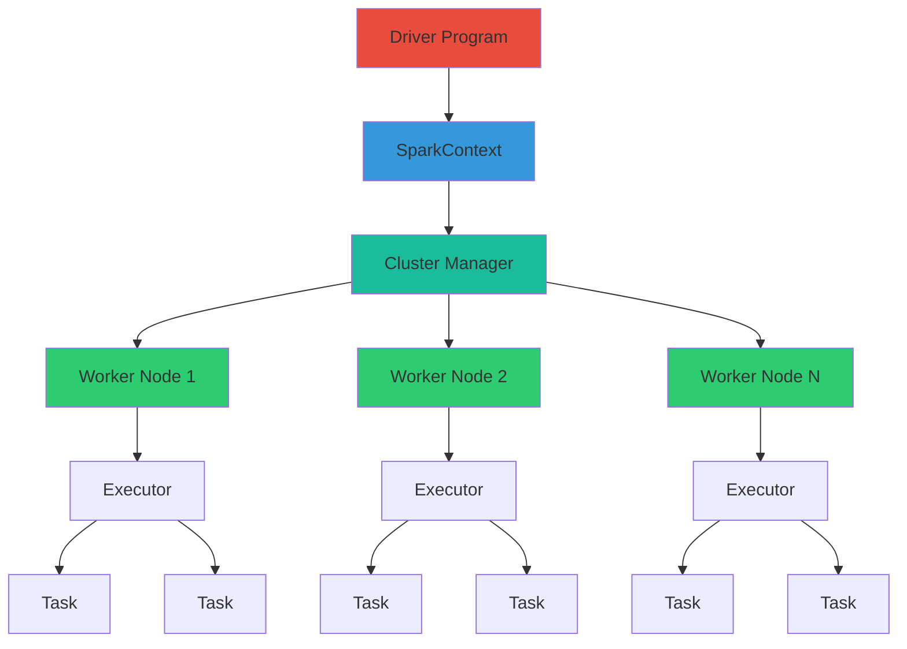

**Part 1 of 5 in the Complete PySpark Series**: *Understanding the foundations of distributed data processing with Apache Spark*

## Table of Contents

1. [Introduction](#introduction)
2. [Understanding PySpark Architecture](#understanding-pyspark-architecture)
3. [SparkSession & Configuration](#sparksession--configuration)

## Introduction

Apache Spark is a distributed computing framework designed to process large-scale data efficiently. PySpark is the Python API for Spark, allowing Python developers to harness the power of distributed computing while writing familiar Python code. In this article, we'll explore the core concepts of PySpark, including its architecture, lazy evaluation model, and how to set up and configure a Spark session.

### Why PySpark?

- **Scalability**: Process terabytes of data across clusters
- **Speed**: In-memory computation is up to 100x faster than MapReduce
- **Unified API**: Batch processing, streaming, ML, and graph processing in one framework
- **Language Support**: Write code in Python, Scala, Java, or R


## Understanding PySpark Architecture

Before diving into the API, it's crucial to understand how PySpark works internally.




### Key Components:

1. **Driver Program**: Your Python application that contains the main logic
2. **SparkContext**: Connection to the Spark cluster
3. **Cluster Manager**: Allocates resources (YARN, Mesos, Kubernetes, or Standalone)
4. **Executors**: Processes running on worker nodes that execute tasks
5. **Tasks**: Units of work sent to executors

### Lazy Evaluation

PySpark uses **lazy evaluation** - transformations are not executed immediately but build up a DAG (Directed Acyclic Graph) of operations. Execution happens only when an **action** is called.

**Note on caching**: calling `.cache()` or `.persist()` marks the DataFrame/RDD for caching, but does not itself execute the plan. The DataFrame is materialized (and then cached) only when an action runs (for example `count()`, `collect()`, or `write()`). To force early materialization and populate the cache, call a lightweight action after `cache()` (e.g., `df.cache(); df.count()`).


**Transformations** (lazy): `select()`, `filter()`, `groupBy()`, `join()`
**Actions** (trigger execution): `show()`, `collect()`, `count()`, `write()`


## SparkSession & Configuration

### SparkSession.builder.getOrCreate()

The entry point to PySpark functionality.

**Purpose**: Creates a new SparkSession or returns an existing one. This is the unified entry point for reading data, registering UDFs, and executing SQL.

**How it works internally**:

- Checks if a SparkSession already exists in the JVM
- If not, creates a new one with specified configurations
- Sets up the SparkContext, SQLContext, and HiveContext

**Example**:

```python
from pyspark.sql import SparkSession

# Basic session
spark = SparkSession.builder \
    .appName("MyDataProcessing") \
    .getOrCreate()

# With configuration
spark = SparkSession.builder \
    .appName("OptimizedApp") \
    .config("spark.sql.shuffle.partitions", "200") \
    .config("spark.executor.memory", "4g") \
    .config("spark.driver.memory", "2g") \
    .getOrCreate()
```

**Real-world use case**:

```python
# E-commerce analytics application
spark = SparkSession.builder \
    .appName("EcommerceAnalytics") \
    .config("spark.sql.adaptive.enabled", "true") \
    .config("spark.sql.adaptive.coalescePartitions.enabled", "true") \
    .enableHiveSupport() \
    .getOrCreate()

# Now you can read from Hive tables
sales_df = spark.table("sales.transactions")
```


### spark.conf.get(), .set(), .unset()

**Purpose**: Manage Spark configuration at runtime.

**Example**:

```python
# Get current configuration
shuffle_partitions = spark.conf.get("spark.sql.shuffle.partitions")
print(f"Current shuffle partitions: {shuffle_partitions}")

# Set configuration
spark.conf.set("spark.sql.shuffle.partitions", "100")

# Unset configuration (reverts to default)
spark.conf.unset("spark.sql.shuffle.partitions")
```


### Timestamps & Time Zones

Spark stores `TimestampType` values internally as epoch-based instants; however, string conversion and display depend on the session time zone. The session time zone is controlled by `spark.sql.session.timeZone` (defaults to the JVM/system timezone).

**Best practices**:

- Set a canonical time zone for your jobs (e.g., UTC) to avoid surprises when reading/writing timestamps across environments:

```python
spark.conf.set("spark.sql.session.timeZone", "UTC")
```

- Use `to_utc_timestamp()` / `from_utc_timestamp()` when converting between wall-clock time and stored UTC instants.
- When parsing strings that include time zone offsets, prefer `to_timestamp()` with an explicit format, or normalize to UTC on ingest.

**Example**:

```python
from pyspark.sql import functions as F

# Normalize parsed timestamp strings to UTC
df = spark.read.json("/path/events.json")
df = df.withColumn("ts_utc", F.to_utc_timestamp(F.col("event_time"), "UTC"))
```


### spark.table() & spark.sql()

**Purpose**: Access tables and execute SQL queries.

**Example**:

```python
# Load a table
customers_df = spark.table("warehouse.customers")

# Execute SQL query
high_value_customers = spark.sql("""
    SELECT
        customer_id,
        SUM(order_amount) as total_spent
    FROM warehouse.orders
    WHERE order_date >= '2024-01-01'
    GROUP BY customer_id
    HAVING total_spent > 10000
    ORDER BY total_spent DESC
""")
```

## What is Next in the Series

You've now learned the foundational concepts of PySpark architecture, lazy evaluation, and SparkSession configuration. Article 1 covered the distributed computing model, key components (driver, executors, tasks), and essential session management patterns.

In the next article, we'll dive into DataFrame operations and transformations - the bread and butter of PySpark data processing.

**[Continue to Article 2](/posts/pyspark-learning-2/)**: DataFrame Operations & Transformations

**Related articles in this series**:

- [Article 3](/posts/pyspark-learning-3/): Window Functions, UDFs & Null Handling
- [Article 4](/posts/pyspark-learning-4/): Delta Lake & Streaming
- [Article 5](/posts/pyspark-learning-5/): Performance, Testing & Production Best Practices
