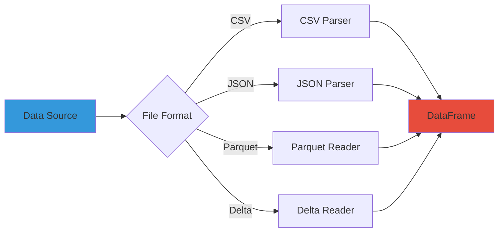
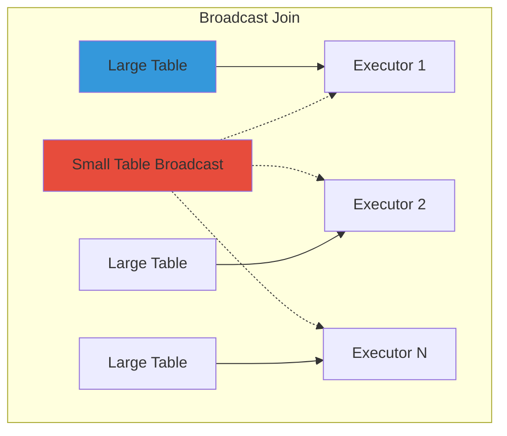
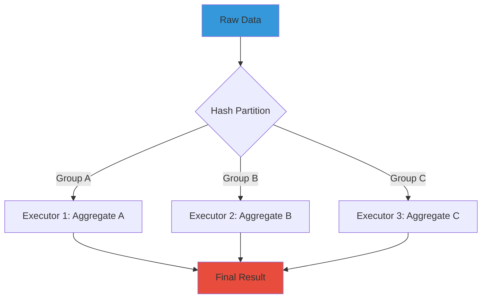
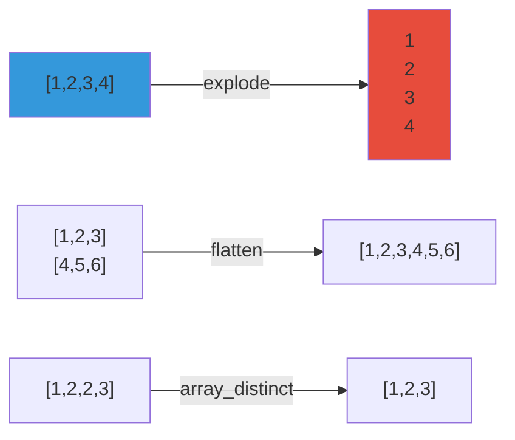

**Part 2 of 5 in the Complete PySpark Series**: *Mastering data manipulation, filtering, joins, and aggregations*

## Table of Contents

1. [DataFrame Operations](#dataframe-operations)
2. [Column Operations & Built-in Functions](#column-operations--built-in-functions)


In this article, we'll explore the essential DataFrame operations in PySpark, including reading data, selecting and filtering columns, performing joins, aggregations, and more. DataFrames are the core abstraction in PySpark for handling structured data, and mastering these operations is crucial for effective data processing.

## DataFrame Operations

DataFrames are the fundamental data structure in PySpark - distributed collections of data organized into named columns. They provide a high-level API for data manipulation, similar to pandas but optimized for big data processing. In this section, we'll explore the most commonly used DataFrame operations.

### Reading Data

#### spark.read Methods

**Purpose**: Load data from various sources into DataFrames.

**How it works**: PySpark reads data in parallel across executors, automatically distributing the workload.



**Examples**:

```python
# CSV with options
df = spark.read \
    .format("csv") \
    .option("header", "true") \
    .option("inferSchema", "true") \
    .option("delimiter", ",") \
    .option("quote", '"') \
    .option("escape", "\\") \
    .load("/path/to/data.csv")

# Or more concisely
df = spark.read.csv("/path/to/data.csv", header=True, inferSchema=True)

# JSON
df = spark.read.json("/path/to/data.json")

# Parquet (columnar format - very efficient)
df = spark.read.parquet("/path/to/data.parquet")

# Multiple files
df = spark.read.parquet("/path/to/data/*.parquet")

# With explicit schema (faster than inferSchema)
from pyspark.sql.types import StructType, StructField, StringType, IntegerType, DoubleType

schema = StructType([
    StructField("customer_id", StringType(), nullable=False),
    StructField("name", StringType(), nullable=True),
    StructField("age", IntegerType(), nullable=True),
    StructField("balance", DoubleType(), nullable=True)
])

df = spark.read.csv("/path/to/customers.csv", schema=schema, header=True)
```

**Real-world use case - Loading e-commerce data**:

```python
# Load orders from different sources
orders_csv = spark.read \
    .option("header", "true") \
    .option("inferSchema", "true") \
    .csv("s3://bucket/orders/2024/01/*.csv")

# Load product catalog from Parquet
products = spark.read.parquet("s3://bucket/products/catalog.parquet")

# Load user events from JSON
events = spark.read.json("s3://bucket/events/clickstream/")
```


### Selection & Projection

#### .select()

**Purpose**: Choose specific columns or create new computed columns.

**How it works**: The select operation is pushed down to the data source when possible (predicate pushdown), reading only necessary columns to minimize I/O.

```python
# Select specific columns
df.select("customer_id", "name", "email")

# Using column objects
from pyspark.sql import functions as F
df.select(F.col("customer_id"), F.col("name"))

# With expressions
df.select(
    "customer_id",
    F.col("first_name").alias("fname"),
    (F.col("price") * 1.1).alias("price_with_tax")
)

# Select all columns plus new ones
df.select("*", (F.col("quantity") * F.col("price")).alias("total"))
```

**Real-world example - Customer report**:

```python
customer_report = customers.select(
    "customer_id",
    F.concat(F.col("first_name"), F.lit(" "), F.col("last_name")).alias("full_name"),
    "email",
    F.year(F.col("registration_date")).alias("registration_year"),
    F.when(F.col("total_purchases") > 1000, "Premium")
     .when(F.col("total_purchases") > 100, "Gold")
     .otherwise("Standard").alias("tier")
)
```


#### .selectExpr()

**Purpose**: Select using SQL expressions (more concise for complex expressions).

```python
df.selectExpr(
    "customer_id",
    "CONCAT(first_name, ' ', last_name) as full_name",
    "total_amount * 1.1 as amount_with_tax",
    "CASE WHEN age >= 65 THEN 'Senior' ELSE 'Regular' END as category"
)
```


#### .withColumn()

**Purpose**: Add a new column or replace an existing one.

**Important**: This creates a new DataFrame (immutability principle).

```python
# Add single column
df = df.withColumn("tax", F.col("amount") * 0.1)

# Chain multiple withColumn calls
df = df.withColumn("full_name", F.concat(F.col("first_name"), F.lit(" "), F.col("last_name"))) \
       .withColumn("age_group", F.when(F.col("age") < 18, "Minor")
                                 .when(F.col("age") < 65, "Adult")
                                 .otherwise("Senior"))
```


#### .withColumnRenamed()

**Purpose**: Rename columns.

```python
df = df.withColumnRenamed("old_name", "new_name")

# Rename multiple columns
for old_col, new_col in [("fn", "first_name"), ("ln", "last_name")]:
    df = df.withColumnRenamed(old_col, new_col)
```


#### .drop()

**Purpose**: Remove columns from DataFrame.

```python
# Drop single column
df = df.drop("temp_column")

# Drop multiple columns
df = df.drop("col1", "col2", "col3")
```


#### .alias()

**Purpose**: Give an alias to DataFrame (useful in joins) or columns.

```python
# DataFrame alias
customers.alias("c").join(orders.alias("o"), F.col("c.id") == F.col("o.customer_id"))

# Column alias
df.select(F.col("long_column_name").alias("short_name"))
```


### Filtering & Conditions

#### .filter() / .where()

**Purpose**: Filter rows based on conditions. Both are identical.

**How it works**: Filters are pushed down to data sources when possible, reducing data read from disk.

```python
# Simple filter
df.filter(F.col("age") > 18)
df.where(F.col("age") > 18)  # Identical

# Multiple conditions with &, |
df.filter((F.col("age") > 18) & (F.col("country") == "US"))
df.filter((F.col("status") == "active") | (F.col("status") == "pending"))

# Using SQL string
df.filter("age > 18 AND country = 'US'")

# Complex conditions
df.filter(
    (F.col("age") >= 18) &
    (F.col("age") <= 65) &
    (F.col("income") > 50000) &
    (F.col("country").isin("US", "CA", "UK"))
)
```

**Real-world example - Fraud detection**:

```python
suspicious_transactions = transactions.filter(
    (F.col("amount") > 10000) &
    (F.hour(F.col("timestamp")).between(0, 5)) &  # Late night
    (F.col("location_country") != F.col("user_country")) &  # Different country
    (F.col("merchant_category") == "Wire Transfer")
)
```


#### .distinct()

**Purpose**: Get unique rows.

**How it works**: Triggers a shuffle operation to compare rows across partitions.

```python
unique_customers = df.select("customer_id").distinct()
```


#### .dropDuplicates()

**Purpose**: Remove duplicate rows, optionally based on specific columns.

```python
# Drop completely duplicate rows
df = df.dropDuplicates()

# Drop duplicates based on specific columns (keep first occurrence)
df = df.dropDuplicates(["customer_id", "order_date"])
```

**Real-world example - Deduplication**:

```python
# Keep only the latest record for each customer
from pyspark.sql.window import Window

window = Window.partitionBy("customer_id").orderBy(F.col("update_timestamp").desc())

latest_customers = customers \
    .withColumn("row_num", F.row_number().over(window)) \
    .filter(F.col("row_num") == 1) \
    .drop("row_num")
```


### Joins

#### .join()

**Purpose**: Combine DataFrames based on keys.

**How it works**:

- **Shuffle Hash Join**: Shuffles both datasets and hashes join keys
- **Broadcast Join**: Broadcasts smaller table to all nodes (for small tables < 10MB)
- **Sort Merge Join**: Sorts both datasets on join key, then merges



**Examples**:

```python
# Inner join (default)
result = customers.join(orders, customers.customer_id == orders.customer_id)

# Left join
result = customers.join(orders, "customer_id", "left")

# Right join
result = customers.join(orders, "customer_id", "right")

# Outer join
result = customers.join(orders, "customer_id", "outer")

# Join on multiple columns
result = df1.join(df2, ["col1", "col2"], "inner")

# Join with explicit column references (avoid ambiguity)
result = customers.alias("c").join(
    orders.alias("o"),
    F.col("c.customer_id") == F.col("o.customer_id")
).select("c.*", "o.order_id", "o.amount")

# Broadcast hint (for small tables)
result = customers.join(F.broadcast(country_codes), "country_code")
```

**Broadcast join comparison**:

**Without broadcast hint (shuffle join)**:

```
== Physical Plan ==
SortMergeJoin [country_code#0], [country_code#10]
+- Sort [country_code#0 ASC NULLS FIRST]
   +- Exchange hashpartition(country_code#0, 200)
      +- Scan parquet customers (10M rows)
+- Sort [country_code#10 ASC NULLS FIRST]
   +- Exchange hashpartition(country_code#10, 200)
      +- Scan parquet country_codes (195 rows)
(Shuffle: 10M + 195 rows across network)
```

**With broadcast hint (broadcast join)**:

```
== Physical Plan ==
BroadcastHashJoin [country_code#0], [country_code#10]
+- Scan parquet customers (10M rows)
+- BroadcastExchange
   +- Scan parquet country_codes (195 rows)
(No shuffle: 195 rows broadcast to all executors)
```

**Impact**: ~100x faster. Broadcast fits in executor memory (195 rows << 10GB). SortMergeJoin requires two full network shuffles; BroadcastHashJoin sends small table once.

**Real-world example - Customer analytics**:

```python
# Join customers, orders, and products
customer_orders = customers.alias("c") \
    .join(orders.alias("o"), F.col("c.customer_id") == F.col("o.customer_id")) \
    .join(order_items.alias("oi"), F.col("o.order_id") == F.col("oi.order_id")) \
    .join(products.alias("p"), F.col("oi.product_id") == F.col("p.product_id")) \
    .select(
        "c.customer_id",
        "c.name",
        "o.order_id",
        "o.order_date",
        "p.product_name",
        "oi.quantity",
        (F.col("oi.quantity") * F.col("p.price")).alias("item_total")
    )
```


#### .hint()

**Purpose**: Provide join strategy hints to the optimizer.

```python
# Broadcast join hint
large_df.join(small_df.hint("broadcast"), "key")

# Merge join hint
df1.join(df2.hint("merge"), "key")

# Shuffle hash join hint
df1.join(df2.hint("shuffle_hash"), "key")
```


### Aggregations

#### .groupBy() + .agg()

**Purpose**: Group data and compute aggregates.

**How it works**:

1. Shuffle data so records with same key go to same partition
2. Aggregate locally in each partition
3. Combine results


**Examples**:

```python
# Single aggregation
df.groupBy("category").agg(F.sum("amount"))

# Multiple aggregations
df.groupBy("category", "region").agg(
    F.sum("amount").alias("total_amount"),
    F.avg("amount").alias("avg_amount"),
    F.count("*").alias("num_orders"),
    F.max("amount").alias("max_order"),
    F.min("amount").alias("min_order")
)

# Aggregation functions
df.groupBy("customer_id").agg(
    F.sum("amount").alias("total_spent"),
    F.count("order_id").alias("num_orders"),
    F.collect_list("product_id").alias("products_bought"),
    F.collect_set("category").alias("categories"),
    F.first("registration_date").alias("first_order"),
    F.approx_count_distinct("product_id").alias("unique_products_approx")
)
```

**Real-world example - Sales analytics**:

```python
# Monthly sales summary by category
monthly_sales = orders.groupBy(
    F.year("order_date").alias("year"),
    F.month("order_date").alias("month"),
    "category"
).agg(
    F.sum("amount").alias("total_revenue"),
    F.count("order_id").alias("num_orders"),
    F.avg("amount").alias("avg_order_value"),
    F.countDistinct("customer_id").alias("unique_customers"),
    F.sum(F.when(F.col("payment_method") == "credit_card", 1).otherwise(0)).alias("credit_card_orders")
)
```


#### .pivot()

**Purpose**: Rotate data from rows to columns (like Excel pivot tables).

```python
# Basic pivot
pivoted = df.groupBy("year").pivot("category").sum("amount")

# With explicit values (more efficient)
pivoted = df.groupBy("year").pivot("category", ["Electronics", "Clothing", "Food"]).sum("amount")
```

**Real-world example - Sales by category and quarter**:

```python
# Transform long format to wide format
quarterly_sales = sales.groupBy("product") \
    .pivot("quarter", ["Q1", "Q2", "Q3", "Q4"]) \
    .agg(F.sum("revenue"))

# Before:
# product | quarter | revenue
# Phone   | Q1      | 10000
# Phone   | Q2      | 15000

# After:
# product | Q1    | Q2    | Q3   | Q4
# Phone   | 10000 | 15000 | ...  | ...
```


### Set Operations

#### .union() / .unionByName()

**Purpose**: Combine DataFrames vertically.

```python
# Union by position (columns must be in same order)
combined = df1.union(df2)

# Union by name (matches columns by name)
combined = df1.unionByName(df2)

# Union with missing columns (fills with null)
combined = df1.unionByName(df2, allowMissingColumns=True)
```


#### .subtract()

**Purpose**: Get rows in first DataFrame but not in second.

```python
difference = df1.subtract(df2)
```


#### .intersect()

**Purpose**: Get rows present in both DataFrames.

```python
common = df1.intersect(df2)
```


### Ordering & Limiting

#### .orderBy() / .sort()

**Purpose**: Sort DataFrame by columns.

**How it works**: Triggers a shuffle to sort data globally across partitions.

```python
# Ascending (default)
df.orderBy("age")
df.sort("age")  # Identical

# Descending
df.orderBy(F.col("age").desc())
df.orderBy(F.desc("age"))

# Multiple columns
df.orderBy(F.col("country").asc(), F.col("age").desc())

# Null handling
df.orderBy(F.col("age").desc_nulls_last())
```


#### .limit()

**Purpose**: Return first N rows.

```python
top_10 = df.orderBy(F.col("revenue").desc()).limit(10)
```


#### .first(), .head(), .take()

**Purpose**: Retrieve specific number of rows to driver.

```python
# First row as Row object
first_row = df.first()

# First N rows as list
first_5 = df.head(5)
first_5 = df.take(5)  # Identical
```


### Actions

#### .collect()

**Purpose**: Retrieve all rows to driver memory.

**Warning**: Only use on small datasets. Will cause OOM on large data.

```python
rows = df.collect()  # Returns list of Row objects
for row in rows:
    print(row.customer_id, row.name)
```


#### .count()

**Purpose**: Count total rows.

**How it works**: Counts in each partition, then sums results.

```python
total_rows = df.count()
```


#### .show()

**Purpose**: Display DataFrame in tabular format.

```python
df.show()  # First 20 rows
df.show(50)  # First 50 rows
df.show(50, truncate=False)  # Don't truncate long values
df.show(vertical=True)  # Vertical layout
```


#### .isEmpty()

**Purpose**: Check if DataFrame has any rows.

```python
if df.isEmpty():
    print("No data found")
```


### Schema Operations

#### .schema, .printSchema(), .dtypes, .columns

**Purpose**: Inspect DataFrame structure.

```python
# Print schema tree
df.printSchema()
# Output:
# root
#  |-- customer_id: string (nullable = true)
#  |-- name: string (nullable = true)
#  |-- age: integer (nullable = true)

# Get schema object
schema = df.schema

# Get column names
columns = df.columns  # ['customer_id', 'name', 'age']

# Get data types
types = df.dtypes  # [('customer_id', 'string'), ('name', 'string'), ('age', 'int')]
```


### Views & Temp Tables

#### .createTempView(), .createOrReplaceTempView()

**Purpose**: Register DataFrame as SQL temp table.

```python
df.createOrReplaceTempView("customers")

# Now use SQL
result = spark.sql("""
    SELECT country, COUNT(*) as count
    FROM customers
    GROUP BY country
""")
```


## Column Operations & Built-in Functions

PySpark provides 300+ built-in functions in `pyspark.sql.functions`. Let's cover the most commonly used ones.

### Column References

#### F.col(), F.lit(), F.expr()

**Purpose**: Reference columns and create literals.

```python
from pyspark.sql import functions as F

# Column reference
F.col("customer_id")

# Literal value
F.lit(100)
F.lit("Active")

# SQL expression
F.expr("price * quantity as total")
```


### String Functions

String functions are essential for text processing.

#### F.concat(), F.concat_ws()

**Purpose**: Concatenate strings.

```python
# Concat (nulls result in null)
df.withColumn("full_name", F.concat(F.col("first_name"), F.lit(" "), F.col("last_name")))

# Concat with separator (nulls are skipped)
df.withColumn("address", F.concat_ws(", ", F.col("street"), F.col("city"), F.col("state")))
```


#### F.substring(), F.split()

**Purpose**: Extract and split strings.

```python
# Substring (1-indexed!)
df.withColumn("area_code", F.substring(F.col("phone"), 1, 3))

# Split
df.withColumn("name_parts", F.split(F.col("full_name"), " "))
```


#### F.regexp_replace(), F.regexp_extract()

**Purpose**: Regex operations.

```python
# Replace
df.withColumn("phone_clean", F.regexp_replace(F.col("phone"), "[^0-9]", ""))

# Extract
df.withColumn("domain", F.regexp_extract(F.col("email"), "@(.+)$", 1))
```

**Real-world example - Data cleaning**:

```python
# Clean and standardize phone numbers
cleaned = df.withColumn(
    "phone_standardized",
    F.regexp_replace(
        F.regexp_replace(F.col("phone"), "[^0-9]", ""),  # Remove non-digits
        "^1", ""  # Remove leading 1
    )
).withColumn(
    "phone_formatted",
    F.concat(
        F.lit("("),
        F.substring(F.col("phone_standardized"), 1, 3),
        F.lit(") "),
        F.substring(F.col("phone_standardized"), 4, 3),
        F.lit("-"),
        F.substring(F.col("phone_standardized"), 7, 4)
    )
)
```


### Conditional Functions

#### F.when().otherwise()

**Purpose**: Create conditional logic (like SQL CASE WHEN).

```python
# Simple condition
df.withColumn(
    "age_group",
    F.when(F.col("age") < 18, "Minor")
     .when(F.col("age") < 65, "Adult")
     .otherwise("Senior")
)

# Multiple conditions
df.withColumn(
    "risk_level",
    F.when((F.col("amount") > 10000) & (F.col("country") != "US"), "High")
     .when(F.col("amount") > 5000, "Medium")
     .otherwise("Low")
)
```


#### F.coalesce()

**Purpose**: Return first non-null value.

```python
# Use backup columns
df.withColumn("phone", F.coalesce(F.col("mobile"), F.col("home_phone"), F.lit("N/A")))
```


### Date/Time Functions

Working with dates and times is crucial in data processing.

#### F.year(), F.month(), F.dayofmonth(), F.hour()

**Purpose**: Extract date parts.

```python
df.withColumn("year", F.year(F.col("date")))
df.withColumn("month", F.month(F.col("date")))
df.withColumn("day", F.dayofmonth(F.col("date")))
df.withColumn("hour", F.hour(F.col("timestamp")))
```

**Real-world example - Time-based analysis**:

```python
# Analyze orders by time patterns
orders_with_time = orders \
    .withColumn("year", F.year(F.col("order_date"))) \
    .withColumn("month", F.month(F.col("order_date"))) \
    .withColumn("day_of_week", F.dayofweek(F.col("order_date"))) \
    .withColumn("hour", F.hour(F.col("order_timestamp"))) \
    .withColumn(
        "time_period",
        F.when(F.col("hour").between(6, 11), "Morning")
         .when(F.col("hour").between(12, 17), "Afternoon")
         .when(F.col("hour").between(18, 23), "Evening")
         .otherwise("Night")
    ) \
    .withColumn(
        "is_weekend",
        F.when(F.col("day_of_week").isin(1, 7), True).otherwise(False)
    )
```


### Array Functions

Arrays are powerful for handling multi-valued columns.




#### F.explode(), F.collect_list(), F.collect_set()

**Purpose**: Create and explode arrays.

```python
# Explode (one row per array element)
df.withColumn("value", F.explode(F.col("array_col")))

# Collect into list (with duplicates)
df.groupBy("customer_id").agg(
    F.collect_list("product_id").alias("all_products")
)

# Collect into set (unique values)
df.groupBy("customer_id").agg(
    F.collect_set("category").alias("categories_bought")
)
```

**Real-world example - Product recommendations**:

```python
# User purchase history analysis
user_purchases = orders \
    .groupBy("user_id") \
    .agg(
        F.collect_set("product_id").alias("products"),
        F.collect_set("category").alias("categories"),
        F.sum("amount").alias("total_spent")
    ) \
    .withColumn("num_products", F.size(F.col("products"))) \
    .withColumn("num_categories", F.size(F.col("categories"))) \
    .withColumn(
        "is_diverse_buyer",
        F.when(F.col("num_categories") >= 5, True).otherwise(False)
    )
```


## What is Next in the Series

You've now mastered DataFrame operations and transformations - the core building blocks of PySpark data processing. Article 2 covered reading data, selection and filtering, joins and aggregations, plus essential built-in functions for strings, dates, and arrays.

In the next article, we'll explore advanced analytical patterns including window functions, UDFs, and null handling.

**[Continue to Article 3](/posts/pyspark-learning-3/)**: Window Functions, UDFs & Null Handling  

**Previous article**: [Article 1](/posts/pyspark-learning-1/) - PySpark Fundamentals

**Related articles in this series**:

- [Article 4: Delta Lake & Streaming](/posts/pyspark-learning-4/)
- [Article 5: Performance, Testing & Production Best Practices](/posts/pyspark-learning-5/)
