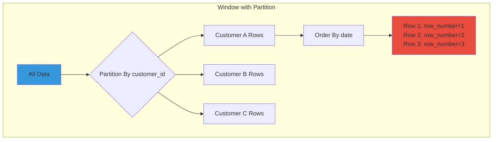
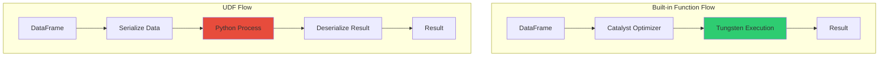

*Mastering Window Functions, UDFs, and Null Handling for Robust Data Pipelines*

**Part 3 of 5 in the Complete PySpark Series**

## Table of Contents

1. [Window Functions](#window-functions)
2. [User Defined Functions (UDFs)](#user-defined-functions-udfs)
3. [Null Handling & Three-Valued Logic](#null-handling--three-valued-logic)

In this article, we'll explore advanced analytical patterns in PySpark, including window functions for sophisticated time-series and ranking calculations, user-defined functions (UDFs) for custom business logic, and proper null handling to ensure correct results.

## Window Functions

Window functions perform calculations across rows related to the current row. They're essential for advanced analytics like ranking, running totals, and moving averages.

### Understanding Windows

A window defines a frame of rows for each input row. The frame can be defined by partitioning and ordering.




### Window Creation

#### Window.partitionBy(), Window.orderBy()

**Purpose**: Define window specification.

**How it works**: `partitionBy` divides data into groups; `orderBy` defines order within each partition.

```python
from pyspark.sql.window import Window
from pyspark.sql import functions as F

# Basic window
window = Window.partitionBy("customer_id").orderBy("order_date")

# Multiple partition columns
window = Window.partitionBy("country", "region").orderBy(F.desc("amount"))

# Multiple order columns
window = Window.partitionBy("customer_id").orderBy("year", F.desc("month"))
```


### Window Frames

#### Window.rowsBetween(), Window.rangeBetween()

**Purpose**: Define the frame within the window.

**How it works**:

- **rowsBetween**: Physical rows (row-based frame)
- **rangeBetween**: Logical range (value-based frame)

```python
# Rows from 2 preceding to current
window = Window.partitionBy("customer_id") \
    .orderBy("date") \
    .rowsBetween(-2, 0)

# Unbounded window (all rows in partition)
window = Window.partitionBy("customer_id") \
    .orderBy("date") \
    .rowsBetween(Window.unboundedPreceding, Window.unboundedFollowing)

# Rolling window (preceding and following)
window = Window.partitionBy("customer_id") \
    .orderBy("date") \
    .rowsBetween(-7, 0)  # Last 7 rows including current
```

**Note on Window.currentRow**:
`Window.currentRow` is a sentinel used when defining row-based frames. It represents the current row in the ordered partition and is commonly used with `rowsBetween`. For example, `rowsBetween(Window.currentRow, Window.unboundedFollowing)` creates a frame from the current row to the end, while `rowsBetween(Window.currentRow, Window.currentRow)` restricts the frame to only the current row (equivalent to a 0-offset frame).

### Ranking Functions

#### F.row_number()

**Purpose**: Assign sequential number within partition.

```python
window = Window.partitionBy("customer_id").orderBy(F.desc("order_date"))

df.withColumn("order_number", F.row_number().over(window))
```

**Real-world example - Latest order per customer**:

```python
# Get most recent order for each customer
window = Window.partitionBy("customer_id").orderBy(F.desc("order_date"))

latest_orders = orders \
    .withColumn("row_num", F.row_number().over(window)) \
    .filter(F.col("row_num") == 1) \
    .drop("row_num")
```


#### F.rank(), F.dense_rank()

**Purpose**: Rank with gaps vs without gaps for ties.

```python
window = Window.partitionBy("category").orderBy(F.desc("sales"))

df.withColumn("rank", F.rank().over(window))  # 1,2,2,4 (gap after tie)
df.withColumn("dense_rank", F.dense_rank().over(window))  # 1,2,2,3 (no gap)
```


#### F.percent_rank()

**Purpose**: Relative rank as percentage.

```python
window = Window.partitionBy("region").orderBy("sales")

df.withColumn("percentile", F.percent_rank().over(window))
```


### Analytic Functions

#### F.lag(), F.lead()

**Purpose**: Access previous/next row values.

**How it works**: Looks up value N rows before/after current row in window.

```python
window = Window.partitionBy("customer_id").orderBy("order_date")

# Previous order amount
df.withColumn("previous_amount", F.lag("amount", 1).over(window))

# Next order amount
df.withColumn("next_amount", F.lead("amount", 1).over(window))

# With default value
df.withColumn("previous_amount", F.lag("amount", 1, 0).over(window))
```

**Real-world example - Change detection**:

```python
# Calculate change from previous period
window = Window.partitionBy("product_id").orderBy("date")

price_changes = prices \
    .withColumn("previous_price", F.lag("price", 1).over(window)) \
    .withColumn(
        "price_change",
        F.col("price") - F.col("previous_price")
    ) \
    .withColumn(
        "price_change_pct",
        ((F.col("price") - F.col("previous_price")) / F.col("previous_price")) * 100
    ) \
    .filter(F.col("previous_price").isNotNull())
```


### Aggregate Functions Over Windows

You can apply aggregates over windows for running totals, moving averages, etc.

```python
window = Window.partitionBy("customer_id") \
    .orderBy("order_date") \
    .rowsBetween(Window.unboundedPreceding, Window.currentRow)

# Running total
df.withColumn("running_total", F.sum("amount").over(window))

# Cumulative count
df.withColumn("order_count", F.count("*").over(window))

# Running average
df.withColumn("avg_to_date", F.avg("amount").over(window))
```

**Real-world example - Customer lifetime value (CLV)**:

```python
# Calculate running totals and averages per customer
window_unbounded = Window.partitionBy("customer_id") \
    .orderBy("order_date") \
    .rowsBetween(Window.unboundedPreceding, Window.currentRow)

window_last_3 = Window.partitionBy("customer_id") \
    .orderBy("order_date") \
    .rowsBetween(-2, 0)

customer_metrics = orders \
    .withColumn("order_number", F.row_number().over(window_unbounded)) \
    .withColumn("total_spent", F.sum("amount").over(window_unbounded)) \
    .withColumn("avg_order_value", F.avg("amount").over(window_unbounded)) \
    .withColumn("last_3_avg", F.avg("amount").over(window_last_3)) \
    .withColumn(
        "trend",
        F.when(F.col("last_3_avg") > F.col("avg_order_value"), "Increasing")
         .otherwise("Decreasing")
    )
```


### Moving Averages

**Real-world example - 7-day moving average**:

```python
# Stock price moving average
window_7day = Window.partitionBy("ticker") \
    .orderBy("date") \
    .rowsBetween(-6, 0)  # Current + 6 previous = 7 days

stock_analysis = stock_prices \
    .withColumn("ma_7", F.avg("close_price").over(window_7day)) \
    .withColumn("volume_7", F.sum("volume").over(window_7day)) \
    .withColumn(
        "signal",
        F.when(F.col("close_price") > F.col("ma_7"), "BUY")
         .when(F.col("close_price") < F.col("ma_7"), "SELL")
         .otherwise("HOLD")
    )
```


## User Defined Functions (UDFs)

UDFs allow you to write custom Python functions to process DataFrame columns.

### Understanding UDFs

**When to use UDFs**:

- No built-in function exists for your logic
- Complex business logic that's hard to express with built-in functions

**When to avoid UDFs**:

- Built-in functions can do the job (they're much faster)
- Performance is critical (UDFs break Catalyst optimizer)


### UDF Performance



**How UDFs work internally**:

1. Data is serialized from JVM to Python process
2. Python function executes row-by-row
3. Results are deserialized back to JVM
4. This is much slower than built-in functions which execute in JVM

### Creating UDFs

```python
from pyspark.sql.functions import udf
from pyspark.sql.types import StringType, IntegerType

# Method 1: Decorator
@udf(returnType=StringType())
def extract_domain(email):
    if email and "@" in email:
        return email.split("@")[^1]
    return None

df.withColumn("domain", extract_domain(F.col("email")))

# Method 2: Function call
def calculate_age(birth_year):
    from datetime import datetime
    return datetime.now().year - birth_year

age_udf = udf(calculate_age, IntegerType())
df.withColumn("age", age_udf(F.col("birth_year")))

# Method 3: Lambda
upper_udf = udf(lambda x: x.upper() if x else None, StringType())
df.withColumn("name_upper", upper_udf(F.col("name")))
```


### Pandas UDFs (Vectorized UDFs)

Much faster than regular UDFs - processes batches using pandas.

```python
from pyspark.sql.functions import pandas_udf
import pandas as pd

# Pandas UDF (much faster!)
@pandas_udf(StringType())
def extract_domain_pandas(email_series: pd.Series) -> pd.Series:
    return email_series.str.split("@").str[^1]

df.withColumn("domain", extract_domain_pandas(F.col("email")))
```


### Real-world UDF Examples

**Example - Complex validation**:

```python
@udf(returnType=StringType())
def validate_credit_card(card_number):
    """Luhn algorithm for credit card validation"""
    if not card_number:
        return "Invalid"
    
    digits = [int(d) for d in str(card_number) if d.isdigit()]
    checksum = 0
    
    for i, digit in enumerate(reversed(digits)):
        if i % 2 == 1:
            digit *= 2
            if digit > 9:
                digit -= 9
        checksum += digit
    
    return "Valid" if checksum % 10 == 0 else "Invalid"

transactions.withColumn(
    "card_status",
    validate_credit_card(F.col("card_number"))
)
```

## Null Handling & Three-Valued Logic

SQL uses **three-valued logic**: TRUE, FALSE, and NULL. Understanding null propagation is critical for correct results.

### Null Propagation Rules

```python
# Rule 1: ANY comparison with NULL returns NULL (not FALSE)
from pyspark.sql import functions as F

df = spark.createDataFrame([(1, None), (2, 10)], ["id", "value"])

# This DOESN'T filter out nulls as you might expect
result1 = df.filter(F.col("value") > 5)  # Returns only (2, 10)
# NULL > 5 = NULL, which is NOT TRUE, so filtered out

# Rule 2: NULL in boolean context is FALSE
result2 = df.filter(F.col("value") > 5 | (F.col("id") == 1))
# For (1, None): (NULL) | TRUE = TRUE ✓ included
# For (2, 10): (TRUE) | FALSE = TRUE ✓ included

# Rule 3: NOT NULL behavior
result3 = df.filter(~(F.col("value") > 5))
# For (1, None): ~(NULL) = NULL ✓ NOT included
# For (2, 10): ~(TRUE) = FALSE ✗ NOT included

# Rule 4: IS NULL vs comparison
# Correct: Use IS NULL
result4 = df.filter(F.col("value").isNull())  # Returns (1, None)

# Wrong: This never matches NULL
result5 = df.filter(F.col("value") == None)  # Returns nothing!
```


### Null Propagation in Expressions

```python
# Arithmetic with NULL always returns NULL
df = spark.createDataFrame([(1, 10), (2, None)], ["id", "amount"])

result = df.withColumn(
    "doubled",
    F.col("amount") * 2
)
# Output: (1, 20), (2, NULL)

# String concatenation with NULL
result2 = df.withColumn(
    "formatted",
    F.concat(F.lit("Amount: "), F.col("amount"))
)
# Output: (1, "Amount: 10"), (2, NULL)  # Not "Amount: null"!

# Use concat_ws for null-safe concatenation
result3 = df.withColumn(
    "safe_concat",
    F.concat_ws("|", F.col("id"), F.col("amount"))
)
# Output: (1, "1|10"), (2, "2")  # Nulls are skipped
```


### Null Handling Functions

```python
# COALESCE: Return first non-null value
df = spark.createDataFrame([
    ("C1", None, "backup1", None),
    ("C2", "primary", "backup2", "default")
], ["id", "col1", "col2", "col3"])

result = df.withColumn(
    "value",
    F.coalesce(F.col("col1"), F.col("col2"), F.col("col3"), F.lit("UNKNOWN"))
)
# Output: (C1, "backup1"), (C2, "primary")

# IFNULL / NVL: Replace null with value
result2 = df.withColumn(
    "col1_filled",
    F.when(F.col("col1").isNull(), F.lit("N/A")).otherwise(F.col("col1"))
)

# NULLIF: Return null if equal
df2 = spark.createDataFrame([(1, 1), (2, 3)], ["a", "b"])
result3 = df2.withColumn(
    "nullif_result",
    F.when(F.col("a") == F.col("b"), F.lit(None)).otherwise(F.col("a"))
)
```


### Grouping with NULLs

```python
# Important: NULL is treated as a distinct group value
df = spark.createDataFrame([
    ("Category", 100),
    ("Category", None),
    (None, 50),
    (None, 75)
], ["category", "amount"])

result = df.groupBy("category").agg(F.sum("amount"))
# Output:
# "Category" -> 100 (NULL in amount is ignored)
# NULL -> 125 (NULL category gets its own group!)

# To exclude NULL group:
result2 = df.filter(F.col("category").isNotNull()) \
    .groupBy("category") \
    .agg(F.sum("amount"))
```


### Null in JOIN Conditions

```python
# CRITICAL: JOIN conditions with NULLs never match!
df1 = spark.createDataFrame([("C1", 10), ("C2", None)], ["id", "val1"])
df2 = spark.createDataFrame([("C1", 20), (None, 30)], ["id", "val2"])

result = df1.join(df2, "id")
# Output: Only ("C1", 10, 20)
# - ("C2", None) doesn't join with (None, 30) because NULL != NULL!

# To handle NULL joins, use this pattern:
result2 = df1.join(
    df2,
    (df1.id == df2.id) | (df1.id.isNull() & df2.id.isNull()),
    "inner"
)
# Now NULL matches NULL: ("C2", None, None), but also includes NULL match
```


### Best Practices for Null Handling

```python
# 1. Be explicit about null handling in joins
result = df1.join(
    df2.withColumn("id", F.coalesce(F.col("id"), F.lit("UNKNOWN"))),
    "id"
)

# 2. Document expected nulls in schema
from pyspark.sql.types import StructType, StructField, StringType, IntegerType

schema = StructType([
    StructField("id", StringType(), nullable=False),
    StructField("optional_field", StringType(), nullable=True),
    StructField("amount", IntegerType(), nullable=False)
])

# 3. Validate null counts
null_counts = df.select([
    F.count(F.when(F.col(c).isNull(), 1)).alias(f"{c}_nulls") 
    for c in df.columns
])
null_counts.show()
```

## Where This Fits in the Series

You've now mastered advanced analytical patterns in PySpark. Article 3 covered window functions for sophisticated time-series and ranking calculations, UDFs for custom business logic, and proper null handling to ensure correct results.

In the next article, we'll explore Delta Lake for ACID transactions and Structured Streaming for real-time data processing.

**Continue to Article 4**: [Delta Lake & Streaming](/posts/pyspark-learning-4/) 

**Previous article**: [Article 2](/posts/pyspark-learning-2/) - DataFrame Operations & Transformations

**Related articles in this series**:

- [Article 1](/posts/pyspark-learning-1/) - PySpark Fundamentals
- [Article 5](/posts/pyspark-learning-5/) - Performance, Testing & Production Best Practices
