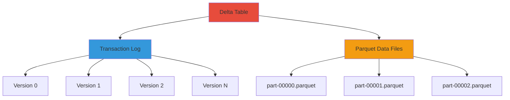
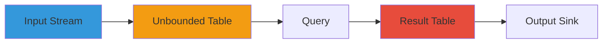

**Part 4 of 5 in the Complete PySpark Series**: *Building ACID-compliant data lakes and real-time streaming pipelines*

## Table of Contents

1. [Delta Lake Operations](#delta-lake-operations)
2. [Structured Streaming](#structured-streaming)


In the previous article, we explored advanced analytical patterns in PySpark, including window functions, user-defined functions (UDFs), and null handling. In this article, we'll dive into Delta Lake for building reliable, ACID-compliant data lakes, and Structured Streaming for processing real-time data streams using PySpark.

## Delta Lake Operations

Delta Lake is an open-source storage layer that brings ACID transactions to Apache Spark and big data workloads. It enables reliable data lakes with features like time travel, schema enforcement, and upserts.

### What is Delta Lake?

Delta Lake provides:

- **ACID Transactions**: Multiple readers/writers can safely access data concurrently
- **Time Travel**: Query historical versions of data
- **Schema Evolution & Enforcement**: Prevent bad writes, evolve schema over time
- **Unified Batch & Streaming**: Same API for both processing modes
- **Upserts & Deletes**: MERGE operations for incremental updates
- **Audit History**: Complete record of all changes




### Reading Delta Tables

#### spark.read.format("delta")

**Purpose**: Read Delta tables into DataFrames.

```python
# Read from path
df = spark.read.format("delta").load("/data/delta/customers")

# Read from table
df = spark.table("catalog.schema.customers")

# Read with Delta-specific options
df = spark.read \
    .format("delta") \
    .option("ignoreChanges", "true") \
    .load("/data/delta/customers")
```


#### DeltaTable.forPath() / DeltaTable.forName()

**Purpose**: Load Delta table as DeltaTable object for advanced operations.

```python
from delta.tables import DeltaTable

# From path
delta_table = DeltaTable.forPath(spark, "/data/delta/customers")

# From table name
delta_table = DeltaTable.forName(spark, "catalog.schema.customers")

# Convert to DataFrame
df = delta_table.toDF()
```


### Writing Delta Tables

```python
# Overwrite entire table
df.write \
    .format("delta") \
    .mode("overwrite") \
    .save("/data/delta/customers")

# Append new data
df.write \
    .format("delta") \
    .mode("append") \
    .save("/data/delta/customers")

# Save as managed table
df.write \
    .format("delta") \
    .mode("overwrite") \
    .saveAsTable("catalog.schema.customers")

# Partitioned write
df.write \
    .format("delta") \
    .partitionBy("country", "year") \
    .mode("overwrite") \
    .save("/data/delta/customers")
```


### MERGE Operations (Upsert)

**Purpose**: Atomic updates and inserts based on matching conditions.

**How it works**: Delta MERGE reads both source and target, identifies matches, and atomically applies updates/inserts/deletes.

```python
from delta.tables import DeltaTable
from pyspark.sql import functions as F

# Load target Delta table
delta_table = DeltaTable.forPath(spark, "/data/delta/customers")

# Source data with updates/new records
updates_df = spark.read.parquet("/data/staging/customer_updates")

# Perform merge
delta_table.alias("target").merge(
    updates_df.alias("source"),
    "target.customer_id = source.customer_id"
).whenMatchedUpdate(set={
    "name": "source.name",
    "email": "source.email",
    "updated_at": "source.updated_at"
}).whenNotMatchedInsert(values={
    "customer_id": "source.customer_id",
    "name": "source.name",
    "email": "source.email",
    "created_at": "source.created_at",
    "updated_at": "source.updated_at"
}).execute()
```

**Real-world example - Incremental customer data load**:

```python
from delta.tables import DeltaTable
from pyspark.sql import functions as F
from pyspark.sql.window import Window

# Target Delta table
target_path = "/data/warehouse/customers"
delta_table = DeltaTable.forPath(spark, target_path)

# Read staging data
staging_df = spark.read.parquet("/data/staging/customers")

# Deduplicate staging data (keep latest per customer_id)
window = Window.partitionBy("customer_id").orderBy(F.col("updated_at").desc())
staging_deduped = staging_df \
    .withColumn("row_num", F.row_number().over(window)) \
    .filter(F.col("row_num") == 1) \
    .drop("row_num")

# Perform upsert with explicit column mapping
delta_table.alias("t").merge(
    staging_deduped.alias("s"),
    "t.customer_id = s.customer_id"
).whenMatchedUpdate(set={
    "name": "s.name",
    "email": "s.email",
    "phone": "s.phone",
    "updated_at": "s.updated_at"
}).whenNotMatchedInsert(values={
    "customer_id": "s.customer_id",
    "name": "s.name",
    "email": "s.email",
    "phone": "s.phone",
    "created_at": "s.created_at",
    "updated_at": "s.updated_at"
}).execute()
```

**Advanced MERGE with conditional logic**:

```python
# Merge with delete condition
delta_table.alias("t").merge(
    updates_df.alias("s"),
    "t.customer_id = s.customer_id"
).whenMatchedUpdate(
    condition="s.status = 'active'",
    set={
        "name": "s.name",
        "email": "s.email",
        "updated_at": "s.updated_at"
    }
).whenMatchedDelete(
    condition="s.status = 'deleted'"
).whenNotMatchedInsert(
    condition="s.status = 'active'",
    values={
        "customer_id": "s.customer_id",
        "name": "s.name",
        "email": "s.email",
        "created_at": "s.created_at"
    }
).execute()
```


### Time Travel

**Purpose**: Query historical versions of Delta tables.

**How it works**: Delta maintains a transaction log of all changes; you can query any previous version.

```python
# Query specific version
df_v5 = spark.read \
    .format("delta") \
    .option("versionAsOf", 5) \
    .load("/data/delta/customers")

# Query as of timestamp
df_yesterday = spark.read \
    .format("delta") \
    .option("timestampAsOf", "2024-01-03") \
    .load("/data/delta/customers")

# More specific timestamp
df_specific = spark.read \
    .format("delta") \
    .option("timestampAsOf", "2024-01-03 10:30:00") \
    .load("/data/delta/customers")
```

**Real-world example - Recover accidentally deleted data**:

```python
# Current data (after accidental deletion)
current_df = spark.read.format("delta").load("/data/delta/customers")

# Data from yesterday (before deletion)
yesterday_df = spark.read \
    .format("delta") \
    .option("timestampAsOf", "2024-01-02") \
    .load("/data/delta/customers")

# Find deleted records
deleted_records = yesterday_df.join(
    current_df,
    "customer_id",
    "left_anti"  # Records in yesterday but not in current
)

print(f"Found {deleted_records.count()} deleted records")

# Restore deleted records
from delta.tables import DeltaTable

delta_table = DeltaTable.forPath(spark, "/data/delta/customers")
delta_table.alias("t").merge(
    deleted_records.alias("s"),
    "t.customer_id = s.customer_id"
).whenNotMatchedInsertAll().execute()
```


### Table History & Versioning

**Purpose**: View complete history of table changes.

```python
from delta.tables import DeltaTable

delta_table = DeltaTable.forPath(spark, "/data/delta/customers")

# Get full history
history_df = delta_table.history()

# View key information
history_df.select(
    "version",
    "timestamp",
    "operation",
    "operationParameters",
    "operationMetrics"
).show(truncate=False)

# Filter history
recent_merges = history_df \
    .filter(F.col("operation") == "MERGE") \
    .orderBy(F.desc("timestamp")) \
    .limit(10)
```


### Schema Evolution

**Purpose**: Handle schema changes over time.

```python
# Strict schema enforcement (default)
df_new.write \
    .format("delta") \
    .mode("append") \
    .save("/data/delta/customers")
# Fails if schema doesn't match exactly

# Allow schema evolution
spark.conf.set("spark.databricks.delta.schema.autoMerge.enabled", "true")

df_with_new_columns.write \
    .format("delta") \
    .option("mergeSchema", "true") \
    .mode("append") \
    .save("/data/delta/customers")
# Adds new columns, existing records have NULL for new columns
```


### Change Data Feed (CDC)

**Purpose**: Track changes (inserts, updates, deletes) for downstream consumers.

**How it works**: When enabled, Delta records change events with metadata about the type of change.

```python
# Enable change data feed
spark.sql("""
    ALTER TABLE catalog.schema.customers
    SET TBLPROPERTIES (delta.enableChangeDataFeed = true)
""")

# Read changes between versions
changes_df = spark.read \
    .format("delta") \
    .option("readChangeFeed", "true") \
    .option("startingVersion", 10) \
    .option("endingVersion", 20) \
    .load("/data/delta/customers")

# Columns in changes_df:
# - All original columns
# - _change_type: 'insert', 'update_preimage', 'update_postimage', 'delete'
# - _commit_version: Version number
# - _commit_timestamp: When change occurred

# Filter for specific change types
inserts = changes_df.filter(F.col("_change_type") == "insert")
updates = changes_df.filter(F.col("_change_type").isin("update_preimage", "update_postimage"))
deletes = changes_df.filter(F.col("_change_type") == "delete")
```

**Real-world example - Audit log**:

```python
# Track all customer changes in the last 24 hours
from datetime import datetime, timedelta

yesterday = (datetime.now() - timedelta(days=1)).strftime("%Y-%m-%d %H:%M:%S")

changes = spark.read \
    .format("delta") \
    .option("readChangeFeed", "true") \
    .option("startingTimestamp", yesterday) \
    .load("/data/delta/customers")

# Analyze changes
change_summary = changes.groupBy("_change_type").count()
change_summary.show()

# Find customers with suspicious update frequency
suspicious = changes \
    .filter(F.col("_change_type").contains("update")) \
    .groupBy("customer_id") \
    .agg(F.count("*").alias("update_count")) \
    .filter(F.col("update_count") > 10) \
    .orderBy(F.desc("update_count"))
```


### OPTIMIZE & VACUUM

#### OPTIMIZE

**Purpose**: Compact small files into larger ones for better query performance.

**How it works**: Reads small files, combines them into larger files, updates transaction log.

```python
from delta.tables import DeltaTable

delta_table = DeltaTable.forPath(spark, "/data/delta/customers")

# Basic optimize
delta_table.optimize().executeCompaction()

# Optimize with Z-ordering (co-locate related data)
delta_table.optimize().executeZOrderBy("country", "city")

# Using SQL
spark.sql("OPTIMIZE '/data/delta/customers'")
spark.sql("OPTIMIZE '/data/delta/customers' ZORDER BY (country, city)")
```


#### VACUUM

**Purpose**: Remove old data files that are no longer referenced.

**How it works**: Deletes files older than retention period that aren't needed for time travel.

```python
from delta.tables import DeltaTable

delta_table = DeltaTable.forPath(spark, "/data/delta/customers")

# Vacuum old files (default 7 days retention)
delta_table.vacuum()

# Custom retention period (hours)
delta_table.vacuum(retentionHours=168)  # 7 days

# Using SQL
spark.sql("VACUUM '/data/delta/customers' RETAIN 168 HOURS")

# Dry run to see what would be deleted
spark.sql("VACUUM '/data/delta/customers' RETAIN 168 HOURS DRY RUN")
```

**Warning**: Don't vacuum too aggressively if you need time travel capabilities.


## Structured Streaming

Structured Streaming provides a high-level API for stream processing using DataFrames and SQL.

### Streaming Concepts

Structured Streaming treats a data stream as an unbounded table that grows continuously. You write queries the same way as batch processing, and Spark handles incremental execution.




### Reading Streams

#### Kafka Source

**Purpose**: Read streaming data from Apache Kafka.

```python
from pyspark.sql import functions as F
from pyspark.sql.types import StructType, StructField, StringType, IntegerType, TimestampType

# Read from Kafka
kafka_df = spark.readStream \
    .format("kafka") \
    .option("kafka.bootstrap.servers", "localhost:9092") \
    .option("subscribe", "events") \
    .option("startingOffsets", "latest") \
    .load()

# Kafka schema: key (binary), value (binary), topic, partition, offset, timestamp

# Parse JSON from value column
schema = StructType([
    StructField("user_id", StringType()),
    StructField("event_type", StringType()),
    StructField("amount", IntegerType()),
    StructField("timestamp", TimestampType())
])

parsed_df = kafka_df.select(
    F.from_json(F.col("value").cast("string"), schema).alias("data")
).select("data.*")
```


#### File Source

**Purpose**: Monitor directory for new files.

```python
# CSV stream
csv_stream = spark.readStream \
    .schema("user_id STRING, amount DOUBLE, timestamp TIMESTAMP") \
    .option("maxFilesPerTrigger", 10) \
    .csv("/data/stream/input/")

# JSON stream
json_stream = spark.readStream \
    .schema("user_id STRING, event_type STRING, amount DOUBLE") \
    .json("/data/stream/events/")

# Parquet stream
parquet_stream = spark.readStream \
    .schema("user_id STRING, amount DOUBLE") \
    .parquet("/data/stream/parquet/")
```


#### Delta Source

**Purpose**: Stream from Delta table (CDC pattern).

```python
# Stream all data from Delta table
delta_stream = spark.readStream \
    .format("delta") \
    .load("/data/delta/events")

# Stream only changes (CDC)
delta_changes = spark.readStream \
    .format("delta") \
    .option("readChangeFeed", "true") \
    .option("startingVersion", 10) \
    .load("/data/delta/customers")
```


#### Socket Source (for testing)

```python
# Read from network socket (testing only!)
socket_stream = spark.readStream \
    .format("socket") \
    .option("host", "localhost") \
    .option("port", 9999) \
    .load()
```


### Stream Transformations

Most DataFrame operations work on streams:

#### Stateless Operations

```python
# Select, filter, withColumn work as normal
stream = parsed_df \
    .filter(F.col("amount") > 100) \
    .withColumn("amount_doubled", F.col("amount") * 2) \
    .select("user_id", "amount", "timestamp")
```


#### Aggregations with Windows

**Purpose**: Aggregate data over time windows.

```python
from pyspark.sql.functions import window

# Tumbling window (non-overlapping)
windowed = parsed_df \
    .groupBy(
        window(F.col("timestamp"), "10 minutes"),
        F.col("user_id")
    ) \
    .agg(
        F.sum("amount").alias("total_amount"),
        F.count("*").alias("event_count")
    )

# Sliding window (overlapping)
sliding = parsed_df \
    .groupBy(
        window(F.col("timestamp"), "10 minutes", "5 minutes"),
        F.col("user_id")
    ) \
    .agg(F.sum("amount").alias("total_amount"))
```


#### Watermarking

**Purpose**: Handle late-arriving data.

**How it works**: Defines how long to wait for late data before finalizing a window.

```python
# Allow 10 minutes of late data
windowed_with_watermark = parsed_df \
    .withWatermark("timestamp", "10 minutes") \
    .groupBy(
        window(F.col("timestamp"), "5 minutes"),
        F.col("user_id")
    ) \
    .agg(F.sum("amount").alias("total"))
```


### Joins in Streaming

#### Stream-Static Join

```python
# Static reference data
users_static = spark.read.parquet("/data/users")

# Join stream with static
enriched = parsed_df.join(users_static, "user_id")
```


#### Stream-Stream Join

**Purpose**: Join two streams.

**Requires**: Watermarking on both sides.

```python
# Two streams
stream1 = spark.readStream \
    .format("kafka") \
    .option("subscribe", "events1") \
    .load()

stream2 = spark.readStream \
    .format("kafka") \
    .option("subscribe", "events2") \
    .load()

# Both need watermarks for stream-stream join
joined = stream1 \
    .withWatermark("timestamp", "10 minutes") \
    .join(
        stream2.withWatermark("timestamp", "10 minutes"),
        "user_id"
    )
```


### Writing Streams

#### Console Sink (for debugging)

```python
query = parsed_df.writeStream \
    .format("console") \
    .outputMode("append") \
    .option("truncate", "false") \
    .start()

query.awaitTermination()
```


#### Delta Sink (ACID streaming writes)

**Purpose**: Write to Delta table with exactly-once semantics.

```python
query = parsed_df.writeStream \
    .format("delta") \
    .outputMode("append") \
    .option("checkpointLocation", "/checkpoint/events") \
    .start("/data/delta/events")

# To table
query = parsed_df.writeStream \
    .format("delta") \
    .outputMode("append") \
    .option("checkpointLocation", "/checkpoint/events") \
    .toTable("catalog.schema.events")
```


#### Kafka Sink

```python
# Convert to Kafka format (key-value)
kafka_output = parsed_df.select(
    F.col("user_id").alias("key"),
    F.to_json(F.struct("*")).alias("value")
)

query = kafka_output.writeStream \
    .format("kafka") \
    .option("kafka.bootstrap.servers", "localhost:9092") \
    .option("topic", "output") \
    .option("checkpointLocation", "/checkpoint/kafka_output") \
    .start()
```


#### File Sink

```python
query = parsed_df.writeStream \
    .format("parquet") \
    .option("path", "/data/output/") \
    .option("checkpointLocation", "/checkpoint/file_output") \
    .start()
```


#### foreach & foreachBatch

**Purpose**: Custom output logic.

```python
# foreachBatch: Process each micro-batch
def process_batch(batch_df, batch_id):
    print(f"Processing batch {batch_id}")
    batch_df.write.jdbc(url, table, properties)

query = parsed_df.writeStream \
    .foreachBatch(process_batch) \
    .option("checkpointLocation", "/checkpoint/custom") \
    .start()

# foreach: Process each row
def process_row(row):
    # Send to external system
    send_to_api(row)

query = parsed_df.writeStream \
    .foreach(process_row) \
    .start()
```

**Real-world example - Streaming upserts to Delta**:

```python
from delta.tables import DeltaTable
from pyspark.sql.window import Window

def upsert_to_delta(batch_df, batch_id):
    """Upsert batch into Delta table"""
    
    # Deduplicate batch
    window = Window.partitionBy("user_id").orderBy(F.col("timestamp").desc())
    deduped = batch_df \
        .withColumn("row_num", F.row_number().over(window)) \
        .filter(F.col("row_num") == 1) \
        .drop("row_num")
    
    # Load target Delta table
    delta_table = DeltaTable.forPath(spark, "/data/delta/user_activity")
    
    # Merge
    delta_table.alias("t").merge(
        deduped.alias("s"),
        "t.user_id = s.user_id"
    ).whenMatchedUpdateAll() \
     .whenNotMatchedInsertAll() \
     .execute()

# Stream with upserts
query = parsed_df.writeStream \
    .foreachBatch(upsert_to_delta) \
    .option("checkpointLocation", "/checkpoint/upserts") \
    .start()
```


### Output Modes

- **append**: Only new rows added (default for most cases)
- **complete**: Entire result table rewritten (for aggregations)
- **update**: Only updated rows (for aggregations with watermark)

```python
# Append mode (default)
query = df.writeStream \
    .format("delta") \
    .outputMode("append") \
    .start("/data/output")

# Complete mode (entire result)
query = aggregated_df.writeStream \
    .format("console") \
    .outputMode("complete") \
    .start()

# Update mode (only changes)
query = aggregated_df.writeStream \
    .format("delta") \
    .outputMode("update") \
    .start("/data/output")
```


### Triggers

**Purpose**: Control micro-batch frequency.

```python
# Default: Process as soon as previous batch completes
query = df.writeStream.trigger(processingTime="0 seconds").start()

# Fixed interval
query = df.writeStream.trigger(processingTime="30 seconds").start()

# Once (for testing/backfilling)
query = df.writeStream.trigger(once=True).start()

# Available-now (process all available data, then stop)
query = df.writeStream.trigger(availableNow=True).start()

# Continuous (experimental, low-latency)
query = df.writeStream.trigger(continuous="1 second").start()
```


### Checkpointing & Fault Tolerance

**Purpose**: Ensure exactly-once processing and recovery from failures.

**How it works**: Spark stores offsets and state in checkpoint directory; on restart, picks up from last committed offset.

```python
query = parsed_df.writeStream \
    .format("delta") \
    .option("checkpointLocation", "/checkpoint/my_stream") \
    .start("/data/output")

# Checkpoint must be unique per query
# Never reuse checkpoints across different queries
```


### Monitoring Streams

```python
# Get query status
print(query.status)
# Output: {'message': 'Processing new data', 'isDataAvailable': True, ...}

# Recent progress
print(query.recentProgress)
# Shows last few micro-batches: input rate, processing time, etc.

# Last progress
print(query.lastProgress)

# Stop query gracefully
query.stop()

# Wait for termination
query.awaitTermination()

# Wait with timeout
query.awaitTermination(timeout=60)  # seconds
```


### Real-world Example: Real-time User Analytics

```python
from pyspark.sql import functions as F
from pyspark.sql.types import StructType, StructField, StringType, DoubleType, TimestampType

# Define schema
schema = StructType([
    StructField("user_id", StringType()),
    StructField("event_type", StringType()),
    StructField("amount", DoubleType()),
    StructField("timestamp", TimestampType())
])

# Read from Kafka
events = spark.readStream \
    .format("kafka") \
    .option("kafka.bootstrap.servers", "kafka:9092") \
    .option("subscribe", "user-events") \
    .option("startingOffsets", "latest") \
    .load()

# Parse JSON
parsed = events.select(
    F.from_json(F.col("value").cast("string"), schema).alias("data")
).select("data.*")

# Real-time aggregations
from pyspark.sql.functions import window

metrics = parsed \
    .withWatermark("timestamp", "5 minutes") \
    .groupBy(
        window(F.col("timestamp"), "1 minute", "30 seconds"),
        F.col("user_id"),
        F.col("event_type")
    ) \
    .agg(
        F.sum("amount").alias("total_amount"),
        F.count("*").alias("event_count"),
        F.avg("amount").alias("avg_amount")
    )

# Write to Delta for dashboard
query = metrics.writeStream \
    .format("delta") \
    .outputMode("append") \
    .option("checkpointLocation", "/checkpoint/user_metrics") \
    .start("/data/delta/user_metrics")

# Monitor
print(f"Query ID: {query.id}")
print(f"Status: {query.status}")

# Keep running
query.awaitTermination()
```

## What is Next in the Series

You've now mastered Delta Lake for ACID transactions, time travel, and upserts, plus Structured Streaming for building real-time data pipelines. Article 4 covered Delta Lake operations including merge/upsert patterns, CDC, optimization, and comprehensive Structured Streaming patterns for Kafka, file, and Delta sources.

In the next article, we'll explore testing strategies, performance optimization, error handling, and production best practices.

**Continue to Article 5**: [Testing, Performance & Production Best Practices](/posts/pyspark-learning-5/)

**Previous article**: [Article 3 - Window Functions, UDFs & Null Handling](/posts/pyspark-learning-3/)

**Related articles in this series**:

- [Article 1: PySpark Fundamentals](/posts/pyspark-learning-1/)
- [Article 2: DataFrame Operations & Transformations](/posts/pyspark-learning-2/)
