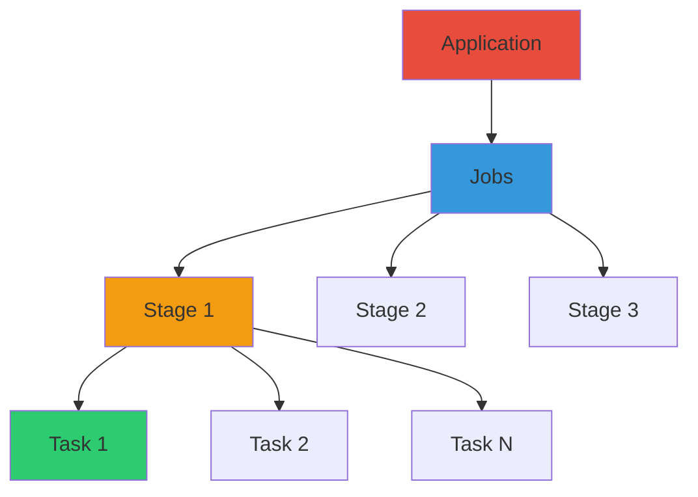

**Part 5 of 5 in the Complete PySpark Series**: *Building reliable, optimized, and production-ready data pipelines*

## Table of Contents

1. [Testing PySpark Applications](#testing-pyspark-applications)
2. [Error Handling & Debugging](#error-handling--debugging)
3. [Performance & Optimization](#performance--optimization)
4. [Catalyst Optimizer & Query Execution](#catalyst-optimizer--query-execution)
5. [Practical Patterns](#practical-patterns)
6. [Best Practices](#best-practices)

In this final article of the series, we'll cover essential practices for testing, debugging, and optimizing PySpark applications to ensure they are production-ready. We'll explore unit testing strategies, common error patterns, performance tuning techniques, and practical data engineering patterns for building robust data pipelines.

## Testing PySpark Applications

Well-tested PySpark code catches data-quality regressions early and makes refactoring safe. In this section, we'll cover unit testing strategies using `pytest`, writing test cases for transformations, and best practices for testing PySpark code.

### Unit Testing with pytest

#### Setting up pytest for PySpark

```python
# conftest.py - pytest configuration
import pytest
from pyspark.sql import SparkSession

@pytest.fixture(scope="session")
def spark():
    """Create Spark session for tests"""
    spark = SparkSession.builder \
        .appName("testing") \
        .master("local[*]") \
        .getOrCreate()
    yield spark
    spark.stop()

@pytest.fixture
def sample_data(spark):
    """Create sample data for testing"""
    data = [
        ("C001", "John", 100),
        ("C002", "Jane", 200),
        ("C003", "Bob", 150)
    ]
    df = spark.createDataFrame(data, ["customer_id", "name", "amount"])
    return df
```


#### Writing Test Cases

```python
# test_transformations.py
import pytest
from pyspark.sql import functions as F

def test_filter_transformation(spark, sample_data):
    """Test filtering customers with amount > 100"""
    df = sample_data
    result = df.filter(F.col("amount") > 100)
    
    assert result.count() == 2  # Jane (200) and Bob (150)
    names = [row.name for row in result.collect()]
    assert "John" not in names

def test_aggregation(spark, sample_data):
    """Test sum aggregation"""
    df = sample_data
    result = df.agg(F.sum("amount")).collect()
    
    assert result[^0][^0] == 450  # 100 + 200 + 150

def test_withColumn(spark, sample_data):
    """Test adding new column"""
    df = sample_data
    result = df.withColumn("amount_doubled", F.col("amount") * 2)
    
    assert "amount_doubled" in result.columns
    doubled_values = [row.amount_doubled for row in result.collect()]
    assert doubled_values == [200, 400, 300]

def test_schema_validation(spark):
    """Test schema is correct"""
    data = [("C001", "John", 100)]
    df = spark.createDataFrame(data, ["customer_id", "name", "amount"])
    
    assert df.columns == ["customer_id", "name", "amount"]
    schema_dict = {field.name: field.dataType for field in df.schema}
    assert str(schema_dict["amount"]) == "LongType()"
```


#### Testing Real Transformation Functions

```python
# transformations.py
from pyspark.sql import functions as F

def add_customer_tier(df):
    """Add tier based on amount"""
    return df.withColumn(
        "tier",
        F.when(F.col("amount") >= 200, "Gold")
         .when(F.col("amount") >= 100, "Silver")
         .otherwise("Bronze")
    )

# test_real_functions.py
def test_add_customer_tier(spark, sample_data):
    """Test tier assignment function"""
    result = add_customer_tier(sample_data)
    tiers = {row.name: row.tier for row in result.collect()}
    
    assert tiers["John"] == "Silver"   # 100
    assert tiers["Jane"] == "Gold"     # 200
    assert tiers["Bob"] == "Silver"    # 150

def test_add_customer_tier_edge_cases(spark):
    """Test tier function with edge cases"""
    data = [
        ("C001", "Zero", 0),
        ("C002", "Boundary99", 99),
        ("C003", "Boundary100", 100),
        ("C004", "Null", None)
    ]
    df = spark.createDataFrame(data, ["id", "name", "amount"])
    result = add_customer_tier(df)
    tiers = {row.name: row.tier for row in result.collect()}
    
    assert tiers["Zero"] == "Bronze"
    assert tiers["Boundary100"] == "Silver"
    assert tiers["Null"] is None
```


#### Testing Data Quality

```python
# test_data_quality.py
import pytest
from pyspark.sql import functions as F

def test_no_duplicates(spark):
    """Verify no duplicate records"""
    data = [("C001", 100), ("C002", 200), ("C001", 100)]
    df = spark.createDataFrame(data, ["id", "amount"])
    
    df_deduped = df.dropDuplicates()
    assert df.count() == df_deduped.count(), "Duplicates found"

def test_no_nulls_in_required_fields(spark):
    """Verify no nulls in required columns"""
    data = [("C001", 100), (None, 200), ("C003", None)]
    df = spark.createDataFrame(data, ["id", "amount"])
    
    null_ids = df.filter(F.col("id").isNull()).count()
    assert null_ids == 0, f"Found {null_ids} null IDs"

def test_value_ranges(spark):
    """Verify values are in expected range"""
    data = [("C001", 100), ("C002", 200), ("C003", -50)]
    df = spark.createDataFrame(data, ["id", "amount"])
    
    invalid = df.filter((F.col("amount") < 0) | (F.col("amount") > 1000)).count()
    assert invalid == 1, f"Found {invalid} records out of range"
```


#### Best Practices for Testing PySpark

```python
# 1. Use fixtures for reusable test data
@pytest.fixture
def large_test_data(spark):
    """Generate test data programmatically"""
    import random
    data = [(f"C{i:04d}", random.randint(0, 1000)) for i in range(1000)]
    return spark.createDataFrame(data, ["customer_id", "amount"])

# 2. Test edge cases
def test_empty_dataframe(spark):
    """Test with empty DataFrame"""
    empty_df = spark.createDataFrame([], "customer_id STRING, amount INT")
    result = empty_df.filter(F.col("amount") > 100)
    assert result.count() == 0

# 3. Test with null values
def test_null_handling(spark):
    """Test null behavior"""
    data = [(1, None), (2, 10), (None, 20)]
    df = spark.createDataFrame(data, ["id", "value"])
    
    result = df.filter(F.col("value") > 5)
    assert result.count() == 1  # Only (2, 10)

# 4. Use small data for fast tests
@pytest.fixture
def spark():
    """Use local mode for faster tests"""
    spark = SparkSession.builder \
        .appName("test") \
        .master("local") \
        .config("spark.sql.shuffle.partitions", "1") \
        .getOrCreate()
    yield spark
    spark.stop()
```

## Error Handling & Debugging

Production issues in Spark are often data-related (bad records, skew, nulls) or caused by resource misconfiguration. This section covers common errors, debugging techniques, and strategies to diagnose and fix issues.

### Common Errors and Solutions

#### OutOfMemoryError

**Cause**: Executor doesn't have enough memory for data processing or caching.

```python
# Error:
# java.lang.OutOfMemoryError: Java heap space

# Solutions:

# 1. Increase executor memory
spark = SparkSession.builder \
    .config("spark.executor.memory", "8g") \
    .getOrCreate()

# 2. Reduce data being processed at once
df = spark.read.parquet("/large_data") \
    .repartition(200)  # More partitions = smaller chunks per executor

# 3. Avoid collect() on large data
# BAD
all_data = df.collect()  # Brings all data to driver

# GOOD
sample_data = df.limit(1000).collect()
df.foreach(lambda row: process(row))

# 4. Monitor memory with Spark UI (http://localhost:4040)

# 5. Disable caching of large DataFrames
cached_df.unpersist()

# 6. Adjust shuffle memory fraction
spark.conf.set("spark.shuffle.memoryFraction", "0.3")
```


#### ShuffleMapStage Failure

**Cause**: Failed to shuffle data during wide transformations (joins, groupBy, etc.).

```python
# Error:
# org.apache.spark.shuffle.ShuffleBlockFetcherIterator: Unable to acquire 
# block from 1 / 1 nodes

# Solutions:

# 1. Increase number of shuffle partitions
spark.conf.set("spark.sql.shuffle.partitions", "300")

# 2. Increase network timeout
spark.conf.set("spark.network.timeout", "1200s")  # Default 120s

# 3. Reduce data before shuffle
# BAD
df.join(large_df, "key")

# GOOD
df_filtered = df.filter(condition)  # Reduce first
df_filtered.join(large_df, "key")

# 4. Enable adaptive query execution
spark.conf.set("spark.sql.adaptive.enabled", "true")

# 5. Ensure /tmp has sufficient disk space

# 6. Retry failed stages
spark.conf.set("spark.task.maxFailures", "5")
```


#### AnalysisException

**Cause**: Column not found, duplicate columns, or invalid schema.

```python
# Error:
# org.apache.spark.sql.AnalysisException: Column not found

# Solutions:

# 1. Check available columns
df.columns  # List all columns
df.printSchema()

# 2. Use proper column references
# BAD
df.filter("invalid_column > 10")

# GOOD
df.filter(F.col("valid_column") > 10)

# 3. Handle case sensitivity
spark.conf.set("spark.sql.caseSensitive", "false")  # Default

# 4. Verify join conditions use correct column names
df1.join(df2, df1.key == df2.key)
```


### Debugging Techniques

#### 1. Using explain()

```python
df = spark.read.parquet("/data") \
    .filter(F.col("year") == 2024) \
    .groupBy("category") \
    .agg(F.sum("amount"))

# Quick overview
df.explain()

# Detailed logical plan
df.explain(mode="logical")

# Optimized plan (after Catalyst)
df.explain(mode="optimized")

# Physical execution plan
df.explain(mode="physical")

# Everything
df.explain(extended=True)
```


#### 2. Check Schema

```python
df.printSchema()

df.dtypes
# [('year', 'int'), ('category', 'string'), ('amount', 'double')]

df.schema
```


#### 3. Monitor with Spark UI

```python
# Access at http://localhost:4040
# Key tabs:
# - Jobs: Shows all jobs and stages
# - Stages: Details on shuffle, IO, timing
# - Storage: Cached DataFrames
# - SQL: Query execution details
# - Executors: Memory, CPU, shuffle info
```


#### 4. Add Logging

```python
import logging

logger = logging.getLogger(__name__)

logger.info(f"Starting processing with {df.count()} records")

filtered = df.filter(F.col("year") == 2024)
logger.info(f"After filtering: {filtered.count()} records")
```


#### 5. Sample & Inspect Data

```python
# View data
df.show(10, truncate=False)
df.show(vertical=True)

# Sample for inspection
sample = df.sample(fraction=0.1)  # 10% sample

# Check for nulls
df.select([F.count(F.when(F.col(c).isNull(), 1)).alias(c) for c in df.columns]).show()
```

## Performance & Optimization

Performance tuning in Spark usually yields the biggest wins from optimizing data layout, joins, and shuffles rather than micro-optimizing code.

### Understanding Spark Execution



**Hierarchy**:

1. **Application**: Your Spark program
2. **Job**: Triggered by an action (`count()`, `show()`, `write()`)
3. **Stage**: Set of tasks that can be executed without shuffling
4. **Task**: Single unit of work on one partition

**Shuffle**: Expensive operation that redistributes data across partitions.

### Optimizations

#### 1. Use Built-in Functions Over UDFs

```python
# BAD (slow UDF)
@udf(StringType())
def extract_year(date_str):
    return date_str[:4]

df.withColumn("year", extract_year(F.col("date")))

# GOOD (fast built-in)
df.withColumn("year", F.year(F.col("date")))
```


#### 2. Broadcast Small Tables

```python
# Broadcast hint for small tables in joins
large_df.join(F.broadcast(small_df), "key")
```


#### 3. Partition Pruning

```python
# Write partitioned data
df.write.partitionBy("year", "month").parquet("/path")

# Read only necessary partitions (fast!)
df = spark.read.parquet("/path") \
    .filter(F.col("year") == 2024) \
    .filter(F.col("month") == 1)
```


#### 4. Column Pruning

```python
# BAD - reads all columns
df = spark.read.parquet("/path")
result = df.filter(F.col("amount") > 100).select("customer_id", "amount")

# GOOD - reads only necessary columns
df = spark.read.parquet("/path")
result = df.select("customer_id", "amount").filter(F.col("amount") > 100)
```


#### 5. Avoid Shuffles When Possible

```python
# BAD - unnecessary shuffle
df.repartition("key").filter(F.col("amount") > 100)

# GOOD - filter first to reduce data
df.filter(F.col("amount") > 100).repartition("key")
```


#### 6. Cache Expensive Operations

```python
# Cache intermediate results used multiple times
filtered_df = large_df.filter(complex_conditions).cache()

result1 = filtered_df.groupBy("col1").count()
result2 = filtered_df.groupBy("col2").avg("amount")

filtered_df.unpersist()
```


#### 7. Use Appropriate File Formats

- **Parquet**: Columnar format, best for analytics
- **Delta**: Parquet + ACID + versioning
- **CSV/JSON**: Only for small data or interop


#### 8. Optimize Joins

```python
# Broadcast joins for small tables (< 10MB)
large.join(F.broadcast(small), "key")

# Sort merge join for large tables
large1.hint("merge").join(large2, "key")

# Pre-partition on join key
large1.repartition("key").join(large2.repartition("key"), "key")
```


#### 9. Avoid Wide Transformations

**Narrow transformations** (no shuffle): `map`, `filter`, `select`
**Wide transformations** (shuffle): `groupBy`, `join`, `distinct`

Minimize wide transformations for better performance.

#### 10. Adaptive Query Execution (AQE)

```python
# Enable AQE (Spark 3.0+)
spark.conf.set("spark.sql.adaptive.enabled", "true")
spark.conf.set("spark.sql.adaptive.coalescePartitions.enabled", "true")
```

## Catalyst Optimizer & Query Execution

The Catalyst Optimizer is Spark's query optimizer that transforms SQL and DataFrame operations into efficient physical execution plans.

### How SQL Compiles to DataFrames

**Example: SQL vs DataFrame API produce identical execution plans**:

```python
from pyspark.sql import functions as F

# Both approaches generate the same optimized plan:

# Method 1: SQL
result_sql = spark.sql("""
    SELECT customer_id, SUM(amount) as total
    FROM orders
    WHERE year = 2024
    GROUP BY customer_id
    HAVING total > 1000
    ORDER BY total DESC
""")

# Method 2: DataFrame API
result_df = spark.read.parquet("/orders") \
    .filter(F.col("year") == 2024) \
    .groupBy("customer_id") \
    .agg(F.sum("amount").alias("total")) \
    .filter(F.col("total") > 1000) \
    .orderBy(F.desc("total"))

# Both have identical execution plans
result_sql.explain(extended=True)
result_df.explain(extended=True)
```


### Catalyst Optimizations

#### 1. Predicate Pushdown

Filters are pushed down to the data source to minimize data read:

```python
# BAD: Reads all data, then filters (full scan)
df = spark.read.parquet("/orders")
result = df.filter(F.col("year") == 2024)
result.explain(extended=True)

# GOOD: Filter pushed to reader (scan skips non-2024 data)
df = spark.read.parquet("/orders") \
    .filter(F.col("year") == 2024)
df.explain(extended=True)
```

**Before optimization (full scan)**:

```
== Physical Plan ==
*(1) Filter (year#0 = 2024)
+- *(1) FileScan parquet [year#0,amount#1,...] 
   Batched: true, DataFilters: [], Format: Parquet, 
   Location: InMemoryFileIndex(...), PartitionFilters: [], 
   PushedFilters: [], ReadSchema: ...
   (All 10M rows read, then 2M match)
```

**After optimization (predicate pushdown)**:

```
== Physical Plan ==
*(1) FileScan parquet [year#0,amount#1,...] 
   Batched: true, DataFilters: [], Format: Parquet,
   Location: InMemoryFileIndex(...), PartitionFilters: [], 
   PushedFilters: [IsNotNull(year), EqualTo(year,2024)], 
   ReadSchema: ...
   (Only 2M matching rows read directly)
```

**Impact**: 5x faster (2M rows vs 10M rows read from disk). Catalyst pushes filters to the Parquet reader, which skips files/row groups not matching the filter.

#### 2. Column Pruning

Only necessary columns are read from storage:

```python
# Without column pruning awareness
df = spark.read.parquet("/large_table")
result = df.select("id", "name").explain(extended=True)

# With explicit pruning (same optimization happens auto)
df = spark.read.parquet("/large_table") \
    .select("id", "name").explain(extended=True)
```

**Impact**: 10x smaller I/O when table has 50 columns but only 2 are used.

#### 3. Constant Folding

Expressions are simplified at compile time:

```python
# Expression with compile-time constant
df.filter((F.col("x") > 5) & (F.col("x") < 10) & (5 < 10)) \
    .explain(extended=True)
```

**Impact**: Eliminates redundant boolean checks; less CPU overhead.

#### 4. Dead Code Elimination

Unused columns are removed:

```python
df = spark.read.parquet("/path") \
    .withColumn("unused", F.col("a") + F.col("b")) \
    .withColumn("unused2", F.col("c") * 2) \
    .select("id", "name") \
    .explain(extended=True)
```

**Impact**: Unused expressions never computed; saves CPU and I/O.

### Understanding Query Plans

```python
df = spark.read.parquet("/orders") \
    .filter(F.col("amount") > 1000) \
    .groupBy("customer_id") \
    .agg(F.sum("amount").alias("total"))

# Logical plan (what to compute)
df.explain(mode="logical")
# Output: Filter, Aggregate, Project

# Optimized logical plan (after Catalyst optimization)
df.explain(mode="optimized")
# Output: Shows predicate pushdown applied

# Physical plan (how to compute it)
df.explain(mode="physical")
# Output: WholeStageCodegen, ColumnarToRow, etc.

# Full details
df.explain(extended=True)
```


### Writing Catalyst-Friendly Code

```python
# GOOD: Let Catalyst optimize
result = df \
    .filter(F.col("year") == 2024) \
    .select("customer_id", "amount") \
    .groupBy("customer_id") \
    .agg(F.sum("amount"))

# BAD: Complex logic that breaks optimization
@udf(returnType=DoubleType())
def complex_calc(x):
    # UDFs prevent Catalyst optimization
    return process_value(x)

result = df.withColumn("processed", complex_calc(F.col("amount")))
```

## Practical Patterns

### Incremental Loading Patterns

The complete Delta merge pattern from your guide:

```python
# Delta Merge (upsert) example
from delta.tables import DeltaTable

# Why: keep target_path stable and explicit so metadata/transaction log is consistent
target_path = "/data/warehouse/customers"

# Read staging data with an explicit schema in production to avoid type inference issues
staging_df = spark.read.parquet("/data/staging/customers")

# Use DeltaTable to perform an atomic merge. Merge is expensive because it may rewrite
# many files and cause shuffle/IO; keep staging batches small and deduplicated.
delta_table = DeltaTable.forPath(spark, target_path)

# Merge using a deterministic key. We explicitly map columns to avoid accidental
# schema drift and to make intent clear for future reviewers.
delta_table.alias("t").merge(
    staging_df.alias("s"),
    "t.customer_id = s.customer_id"
).whenMatchedUpdate(set={
    "name": "s.name",
    "email": "s.email",
    "updated_at": "s.updated_at"
}).whenNotMatchedInsert(values={
    "customer_id": "s.customer_id",
    "name": "s.name",
    "email": "s.email",
    "created_at": "s.created_at"
}).execute()

# Note: Why this matters — Merge touches the Delta transaction log and may
# trigger file rewrites. To reduce cost: compact small files periodically,
# partition the table by a sensible high-cardinality column, and keep staging
# batches reasonably sized (e.g., per-hour/day depending on volume).
```

Best practices:

- Ensure a stable primary key and include batch/event metadata to guarantee idempotency
- Deduplicate staging data deterministically (row_number over pk ordered by timestamp) before merge
- Use `foreachBatch` for streaming-to-table upserts and persist checkpoints/offsets


### Streaming with foreachBatch Upsert

```python
# Structured Streaming + foreachBatch upsert pattern
def upsert_to_delta(batch_df, batch_id):
    from pyspark.sql import functions as F
    from pyspark.sql.window import Window

    # WHY: batches may contain duplicate events; use a deterministic window
    # to select the latest event per key within the batch before merging.
    w = Window.partitionBy("customer_id").orderBy(F.col("updated_at").desc())
    dedup = batch_df.withColumn("rn", F.row_number().over(w)).filter(F.col("rn") == 1).drop("rn")

    # WHY: using `whenMatchedUpdateAll`/`whenNotMatchedInsertAll` is concise,
    # but explicit column mapping is safer when schema evolution is possible.
    DeltaTable.forPath(spark, target_path).alias("t").merge(
        dedup.alias("s"), "t.customer_id = s.customer_id"
    ).whenMatchedUpdateAll().whenNotMatchedInsertAll().execute()

# Start streaming write. Always set a durable checkpoint location so Spark can
# resume without data loss or duplication on failure.
stream = input_stream.writeStream.foreachBatch(upsert_to_delta)\
    .option("checkpointLocation", "/tmp/cp").start()
```

> **Warning — Merge in foreachBatch**: Using merge inside foreachBatch can be I/O intensive and may slow down the micro-batch if the target table is large or heavily partitioned. Consider batching, throttling input, or pre-aggregating changes to reduce work per micro-batch.

### Malformed JSON Processing

```python
from pyspark.sql import functions as F
from pyspark.sql.types import StructType, StructField, StringType, IntegerType

schema = StructType([
    StructField("user_id", StringType()),
    StructField("amount", IntegerType())
])

# Read with corruption tracking
df = spark.read \
    .option("mode", "PERMISSIVE") \
    .option("columnNameOfCorruptRecord", "_corrupt") \
    .schema(schema) \
    .json("/data/events.json")

# Handle corrupted records
corrupt = df.filter(F.col("_corrupt").isNotNull()).count()
if corrupt > 0:
    print(f"Found {corrupt} malformed records")
    df = df.filter(F.col("_corrupt").isNull()).drop("_corrupt")
```

## Best Practices
In production, following best practices ensures reliability, maintainability, and performance of PySpark applications.

### 1. Configuration Best Practices

```python
# Set appropriate parallelism
spark.conf.set("spark.sql.shuffle.partitions", "200")  # Default is 200

# Enable adaptive query execution
spark.conf.set("spark.sql.adaptive.enabled", "true")

# Configure memory
spark.conf.set("spark.executor.memory", "4g")
spark.conf.set("spark.driver.memory", "2g")

# Optimize file reads
spark.conf.set("spark.sql.files.maxPartitionBytes", "128MB")
```


### 2. Code Organization & Readability

```python
try:
    df = spark.read.parquet("/path/to/data")
    result = df.filter(F.col("amount") > 0).write.parquet("/output")
except Exception as e:
    logger.error(f"Processing failed: {str(e)}")
    raise
```


### 3. Data Quality & Validation

```python
def validate_customers(df):
    """Validate customer data quality"""
    # Check for nulls in required fields
    null_count = df.filter(F.col("customer_id").isNull()).count()
    assert null_count == 0, f"Found {null_count} null customer IDs"

    # Check for duplicates
    dup_count = df.count() - df.select("customer_id").distinct().count()
    assert dup_count == 0, f"Found {dup_count} duplicate customer IDs"

    # Check value ranges
    invalid = df.filter((F.col("age") < 0) | (F.col("age") > 120)).count()
    assert invalid == 0, f"Found {invalid} records with invalid age"

    return df
```

## We came to the end of the PySpark series!

You've completed the entire PySpark series! Article 5 covered testing strategies for reliable code, debugging techniques for troubleshooting production issues, performance optimization principles, the Catalyst optimizer internals, and production best practices.

**Previous articles**:

- [Article 1: PySpark Fundamentals](/posts/pyspark-learning-1/)
- [Article 2: DataFrame Operations & Transformations](/posts/pyspark-learning-2/)
- [Article 3: Window Functions, UDFs & Null Handling](/posts/pyspark-learning-3/)
- [Article 4: Delta Lake & Streaming](/posts/pyspark-learning-4/)
