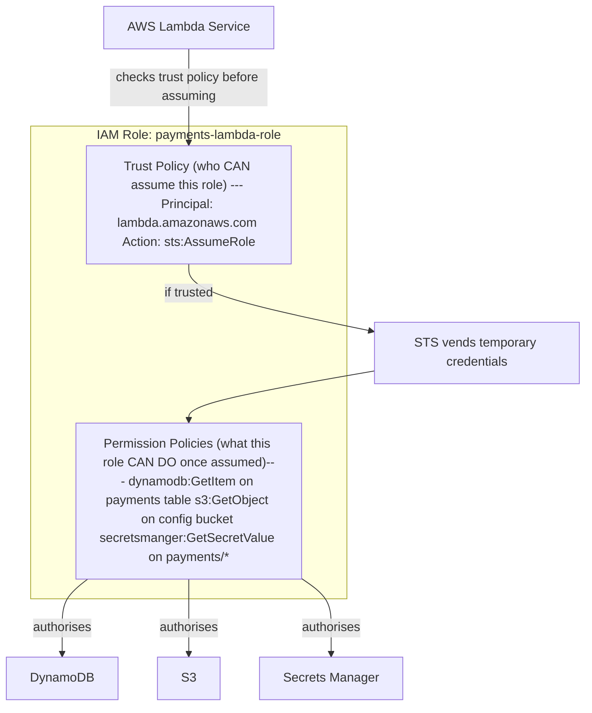
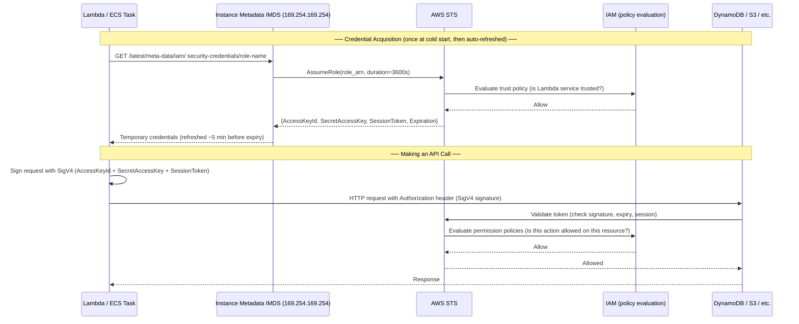
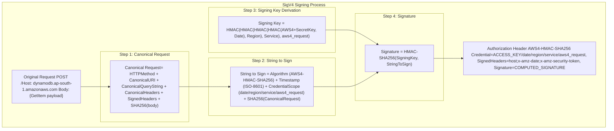
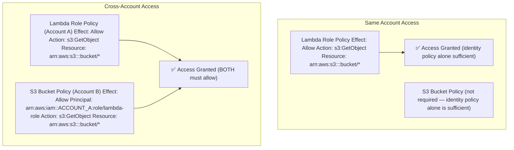

In [Authentication Deep Dive: How JWT Works](/posts/authentication-deep-dive-jwt/) we looked at how users authenticate to your application using JWT tokens. The fundamental mechanism there was: prove your identity once (with a password), receive a signed credential, present it on every subsequent request.

AWS service-to-service authentication operates on the same conceptual foundation — prove identity, receive a signed credential, present it — but every implementation detail is different. There are no passwords. There are no long-lived tokens. The credentials expire in hours or minutes and are rotated automatically. The signing is done with a protocol called SigV4 that signs the entire HTTP request, not just a header. And the identity being asserted is not a user but an **IAM role** — an abstract identity that a service *assumes* rather than *owns*.

Understanding this system is essential for every engineer working on AWS. When your Lambda cannot write to DynamoDB, when your ECS task cannot call another service, when your CI pipeline cannot deploy an updated image — the root cause is almost always an IAM misconfiguration. And you cannot debug IAM misconfiguration without understanding how the system actually works at the credential level.

---

## Table of Contents

1. [Why Passwords Do Not Belong Between Services](#why-passwords-do-not-belong-between-services)
2. [The IAM Model: Principals, Policies, and Resources](#the-iam-model)
3. [How IAM Roles Work — The Trust and Permission Split](#how-iam-roles-work)
4. [STS: The Credential Vending Machine](#sts-the-credential-vending-machine)
5. [How Lambda Assumes a Role — Step by Step](#how-lambda-assumes-a-role)
6. [How ECS Tasks Assume a Role](#how-ecs-tasks-assume-a-role)
7. [The Credential Provider Chain — How boto3 Finds Credentials](#the-credential-provider-chain)
8. [SigV4: How AWS Signs Every Request](#sigv4-how-aws-signs-every-request)
9. [Common IAM Patterns: Lambda to Lambda, Lambda to RDS, Lambda to OpenSearch](#common-iam-patterns)
10. [Resource-Based Policies vs Identity-Based Policies](#resource-based-vs-identity-based-policies)
11. [Debugging IAM: What to Check When Access is Denied](#debugging-iam)
12. [Key Takeaways](#key-takeaways)

---

## Why Passwords Do Not Belong Between Services

Imagine your payments Lambda needs to read from an S3 bucket. One approach: create an IAM user with an access key, hardcode the key ID and secret in the Lambda environment variables, and call it done.

This is how a lot of systems were built in 2014. It is still how some systems are built today. It is deeply wrong for several reasons:

**Long-lived credentials are a permanent liability.** An IAM user's access key does not expire. If it leaks — through a git commit, through CloudWatch logs, through a misconfigured S3 bucket containing your `.env` file — the attacker has indefinite access until someone notices and rotates the key. The average time-to-discovery for a credential leak is measured in weeks, not hours.

**Static credentials do not scope well.** Every Lambda that uses the same IAM user's key has the same permissions. Adding the minimum-permission principle requires creating a new user per service, which creates a management nightmare as the system grows.

**Rotation is a human problem.** Rotating an IAM access key requires updating every place the old key was configured — environment variables, Secrets Manager, Parameter Store, CI/CD configuration. Miss one and something breaks. The operational overhead of key rotation is so high that many teams skip it, which compounds the liability of long-lived credentials.

AWS's solution is to make credentials **ephemeral by design**. Instead of a permanent identity credential, each service gets a temporary credential that expires in hours. The service requests a new one before expiry. The entire process is automatic, invisible to application code, and requires no human rotation.

---

## The IAM Model

Before diving into roles and credentials, it helps to have the full IAM vocabulary in place.

### Principals

A **principal** is an entity that can make requests to AWS — something that can *act*. There are four principal types:

**IAM Users** — long-lived identities tied to a human. They have permanent credentials (password for console, access key for API). The right place for IAM users is human access, not service access.

**IAM Roles** — identities without permanent credentials. A role is a permission set that can be *assumed* by trusted entities. A role does not belong to anyone — it is assumed temporarily, credentials are vended, and when the session ends the credentials expire. This is the right mechanism for service-to-service auth.

**AWS Services** — services like Lambda, ECS, and EC2 can themselves be principals that assume roles on your behalf. When Lambda executes your function, it uses the execution role you configured — Lambda assumes that role and provides the resulting temporary credentials to your function's environment.

**Federated Identities** — external identities (users authenticated by an OIDC provider, SAML IdP, or Cognito) that are mapped to IAM roles. Used for human access via SSO or for workload identity in Kubernetes (IRSA).

### Policies

A **policy** is a JSON document that defines permissions — what actions are allowed or denied, on which resources, under what conditions. Policies attach to principals. When a principal makes a request, IAM evaluates all attached policies to determine if the action is allowed.

```json
{
  "Version": "2012-10-17",
  "Statement": [
    {
      "Sid": "AllowPaymentTableReadWrite",
      "Effect": "Allow",
      "Action": [
        "dynamodb:GetItem",
        "dynamodb:PutItem",
        "dynamodb:Query",
        "dynamodb:UpdateItem"
      ],
      "Resource": [
        "arn:aws:dynamodb:ap-south-1:123456789012:table/payments",
        "arn:aws:dynamodb:ap-south-1:123456789012:table/payments/index/*"
      ],
      "Condition": {
        "StringEquals": {
          "aws:RequestedRegion": "ap-south-1"
        }
      }
    }
  ]
}
```

Every policy statement is a `(Effect, Action, Resource, Condition)` tuple. The default is **implicit deny** — if no policy explicitly allows an action, it is denied. An explicit `"Effect": "Deny"` overrides any `Allow` regardless of other policies.

---

## How IAM Roles Work — The Trust and Permission Split

An IAM role has two distinct policy attachments that serve different purposes. This split confuses most engineers the first time they encounter it.



**The Trust Policy** (also called the *assume-role policy*) answers: **who is allowed to assume this role?** It lists trusted **principals** — AWS accounts, AWS services, or IAM entities — that can call `sts:AssumeRole` for this role. Without a trust policy entry for a principal, that principal cannot assume the role no matter how many permission policies are attached.

__Trust Policy: only the Lambda service can assume this role (specifically, Lambda functions in your account)__
```json
{
  "Version": "2012-10-17",
  "Statement": [
    {
      "Effect": "Allow",
      "Principal": {
        "Service": "lambda.amazonaws.com"
      },
      "Action": "sts:AssumeRole"
    }
  ]
}
```

**Permission Policies** answer: **what is this role allowed to do?** These are the same policy documents that can attach to IAM users. They define allowed and denied actions on AWS resources.

The two-policy model is a deliberate security architecture: trust and permissions are orthogonal. A role can have broad permissions but only be assumable by a very specific principal (least-privilege trust). Or a role can be assumable by many principals but have narrow permissions (least-privilege access). You tune each dimension independently.

---

## STS: The Credential Vending Machine

**AWS Security Token Service (STS)** is the service that actually generates temporary credentials. Every `AssumeRole` call goes to STS. Every Lambda execution gets credentials from STS. Every EC2 instance metadata credential is STS-issued. It is the keystone of AWS's credential system and runs in every AWS region.

When STS issues credentials for a role assumption, it returns exactly three things:

```json
{
    "Credentials": {
        "AccessKeyId": "ASIA...",
        "SecretAccessKey": "...",
        "SessionToken": "...",
        "Expiration": "2026-04-10T07:00:00Z"
    },
    "AssumedRoleUser": {
        "AssumedRoleId": "AROA...:payments-lambda-1234",
        "Arn": "arn:aws:sts::123456789012:assumed-role/payments-lambda-role/payments-lambda-1234"
    }
}
```

**AccessKeyId** starts with `ASIA` — temporary key (permanent IAM user access keys start with `AKIA`).

**SecretAccessKey** is the 40-character secret paired with the access key.

**SessionToken** — a long token required for all API calls. Without it, the credentials are invalid, even if the `AccessKeyId` and `SecretAccessKey` are correct.

**Expiration** — typically 1 hour for Lambda, but can be as short as 15 minutes or as long as 12 hours depending on the role's maximum session duration.

**AssumedRoleId** — the role ID (`AROA...`) and the session name, used for audit logging.

**Arn** — the full ARN of the assumed role session, showing that this is a temporary session (not a permanent role).

Permanent IAM user access keys start with `AKIA`. Temporary STS credentials start with `ASIA`. This prefix is not just cosmetic — AWS's internal authorisation system uses it to route the credential validation path differently. A temporary credential without its `SessionToken` will always fail, even if the `AccessKeyId` and `SecretAccessKey` are correct.



---

## How Lambda Assumes a Role — Step by Step

When you create a Lambda function, you assign it an **execution role**. This is an IAM role with a trust policy that allows `lambda.amazonaws.com` to assume it. Here is exactly what happens from function creation to your code reading from DynamoDB:

**Step 1: Role Configuration** — You create the role and attach permission policies. The trust policy grants `lambda.amazonaws.com` the right to assume it.

**Step 2: Function Association** — You associate the execution role ARN with the Lambda function. This is stored in the Lambda control plane.

**Step 3: Cold Start — Role Assumption** — When a Lambda execution environment initialises (cold start), the Lambda service calls `STS:AssumeRole` on your behalf, using the execution role ARN you configured. This happens *before* your handler code runs. The resulting temporary credentials are injected into the execution environment as environment variables:

```
AWS_ACCESS_KEY_ID=ASIAX...
AWS_SECRET_ACCESS_KEY=...
AWS_SESSION_TOKEN=FwoGZXIvYXdz...  (long token, ~1KB)
AWS_REGION=ap-south-1
```

**Step 4: boto3 Picks Up Credentials Automatically** — When your code calls `boto3.client("dynamodb")`, boto3 reads these environment variables automatically. You never write credential code — the SDK's credential provider chain handles it.

**Step 5: Credential Refresh** — Lambda's execution environment refreshes the credentials approximately 5 minutes before they expire. This is transparent to your code and happens without a cold start.

```python
# lambda/payments_handler.py
import boto3
import json

# NO credentials anywhere in this code — ever.
# boto3 finds them automatically from the injected environment variables.
# If you hardcode credentials here, you are doing it wrong.
dynamodb = boto3.resource("dynamodb", region_name="ap-south-1")
table = dynamodb.Table("payments")


def handler(event, context):
    """
    At this point, the Lambda runtime has already:
    1. Assumed the execution role via STS
    2. Injected temporary credentials as environment variables
    3. boto3 has read those credentials and is ready to make signed requests

    Your code just calls AWS services — no auth logic needed.
    """
    payment_id = event["payment_id"]

    # boto3 internally:
    # 1. Reads AWS_ACCESS_KEY_ID, AWS_SECRET_ACCESS_KEY, AWS_SESSION_TOKEN
    # 2. Constructs the DynamoDB API request
    # 3. Signs it with SigV4 (see the SigV4 section below)
    # 4. Sends the HTTPS request to dynamodb.ap-south-1.amazonaws.com
    response = table.get_item(Key={"payment_id": payment_id})

    return response.get("Item")
```

---

## How ECS Tasks Assume a Role

ECS uses a slightly different mechanism called the **Task IAM Role** (separate from the *ECS Task Execution Role* — a distinction that trips up many engineers).

| Role | Who uses it | Purpose |
|------|-------------|---------|
| **Task Execution Role** | ECS agent (not your code) | Pull ECR images, write CloudWatch logs — infrastructure operations |
| **Task IAM Role** | Your application code | Call DynamoDB, S3, other AWS services — business logic operations |

For your application code running in the container, the credential mechanism is similar to Lambda but uses a **task-metadata endpoint** instead of the EC2 instance metadata service:

```
http://169.254.170.2/v2/credentials/{credential_id}
```

The ECS agent injects the `AWS_CONTAINER_CREDENTIALS_RELATIVE_URI` environment variable into your container. boto3's credential provider chain detects this variable and fetches credentials from that endpoint automatically.

```python
# ecs/payments_service.py
import boto3
import os

# Demonstrate that ECS task role credentials are auto-discovered.
# The credential_id in the URL comes from the ECS agent, not your code.
def show_current_identity():
    """
    sts.get_caller_identity() returns who you currently are — useful for
    debugging IAM issues in ECS. If this works, credentials are valid.
    If it fails with NoCredentialsError, the task role isn't configured.
    If it fails with AccessDenied, the role doesn't have sts:GetCallerIdentity.
    """
    sts = boto3.client("sts")
    identity = sts.get_caller_identity()
    print(f"Account: {identity['Account']}")
    print(f"UserID:  {identity['UserId']}")
    # Example output:
    # Account: 123456789012
    # UserID:  AROA...:payments-ecs-task-abc123
    # The UserID shows the role ID and the session name — confirms task role is active
    print(f"ARN:     {identity['Arn']}")
    # ARN: arn:aws:sts::123456789012:assumed-role/payments-ecs-role/payments-ecs-task-abc123
```

---

## The Credential Provider Chain

When boto3 needs credentials, it does not just check environment variables. It walks a prioritised **credential provider chain**, trying each source in order and using the first one that succeeds. Understanding this chain is what lets you write code that works identically in local development (where you use your personal IAM credentials) and in production (where the execution role provides credentials).

```python
# auth/credential_chain_demo.py
import boto3
from botocore.credentials import (
    EnvProvider,
    SharedCredentialProvider,
    InstanceMetadataProvider,
    ContainerProvider,
)

# boto3 tries these in order, stopping at the first success:
credential_chain = [
    # 1. Explicitly passed credentials — boto3.client("s3", aws_access_key_id=...)
    #    Use only in tests. Never in production code.
    "Explicit credentials in code",

    # 2. Environment variables: AWS_ACCESS_KEY_ID, AWS_SECRET_ACCESS_KEY, AWS_SESSION_TOKEN
    #    Lambda injects execution role credentials here automatically.
    "Environment variables (Lambda: execution role credentials)",

    # 3. AWS_PROFILE / AWS config file (~/.aws/credentials)
    #    Used in local development when you run `aws configure` or use SSO.
    "~/.aws/credentials file (local development)",

    # 4. Container credentials via AWS_CONTAINER_CREDENTIALS_RELATIVE_URI
    #    ECS task role — the ECS agent sets this env var.
    "ECS task role via container metadata endpoint",

    # 5. EC2 Instance Metadata Service (IMDS)
    #    EC2 instances with an instance profile — least common for modern apps.
    "EC2 instance profile via IMDS (169.254.169.254)",
]

# In practice, you never need to care about this chain.
# Write code like this in all environments:
s3 = boto3.client("s3")   # credentials resolved automatically from chain

# The only time you need to be explicit is cross-account access:
sts = boto3.client("sts")
assumed = sts.assume_role(
    RoleArn="arn:aws:iam::OTHER_ACCOUNT_ID:role/cross-account-role",
    RoleSessionName="payments-service-cross-account"
)
cross_account_s3 = boto3.client(
    "s3",
    aws_access_key_id=assumed["Credentials"]["AccessKeyId"],
    aws_secret_access_key=assumed["Credentials"]["SecretAccessKey"],
    aws_session_token=assumed["Credentials"]["SessionToken"]
)
```

---

## SigV4: How AWS Signs Every Request

When boto3 makes an API call to DynamoDB, S3, or any other AWS service, the HTTP request carries a cryptographic signature in its `Authorization` header. This signature is computed using the **AWS Signature Version 4 (SigV4)** protocol.

SigV4 is more comprehensive than JWT signing — it signs not just an identity claim but the **entire request**: the HTTP method, the URL, the query parameters, the headers, and the body. This prevents a signed request from being replayed against a different endpoint, altered in transit, or used outside its intended time window.



Let us build SigV4 signing from scratch to make each step concrete:

```python
# auth/sigv4_demo.py
import hmac
import hashlib
import datetime
import urllib.parse


def sign(key: bytes, msg: str) -> bytes:
    """HMAC-SHA256 convenience wrapper."""
    return hmac.new(key, msg.encode("utf-8"), hashlib.sha256).digest()


def get_signing_key(secret_key: str, date: str, region: str, service: str) -> bytes:
    """
    Derives the SigV4 signing key via a chain of HMAC operations.
    This key hierarchy binds the signature to a specific date, region, and service —
    a signature for DynamoDB in ap-south-1 cannot be replayed against S3 in us-east-1.
    """
    k_date    = sign(("AWS4" + secret_key).encode("utf-8"), date)
    k_region  = sign(k_date, region)
    k_service = sign(k_region, service)
    k_signing = sign(k_service, "aws4_request")
    return k_signing


def create_signed_headers(
    method: str,
    host: str,
    path: str,
    service: str,
    region: str,
    access_key: str,
    secret_key: str,
    session_token: str,
    payload: str = "",
    query_params: dict = None,
) -> dict:
    """
    Returns the headers needed for a SigV4-signed request.
    boto3 does this automatically — this is for educational clarity.
    """
    now = datetime.datetime.utcnow()
    amz_date = now.strftime("%Y%m%dT%H%M%SZ")      # ISO-8601 compact: 20260410T103000Z
    date_stamp = now.strftime("%Y%m%d")              # just the date: 20260410

    # ── Step 1: Build the canonical request ──────────────────────────────────
    # Canonical URI: URL-encode the path (/ → /)
    canonical_uri = urllib.parse.quote(path, safe="/")

    # Canonical query string: sorted key=value pairs, URL-encoded
    canonical_querystring = ""
    if query_params:
        canonical_querystring = "&".join(
            f"{urllib.parse.quote(k, safe='')}={urllib.parse.quote(v, safe='')}"
            for k, v in sorted(query_params.items())
        )

    # Canonical headers: lowercase name, trimmed value, sorted alphabetically
    # Must include x-amz-security-token when using STS temporary credentials
    headers_to_sign = {
        "host": host,
        "x-amz-date": amz_date,
        "x-amz-security-token": session_token,
    }
    canonical_headers = "".join(
        f"{k}:{v}\n"
        for k, v in sorted(headers_to_sign.items())
    )
    signed_headers = ";".join(sorted(headers_to_sign.keys()))

    # Body hash: SHA-256 of the request body
    payload_hash = hashlib.sha256(payload.encode("utf-8")).hexdigest()

    canonical_request = "\n".join([
        method,
        canonical_uri,
        canonical_querystring,
        canonical_headers,
        signed_headers,
        payload_hash,
    ])

    # ── Step 2: Build the string to sign ─────────────────────────────────────
    credential_scope = f"{date_stamp}/{region}/{service}/aws4_request"
    string_to_sign = "\n".join([
        "AWS4-HMAC-SHA256",
        amz_date,
        credential_scope,
        hashlib.sha256(canonical_request.encode("utf-8")).hexdigest(),
    ])

    # ── Step 3: Compute the signature ────────────────────────────────────────
    signing_key = get_signing_key(secret_key, date_stamp, region, service)
    signature = hmac.new(signing_key, string_to_sign.encode("utf-8"), hashlib.sha256).hexdigest()

    # ── Step 4: Build the Authorization header ────────────────────────────────
    authorization = (
        f"AWS4-HMAC-SHA256 "
        f"Credential={access_key}/{credential_scope}, "
        f"SignedHeaders={signed_headers}, "
        f"Signature={signature}"
    )

    return {
        "Authorization": authorization,
        "x-amz-date": amz_date,
        "x-amz-security-token": session_token,
        "host": host,
    }
```

SigV4's security properties go well beyond JWT:

- **Request binding**: The signature covers the host, path, and query params. A signed request to DynamoDB cannot be replayed against S3, even with valid credentials.
- **Body integrity**: The SHA-256 hash of the request body is included. The body cannot be altered after signing.
- **Time-bound**: The `x-amz-date` header is signed. AWS rejects requests with a timestamp older than 15 minutes — this is the replay window.
- **Session binding**: For STS temporary credentials, the `x-amz-security-token` is required and is part of the signed request. Credentials from one STS session cannot be used with a different session token.

---

## Common IAM Patterns

### Lambda → DynamoDB

The simplest pattern. One execution role, one permission policy, one service principal in the trust policy.

```python
# infrastructure/iam.py (using boto3 to create IAM resources programmatically)
import boto3
import json

iam = boto3.client("iam")


def create_lambda_execution_role(function_name: str, table_arn: str) -> str:
    """
    Creates a minimal execution role for a Lambda that reads/writes one DynamoDB table.
    Returns the role ARN.
    """

    role_name = f"{function_name}-execution-role"

    # Trust policy: only Lambda can assume this role
    trust_policy = {
        "Version": "2012-10-17",
        "Statement": [
            {
                "Effect": "Allow",
                "Principal": {"Service": "lambda.amazonaws.com"},
                "Action": "sts:AssumeRole"
            }
        ]
    }

    role = iam.create_role(
        RoleName=role_name,
        AssumeRolePolicyDocument=json.dumps(trust_policy),
        Description=f"Execution role for {function_name}"
    )

    # Managed policy for CloudWatch Logs — every Lambda needs this for logging
    iam.attach_role_policy(
        RoleName=role_name,
        PolicyArn="arn:aws:iam::aws:policy/service-role/AWSLambdaBasicExecutionRole"
    )

    # Inline policy for DynamoDB — specific to this Lambda's needs
    # Inline (not managed) because it is tightly coupled to this one role
    dynamodb_policy = {
        "Version": "2012-10-17",
        "Statement": [
            {
                "Effect": "Allow",
                "Action": [
                    "dynamodb:GetItem",
                    "dynamodb:PutItem",
                    "dynamodb:UpdateItem",
                    "dynamodb:Query"
                ],
                # Scope to specific table AND its GSIs — not all DynamoDB tables
                "Resource": [table_arn, f"{table_arn}/index/*"]
            }
        ]
    }

    iam.put_role_policy(
        RoleName=role_name,
        PolicyName="dynamodb-access",
        PolicyDocument=json.dumps(dynamodb_policy)
    )

    return role["Role"]["Arn"]
```

### Lambda → Lambda (Invoking Another Function)

When Lambda A needs to trigger Lambda B, Lambda A's execution role needs `lambda:InvokeFunction` on Lambda B's ARN. This is a common pattern for async fan-out and step functions alternatives.

```python
# Permission on the CALLER's role (Lambda A):
invocation_policy = {
    "Version": "2012-10-17",
    "Statement": [
        {
            "Effect": "Allow",
            "Action": ["lambda:InvokeFunction"],
            "Resource": "arn:aws:lambda:ap-south-1:123456789012:function:notifications-lambda"
            # Note: NOT "lambda:*" — only the invoke action, only this one function
        }
    ]
}

# Lambda A can now call Lambda B:
import boto3
lambda_client = boto3.client("lambda")

response = lambda_client.invoke(
    FunctionName="notifications-lambda",
    InvocationType="Event",              # async: fire-and-forget
    Payload=json.dumps({"user_id": "123", "event": "payment_complete"}).encode()
)
# boto3 signs this request with SigV4 automatically using Lambda A's execution role credentials
```

### Lambda → OpenSearch (SigV4-signed HTTP)

OpenSearch domains in a VPC can use IAM authentication — requests are signed with SigV4, and IAM policies control which principals can call which OpenSearch APIs. There is no username/password.

```python
# opensearch/client.py
import boto3
from opensearchpy import OpenSearch, RequestsHttpConnection
from requests_aws4auth import AWS4Auth


def get_opensearch_client(endpoint: str, region: str) -> OpenSearch:
    """
    Creates an OpenSearch client that signs every request with SigV4
    using the current execution role's credentials.

    The `requests_aws4auth` library integrates with boto3's credential
    chain — it calls boto3 to get credentials at request time, so it
    automatically picks up refreshed STS credentials without restart.
    """
    session = boto3.Session()
    credentials = session.get_credentials()

    # AWS4Auth signs every request with the current credentials.
    # It refreshes credentials automatically when they expire (every ~1 hour).
    awsauth = AWS4Auth(
        refreshable_credentials=credentials,  # auto-refreshes STS creds
        region=region,
        service="es"   # OpenSearch service name in SigV4 is still "es"
    )

    return OpenSearch(
        hosts=[{"host": endpoint, "port": 443}],
        http_auth=awsauth,
        use_ssl=True,
        verify_certs=True,
        connection_class=RequestsHttpConnection,
        http_compress=True,
        pool_maxsize=20,
    )
```

The IAM policy on the execution role grants access to OpenSearch operations:

```json
{
  "Version": "2012-10-17",
  "Statement": [
    {
      "Effect": "Allow",
      "Action": [
        "es:ESHttpGet",
        "es:ESHttpPost",
        "es:ESHttpPut"
      ],
      "Resource": "arn:aws:es:ap-south-1:123456789012:domain/your-domain/*"
    }
  ]
}
```

### ECS → Secrets Manager (Fetching Credentials at Runtime)

ECS tasks should never have database passwords in environment variables. Store secrets in Secrets Manager; the task role grants read access; the application fetches the secret at startup.

```python
# config/secrets.py
import boto3
import json
from functools import lru_cache


@lru_cache(maxsize=1)
def get_database_credentials() -> dict:
    """
    Fetches database credentials from Secrets Manager using the task role.
    @lru_cache ensures we only call Secrets Manager once per container lifetime
    (secrets are typically rotated on a 30-day cycle, much longer than typical
    ECS task lifetime). For rotation-aware access, use a TTL cache instead.

    The task role must have:
    secretsmanager:GetSecretValue on the specific secret ARN
    kms:Decrypt on the KMS key used to encrypt the secret (if using CMK)
    """
    sm = boto3.client("secretsmanager", region_name="ap-south-1")

    response = sm.get_secret_value(
        SecretId="arn:aws:secretsmanager:ap-south-1:123456789012:secret:payments/db-credentials"
    )

    # SecretsManager stores the secret as a JSON string
    secret = json.loads(response["SecretString"])
    # Returns: {"username": "payments_user", "password": "...", "host": "...", "port": 5432}
    return secret
```

---

## Resource-Based Policies vs Identity-Based Policies

Most AWS access decisions involve two independent policy types. Understanding both is necessary for cross-account access and for services like S3, SQS, and KMS.

**Identity-based policies** attach to the *caller* — to a role or user. They say "this principal is allowed to perform these actions." We have been looking at these throughout this post.

**Resource-based policies** attach to the *resource* — to the S3 bucket, the SQS queue, the KMS key, the Lambda function. They say "these principals are allowed to act on this resource."

When a principal accesses a resource *within the same account*, an explicit Allow in *either* policy is sufficient (assuming no explicit Deny anywhere). When access crosses account boundaries, *both* policies must explicitly allow the access — the caller's identity policy must allow the action, AND the resource's resource policy must grant access to the calling account/role.



A practical example: your payments Lambda (Account A) reading audit logs from a central S3 bucket (Account B, security team's account):

Below S3 Bucket Policy on the audit bucket (Account B) Without this, even if Account A's Lambda has s3:GetObject in its policy, access will be denied — cross-account requires explicit bucket policy grant.

```json
{
  "Version": "2012-10-17",
  "Statement": [
    {
      "Sid": "AllowPaymentsLambdaRead",
      "Effect": "Allow",
      "Principal": {
        "AWS": "arn:aws:iam::ACCOUNT_A_ID:role/payments-lambda-execution-role"
      },
      "Action": ["s3:GetObject", "s3:ListBucket"],
      "Resource": [
        "arn:aws:s3:::central-audit-bucket",
        "arn:aws:s3:::central-audit-bucket/payments/*"
      ]
    }
  ]
}
```

---

## Debugging IAM: What to Check When Access is Denied

An `AccessDenied` error in AWS is frustrating because the error message rarely tells you *why*. Here is a systematic checklist:

```python
# debug/iam_checker.py
import boto3
import json

iam = boto3.client("iam")
sts = boto3.client("sts")


def diagnose_access_denied(
    principal_arn: str,
    action: str,
    resource_arn: str,
    context: dict = None
):
    """
    Uses IAM Policy Simulator to check if a given principal can perform
    an action on a resource, and explains why if it cannot.

    This is the programmatic equivalent of the IAM Policy Simulator in
    the AWS console — the most useful debugging tool for IAM issues.
    """

    context_entries = []
    if context:
        for key, value in context.items():
            context_entries.append({
                "ContextKeyName": key,
                "ContextKeyValues": [value],
                "ContextKeyType": "string"
            })

    response = iam.simulate_principal_policy(
        PolicySourceArn=principal_arn,
        ActionNames=[action],
        ResourceArns=[resource_arn],
        ContextEntries=context_entries
    )

    for result in response["EvaluationResults"]:
        decision = result["EvalDecision"]
        print(f"\nAction: {result['EvalActionName']}")
        print(f"Decision: {decision}")   # allowed / explicitDeny / implicitDeny

        if decision != "allowed":
            # Which statement caused the deny?
            for detail in result.get("MatchedStatements", []):
                print(f"  Matched policy: {detail['SourcePolicyId']}")
                print(f"  Statement: {detail['StartPosition']}")

            # Is there a resource policy that might be blocking?
            for deny in result.get("ResourceSpecificResults", []):
                print(f"  Resource policy decision: {deny['EvalResourceDecision']}")


# Example diagnostic call:
diagnose_access_denied(
    principal_arn="arn:aws:iam::123456789012:role/payments-lambda-execution-role",
    action="dynamodb:PutItem",
    resource_arn="arn:aws:dynamodb:ap-south-1:123456789012:table/payments"
)
```

**The mental checklist for `AccessDenied`**:

1. **Is the role the correct one?** Call `sts.get_caller_identity()` from within the function and verify the ARN matches the role you think is being used.
2. **Is the permission in the role's policy?** Check that the action (`dynamodb:PutItem`), the resource ARN (exact match, including region and account), and the condition (if any) all line up. A common mistake: the policy allows `arn:aws:dynamodb:us-east-1:...` but the function is calling `ap-south-1`.
3. **Is there an explicit Deny?** Check for SCPs (Service Control Policies) if you are in an AWS Organization. An SCP deny at the OU level cannot be overridden by any identity policy.
4. **For cross-account: does the resource policy allow access?** S3 buckets, SQS queues, KMS keys, and Secrets Manager secrets all require a resource policy grant for cross-account access.
5. **Is the resource in the same region?** IAM is global but many services are regional. A Lambda in `ap-south-1` calling an SQS queue in `us-east-1` requires the ARN in the policy to specify the correct region.
6. **Is the VPC endpoint policy blocking the request?** If you are using VPC endpoints for DynamoDB or S3, the endpoint has its own policy that can deny access independently of IAM.

---

## Key Takeaways

The through line connecting JWT (Part 1) and AWS IAM (this post) is the same security principle: **verify identity cryptographically, grant permissions based on that identity, make credentials time-bound**.

In JWT: the server signs a token at login; downstream services verify the signature with a public key; the token expires, limiting the blast radius of a leaked credential.

In AWS IAM: STS issues time-bound credentials when a service assumes a role; every API request is signed with SigV4 using those credentials; the credentials expire in hours, automatic rotation is built in.

The key IAM patterns to internalise: every service gets its own execution role with the minimum permissions it needs; trust policies and permission policies are independent and both matter; cross-account access requires explicit grants in both the caller's identity policy and the resource's resource policy; `boto3` discovers credentials from the execution environment automatically — you should never write credential code in application logic.

When something breaks, `sts:GetCallerIdentity` is your first debugging call — it tells you definitively who AWS thinks you are. IAM Policy Simulator tells you why a specific action is denied. Together they resolve 95% of IAM puzzles without escalation.

---

## More Resources

- [AWS IAM Documentation — How IAM Works](https://docs.aws.amazon.com/IAM/latest/UserGuide/intro-structure.html)
- [SigV4 Signing Process](https://docs.aws.amazon.com/general/latest/gr/sigv4_signing.html)
- [IAM Policy Simulator](https://policysim.aws.amazon.com/)
- [AWS Well-Architected: Security Pillar — Identity and Access Management](https://docs.aws.amazon.com/wellarchitected/latest/security-pillar/identity-and-access-management.html)
- [Part 1 of this series — JWT Authentication](/posts/authentication-deep-dive-jwt/)
