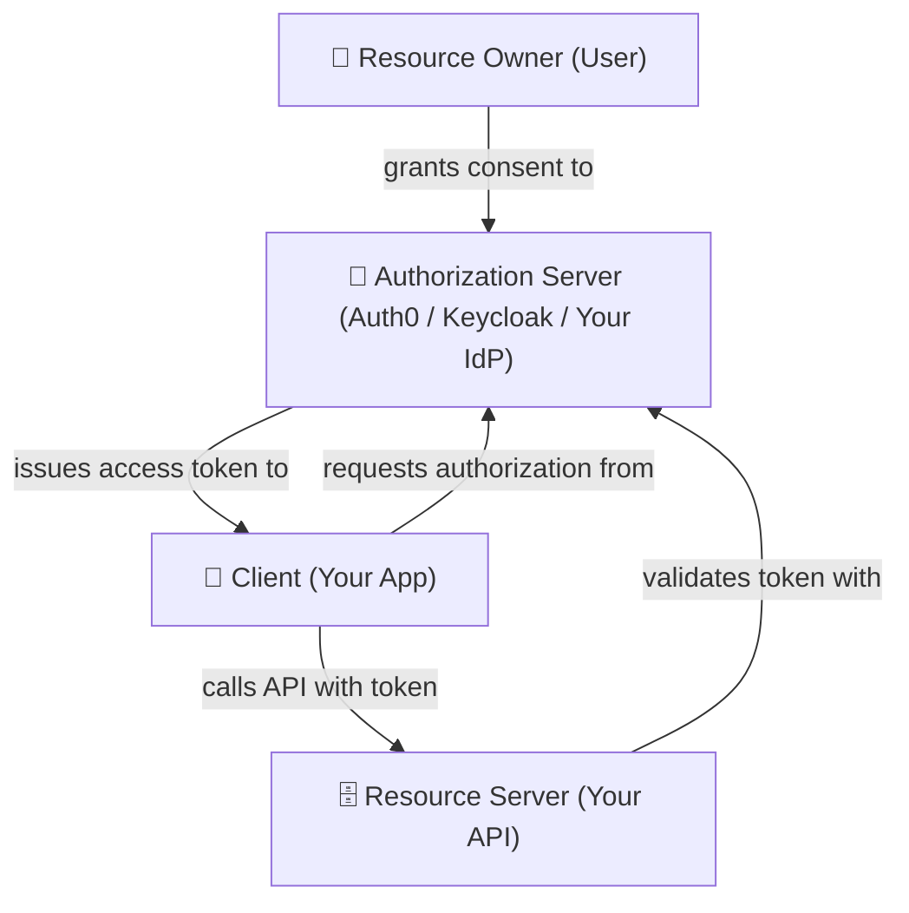
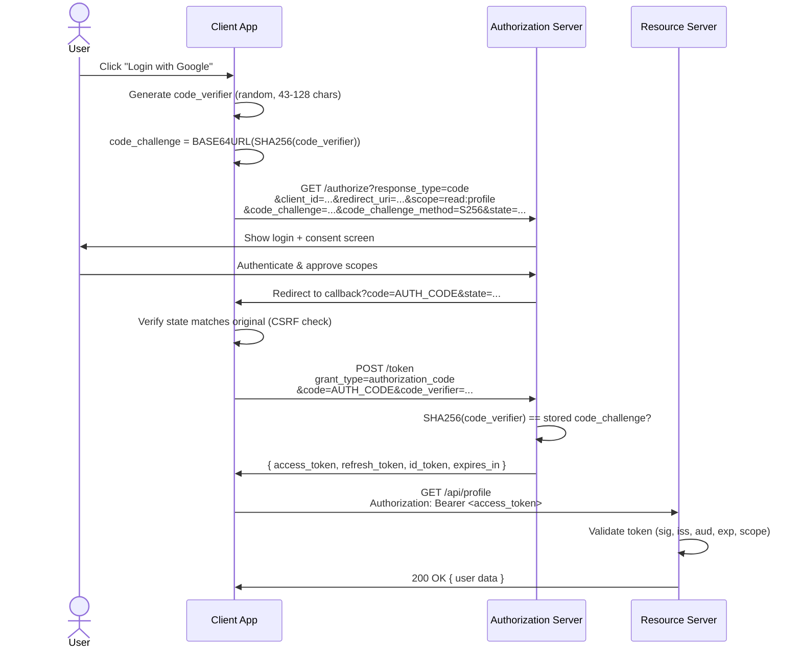
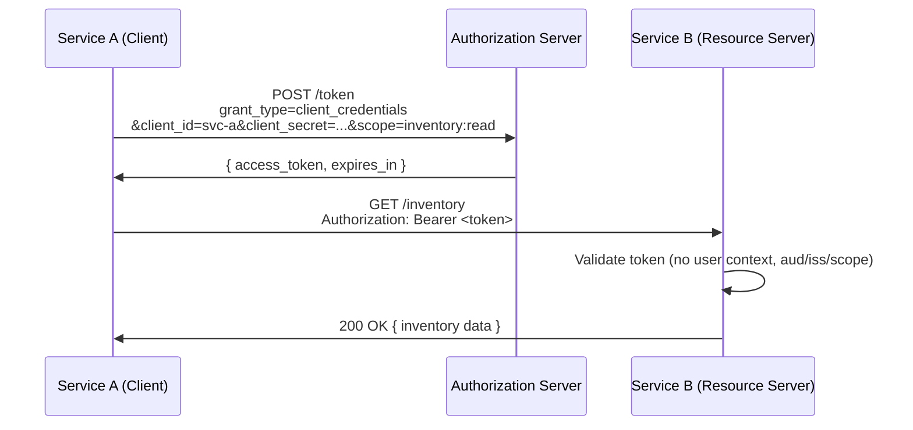
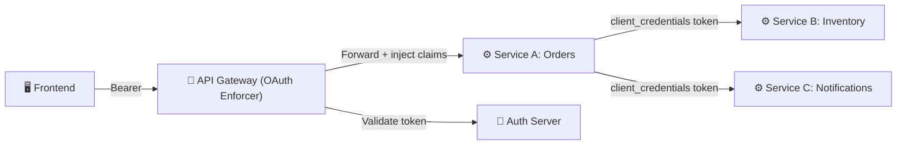

> **TL;DR:** OAuth 2.0 is an **authorization framework**, not an authentication protocol. Most "we use OAuth for login" statements are technically wrong. This post breaks down what it actually does, how each flow works, what can go horribly wrong, and how to design systems that survive production


## The Problem OAuth Was Born to Solve

Before we talk about flows and tokens, let's talk about the world before OAuth.

It's 2006. You're building a productivity app that needs to import a user's Gmail contacts. The solution? Ask the user for their Gmail **username and password**, store it, and use it to scrape the contacts on their behalf.

This is catastrophically bad:
- You now own the nuclear launch codes to their inbox.
- If your DB leaks, attackers own their email too.
- The user can't revoke access without changing their password — which affects every app they've given it to.
- You have more power than you need. The user wanted to share contacts, not give away their email, drafts, and labels.

OAuth 2.0 was created to solve exactly this: **delegated authorization** — let a client do *some specific things* on behalf of a user, against a third-party API, without ever seeing the user's password.


## The Most Important Thing To Understand Upfront

Before anything else — burn this into your memory:

> **OAuth 2.0 ≠ Authentication**

OAuth 2.0 tells you **what a client is allowed to do**. It does not tell you *who the user is*.

The entire industry gets this wrong. "We use OAuth for login" is technically inaccurate. What you're actually using for login is **OpenID Connect (OIDC)** — a thin identity layer built on top of OAuth 2.0.

| Concept         | Protocol        | Token Produced | Answers              |
|-----------------|-----------------|----------------|----------------------|
| Authorization   | OAuth 2.0       | Access Token   | What can this client do? |
| Authentication  | OIDC (on OAuth) | ID Token       | Who is this user?    |
| Token Format    | JWT (optional)  | —              | How is the data encoded? |

JWT is a **format**, OIDC is a **protocol**, OAuth is a **framework**. They are not interchangeable. Mixing these up is the #1 source of auth bugs in production systems.


## The Four Actors — Map These to Your Architecture

Every OAuth 2.0 interaction involves exactly four roles. Before writing a single line of code, you should be able to map these to real components in your system.



**Resource Owner** — Usually a human. The person who owns the data and decides who gets access to it.

**Client** — Your application. Could be a SPA, a mobile app, a backend service, or a CLI tool. The client is registered with the Authorization Server and has a `client_id`.

**Authorization Server** — The entity that issues tokens. This is your IdP (Auth0, Okta, Keycloak, or your own). It exposes two key endpoints: `/authorize` (user-facing) and `/token` (machine-to-machine).

**Resource Server** — The API that serves protected data. It receives requests with `Authorization: Bearer <token>` and must validate them on every single call.


## Grant Types — Choosing the Right Flow

A **grant type** is the mechanism by which a client proves it's allowed to receive an access token. Choosing the wrong one is a security failure, not just a style choice.

| Grant Type                    | Use Case                         | Recommended? |
|-------------------------------|----------------------------------|:------------:|
| Authorization Code + PKCE     | Web apps, SPAs, mobile/native    | ✅ Yes        |
| Client Credentials            | Machine-to-machine (M2M)         | ✅ Yes        |
| Device Authorization          | Smart TVs, CLIs, IoT             | ✅ Yes        |
| Authorization Code (no PKCE)  | Backend web apps (confidential)  | ⚠️ Use PKCE anyway |
| Implicit                      | Legacy SPAs                      | ❌ Deprecated |
| Resource Owner Password (ROPC)| Legacy / first-party only        | ❌ Avoid      |

If you're starting a new project in 2026, the decision tree is simple:
- User is involved → **Authorization Code + PKCE**
- No user, service-to-service → **Client Credentials**
- Headless device with no browser → **Device Authorization**


## The Authorization Code + PKCE Flow

This is the modern gold standard. Let's walk through it at the level of detail you need to actually debug it.



The flow has **4 phases**. Here's what's actually happening in each:

**1. Client prepares before touching Google**
Before any redirect, the client generates a random `code_verifier` and hashes it into a `code_challenge`. The secret stays local; only its fingerprint travels over the wire. This is PKCE — a stolen auth code is useless without the original verifier.

**2. User authenticates at the Authorization Server**
The client redirects the browser to Google's `/authorize` with the `code_challenge`, requested `scope`, and a `state` token for CSRF protection. Google shows the login + consent screen. This is the **only human-in-the-loop step** — everything else is machine-to-machine.

**3. Code exchange — the PKCE proof**
Google returns a short-lived `code` (≈60 seconds) to the callback URL. The client first validates `state` (CSRF check), then calls `/token` server-side — revealing the original `code_verifier`. Google hashes it and compares: `SHA256(verifier) == stored_challenge`? Match → tokens issued. No match → rejected. An intercepted code is a dead end without the verifier.

**4. API call with validated token**
The client calls the Resource Server with `Authorization: Bearer <access_token>`. The RS validates **five things before trusting it**: signature, issuer (`iss`), audience (`aud`), expiry (`exp`), and scope. All five must pass — not just the signature.

> Every arrow in this diagram is either **delegating trust forward** or **verifying a previous commitment**. That's the mental model that makes OAuth + PKCE click.


### What is PKCE and Why Does It Matter?

PKCE (Proof Key for Code Exchange, pronounced "pixie") solves a real attack vector: **authorization code interception**.

On mobile, a malicious app registered to the same URI scheme (`myapp://callback`) could intercept the auth code redirect. Without PKCE, it could exchange that code for a real token.

With PKCE, the client generates a one-time `code_verifier` locally before the flow starts. It sends only a *hash* of it (`code_challenge`) in the initial request. When exchanging the code, it must prove it holds the original `code_verifier`. A stolen code is useless without it.

```python
import hashlib
import base64
import os
import secrets

def generate_pkce_pair():
    # code_verifier: 43-128 URL-safe characters
    code_verifier = base64.urlsafe_b64encode(
        secrets.token_bytes(32)
    ).rstrip(b'=').decode('utf-8')

    # code_challenge: BASE64URL(SHA256(code_verifier))
    digest = hashlib.sha256(code_verifier.encode('utf-8')).digest()
    code_challenge = base64.urlsafe_b64encode(digest).rstrip(b'=').decode('utf-8')

    return code_verifier, code_challenge


code_verifier, code_challenge = generate_pkce_pair()
print(f"Verifier : {code_verifier}")
print(f"Challenge: {code_challenge}")
```


## Access Tokens, Refresh Tokens, and ID Tokens

Three different things. Not interchangeable. Here's the breakdown:

### Access Token

The key that unlocks the API. Short-lived by design (typically 5–30 minutes). Can be a JWT (self-contained, validated locally) or an opaque string (requires server-side introspection).

A JWT access token decoded looks like:

```json
{
  "iss": "https://auth.example.com",
  "sub": "user_abc123",
  "aud": "https://api.example.com",
  "exp": 1746112800,
  "iat": 1746109200,
  "scope": "read:profile write:orders",
  "client_id": "spa-frontend"
}
```

**The resource server must validate every single field** — not just the signature.

```python
import jwt
from jwt import PyJWKClient

JWKS_URL = "https://auth.example.com/.well-known/jwks.json"
AUDIENCE = "https://api.example.com"
ISSUER = "https://auth.example.com"

def validate_access_token(token: str) -> dict:
    jwks_client = PyJWKClient(JWKS_URL)
    signing_key = jwks_client.get_signing_key_from_jwt(token)

    payload = jwt.decode(
        token,
        signing_key.key,
        algorithms=["RS256"],
        audience=AUDIENCE,
        issuer=ISSUER,
        options={"require": ["exp", "iss", "aud", "sub", "scope"]},
    )
    return payload


def require_scope(required_scope: str, token_payload: dict) -> bool:
    granted_scopes = token_payload.get("scope", "").split()
    return required_scope in granted_scopes
```

### Refresh Token

A long-lived secret used only at the token endpoint to get a fresh access token. **Never sent to the resource server.** Must be stored securely — `httpOnly` cookies on web, Keychain/Keystore on mobile.

```python
import httpx

async def refresh_access_token(
    refresh_token: str,
    client_id: str,
    token_endpoint: str
) -> dict:
    async with httpx.AsyncClient() as client:
        response = await client.post(
            token_endpoint,
            data={
                "grant_type": "refresh_token",
                "refresh_token": refresh_token,
                "client_id": client_id,
            },
        )
        response.raise_for_status()
        return response.json()
        # Returns: { access_token, refresh_token (rotated!), expires_in }
```

> **Senior Lens 🔍** — Always enable **refresh token rotation**. Every time a refresh token is used, it's invalidated and a new one is issued. If an attacker steals a refresh token and uses it, the real user's next call will fail — and you'll know there's a theft in progress. Without rotation, a stolen refresh token is a permanent backdoor.

### ID Token

A JWT *about the user*, issued by the OIDC layer. Contains claims like `email`, `name`, `sub` (subject/user ID). **Use it only on the client to establish identity. Never send it to APIs as a Bearer token.**

```python
# ✅ Correct usage
id_token_payload = decode_id_token(id_token)
current_user_id = id_token_payload["sub"]
display_name = id_token_payload.get("name", "Anonymous")

# ❌ WRONG — never use ID token for API authorization
headers = {"Authorization": f"Bearer {id_token}"}  # DON'T DO THIS
```


## Scopes & The Principle of Least Privilege

Scopes are strings that define what a client can do. Good scope design is the difference between a surgical hack and a total compromise.

### Design Your Scopes Like This

```
resource:action        →   orders:read, orders:write
resource:action:level  →   orders:status:read  (more granular)
```

For a real-world e-commerce API:

```python
# Poorly designed scopes ❌
SCOPES_BAD = [
    "api_access",          # What does this even allow?
    "orders",              # Read? Write? Admin?
    "admin",               # The nuclear option
]

# Well-designed scopes ✅
SCOPES_GOOD = [
    "orders:read",         # List & view orders
    "orders:write",        # Create & update orders
    "orders:cancel",       # Cancel orders (higher sensitivity)
    "profile:read",        # Read user profile
    "profile:write",       # Update user profile
    "payments:read",       # View payment history
    "admin:users:read",    # Admin reads (separate, elevated)
]
```

### Enforcing Scopes in a FastAPI Endpoint

```python
from fastapi import FastAPI, Depends, HTTPException, Security
from fastapi.security import HTTPBearer, HTTPAuthorizationCredentials
from functools import wraps

app = FastAPI()
bearer_scheme = HTTPBearer()


def require_scopes(*required_scopes: str):
    """Decorator factory to enforce OAuth scopes on FastAPI routes."""
    def decorator(func):
        @wraps(func)
        async def wrapper(
            *args,
            credentials: HTTPAuthorizationCredentials = Depends(bearer_scheme),
            **kwargs
        ):
            token = credentials.credentials
            payload = validate_access_token(token)  # from earlier snippet

            granted = set(payload.get("scope", "").split())
            missing = set(required_scopes) - granted

            if missing:
                raise HTTPException(
                    status_code=403,
                    detail=f"Insufficient scopes. Missing: {', '.join(missing)}",
                    headers={"WWW-Authenticate": 'Bearer error="insufficient_scope"'},
                )
            return await func(*args, token_payload=payload, **kwargs)
        return wrapper
    return decorator


@app.get("/api/orders")
@require_scopes("orders:read")
async def list_orders(token_payload: dict = None):
    user_id = token_payload["sub"]
    # Fetch orders for this specific user — never for all users!
    return {"orders": [], "user": user_id}
```


## Machine-to-Machine: Client Credentials Flow

When service A needs to call service B with no user in the loop, Client Credentials is the answer.



The flow has **3 steps** — no user, no browser, no redirect. Pure service-to-service.

**1. Service A proves its identity to the AS**
No user login, no consent screen. Service A calls `/token` directly with its own `client_id` and `client_secret` — the machine equivalent of a username and password. The `scope=inventory:read` declares exactly what it needs; nothing more.

**2. AS issues a short-lived access token**
If the credentials check out and the requested scope is permitted, the AS returns an `access_token` with an `expires_in`. No refresh token — when it expires, Service A simply requests a new one from scratch.

**3. Service A calls Service B with the token**
Service A attaches the token as `Authorization: Bearer <token>` and calls Service B's API directly. Service B validates three things: the audience (`aud` — was this token meant for me?), the issuer (`iss` — did a trusted AS sign this?), and the `scope` (does it include `inventory:read`?). There is **no `sub` claim to check** — there is no user. This is the key difference from user-facing flows.

> Client Credentials is essentially an **API key with an expiry** — but cryptographically signed, scope-constrained, and automatically rotatable. That's why it exists.

```python
import httpx
from datetime import datetime, timedelta
from dataclasses import dataclass, field
from typing import Optional


@dataclass
class TokenCache:
    access_token: str = ""
    expires_at: datetime = field(default_factory=datetime.utcnow)

    def is_valid(self, buffer_seconds: int = 60) -> bool:
        return (
            bool(self.access_token) and
            datetime.utcnow() < self.expires_at - timedelta(seconds=buffer_seconds)
        )


class M2MAuthClient:
    """Client Credentials OAuth client with automatic token caching."""

    def __init__(self, client_id: str, client_secret: str, token_endpoint: str, scope: str):
        self.client_id = client_id
        self.client_secret = client_secret
        self.token_endpoint = token_endpoint
        self.scope = scope
        self._cache = TokenCache()

    async def get_token(self) -> str:
        if self._cache.is_valid():
            return self._cache.access_token

        async with httpx.AsyncClient() as client:
            response = await client.post(
                self.token_endpoint,
                data={
                    "grant_type": "client_credentials",
                    "client_id": self.client_id,
                    "client_secret": self.client_secret,
                    "scope": self.scope,
                },
            )
            response.raise_for_status()
            data = response.json()

        self._cache.access_token = data["access_token"]
        self._cache.expires_at = datetime.utcnow() + timedelta(seconds=data["expires_in"])
        return self._cache.access_token

    async def authorized_request(self, method: str, url: str, **kwargs) -> httpx.Response:
        token = await self.get_token()
        headers = kwargs.pop("headers", {})
        headers["Authorization"] = f"Bearer {token}"
        async with httpx.AsyncClient() as client:
            return await client.request(method, url, headers=headers, **kwargs)


# Usage
auth_client = M2MAuthClient(
    client_id="inventory-service",
    client_secret="super-secret",
    token_endpoint="https://auth.example.com/oauth/token",
    scope="inventory:read",
)
```

> **Senior Lens 🔍** — For M2M in high-security environments, replace `client_secret` with **mutual TLS (mTLS)** or **private key JWT** authentication. A client secret in a config file or environment variable is a liability. A cert-based identity is significantly harder to steal.


## Production Pitfalls That Will Bite You

These are the traps that make your 3 AM wake-up call.

### 1. The Missing `state` Parameter → CSRF

If you don't validate the `state` parameter on the callback, attackers can craft a malicious auth flow and make your app exchange their code.

```python
import secrets
from flask import session, request, redirect


def initiate_login():
    state = secrets.token_urlsafe(32)
    session["oauth_state"] = state  # Store in server-side session

    auth_url = build_auth_url(
        client_id=CLIENT_ID,
        redirect_uri=REDIRECT_URI,
        scope="read:profile",
        state=state,
        code_challenge=code_challenge,
        code_challenge_method="S256",
    )
    return redirect(auth_url)


def handle_callback():
    returned_state = request.args.get("state")
    stored_state = session.pop("oauth_state", None)

    # 🚨 This check is non-negotiable
    if not stored_state or returned_state != stored_state:
        return "State mismatch — possible CSRF attack", 400

    code = request.args.get("code")
    # Exchange code for token...
```

### 2. Wildcard Redirect URIs → Token Hijacking

```python
# ❌ Never do this in your authorization server config
ALLOWED_REDIRECT_URIS = [
    "https://*.example.com/callback",  # Wildcard = disaster
    "https://example.com/",            # Trailing slash mismatch = implicit wildcard
]

# ✅ Exact match only, every environment registered separately
ALLOWED_REDIRECT_URIS = [
    "https://app.example.com/auth/callback",
    "https://staging.example.com/auth/callback",
    "com.example.myapp://auth/callback",  # Mobile deep link
]
```

### 3. Treating Access Tokens as User Identity

```python
# ❌ Wrong — extracting user from access token without OIDC
def get_current_user_wrong(access_token: str) -> str:
    payload = jwt.decode(access_token, ...)
    return payload["sub"]  # sub here is the resource owner, but this is an authorization token

# ✅ Correct — use ID token for identity, access token for authorization
def get_current_user(id_token: str) -> dict:
    payload = validate_id_token(id_token)  # OIDC validation
    return {
        "id": payload["sub"],
        "email": payload.get("email"),
        "name": payload.get("name"),
    }
```

### 4. Storing Tokens in localStorage

```python
# This is a backend concern — never store refresh tokens in JS-accessible storage.
# In a Python/Flask backend, use httpOnly cookies:

from flask import make_response

def set_tokens_in_cookie(response_data: dict):
    response = make_response({"status": "logged_in"})
    response.set_cookie(
        "refresh_token",
        value=response_data["refresh_token"],
        httponly=True,    # Not accessible via JavaScript
        secure=True,      # HTTPS only
        samesite="Strict", # CSRF protection
        max_age=30 * 24 * 3600,  # 30 days
    )
    # Access token in memory (JS variable) or short-lived cookie
    return response
```


## OAuth in Microservices: Token Propagation Patterns

In a microservices system, every service boundary is a potential auth failure point.



**Pattern 1: Token Forwarding** — The API Gateway validates the user's access token, strips it, and forwards only the relevant claims (user_id, scopes) as request headers to downstream services. Downstream services trust the gateway — they don't re-validate the original token.

**Pattern 2: Token Exchange (RFC 8693)** — Service A exchanges the user's token for a service-scoped token before calling Service B. This maintains the user context while narrowing the permissions. Useful when Service B shouldn't have access to all the scopes in the original token.

**Pattern 3: M2M for Internal Calls** — For calls between backend services with no user context, use Client Credentials with per-service scopes. Each service is its own OAuth client.

```python
# API Gateway middleware pattern (pseudo-code)
from fastapi import FastAPI, Request, HTTPException

app = FastAPI()

@app.middleware("http")
async def oauth_gateway_middleware(request: Request, call_next):
    token = extract_bearer_token(request)
    if not token:
        raise HTTPException(status_code=401, detail="Missing access token")

    payload = validate_access_token(token)  # Full validation at the gateway

    # Inject validated claims as trusted headers for downstream services
    request.state.user_id = payload["sub"]
    request.state.scopes = payload.get("scope", "").split()

    response = await call_next(request)
    return response
```


## To Build or to Buy? Choosing Your Authorization Server

| Decision | Roll Your Own | Use Keycloak | Use Auth0/Okta |
|----------|:-------------:|:------------:|:--------------:|
| Full control over token format | ✅ | ✅ | ⚠️ Limited |
| PKCE, OIDC, Device Flow out of box | ❌ Build it | ✅ | ✅ |
| On-premise / air-gapped | ✅ | ✅ | ❌ |
| Ops burden | High | Medium | Low |
| Cost at scale | Low | Medium | High |
| Best for | Research/learning | Enterprise self-hosted | SaaS products |

For most product companies, **Keycloak** (self-hosted, free, battle-tested) or **Auth0/Okta** (managed, expensive at scale) are the right calls. Only roll your own if you have compliance constraints, a dedicated security team, or are specifically building identity infrastructure.


## The OAuth 2.1 Update

OAuth 2.1 (currently in draft) isn't a revolution — it's a consolidation of security best practices from a decade of production experience:

- **PKCE is now mandatory** for all authorization code flows.
- **Implicit grant is removed** from the spec entirely.
- **ROPC (Resource Owner Password) is removed.**
- **Refresh token rotation is required** for public clients.
- **Redirect URI matching is exact** — no wildcards.

If you've been following the recommendations in this post, you're already OAuth 2.1 compliant. The "new" spec is just making official what good engineers have been doing for years.


## Closing Thoughts

OAuth 2.0 has one of the steepest "looks simple, is complex" gradients in backend engineering. The 30-second pitch is a redirect and a token. The production reality is redirect URI validation, PKCE proofs, token rotation, scope enforcement, audience binding, and CSRF prevention all working in concert.

The framework is intentionally loose — it leaves room for you to build either a fortified castle or a screen door. The patterns in this post are the difference.

When a colleague says "we just use OAuth," you now know exactly what to ask: *Which grant type? Which scopes? Where are refresh tokens stored? How do you revoke them?* Those four questions will tell you everything you need to know about whether their auth is solid or a liability.

Build it right the first time. Auth is one of those systems where "we'll fix it later" tends to end with breach disclosure emails.


*Enjoyed this? Check out my earlier post on [JWT deep dive](/posts/authentication-deep-dive-jwt/) where we go deep on token structure, signing algorithms, and why `alg: none` should terrify you.*
