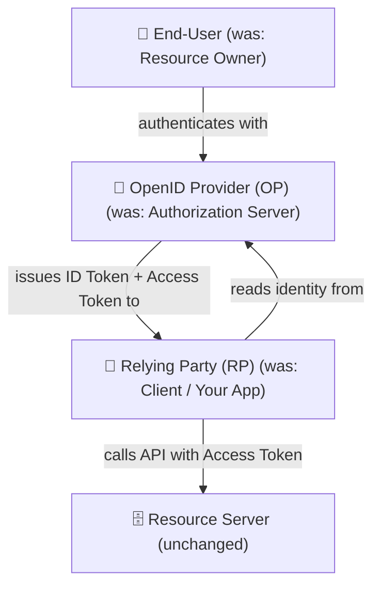
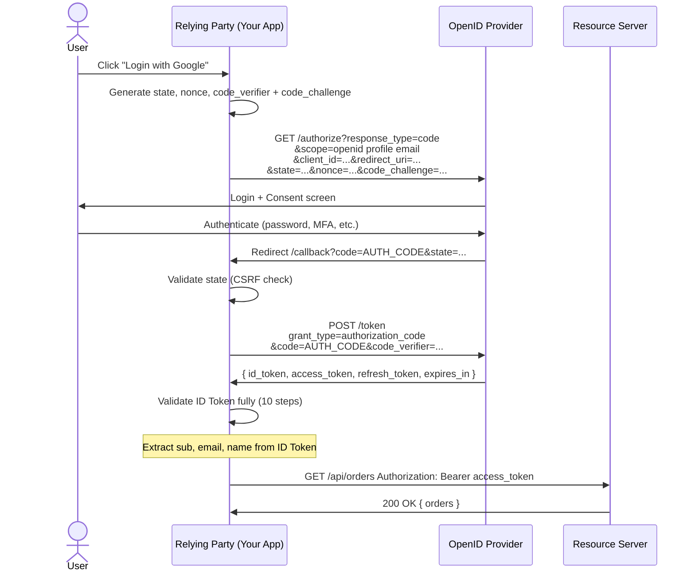
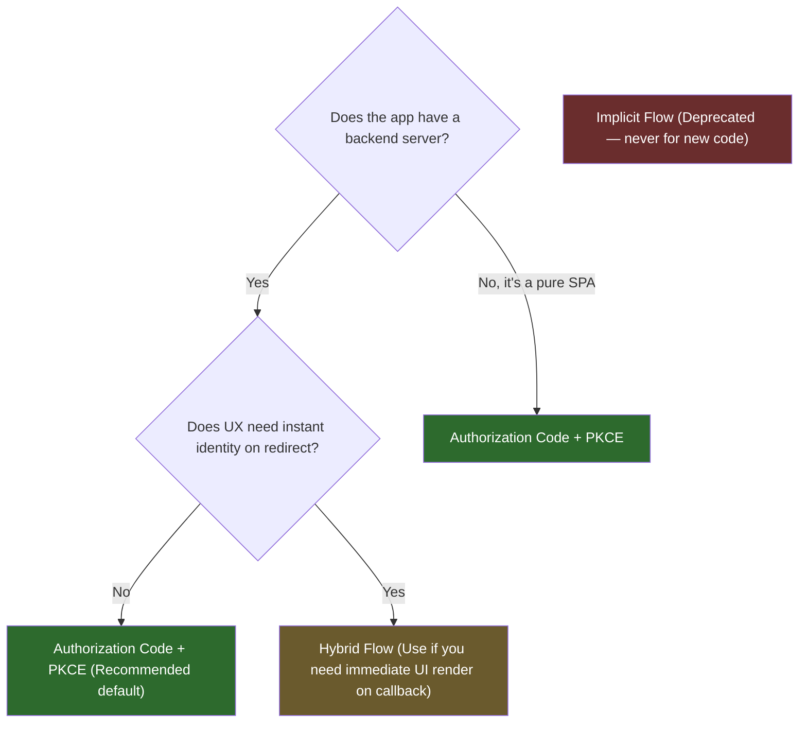
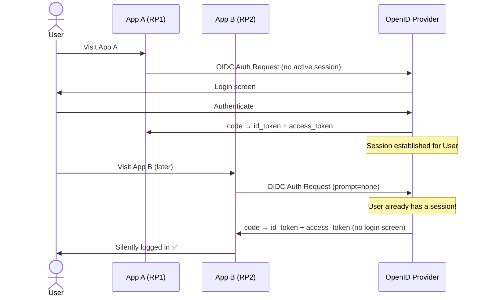

> **TL;DR:** OAuth 2.0 controls *what you can access*. OIDC answers *who you are*. Every "Login with Google" button you've ever clicked runs on OpenID Connect. Most developers implement it without actually understanding it — which is exactly how Token Substitution and Replay Attacks happen. This post fixes that.

---

## The Gap OAuth Left Behind

In the [OAuth 2.0 deep dive](/posts/oauth-2-deep-dive/), we established one critical rule:

> **OAuth 2.0 is NOT authentication.**

But then a question naturally follows — if OAuth handles authorization, how does your app figure out *who just logged in*?

The naive answer: "I'll just call `/userinfo` with the access token and check the response."

And that works — until you're supporting Google, GitHub, Okta, and your own auth server simultaneously. Each one returns `/userinfo` in a completely different format. You end up writing provider-specific adapters, and the whole system becomes a mess of `if provider == "google"` branches.

This is precisely the gap OpenID Connect was designed to close. OIDC is a standardized identity layer that sits on top of OAuth 2.0. It doesn't replace OAuth. It *extends* it — adding a secure, verifiable, provider-agnostic way to communicate **who the user is** and **how they authenticated**.

---

## OIDC's Precise Definition (The Spec Way)

Here's the thing most tutorials get wrong: OIDC doesn't *perform* authentication. The **OpenID Provider (OP)** does — it handles the login screen, verifies the password, checks MFA. What OIDC standardizes is how the OP *communicates that result* to your application as a tamper-proof token.

Think of it this way: OIDC is the **courier protocol**, not the authentication mechanism itself.

| Concept | Protocol | Core Question |
|---|---|---|
| Authorization | OAuth 2.0 | What is this client allowed to do? |
| Identity delivery | OIDC | Who authenticated, when, and how? |
| Token format | JWT | How is the data encoded and signed? |

---

## New Actors, New Terminology

OIDC inherits OAuth's four-actor model and renames two of them. Knowing both naming conventions is important — specs use OIDC terms, most blog posts use OAuth terms.



**Relying Party (RP)** — Your application. It *relies* on the OP to verify the user's identity. It does not perform authentication itself.

**OpenID Provider (OP)** — The identity service: Google, Okta, Keycloak, or your own. It authenticates the user and issues the ID Token. It knows who the user is; your app doesn't need to.

The single most important trigger in the entire protocol is one scope value:

```
scope=openid
```

Include it in the OAuth authorization request, and it becomes an **OIDC Authentication Request**. Omit it, and it's just standard OAuth. That one word is the entire switch between authorization and identity.


## The ID Token — OIDC's Crown Jewel

The ID Token is what OIDC actually adds. It's a JWT signed by the OP that your application receives and verifies — not to call an API, but to establish **who logged in**.

### Anatomy of an ID Token

```json
{
  "iss": "https://accounts.google.com",
  "sub": "24400320",
  "aud": "your-client-id.apps.googleusercontent.com",
  "exp": 1746112800,
  "iat": 1746109200,
  "auth_time": 1746109199,
  "nonce": "n-0S6_WzA2Mj",
  "acr": "urn:mace:incommon:iap:silver",
  "amr": ["pwd", "otp"],
  "email": "jane@example.com",
  "name": "Jane Doe",
  "picture": "https://example.com/photo.jpg"
}
```

| Claim | Required? | Meaning |
|---|:---:|---|
| `iss` | ✅ | Issuer — URL of the OP. Must match `/.well-known/openid-configuration` exactly |
| `sub` | ✅ | Subject — stable, unique user ID at this OP. Never reassigned |
| `aud` | ✅ | Audience — must include your `client_id`. Reject tokens not meant for you |
| `exp` | ✅ | Expiration — Unix timestamp. Reject tokens past this |
| `iat` | ✅ | Issued At — when the token was created |
| `auth_time` | Conditional | When the user *actually* authenticated (not when the token was issued) |
| `nonce` | Conditional | Anti-replay value from your auth request |
| `acr` | Optional | Authentication Context Class — how strong the auth was |
| `amr` | Optional | Authentication Methods — `["pwd", "otp"]` means password + MFA |
| `azp` | Optional | Authorized Party — for multi-audience tokens |

### ID Token vs. Access Token — Don't Mix Them Up

This is the #1 production mistake with OIDC. Know this table cold:

| Property | ID Token | Access Token |
|---|---|---|
| **Format** | Always JWT | JWT or opaque string |
| **Audience** | Your app (RP) | Resource Server (API) |
| **Purpose** | Who is this user? | What can this client do? |
| **Send to APIs?** | ❌ Never | ✅ Yes, as Bearer token |
| **Validate signature?** | ✅ Always | ✅ Always (if JWT) |

```python
# ❌ THE CLASSIC MISTAKE — using ID token as API access
headers = {"Authorization": f"Bearer {id_token}"}   # Wrong. Stop this.

# ✅ Correct — ID token for identity, access token for API calls
user_info = decode_id_token(id_token)                # Who logged in
api_response = call_api(access_token=access_token)   # What they can access
```

---

## The Full OIDC Authentication Flow

The recommended path is Authorization Code + PKCE, identical to what we covered in OAuth, with one addition: `scope=openid` in the request and an ID Token in the response.



The difference from pure OAuth: two new parameters in the initial request (`scope=openid` and `nonce`), and two new things to validate in the response (the ID Token signature and the `nonce` claim).

---

## The nonce — Your Shield Against Replay Attacks

The `nonce` is one of those things developers skip because nothing breaks immediately — until an attacker replays an old, stolen ID Token.

Here's the attack without `nonce`:

1. Attacker intercepts your ID Token (via XSS, log leak, network sniff).
2. Two days later, the token has expired — but attacker sends it to a different RP using the same OP.
3. That RP only checks the signature and expiry. Token is valid. Attacker is now "you" on that app.

The `nonce` prevents this because it's a one-time, session-bound value:

```python
import secrets
import hashlib
from flask import session, request, redirect


def start_login():
    # Generate and store nonce before redirect
    nonce = secrets.token_urlsafe(32)
    session["oidc_nonce"] = nonce
    session["oidc_state"] = secrets.token_urlsafe(32)

    auth_url = build_auth_url(
        scope="openid profile email",
        nonce=nonce,
        state=session["oidc_state"],
    )
    return redirect(auth_url)


def handle_callback(id_token_raw: str):
    # Validate state first (OAuth CSRF)
    # `request` is Flask's thread-local proxy for the current HTTP request
    assert request.args.get("state") == session.pop("oidc_state"), "CSRF detected"

    # Validate the ID Token (full 10-step validation)
    id_token = validate_id_token(id_token_raw)

    # Validate nonce — this is the replay attack check
    stored_nonce = session.pop("oidc_nonce", None)
    assert id_token.get("nonce") == stored_nonce, "Replay attack detected"

    # ✅ Safe to use identity now
    return establish_session(user_id=id_token["sub"])
```

| Parameter | Protects Against | Where It Lives | Validated When |
|---|---|---|---|
| `state` | CSRF (OAuth layer) | Redirect URL query param | On callback arrival |
| `nonce` | ID Token replay (OIDC layer) | Inside ID Token JWT | During token validation |

> **Senior Lens 🔍** — `state` and `nonce` protect against completely different attacks at different layers. You need both. Treating them as redundant is a misunderstanding that leaves one of those attack surfaces open.


## Validating an ID Token

Spec-level ID Token validation is not optional. Skipping steps maps directly to specific attack classes. Here's the full Python implementation:

```python
import jwt
from jwt import PyJWKClient
from time import time


OIDC_ISSUER = "https://accounts.google.com"
CLIENT_ID = "your-client-id.apps.googleusercontent.com"
JWKS_URI = "https://www.googleapis.com/oauth2/v3/certs"


def validate_id_token(id_token: str, expected_nonce: str) -> dict:
    """
    Full 10-step OIDC ID Token validation per OIDC Core §3.1.3.7
    """
    # Step 1: Fetch signing key from JWKS endpoint
    jwks_client = PyJWKClient(JWKS_URI)
    signing_key = jwks_client.get_signing_key_from_jwt(id_token)

    # Steps 2-6: Validate iss, aud, exp, iat, signature
    payload = jwt.decode(
        id_token,
        signing_key.key,
        algorithms=["RS256"],
        audience=CLIENT_ID,
        issuer=OIDC_ISSUER,
        options={
            "require": ["iss", "sub", "aud", "exp", "iat"],
            "verify_exp": True,
            "verify_iat": True,
        },
    )

    # Step 3: If multiple audiences, azp must be present and match client_id
    if isinstance(payload.get("aud"), list) and len(payload["aud"]) > 1:
        assert payload.get("azp") == CLIENT_ID, "azp mismatch in multi-audience token"

    # Step 7: iat sanity check — reject tokens issued more than 5 minutes in the future
    assert payload["iat"] <= time() + 300, "ID Token issued too far in the future"

    # Step 8: Nonce validation — replay attack prevention
    if expected_nonce:
        assert payload.get("nonce") == expected_nonce, "Nonce mismatch — replay attack?"

    # Step 9: acr validation (if your app requires a minimum auth strength)
    # if "urn:mace:incommon:iap:silver" not in payload.get("acr", ""):
    #     raise ValueError("Insufficient authentication strength")

    # Step 10: auth_time — if max_age was requested, verify freshness
    # if "auth_time" in payload:
    #     assert time() - payload["auth_time"] < MAX_AGE, "Authentication too old"

    return payload
```

| Validation Step | Attack It Prevents |
|---|---|
| Signature (JWKS) | Token forgery |
| `iss` exact match | Issuer spoofing |
| `aud` contains your `client_id` | Token misuse across apps |
| `azp` check (multi-audience) | Authorized party interception |
| `exp` not expired | Stale token reuse |
| `iat` not in far future | Clock manipulation |
| `nonce` match | Replay attacks |
| `acr` level check | Weak-auth privilege escalation |
| `auth_time` freshness | Session fixation |

---

## Scopes and Claims — The Gatekeeper-to-Payload Model

Scopes and claims are partners in OIDC, but they operate at different layers. Conflating them leads to over-privileged tokens and consent screens that users don't understand.

**Scopes** are permission *requests* — coarse-grained categories of access a client asks for.
**Claims** are factual *assertions* inside a token — fine-grained key-value pairs about the user.

```
Scope = Label on the door ("I want the profile room")
Claim = Contents of the room ("name: Jane, picture: ...")
```

### Standard OIDC Scope → Claims Mapping

| Scope | Claims Returned |
|---|---|
| `openid` | `sub` (mandatory — this is what makes it OIDC) |
| `profile` | `name`, `given_name`, `family_name`, `nickname`, `picture`, `birthdate`, `locale`, `updated_at` |
| `email` | `email`, `email_verified` |
| `phone` | `phone_number`, `phone_number_verified` |
| `address` | `address` (full JSON object) |

```python
# Request only what you actually need
MINIMAL_SCOPES = "openid email"           # Login + email verification only
PROFILE_SCOPES = "openid profile email"   # Login + display name + avatar
FULL_SCOPES    = "openid profile email phone address"  # Rarely justified

# ❌ Don't ask for everything — users see the consent screen
```

### Custom Claims for Your Domain

The standard claims cover identity basics. For application-specific data (roles, org ID, subscription plan), add custom claims to your authorization server config:

```python
# Custom claim embedded in ID Token (Keycloak / Auth0 rule equivalent)
# In Keycloak: via Protocol Mappers
# In Auth0: via Actions/Rules

# What your RP receives with custom claims:
id_token_payload = {
    "sub": "user_abc123",
    "email": "jane@example.com",
    "name": "Jane Doe",
    # Custom claims — namespace them to avoid collisions
    "https://myapp.com/roles": ["admin", "editor"],
    "https://myapp.com/org_id": "org_xyz789",
    "https://myapp.com/plan": "enterprise",
}

def get_user_roles(id_token_payload: dict) -> list:
    return id_token_payload.get("https://myapp.com/roles", [])
```

> **Senior Lens 🔍** — Always namespace custom claims with a URL you control (`https://yourdomain.com/claim-name`). Flat names like `"roles"` or `"org"` can collide with future OIDC spec additions, and different providers handle collisions differently. One collision in production is enough to teach you this lesson permanently.


## The UserInfo Endpoint — When the ID Token Isn't Enough

The ID Token is intentionally lean. Jamming every profile field into a JWT that travels through URL fragments (in Hybrid flow) or gets stored in sessions would hit size limits and create bloated tokens that must be decoded everywhere.

The UserInfo Endpoint is the solution: a protected API endpoint that returns all requested claims as JSON when called with a valid access token.

```python
import httpx


async def fetch_userinfo(
    access_token: str,
    userinfo_endpoint: str = "https://openidconnect.googleapis.com/v1/userinfo"
) -> dict:
    async with httpx.AsyncClient() as client:
        response = await client.get(
            userinfo_endpoint,
            headers={"Authorization": f"Bearer {access_token}"},
        )
        response.raise_for_status()
        userinfo = response.json()

    # ⚠️ CRITICAL: sub must match the ID Token's sub
    # This prevents Token Substitution Attacks
    return userinfo


def merge_identity(id_token_payload: dict, userinfo: dict) -> dict:
    """Safely merge ID Token claims with UserInfo, with sub binding check."""
    if id_token_payload["sub"] != userinfo.get("sub"):
        raise SecurityError(
            "sub mismatch between ID Token and UserInfo — Token Substitution Attack?"
        )

    # ID Token claims are authoritative for security-critical fields
    merged = {**userinfo, **id_token_payload}
    return merged
```

### The Token Substitution Attack — Why sub Matching Is Non-Negotiable

Scenario: An attacker has a valid access token for their *own* account. They use it to call your app's UserInfo endpoint, hoping to fetch *your* account's data.

Without the `sub` binding check:
1. Attacker authenticates and gets `id_token` (sub = attacker_id).
2. Attacker swaps their access token with yours.
3. Your app calls UserInfo → gets *your* profile.
4. Attacker is now logged in as you.

With the check: `id_token.sub ≠ userinfo.sub` → immediate rejection.


## The Three OIDC Flows — When to Use Each

OIDC defines three flows based on the `response_type` parameter. The right choice in 2026 is almost always clear:



| Flow | `response_type` | Tokens From | Use Today? |
|---|---|---|:---:|
| Authorization Code | `code` | Token Endpoint only | ✅ Yes |
| Implicit | `id_token` / `id_token token` | Authorization Endpoint | ❌ Deprecated |
| Hybrid | `code id_token` | Both endpoints | ⚠️ Niche use only |

The **Hybrid Flow** exists for a specific UX tradeoff: the RP receives the ID Token immediately on redirect and can render the user's name/avatar instantly, while the `code` is exchanged for the access token in the background. To ensure the `code` wasn't tampered with in transit, the ID Token contains a `c_hash` claim (a truncated SHA-256 of the code):

```python
import hashlib
import base64


def verify_c_hash(auth_code: str, c_hash_in_token: str) -> bool:
    """Verify the c_hash claim in Hybrid Flow ID Tokens."""
    # SHA-256 hash of the code, take left half (128 bits), base64url encode
    digest = hashlib.sha256(auth_code.encode("ascii")).digest()
    left_half = digest[:16]  # First 128 bits
    computed = base64.urlsafe_b64encode(left_half).rstrip(b"=").decode("ascii")
    return computed == c_hash_in_token
```

## Single Sign-On (SSO) — OIDC's Killer Feature

SSO is where OIDC shines beyond simple login. With a single OP and multiple RPs, a user authenticates once and is silently logged into all connected applications.



The flow has **2 acts** — one login, two apps logged in.

**Act 1 — The only real login (App A)**
App A has no active session, so it sends a full OIDC Auth Request to the OP. The user sees a login screen, authenticates, and gets redirected back with a `code` that App A exchanges for an `id_token` and `access_token`. Crucially — the OP now **sets a session cookie in the user's browser** tied to the OP's domain. This is the session that makes everything else possible.

**Act 2 — The silent login (App B)**
When the user visits App B later, App B sends its own OIDC Auth Request — but with `prompt=none`. This tells the OP: *"check if the user has a session, but show absolutely no UI."* The OP finds its session cookie, silently issues a fresh `code` for App B, and redirects back. App B exchanges it for tokens exactly as App A did. The user never saw a login screen.

> The OP's session cookie is the invisible thread connecting all apps. **Each RP still gets its own tokens** — App A's access token cannot be used by App B. SSO means one authentication, not one shared token.

> **If App B's `prompt=none` request fails** — the OP returns `error=login_required` instead of a `code`. App B must catch this and silently retry with a full login redirect. From the user's perspective, they just see a normal login screen — they never know the silent attempt happened.

This is exactly how "Login with Google" feels instant when you're already signed into Gmail, but shows a login screen when you're not — the app tried `prompt=none` first, got `login_required`, and fell back gracefully.

### Silent Authentication Check

```python
async def check_sso_session(client_id: str, redirect_uri: str) -> bool:
    """
    Use prompt=none to silently check if user has an active OP session.
    This runs in a hidden iframe or background redirect.
    """
    auth_url = (
        f"{OP_AUTHORIZE_ENDPOINT}"
        f"?response_type=code"
        f"&scope=openid"
        f"&client_id={client_id}"
        f"&redirect_uri={redirect_uri}"
        f"&prompt=none"   # ← The key: do NOT show any UI
        f"&state={generate_state()}"
    )
    # If the user has a session: OP redirects back with code
    # If not: OP redirects back with error=login_required
    return auth_url
```

### The `prompt` Parameter — Controlling Auth UX

| `prompt` Value | Behavior | Use Case |
|---|---|---|
| *(not set)* | OP decides (use existing session if valid) | Normal login |
| `none` | No UI shown — return error if no session | Silent SSO check |
| `login` | Force re-authentication even with active session | Sensitive operations |
| `consent` | Force consent screen even if previously granted | Updated scope requests |
| `select_account` | Show account picker | Multi-account support |


## The Discovery Document — Zero-Config Integration

Every production OIDC provider exposes a standardized discovery document at:

```
{issuer}/.well-known/openid-configuration
```

This JSON document tells your RP *everything* it needs: endpoints, supported algorithms, JWKS URI, scopes, and claims. Hard-coding endpoint URLs is a maintenance trap. Use discovery:

```python
import httpx
from functools import lru_cache
from dataclasses import dataclass


@dataclass
class OIDCConfig:
    issuer: str
    authorization_endpoint: str
    token_endpoint: str
    userinfo_endpoint: str
    jwks_uri: str
    scopes_supported: list
    claims_supported: list
    id_token_signing_alg_values_supported: list


@lru_cache(maxsize=4)  # Cache per issuer — these change rarely
async def fetch_oidc_config(issuer: str) -> OIDCConfig:
    discovery_url = f"{issuer.rstrip('/')}/.well-known/openid-configuration"

    async with httpx.AsyncClient() as client:
        response = await client.get(discovery_url)
        response.raise_for_status()
        data = response.json()

    # Spec requires: issuer in document MUST match the URL we fetched from
    assert data["issuer"] == issuer, (
        f"Issuer mismatch: expected {issuer}, got {data['issuer']}"
    )

    return OIDCConfig(
        issuer=data["issuer"],
        authorization_endpoint=data["authorization_endpoint"],
        token_endpoint=data["token_endpoint"],
        userinfo_endpoint=data["userinfo_endpoint"],
        jwks_uri=data["jwks_uri"],
        scopes_supported=data.get("scopes_supported", []),
        claims_supported=data.get("claims_supported", []),
        id_token_signing_alg_values_supported=data.get(
            "id_token_signing_alg_values_supported", ["RS256"]
        ),
    )


# Usage
config = await fetch_oidc_config("https://accounts.google.com")
print(config.token_endpoint)  # https://oauth2.googleapis.com/token
```

> **Senior Lens 🔍** — Cache the discovery document with a TTL (not indefinitely), and cache the JWKS with the same strategy. JWKS keys rotate — providers publish new keys *before* retiring old ones with an overlap window. If you cache forever, you'll reject valid tokens after a key rotation and have a production incident at 2 AM.


## OIDC Logout — The Part Everyone Skips Until It Breaks

Login is 20% of the auth story. The other 80% is logout, session management, and token revocation. OIDC defines three logout mechanisms:

### 1. RP-Initiated Logout

Your app redirects the user to the OP's logout endpoint:

```python
def logout_url(
    id_token_hint: str,
    post_logout_redirect_uri: str,
    end_session_endpoint: str,
) -> str:
    """
    Build OP logout URL. id_token_hint tells the OP which session to end.
    Without it, OP may show a confirmation screen or log out all sessions.
    """
    return (
        f"{end_session_endpoint}"
        f"?id_token_hint={id_token_hint}"
        f"&post_logout_redirect_uri={post_logout_redirect_uri}"
        f"&state={secrets.token_urlsafe(16)}"
    )
```

### 2. Back-Channel Logout (Server-to-Server)

The OP sends a `POST` to your logout endpoint when a session ends anywhere. This is how "logout on one device, logout everywhere" works:

```python
from fastapi import FastAPI, Form, HTTPException

app = FastAPI()

@app.post("/oidc/backchannel-logout")
async def backchannel_logout(logout_token: str = Form(...)):
    """
    OP calls this endpoint when user logs out from ANY app or the OP directly.
    Validate the logout token, then invalidate the local session.
    """
    # Logout token is a JWT — validate it (same as ID Token but different claims)
    payload = jwt.decode(
        logout_token,
        signing_key,
        algorithms=["RS256"],
        audience=CLIENT_ID,
        issuer=OIDC_ISSUER,
    )

    # Logout token MUST contain 'sid' or 'sub', and MUST have events claim
    assert "http://schemas.openid.net/event/backchannel-logout" in payload.get("events", {})

    sub = payload.get("sub")
    sid = payload.get("sid")

    # Invalidate all sessions for this sub/sid
    await invalidate_user_sessions(sub=sub, session_id=sid)
    return {"logged_out": True}
```

### 3. Front-Channel Logout

OP loads a hidden `<iframe>` with your logout URL. Simpler, but less reliable (browser might block third-party cookies, iframes can be silently killed). Prefer Back-Channel Logout for anything important.


## Pairwise Subject Identifiers — Privacy by Design

By default, OIDC uses **public** subject identifiers — the same `sub` value for a given user is returned to every RP. This means two apps can compare `sub` values and correlate the same person across platforms.

**Pairwise** identifiers solve this: the OP generates a *different* `sub` for each RP. App A and App B get different `sub` values for the same user. Cross-app tracking becomes cryptographically impossible.

```python
import hashlib
import hmac


def compute_pairwise_sub(
    user_id: str,
    client_id: str,
    sector_identifier: str,
    salt: bytes,
) -> str:
    """
    Compute a Pairwise Pseudonymous Identifier (PPID).
    Same user + different client_id = different sub.
    """
    # sector_identifier groups clients that should share the same sub
    # (e.g., multiple apps from the same company)
    key = f"{sector_identifier}:{user_id}".encode()
    digest = hmac.new(salt, key, hashlib.sha256).digest()
    return base64.urlsafe_b64encode(digest).rstrip(b"=").decode()


# For the same user:
sub_for_app_a = compute_pairwise_sub("user123", "app-a", "example.com", SALT)
sub_for_app_b = compute_pairwise_sub("user123", "app-b", "example.com", SALT)
# sub_for_app_a != sub_for_app_b — same user, different identifiers
```

> **Senior Lens 🔍** — Pairwise identifiers matter most in B2C applications handling sensitive data (healthcare, finance, legal). If you're building a platform where users interact with multiple third-party apps, pairwise identifiers are the privacy-respecting default. The tradeoff: you can't use `sub` to link a user across your own apps without a central mapping table.


## OIDC vs SAML — Know When to Negotiate

If you work in enterprise software, you'll encounter SAML — the older XML-based federation protocol. Knowing the tradeoff saves you from being steamrolled in client calls:

| Dimension | OIDC | SAML 2.0 |
|---|---|---|
| Token Format | JWT (JSON, compact) | XML assertions (verbose) |
| Transport | HTTP redirect, POST, Bearer | HTTP POST, Redirect, Artifact |
| Mobile/SPA friendly | ✅ Excellent | ❌ Poor (XML in mobile = pain) |
| Enterprise SSO legacy | ⚠️ Growing support | ✅ Universal support |
| Setup complexity | Moderate | High |
| Debugging | Easy (JWT.io) | Painful (XML namespaces) |
| Spec age | 2014 | 2005 |

In 2026, OIDC is the right choice for new integrations. SAML support is a cost you pay for enterprise customers who refuse to migrate. Most modern IdPs (Okta, Azure AD, Keycloak) support both.


## Closing Thoughts

The relationship between OAuth and OIDC is like the relationship between a delivery network and an ID card system. OAuth ensures parcels (API calls) go to the right address with the right permissions. OIDC ensures you know exactly who handed you the parcel in the first place.

Every "Sign in with Google" button, every enterprise SSO portal, every federated identity system is built on these 15 years of OIDC spec work. Understanding it properly — the `nonce`, the `sub` binding, the `aud` check, the UserInfo `sub` match — is what separates an auth implementation that passes a code review from one that survives a security audit.

The spec is strict for good reasons. Every validation step maps to a real attack that was pulled off in the wild. Trust the spec.


*This post is part of the Auth Deep Dive series. Read the previous post: [OAuth 2.0 — A Senior SDE's Field Guide](/posts/oauth-2-deep-dive/). Next up: [JWT — Anatomy, Attacks, and Why `alg:none` Should Terrify You](/posts/authentication-deep-dive-jwt/).*
