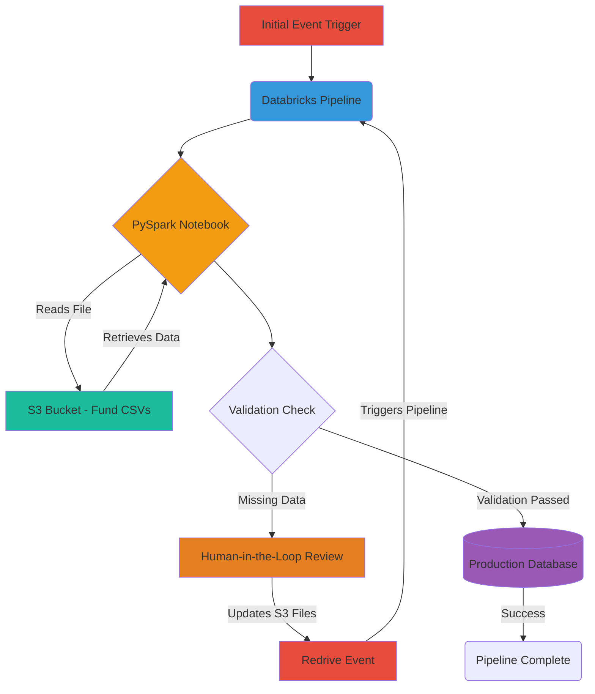

## Table of Contents

1. [Introduction](#introduction)
2. [The Business Context: Human-in-the-Loop Ingestion](#the-business-context-human-in-the-loop-ingestion)
3. [The Architecture](#the-architecture)
4. [The Problem: The "Race Condition" Illusion](#the-problem-the-race-condition-illusion)
5. [Unmasking the Caches: A Debugging Story](#unmasking-the-caches)
6. [The Final Solution: The Cache-Busting PySpark Code](#the-final-solution-the-cache-busting-pyspark-code)

## Introduction

In the world of cloud data engineering, few things are more maddening than a pipeline failing with a concurrency error when you know, with absolute certainty, that your job is the *only* process interacting with that data.

In highly optimized environments like Databricks, caching is designed to accelerate performance and reduce remote API calls. However, when your architecture demands absolute consistency—especially when handling high-frequency events accessing identical file paths—these optimization layers can become invisible traps.

This article walks through a real-world debugging story of a pernicious caching issue that haunted a complex financial data pipeline. It looked like a classic concurrency bug, but it turned out to be a multi-layered caching architecture acting as a sabotage agent.

## The Business Context: Human-in-the-Loop Ingestion

To understand why this bug was so persistent, you need to understand the "why" behind the pipeline.

We were not just dealing with a simple daily data dump; we were processing **fund statement ingestions**. These datasets are inherently complex, often distributed across multiple quite large CSV files for a single statement.

Because of the strict requirements around financial data, the pipeline couldn't simply drop records or proceed with gaps if it encountered anomalies. To handle this, we implemented a **human-in-the-loop** workflow.

If the PySpark job detected missing or malformed data during processing, it would halt. A human operator would then review the failure, manually correct or append the missing information directly into the S3 source files, and initiate a **redrive**. This redrive essentially triggered the exact same event, forcing the pipeline to start over from the beginning and re-read the newly updated files.

## The Architecture

Here is how the event-driven, human-augmented ingestion loop was designed:



The logic was built to be resilient: Read the complex S3 files, validate the data, allow human intervention if necessary, write the clean data to the database, and mark the job as complete.

## The Problem: The "Race Condition" Illusion

The pipeline ran perfectly on the first pass. But problems arose during the **redrive event**.

After the human-in-the-loop operator fixed the S3 files and retriggered the pipeline, the `fund_statement_ingestion` job would abruptly crash during the S3 read phase with a `RemoteFileChangedException`. The error message essentially stated: *The S3 file has been updated since the last read. Race condition detected.*

This was completely baffling. Yes, the file *was* updated by our operator, but it was strictly sequential. There were no concurrent jobs running; this specific pipeline was the only active consumer of that S3 path. Why was PySpark accusing the job of a race condition?

The investigation revealed that this wasn't a logic bug in our application, but a coordinated effort by multiple independent caching layers across the Hadoop client, the Databricks I/O engine, and the Databricks query planner trying to be "helpful."

## Unmasking the Caches

To resolve the exception and force Databricks to faithfully read the live, operator-updated S3 file upon every redrive, we had to systematically dismantle caching at four different architectural layers.

### Layer 1: S3Guard & The Metadata Store

Historically, Amazon S3 was only "eventually consistent." To bridge this gap, Hadoop introduced S3Guard, which caches S3 metadata to simulate strong consistency.

Because modern S3 is strongly consistent, relying on this legacy metadata cache during rapid, human-driven file updates serves only to provide the Spark application with stale file state information. To bypass this, we configured the metadata store implementation to use the `NullMetadataStore`. This explicit instruction tells the system to avoid secondary caching and fetch the metadata directly from the source bucket.

### Layer 2: The Hadoop S3A Client Cache

When Spark reads files from S3 using the `s3a://` URI, the underlying Hadoop FileSystem client (`S3AFileSystem`) persists its connection and metadata state within the JVM.

When the job ran the first time and failed validation, the S3A client cached the original file's metadata. When the operator redrove the pipeline, PySpark reused that cached client instance. Upon the second read, the client noticed a discrepancy: the actual S3 file had a newer modification timestamp (from the human fix) than its cached version, triggering its safety mechanisms. Setting `fs.s3a.impl.disable.cache` to true forces Hadoop to clear persisted connection states and create a fresh S3A client for every read operation.

### Layer 3: Databricks DBIO & Local Disk Caching

Databricks implements an automatic storage optimization known as the DBFS Local Disk Cache (or DBIO cache). It creates copies of remote data blocks on the local NVMe SSDs of the worker nodes.

Even with the Hadoop client cache disabled, the Databricks cluster itself attempts to optimize the read via local storage. When it detects an S3 file modification post-caching, the internal synchronization mechanism throws an exception to prevent data corruption. Disabling `spark.databricks.io.cache.enabled` ensures data blocks are always fetched from S3 rather than local SSDs. Furthermore, setting `spark.databricks.io.cache.maxMetaDataCache` prevents worker nodes from caching file attributes (like size and timestamps) locally, enforcing fresh lookups.

### Layer 4: The Loki File Status Cache

The final boss of this debugging journey was the query planner. Databricks utilizes an internal consistency check—the "Loki" cache—which caches file statuses during the query planning phase.

If a file's metadata changes in the fractional time between when Spark plans the query and executes it (or if stale state lingers during a rapid redrive), Loki panics and throws the `RemoteFileChangedException`. Disabling `databricks.loki.fileStatusCache.enabled` turns off this internal consistency check. Additionally, configuring `spark.hadoop.databricks.loki.fileStatusCache.enabled` guarantees this instruction propagates correctly through the Hadoop configuration layer down to the filesystem client.

## The Final Solution: The Cache-Busting PySpark Code

To implement this robustly, all configuration flags must be passed as read options when initializing the DataFrame. This ensures the ingestion job bypasses all optimization traps and strictly reads the live, current state of the operator-corrected S3 file.

```python
from pyspark.sql import SparkSession

def statement_ingestion(spark: SparkSession, s3_file_path: str, iam_assume_role: str = None):
    """
    Reads complex fund statement CSVs with all metadata and data caching explicitly 
    disabled to prevent RemoteFileChangedExceptions on human-in-the-loop redrives.
    """
    
    # The Cache-Busting Read Options
    read_opts = {
        "header": "true",
        "inferSchema": "true",
        
        # 1. Disable S3Guard Metadata Cache
        "fs.s3a.metadatastore.impl": "org.apache.hadoop.fs.s3a.s3guard.NullMetadataStore",
        
        # 2. Disable Hadoop S3A Client Cache
        "fs.s3a.impl.disable.cache": "true",
        
        # 3. Disable DBIO Disk Cache and Worker Metadata Cache
        "spark.databricks.io.cache.enabled": "false",
        "spark.databricks.io.cache.maxMetaDataCache": "0",
        
        # 4. Disable Loki internal consistency checks (Query Planner)
        "databricks.loki.fileStatusCache.enabled": "false",
        "spark.hadoop.databricks.loki.fileStatusCache.enabled": "false"
    }

    # Append AWS Assume Role credentials if required
    if iam_assume_role is not None:
        read_opts |= {
            "fs.s3a.aws.credentials.provider": "org.apache.hadoop.fs.s3a.auth.AssumedRoleCredentialProvider",
            "fs.s3a.assumed.role.arn": iam_assume_role,
        }

    try:
        # Perform the read with the iron-clad options
        df_new_data = spark.read.options(**read_opts).csv(s3_file_path)
        print(f"Successfully read {df_new_data.count()} rows from S3.")
        return df_new_data
        
    except Exception as e:
        print(f"Error reading fund statements from S3: {e}")
        raise e

```

## Conclusion

Caching is your best friend when building performant big data pipelines, but it requires a deep understanding of the framework's internal architecture. When a pipeline relies on sequential, human-driven updates to an identical file path, default caching mechanisms transform from performance boosters into silent failure points.

By systematically bypassing the S3Guard, the S3A client cache, the Databricks DBIO cache, and the Loki query planner cache, you can eliminate false race conditions and build highly resilient, human-in-the-loop data ingestion workflows.
