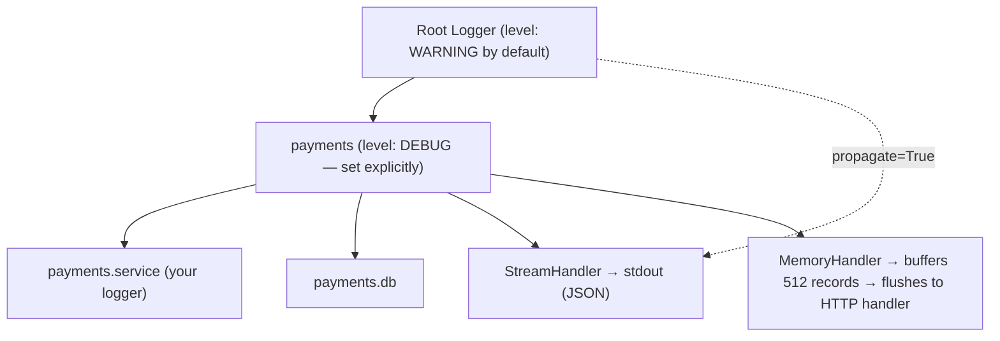
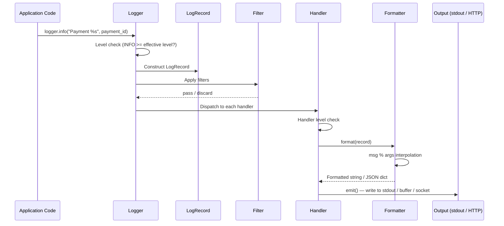
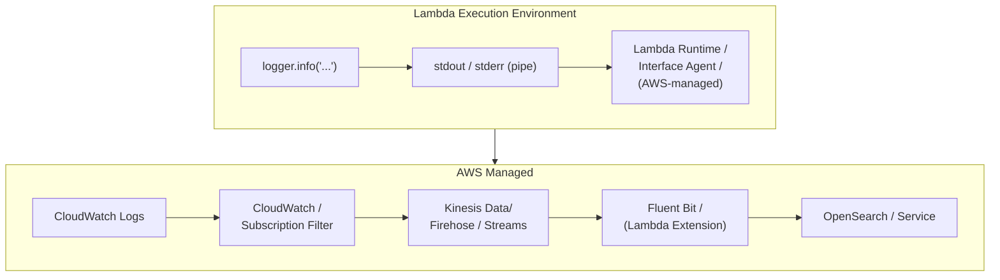
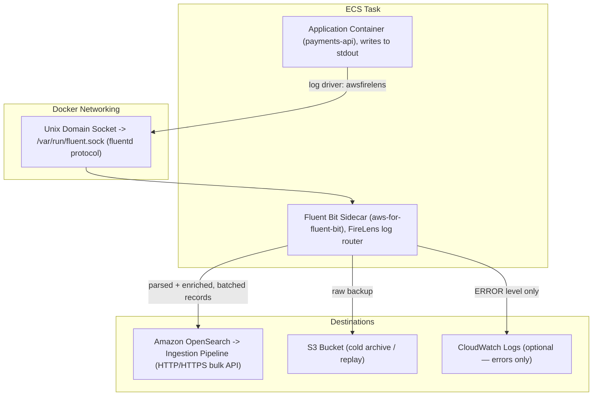
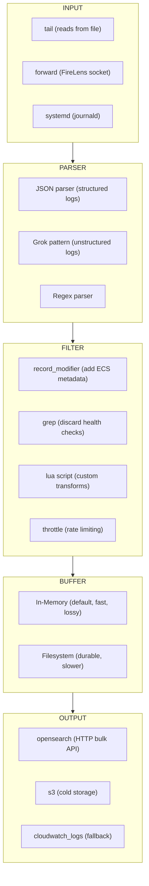
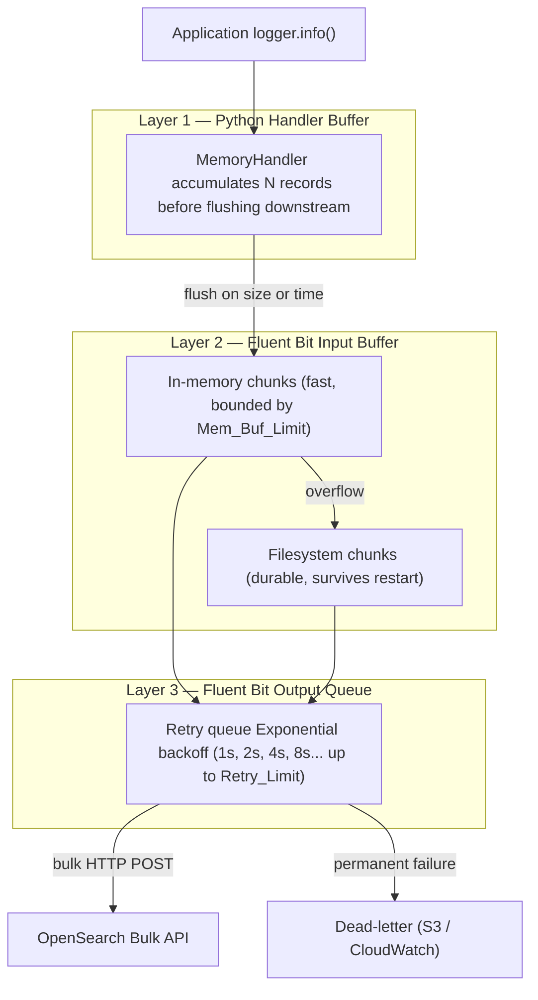

So far in this series we have explored how OpenSearch indexes application data and how reindexing works under the hood. Both posts dealt with data you *intentionally* write — product catalogs, user records, domain documents. This post shifts focus entirely to data your application *emits as a side effect* of doing its work: **logs**.

Logging sounds simple. You call `logger.info("Payment processed")` and something, somewhere, records it. But once you are running hundreds of Lambda invocations in parallel or a fleet of ECS tasks handling thousands of requests per second, that "something, somewhere" becomes a carefully engineered pipeline with buffering, batching, backpressure, network compression, and index lifecycle management. Getting it wrong means either drowning your OpenSearch cluster in writes or losing log data under load — both are painful in production.

This is Part 1 of a two-part series. Here we will go deep on what happens **at the application and container level** — from the moment your code calls `logger.info()` all the way to the point where log records leave the machine and enter the collection pipeline. In Part 2 we will cover what happens inside that pipeline: OpenSearch Ingestion, index strategy, network optimisation, and building a full observability stack on AWS.

---

## Table of Contents

1. [The Problem: Logs at Scale on AWS](#the-problem-logs-at-scale-on-aws)
2. [What Actually Happens When You Call logger.info()](#what-actually-happens-when-you-call-loggerinfo)
3. [Structured Logging in FastAPI](#structured-logging-in-fastapi)
4. [Lambda Logging Internals](#lambda-logging-internals)
5. [ECS Logging Internals](#ecs-logging-internals)
6. [Log Shipping with Fluent Bit](#log-shipping-with-fluent-bit)
7. [Backpressure, Buffering, and What Happens When OpenSearch Is Slow](#backpressure-buffering-and-what-happens-when-opensearch-is-slow)
8. [Key Takeaways](#key-takeaways)

---

## The Problem: Logs at Scale on AWS

Consider a moderately busy system: 10 ECS tasks each handling 200 requests per second, plus a fleet of Lambda functions. Each request emits 3–5 log lines. That is conservatively **6,000 log records per second** — 500 million log records per day, which at ~500 bytes per structured JSON record is roughly **250 GB of log data daily**.

Naively streaming each log line synchronously to OpenSearch via an HTTP POST would:

- Saturate your network link with thousands of tiny TCP connections
- Overwhelm OpenSearch's indexing threads with high-overhead single-document requests
- Introduce network latency into your application's critical path
- Lose log data silently when OpenSearch has a momentary issue

Every component between `logger.info()` and the OpenSearch shard is designed to address these problems. Understanding that chain end-to-end is what separates an observability system that holds up at 3 AM from one that silently drops 30% of your logs.

---

## What Actually Happens When You Call logger.info()

Python's `logging` module looks simple from the outside. Under the hood it is a small but carefully designed system. When you write `logger.info("Payment processed")`, the following sequence of events unfolds entirely within your process before a single byte hits the network.

### The Logger Hierarchy

Python loggers form a tree rooted at the **root logger**. When you call `logging.getLogger("payments.service")`, you get (or create) a logger at that dotted-path location. If that logger has no handlers of its own, log records travel *up* the tree toward the root logger, which handles them.



The `propagate` flag controls whether a log record continues climbing the tree after being handled at one level. This is why you sometimes see duplicate log lines — a logger handles the record *and* propagates it to a parent that also has a handler.

### Inside a Single logger.info() Call

```python
import logging
import sys

logger = logging.getLogger("payments.service")
```

**Step 1 — Level Check (fast path)**

Before anything else, the logger checks whether `INFO` is enabled at its effective level. This is an integer comparison — the entire call costs ~50 nanoseconds if INFO is disabled. This is why you should never write `logger.debug(f"State: {expensive_function()}")` — the f-string is evaluated *before* the level check even happens. The correct pattern is `logger.debug("State: %s", expensive_function())`, which defers evaluation.

**Step 2 — LogRecord Construction**

If the level passes, Python constructs a `LogRecord` object. This is more expensive than most engineers realise:

```python
import os
import sys
import time
import threading

class LogRecord:
    def __init__(self, name, level, pathname, lineno, msg, args, exc_info):
        # Timestamp — time.time() system call
        self.created = time.time()
        self.msecs = (self.created - int(self.created)) * 1000

        # Stack introspection — finds the calling frame to extract filename/lineno
        # This is the most expensive part: sys._getframe() traverses the call stack
        self.filename = os.path.basename(pathname)
        self.lineno = lineno
        self.funcName = "<unknown>"   # populated from frame inspection

        # Thread/process context — useful for correlating concurrent log lines
        self.thread = threading.get_ident()
        self.threadName = threading.current_thread().name
        self.process = os.getpid()

        # The actual message — NOT yet formatted
        self.msg = msg
        self.args = args   # lazy: msg % args happens only during formatting
```

Notice that `msg % args` (the actual string interpolation) has not happened yet. It is deferred until a handler actually needs to format the record. If a filter discards the record before formatting, you pay zero string interpolation cost.

**Step 3 — Filter Chain**

Each logger and each handler can have a list of `Filter` objects. Filters receive the full `LogRecord` and return True (keep) or False (discard). This is where you implement sampling — for example, passing only 1 in 100 DEBUG records in production.

**Step 4 — Handler Dispatch**

The record is passed to each handler attached to this logger (and parent loggers if `propagate=True`). A handler's job is two things: decide if it should handle this record (its own level check), then emit it.

**Step 5 — Formatter**

Inside the handler's `emit()` method, the formatter converts the `LogRecord` into a string (or a dict, for structured logging). This is where `msg % args` finally executes, and where you can add additional fields.



### Why This Matters for Performance

The most common logging performance mistake is putting work *outside* the lazy evaluation path:

```python
# BAD — builds the dict even if DEBUG is disabled (or filtered out)
logger.debug(f"Full cart state: {json.dumps(cart.to_dict())}")

# GOOD — dict construction is deferred; only happens if DEBUG passes all filters
logger.debug("Full cart state: %s", cart.to_dict())

# ALSO GOOD — explicit guard for genuinely expensive operations
if logger.isEnabledFor(logging.DEBUG):
    logger.debug("Full cart state: %s", cart.to_dict())
```

At 200 req/s per container, the "bad" pattern above adds measurable overhead even when debug logging is disabled — because `json.dumps()` runs on every request regardless.

---

## Structured Logging in FastAPI

Plain-text logs like `"Payment abc123 processed in 45ms"` are human-readable but operationally painful. To search, filter, or aggregate logs in OpenSearch you need **structured logs** — JSON objects with consistent, typed fields.

### A Production-Grade JSON Formatter

```python
import json
import logging
import traceback
from datetime import datetime, timezone


class JSONFormatter(logging.Formatter):
    """
    Formats log records as JSON objects suitable for OpenSearch ingestion.
    Produces one JSON object per line (NDJSON), which Fluent Bit can parse
    without a Grok pattern.
    """

    # Fields that are always present in every log record
    ALWAYS_PRESENT = {
        "timestamp", "level", "logger", "message",
        "service", "environment", "host"
    }

    def __init__(self, service_name: str, environment: str):
        super().__init__()
        self.service_name = service_name
        self.environment = environment

        # Grab hostname once at startup — no point calling socket.gethostname()
        # on every log line
        import socket
        self.hostname = socket.gethostname()

    def format(self, record: logging.LogRecord) -> str:
        # Base fields present on every log line
        log_entry = {
            "timestamp": datetime.fromtimestamp(
                record.created, tz=timezone.utc
            ).isoformat(),                          # ISO-8601 with timezone — OpenSearch date format
            "level": record.levelname,              # "INFO", "ERROR", etc.
            "logger": record.name,                  # "payments.service"
            "message": record.getMessage(),         # Final formatted message string
            "service": self.service_name,
            "environment": self.environment,
            "host": self.hostname,
            "module": record.module,
            "function": record.funcName,
            "line": record.lineno,
            "thread": record.threadName,
        }

        # Attach exception info if present — full traceback as a string
        # so OpenSearch can index and search it
        if record.exc_info:
            log_entry["exception"] = {
                "type": record.exc_info[0].__name__,
                "message": str(record.exc_info[1]),
                "traceback": traceback.format_exception(*record.exc_info)
            }

        # Any extra fields the caller added via the 'extra' parameter
        # e.g. logger.info("...", extra={"request_id": "abc", "user_id": 42})
        for key, value in record.__dict__.items():
            if key not in logging.LogRecord.__dict__ and key not in self.ALWAYS_PRESENT:
                log_entry[key] = value

        return json.dumps(log_entry, default=str)   # default=str handles non-serialisable types


def configure_logging(service_name: str, environment: str, level: str = "INFO"):
    """Call this once at application startup."""

    formatter = JSONFormatter(service_name=service_name, environment=environment)

    # StreamHandler writes to stdout — the container runtime captures stdout
    # and forwards it to the logging driver (awslogs, FireLens, etc.)
    handler = logging.StreamHandler()
    handler.setFormatter(formatter)

    # Configure the root logger — all loggers in the process inherit this
    root = logging.getLogger()
    root.setLevel(level)
    root.addHandler(handler)

    # Suppress noisy third-party library loggers
    logging.getLogger("urllib3").setLevel(logging.WARNING)
    logging.getLogger("botocore").setLevel(logging.WARNING)
    logging.getLogger("opensearchpy").setLevel(logging.WARNING)
```

### FastAPI Middleware for Automatic Request Logging

Rather than adding log calls inside every route handler, use middleware to automatically capture the full request/response cycle:

```python
import time
import uuid
import logging
from contextvars import ContextVar
from fastapi import Request, Response
from starlette.middleware.base import BaseHTTPMiddleware

logger = logging.getLogger("api.access")

# ContextVar stores the request ID for the current async context.
# Unlike threading.local(), ContextVar works correctly with asyncio —
# each concurrent request gets its own isolated value.
request_id_var: ContextVar[str] = ContextVar("request_id", default="")


class RequestLoggingMiddleware(BaseHTTPMiddleware):
    """
    Logs every HTTP request with timing, status, and a correlation ID.
    The correlation ID is propagated into all log lines emitted during
    that request's lifetime via the ContextVar.
    """

    async def dispatch(self, request: Request, call_next) -> Response:
        # Generate a correlation ID for this request.
        # Honour an incoming X-Request-ID header if present (for distributed tracing).
        request_id = request.headers.get("X-Request-ID", str(uuid.uuid4()))
        request_id_var.set(request_id)

        start_time = time.perf_counter()

        # Process the request
        response = await call_next(request)

        duration_ms = (time.perf_counter() - start_time) * 1000

        # Emit one structured log line per request.
        # All these fields end up as top-level keys in the JSON object,
        # making them directly filterable/aggregatable in OpenSearch.
        logger.info(
            "HTTP request completed",
            extra={
                "request_id": request_id,
                "http_method": request.method,
                "http_path": request.url.path,
                "http_query": str(request.url.query),
                "http_status": response.status_code,
                "duration_ms": round(duration_ms, 2),
                "client_ip": request.client.host if request.client else None,
                "user_agent": request.headers.get("User-Agent"),
            }
        )

        # Pass the request ID back to the caller for client-side correlation
        response.headers["X-Request-ID"] = request_id
        return response


class ContextFilter(logging.Filter):
    """
    Injects the current request_id from the ContextVar into every LogRecord.
    Attach this filter to your root handler so ALL log lines emitted
    during a request automatically carry the correlation ID.
    """

    def filter(self, record: logging.LogRecord) -> bool:
        record.request_id = request_id_var.get("")
        return True   # never discard — just annotate
```

```python
from fastapi import FastAPI
from app.logging_config import configure_logging
from app.middleware.logging_middleware import RequestLoggingMiddleware, ContextFilter
import logging

# Configure logging before anything else — no log lines should be emitted
# before this, or they will use the default plain-text format
configure_logging(
    service_name="payments-api",
    environment="production",
    level="INFO"
)

# Attach the context filter to the root handler so request_id appears
# on every log line, not just the access log line
logging.getLogger().handlers[0].addFilter(ContextFilter())

app = FastAPI()
app.add_middleware(RequestLoggingMiddleware)


@app.post("/payments")
async def process_payment(payment_id: str):
    logger = logging.getLogger("payments.service")

    # This log line automatically carries request_id from the ContextVar
    logger.info("Processing payment", extra={"payment_id": payment_id})

    # ... business logic ...

    logger.info("Payment complete", extra={
        "payment_id": payment_id,
        "duration_ms": 23.4,
        "gateway": "stripe"
    })
    return {"status": "ok"}
```

A single request to `/payments` now emits log records that look like this on stdout:

```json
{
  "timestamp": "2026-04-10T05:31:22.441Z",
  "level": "INFO",
  "logger": "payments.service",
  "message": "Processing payment",
  "service": "payments-api",
  "environment": "production",
  "request_id": "3f2a1b9c-...",
  "payment_id": "pay_abc123",
  "module": "main",
  "line": 28
}
```

Every field is a top-level JSON key — no log parsing regex needed downstream. OpenSearch can index and query `payment_id`, `duration_ms`, or `request_id` directly.

---

## Lambda Logging Internals

Lambda has a fundamentally different runtime model than a long-lived process. Understanding this changes how you think about logging, buffering, and data loss.

### How Lambda Captures stdout

When your Lambda handler writes to `stdout` (which `print()` and Python's `logging.StreamHandler` do), the **Lambda Runtime Interface** — a thin process managed by AWS that sits between your code and the execution environment — intercepts that stream. It does not write to a file. It forwards each line to **CloudWatch Logs** in near-real-time via an in-process agent.



**Critical detail**: Lambda flushes `stdout` to CloudWatch at the end of each invocation. If your function is *running* (not between invocations), log lines may be buffered and not yet in CloudWatch. For very short functions (< 1ms), you can see gaps. Lambda Powertools addresses this by flushing explicitly.

### The Lambda Extension Approach (Avoid CloudWatch as a Middle Step)

For high-volume logging, the CloudWatch → Subscription Filter → Kinesis → OpenSearch path adds latency and cost. AWS offers **Lambda Extensions** — processes that run in the same execution environment as your function and can receive log events directly, bypassing CloudWatch entirely.

The **AWS for Fluent Bit Lambda Extension** does exactly this. You add it as a Lambda Layer, and it registers as a log subscriber with the Lambda runtime. Log lines go directly into a Fluent Bit pipeline running *inside your Lambda environment* and are batched and forwarded to OpenSearch (or OpenSearch Ingestion) without CloudWatch as an intermediary.

```python
# For Lambda, AWS Lambda Powertools is the standard structured logging library
# pip install aws-lambda-powertools

from aws_lambda_powertools import Logger
from aws_lambda_powertools.utilities.typing import LambdaContext

# Logger automatically adds function_name, function_version, cold_start,
# aws_request_id, xray_trace_id to every log line
logger = Logger(service="payments-lambda", level="INFO")


@logger.inject_lambda_context(log_event=True)
def handler(event: dict, context: LambdaContext) -> dict:
    """
    @logger.inject_lambda_context does two things:
    1. Injects Lambda context fields (cold_start, function_name, etc.)
       into every subsequent log call within this invocation
    2. If log_event=True, logs the incoming event at DEBUG level
    """

    payment_id = event.get("payment_id")

    # append_keys() adds fields to ALL subsequent log calls in this invocation
    # This is the Lambda equivalent of the ContextVar pattern we used in FastAPI
    logger.append_keys(payment_id=payment_id)

    logger.info("Processing payment")

    try:
        result = process_payment(payment_id)
        logger.info("Payment complete", extra={"gateway_response": result})
        return {"statusCode": 200, "body": "ok"}

    except Exception as e:
        # Powertools automatically includes the full exception info
        logger.exception("Payment processing failed")
        raise
```

Output from Lambda Powertools is already structured JSON:

```json
{
  "level": "INFO",
  "location": "handler:28",
  "message": "Payment complete",
  "service": "payments-lambda",
  "cold_start": false,
  "function_name": "payments-prod",
  "function_request_id": "abc-123",
  "xray_trace_id": "Root=...",
  "payment_id": "pay_abc123",
  "gateway_response": "approved",
  "timestamp": "2026-04-10T05:31:22.441Z"
}
```

---

## ECS Logging Internals

ECS containers have more configuration options than Lambda for log routing because you control the container runtime. There are two main approaches.

### Approach 1: awslogs Driver (Simple, Built-in)

The `awslogs` log driver tells Docker to send all container `stdout/stderr` directly to a CloudWatch Logs log group. AWS's ECS agent manages the shipping transparently — your application writes to stdout, done.

#### ECS Task Definition — logging section

```json
{
  "logConfiguration": {
    "logDriver": "awslogs",
    "options": {
      "awslogs-group": "/ecs/payments-api",
      "awslogs-region": "ap-south-1",
      "awslogs-stream-prefix": "payments",
      "awslogs-create-group": "true",
      "mode": "non-blocking",
      "max-buffer-size": "4m"
    }
  }
}
```

`mode: non-blocking` prevents log writes from blocking your app if CloudWatch is slow.  max-buffer-size caps memory usage.

The path from here to OpenSearch is the same CloudWatch → Subscription Filter → Kinesis/Firehose → OpenSearch path as Lambda. It works, but you pay CloudWatch ingestion costs on every log byte.

### Approach 2: FireLens with Fluent Bit Sidecar (Recommended for High Volume)

FireLens is AWS's log routing feature for ECS. It runs a **Fluent Bit sidecar container** in your task, and Docker routes your application container's stdout to that sidecar via a Unix domain socket. The sidecar then processes and ships logs directly to OpenSearch — bypassing CloudWatch entirely.



ECS Task Definition with FireLens:

```json
{
  "family": "payments-api",
  "containerDefinitions": [
    {
      "name": "log_router",
      "image": "public.ecr.aws/aws-observability/aws-for-fluent-bit:stable",
      "essential": true,
      "firelensConfiguration": {
        "type": "fluentbit",
        "options": {
          "enable-ecs-log-metadata": "true",
          "config-file-type": "file",
          "config-file-value": "/fluent-bit/etc/custom.conf"
        }
      },
      "logConfiguration": {
        "logDriver": "awslogs",
        "options": {
          "awslogs-group": "/ecs/log-router",
          "awslogs-region": "ap-south-1",
          "awslogs-stream-prefix": "fluentbit"
        }
      }
    },
    {
      "name": "payments-api",
      "image": "your-account.dkr.ecr.ap-south-1.amazonaws.com/payments-api:latest",
      "logConfiguration": {
        "logDriver": "awsfirelens",
        "options": {
          "Name": "payments-api"
        }
      }
    }
  ]
}
```
`"config-file-type": "file"` allows you to mount a custom Fluent Bit configuration file (as a volume) for full control over parsing, enrichment, buffering, and output. This is the recommended approach for production workloads.

The log router itself logs to CloudWatch — keeps its own logs separate from application logs. This ensures Fluent Bit's internal diagnostics (startup messages, parsing errors, retry attempts) are visible without cluttering your application's log stream.

- `"logDriver": "awslogs"` in the logConfiguration of the `log_router` container ensures that Fluent Bit's own logs go to CloudWatch, which is useful for debugging the log router itself without mixing it with application logs.

- `"logDriver": "awsfirelens"` in the application container's logConfiguration tells Docker to route its stdout to the FireLens sidecar instead of CloudWatch.


## Log Shipping with Fluent Bit

Fluent Bit is the critical piece between your container's stdout and OpenSearch. It is written in C, has a tiny memory footprint (~450 KB), and processes log records through a pipeline of pluggable components. Understanding this pipeline in depth is essential — it is where parsing, enrichment, buffering, and delivery all happen.

### The Fluent Bit Pipeline Model



Each stage is a plugin. A record enters as a `(timestamp, map)` pair — the timestamp is nanosecond-precision, the map is a key-value dictionary that accumulates fields as it flows through filters.

### A Production Fluent Bit Config

```conf
# /fluent-bit/etc/custom.conf
# This config assumes your application emits NDJSON to stdout (one JSON per line)

[SERVICE]
    # How often Fluent Bit flushes buffered records downstream (seconds)
    # Lower = lower latency, more HTTP requests; higher = better batching
    Flush         5
    # Log level for Fluent Bit's own internal logs
    Log_Level     info
    # Enable HTTP server for health checks from ECS load balancer
    HTTP_Server   On
    HTTP_Listen   0.0.0.0
    HTTP_Port     2020
    # Use filesystem buffering so records survive a Fluent Bit restart
    storage.path  /var/fluent-bit/state/
    storage.sync  normal   # full = safer, normal = faster

[INPUT]
    Name              forward                 # receive from FireLens / fluentd protocol
    Listen            0.0.0.0
    Port              24224
    # Chunk and buffer configuration
    storage.type      filesystem              # persist to disk, not just memory
    Mem_Buf_Limit     50MB                   # cap in-memory usage per input plugin

[PARSER]
    Name              json_parser
    Format            json
    # Tell Fluent Bit which field contains the authoritative timestamp.
    # Without this it uses ingestion time, which is wrong for log replay.
    Time_Key          timestamp
    Time_Format       %Y-%m-%dT%H:%M:%S.%LZ
    Time_Keep         On                     # keep the original field too

[FILTER]
    Name              parser
    Match             *
    Key_Name          log                    # field that FireLens puts stdout content into
    Parser            json_parser
    Reserve_Data      On                     # keep all other fields alongside parsed ones

[FILTER]
    # Add ECS task metadata to every record — this is what lets you correlate
    # logs back to a specific ECS task, cluster, and availability zone
    Name              record_modifier
    Match             *
    Record            ecs_cluster   ${ECS_CLUSTER}
    Record            ecs_task_arn  ${ECS_TASK_ARN}
    Record            ecs_task_def  ${ECS_TASK_DEFINITION_FAMILY}
    Record            aws_region    ${AWS_REGION}

[FILTER]
    # Drop health check requests — they are noise at high volume
    # OpenSearch load balancer pings /health every 5 seconds per task
    Name              grep
    Match             *
    Exclude           http_path  ^/health$

[FILTER]
    # Rate-limit DEBUG records to 10% of their volume using reservoir sampling.
    # This preserves a representative sample without overwhelming OpenSearch.
    Name              throttle
    Match             *
    Rate              1000    # max 1000 records per window
    Window            5       # rolling 5-second window
    Print_Status      On      # log when throttling kicks in

[OUTPUT]
    Name              opensearch
    Match             *
    Host              vpc-your-domain.ap-south-1.es.amazonaws.com
    Port              443
    TLS               On
    TLS.Verify        On
    AWS_Auth          On                     # use IAM signing (SigV4) — no API key needed
    AWS_Region        ap-south-1
    # Index naming: use a time-based rollover alias.
    # The alias "app-logs" points to the current active index.
    # ISM automatically rotates when the index exceeds size/age thresholds.
    Index             app-logs
    # Buffer and retry configuration
    Buffer_Size       False                  # disable response buffer (save memory)
    Retry_Limit       5                      # retry failed batches up to 5 times
    # Bulk API configuration — the single biggest lever for throughput
    # Fluent Bit accumulates records and sends them in one bulk request
    Bulk_Http_Timeout 10                     # per-request timeout in seconds
    # Compression — reduces network bytes by ~5-8x for JSON log data
    Compress          gzip
    # Generate OpenSearch-friendly _id from record content hash
    # prevents duplicate documents on retry
    Generate_ID       On
    # Suppress 409 Conflict responses (duplicate _id on retry) — treat as success
    Suppress_Type_Name On
```

The configuration above implements a four-stage pipeline:

**INPUT — Forward Protocol from FireLens**

The `forward` input receives log records from the Docker container via the FireLens Unix socket. Each record carries the container's stdout line in a field called `log`, plus Docker/ECS metadata fields. The `storage.type filesystem` directive buffers chunks to disk — if Fluent Bit restarts, buffered records survive.

**PARSER — Extracting Structured Data**

The JSON parser extracts the structured log object from the `log` field. Your application's `JSONFormatter` already emits NDJSON, so parsing is trivial — one regex match instead of a complex Grok pattern. The parser respects the `timestamp` field as authoritative, preserving the time your application emitted the log rather than the time Fluent Bit ingested it.

**FILTER — Enrichment and Noise Reduction**

Three filters run in sequence:
1. `parser` — applies the JSON parser to every record
2. `record_modifier` — injects ECS task metadata (cluster, task ARN, region) so logs correlate back to infrastructure
3. `grep` — drops health check requests (`/health` path) which would otherwise dominate your log volume and cost

**OUTPUT — Bulk Delivery to OpenSearch**

The `opensearch` output batches accumulated records into a bulk HTTP request and sends them to your domain. `TLS` and `AWS_Auth` use IAM signing — no API keys stored in config files. `Generate_ID` uses content hash for idempotency — if Fluent Bit retries a failed batch, duplicate records are deduplicated by OpenSearch's `_id` field.


---

## Backpressure, Buffering, and What Happens When OpenSearch Is Slow

This section addresses the most operationally critical aspect of log shipping: what happens when the destination is unavailable or slow.

Without careful configuration, a slow OpenSearch cluster will cause your logging pipeline to apply backpressure all the way to your application container's `write()` call — effectively making your application block on log writes. This is catastrophic.

### The Buffering Layers

There are three buffering layers between your application and OpenSearch:



**Layer 1 — Python MemoryHandler** (optional but useful for Lambda)

In a Lambda function where Fluent Bit is not running in-process, you can reduce CloudWatch API calls by accumulating log records in a `MemoryHandler` and flushing at invocation end:

```python
import logging

# MemoryHandler buffers up to `capacity` records in memory.
# When full, or when a record at or above `flushLevel` arrives,
# it flushes everything to the target handler.
memory_handler = logging.handlers.MemoryHandler(
    capacity=512,                         # accumulate up to 512 records
    flushLevel=logging.ERROR,             # flush immediately on ERROR
    target=logging.StreamHandler(),       # downstream handler (stdout)
    flushOnClose=True                     # flush on handler close (Lambda teardown)
)
```

**Layer 2 — Fluent Bit Filesystem Buffering**

When `storage.type filesystem` is configured on an INPUT plugin, Fluent Bit writes chunks to disk before forwarding them to OUTPUT plugins. If your OUTPUT plugin (OpenSearch) is slow or failing, records accumulate on disk rather than blocking the INPUT plugin. Your application's write to the FireLens socket succeeds immediately — from the application's perspective, the log was "delivered."

**Layer 3 — Retry Queue with Exponential Backoff**

When OpenSearch returns a 429 (Too Many Requests) or 5xx, Fluent Bit places the failed chunk on a retry queue with exponential backoff. The chunk is retried up to `Retry_Limit` times. If all retries are exhausted, the chunk is discarded unless you configure a fallback OUTPUT (S3 is ideal — you can replay from S3 later).

> **Critical production insight**: Set `Retry_Limit False` for your S3 fallback output. This means "retry forever" — you never want to lose logs to S3 because that is your last-resort buffer. Reserve finite retry limits only for the primary OpenSearch output.

### Handling the __mode: non-blocking__ ECS Task Definition Option

The ECS `awslogs` driver's `mode: non-blocking` option is often misunderstood. It means: if the internal log buffer is full (controlled by `max-buffer-size`), *drop the log line rather than block the container's write syscall*. This is the right tradeoff for application availability — a payment service that blocks on log writes is worse than one that silently drops log lines. But you must set `max-buffer-size` large enough that buffer exhaustion is rare (4–16 MB is typical for high-throughput services).


## Key Takeaways

Understanding the full path from `logger.info()` to the wire reveals several non-obvious design decisions:

**On the application side**: Python's logging system is lazy by design — level checks, string interpolation, and formatting are all deferred. Work with this design, not against it. Use `%s` style formatting, not f-strings, in log calls.

**Structured logging is not optional at scale**: Plain-text logs require Grok parsing in Fluent Bit or OpenSearch Ingest pipelines, which adds CPU cost and fragility. JSON from the source is always cheaper.

**FastAPI + ContextVar gives you free correlation IDs**: Every log line emitted during a request automatically carries the same `request_id` without any explicit threading or passing of values.

**Lambda and ECS differ fundamentally**: Lambda relies on the runtime agent capturing stdout; ECS gives you full control via FireLens and Fluent Bit. The FireLens path is cheaper (no CloudWatch ingestion cost) and more flexible.

**Never let logging block your application**: Configure `mode: non-blocking` on your log driver, set `Mem_Buf_Limit` on Fluent Bit inputs, use filesystem buffering for durability, and always configure an S3 fallback output with infinite retries.

In Part 2 we will pick up exactly where Fluent Bit sends the bulk HTTP request — the OpenSearch Ingestion pipeline, index strategy for time-series log data, ISM policies, network optimisation for multi-GB/day log volumes, and how to use OpenSearch as a metrics backend alongside your logging pipeline.

**Continue to Part 2 of this series**: [OpenSearch Ingestion Pipeline and Index Strategy](/posts/opensearch-logging-2/)


## More Resources

- [AWS Lambda Powertools for Python](https://docs.powertools.aws.dev/lambda/python/latest/)
- [Fluent Bit Official Documentation](https://docs.fluentbit.io/manual/)
- [AWS FireLens Documentation](https://docs.aws.amazon.com/AmazonECS/latest/developerguide/using_firelens.html)
- [Part 1 of this series — OpenSearch Architecture](https://pravin.dev/posts/opensearch-architecture-and-flow/)
