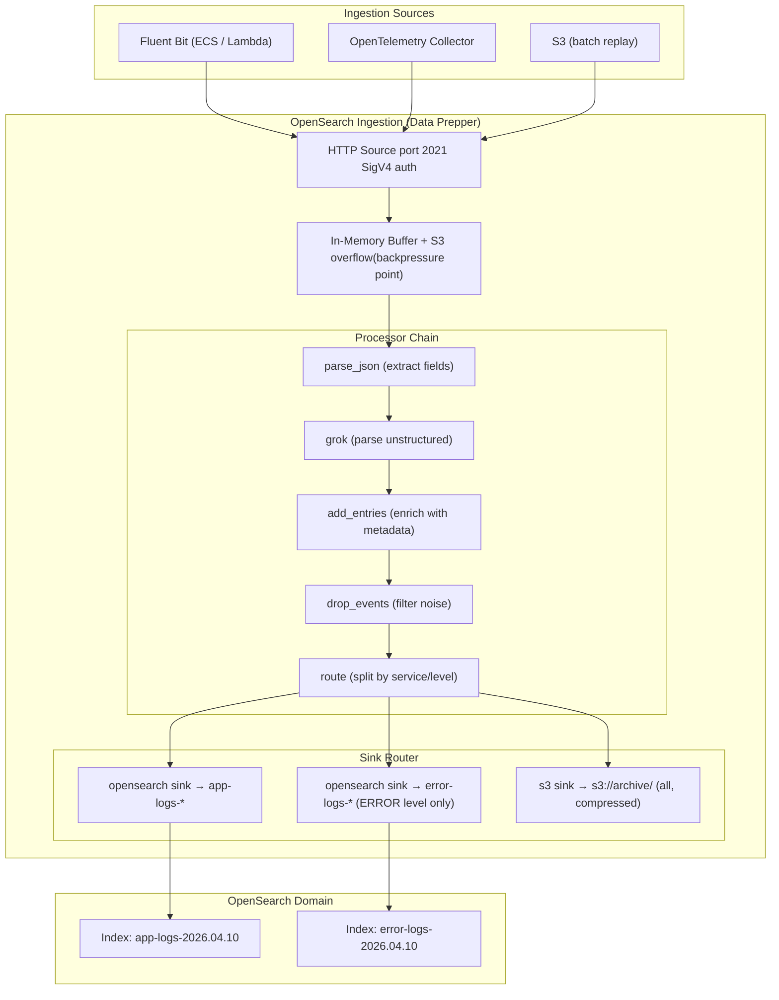
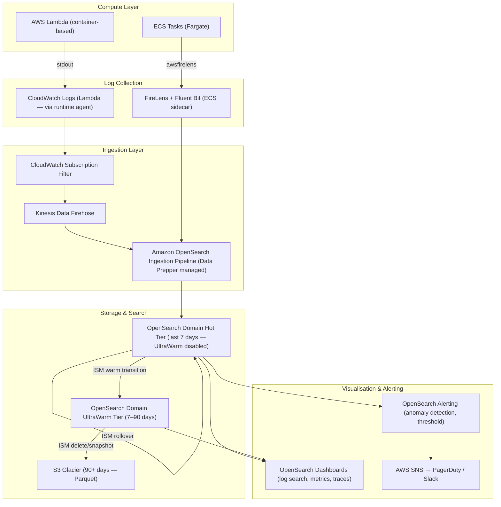
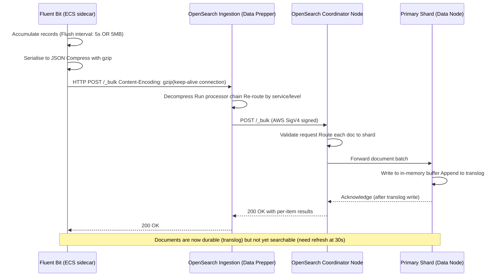

In [Part 1](/posts/opensearch-logging-1/) we traced the journey of a log record from `logger.info()` inside your application, through Python's logging internals, through Docker's log driver, and into a Fluent Bit sidecar's output queue. We stopped at the point where Fluent Bit is about to send a bulk HTTP request.

This post picks up there. We will explore what happens inside **Amazon OpenSearch Ingestion**, how to design your index strategy for log data so it stays fast and cheap over months, and how to squeeze maximum throughput out of the network between Fluent Bit and OpenSearch.

[Part 3](/posts/opensearch-metrics/) covers using OpenSearch as a **metrics backend** — replacing or complementing Prometheus.

---

## Table of Contents

1. [Amazon OpenSearch Ingestion — What it Is and When to Use It](#amazon-opensearch-ingestion)
2. [The Full AWS Observability Architecture](#the-full-aws-observability-architecture)
3. [Index Strategy for Log Data](#index-strategy-for-log-data)
4. [Index State Management (ISM) — Automating the Log Lifecycle](#index-state-management)
5. [Network Optimisation for High Log Volume](#network-optimisation-for-high-log-volume)
6. [Key Takeaways](#key-takeaways)

---

## Amazon OpenSearch Ingestion

When Fluent Bit sends its bulk payload, it can target one of two places:

**Option A — Directly to OpenSearch**: Fluent Bit posts straight to the `/_bulk` API of your OpenSearch domain. Simple, fewer moving parts, works fine up to a few thousand records per second per domain.

**Option B — Amazon OpenSearch Ingestion (formerly Data Prepper managed service)**: A fully managed ingestion pipeline that sits between your shippers and your domain. It handles buffering, fan-out to multiple indices, schema transformations, and backpressure on your behalf.

> **When to use OpenSearch Ingestion vs direct bulk**: Use direct bulk if you have one source and one destination, low-to-moderate volume, and your Fluent Bit config handles your transformation needs. Switch to OpenSearch Ingestion when you need to fan out to multiple indices based on log content, when your transformation logic is complex enough that Lua scripts in Fluent Bit become unmaintainable, or when you need the managed service's autoscaling and built-in dead-letter-queue support.

### What Happens Inside OpenSearch Ingestion

OpenSearch Ingestion runs **Data Prepper** pipelines under the hood. A Data Prepper pipeline is composed of:

- **Source**: where records enter (HTTP endpoint, S3, Kinesis, SQS)
- **Buffer**: an internal queue that decouples the source from the processor
- **Processors**: transformation steps (parse, enrich, route, drop)
- **Sink**: where records are delivered (OpenSearch index, S3, another pipeline)



A Data Prepper pipeline config for this architecture:

```yaml
# opensearch-ingestion-pipeline.yaml
# This is the pipeline definition you deploy in the AWS Console
# under Amazon OpenSearch Service → Pipelines

version: "2"

log-pipeline:
  source:
    http:
      # Data Prepper exposes an HTTP endpoint your shippers POST to
      path: "/log/ingest"
      # Request body format — Fluent Bit's opensearch output uses this format
      request_format: "json"

  buffer:
    bounded_blocking:
      # Max records held in buffer. If this fills up, the HTTP source
      # applies backpressure — Fluent Bit's request will block until
      # the buffer drains. This is intentional: you want backpressure
      # rather than silent drops.
      buffer_size: 25600      # 25,600 records
      batch_size: 512         # process 512 records per batch through processors

  processor:
    # Step 1: Parse the incoming JSON body into individual fields
    - parse_json:
        source: "message"     # field that contains the raw JSON string from Fluent Bit

    # Step 2: Add pipeline metadata — useful for debugging ingestion issues
    - add_entries:
        entries:
          - key: "ingestion_pipeline"
            value: "log-pipeline-v2"
          - key: "ingest_timestamp"
            format: "{{datetime}}"     # ISO-8601 ingestion timestamp

    # Step 3: Normalise log levels to lowercase for consistent querying
    - lowercase_string:
        with_keys: ["level"]

    # Step 4: Drop health check noise that slipped through Fluent Bit filtering
    - drop_events:
        drop_when: '/http_path == "/health" or /http_path == "/metrics"'

    # Step 5: Route records to different sinks based on content
    - route:
        routes:
          - name: "errors"
            condition: '/level == "error" or /level == "critical"'
          - name: "all_logs"
            condition: "true"    # catch-all — all records go here too

  sink:
    # Sink 1: All logs → general index
    - opensearch:
        routes: ["all_logs"]
        hosts: ["https://vpc-your-domain.ap-south-1.es.amazonaws.com"]
        aws:
          region: "ap-south-1"
          sts_role_arn: "arn:aws:iam::123456789012:role/OpenSearchIngestionRole"
        # Use a rollover alias — ISM manages the actual index rotation
        index: "app-logs"
        index_type: "custom"
        document_id: "${getMetadata(\"request_id\")}"  # idempotent indexing
        bulk_size: 4            # MB per bulk request
        flush_timeout: 60       # seconds — flush even if bulk_size not reached

    # Sink 2: Errors only → dedicated high-priority index
    - opensearch:
        routes: ["errors"]
        hosts: ["https://vpc-your-domain.ap-south-1.es.amazonaws.com"]
        aws:
          region: "ap-south-1"
          sts_role_arn: "arn:aws:iam::123456789012:role/OpenSearchIngestionRole"
        index: "error-logs"
        bulk_size: 1            # smaller — errors are lower volume, flush faster

    # Sink 3: Everything to S3 for long-term archive and replay capability
    - s3:
        routes: ["all_logs"]
        bucket: "your-log-archive-bucket"
        region: "ap-south-1"
        object_key_prefix: "logs/%{yyyy}/%{MM}/%{dd}/"
        codec:
          parquet: {}           # Parquet format — queryable with Athena directly
        threshold:
          event_collect_timeout: "300s"   # flush S3 object every 5 minutes
          maximum_size: "100mb"
```

**Source**: HTTP endpoint (`/log/ingest`) accepting JSON log records from Fluent Bit.

**Buffer**: Holds up to 25,600 records with backpressure enabled; processes 512 records per batch to prevent data loss.

**Processors** (in sequence):
1. Parse raw JSON strings into structured fields
2. Add metadata (pipeline name and ISO-8601 ingestion timestamp) for traceability
3. Normalize log levels to lowercase for consistent searching
4. Filter out health check and metrics endpoint noise
5. Route records into two categories: "errors" (error/critical level) and "all_logs" (everything)

**Sinks**:
1. **OpenSearch (all logs)**: Stores all records in `app-logs` index with 4 MB bulk size and 60-second flush interval
2. **OpenSearch (errors only)**: Routes critical logs to `error-logs` index with 1 MB bulk size for faster flushing
3. **S3 Archive**: Exports all logs to Parquet format in time-partitioned folders (by year/month/day) for long-term storage and Athena querying, flushing every 5 minutes or at 100 MB

---

## The Full AWS Observability Architecture

Before going deeper into individual components, here is the complete picture of what a production observability stack on AWS looks like with OpenSearch at the centre:



---

## Index Strategy for Log Data

The most common mistake with log indices is treating logs like application data — creating one index with a static mapping and writing into it indefinitely. This causes two problems: unbounded index growth that makes all queries slower over time, and inability to set different retention policies for different time windows.

The correct pattern is **time-based rollover indices** with an **alias**.

### Time-Based Indices with Rollover Aliases

Instead of indexing into `app-logs` directly, you index into an alias `app-logs`. The alias points to the current active index (e.g., `app-logs-000001`). When that index exceeds your size or age threshold, ISM creates `app-logs-000002` and moves the alias pointer. Queries against `app-logs` automatically search across all matching indices.

```python
# scripts/setup_log_index.py
# Run this once during infrastructure setup — not on every deploy
from opensearchpy import OpenSearch

client = OpenSearch(
    hosts=[{"host": "your-domain.ap-south-1.es.amazonaws.com", "port": 443}],
    http_auth=("admin", "your-password"),
    use_ssl=True,
    verify_certs=True
)


def create_log_index_template():
    """
    Index templates apply settings and mappings automatically to any new index
    that matches the pattern. When ISM creates 'app-logs-000002', this template
    applies immediately — no manual mapping work needed.
    """

    template = {
        # Match any index name starting with 'app-logs-'
        "index_patterns": ["app-logs-*"],
        "template": {
            "settings": {
                # 3 primary shards for a 7-day rolling index.
                # Rule of thumb: aim for 20-50 GB per shard.
                # At 250 GB/day, a 7-day index = 1.75 TB → 3 shards at ~580 GB each.
                # But with ISM rolling over at 50 GB, each index lives ~5 hours.
                # So: 1 shard per index, rolling every 50 GB or 24 hours.
                "number_of_shards": 1,
                "number_of_replicas": 1,

                # Increase refresh interval from 1s to 30s.
                # Logs are rarely searched within 1 second of being written.
                # Longer refresh = fewer Lucene segments = better search performance.
                "index.refresh_interval": "30s",

                # Disable _source compression ratio check — we are already
                # sending compressed data from Fluent Bit, and logs are very
                # compressible. best_compression uses DEFLATE.
                "index.codec": "best_compression",

                # Tell OpenSearch this index is managed by ISM policy 'log-policy'
                "plugins.index_state_management.policy_id": "log-policy",

                # Rollover alias — write alias points here for new documents
                "plugins.index_state_management.rollover_alias": "app-logs"
            },
            "mappings": {
                # Disable dynamic mapping for unknown fields — prevents mapping explosions.
                # Known fields are explicitly mapped below; unknown fields are stored
                # but not indexed (searchable only via keyword scan, not inverted index).
                "dynamic": "strict",

                "properties": {
                    # ISO-8601 timestamp from the application log record
                    "@timestamp": {
                        "type": "date",
                        "format": "strict_date_optional_time||epoch_millis"
                    },
                    # ISO-8601 timestamp added by the ingestion pipeline
                    "ingest_timestamp": {"type": "date"},

                    # Enumerable string fields: use keyword, not text.
                    # keyword = exact match + aggregations (no full-text analysis overhead)
                    "level":       {"type": "keyword"},
                    "service":     {"type": "keyword"},
                    "environment": {"type": "keyword"},
                    "host":        {"type": "keyword"},
                    "logger":      {"type": "keyword"},
                    "ecs_cluster": {"type": "keyword"},
                    "ecs_task_arn": {"type": "keyword"},
                    "aws_region":  {"type": "keyword"},
                    "request_id":  {"type": "keyword"},
                    "payment_id":  {"type": "keyword"},

                    # HTTP fields — exact match for status code aggregations
                    "http_method": {"type": "keyword"},
                    "http_path":   {"type": "keyword"},
                    "http_status": {"type": "integer"},

                    # Numeric fields — range queries and aggregations
                    "duration_ms": {"type": "float"},
                    "line":        {"type": "integer"},

                    # The human-readable message — full-text indexed for keyword search.
                    # Also stored as a keyword subfield for exact aggregations.
                    "message": {
                        "type": "text",
                        "analyzer": "standard",
                        "fields": {
                            "keyword": {
                                "type": "keyword",
                                "ignore_above": 512   # truncate very long messages for keyword field
                            }
                        }
                    },

                    # Exception block — nested object
                    "exception": {
                        "type": "object",
                        "properties": {
                            "type":      {"type": "keyword"},
                            "message":   {"type": "text"},
                            # Full traceback as searchable text — engineers search for
                            # "AttributeError" or specific line numbers
                            "traceback": {"type": "text", "analyzer": "standard"}
                        }
                    }
                }
            }
        }
    }

    response = client.indices.put_index_template(name="app-logs-template", body=template)
    print("Index template created:", response)


def bootstrap_first_index():
    """
    Create the initial index and point the alias at it.
    ISM takes over from here — it will create new indices on rollover.
    """

    # Create the first concrete index
    client.indices.create(
        index="app-logs-000001",
        body={
            "aliases": {
                "app-logs": {
                    "is_write_index": True   # only the active index receives writes
                }
            }
        }
    )
    print("Initial index and alias created")


create_log_index_template()
bootstrap_first_index()
```

---

## Index State Management

ISM is OpenSearch's built-in index lifecycle engine. You define a policy as a state machine — each state has actions (do this) and transitions (when to move to next state). OpenSearch runs an ISM job in the background that checks every index against its policy.

```python
def create_log_ism_policy():
    """
    Creates a 4-state lifecycle policy for log indices:
    hot → warm → cold (UltraWarm) → delete

    hot:  active writes, full replicas, fast search
    warm: read-only, merge to 1 segment, save replica space
    cold: move to UltraWarm (S3-backed), very low cost, slower queries
    delete: remove index after retention period
    """

    policy = {
        "policy": {
            "description": "Log retention policy — 7 days hot, 30 days warm, 90 days cold",
            "default_state": "hot",
            "states": [
                {
                    "name": "hot",
                    "actions": [
                        {
                            # Rollover when the index hits 50 GB OR is 24 hours old.
                            # 50 GB keeps shards in the sweet spot for Lucene performance.
                            # 24 hours ensures daily index boundaries for operational clarity.
                            "rollover": {
                                "min_size": "50gb",
                                "min_index_age": "1d"
                            }
                        }
                    ],
                    "transitions": [
                        {
                            "state_name": "warm",
                            "conditions": {
                                # Move to warm 7 days after creation (not rollover).
                                # min_index_age is relative to index creation time.
                                "min_index_age": "7d"
                            }
                        }
                    ]
                },
                {
                    "name": "warm",
                    "actions": [
                        {
                            # Drop to 0 replicas — we have S3-backed UltraWarm as backup.
                            # This cuts storage cost roughly in half for old indices.
                            "replica_count": {"number_of_replicas": 0}
                        },
                        {
                            # Merge all Lucene segments into 1 per shard.
                            # Dramatically reduces memory and file descriptor usage.
                            # WARNING: This is CPU-intensive. Schedule via cron
                            # or accept that ISM runs it whenever — off-peak is ideal.
                            "force_merge": {"max_num_segments": 1}
                        },
                        {
                            # Mark read-only to prevent accidental writes
                            # and to allow the OS to page out the index safely
                            "read_only": {}
                        }
                    ],
                    "transitions": [
                        {
                            "state_name": "cold",
                            "conditions": {"min_index_age": "30d"}
                        }
                    ]
                },
                {
                    "name": "cold",
                    "actions": [
                        {
                            # Move to UltraWarm storage (S3-backed, much cheaper than EBS).
                            # Queries against UltraWarm are slower (200-500ms vs <50ms),
                            # but fine for "find that error from 6 weeks ago" use cases.
                            "migrate": {"destination_type": "ultrawarm"}
                        }
                    ],
                    "transitions": [
                        {
                            "state_name": "delete",
                            "conditions": {"min_index_age": "90d"}
                        }
                    ]
                },
                {
                    "name": "delete",
                    "actions": [
                        {
                            # Take a final snapshot to S3 before deletion.
                            # This gives you the ability to restore logs from years ago
                            # if a compliance requirement surfaces.
                            "snapshot": {
                                "repository": "s3-log-archive",
                                "snapshot": "{{ctx.index}}-final"
                            }
                        },
                        {
                            # After snapshot, delete the index.
                            # ISM waits for the snapshot to complete before deleting.
                            "delete": {}
                        }
                    ]
                }
            ]
        }
    }

    response = client.transport.perform_request(
        "PUT",
        "/_plugins/_ism/policies/log-policy",
        body=policy
    )
    print("ISM policy created:", response)


create_log_ism_policy()
```

### The Index Lifecycle Timeline

| Age | State | Storage Tier | Replicas | Segment State | Query Latency |
|-----|-------|--------------|----------|---------------|---------------|
| 0–7 days | hot | EBS (gp3) | 1 | Multiple, active | < 50ms |
| 7–30 days | warm | EBS (gp3) | 0 | Merged to 1 | < 100ms |
| 30–90 days | cold | UltraWarm (S3) | 0 | Merged to 1 | 200–500ms |
| 90+ days | deleted | S3 snapshot | — | Snapshot only | Restore needed |

---

## Network Optimisation for High Log Volume

At 250 GB/day, the network overhead between Fluent Bit and OpenSearch becomes a primary bottleneck. Minimizing data serialization costs and cross-AZ traffic is critical; we achieve this by pulling four key architectural levers.

### Lever 1: Bulk API (Not Single-Document Indexing)

Every single-document `POST /index/_doc` has an HTTP handshake overhead of ~2ms, TLS negotiation, request parsing, and response serialisation. At 6,000 docs/sec, this is 12 seconds of pure overhead per second — clearly impossible.

The `/_bulk` API amortises that overhead across thousands of documents per request. A well-tuned Fluent Bit instance sends 500–2,000 documents per bulk request, reducing per-document HTTP overhead by 3 orders of magnitude.

The optimal bulk size is empirically determined, but a good starting point is **5–15 MB per bulk request**. Below 1 MB you are leaving throughput on the table; above 20 MB you risk OpenSearch thread pool saturation and request timeouts.

### Lever 2: gzip Compression

Log data is extremely compressible — JSON field names repeat on every record, and log messages have predictable vocabulary. gzip typically achieves **6–10x compression** on log JSON. For 250 GB/day uncompressed, this translates to 25–42 GB/day on the wire.

Both Fluent Bit (the `Compress gzip` option in the opensearch output) and the Python `opensearchpy` client support compressed requests natively:

```python
# For bulk indexing via the Python client (used in scripts, not in Fluent Bit)
from opensearchpy import OpenSearch, RequestsHttpConnection
from requests_aws4auth import AWS4Auth
import boto3
from opensearchpy.helpers import bulk, parallel_bulk

# AWS SigV4 authentication — no username/password needed for VPC-based domains
session = boto3.Session()
credentials = session.get_credentials()
awsauth = AWS4Auth(
    credentials.access_key,
    credentials.secret_key,
    "ap-south-1",
    "es",
    session_token=credentials.token
)

client = OpenSearch(
    hosts=[{"host": "your-domain.ap-south-1.es.amazonaws.com", "port": 443}],
    http_auth=awsauth,
    use_ssl=True,
    verify_certs=True,
    connection_class=RequestsHttpConnection,
    # HTTP compression — send gzip-encoded request bodies
    http_compress=True,
    # Connection pooling — reuse TCP connections across bulk requests.
    # Without this, every bulk request creates a new TCP+TLS handshake.
    pool_maxsize=20,
    # Timeout settings: connect timeout, read timeout
    timeout=30,
    max_retries=3,
    retry_on_timeout=True
)
```

### Lever 3: Connection Pooling and Keep-Alive

Each new TCP connection to OpenSearch requires a 3-way handshake (~1ms for same-region VPC) plus TLS negotiation (~5ms). At 100 bulk requests per second, spending 6ms per connection is 600ms of pure connection overhead per second — 60% of your request budget.

HTTP/1.1 keep-alive (reusing the TCP connection) eliminates this. The OpenSearch Python client uses `urllib3` connection pools internally. The `pool_maxsize=20` parameter above keeps up to 20 open TCP connections ready to use. Fluent Bit uses `Keep_Alive On` in its HTTP output config.

### Lever 4: Async / Parallel Bulk for Scripts

When writing scripts (reindexing, backfill, bulk load) rather than Fluent Bit, use `parallel_bulk` to pipeline multiple in-flight bulk requests:

```python
def bulk_ingest_logs_efficiently(log_records: list[dict]):
    """
    Demonstrates efficient bulk ingestion for scripts — not the Fluent Bit path.
    Uses parallel_bulk to have multiple in-flight bulk requests simultaneously,
    hiding OpenSearch's response latency behind the next request's network time.
    """

    def generate_actions():
        for record in log_records:
            yield {
                "_index": "app-logs",      # writes through the alias
                "_id": record.get("request_id"),   # idempotent: same ID = upsert
                "_source": record
            }

    # parallel_bulk sends `thread_count` concurrent bulk requests.
    # While OpenSearch is processing batch N, Python is sending batch N+1.
    success_count = 0
    error_count = 0

    for success, info in parallel_bulk(
        client,
        generate_actions(),
        thread_count=4,          # concurrent in-flight requests
        chunk_size=500,          # documents per bulk request
        max_chunk_bytes=10_000_000,  # 10 MB max per request
        raise_on_error=False,    # collect errors instead of raising immediately
        raise_on_exception=False
    ):
        if success:
            success_count += 1
        else:
            error_count += 1
            print(f"Failed document: {info}")

    print(f"Bulk ingest complete: {success_count} success, {error_count} errors")
```

### Network Path Summary



---

## Key Takeaways

**The full pipeline is lazy at every stage**: Python defers string formatting; Fluent Bit buffers before sending; OpenSearch Ingestion batches before indexing; OpenSearch itself buffers in memory before writing to disk. Laziness is not a bug — it is how the system achieves throughput without sacrificing durability.

**Every component except the application has an explicit backpressure mechanism**: Fluent Bit's `Mem_Buf_Limit` and filesystem buffer, OpenSearch Ingestion's `bounded_blocking` buffer, OpenSearch's write thread pool queue. When these fill up, the system slows — not drops.

**Index design is a long-term decision**: Changing a mapping on a live log index requires reindexing. Get your field types right at the start: `keyword` for enumerables, `text` only for free-form messages, `date` for timestamps, `float/integer` for numerics.

**Continue to [Part 3 — OpenSearch as a Metrics Backend](/posts/opensearch-logging-3/)** to see how the same cluster can replace a standalone Prometheus + Grafana stack.

---

## More Resources

- [Amazon OpenSearch Ingestion Documentation](https://docs.aws.amazon.com/opensearch-service/latest/developerguide/ingestion.html)
- [Data Prepper Documentation](https://opensearch.org/docs/latest/data-prepper/index/)
- [OpenSearch ISM Documentation](https://opensearch.org/docs/latest/im-plugin/ism/index/)
- [Part 1 of this series — From logger.info() to the Wire](/posts/opensearch-logging-1/)
- [Part 3 of this series — OpenSearch as a Metrics Backend](/posts/opensearch-logging-3/)
