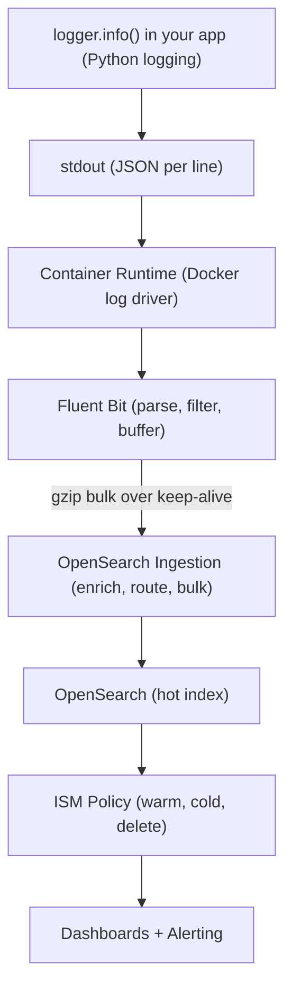

In [Part 2](/posts/opensearch-logging-2/) we covered Amazon OpenSearch Ingestion, time-based index strategy, ISM lifecycle policies, and network optimisation for high log volume.

This post completes the series. We will use OpenSearch not just for logs but as a **metrics backend** — replacing or complementing Prometheus — and then wire everything together with dashboards and alerting.

---

## Table of Contents

1. [OpenSearch as a Metrics Backend](#opensearch-as-a-metrics-backend)
2. [Building a Simple Observability Dashboard in OpenSearch Dashboards](#building-an-observability-dashboard)
3. [Key Takeaways](#key-takeaways)

---

## OpenSearch as a Metrics Backend

OpenSearch is not just for logs. With the right index design, it can serve as a **time-series metrics store** — similar to InfluxDB or Prometheus's TSDB, but with OpenSearch's query expressiveness and your existing Dashboards investment.

This is especially valuable on AWS where you are already running OpenSearch for logs. Instead of maintaining a separate Prometheus + Grafana stack, you can ship metrics to OpenSearch and query them alongside your logs — correlating "error spike at 14:32" with "CPU spike at 14:31" in the same tool.

> OpenSearch does not replace Prometheus for short-window alerting and PromQL workloads. Where it excels is long-term metric retention (Prometheus's storage is not cost-effective beyond 15 days), arbitrary aggregations across high-cardinality dimensions, and correlation with log data.

### Metric Index Design

Metrics are fundamentally different from logs: they are numeric, time-stamped, and often have many tag combinations (high cardinality). The index design must reflect this.

Before writing a single metric to OpenSearch, you need to tell it what shape your data has — this is the **index template**. An index template is a reusable blueprint that OpenSearch automatically applies every time a new index matching a given name pattern is created. Without it, OpenSearch would guess field types from the first document it sees, which often leads to wrong types (for example, treating a numeric value as text) that are impossible to fix without deleting and rebuilding the index.

The template below enforces four rules: the timestamp is a proper `date` field so time-range queries are fast; the metric name and all tag dimensions are `keyword` fields so they support exact-match filtering and aggregations without any text-analysis overhead; the measured value is a `double` so OpenSearch can compute averages, percentiles, and sums over it; and `dynamic: strict` prevents any unexpected fields from sneaking in and bloating the mapping.

```python
def create_metrics_index_template():
    template = {
        "index_patterns": ["metrics-*"],   # applies to every index named metrics-XXXX
        "template": {
            "settings": {
                "number_of_shards": 1,
                "number_of_replicas": 1,
                # 60s refresh — metric dashboards don't need sub-minute freshness
                "index.refresh_interval": "60s",
                # best_compression — float arrays compress extremely well
                "index.codec": "best_compression",
                "plugins.index_state_management.policy_id": "metrics-policy",
                "plugins.index_state_management.rollover_alias": "metrics"
            },
            "mappings": {
                # strict = reject any field not listed below; prevents mapping explosions
                "dynamic": "strict",
                "properties": {
                    "@timestamp":   {"type": "date"},
                    # e.g. "api.request.duration_ms", "db.pool.active_connections"
                    "metric_name":  {"type": "keyword"},
                    # The actual measured number
                    "value":        {"type": "double"},
                    # Human-readable unit string — "ms", "bytes", "count"
                    "unit":         {"type": "keyword"},
                    # Dimensions used for grouping and filtering in queries
                    "tags": {
                        "type": "object",
                        "properties": {
                            "service":     {"type": "keyword"},
                            "environment": {"type": "keyword"},
                            "host":        {"type": "keyword"},
                            "endpoint":    {"type": "keyword"},
                            "status_code": {"type": "keyword"},
                            "region":      {"type": "keyword"}
                        }
                    }
                }
            }
        }
    }

    client.indices.put_index_template(name="metrics-template", body=template)
    print("Metrics index template created")
```

Run this function once during initial infrastructure setup. From that point on, every rolling index created by ISM inherits this mapping automatically — no manual intervention needed.

---

### Emitting Metrics from FastAPI

With the index template in place, the next step is to get your application to actually produce metric data. The naive approach — one HTTP request to OpenSearch per measurement — would collapse under load. A FastAPI service handling 500 requests per second would generate 500 OpenSearch writes per second just for latency metrics, which would saturate both the application's network and OpenSearch's ingest thread pool.

The solution is a **buffered collector**: measurements are written to an in-memory list, and a background task flushes that list to OpenSearch via the bulk API every 10 seconds. This turns 500 individual writes per second into a single bulk request every 10 seconds containing 5,000 documents — a 5,000x reduction in HTTP round-trips.

The code below has three moving parts. `MetricPoint` is a plain data class representing one measurement; its `to_opensearch_doc()` method formats it as a bulk-API action document. `MetricsCollector` owns the buffer and the async lock that keeps concurrent FastAPI request handlers from corrupting the list. The `metrics_middleware` hook at the bottom intercepts every HTTP request automatically, so no endpoint handler needs to be modified — latency and status code tracking is zero-boilerplate.

```python
# app/metrics.py
import time
import logging
import asyncio
from dataclasses import dataclass
from datetime import datetime, timezone
from typing import Optional
from opensearchpy.helpers import bulk
from fastapi import FastAPI, Request

logger = logging.getLogger("metrics")


@dataclass
class MetricPoint:
    """One measurement at a single point in time."""
    metric_name: str
    value: float
    unit: str
    tags: dict
    timestamp: Optional[datetime] = None

    def __post_init__(self):
        # Auto-stamp with current UTC time if caller did not supply one
        if self.timestamp is None:
            self.timestamp = datetime.now(tz=timezone.utc)

    def to_opensearch_doc(self) -> dict:
        """Format this point as a bulk API action ready to be sent."""
        return {
            "_index": "metrics",   # writes through the rollover alias
            "_source": {
                "@timestamp": self.timestamp.isoformat(),
                "metric_name": self.metric_name,
                "value": self.value,
                "unit": self.unit,
                "tags": self.tags
            }
        }


class MetricsCollector:
    """
    Accumulates MetricPoints in memory, then flushes them in bulk.
    Using an asyncio.Lock ensures that concurrent request handlers
    writing to self._buffer do not cause data races.
    """

    def __init__(self, opensearch_client, flush_interval_seconds: int = 10):
        self._client = opensearch_client
        self._flush_interval = flush_interval_seconds
        self._buffer: list[MetricPoint] = []
        self._lock = asyncio.Lock()

    async def record(self, metric_name: str, value: float, unit: str = "count", **tags):
        """Add one measurement to the in-memory buffer."""
        point = MetricPoint(metric_name=metric_name, value=value, unit=unit, tags=tags)
        async with self._lock:
            self._buffer.append(point)

    async def flush(self):
        """
        Drain the buffer and send everything to OpenSearch in a single bulk call.
        The buffer is swapped out under the lock so new measurements that arrive
        during the network call go into a fresh list and are not lost.
        """
        async with self._lock:
            if not self._buffer:
                return
            to_flush = self._buffer
            self._buffer = []   # new measurements go here while we send to_flush

        try:
            actions = [point.to_opensearch_doc() for point in to_flush]
            success, failed = bulk(self._client, actions, chunk_size=1000, raise_on_error=False)
            if failed:
                logger.warning("Failed to index %d metric points", len(failed))
            else:
                logger.debug("Flushed %d metric points to OpenSearch", success)
        except Exception as e:
            logger.error("Metrics flush failed: %s", e)

    async def run_flush_loop(self):
        """Runs forever in the background, flushing on a fixed interval."""
        while True:
            await asyncio.sleep(self._flush_interval)
            await self.flush()


# ── FastAPI wiring ────────────────────────────────────────────────────────────

metrics: Optional[MetricsCollector] = None
app = FastAPI()


@app.on_event("startup")
async def startup():
    """Create the collector and launch the background flush loop on app start."""
    global metrics
    metrics = MetricsCollector(client, flush_interval_seconds=10)
    asyncio.create_task(metrics.run_flush_loop())


@app.middleware("http")
async def metrics_middleware(request: Request, call_next):
    """
    Wraps every incoming HTTP request. Times how long the handler takes,
    then records the result as a metric — no changes needed in individual
    route handlers.
    """
    start = time.perf_counter()
    response = await call_next(request)
    duration_ms = (time.perf_counter() - start) * 1000

    await metrics.record(
        metric_name="api.request.duration_ms",
        value=round(duration_ms, 2),
        unit="ms",
        service="payments-api",
        environment="production",
        endpoint=request.url.path,
        status_code=str(response.status_code)
    )
    return response
```

After your application runs for a few minutes, you will see documents appearing in the `metrics` alias — one per request, each with a timestamp, a value in milliseconds, and the endpoint and status code as filterable tags.

---

### Querying Metrics with Aggregations

Raw metric documents are not useful on their own — you want to ask questions like "what was the P99 latency for `/api/checkout` in the last hour?" and see a time-series breakdown. OpenSearch answers these questions through **aggregations**, which are computed server-side over millions of documents without returning the documents themselves.

The query below is the engine behind a typical latency dashboard panel. It works in two nested layers. The outer layer (`by_endpoint`) groups all matching documents by the `tags.endpoint` field — so you get one bucket per API path. Inside each bucket, three sub-aggregations run in parallel: a percentiles aggregation computing P50/P95/P99 using the TDigest algorithm; a count of how many requests contributed (so you know whether a P99 of 800ms is based on 3 requests or 30,000); and a `date_histogram` that breaks the same percentile down into 5-minute slices, giving you the sparkline data for a time-series chart.

Setting `"size": 0` at the top is important — it tells OpenSearch not to return any raw documents, only aggregation results. This keeps the response payload small even when the query touches millions of records.

```python
def query_p99_latency_by_endpoint(
    from_time: str = "now-1h",
    to_time: str = "now"
) -> dict:
    query = {
        "size": 0,    # aggregations only — no raw documents in the response
        "query": {
            "bool": {
                "filter": [
                    # Restrict to the requested time window
                    {"range": {"@timestamp": {"gte": from_time, "lte": to_time}}},
                    # Only latency measurements, not other metric types
                    {"term": {"metric_name": "api.request.duration_ms"}}
                ]
            }
        },
        "aggs": {
            "by_endpoint": {
                "terms": {"field": "tags.endpoint", "size": 50},  # one bucket per path
                "aggs": {
                    # P50 / P95 / P99 using TDigest (probabilistic, memory-efficient)
                    "latency_percentiles": {
                        "percentiles": {
                            "field": "value",
                            "percents": [50, 95, 99],
                            "tdigest": {"compression": 100}  # higher = more accurate
                        }
                    },
                    # How many requests contributed — gives statistical context
                    "request_count": {"value_count": {"field": "value"}},
                    # 5-minute buckets for sparkline charts in dashboards
                    "over_time": {
                        "date_histogram": {"field": "@timestamp", "fixed_interval": "5m"},
                        "aggs": {
                            "p99": {"percentiles": {"field": "value", "percents": [99]}}
                        }
                    }
                }
            }
        }
    }

    results = client.search(index="metrics", body=query)

    # Flatten the aggregation tree into a simple dict keyed by endpoint path
    output = {}
    for bucket in results["aggregations"]["by_endpoint"]["buckets"]:
        endpoint = bucket["key"]
        percentiles = bucket["latency_percentiles"]["values"]
        output[endpoint] = {
            "request_count": bucket["request_count"]["value"],
            "p50_ms":  round(percentiles.get("50.0", 0), 2),
            "p95_ms":  round(percentiles.get("95.0", 0), 2),
            "p99_ms":  round(percentiles.get("99.0", 0), 2),
        }

    return output
```

The returned dictionary maps each endpoint path to its percentile latencies and request count — exactly the data a dashboard panel or a Slack summary bot would consume.

---

## Building an Observability Dashboard

OpenSearch Dashboards (the open-source Kibana fork bundled with OpenSearch) provides everything you need to build operational dashboards over your log and metric indices without writing any frontend code.

### Setting Up an Index Pattern

Before creating visualisations, Dashboards needs an **index pattern** — a configuration that tells it which indices to query and which field is the timestamp.

1. Navigate to **Dashboards Management → Index Patterns → Create index pattern**
2. Enter `app-logs-*` as the pattern (matches all rolling log indices)
3. Select `@timestamp` as the time field
4. Repeat for `metrics-*`

### Useful Visualisations for a Log/Metric Dashboard

While you can build dashboards by clicking through the Dashboards UI, managing them as code is better for teams: the configuration lives in version control, can be reviewed, and can be deployed to a new environment in seconds. OpenSearch Dashboards exposes a **Saved Objects API** that accepts visualisation definitions as JSON, which is what the function below uses.

The visualisation created here is a **time-series line chart** of error count broken down by service name. It queries `app-logs-*` and filters to only `level: error` documents, groups them into time buckets on the X axis using `date_histogram`, and draws one line per unique value of the `service` field using a `terms` aggregation as the colour split. When the error rate for `payments-api` spikes, its line rises independently of `auth-service` — so you can immediately see which service is the source rather than looking at a blended total. The `visState` field is the serialised chart configuration including its type, axis settings, and all three aggregations.

```python
import requests
import json

DASHBOARDS_URL = "https://your-dashboards.ap-south-1.es.amazonaws.com"
AUTH = ("admin", "your-password")


def create_error_rate_visualization():
    """
    POST a visualisation saved object to Dashboards via its REST API.
    Once created it appears in Dashboards > Visualisations and can be
    dragged onto any dashboard panel.
    """

    viz = {
        "attributes": {
            "title": "Error Rate by Service",
            "visState": json.dumps({
                "type": "line",
                "params": {
                    "grid": {"categoryLines": False},
                    "categoryAxes": [{"type": "category", "position": "bottom"}],
                    "valueAxes":    [{"type": "value",    "position": "left",
                                      "labels": {"show": True, "truncate": 100}}]
                },
                "aggs": [
                    # Agg 1 — Y axis: count of error documents per time bucket
                    {"id": "1", "type": "count", "schema": "metric"},
                    # Agg 2 — X axis: time buckets auto-sized to the time picker range
                    {"id": "2", "type": "date_histogram", "schema": "segment",
                     "params": {"field": "@timestamp", "interval": "auto"}},
                    # Agg 3 — colour split: one line per distinct service name
                    {"id": "3", "type": "terms", "schema": "group",
                     "params": {"field": "service", "size": 10}}
                ]
            }),
            # Data source: only error-level records from the log indices
            "kibanaSavedObjectMeta": {
                "searchSourceJSON": json.dumps({
                    "index": "app-logs-*",
                    "filter": [
                        {"meta": {"type": "phrase"},
                         "query": {"match_phrase": {"level": "error"}}}
                    ]
                })
            }
        },
        "type": "visualization"
    }

    response = requests.post(
        f"{DASHBOARDS_URL}/api/saved_objects/visualization",
        headers={"osd-xsrf": "true", "Content-Type": "application/json"},
        auth=AUTH,
        json=viz
    )
    print("Visualisation created:", response.status_code)
```

Once created, this saved object appears in **Dashboards → Visualisations** and can be dragged onto any dashboard panel.

---

### Alerting on Log Patterns

A dashboard tells you what happened after you open it. Alerting tells you the moment something goes wrong, even when nobody is watching. OpenSearch Alerting works by running a query against your indices on a schedule and evaluating a condition against the result — the same query language you already know from search and dashboards.

The monitor below runs every 5 minutes and counts how many documents in `app-logs-*` have `level: error` within that window. The count is computed server-side as an aggregation (`value_count`), so OpenSearch only returns a single number rather than all the matching documents. The trigger condition is a short Painless script that compares that number to a threshold of 100. If the threshold is crossed, the action fires — posting a pre-formatted message to a Slack channel via an SNS destination you configure separately in the Alerting UI.

The `{{period_end}}||-5m` syntax is OpenSearch's relative date math: it means "5 minutes before the end of the current evaluation window," which ensures the query always covers exactly the most recent 5-minute slice regardless of when the check runs.

```python
def create_error_spike_monitor():
    monitor = {
        "type": "monitor",
        "name": "Error Spike Detector",
        "enabled": True,
        # How often the monitor runs its query
        "schedule": {"period": {"interval": 5, "unit": "MINUTES"}},
        "inputs": [
            {
                "search": {
                    "indices": ["app-logs-*"],
                    "query": {
                        "size": 0,   # aggregation only — no raw documents needed
                        "query": {
                            "bool": {
                                "filter": [
                                    # Sliding 5-minute window relative to each evaluation
                                    {"range": {"@timestamp": {
                                        "gte": "{{period_end}}||-5m",
                                        "lte": "{{period_end}}"
                                    }}},
                                    {"term": {"level": "error"}}
                                ]
                            }
                        },
                        # Count the number of error documents in the window
                        "aggs": {"error_count": {"value_count": {"field": "level"}}}
                    }
                }
            }
        ],
        "triggers": [
            {
                "name": "High Error Count",
                "severity": "1",
                "condition": {
                    # Painless script — evaluates to true when the alert should fire
                    "script": {
                        "lang": "painless",
                        "source": "ctx.results[0].aggregations.error_count.value > 100"
                    }
                },
                "actions": [
                    {
                        "name": "Notify Slack",
                        "destination_id": "your-sns-destination-id",
                        # Mustache template — OpenSearch fills in the actual count at runtime
                        "message_template": {
                            "source": """
                                *Error Spike Detected* :rotating_light:
                                Error count in last 5 minutes: {{ctx.results[0].aggregations.error_count.value}}
                                Check OpenSearch Dashboards: https://your-dashboards/app/logs
                            """
                        }
                    }
                ]
            }
        ]
    }

    response = client.transport.perform_request(
        "POST", "/_plugins/_alerting/monitors", body=monitor
    )
    print("Alert monitor created:", response)
```

You can add additional triggers on the same monitor — for example, a `severity: 2` trigger at 50 errors that sends to a low-priority channel, and a `severity: 1` trigger at 500 that pages on-call. All of them share the same underlying query, which runs only once per evaluation window.

---

## Key Takeaways

Here is the mental model of the full observability pipeline across this series, from the first `logger.info()` call in your application code all the way through to a Slack alert:



**OpenSearch does double duty**: The same cluster, same Dashboards, same alert infrastructure can serve both your log search needs and your metrics visualisation needs. For most teams on AWS, this is better than running a separate Prometheus + Grafana stack.

**Metrics need a different index shape than logs**: no full-text analysis, `keyword` tags for every dimension, `double` for values, and a 60-second refresh interval rather than 30-second. Getting the template right before data arrives is cheaper than reindexing later.

**Aggregations are first-class citizens**: Percentile queries (`p99`, `p95`) with `date_histogram` sub-aggregations give you Grafana-style time-series panels directly in OpenSearch Dashboards with no additional infrastructure.

**Alerting closes the loop**: A monitor that queries the same indices your dashboards use means your alert condition is always in sync with what you see visually — no PromQL-to-dashboard translation gap.

**Continue to Part 4 of this series**: [Latency & Failure Modes](/posts/opensearch-logging-4/)

## More Resources

- [OpenSearch Alerting Documentation](https://opensearch.org/docs/latest/observing-your-data/alerting/index/)
- [OpenSearch Dashboards Documentation](https://opensearch.org/docs/latest/dashboards/index/)
- [Part 1 of this series — From logger.info() to the Wire](/posts/opensearch-logging-1/)
- [Part 2 of this series — Ingestion Pipeline and Index Strategy](/posts/opensearch-ingestion-index/)
- [Reindexing in OpenSearch](https://pravin.dev/posts/opensearch-reindexing/)
