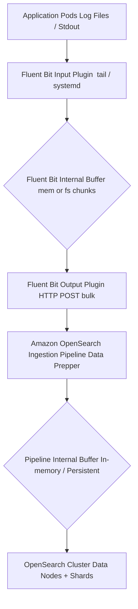
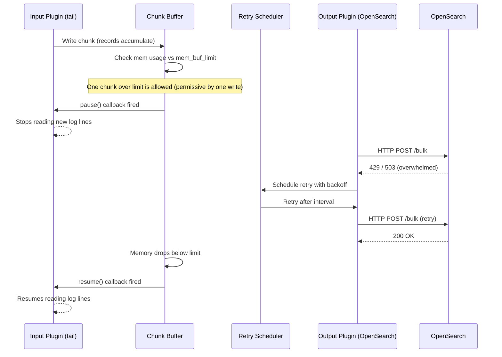
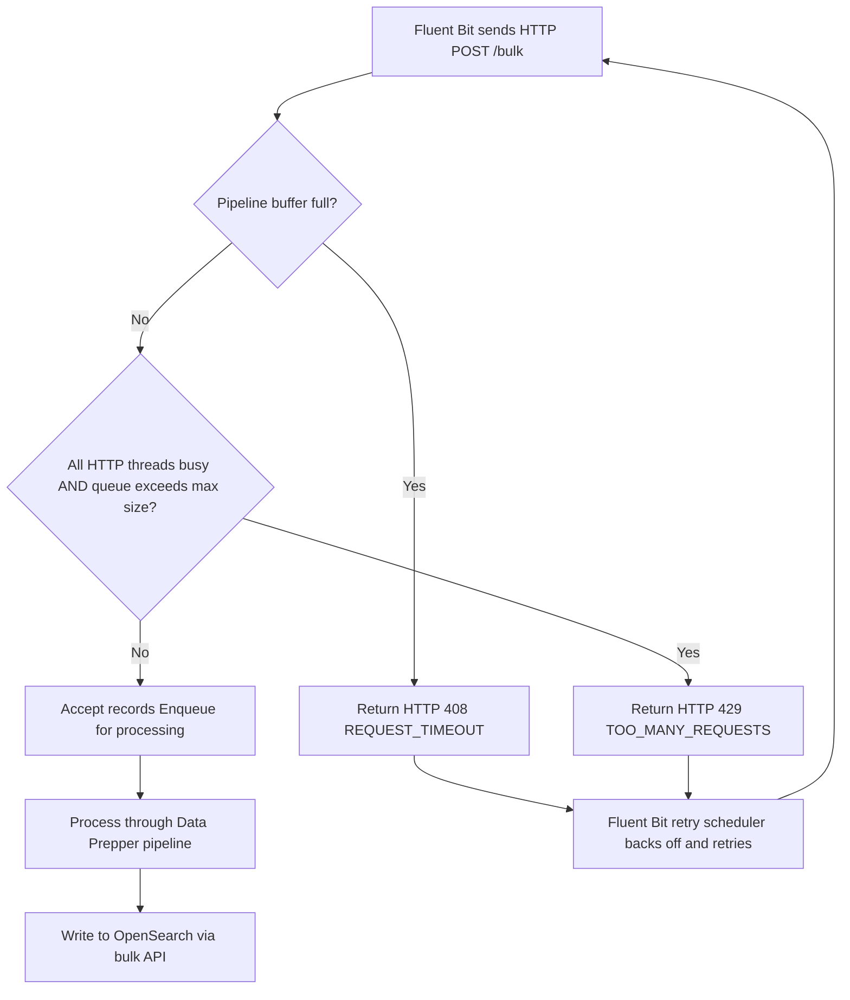
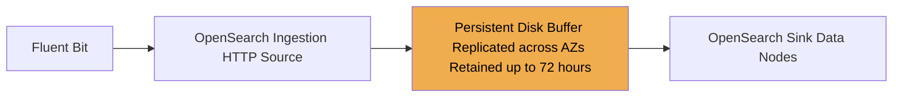
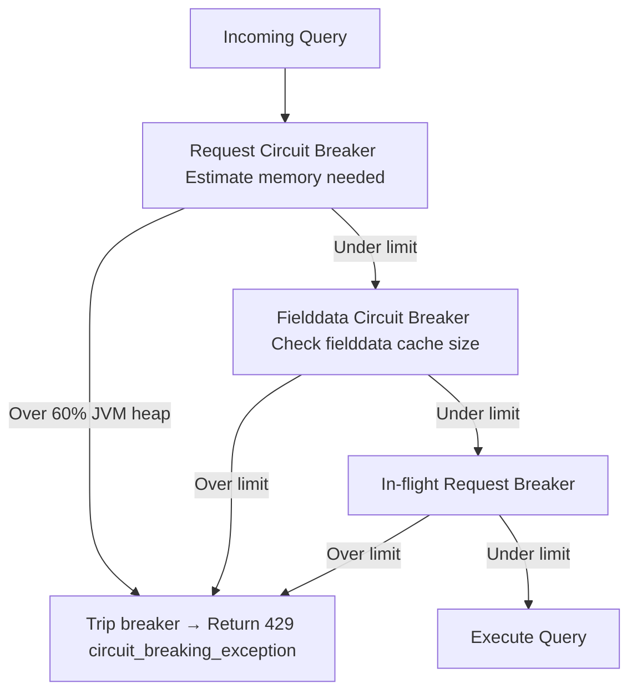
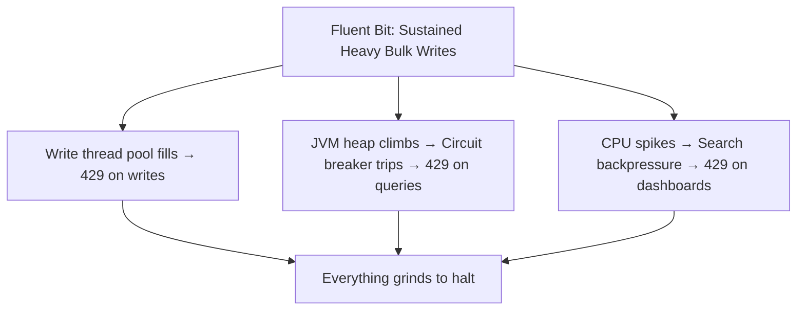
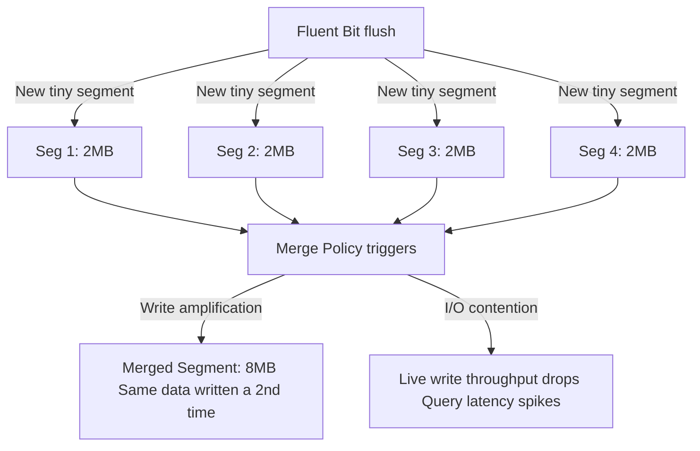
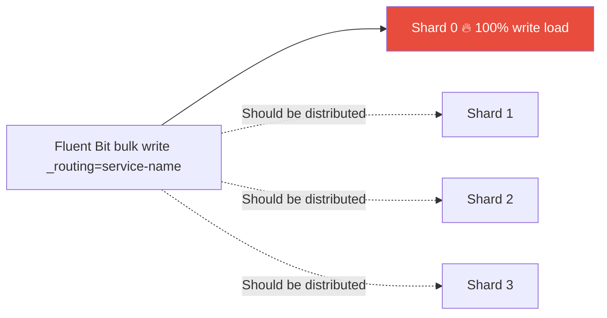
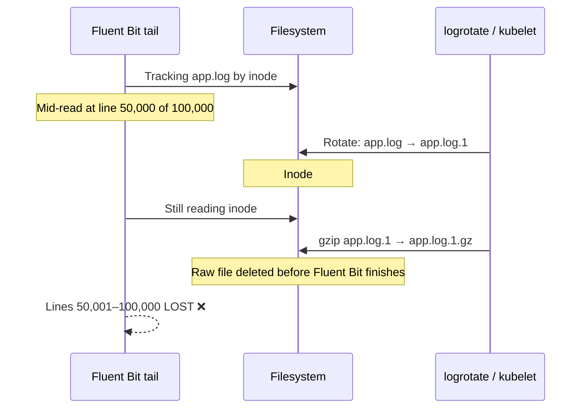

In the previous three articles, we covered the architecture of OpenSearch and Fluent Bit, how to set up a high-throughput logging pipeline, and how to optimize for ingestion performance. In this final article, we dive into the most common latency and failure modes that occur in production — from backpressure mechanics to segment merging to the hot shard problem — and how to diagnose and fix them.

## Table of Contents

1. [Introduction](#intro)
2. [The Pipeline Architecture](#architecture)
3. [How Backpressure Works in Fluent Bit](#backpressure)
   - 3.1 Memory vs Filesystem Buffering
   - 3.2 Pause and Resume Lifecycle
4. [OpenSearch Ingestion — What Happens on the Receiving End](#ingestion)
   - 4.1 Persistent Buffering
5. [OpenSearch 429 Errors — Three Distinct Root Causes](#429)
   - 5.1 Thread Pool Queue Exhaustion
   - 5.2 Circuit Breaker — Data Too Large
   - 5.3 Search Backpressure — CPU Admission Control
6. [Segment Merging — The Silent Latency Killer](#segment-merge)
   - 6.1 Write Amplification
   - 6.2 How Merge Policy Defaults Were Hurting Tail Latency
7. [Other Surprising Failure Modes](#failure-modes)
   - 7.1 Hot Shard Problem
   - 7.2 Fluent Bit Tail + Log Rotation = Silent Data Loss
   - 7.3 Disk Watermark → Cluster Write Block
   - 7.4 Shard-Level Indexing Backpressure
   - 7.5 Translog: The Hidden Write-Ahead Log
8. [Key Takeaways for Production](#takeaways)


## 1. Introduction

If you've ever run a high-throughput observability pipeline — dozens of application pods funneling logs through **Fluent Bit** into an **Amazon OpenSearch** cluster — you've likely hit walls that were hard to diagnose. A sudden flood of `429 Too Many Requests`, logs mysteriously disappearing after a log rotation, or an inexplicably slow dashboard query that bogs down the entire cluster.

These aren't random failures. Each one has a precise mechanical explanation rooted in how Fluent Bit buffers data, how OpenSearch manages concurrency and JVM memory, and how the Lucene engine underneath handles segments and merges. This post walks through all of it — from the ingestion pipeline through every surprising failure mode, including how segment merge behavior was directly causing tail latency spikes for years before OpenSearch 3.0 fixed it.


## 2. The Pipeline Architecture

Before diving into failure modes, here's the full end-to-end pipeline:



Each arrow is a potential failure point. Data moves asynchronously through buffers at every stage, and when any stage is overwhelmed the system must either slow the upstream, buffer more, or drop data.


## 3. How Backpressure Works in Fluent Bit

Backpressure is the mechanism by which a slow downstream communicates to an upstream to slow down. In Fluent Bit, this is implemented through a memory limit threshold and a pair of **pause/resume callbacks** fired on the input plugin.

### 3.1 Memory vs Filesystem Buffering

Fluent Bit organizes data into **chunks** — fixed-size groups of records that live either in memory or on disk:

| Mode | Config | Behavior at Limit | Data Safety | Performance |
|---|---|---|---|---|
| **Memory only** | `Mem_Buf_Limit 100MB` | Input paused; unread data **may be lost** | ❌ Risk of loss | ✅ Fastest |
| **Filesystem hybrid** | `storage.type filesystem` | Chunks spilled to disk; memory capped by `storage.max_chunks_up` (default 128) | ✅ Durable | ⚠️ Slightly slower |
| **Filesystem + hard cap** | `storage.pause_on_chunks_overlimit on` | Input hard-paused when disk chunk limit is also reached | ✅ Durable | ⚠️ Slower |

With filesystem buffering enabled, every chunk is written simultaneously to memory (via `mmap`) and disk. When memory pressure rises, chunks are evicted to disk-only state without data loss.

### 3.2 Pause and Resume Lifecycle

Here is the exact sequence Fluent Bit executes when backpressure triggers:



**Important nuance**: The `mem_buf_limit` check is *permissive by one write*. If the limit is 1 MB and the buffer holds 800 KB, Fluent Bit still allows a 400 KB chunk to land (totaling 1.2 MB) before pause fires. Set this conservatively below your actual available memory.

Key metrics to monitor:
- `fluentbit_input_ingestion_paused` = `1` → input is currently throttled
- `fluentbit_input_storage_overlimit` → buffer-induced pause is active
- `fluentbit_output_retried_records_total` → how often the output retries


## 4. OpenSearch Ingestion — What Happens on the Receiving End

Amazon OpenSearch Ingestion (built on **Data Prepper**) has its own internal HTTP source with bounded buffers. When Fluent Bit POSTs a bulk payload, the pipeline evaluates two conditions:



- **HTTP 408** — pipeline's internal buffer is completely full
- **HTTP 429** — all HTTP source threads are occupied and the unprocessed request queue has exceeded its configured maximum

Both cause Fluent Bit's output plugin to enter retry mode, naturally throttling the upstream.

### 4.1 Persistent Buffering

AWS introduced **Persistent Buffering** for OpenSearch Ingestion in November 2023. This decouples the tight backpressure coupling between Fluent Bit and OpenSearch availability:



With persistent buffering:
- Ingestion spikes are absorbed by disk without returning 408s to Fluent Bit
- If the OpenSearch sink goes down, Fluent Bit keeps ingesting — data waits in the buffer up to 72 hours
- OpenSearch Ingestion dynamically allocates **OCUs (OpenSearch Compute Units)** between compute and buffer roles


## 5. OpenSearch 429 Errors — Three Distinct Root Causes

When you see HTTP 429 from OpenSearch itself (not the Ingestion pipeline), it can come from three entirely different internal systems. Conflating them leads to wrong fixes.

### 5.1 Thread Pool Queue Exhaustion

OpenSearch uses dedicated thread pools per operation type with fixed workers and bounded queues:

| Thread Pool | Default Queue Size | Triggers 429 When... |
|---|---|---|
| `write` / `bulk` | 200 | Too many concurrent bulk requests |
| `search` | 1000 | Too many concurrent search queries |
| `get` | 1000 | Too many single-document GETs |

When Fluent Bit floods with bulk requests, the `write` thread pool queue fills. Any new request after the 200th queued item gets an immediate:

```
EsRejectedExecutionException[rejected execution of TimedRunnable[...]
on EsThreadPoolExecutor[name=bulk, queue capacity=200, ...]]
```

**Fix**: Reduce Fluent Bit's `Batch_Size`, increase `queue_size` in `opensearch.yml`, or add more data nodes to distribute write load.

### 5.2 Circuit Breaker — Data Too Large

This is the "big data size" error. OpenSearch has a multi-layer circuit breaker system to prevent any single query from causing a JVM `OutOfMemoryError`:



The error looks like this:
```json
{
  "type": "circuit_breaking_exception",
  "reason": "[parent] Data too large, data for [] would be [123456789b]
             which is larger than the limit of [67108864b]",
  "status": 429
}
```

Common triggers:
- `terms` aggregation on high-cardinality fields loading massive field data into JVM heap
- Sorting or aggregating on `text` fields (always use `keyword` subfields)
- Heavy dashboard queries fired while Fluent Bit is simultaneously hammering writes

**Fix**: Use `keyword` for aggregated fields, increase JVM heap on data nodes, tune `indices.breaker.total.limit`.

### 5.3 Search Backpressure — CPU Admission Control

This is a proactive, node-level mechanism in AWS OpenSearch Service. It monitors CPU utilization and **rejects requests before thread pools even fill up**. Even a moderately-sized query gets a 429 if the node is already CPU-saturated from concurrent Fluent Bit writes.

**Fix**: Scale horizontally by adding data nodes, or isolate search and indexing with OpenSearch's hot-warm architecture and dedicated node types.

### How All Three Hit Simultaneously




## 6. Segment Merging — The Silent Latency Killer

This is one of the most misunderstood sources of latency spikes in OpenSearch, and it is directly connected to high-volume Fluent Bit ingestion.

### 6.1 Write Amplification

Lucene doesn't write directly to a searchable structure — every flush creates a small **immutable segment file**. Background merge threads continuously consolidate segments, but under sustained Fluent Bit ingestion this creates a vicious cycle:



Under extreme load, GC pauses from merge overhead grow long enough to make nodes appear unresponsive and trigger cluster failover events — even though there's no actual hardware failure.

### 6.2 How Merge Policy Defaults Were Hurting Tail Latency

Before OpenSearch 3.0, two merge policy defaults directly caused p90/p99 tail latency spikes:

**`floor_segment = 4 MB`**: The merge policy treated any segment under 4 MB as a distinct merge candidate. With high Fluent Bit ingestion generating many tiny segments, this triggered constant micro-merges that competed with live search threads for I/O and CPU, creating unpredictable latency spikes.

**`maxMergeAtOnce = 10`**: When a merge did trigger, it consolidated at most 10 segments per pass. For 30 accumulated segments, this meant **3 sequential merge jobs** — effectively 3 separate I/O storms in a row:

```
Old: 30 segments → 3 separate merge jobs (10 each) → 3 I/O storms
New: 30 segments → 1 merge job (all 30)            → 1 I/O event
```

OpenSearch 3.0 fixed both by raising `floor_segment` to **16 MB** and `maxMergeAtOnce` to **30**, delivering up to 20% lower p90/p99 tail latency specifically during active ingestion.


## 7. Other Surprising Failure Modes

### 7.1 Hot Shard Problem

When log documents consistently hash to the same shard — often accidentally via a custom `_routing` key — one shard absorbs all writes while others idle:



**Symptom**: One node at 100% CPU/disk I/O while others are near-idle. Use `GET /_cat/shards?v` to spot imbalanced shard sizes, and OpenSearch's Hot Shard RCA to confirm.

**Fix**: Remove custom routing if not strictly necessary, or use a composite routing key to spread load across multiple shards.

### 7.2 Fluent Bit Tail + Log Rotation = Silent Data Loss

This is one of the sneakiest failure modes in Kubernetes environments:



This is especially severe in Kubernetes. The kubelet applies a **10 MB default log rotation limit**, and at 1000–1250 log lines/sec per node, Fluent Bit cannot keep pace with rotation frequency.

**Fix**: Set `Rotate_Wait 5` in the tail input config (gives Fluent Bit a 5-second grace period after rotation), and increase kubelet's `container-log-max-size` to reduce rotation frequency.

### 7.3 Disk Watermark → Cluster Write Block

OpenSearch has a three-tier disk protection system that can silently block all writes:

| Watermark | Default | Consequence |
|---|---|---|
| **Low** | 85% disk used | No new shards allocated to this node |
| **High** | 90% disk used | Shard relocation away from node begins |
| **Flood stage** | 95% disk used | **Index goes read-only** → `ClusterBlockException` on all writes |

When flood stage hits, Fluent Bit gets `ClusterBlockException` on every retry — not a 429. It fills its own buffer, pauses inputs, and starts dropping logs. All because disk silently crossed 95%.

**Fix**: Set alerting on disk usage at **75%**. When flood stage hits, expand disk or delete old indices, then clear the block via:
```
PUT /_all/_settings
{ "index.blocks.read_only_allow_delete": null }
```

### 7.4 Shard-Level Indexing Backpressure

Introduced in OpenSearch 1.2, this adds per-shard in-flight byte limits on top of node-level thread pool limits. The dangerous cascade:

1. Sustained Fluent Bit pressure causes a **replica shard** on an underpowered node to lag behind its primary
2. OpenSearch marks the lagging replica as a failed replication target
3. **Primary shard promotes a different replica** — looks exactly like a node failure
4. Cluster enters yellow state during re-replication

This is commonly misdiagnosed as hardware failure when it is actually a replication throughput problem caused by sustained ingestion pressure.

### 7.5 Translog: The Hidden Write-Ahead Log

Every write in OpenSearch goes to two places: the in-memory buffer and the **translog** (WAL for durability). The `index.translog.durability` setting has a dramatic throughput impact:

| Setting | Behavior | Risk |
|---|---|---|
| `request` (default) | `fsync` on every bulk request | Safest — at most 1 bulk write lost |
| `async` | `fsync` every 5 seconds | Up to 5 seconds of data lost on crash — but **~10x write throughput** |

For high-volume log pipelines where losing a few seconds of logs is acceptable (logs are not financial transactions), switching to `async` is one of the highest-leverage production tuning changes available.


## 8. Key Takeaways for Production

**Fluent Bit configuration:**
- Always enable `storage.type filesystem` for production — memory-only loses data under backpressure or on crash
- Set `Rotate_Wait 5` on the `tail` input to avoid log rotation data loss in Kubernetes
- Tune `Bulk_Size` and add `Retry_Limit` with exponential backoff — don't hammer the cluster after a 429

**OpenSearch Ingestion:**
- Enable **Persistent Buffering** for any workload with ingestion spikes — it's the most effective way to break the tight coupling between Fluent Bit and OpenSearch availability

**OpenSearch cluster:**
- Set disk usage alerts at **75%** — by 95% (flood stage) you're already losing writes
- Evaluate `async` translog for high-volume log indices where a 5-second loss window is acceptable
- Use `keyword` subfields for any field you aggregate, sort, or filter on — never `text`
- Monitor per-shard CPU with Hot Shard RCA if you see uneven node utilization
- Consider dedicated **ingest nodes** and **coordinating nodes** to isolate write and search thread pools
