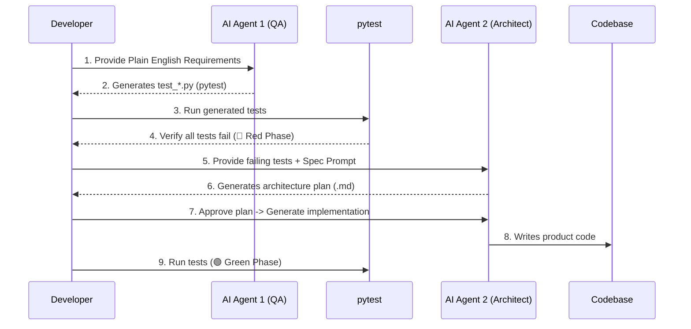

## TL;DR

- Using your test suite as the prompt context transforms AI from an unpredictable oracle into a precise implementation tool — the tests define the contract, the AI fulfils it.
- **The Zero-Code Spec Workflow:** instead of writing Python tests yourself, write plain-English requirements. **AI Agent 1 (QA Persona)** turns them into a `pytest` suite; **AI Agent 2 (Architect Persona)** turns that suite into a design plan and, once approved, the implementation.
- This is a deliberate shift from the previous post: you no longer author the test code by hand. You author the *requirements*, and review the tests, the plan, and the code at three separate gates.
- That plain-English requirements file is already a lightweight form of **Spec-Driven Development (SDD)** — it just doesn't yet have SDD's formal phase structure or a persistent, versioned artifact. Post 3 fixes both.
- Coverage reveals AI's blind spots: untested branches where AI generated plausible-but-wrong logic that no test catches yet.
- The golden rule doesn't change just because AI wrote more of the pipeline: never approve code — or tests — you don't understand.

---

## Prerequisites

- Completed [TDD Fundamentals](/tdd-fundamentals/) — comfortable with pytest, fixtures, mocking, and the Red-Green-Refactor loop, and familiar with the `PortfolioLedger` example
- Familiarity with at least one AI coding tool (Claude, GitHub Copilot, ChatGPT, or similar) that can hold a multi-turn conversation or take separate prompts per persona
- `pytest`, `pytest-cov`, and a passing familiarity with PySpark DataFrames

---

## From One Ledger to Many: Why This Post's Example Exists

`PortfolioLedger` from the previous post tracks one account's buys and sells in memory. A real brokerage platform doesn't work that way: every business day, each connected broker (say, three different broker integrations) uploads a raw JSON trade log of that day's fills, across every customer account. Something has to validate, clean, and settle those logs before `PortfolioLedger.buy()` and `.sell()` are ever called.

That "something" is the `TradeSettlementPipeline` we build in this post — a nightly PySpark job. It's also where scale forces a change in how we get from requirement to code: hand-writing a full `pytest` suite for every DataFrame transformation, fixture, and edge case is tedious. We keep the same discipline as TDD Fundamentals, but let AI generate more of the boilerplate — under a stricter process, not a looser one.

---

## The Bottleneck in AI-Assisted Testing

We know that a test suite is a **machine-readable specification** — a formal description of what the code must do, expressed in a language that leaves no room for interpretation.

However, when building extensive systems like PySpark data pipelines or distributed architectures, writing every `pytest` fixture, mock object, and assertion manually before the AI starts typing slows momentum. You know the exact data schema and business logic, but coding the test boilerplate is tedious.

The modern solution is **Multi-Agent Orchestration**. You act strictly as the Product Owner writing plain English. You then orchestrate specialized AI personas to generate the pipeline sequentially — one persona writes tests, a second writes the design and the code, and you approve at each handoff.

Zoom out and this is already **Spec-Driven Development (SDD)** in miniature: you write down what the system must do before any code exists, and that document — not a conversation, not an assumption — is what everything else gets checked against. What it's missing, for now, is SDD's more disciplined phase structure (a formal plan and task breakdown reviewed independently) and a persistent, versioned home for the spec itself. We'll pick both up properly in the next post.

---

## The Zero-Code Specification Workflow



Each step relies on a distinct boundary to prevent the AI from hallucinating architecture or missing edge cases.

---

## Step 1: The Plain English Requirement (You)

You do not write Python code yet. You write a standard Markdown file detailing the business rules and constraints for the module.

```markdown
# Requirements: Daily Trade Settlement Pipeline
**Context:** Every business day, each connected broker uploads a raw JSON trade
log of that day's fills. PortfolioLedger reads only from this pipeline's
settled output — never directly from a broker feed.

**Rules:**
1. Parse each incoming nested JSON payload and extract `transaction_id`,
   `symbol`, `quantity`, and `price`.
2. If the JSON is malformed, or is missing `transaction_id` or `symbol`, or
   has `quantity <= 0` or `price <= 0`, the system must not crash.
3. Invalid records must be routed to a dead-letter quarantine DataFrame with
   a human-readable `error_reason`.
4. Valid records must append a `settled_value` column (`quantity * price`)
   and a `processed_timestamp` column.
```

---

## Step 2: The Test Generation (AI Agent 1 - QA Persona)

Pass the requirements document to your AI and assign it a strict Quality Assurance persona.

**Your Prompt:**

> "Act as a strict QA Automation Engineer. Read the provided Daily Trade Settlement Pipeline requirements. Generate a comprehensive `pytest` suite (`test_settlement_pipeline.py`) required to verify all these rules. Include edge cases for schema drift. Use standard Arrange-Act-Assert patterns and ensure you include the necessary PySpark testing fixtures (e.g., a `spark_session` fixture)."

The AI will output the heavy Python `pytest` boilerplate for you:

```python
# AI-Generated test_settlement_pipeline.py (Snippet)
import pytest
from trade_settlement_pipeline import TradeSettlementPipeline

def test_malformed_record_routes_to_quarantine(spark_session):
    # Arrange
    bad_json_data = [('{"quantity": 10, "price": 2450.0}',)]  # missing transaction_id and symbol
    bad_df = spark_session.createDataFrame(bad_json_data, ['raw_json'])
    pipeline = TradeSettlementPipeline()

    # Act
    result = pipeline.process(bad_df)

    # Assert
    assert result.quarantine_df.count() == 1
    assert result.settled_df.count() == 0
    assert result.quarantine_df.filter("error_reason IS NOT NULL").count() == 1
```

**Review this output before moving on.** You didn't write these assertions — the QA persona did — so this is your first quality gate. Check that the test actually maps back to a numbered rule in your requirements doc, and that it fails for the right reason (missing behaviour), not a trivial one (a typo in the fixture).

---

## Step 3: The Quality Gate (The Red Phase)

Never skip this step. Run the generated test file locally.

```bash
pytest test_settlement_pipeline.py -v
```

All unit tests must fail with a `ModuleNotFoundError` or `NameError` because `TradeSettlementPipeline` does not exist yet. This proves the tests are executing and actively demanding an implementation. 🔴 Red.

---

## Step 4: Architecture & Implementation (AI Agent 2 - Architect Persona)

Now that you have a functioning, failing test suite generated entirely by AI, feed those test files back into a fresh AI prompt session. This isolates the implementation logic from the test generation logic — the Architect persona never sees your original requirements doc, only the tests it must satisfy.

**Your Prompt:**

> "Act as a Data Architect. I have provided the failing `pytest` suite (`test_settlement_pipeline.py`) for our PySpark settlement module.
> Phase 1: Generate a `settlement_plan.md` detailing the architectural approach, data models, and DataFrame transformations needed to make these tests pass. Wait for my approval.
> Phase 2: Once approved, write the Python implementation."

By forcing the AI to output a `settlement_plan.md` first, you catch architectural flaws (like the unnecessary use of UDFs instead of native PySpark functions) before any code is written. This mirrors the second quality gate in the fully spec-driven workflow covered in the next post — approve the plan on paper, before it becomes code you have to unwind.

---

## Step 5: Validate and Iterate

Paste the generated implementation into your codebase and run `pytest`. A well-specified prompt should produce output that passes most or all tests immediately.

### Reading AI failure patterns

If some tests fail, read the assertion carefully before touching the prompt:

```
FAILED test_settlement_pipeline.py::test_valid_record_gets_settled_value
AssertionError: assert None is not None
```

This tells you the implementation never populated `settled_value` — not that the whole module is broken. The fix is a targeted follow-up prompt, not a rewrite:

```
The test_valid_record_gets_settled_value test fails because valid records
are missing the settled_value column. Fix only that transformation.
```

### Common AI Failure Patterns

After running many AI implementations against generated test suites, these patterns show up repeatedly:

| Failure pattern | What it means | How to fix in the next prompt |
|----------------|---------------|---------------------|
| Off-by-one or wrong formula | AI used a slightly different calculation | Restate the exact formula or rule number from the requirements doc |
| A UDF sneaks in | AI defaulted to the easy-but-slow path | Restate the "no UDFs" constraint explicitly in the Architect prompt |
| Column/error-reason mismatch | AI used different wording than the test expects | Paste the exact expected string from the failing assertion |
| Missing edge case handling | AI skipped null/malformed record handling | List every edge case as its own numbered rule, not a sub-clause |
| Extra unrequested methods | AI adds transformations beyond the spec | "Implement only what the tests require" |

### Using Coverage to Find AI Blind Spots

Even when all tests pass, AI may have generated code paths that your tests don't exercise. Run coverage:

```bash
pytest --cov=trade_settlement_pipeline --cov-report=term-missing test_settlement_pipeline.py
```

Coverage reveals dead code or hallucinated methods that the tests didn't catch. Delete anything not covered by tests unless you can immediately write tests for it. Never leave untested code paths in production.

### Debugging AI Code

When a test fails and you can't immediately see why, use pytest's built-in debugger:

```bash
# Drop into pdb on the first failure
pytest test_settlement_pipeline.py --pdb
```

Inside pdb:
- `n` — next line
- `s` — step into function
- `p variable_name` — print a variable's value
- `q` — quit debugger

This is invaluable for understanding *why* AI's implementation produced the wrong value — especially since you didn't write the test assertions by hand this time, so the "expected" side of the comparison is also worth double-checking.

---

## 🤖 AI in Development

### Iterative prompt refinement

Rarely does the first prompt produce a perfect implementation. Use a structured iteration loop:

```
Iteration 1: Full prompt with all tests → run tests → note failures
Iteration 2: "The following tests still fail: [paste failures].
              Fix only these issues without changing passing tests."
Iteration 3: "Coverage shows lines X-Y are untested. Either add tests
              for this logic or remove it — don't leave dead code."
```

Each iteration is targeted. Avoid saying "rewrite the whole thing" — that loses the progress from previous iterations.

### Using AI to explain its own code

If the Architect persona generates complex logic you don't fully understand, ask:

```
Explain lines 45-52 of the generated trade_settlement_pipeline.py.
What is the time complexity? Are there edge cases this doesn't handle?
```

If the explanation reveals assumptions you disagree with, add a rule to your requirements doc, regenerate the affected test, and iterate.

### The golden rule

**Never approve code — or tests — you don't understand.** Zero-code doesn't mean zero-review. AI-generated tests that you haven't read can encode the wrong business rule just as easily as AI-generated implementation code can; either one becomes something you can't debug, maintain, or defend in a code review.

---

## ⚠️ Common Mistakes

**Mistake 1: Merging the Personas**
Do not ask a single prompt to "Write the requirements, the tests, and the code." The AI will take shortcuts, writing weak tests designed specifically to pass its own flawed implementation. Separate the QA prompt from the Architecture prompt, ideally in separate sessions.

**Mistake 2: Not reading the generated test code**
Running the tests and seeing green is not the same as understanding the implementation. Read every line the QA agent wrote. If the test asserts the wrong business logic, the Architect agent will perfectly implement a broken feature.

**Mistake 3: Giving the Architect persona too much freedom**
"Implement a PySpark settlement pipeline" gives AI licence to make every architectural decision. "Implement this class to pass these tests, per the approved plan" gives it one task with a verifiable success criterion.

**Mistake 4: Skipping the plan approval gate**
It's tempting to let the Architect persona go straight from tests to code. The plan step is cheap to review and expensive to skip — an architectural mistake (a UDF, a wrong join strategy) is far more costly to unwind once it's implemented.

**Mistake 5: Skipping the refactor step**
AI-generated code passes tests but often has duplication, poor naming, or missed abstractions. The refactor step is your responsibility. Tests keep the net tight while you improve the structure.

---

## 💡 Pro Tips

1. **Commit generated test files before prompting the Architect Agent.** This creates a git checkpoint — if the Architect's implementation breaks something unexpected, `git diff` shows exactly what changed.
2. **Keep a prompt log.** Save your best QA and Architect prompts in a `prompts/` directory. Over time this becomes a reusable library of tested prompt templates for your codebase's specific patterns.
3. **Prompt in layers.** Start with the core happy-path requirement, verify tests pass, then add the error-handling rules and prompt again. Smaller, incremental requirements produce better tests than one massive requirements doc.
4. **`pytest --tb=short` reduces noise.** Long tracebacks obscure the actual assertion failure, making failures faster to read when iterating with AI.
5. **Pin your dependencies.** AI sometimes generates code using library features from a different version than you have installed. Naming versions in your prompt (e.g., "PySpark 3.5") prevents version-mismatch failures.

---

## 📚 References

- [Claude Code — Anthropic documentation](https://docs.anthropic.com/en/docs/claude-code/overview) — Agentic coding with Claude
- [pytest debugging guide](https://docs.pytest.org/en/stable/how-to/failures.html) — Breakpoints, `--pdb`, and failure analysis
- [pytest-cov documentation](https://pytest-cov.readthedocs.io/) — Coverage measurement and branch coverage
- [PySpark testing guide](https://spark.apache.org/docs/latest/api/python/getting_started/testing_pyspark.html) — Official patterns for testing PySpark DataFrames
- [pytest fixtures documentation](https://docs.pytest.org/en/stable/how-to/fixtures.html) — Fixture scope and the `spark_session` pattern used above

---

## ➡️ Next Steps

You now have a complete, zero-code specification workflow: plain-English requirements in, a reviewed test suite and a reviewed plan in between, working `settled_df` records out — the exact records `PortfolioLedger` consumes in production. The next step is to formalize that requirements document itself, so it becomes as rigorous and reusable an artifact as the tests it produces.

**Next post:** [Agentic SDD & SPDD: Multi-Agent Workflows for Structured Prompt-Driven Development →](/posts/agentic-spdd-multi-agent/)

In the next post, you'll learn the four-phase Spec-Driven Development lifecycle properly — Specify, Plan, Tasks, Implement — and then automate it with a structured **REASONS Canvas** that an AI Analyst persona drafts for you, adding a multi-plan brokerage commission engine on top of the `settled_df` this pipeline produces.
