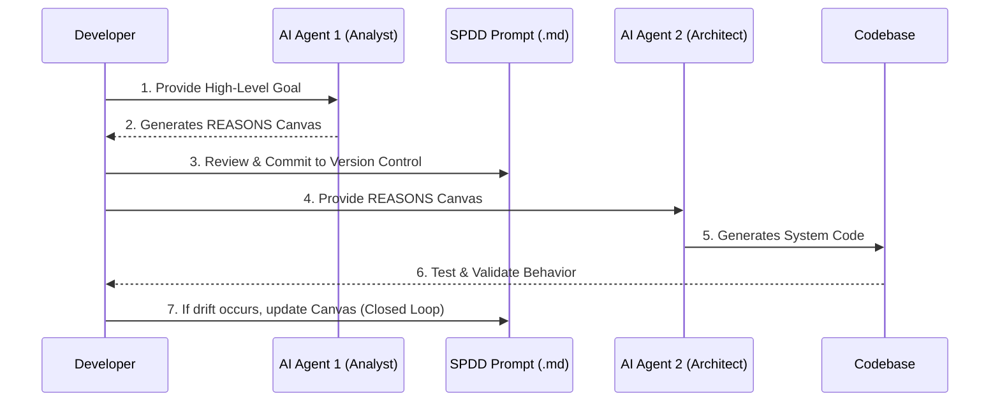

## TL;DR

- **Spec-Driven Development (SDD)** is a four-phase lifecycle — **Specify → Plan → Tasks → Implement** — that separates deciding *what* and *why* from deciding *how*, with a human review gate between every phase.
- SDD exists because a wrong assumption caught in a one-page spec costs minutes; the same assumption caught after 400 lines of generated code costs hours, and caught in production costs a lot more than that.
- **Structured Prompt-Driven Development (SPDD)** is SDD applied to AI-agent workflows: it collapses Specify/Plan/Tasks into a single structured **REASONS Canvas** (Requirements, Entities, Approach, Structure, Operations, Norms, Safeguards) that an AI Analyst persona drafts, reviews, and commits to version control before an Architect persona implements against it.
- The workflow operates on a **Closed Loop**: if reality diverges from intent, you update the version-controlled spec first — never manually hack the code.
- This is the natural extension of the zero-code QA/Architect workflow from the previous post: the plain-English requirements doc you wrote by hand there now becomes a structured, machine-checkable, version-controlled canvas.

---

## Prerequisites

- Completed [Agentic TDD: Multi-Agent Workflows for Zero-Code Test Generation](/agentic-tdd-zero-code/) — comfortable with the QA-persona/Architect-persona split, the Red-Green gate, and the `settled_df` schema produced by `TradeSettlementPipeline`
- Familiarity with PySpark DataFrame operations (`when`, `otherwise`, `broadcast` joins)
- A coding agent capable of reading a file from your repository as context (e.g., Claude Code, GitHub Copilot Workspace)
- Git, for version-controlling the generated spec artifacts

---

## Part 1: Spec-Driven Development (SDD)

### What Is SDD, and Why Does It Exist?

Spec-Driven Development treats a written specification — not a conversation, not tribal knowledge, not the first draft of code — as the source of truth for what a system must do. Code is generated *from* the spec and validated *against* it; when they disagree, the spec is what you trust and the code is what you regenerate.

The reasons this matters more with AI in the loop, not less:

- **Review cost is asymmetric.** Reading a one-page Markdown spec and spotting a wrong assumption takes a couple of minutes. Spotting the same wrong assumption buried in a 400-line AI-generated PySpark module takes much longer, and you often only find it once a test fails in an unrelated place.
- **A spec outlives any one AI session.** Chat context resets, models change, the engineer who wrote the prompt goes on leave. A committed spec is unambiguous and doesn't depend on anyone remembering exactly how a conversation went.
- **It forces assumptions into the open before code exists.** "Should a zero-quantity trade be quarantined or silently dropped?" is a five-second question to answer in a spec review. It's a much more expensive one to notice from behaviour in production.
- **It creates an audit trail.** In a domain like trade settlement or billing, being able to point to the exact versioned document that authorized a calculation is not optional — it's what a compliance review will ask for.
- **It decouples intent from any single implementation.** The same spec for "settle a trade and quarantine bad records" could be re-implemented in PySpark, in plain pandas, or in a different language entirely, without rewriting what the system is supposed to do.

SDD is often contrasted with TDD rather than treated as a replacement for it: TDD verifies correctness at the level of a specific function or class; SDD operates one level up, using the specification to drive what those tests should even be. The zero-code workflow in the previous post already blurred that line — the requirements doc informally *was* your spec.

### The Four Phases of SDD

Modern spec-driven development is usually described as a four-phase, gated lifecycle. You don't advance to the next phase until a human has reviewed and approved the current one:

```
SPECIFY ──→ PLAN ──→ TASKS ──→ IMPLEMENT
   │          │        │          │
   ▼          ▼        ▼          ▼
 Human      Human    Human      Human
 reviews    reviews  reviews    reviews
```

| Phase | Answers | Typical artifact | Review question |
|-------|---------|-------------------|-----------------|
| **1. Specify** | What are we building, and for whom? What's explicitly out of scope? | `spec.md` | "Is this the right problem, stated unambiguously?" |
| **2. Plan** | What's the technical approach — data model, algorithm, constraints? | `plan.md` | "Is this the right approach, given the spec?" |
| **3. Tasks** | What's the ordered, independently verifiable breakdown of the plan? | `tasks.md` | "Can each task be implemented and checked on its own?" |
| **4. Implement** | What's the actual code and tests that satisfy each task? | Source + test files | "Does this task's implementation pass its own verification step?" |

The discipline that makes this work isn't the file names — it's the gate. Skipping straight from a vague goal to code collapses all four review points into one, which is exactly the failure mode SDD exists to prevent.

### A Worked SDD Example: Adding Commission Calculation

`TradeSettlementPipeline` (previous post) already produces a `settled_df` with one row per valid trade: `transaction_id`, `symbol`, `quantity`, `price`, `settled_value`, `processed_timestamp`. We now need to add brokerage commission to each settled trade, supporting three plan types. Let's walk the four phases one at a time — using AI to draft each artifact, but reviewing and approving before it becomes the input to the next phase. This is the same discipline as the QA/Architect split in the previous post, just applied to four gates instead of two.

**Phase 1 — Specify**

**Prompt:**

> "Act as a Business Analyst. I need a `spec.md` for adding brokerage commission calculation on top of an existing `settled_df` (columns: transaction_id, symbol, quantity, price, settled_value, processed_timestamp). Support three plan types: flat, tiered, and percentage-based. State the goal, what's in scope, what's explicitly out of scope, and list any open questions you need me to resolve before you move on to a technical plan. Output only the Markdown file."

**Output — `spec.md`:**

```markdown
# spec.md: Trade Commission Calculation

## Goal
For every row in `settled_df`, calculate a brokerage commission based on the
customer's plan, and produce `billed_df` with the commission and net proceeds.

## In scope
- Three plan types: `flat` (fixed fee per trade), `tiered` (fee band by
  settled_value), `percentage` (fee = settled_value * rate).
- Every row in `settled_df` must appear exactly once in `billed_df`.

## Out of scope (this phase)
- Multi-currency commission (all trades are assumed INR).
- Promotional or introductory discount plans.

## Open questions (resolved before Plan)
- Q: What happens if a customer has no plan on record?
  A: Default to the `flat` plan at the platform's standard rate.
```

Review gate: you answer the open question inline (as shown above) before this file is allowed to feed the next phase. An unanswered open question is a blocked spec, not a detail to leave for the Architect to guess at.

**Phase 2 — Plan**

**Prompt:**

> "Act as a Data Architect. Here is the approved `spec.md` [paste Phase 1 output]. Produce a `plan.md`: the technical approach, the data model, and any hard constraints (Safeguards) the implementation must respect. We are on PySpark — no UDFs. Do not write any code yet."

**Output — `plan.md`:**

```markdown
# plan.md: Trade Commission Calculation

## Approach
Join `settled_df` against a broadcast `PricingTier` lookup keyed by
`plan_type`. Use native PySpark `when`/`otherwise` for the three branches.
No UDFs — commission math must stay in Spark's native execution plan.

## Data model
- `PricingTier(plan_type: str, flat_fee: float, tier_rate: float, pct_rate: float)`
- `billed_df` = `settled_df` + `commission_amount` + `net_proceeds`

## Constraints (Safeguards)
- No `.collect()` or `.toPandas()` in the transformation path.
- `commission_amount` must never be negative or exceed `settled_value`.
```

**Phase 3 — Tasks**

**Prompt:**

> "Act as a Tech Lead. Here is the approved `plan.md` [paste Phase 2 output]. Break it into an ordered `tasks.md`. Each task must be small enough to implement and verify independently, and must not depend on a task later in the list."

**Output — `tasks.md`:**

```markdown
# tasks.md: Trade Commission Calculation

- [ ] T1: Define the `PricingTier` broadcast lookup construction.
- [ ] T2: Implement the `flat` branch and its test.
- [ ] T3: Implement the `tiered` branch and its test.
- [ ] T4: Implement the `percentage` branch and its test.
- [ ] T5: Implement the missing-plan default-to-`flat` behaviour and its test.
- [ ] T6: Wire `apply_commission()` into the nightly job after settlement.
```

**Phase 4 — Implement**

Each task gets its own prompt, scoped to that task only — not the whole plan. This keeps the diff small and the review fast.

**Prompt (for T2):**

> "Implement only task T2 from `tasks.md`: the `flat` commission branch. Context: `plan.md` [paste Phase 2 output]. Write the pytest test first, show it failing, then write the minimal PySpark code to pass it. Do not implement T3–T6 yet."

**Output:**

```python
# test_commission_engine.py (T2 only)
def test_flat_plan_charges_fixed_fee(spark_session, settled_row_factory):
    settled_df = settled_row_factory(plan_type="flat", settled_value=24500.0)
    result = apply_commission(settled_df, pricing_tiers={"flat": {"flat_fee": 20.0, "pct_rate": 0.0}}, spark=spark_session)
    row = result.collect()[0]
    assert row.commission_amount == 20.0
    assert row.net_proceeds == 24480.0
```

```python
# commission_engine.py (T2 only — later tasks add the other branches)
def apply_commission(settled_df, pricing_tiers, spark):
    tiers_df = spark.createDataFrame(
        [(k, v["flat_fee"], v["pct_rate"]) for k, v in pricing_tiers.items()],
        ["plan_type", "flat_fee", "pct_rate"],
    )
    joined = settled_df.join(F.broadcast(tiers_df), on="plan_type", how="left")
    return joined.withColumn("commission_amount", F.col("flat_fee")).withColumn(
        "net_proceeds", F.col("settled_value") - F.col("flat_fee")
    )
```

This is exactly the Red-Green-Refactor loop from post 1, run once per task — SDD didn't replace TDD, it decided what each task's tests should verify before any of them were written. T3–T6 repeat the same prompt shape, each one only extending the previous task's code.

Doing all four phases, one prompt per task, is thorough — and noticeably slower than writing the code yourself would be, which is the same bottleneck that motivated the zero-code workflow in the previous post. The rest of this post automates it.

---

## Part 2: From SDD to Agentic SPDD

**Structured Prompt-Driven Development (SPDD)** takes the four SDD phases and compresses Specify, Plan, and most of Tasks into one artifact — the **REASONS Canvas** — generated by an AI Analyst persona instead of drafted by hand. It's SDD's discipline, automated at the pace AI can operate.

### The Agentic SPDD Workflow



**How REASONS maps back onto the four SDD phases:**

| REASONS section | SDD phase it covers |
|---|---|
| **R**equirements, **E**ntities | Specify |
| **A**pproach | Plan |
| **S**tructure, **O**perations | Plan + Tasks |
| **N**orms, **S**afeguards | Plan constraints (carried through every phase) |

### Step 1: The Plain English Goal (You)

You begin with a rough, unstructured idea of what you need to build — this replaces writing `spec.md` by hand.

```text
# Goal: Multi-Plan Commission Engine
We need to add brokerage commission calculation on top of our daily
TradeSettlementPipeline output (settled_df).
Support flat, tiered, and percentage-based plans without regressing the
existing settlement logic.
Keep it highly performant — no heavy UDFs.
```

### Step 2: Generating the Spec Artifact (AI Agent 1 - Analyst Persona)

You pass your rough goal to the first AI agent to formalize the architecture.

**Your Prompt:**

> "Act as a Lead Technical Business Analyst. Take my goal for the Commission Engine and expand it into a formal Structured Prompt using the Thoughtworks REASONS Canvas framework (Requirements, Entities, Approach, Structure, Operations, Norms, and Safeguards). The input is `settled_df` from TradeSettlementPipeline (columns: transaction_id, symbol, quantity, price, settled_value, processed_timestamp). Ensure the Safeguards explicitly prevent commission amounts from exceeding settled_value. Output only the Markdown file."

The AI generates a highly detailed, machine-readable specification:

```markdown
# Prompt Artifact: @GGQPA-002-[Feat]-multi-plan-commission.md

**R - Requirements:**
The system must apply flat, tiered, or percentage-based commission to every
row of `settled_df` and produce `billed_df`, without regressing the existing
settlement calculation.

**E - Entities:**
- `SettledTrade` (input DataFrame schema — from TradeSettlementPipeline)
- `PricingTier` (Broadcasted dictionary: plan_type -> fee rule)
- `BilledTrade` (Output schema: SettledTrade + commission_amount + net_proceeds)

**A - Approach:**
Utilize native PySpark SQL functions (`when`, `otherwise`, `broadcast` joins).
Avoid User Defined Functions (UDFs) to maintain JVM serialization speed.

**S - Structure:**
- `src/billing/commission_engine.py` (Core logic)
- `tests/billing/test_commission_engine.py` (Pytest suite)

**O - Operations:**
1. Broadcast the `PricingTier` lookup data.
2. Join `PricingTier` to `settled_df` on `plan_type`, defaulting missing
   plans to `flat`.
3. Apply conditional logic for flat / tiered / percentage calculations.

**N - Norms:**
- Strict Python type hinting.
- Follow enterprise layered architecture.
- Centralized exception handling.

**S - Safeguards:**
- NEVER trigger a `.collect()` or `.toPandas()` action within the transformation logic.
- `commission_amount` must never exceed `settled_value` for a given row.
```

Notice the Canvas already implies its own test file (`test_commission_engine.py`) under Structure, and its Operations list reads almost like the `tasks.md` from Part 1 — the Analyst persona collapsed three SDD phases into one reviewable document.

---

## Step 3: The Quality Gate (Version Control)

Because SPDD treats structured prompts as governed, reusable team assets, you do not leave this Canvas in the chat window.

1. Review the REASONS canvas — this is the same review gate as the Specify and Plan phases in Part 1, just done against one document instead of two.
2. Make minor manual tweaks if the AI missed a specific business rule.
3. Save it in your repository (e.g., `.github/prompts/commission_engine.prompt.md`).
4. Commit it to Git. This ensures that the code you eventually commit maps cleanly to the exact prompt version.

---

## Step 4: System Implementation (AI Agent 2 - Architect Persona)

Now, you feed the version-controlled asset to your coding agent (like Claude Code or Copilot).

**Your Prompt:**

> "Act as a Data Architect. I have provided the version-controlled SPDD prompt `@GGQPA-002-[Feat]-multi-plan-commission.md`. Phase 1: read the REASONS Canvas and produce `commission_plan.md`, restating the Approach and Structure as a concrete implementation plan. Wait for my approval. Phase 2: once approved, implement the PySpark modules and `pytest` suite exactly as constrained by the Canvas."

**Output — Phase 1, `commission_plan.md`:**

```markdown
# commission_plan.md (derived from @GGQPA-002-[Feat]-multi-plan-commission.md)

## Implementation approach
- `apply_commission(settled_df, pricing_tiers, spark) -> DataFrame`
- Build `PricingTier` as a small in-memory DataFrame, broadcast it — never a
  driver-side Python dict joined row-by-row.
- Missing `plan_type` on a row defaults to `"flat"` via `F.coalesce` before
  the join, per the Canvas's Operations step 2.
- `commission_amount` computed with `when(percentage, ...).otherwise(flat_fee)`,
  then capped with `F.least(raw, settled_value)` to satisfy the second Safeguard.

## Files to be created
- `src/billing/commission_engine.py`
- `tests/billing/test_commission_engine.py`
```

This is the same review gate as approving `plan.md` by hand in Part 1 — you're checking the *approach* (broadcast join, capped commission) before a single line of the real module exists. Only after approving this does the Architect persona move to Phase 2. Because the AI is bound by the specific *Safeguards* and *Approach* you dictated, the resulting implementation is highly predictable and significantly easier to validate. A conforming implementation looks like this:

```python
# src/billing/commission_engine.py
from pyspark.sql import DataFrame, SparkSession
from pyspark.sql import functions as F


def apply_commission(
    settled_df: DataFrame,
    pricing_tiers: dict[str, dict[str, float]],
    spark: SparkSession,
) -> DataFrame:
    """Apply flat, tiered, or percentage commission to settled trades.

    Args:
        settled_df: Output of TradeSettlementPipeline (must include
            transaction_id, plan_type, settled_value).
        pricing_tiers: Mapping of plan_type -> {"flat_fee", "pct_rate"},
            broadcast to executors. Missing plan_type defaults to "flat".
        spark: Active SparkSession, used to build the broadcast lookup.

    Returns:
        DataFrame with added `commission_amount` and `net_proceeds` columns.

    Safeguards:
        No `.collect()` or `.toPandas()` calls — the lookup is broadcast,
        never materialised to the driver. commission_amount is capped at
        settled_value.
    """
    tiers_rows = [
        (plan_type, rule["flat_fee"], rule["pct_rate"])
        for plan_type, rule in pricing_tiers.items()
    ]
    tiers_df = spark.createDataFrame(tiers_rows, ["plan_type", "flat_fee", "pct_rate"])
    broadcast_tiers = F.broadcast(tiers_df)

    with_plan = settled_df.withColumn(
        "plan_type", F.coalesce(F.col("plan_type"), F.lit("flat"))
    )
    joined = with_plan.join(broadcast_tiers, on="plan_type", how="left")

    raw_commission = (
        F.when(F.col("plan_type") == "percentage", F.col("settled_value") * F.col("pct_rate"))
        .otherwise(F.col("flat_fee"))
    )
    capped_commission = F.least(raw_commission, F.col("settled_value"))

    return joined.withColumn("commission_amount", capped_commission).withColumn(
        "net_proceeds", F.col("settled_value") - F.col("commission_amount")
    )
```

Read this against the Canvas before running anything: the join uses `broadcast` as the Approach required, there's no `.collect()`/`.toPandas()` per the Safeguards, `commission_amount` is explicitly capped with `F.least(...)` per the second Safeguard, and the structure matches `src/billing/commission_engine.py`. That line-by-line check *is* the validation step — not a formality before it.

---

## Step 5: The Closed-Loop Verification

Once the code is generated, run your tests. The operating principle here is: **Run first, review second**.

Make correct behavior the primary quality gate. If the system fails, or if you notice the AI snuck a `.toPandas()` conversion into the PySpark code despite your instructions, **do not manually hack the Python code to fix it.**

### The Golden Rule of SPDD

Prompt and code must stay synchronized so that intent and implementation do not drift apart.
If the code drifts from your expectations, you must update the prompt and regenerate, treating the prompt as a first-class source artifact.

```text
Iteration: "The generated code used a UDF on line 45, which violates the Safeguards.
I have updated the REASONS canvas to be more explicit about using PySpark `when`
chains. Read the updated canvas and regenerate the module."
```

---

## ⚠️ Common Mistakes

**Mistake 1: Treating the Canvas as a "Handoff"**
Generating a spec and abandoning it turns SPDD into Waterfall. SPDD is a sync, not a handoff. The prompt is a maintained artifact that stays the definitive record of what was intended.

**Mistake 2: Using the Same Agent for Both Steps**
If you tell an AI to "Write the spec and then immediately write the code," it will optimize the spec to be as easy as possible for it to implement. Separating the personas forces rigorous design — the same reason the QA and Architect personas were kept apart in the previous post.

**Mistake 3: Skipping Functional Validation**
Do not get lost reading the code first. Quickly set up and run the system locally to verify behavior against business expectations. Only after functionality is proven should you do a deep code review to catch maintainability issues.

**Mistake 4: Letting the Canvas go stale**
A REASONS Canvas that no longer matches the committed code is worse than no canvas at all — it actively misleads the next engineer (or AI persona) who reads it. Treat a drifted Canvas as a bug, not documentation debt to clean up later.

**Mistake 5: Collapsing phases without keeping the review gates**
SPDD compresses SDD's four documents into one Canvas, but it should not compress the four *reviews* into one skim. Read the Requirements/Entities as if reviewing a Specify phase, then separately read the Approach/Structure/Operations as if reviewing a Plan and Tasks phase.

---

## 💡 Pro Tips

1. **Template-Driven Prompts:** Maintain a baseline `@TEST-SCENARIOS-TEMPLATE.md` in your repository. When you need the AI to generate unit tests, instruct it to cross-reference the implementation file with your testing template to enforce uniform standards.
2. **Deduplicate Scenarios Automatically:** If using AI to generate tests based on your canvas, explicitly instruct the AI to cross-reference existing test suites to identify genuinely new scenarios and remove redundancies.
3. **Strip Implementation Details:** When writing Acceptance Criteria within your REASONS canvas, focus purely on what the system should do, not how, keeping criteria concise with concrete numeric examples.
4. **Diff the Canvas, not just the code.** Since the Canvas is version-controlled, `git diff` on the `.prompt.md` file tells reviewers exactly what requirement changed — often a faster review than reading the regenerated implementation line by line.
5. **Number your open questions before Specify closes.** The "Open questions" block in the worked `spec.md` example is cheap insurance — force yourself (or the Analyst persona) to list unresolved assumptions explicitly, rather than letting the Architect persona silently pick one.

---

## 📚 References

- [Apache Spark — Performance Tuning (broadcast joins)](https://spark.apache.org/docs/latest/sql-performance-tuning.html) — Why broadcast joins avoid the shuffle cost this Canvas's Safeguards are protecting against
- [Claude Code — Anthropic documentation](https://docs.anthropic.com/en/docs/claude-code/overview) — Reading version-controlled prompt files as agent context
- [Martin Fowler — Specification by Example](https://martinfowler.com/bliki/SpecificationByExample.html) — The broader design lineage behind treating specs as executable, reviewable artifacts
- [PySpark SQL functions reference](https://spark.apache.org/docs/latest/api/python/reference/pyspark.sql/functions.html) — `when`, `otherwise`, `broadcast`, and `least` used in the Approach above

---

## ➡️ Next Steps

By adopting SDD's phase discipline and automating it with an Agentic SPDD workflow, you elevate yourself from a code-writer to a systems orchestrator. Across this series, one `PortfolioLedger` grew a settlement pipeline, and that pipeline grew a commission engine — each step reviewed at a gate before the next was built. Your repository becomes a library of version-controlled intents, making future refactoring and scaling entirely deterministic.

<!-- **Next post:** [Design Patterns for AI-Assisted Development, Part 1: Principles & Creational Patterns →](/posts/design-patterns-part-1/) -->

In Module 2's next post, you'll learn the vocabulary that lets you describe structure precisely — and the patterns that prevent AI-generated code from becoming unmaintainable over time.
