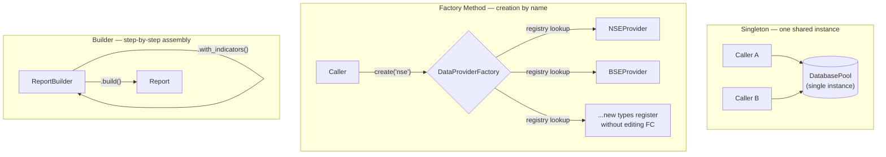

## TL;DR

- Design patterns are proven, named solutions to recurring design problems — the Gang of Four grouped them into Creational, Structural, and Behavioral families.
- SOLID principles are the foundation every pattern builds on; knowing them lets you spot *why* AI-generated code feels wrong, not just that it does.
- This post covers the **Creational** family — Singleton, Factory Method, Builder — patterns that control how objects get made.
- Part 2 covers Structural and Behavioral patterns, which control how objects are composed and how they communicate.

---

## Why This Belongs in the Series

After [Agentic SDD & SPDD](/posts/agentic-spdd-multi-agent/), the next skill you need isn't a bigger prompt — it's a **shared vocabulary**. Design patterns give you that vocabulary. Two things make them worth a dedicated module here:

1. **Faster review.** Recognizing "this is a Factory" or "this Singleton has no lock" lets you evaluate AI-generated code in seconds instead of re-reading it line by line.
2. **More precise prompts.** Saying "make this a Strategy" is faster and less ambiguous than a paragraph describing the behavior you want — and it constrains the AI toward a shape you already know how to review.

Patterns aren't the goal; they're leverage for working faster and more safely with an AI pair programmer.

---

## Prerequisites

- Basic Python OOP (classes, inheritance, `__init__`)
- Familiarity with TDD basics (see [TDD Fundamentals](/posts/tdd-fundamental/))

---

## Design Patterns in 60 Seconds

A **design pattern** is a general, reusable solution to a recurring design problem — a blueprint you adapt, not code you copy verbatim. They were popularized by the *Gang of Four* (Gamma, Helm, Johnson, Vlissides) in their 1994 book, which documented 23 patterns across three families:

| Family | Concern | Examples |
|--------|---------|---------|
| **Creational** | How objects are created | Singleton, Factory, Builder |
| **Structural** | How objects are composed | Adapter, Decorator, Composite |
| **Behavioral** | How objects communicate | Observer, Strategy, Dependency Injection |

> **Analogy:** a design pattern is like a chess opening — you don't memorize the moves robotically, you understand the strategy so you can adapt under pressure.

---

## How It Works: The Three Creational Patterns in This Post

Each of the three patterns below solves a different creation problem. The diagram shows the shape of each — this is also the shape to check an AI-generated class against before accepting it:



---

## SOLID: The Foundation Under Every Pattern

Every pattern below is essentially an application of one or more SOLID principles. This table is the one to keep open while reviewing AI output, because it names the failure mode before it becomes a pattern violation:

| Principle | One-liner | AI Risk if Ignored |
|-----------|-----------|-------------------|
| **S**ingle Responsibility | One class, one job | AI packs too much logic into one class |
| **O**pen/Closed | Open for extension, closed for modification | AI overwrites existing code instead of extending it |
| **L**iskov Substitution | Subclasses must honour the parent contract | AI breaks inheritance assumptions silently |
| **I**nterface Segregation | Many specific interfaces > one bloated interface | AI creates fat interfaces with unused methods |
| **D**ependency Inversion | Depend on abstractions, not concretions | AI hardcodes dependencies, breaking testability |

Dependency Inversion in particular sets up the Dependency Injection pattern in Part 2 — depending on a `Protocol` instead of a concrete class is the difference between code you can test and code you can't.

---

## Creational Patterns: Controlling How Objects Get Made

Without a creational pattern, object-creation logic scatters across the codebase — when you swap a database provider, you're hunting down every `MyDB()` call by hand. These three patterns centralize that decision.

### 1. Singleton — One Shared Instance

Guarantees a single instance exists app-wide (e.g. one connection pool).

```python
import threading

class DatabasePool:
    _instance = None
    _lock = threading.Lock()

    def __new__(cls):
        if cls._instance is None:
            with cls._lock:
                if cls._instance is None:  # double-checked locking
                    cls._instance = super().__new__(cls)
                    cls._instance.connections = [f"conn_{i}" for i in range(5)]
        return cls._instance

pool_a, pool_b = DatabasePool(), DatabasePool()
assert pool_a is pool_b  # same instance
```

**Why it matters for AI-assisted dev:** AI almost always generates Singletons *without* the lock. Add to your review prompt: *"Does `__new__` use double-checked locking? Without it, two threads can both pass the first check before either acquires the lock, creating two instances."*

### 2. Factory Method — Decoupling Creation From Use

Callers ask for an object *by name*, never by class — new types register themselves instead of editing the factory (Open/Closed in action).

```python
class DataProviderFactory:
    _registry: dict[str, type] = {"nse": NSEProvider, "bse": BSEProvider}

    @classmethod
    def create(cls, provider_type: str):
        provider_class = cls._registry.get(provider_type.lower())
        if provider_class is None:
            raise ValueError(f"Unknown provider: {provider_type}")
        return provider_class()

    @classmethod
    def register(cls, name: str, provider_class: type) -> None:
        cls._registry[name] = provider_class  # extend without modifying

# Adding a provider never touches the existing class:
DataProviderFactory.register("mock", MockProvider)
```

**Why it matters:** when you ask AI to add a new provider, be explicit — *"Do NOT modify the existing factory class; register the new provider externally."* Otherwise it will happily edit the `if/elif` chain it should be replacing.

### 3. Builder — Assembling Complex Objects Step by Step

Best for objects with many optional parameters — a fluent alternative to a 10-argument constructor.

```python
class ReportBuilder:
    def __init__(self):
        self._symbols, self._indicators, self._format = [], [], "html"

    def with_symbols(self, *symbols):
        self._symbols.extend(symbols); return self

    def with_indicators(self, *indicators):
        self._indicators.extend(indicators); return self

    def build(self):
        if not self._symbols:
            raise ValueError("At least one symbol is required.")
        return Report(self._symbols, self._indicators, self._format)

report = ReportBuilder().with_symbols("RELIANCE", "TCS").with_indicators("RSI").build()
```

**Why it matters:** AI-generated Builders rarely validate in `build()`. Always ask for validation of required fields *and* logically inconsistent combinations (e.g. an end date before a start date) — a Builder that returns `None` on bad input instead of raising is a silent-failure trap.

---

## 🤖 AI in Development

### Worked Example — Reviewing an AI-Generated Singleton

**The prompt:**

```
Write a Python class that manages a single shared connection pool for our
market-data API client. It should be created once and reused everywhere.
```

**What the agent produced:**

```python
# ⚠️ AI-generated — compiles, "works" in a quick manual test
class DatabasePool:
    _instance = None

    def __new__(cls):
        if cls._instance is None:
            cls._instance = super().__new__(cls)
            cls._instance.connections = [f"conn_{i}" for i in range(5)]
        return cls._instance
```

**The review pass:**

1. *Does `__new__` guard against a race?* No — there's no lock at all. Two threads can both evaluate `cls._instance is None` as `True` before either finishes constructing the instance, producing two pools.
2. *Is this pattern even justified here?* Yes — a shared connection pool genuinely needs exactly one instance app-wide, so Singleton is the right call (contrast with the first Common Mistake below, where it often isn't).
3. *Is the pattern named anywhere in the code or a comment?* No — the next engineer (human or AI) who touches this file has to reverse-engineer that it's a Singleton from the `__new__` override alone.

**The fix to request:**

```
Add double-checked locking to __new__ using threading.Lock, and add a class
docstring stating this is a Singleton and why (one shared connection pool,
not a per-request one).
```

This three-question review — "is there a race?", "is the pattern justified?", "is it named?" — is worth running against every AI-generated Singleton, Factory, or Builder, not just this one.

### Prompt Habits That Pay Off Across All Three Patterns

- **Constrain before generating:** *"Each class should have a single responsibility — separate data access, business logic, and I/O."*
- **Constrain extension, not modification:** *"Add the new type by registering it externally; do not touch the existing factory/class."*
- **Ask for the failure mode explicitly:** for Singleton, ask about thread safety; for Factory, ask what happens on an unknown key; for Builder, ask what happens on missing/invalid fields.
- **Use pattern names in code review:** "this should be a Factory" is faster than a paragraph of explanation, for you and for the AI.

---

## ⚠️ Common Mistakes

**Mistake 1: Forcing a pattern onto a two-line problem.** A helper function doesn't need a Factory. If you can't state which SOLID principle a pattern is protecting, you probably don't need it yet.

**Mistake 2: Singleton without a thread-lock.** Two threads can both pass the `is None` check before either acquires a lock, creating two instances — see the worked example above.

**Mistake 3: Factory importing concrete classes at the top level.** This creates circular-import risk as the registry grows. Import inside the method, or register from each provider module instead.

**Mistake 4: Builder that fails silently.** A `build()` that returns `None` on invalid state instead of raising is a silent-failure trap — the caller finds out three layers later, if at all.

**Mistake 5: AI generating "God classes" that violate Single Responsibility.** This is the single most common AI output problem worth catching in review — a class that does data access, business logic, and formatting all at once is a sign no pattern was applied at all.

---

## 💡 Pro Tips

1. **Name the pattern in the class docstring.** `"""Singleton — one shared instance app-wide."""` costs one line and saves the next reader (or AI agent) from having to infer it from the code.
2. **Ask "which SOLID principle does this protect?" before applying a pattern.** If you can't answer, the pattern is likely decoration, not a fix.
3. **Prefer registration over `if/elif` chains.** A Factory's whole value is Open/Closed — if adding a type still means editing the Factory's body, you haven't actually decoupled creation from use.
4. **Validate in `build()`, not in the caller.** A Builder's job is to guarantee the object it returns is valid; pushing that check out to every call site defeats the purpose.

---

## 📚 References

- [Design Patterns: Elements of Reusable Object-Oriented Software — Gamma, Helm, Johnson, Vlissides](https://www.oreilly.com/library/view/design-patterns-elements/0201633612/) — the original Gang of Four catalogue
- [Refactoring Guru — Design Patterns](https://refactoring.guru/design-patterns) — pattern catalogue with Python examples
- [Python Design Patterns](https://python-patterns.guide/) — Python-idiomatic treatments of GoF patterns
- [SOLID principles — Robert C. Martin](https://web.archive.org/web/20150906155800/http://www.objectmentor.com/resources/articles/Principles_and_Patterns.pdf) — the original SOLID writing
- [`threading` — Python docs](https://docs.python.org/3/library/threading.html) — `Lock` reference, used in the Singleton double-checked-locking example

---

## Next Steps

Part 2 covers the **Structural** patterns (Adapter, Decorator, Composite) — how to compose objects that weren't designed to work together — and the **Behavioral** patterns (Observer, Strategy, Dependency Injection), which govern how objects communicate and, critically, how testable your AI-generated services are.

Continue to [Design Patterns Part 2 →](/posts/design-patterns-part-2/)
