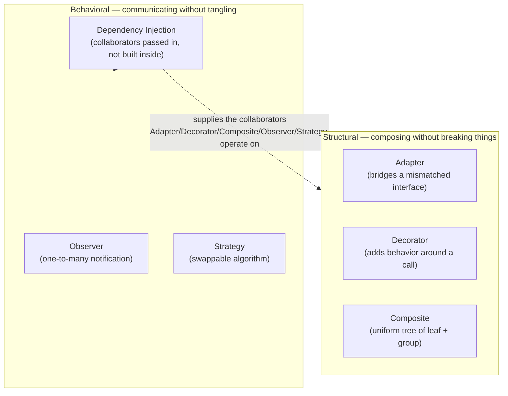

## TL;DR

- **Structural** patterns (Adapter, Decorator, Composite) control how objects are *composed* without breaking existing code.
- **Behavioral** patterns (Observer, Strategy, Dependency Injection) control how objects *communicate* while staying loosely coupled.
- Together with Part 1's Creational patterns, these nine patterns are the vocabulary this series uses for the rest of the AI-engineering track — especially once we get to Architecture.

---

## Recap: Why We're Still on Patterns

[Part 1](/posts/design-patterns-part-1/) covered SOLID and Creational patterns because *creation* is usually the first thing AI gets wrong (hardcoded dependencies, un-locked Singletons). This post covers the other two families for a reason tied directly to the series' next module:

- **Structural patterns** let you bridge legacy code, AI-generated code, and third-party APIs without rewriting any of them — a constant need once you're gluing multiple AI-generated modules together.
- **Behavioral patterns**, especially **Dependency Injection**, are the single biggest lever for making AI-generated services testable — which is the whole point of pairing this module with the earlier TDD post.

Both families set up [Software Architecture →](/posts/architecture-intro/), where these patterns stop being isolated tricks and become the building blocks of a system design.

---

## Prerequisites

- [Design Patterns Part 1](/posts/design-patterns-part-1/) (SOLID + Creational patterns)
- Python: `Protocol`, `ABC`, `functools`, `*args/**kwargs`

---

## How It Works: Structural vs. Behavioral, at a Glance

Structural patterns change how objects are *wired together*; behavioral patterns change how they *talk once wired*. Dependency Injection sits at the boundary of both — it's how the other five patterns in this post usually get their collaborators in the first place:



---

## Structural Patterns: Composing Without Breaking Things

Structural patterns answer: *how do I connect objects that weren't designed to work together, or add capability without touching existing code?* Think plumbing adapters — you don't rip out the old pipe, you bridge it.

### 1. Adapter — Bridging Incompatible Interfaces

```python
class NSEClientAdapter(ModernDataClient):
    """Translates the legacy interface into the modern one."""
    def __init__(self, legacy_client: LegacyNSEClient) -> None:
        self._client = legacy_client

    def get_quote(self, symbol: str) -> StockQuote:
        raw = self._client.fetch_data(symbol)
        return StockQuote(symbol=raw["scrip"], price=raw["ltp"], source=raw["exchange"])
```

**Why it matters:** this is the pattern you reach for when AI generates a new client with a slightly different method signature than the rest of your codebase — wrap it instead of editing either side. Prompt tip: *"The Adapter must not modify either existing class."*

### 2. Decorator — Adding Behavior Without Subclassing

```python
import functools, time

def cached(ttl_seconds: int = 60):
    def decorator(func):
        cache = {}
        @functools.wraps(func)  # preserves __name__, __doc__ — easy to forget
        def wrapper(*args, **kwargs):
            key = (args, tuple(sorted(kwargs.items())))
            if key in cache and time.monotonic() - cache[key][1] < ttl_seconds:
                return cache[key][0]
            result = func(*args, **kwargs)
            cache[key] = (result, time.monotonic())
            return result
        return wrapper
    return decorator

@cached(ttl_seconds=300)
def get_stock_price(symbol: str) -> float: ...
```

**Why it matters:** AI-generated decorators routinely skip `@functools.wraps`. Without it, `help()`, `pytest --collect-only`, and Sphinx all misidentify your functions — a small omission with a wide blast radius. Always ask AI to confirm it's there.

### 3. Composite — Treating One Object and a Group the Same

```python
class Portfolio(PortfolioComponent):
    """Composite node — contains Positions or sub-Portfolios."""
    def __init__(self, name: str) -> None:
        self._name, self._components = name, []

    def add(self, component: "PortfolioComponent") -> "Portfolio":
        self._components.append(component); return self

    def current_value(self) -> float:
        return sum(c.current_value() for c in self._components)
```

Both a single `Position` and a nested `Portfolio` expose the same `current_value()` — client code never needs an `isinstance` check.

**Why it matters:** this is the shape you want any time AI generates a tree structure (categories, org charts, nested portfolios). Watch for AI mutating state inside a method that's supposed to be a pure calculation — `current_value()` should never have side effects.

---

## Behavioral Patterns: Objects That Communicate Without Tangling

Behavioral patterns answer: *how should objects talk to each other while staying loosely coupled?* Without them you get event handling buried inside service methods, algorithms hardcoded into the caller, and services that `new`-up their own dependencies and can't be tested.

### 1. Observer — Event-Driven Pub/Sub

```python
class PriceFeed:
    def __init__(self) -> None:
        self._subscribers = []

    def subscribe(self, callback) -> None:
        self._subscribers.append(callback)

    def update_price(self, symbol: str, price: float) -> None:
        for callback in self._subscribers:
            try:
                callback(symbol, price)
            except Exception as exc:
                logger.error("Observer error for %s: %s", symbol, exc)
```

**Why it matters:** the try/except *inside the loop* is the detail AI often drops — one failing subscriber shouldn't be able to kill every other subscriber. Ask explicitly for per-observer error isolation.

### 2. Strategy — Swappable Algorithms at Runtime

```python
class PortfolioRanker:
    """Applies any RankingStrategy without knowing its implementation."""
    def __init__(self, strategy) -> None:
        self._strategy = strategy

    def set_strategy(self, strategy) -> None:
        self._strategy = strategy  # swap at runtime

    def rank(self, stocks):
        return self._strategy.rank(stocks)
```

`ValueStrategy`, `MomentumStrategy`, `QualityStrategy` all implement the same `rank()` — the ranker never imports a concrete strategy. **Why it matters:** this is the direct fix for AI's tendency to hardcode a single algorithm (e.g. a `rank_stocks` function that only ever sorts by P/E). Prompt: *"The context class must not import or reference any concrete strategy."*

### 3. Dependency Injection — The Highest-Impact Pattern Here

```python
@dataclass
class AnalysisService:
    """All dependencies injected — zero hardcoded concretions."""
    quote_provider: QuoteProvider
    cache: CacheProvider
    notifier: NotificationService

    def analyse(self, symbol: str) -> dict:
        ...
```

In production, wire in `NSEQuoteProvider`, `RedisCache`, `SMSNotifier`. In tests, swap in `FakeQuoteProvider`, `InMemoryCache`, `RecordingNotifier` — no real DB, network, or SMS required.

**Why it matters most:** this single instruction — *"inject all external dependencies via constructor parameters; do not instantiate them inside the class"* — does more for AI-generated code quality than any other prompt in this series, because it's what makes the code testable at all. The most common AI violation to catch in review is `self.cache = Redis()` sitting inside `__init__`.

---

## 🤖 AI in Development

### Worked Example — Reviewing an AI-Generated Service for Hardcoded Dependencies

**The prompt:**

```
Write an AnalysisService class that fetches a stock quote, checks a cache
first, and sends a notification if the price crossed a threshold.
```

**What the agent produced:**

```python
# ⚠️ AI-generated — runs fine in a demo, fails the DI checklist
class AnalysisService:
    def __init__(self):
        self.quote_provider = NSEQuoteProvider()   # hardcoded concretion
        self.cache = Redis(host="localhost")        # hardcoded concretion
        self.notifier = SMSNotifier(api_key="...")  # hardcoded concretion

    def analyse(self, symbol: str) -> dict:
        cached = self.cache.get(symbol)
        if cached:
            return cached
        quote = self.quote_provider.get_quote(symbol)
        ...
```

**The review pass:**

1. *Can this class be unit-tested without a live Redis instance, a real NSE connection, and a real SMS account?* No — every dependency is instantiated inside `__init__`, so a test either needs all three live or has to monkeypatch three separate imports.
2. *Which pattern from this post fixes it?* Dependency Injection — the exact fix described above: type each dependency as a `Protocol` and accept it as a constructor parameter.
3. *Is this actually a Strategy problem too?* Worth checking — if `analyse()` also has an `if symbol.startswith(...)` branch choosing between valuation approaches, that's a second, separate violation (hardcoded algorithm selection) that DI alone won't fix.

**The fix to request:**

```
Rewrite AnalysisService so quote_provider, cache, and notifier are all
typing.Protocol-typed constructor parameters — remove every concrete
instantiation from __init__. Provide Fake implementations of all three
Protocols suitable for a pytest fixture.
```

Running this fix through an agent reliably produces the `AnalysisService` shape shown earlier in this post — `Protocol`-typed fields on a `@dataclass`, with no concrete class instantiated anywhere inside the service.

### Combined Prompt Toolkit

- **Adapter:** name the exact field mapping you want (`ltp → price`, `scrip → symbol`) and forbid touching either existing class.
- **Decorator:** always ask "does this use `@functools.wraps`?" as a standing review question.
- **Composite:** require both the leaf and the composite to implement the same interface — no `isinstance` branching in client code.
- **Observer:** require try/except around each subscriber call, not around the whole loop.
- **Strategy:** forbid the context class from importing any concrete strategy.
- **DI:** make "inject everything via the constructor, use `Protocol` for each interface" a standing constraint on every service-generation prompt, not a one-off request.

---

## ⚠️ Common Mistakes

**Mistake 1: Modifying a legacy class instead of writing an Adapter for it.** Editing the original touches every existing caller; wrapping it in an Adapter touches none of them.

**Mistake 2: Decorators missing `@functools.wraps`.** Without it, `help()`, `pytest --collect-only`, and Sphinx all misidentify the wrapped function — see the worked example in the Decorator section above.

**Mistake 3: Composite implementations without a shared interface.** This forces `isinstance` checks throughout client code — exactly the branching Composite exists to eliminate.

**Mistake 4: Observer loops with no per-subscriber error isolation.** A try/except around the whole loop (instead of around each callback) means one failing subscriber can stop every subscriber after it from being notified.

**Mistake 5: Strategy implementations that return `None` on an unknown algorithm instead of raising.** A silent `None` propagates until something downstream crashes with a much less useful error.

**Mistake 6: `self.dependency = ConcreteClass()` hardcoded inside `__init__`.** The most common and most costly AI DI violation — see the worked example above. Every hour spent hand-writing a test double for a class that hardcodes its own dependencies is an hour DI would have made unnecessary.

---

## 💡 Pro Tips

1. **Grep for the DI violation before reading anything else.** Search AI-generated service files for `self.<word> = <ConcreteClassName>(` — this single pattern surfaces the highest-impact fix in this post faster than reading the class top to bottom.
2. **Prefer `Protocol` over `ABC` for injected dependencies.** A `Protocol` needs no inheritance relationship with the concrete class, which makes writing a `Fake` implementation for tests trivial — no need to subclass anything.
3. **Keep Observer callbacks small and side-effect-scoped.** A subscriber that does too much makes the try/except's `logger.error` line the only signal you get when it fails — keep subscribers simple enough that failures are self-explanatory.
4. **Name the pattern in a one-line comment above the class.** `# Strategy: swappable ranking algorithm` costs nothing and tells the next reader — human or AI — what shape to preserve when extending it.

---

## Series Recap: The Pattern Toolkit So Far

| Pattern | Family | Why it's in this series |
|---|---|---|
| Singleton | Creational | Catches AI's missing thread-safety |
| Factory Method | Creational | Keeps AI from editing code it should extend |
| Builder | Creational | Forces validation on complex objects |
| Adapter | Structural | Bridges AI/legacy code without touching either |
| Decorator | Structural | Adds behavior; watch for missing `@functools.wraps` |
| Composite | Structural | Uniform interface for tree-shaped AI output |
| Observer | Behavioral | Decoupled events; enforce error isolation |
| Strategy | Behavioral | Stops AI from hardcoding one algorithm |
| Dependency Injection | Behavioral | Makes AI-generated services actually testable |

---

## 📚 References

- [Design Patterns: Elements of Reusable Object-Oriented Software — Gamma, Helm, Johnson, Vlissides](https://www.oreilly.com/library/view/design-patterns-elements/0201633612/) — the original Gang of Four catalogue
- [Refactoring Guru — Design Patterns](https://refactoring.guru/design-patterns) — pattern catalogue with Python examples
- [Python Design Patterns](https://python-patterns.guide/) — Python-idiomatic treatments of GoF patterns
- [PEP 544 — Protocols: Structural subtyping](https://peps.python.org/pep-0544/) — the typing mechanism behind every `Protocol`-typed dependency in this post
- [`functools.wraps` — Python docs](https://docs.python.org/3/library/functools.html#functools.wraps) — why the Decorator example needs it
- [Martin Fowler — Inversion of Control Containers and the Dependency Injection pattern](https://martinfowler.com/articles/injection.html) — the canonical explanation of DI beyond the Python-specific mechanics here

---

## Next Steps

With this vocabulary in place, the next module moves from individual patterns to how they combine into a system.

Continue to [Software Architecture Intro →](/posts/architecture-intro/)
