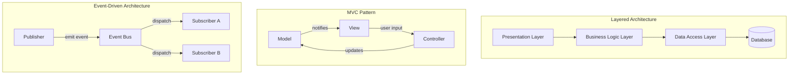
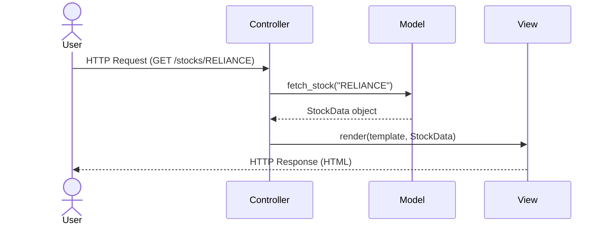
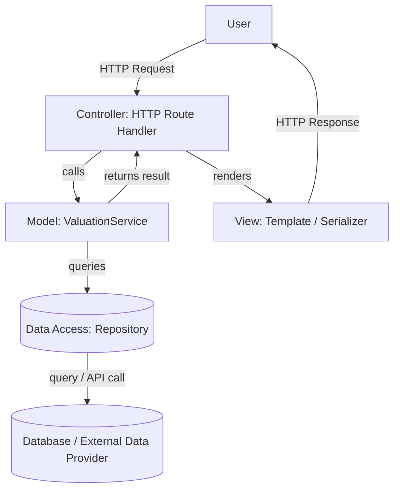
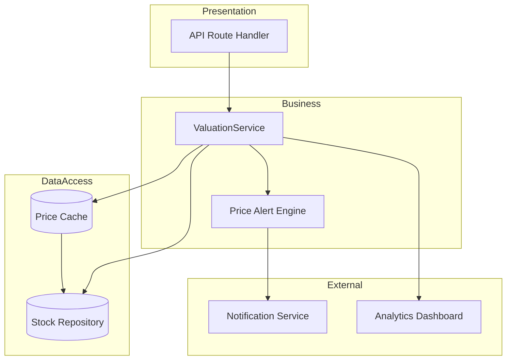
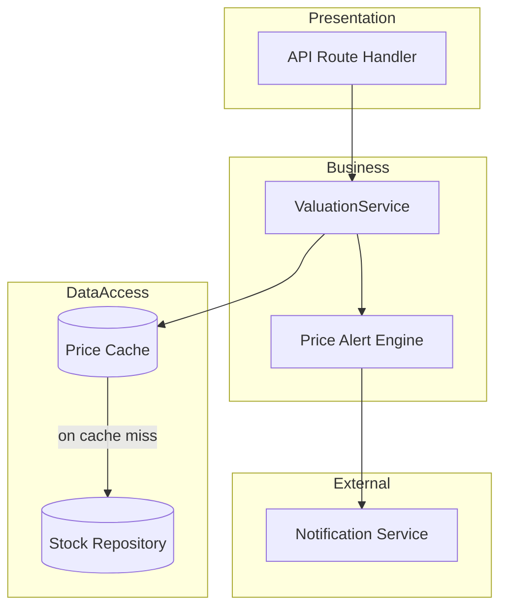

## TL;DR

- Software architecture defines how a system's components are structured, communicate, and evolve — independent of which language or framework you write it in.
- The three foundational patterns — Layered, MVC, and Event-Driven — cover most use cases you'll encounter, in any stack.
- An AI agent can generate a working file in seconds, but it has no memory of your system's boundaries from one prompt to the next. Architecture is the vocabulary you use to hold that line — in your prompts, and in your reviews.
- Use AI to *draft* architecture diagrams and scaffolding from plain English, then validate every arrow and every box against the actual code.

---

## Why This Post Exists in the AI-Assisted Development Series

This is the first post in Module 3, and Module 3 is about architecture — so it's worth being explicit about why an "architecture" module belongs in a series about building software *with* AI agents.

An AI coding agent is extremely good at producing a plausible-looking function, class, or route handler on request. What it is not good at, by default, is remembering that your data-access code is never supposed to talk directly to your presentation layer, or that `ServiceA` already depends on `ServiceB` and must not depend on it the other way around too. Each prompt is answered mostly in isolation, drawing on patterns that are statistically common in training data — not necessarily the patterns your codebase has committed to.

That means the architectural boundaries in your system now depend on something that used to be implicit (a senior engineer "just knowing" the layering) becoming explicit: written down, prompted for, and checked. Three practical consequences follow, and the rest of this module builds on all three:

1. **You need the vocabulary to specify structure in a prompt.** "Add a function that fetches the price" is ambiguous about which layer it belongs in. "Add a method to the `StockRepository` — do not add business logic to it" is not.
2. **You need the vocabulary to review what comes back.** If you can't name the layering violation, you can't ask for it to be fixed — you'll just feel a vague unease about a diff and approve it anyway.
3. **You need diagrams that are cheap to produce and easy to compare against reality**, because AI-generated code drifts from any diagram that isn't kept in the loop.

Everything else in this post — the three patterns, the diagrams, the AI-prompting examples — is in service of those three points, and this framing carries through the rest of Module 3.

---

## Prerequisites

- Design Patterns Module ([Part 1: Principles & Creational Patterns](/posts/design-patterns-part-1/), [Part 2: Structural & Behavioral Patterns](/posts/design-patterns-part-2/))
- Familiarity with HTTP request-response cycles
- Basic programming literacy: functions, classes or modules, and how a codebase is typically organised into files and folders. No specific language is assumed — the examples in this post are written as language-agnostic pseudocode.

---

## Concept Explanation

**Software architecture** is the set of high-level decisions that define a system's structure: which components exist, how they communicate, and how responsibilities are divided. Unlike design patterns (which solve object-level problems), architecture operates at the system level — it answers "how does the whole thing fit together?"

Good architecture defers decisions that don't need to be made yet, makes the important decisions explicit, and ensures the system can evolve as requirements change. Bad architecture couples everything together so tightly that a change in one place breaks three others — and an AI agent, asked to make that one change, will happily make it and quietly break the other three, because it has no way of knowing they were coupled unless the code (or you) tells it so.

> **Analogy:** Architecture is the floor plan of a building. It doesn't tell you what furniture to put in each room, but it determines which rooms exist, how they connect, and which walls can't be moved. An AI agent handed a request to "add a window" will cheerfully cut through a load-bearing wall if nothing tells it which walls those are.

---

## How It Works: Pattern Overview



---

## The Three Foundational Patterns

### 1. Layered Architecture

Components are organised into horizontal layers, each with a clear responsibility. Each layer only talks to the layer directly below it.

| Layer | Responsibility | Typical building blocks (any stack) |
|-------|---------------|-------------------|
| **Presentation** | HTTP routes, serialisation, request/response shaping | Web framework routers or controllers (e.g. Express, FastAPI, Spring MVC, ASP.NET Core, Rails controllers) |
| **Business Logic** | Rules, calculations, workflows | Service classes, domain modules, use-case objects |
| **Data Access** | Database queries, ORM mappings, persistence | Repository classes, ORMs (SQLAlchemy, Hibernate, Prisma, ActiveRecord, Entity Framework) |
| **Infrastructure** | External services, file I/O | Email/SMS clients, object storage adapters, third-party API clients |

**Rule:** A presentation layer function must never write a query directly. A data access function must never apply business rules. Crossing layers is the most common architectural sin — and, because it's the path of least resistance for an autocomplete-style suggestion, it's also the most common thing an AI agent will do if you don't stop it.

### 2. MVC (Model-View-Controller)

MVC separates a UI-bearing application into three roles:



- **Model**: Business data and rules — no knowledge of the UI.
- **View**: Renders data — no business logic.
- **Controller**: Orchestrates — receives input, calls the model, returns a view.

### 3. Event-Driven Architecture

Components communicate via events rather than direct method calls. Publishers emit events; subscribers react to them. Neither side knows about the other.

**When to use:** Real-time systems, asynchronous workflows, systems where multiple reactions can happen to the same state change (e.g., "order placed" triggers: send email, update inventory, notify warehouse, award loyalty points — all independently).

---

## Pseudocode Example — Stock Analysis Service, Layered

The example below is written as language-agnostic pseudocode. The layering — not the syntax — is the point; translate it into whichever language your project uses.

```pseudocode
# ── Layer 1: Data Access (database / API boundary) ─────────────────────

record StockRecord:
    symbol: string
    price: number
    pe_ratio: number
    market_cap: number

interface StockRepository:
    find_by_symbol(symbol) -> StockRecord or null
    find_all() -> list<StockRecord>

class InMemoryStockRepository implements StockRepository:
    # Concrete repository — swappable with a real DB implementation.
    store = {
        "RELIANCE": StockRecord("RELIANCE", 2450.75, 25.0, 1_800_000),
        "TCS":      StockRecord("TCS",      3600.00, 30.0, 1_400_000),
        "INFY":     StockRecord("INFY",     1450.50, 22.5,   600_000),
    }

    function find_by_symbol(symbol):
        return store.get(uppercase(symbol))

    function find_all():
        return values(store)


# ── Layer 2: Business Logic ─────────────────────────────────────────────

class ValuationService:
    # Business rules: no queries, no HTTP, no UI concerns.
    constructor(repo: StockRepository):
        self.repo = repo

    function classify_valuation(symbol):
        record = self.repo.find_by_symbol(symbol)
        if record is null:
            raise Error("Unknown symbol: " + symbol)

        # Business rule: P/E-based valuation classification
        if record.pe_ratio < 15:
            verdict = "undervalued"
        else if record.pe_ratio < 25:
            verdict = "fairly_valued"
        else:
            verdict = "overvalued"

        return {
            symbol: record.symbol,
            price: record.price,
            pe_ratio: record.pe_ratio,
            verdict: verdict,
        }

    function top_value_picks(limit = 3):
        all_stocks = self.repo.find_all()
        sorted_stocks = sort_by(all_stocks, key = s -> s.pe_ratio)
        return [self.classify_valuation(s.symbol) for s in sorted_stocks[0:limit]]


# ── Layer 3: Presentation (an HTTP route handler in your framework of choice) ─

function handle_get_valuation(symbol, service: ValuationService):
    # Presentation layer: validate input, call service, format response.
    # No business logic here — just orchestration and formatting.
    symbol = uppercase(trim(symbol))
    if not is_alphabetic(symbol):
        return { error: "Invalid symbol format", code: 400 }

    try:
        result = service.classify_valuation(symbol)
        return { data: result, code: 200 }
    catch ValueError as exc:
        return { error: exc.message, code: 404 }


# Wire up the layers
repo = InMemoryStockRepository()
service = ValuationService(repo)

print(handle_get_valuation("RELIANCE", service))
print(handle_get_valuation("INFY", service))
print(handle_get_valuation("UNKNOWN", service))
```

### Architecture Diagram — MVC, framework-agnostic



---

## When to Use Which Pattern

| Scenario | Best Pattern | Why |
|----------|-------------|-----|
| Web application with UI | MVC | Clean separation of routing, logic, and rendering |
| Complex business rules | Layered | Keeps business logic isolated from infrastructure |
| Real-time notifications | Event-Driven | Decouples emitters from multiple independent consumers |
| Simple scripts or CLIs | None / flat | Patterns add overhead that doesn't pay off at small scale |
| Data pipelines | Layered + Event | Extract→Transform→Load maps naturally to layers |

---

## Communicating Architecture to a Team (and to an Agent)

A good architecture diagram answers three questions at a glance:
1. **What are the components?** (boxes)
2. **How do they communicate?** (arrows with labels)
3. **What crosses a boundary?** (dashed lines between layers or services)

Those are also, not coincidentally, the three things an AI agent needs pinned down before it can generate code that respects your structure. A diagram is a compact, unambiguous artifact you can paste straight into a prompt.

**Diagramming tools:**
- [Mermaid Live Editor](https://mermaid.live/) — inline in Markdown, version-controlled, and something most AI agents can both read and write directly.
- [D2](https://d2lang.com/) — declarative, auto-layout
- [Excalidraw](https://excalidraw.com/) — whiteboard style for initial drafts
- [C4 Model](https://c4model.com/) — four zoom levels (Context → Container → Component → Code)

**The one-minute rule:** If a team member can't understand the diagram within one minute, it has too much detail. Separate concerns into multiple diagrams at different zoom levels. The same rule applies to what you paste into a prompt — an overloaded diagram gives an agent too much surface area to misread.

---

## AI in Development

**Draft with AI, validate with code.** The workflow is always the same shape: prompt for a draft, then check the draft against what actually exists.

### Worked Example 1 — Generating an Architecture Diagram

**The prompt:**

```
Draw a Mermaid diagram for the following system:
- A backend API that receives HTTP requests
- A ValuationService that applies business rules
- A relational database accessed through a repository layer
- A cache for frequently-accessed stock prices
- A notification service (email + SMS) triggered on price alerts

Use a layered architecture. Show data flow direction with arrow labels.
Use subgraphs to group layers. Keep it under 20 nodes.
```

**What the agent produced:**



**The review pass — apply the four checks from this post:**

1. *Paste it into a Mermaid renderer, does it render?* Yes.
2. *Does data actually flow this way in the code?* No — `CacheLayer --> Repo` is backwards. The repository is the source of truth; the cache reads *from* the repository on a miss, it doesn't feed data *into* it.
3. *Does every box actually exist?* No — there is no `Analytics Dashboard` anywhere in this codebase. The agent added it because "analytics" is a common neighbour of "cache" and "database" in training data, not because it was asked for.
4. *Remove anything aspirational.* Delete the `Analytics` box and its edge, and flip the cache arrow.

**Corrected diagram:**



This is the pattern to internalise: the first diagram is a draft, not a deliverable. The value you added was two small, specific corrections — and you could only make them because you knew what "the cache reads from the source of truth" and "don't keep aspirational boxes" actually mean.

### Worked Example 2 — Catching a Layering Violation in Generated Code

**The prompt:**

```
Add a method to ValuationService that returns the average P/E ratio
across all stocks priced above 1000.
```

**What the agent produced (pseudocode, reflecting the actual generated shape):**

```pseudocode
class ValuationService:
    ...
    function average_pe_above(threshold):
        # directly queries the database, bypassing the repository
        rows = database.execute(
            "SELECT pe_ratio FROM stocks WHERE price > ?", [threshold]
        )
        return average([r.pe_ratio for r in rows])
```

**The review pass:** this compiles, passes a quick manual test, and looks reasonable in a diff — which is exactly why it's dangerous. It violates the layering rule from the top of this post: business logic must never write a query directly. Concretely, this breaks two things the layering was protecting:

- `InMemoryStockRepository` (used in tests) is now bypassed — this method will fail or misbehave under test doubles.
- Swapping the persistence layer later (a new database, a new ORM) now means hunting through business logic for stray queries instead of changing one repository class.

**The fix to request:**

```
Rewrite average_pe_above so it goes through StockRepository instead of
querying the database directly. Add a find_above_price(threshold) method
to the repository interface and its in-memory implementation, and have
ValuationService call that instead.
```

The lesson isn't "AI agents write bad code." It's that an agent optimizing for "does this one function work" has no visibility into "does this respect the layer boundary two files away" unless the boundary is named in the prompt or caught in review — which is precisely the skill this post is building.

---

## Pro Tips

1. **Architecture Decision Records (ADRs).** When you make a significant architectural choice, write a 1-page ADR: context, decision, and consequences. Future-you — and any agent you point at the repo later — will be grateful.
2. **Dependency direction is non-negotiable.** Business logic must never depend on infrastructure (database, HTTP clients). Infrastructure depends on business logic contracts (interfaces). Violating this makes testing impossible.
3. **Start with a monolith.** Microservices add distribution complexity. Build a well-structured monolith first; split only when you have concrete evidence of a bottleneck.
4. **Diagrams rot — faster now than before.** Code changes; diagrams get forgotten, and an AI agent can now change a lot of code in one sitting. Add diagram review to your sprint retrospective, or regenerate diagrams from code on a schedule rather than trusting a diagram nobody has looked at in months.
5. **The 3-second test.** Show your architecture diagram to a colleague for 3 seconds, then ask them what the system does. If they can't answer, redraw it.

---

## Common Mistakes

- **Skipping the data access layer.** Putting queries directly in business logic functions is the #1 architectural sin in AI-generated code (see Worked Example 2 above). Always add a repository/adapter boundary.
- **God service.** A single service that handles everything — authentication, business logic, email sending, persistence. Split by responsibility.
- **AI generating circular dependencies.** `ServiceA` imports `ServiceB`, which imports `ServiceA`. Watch for this in AI-generated multi-file outputs. Fix by extracting a shared interface.
- **Over-architecturing small scripts.** A 50-line data processing script does not need a layered architecture with repositories and service classes.
- **Treating MVC as sacred.** Real frameworks bend MVC in practical ways. Understand the intent — separation of concerns — not the rigid definition.

---

## References

- [Martin Fowler — Patterns of Enterprise Application Architecture](https://martinfowler.com/eaaCatalog/)
- [C4 Model for architecture diagrams](https://c4model.com/)
- [Mermaid live editor](https://mermaid.live/)
- [D2 diagramming language](https://d2lang.com/)
- [Architecture Decision Records (ADRs)](https://adr.github.io/)

---

## Next Steps

Continue to [Cloud-Native and Microservices →](/posts/cloud-native-microservices/)
