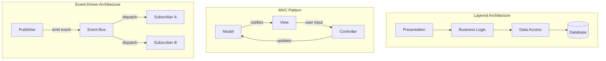
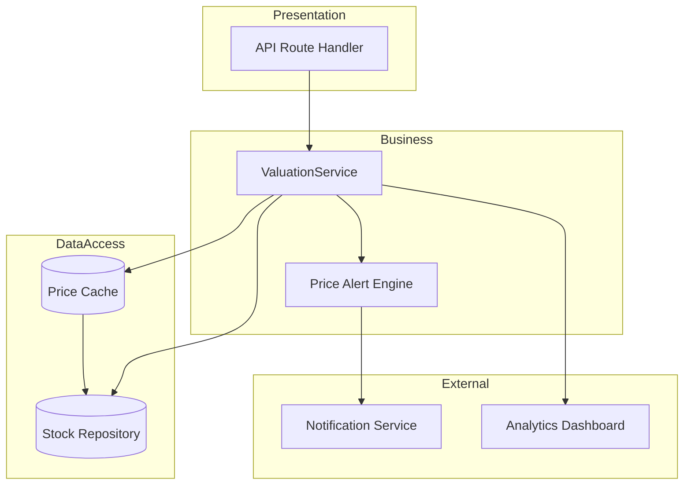
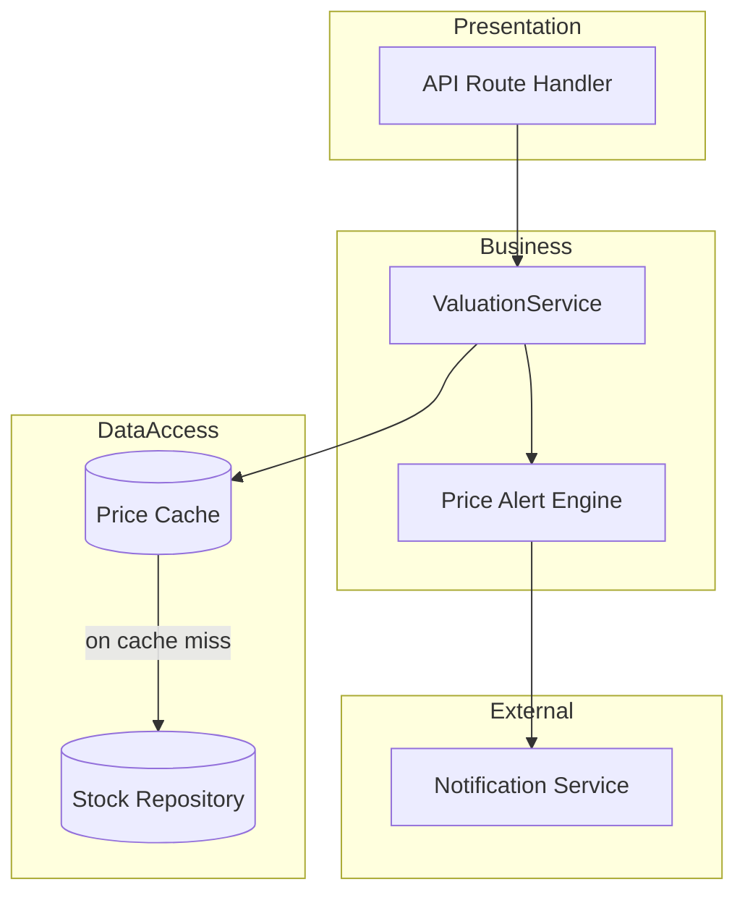

## TL;DR

- An AI agent can generate a working file in seconds, but it has no memory of your system's boundaries from one prompt to the next. Architecture is the vocabulary you use to hold that line — in your prompts, and in your reviews.
- This post assumes you already know Layered, MVC, and Event-Driven architecture at a working level — it's a fast recap, not a tutorial, before getting to what AI does with (and to) them.
- Use AI to *draft* architecture diagrams and scaffolding from plain English, then validate every arrow and every box against the actual code.

---

## Why This Post Exists in the AI-Assisted Development Series

This is the first post in the Software Architecture module — so it's worth being explicit about why architecture belongs in a series about building software *with* AI agents.

An AI coding agent is extremely good at producing a plausible-looking function, class, or route handler on request. What it is not good at, by default, is remembering that your data-access code is never supposed to talk directly to your presentation layer, or that `ServiceA` already depends on `ServiceB` and must not depend on it the other way around too. Each prompt is answered mostly in isolation, drawing on patterns that are statistically common in training data — not necessarily the patterns your codebase has committed to.

That means the architectural boundaries in your system now depend on something that used to be implicit (a senior engineer "just knowing" the layering) becoming explicit: written down, prompted for, and checked. Three practical consequences follow, and the rest of this module builds on all three:

1. **You need the vocabulary to specify structure in a prompt.** "Add a function that fetches the price" is ambiguous about which layer it belongs in. "Add a method to the `StockRepository` — do not add business logic to it" is not.
2. **You need the vocabulary to review what comes back.** If you can't name the layering violation, you can't ask for it to be fixed — you'll just feel a vague unease about a diff and approve it anyway.
3. **You need diagrams that are cheap to produce and easy to compare against reality**, because AI-generated code drifts from any diagram that isn't kept in the loop.

Everything else in this post — the recap, the AI-prompting examples — is in service of those three points, and this framing carries through the rest of this module.

---

## Prerequisites

- Standard design-pattern vocabulary — SOLID, Dependency Inversion, and the Gang of Four catalogue (Factory, Strategy, Adapter, and the rest). This is assumed, not taught here; [Refactoring Guru's catalogue](https://refactoring.guru/design-patterns) is a fast refresher if any of it's rusty.
- Working familiarity with Layered, MVC, and Event-Driven architecture — this post recaps them in a few sentences each rather than teaching them from scratch. If any of the three is new to you, [Martin Fowler's *Patterns of Enterprise Application Architecture*](https://martinfowler.com/eaaCatalog/) (in References) covers the ground this post assumes.

---

## Concept Explanation

**Software architecture** is the set of high-level decisions that define a system's structure: which components exist, how they communicate, and how responsibilities are divided. Unlike design patterns (which solve object-level problems), architecture operates at the system level.

Bad architecture couples everything together so tightly that a change in one place breaks three others — and an AI agent, asked to make that one change, will happily make it and quietly break the other three, because it has no way of knowing they were coupled unless the code (or you) tells it so.

> **Analogy:** Architecture is the floor plan of a building. An AI agent handed a request to "add a window" will cheerfully cut through a load-bearing wall if nothing tells it which walls those are.

---

## The Three Patterns, in One Diagram Each

Three foundational patterns cover most cases: **Layered** (Presentation → Business Logic → Data Access → Infrastructure, each layer only talking to the one directly below it), **MVC** (Model holds data and rules, View renders, Controller orchestrates), and **Event-Driven** (publishers emit events, subscribers react, neither side knows about the other).



**The one rule an AI agent breaks most often:** a presentation-layer function must never write a query directly, and a data-access function must never apply business rules. Crossing layers is the most common architectural sin — and, because it's the path of least resistance for an autocomplete-style suggestion, it's also the most common thing an AI agent will do if you don't stop it. Worked Example 2 below shows exactly this failure.

For the code-level shape of a layered service — repository, service, route handler — see the `StockRepository` / `ValuationService` pair used in Worked Example 2; the pattern is the same one summarized in the diagram above, just with names attached.

---

## Communicating Architecture to a Team (and to an Agent)

A good architecture diagram answers three questions at a glance: what are the components (boxes), how do they communicate (arrows with labels), and what crosses a boundary (dashed lines between layers or services). Those are also, not coincidentally, the three things an AI agent needs pinned down before it can generate code that respects your structure. A diagram is a compact, unambiguous artifact you can paste straight into a prompt.

**The one-minute rule:** if a team member can't understand the diagram within one minute, it has too much detail — the same rule applies to what you paste into a prompt. [Mermaid Live Editor](https://mermaid.live/) is worth calling out specifically here: it's inline in Markdown, version-controlled, and something most AI agents can both read and write directly, which is why every diagram in this series uses it.

---

## AI in Development

**Draft with AI, validate with code.** The workflow is always the same shape: prompt for a draft, then check the draft against what actually exists.

### Worked Example 1 — Generating an Architecture Diagram

**The prompt:**

```
Draw a Mermaid diagram for the following system:
- A backend API that receives HTTP requests
- A ValuationService that applies business rules
- A relational database accessed through a repository layer
- A cache for frequently-accessed stock prices
- A notification service (email + SMS) triggered on price alerts

Use a layered architecture. Show data flow direction with arrow labels.
Use subgraphs to group layers. Keep it under 20 nodes.
```

**What the agent produced:**



**The review pass — apply the four checks from this post:**

1. *Paste it into a Mermaid renderer, does it render?* Yes.
2. *Does data actually flow this way in the code?* No — `CacheLayer --> Repo` is backwards. The repository is the source of truth; the cache reads *from* the repository on a miss, it doesn't feed data *into* it.
3. *Does every box actually exist?* No — there is no `Analytics Dashboard` anywhere in this codebase. The agent added it because "analytics" is a common neighbour of "cache" and "database" in training data, not because it was asked for.
4. *Remove anything aspirational.* Delete the `Analytics` box and its edge, and flip the cache arrow.

**Corrected diagram:**



This is the pattern to internalise: the first diagram is a draft, not a deliverable. The value you added was two small, specific corrections — and you could only make them because you knew what "the cache reads from the source of truth" and "don't keep aspirational boxes" actually mean.

### Worked Example 2 — Catching a Layering Violation in Generated Code

**The prompt:**

```
Add a method to ValuationService that returns the average P/E ratio
across all stocks priced above 1000.
```

**What the agent produced (pseudocode, reflecting the actual generated shape):**

```python
class ValuationService:
    ...
    def average_pe_above(self, threshold):
        # directly queries the database, bypassing the repository
        rows = self.database.execute(
            "SELECT pe_ratio FROM stocks WHERE price > ?", [threshold]
        )
        return average([r.pe_ratio for r in rows])
```

**The review pass:** this compiles, passes a quick manual test, and looks reasonable in a diff — which is exactly why it's dangerous. It violates the layering rule from earlier in this post: business logic must never write a query directly. Concretely, this breaks two things the layering was protecting:

- The in-memory test repository is now bypassed — this method will fail or misbehave under test doubles.
- Swapping the persistence layer later (a new database, a new ORM) now means hunting through business logic for stray queries instead of changing one repository class.

**The fix to request:**

```
Rewrite average_pe_above so it goes through StockRepository instead of
querying the database directly. Add a find_above_price(threshold) method
to the repository interface and its in-memory implementation, and have
ValuationService call that instead.
```

The lesson isn't "AI agents write bad code." It's that an agent optimizing for "does this one function work" has no visibility into "does this respect the layer boundary two files away" unless the boundary is named in the prompt or caught in review — which is precisely the skill this post is building.

---

## Pro Tips

1. **Architecture Decision Records (ADRs).** When you make a significant architectural choice, write a 1-page ADR: context, decision, and consequences. Future-you — and any agent you point at the repo later — will be grateful.
2. **Dependency direction is non-negotiable.** Business logic must never depend on infrastructure (database, HTTP clients). Violating this makes testing impossible, and it's exactly the shape of violation an agent produces when it takes the shortest path to "it works."
3. **Diagrams rot — faster now than before.** Code changes; diagrams get forgotten, and an AI agent can now change a lot of code in one sitting. Add diagram review to your sprint retrospective, or regenerate diagrams from code on a schedule rather than trusting a diagram nobody has looked at in months.

---

## Common Mistakes

- **Skipping the data access layer.** Putting queries directly in business logic functions is the #1 architectural sin in AI-generated code (see Worked Example 2 above). Always add a repository/adapter boundary.
- **AI generating circular dependencies.** `ServiceA` imports `ServiceB`, which imports `ServiceA`. Watch for this in AI-generated multi-file outputs. Fix by extracting a shared interface.
- **Over-architecturing small scripts.** A 50-line data processing script does not need a layered architecture with repositories and service classes — and an agent asked to "make this more professional" will sometimes add one anyway.

---

## References

- [Martin Fowler — Patterns of Enterprise Application Architecture](https://martinfowler.com/eaaCatalog/) — for the Layered/MVC/Event-Driven concepts this post assumes
- [Mermaid live editor](https://mermaid.live/)
- [C4 Model for architecture diagrams](https://c4model.com/)
- [Architecture Decision Records (ADRs)](https://adr.github.io/)

---

## Next Steps

Continue to [Data and AI Architectures →](/posts/data-ai-architectures/)
