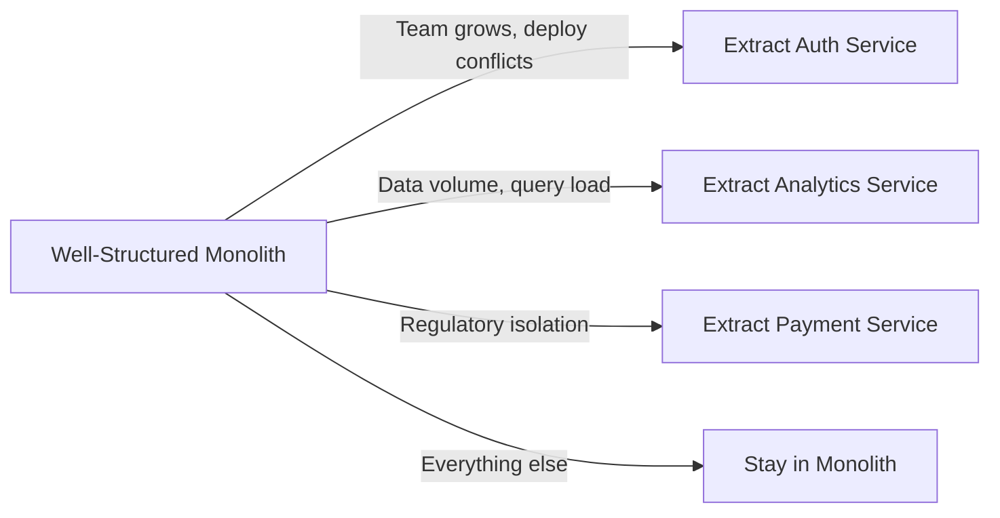
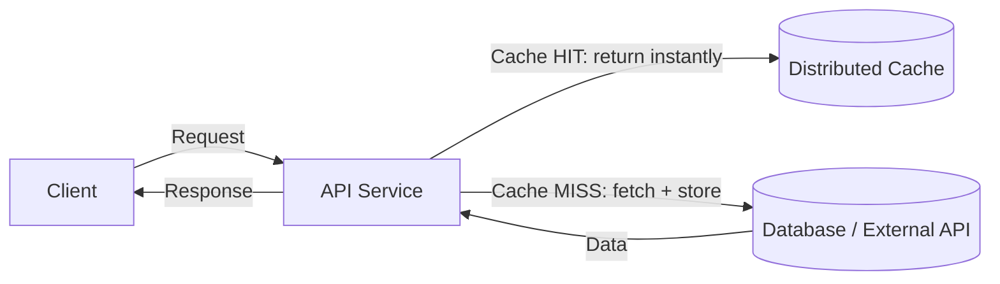

## TL;DR

- Cloud-native architecture builds systems that run reliably on distributed infrastructure by following the 12-factor methodology — regardless of language or framework.
- Microservices are independently deployable units — use them only when you've outgrown a monolith.
- Resiliency patterns (circuit breakers, retries, idempotency) are essential for services that call other services over a network — and they're exactly the kind of subtle, stateful logic that AI agents get plausible-looking but subtly wrong.

---

## Why This Post Exists in the AI-Assisted Development Series

The [previous post](/posts/architecture-intro/) was about structure inside a single running process: which layer talks to which. This post is about what happens once that process has to survive on a network, next to other processes, some of which will fail.

That distinction matters more, not less, when an agent is doing a lot of the typing. A single-process layering violation is usually visible in a diff. A **twelve-factor violation** — a hardcoded connection string, a piece of state kept in memory instead of in a shared store, a missing timeout on a network call — often isn't. It looks completely normal in isolation and only breaks when you run three copies of the process behind a load balancer, or redeploy at 2 a.m. and lose in-memory session data. These are exactly the failure modes an agent, working file-by-file without a live picture of your production topology, cannot be expected to catch on its own.

So this post gives you two things to bring into any AI-assisted work on a distributed system:

1. **A checklist (the 12 factors) you can hand to an agent as an explicit spec**, instead of hoping "make it cloud-native" gets interpreted correctly.
2. **A small set of resilience patterns (circuit breaker, retry-with-backoff) you should recognize on sight**, because agents readily produce a version of them that looks right, runs once successfully, and fails the first time it meets a real, sustained outage.

---

## Prerequisites

- [Architecture Intro](/posts/architecture-intro/)
- Basic understanding of HTTP and REST APIs
- Comfort with exception/error handling and basic concurrency concepts in any language

---

## Concept Explanation

**Cloud-native** means building applications that take full advantage of cloud infrastructure — horizontal scaling, managed services, containerisation, and continuous delivery. A cloud-native app doesn't just run *in* the cloud; it's designed *for* the cloud's characteristics: distributed failure, elastic scaling, and network-based service communication.

**Microservices** is one approach to cloud-native architecture: breaking a system into small, independently deployable services that each own a specific domain. Contrast with a **monolith** (one deployable unit), which is simpler to build and operate until scale demands more.

> **Rule of thumb:** Start with a well-structured monolith. Migrate to microservices when you have *specific, observed* bottlenecks — not because microservices sound more professional, and not because an agent suggested splitting things up.

---

## How It Works: When to Split



---

## The 12-Factor App Principles

The [12-factor methodology](https://12factor.net/) defines how cloud-native applications should be built. Each factor solves a specific class of production problem, and — importantly for this series — each factor is a concrete, checkable statement you can put in front of an agent or a reviewer.

| # | Factor | What it means | Common violation |
|---|--------|--------------|-----------------|
| 1 | **Codebase** | One repo, many deploys | Multiple repos for one app |
| 2 | **Dependencies** | Declare and isolate dependencies explicitly (a manifest file, a lockfile) | Relying on whatever happens to be installed on the machine |
| 3 | **Config** | Store in environment variables, never in code | Hardcoded API keys, DB URLs in source |
| 4 | **Backing services** | Treat DB, cache, queue as attached resources | Assuming a local database in prod code |
| 5 | **Build, Release, Run** | Separate build and run stages | Building artefacts at runtime |
| 6 | **Processes** | Stateless, share-nothing processes | In-memory session state |
| 7 | **Port binding** | Export services via a port | Requiring a separate web server host to be present |
| 8 | **Concurrency** | Scale via process model | Threads/workers that share mutable global state |
| 9 | **Disposability** | Fast startup, graceful shutdown | 60-second boot time, no shutdown-signal handler |
| 10 | **Dev/Prod Parity** | Keep environments as similar as possible | A lightweight file-based database in dev, a full server in prod |
| 11 | **Logs** | Treat as event streams, not files | Writing logs directly to a local file on disk |
| 12 | **Admin processes** | Run one-off tasks as process instances | Scheduled cron logic baked inside the main app process |

**Most violated factors in AI-generated code:** #3 (hardcoded config — an agent will happily inline a placeholder connection string "for now"), #6 (in-process state — the fastest correct-looking way to remember something between two requests is a global variable, which is also the wrong way), and #10 (a lightweight embedded database standing in for the real one in dev, with no equivalence check against prod).

---

## Python Examples

### 1. Factor #3 — Twelve-Factor Config

```python
import os
from dataclasses import dataclass


@dataclass(frozen=True)
class AppConfig:
    db_url: str
    cache_url: str
    api_key: str
    debug: bool
    port: int

    @classmethod
    def from_env(cls):
        # Load all config from environment. Fail loudly if required vars are missing.
        required = ["DATABASE_URL", "CACHE_URL", "EXTERNAL_API_KEY"]
        missing = [key for key in required if not os.getenv(key)]
        if missing:
            raise EnvironmentError(
                "Missing required environment variables: "
                + ", ".join(missing)
                + "\nCopy .env.example to .env and fill in the values."
            )

        return cls(
            db_url=os.environ["DATABASE_URL"],
            cache_url=os.environ["CACHE_URL"],
            api_key=os.environ["EXTERNAL_API_KEY"],
            debug=os.getenv("DEBUG", "false").lower() == "true",
            port=int(os.getenv("PORT", "8000")),
        )


# Usage — config is loaded once at startup, injected everywhere
# config = AppConfig.from_env()
```

---

### 2. Microservice — Stock Quote Service

A minimal, independently deployable service following 12-factor principles. This is written as Python so it maps cleanly to frameworks such as FastAPI, Flask, or Django, while keeping the same shape: a route, a handler, and a health check.

```python
import json
import logging
import os
from datetime import datetime, timezone


logging.basicConfig(level=logging.INFO, format="%(message)s")


def fetch_price(symbol: str) -> float:
    # In production: call the real market-data provider using injected config.
    prices = {"RELIANCE": 2450.75, "TCS": 3600.00, "INFY": 1450.50}
    if symbol not in prices:
        raise KeyError(f"Symbol not found: {symbol}")
    return prices[symbol]


def handle_quote(symbol: str):
    symbol = symbol.strip().upper()
    try:
        price = fetch_price(symbol)
        payload = {
            "symbol": symbol,
            "price": price,
            "timestamp": int(datetime.now(timezone.utc).timestamp()),
        }
        logging.info(json.dumps({"event": "quote_served", "symbol": symbol, "price": price}))
        return payload, 200
    except KeyError:
        logging.warning(json.dumps({"event": "unknown_symbol", "symbol": symbol}))
        return {"error": "Symbol not found"}, 404


def health_check():
    # Liveness check — required for Kubernetes/ECS-style health probes.
    return {"status": "ok"}, 200


port = int(os.getenv("PORT", "5001"))  # Factor 7: port binding
print(f"Service listening on 0.0.0.0:{port}")
```

---

### 3. Circuit Breaker — Resilience Pattern

When Service A calls Service B over the network, Service B can fail. Without a circuit breaker, Service A queues up requests, exhausting threads and memory until *it* also fails. The circuit breaker detects failures and short-circuits calls before they happen.

```python
import threading
import time
from enum import Enum, auto


class CircuitState(Enum):
    CLOSED = auto()      # Healthy: requests flow through
    OPEN = auto()        # Failing: requests blocked immediately
    HALF_OPEN = auto()  # Probing: one trial request allowed


class CircuitBreakerOpenError(RuntimeError):
    pass


class CircuitBreaker:
    # Transitions: CLOSED → OPEN after failure_threshold consecutive failures.
    # OPEN → HALF_OPEN after recovery_timeout has elapsed.
    # HALF_OPEN → CLOSED on success, → OPEN on failure.

    def __init__(self, failure_threshold=5, recovery_timeout=30.0, name="default"):
        self.name = name
        self.failure_threshold = failure_threshold
        self.recovery_timeout = recovery_timeout
        self.state_value = CircuitState.CLOSED
        self.failure_count = 0
        self.last_failure_time = None
        self.lock = threading.RLock()

    @property
    def state(self):
        # Returns current state, transitioning OPEN→HALF_OPEN if timeout elapsed.
        with self.lock:
            if (
                self.state_value == CircuitState.OPEN
                and self.last_failure_time is not None
                and (time.monotonic() - self.last_failure_time) > self.recovery_timeout
            ):
                self.state_value = CircuitState.HALF_OPEN
            return self.state_value

    def call(self, func, *args, **kwargs):
        current_state = self.state

        if current_state == CircuitState.OPEN:
            raise CircuitBreakerOpenError(
                f"Circuit '{self.name}' is OPEN — service unavailable. "
                f"Retry after {self.recovery_timeout}s."
            )

        try:
            result = func(*args, **kwargs)
            self._on_success()
            return result
        except Exception:
            self._on_failure()
            raise

    def _on_success(self):
        with self.lock:
            self.failure_count = 0
            self.state_value = CircuitState.CLOSED

    def _on_failure(self):
        with self.lock:
            self.failure_count += 1
            self.last_failure_time = time.monotonic()
            if self.failure_count >= self.failure_threshold:
                self.state_value = CircuitState.OPEN


# ── Usage ──────────────────────────────────────────────────────────────
def call_external_api(symbol):
    # Simulate a flaky external service.
    raise ConnectionError("Service temporarily unavailable")


breaker = CircuitBreaker(failure_threshold=3, recovery_timeout=30, name="Market-Data-API")

for attempt in range(1, 6):
    try:
        breaker.call(call_external_api, "RELIANCE")
    except CircuitBreakerOpenError as exc:
        print(f"Attempt {attempt}: Circuit OPEN — {exc}")
    except ConnectionError as exc:
        print(f"Attempt {attempt}: Call FAILED — {exc} | State: {breaker.state}")
```

---

### 4. Retry with Exponential Backoff

```python
import random
import time


def retry_with_backoff(func, max_attempts=3, base_delay=1.0, max_delay=30.0, jitter=True):
    # Exponential backoff: delay doubles each retry.
    # Jitter: adds randomness to prevent a thundering herd.
    for attempt in range(1, max_attempts + 1):
        try:
            return func()
        except Exception as exc:
            if attempt == max_attempts:
                raise  # re-raise on final attempt

            delay = min(base_delay * (2 ** (attempt - 1)), max_delay)
            if jitter:
                delay *= random.uniform(0.5, 1.0)  # 50–100% of delay

            print(f"Attempt {attempt} failed: {exc}. Retrying in {delay:.2f}s...")
            time.sleep(delay)
```

---

## Caching Architecture



**Cache levels by latency:**

| Level | Technology examples | Latency | TTL Strategy |
|-------|-----------|---------|-------------|
| In-process | An in-memory map / built-in memoization | ~0.1µs | Process lifetime |
| Distributed | Redis, Memcached | ~1ms | TTL per key type |
| CDN | CloudFront, Cloudflare | ~10ms | Cache-Control headers |
| Database query | Native query cache | ~10ms | Invalidated on write |

---

## AI in Development

### Worked Example 1 — Generating 12-Factor-Compliant Code

**The prompt:**

```
Generate a microservice that follows 12-factor principles:
- Factor 3: All config (DB URL, API key, port) must come from environment
  variables, not hardcoded
- Factor 6: No in-memory state between requests (no global mutable variables)
- Factor 7: Bind to a port from a PORT environment variable
- Factor 11: Log as structured JSON to stdout, never to files
The service should expose: GET /health (liveness check) and GET /quote/{symbol}
```

**What the agent produced (excerpt, Python reflecting the actual shape):**

```python
API_KEY = "sk-live-4f9a2c..."  # <- hardcoded, not read from env
CACHE = {}  # <- module-level mutable dict, shared across requests


def quote_route(symbol):
    if symbol in CACHE:
        return {"status": "ok", "price": CACHE[symbol]}

    price = fetch_price(symbol, api_key=API_KEY)
    CACHE[symbol] = price  # <- in-memory state, lost on restart, wrong across replicas
    with open("app.log", "a", encoding="utf-8") as handle:
        handle.write(f"served {symbol}\n")  # <- writes to a file, not stdout
    return {"status": "ok", "price": price}


def health_route():
    return {"status": "ok"}


# app.listen(port=8000)  # <- hardcoded port, ignores PORT
```

**The review pass — check the prompt's four factors one by one:**

- **Factor 3 (config):** Failed. `API_KEY` is hardcoded, and the port is hardcoded too, despite being asked for explicitly.
- **Factor 6 (stateless processes):** Failed. `CACHE` is a plain in-memory dictionary living in the process — it disappears on every restart and gives a different answer on every replica behind a load balancer. This is the single most common thing agents get wrong once you ask for "caching" without also specifying *where* the cache lives.
- **Factor 7 (port binding):** Failed. `app.listen(port = 8000)` ignores the `PORT` environment variable entirely.
- **Factor 11 (structured logs to stdout):** Failed. It's writing to a local file, and the message isn't structured JSON.

**The follow-up prompt** (this is the realistic workflow — you rarely get all of this right in one shot):

```
Fix all four issues:
1. Read API_KEY and PORT from environment variables (fail loudly if missing)
2. Remove the in-memory CACHE dict entirely — for now, call fetch_price on every request
3. Bind to the PORT environment variable, default to 5001 if unset
4. Replace log_to_file with a structured JSON log line written to stdout
```

Notice the second instruction: rather than asking the agent to "fix the caching," it's simpler and safer to remove the premature cache and reintroduce it deliberately later, backed by Redis, once you've decided how it should behave across replicas. That's a judgment call the checklist doesn't make for you — the 12 factors tell you *that* something is wrong, not always the least-risky fix.

### Worked Example 2 — Reviewing a Generated Circuit Breaker

**The review prompt:**

```
Review this circuit breaker implementation for:
1. Thread safety — does it use a lock before reading/writing state?
2. Correct state transition — does OPEN→HALF_OPEN check if the timeout elapsed?
3. Error propagation — does it re-raise the original exception, not swallow it?
4. Testability — can the state be injected/set for testing without waiting for real timeouts?
```

Run this prompt against the circuit breaker in the pseudocode above (or a translated, real version of it) as a habit, not a one-off: a circuit breaker is small enough that an agent can produce a plausible one in a single response, and subtle enough that the plausible version frequently fails exactly one of these four checks — most often #4, because "make the timeout configurable for tests" is rarely stated up front and rarely volunteered by the agent unprompted. If a generated breaker hardcodes `sleep()`-based waiting instead of a comparable, injectable clock, that's the fix to ask for next.

---

## Pro Tips

1. **Idempotency is not optional.** Any operation that can be retried (and they all can be, eventually) must be idempotent. Use idempotency keys on payment and write endpoints.
2. **Health checks have two kinds.** A *liveness* check tells the load balancer the process is running. A *readiness* check tells it the process is ready to receive traffic (DB connected, cache warm). Implement both — and if you ask an agent for "a health check," specify which one, since it will otherwise guess.
3. **Timeouts everywhere.** Every network call — DB queries, HTTP requests, cache operations — must have an explicit timeout. Never rely on the platform default (often effectively infinite).
4. **The strangler fig pattern for migration.** When breaking a monolith into microservices, route new traffic to the new service while the monolith still handles old traffic. Migrate incrementally, not all at once.
5. **Observability trinity: logs, metrics, traces.** Logs tell you what happened. Metrics tell you how often and how fast. Traces tell you where time was spent across services. Implement all three from day one.

---

## Common Mistakes

- **Circuit breaker without thread/concurrency safety.** Multiple threads or coroutines can read/write state simultaneously. Always use a lock appropriate to your concurrency model.
- **Retry without jitter.** If 100 services all retry at the same interval, they create a "thundering herd" that overwhelms the recovering service. Add jitter (randomised delay) to spread retries.
- **Microservices with a shared database.** Two microservices sharing one schema are not microservices — they're a distributed monolith. Each service must own its own data store.
- **Mixing blocking and non-blocking waits in the same runtime.** A blocking sleep inside code meant to run on an event loop or async scheduler will stall everything else on that loop — use the async-native wait primitive for your platform.
- **Over-caching.** Caching financial data (stock prices) that changes by the second with a 24-hour TTL is worse than no cache — it serves stale data confidently.

---

## References

- [12factor.net](https://12factor.net/)
- [Martin Fowler — Microservices](https://martinfowler.com/articles/microservices.html)
- [AWS Serverless patterns](https://serverlessland.com/patterns)
- [Circuit Breaker — Martin Fowler](https://martinfowler.com/bliki/CircuitBreaker.html)
- [Google SRE Book — Chapter 22: Addressing Cascading Failures](https://sre.google/sre-book/cascading-failures/)

---

## Next Steps

Continue to [Data and AI Architectures →](/posts/data-ai-architectures/)
