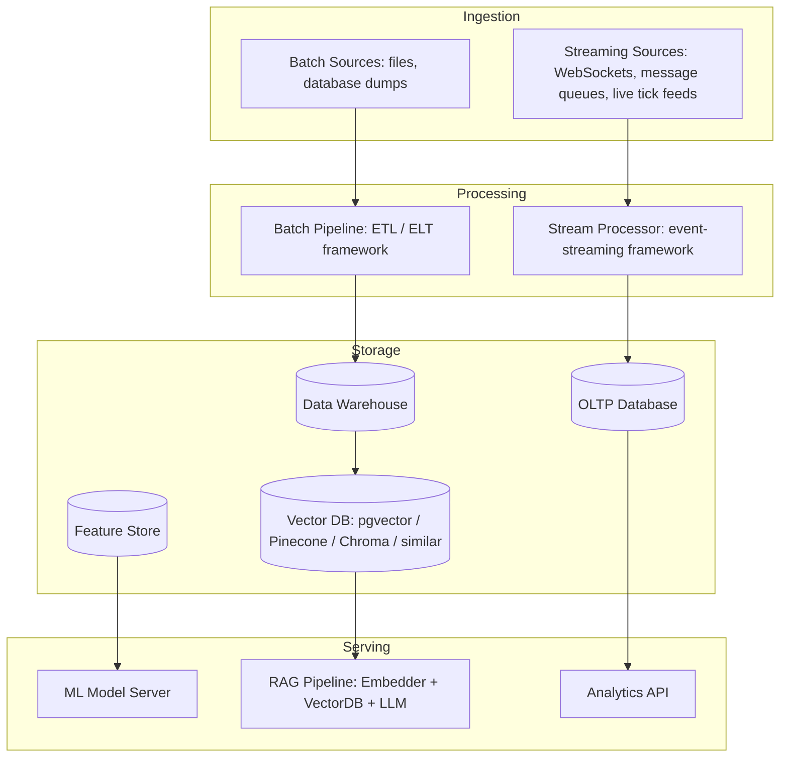
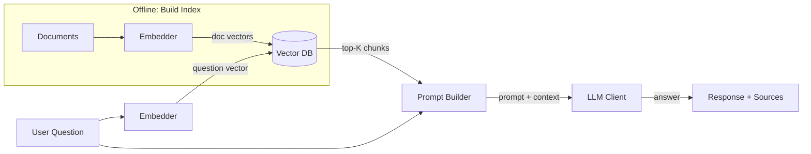

## TL;DR

- Modern systems combine batch pipelines, streaming data, and ML inference — each with distinct architectural needs, in any language or stack.
- Retrieval-Augmented Generation (RAG) is the dominant pattern for grounding LLM responses in your own data — and it is itself a small architecture, with the same layering discipline as everything else in this module.
- Build observability into AI pipelines from day one — logging inputs, retrieved chunks, and outputs is the only way to catch hallucination and drift, and it's the only way to tell whether an AI-generated pipeline is actually doing what its code claims to do.

---

## Why This Post Exists in the AI-Assisted Development Series

The first two posts in this module were about structuring code that an AI agent helps you write. This post closes the loop: it's about structuring the *AI components themselves* — the pipelines, retrieval systems, and agents you're now building as first-class parts of your architecture, using everything the earlier posts established.

That closing of the loop matters for a specific reason: an LLM call is the least deterministic, hardest-to-test unit you will ever add to a system, and it is exactly the kind of component an AI coding agent will, left to its own devices, wire up as a "magic function" — call the model, get a string back, hope for the best. No contract, no logging of what went in or came out, no visibility into whether the retrieved context was any good.

The golden rule below is the antidote, and it's the same discipline you already know from Layered Architecture: define the boundary, and don't let anything cross it silently.

> **The golden rule for AI systems:** treat AI components as services with contracts, not as magic functions. Define what goes in (prompt, context), what comes out (completion, confidence), and what can go wrong (timeout, hallucination, rate limit).

---

## Prerequisites

- [Cloud-Native and Microservices](/posts/cloud-native-microservices/)
- Comfort with interfaces/contracts and asynchronous concepts in any language
- Familiarity with REST APIs and JSON

---

## Concept Explanation

As systems grow, data flows in two speeds: **batch** (process last night's transactions at 2 AM) and **streaming** (process each stock tick within 10ms of arrival). AI systems add a third concern: **model serving** — taking a trained ML model, or a hosted LLM, and answering questions with it in real time.

Good data architecture makes these three flows work together without creating a "big ball of mud" where the batch job reaches directly into the streaming processor's state, or the model serving layer talks directly to the raw data lake. Clean boundaries between ingestion, processing, storage, and serving are what keep these systems maintainable — and, per the golden rule above, what keep an LLM call from being just a string glued onto the rest of your code.

---

## How It Works: The Full Data Architecture Stack



---

## Pseudocode Examples

### 1. Batch Data Pipeline — Stock Fundamentals ETL

```pseudocode
# Extract-Transform-Load pipeline for stock fundamentals data.
# Follows the layered architecture from the Architecture Intro post.

record RawFundamentals:
    # Raw data as it arrives from the source — unvalidated.
    symbol: string
    raw_pe: string        # may be "N/A", "23.5", or empty
    raw_revenue: string   # in local currency units, may have thousands separators
    raw_debt: string

record FundamentalsRecord:
    # Clean, validated, typed record ready for the data warehouse.
    symbol: string
    pe_ratio: number or null
    revenue: number or null
    debt: number or null
    data_quality_flags: list<string> = []


# ── Extract ─────────────────────────────────────────────────────────────
function extract(source: list<map>) -> iterator<RawFundamentals>:
    # Yield raw records from a data source (file, API, DB dump).
    for row in source:
        yield RawFundamentals(
            symbol = row.get("symbol", ""),
            raw_pe = row.get("pe_ratio", ""),
            raw_revenue = row.get("revenue", ""),
            raw_debt = row.get("debt", ""),
        )


# ── Transform ────────────────────────────────────────────────────────────
function parse_number(raw, field_name, flags):
    # Parse a number from a raw string, recording data quality issues.
    if raw is empty or trim(raw) in ("N/A", "-", ""):
        flags.append("missing_" + field_name)
        return null
    try:
        cleaned = remove_thousands_separators(trim(raw))
        return to_number(cleaned)
    catch ParseError:
        flags.append("invalid_" + field_name + ":" + raw)
        return null

function transform(raw: RawFundamentals) -> FundamentalsRecord:
    # Transform and validate a raw record. Never raises — all errors become flags.
    flags = []

    if raw.symbol is empty or not is_alphabetic(raw.symbol):
        flags.append("invalid_symbol:" + raw.symbol)

    return FundamentalsRecord(
        symbol = uppercase(trim(raw.symbol)),
        pe_ratio = parse_number(raw.raw_pe, "pe_ratio", flags),
        revenue = parse_number(raw.raw_revenue, "revenue", flags),
        debt = parse_number(raw.raw_debt, "debt", flags),
        data_quality_flags = flags,
    )


# ── Load ─────────────────────────────────────────────────────────────────
function load(records: list<FundamentalsRecord>, repository) -> map:
    # Load clean records to destination. Returns a summary.
    success = 0
    skipped = 0
    for record in records:
        if "invalid_symbol" in join(record.data_quality_flags, " "):
            log.warn("Skipping invalid record: {}", record)
            skipped += 1
            continue
        repository.upsert(record)
        success += 1
    return {loaded: success, skipped: skipped}


# ── Pipeline orchestrator ─────────────────────────────────────────────────
function run_pipeline(source_data: list<map>, repository) -> map:
    # Full ETL pipeline — extract → transform → load.
    raw_records = list(extract(source_data))
    clean_records = [transform(r) for r in raw_records]
    result = load(clean_records, repository)
    log.info("Pipeline complete: {}", result)
    return result
```

---

### 2. Retrieval-Augmented Generation (RAG) Pipeline

RAG is the pattern that keeps LLM responses grounded in your specific data. Instead of asking an LLM a question from memory alone, you first retrieve relevant context from your own knowledge base, then include it in the prompt.



```pseudocode
# ── Contracts (define interfaces before implementations) ─────────────────

interface Embedder:
    embed(text: string) -> list<number>

interface VectorStore:
    upsert(doc_id: string, vector: list<number>, metadata: map) -> void
    search(vector: list<number>, top_k: integer) -> list<map>

interface LLMClient:
    complete(prompt: string, max_tokens: integer = 512) -> string


# ── Observability wrapper ─────────────────────────────────────────────────
record RAGTrace:
    # Records every step for debugging hallucinations and drift.
    question: string
    retrieved_chunks: list<map>
    prompt: string
    response: string
    latency_ms: number
    timestamp: number = current_time()


# ── Pipeline ──────────────────────────────────────────────────────────────
class RAGPipeline:
    # Injection: all three dependencies are injected — testable with fakes.
    # Observability: every query produces a RAGTrace for monitoring.
    constructor(embedder: Embedder, store: VectorStore, llm: LLMClient, top_k = 5, max_tokens = 512):
        self.embedder = embedder
        self.store = store
        self.llm = llm
        self.top_k = top_k
        self.max_tokens = max_tokens

    function index(documents: list<map>):
        # Offline step: embed documents and store in the vector DB.
        for doc in documents:
            vector = self.embedder.embed(doc.text)
            self.store.upsert(
                doc_id = doc.id,
                vector = vector,
                metadata = {text: doc.text, source: doc.get("source", "unknown")},
            )

    function query(question: string) -> (string, RAGTrace):
        # Online step: embed question, retrieve context, generate answer.
        start = monotonic_time()

        # 1. Embed the question
        question_vector = self.embedder.embed(question)

        # 2. Retrieve relevant chunks
        chunks = self.store.search(question_vector, top_k = self.top_k)

        # 3. Build prompt with retrieved context
        context_text = join(
            ["[Source: " + c.metadata.source + "]\n" + c.metadata.text for c in chunks],
            "\n\n---\n\n"
        )
        prompt =
            "You are a financial research assistant. Answer based ONLY on the provided context.\n" +
            "If the answer is not in the context, say \"I don't have that information.\"\n\n" +
            "Context:\n" + context_text + "\n\n" +
            "Question: " + question + "\n" +
            "Answer:"

        # 4. Generate
        response = self.llm.complete(prompt, max_tokens = self.max_tokens)

        latency_ms = (monotonic_time() - start) * 1000
        trace = RAGTrace(
            question = question,
            retrieved_chunks = chunks,
            prompt = prompt,
            response = response,
            latency_ms = latency_ms,
        )

        return (response, trace)


# ── Fake implementations for testing ─────────────────────────────────────
class FakeEmbedder implements Embedder:
    # Returns a deterministic 4-dim vector for testing.
    function embed(text):
        return [length(text) * 0.01, word_count(text) * 0.1, 0.5, 0.5]

class InMemoryVectorStore implements VectorStore:
    # Simple store for unit tests — no real similarity search.
    docs = []

    function upsert(doc_id, vector, metadata):
        self.docs.append({id: doc_id, vector: vector, metadata: metadata})

    function search(vector, top_k):
        return self.docs[0:top_k]  # return first N for testing

class FakeLLM implements LLMClient:
    function complete(prompt, max_tokens = 512):
        return "Based on the provided context, the P/E ratio of RELIANCE is 25."


# Test the pipeline
pipeline = new RAGPipeline(
    embedder = new FakeEmbedder(),
    store = new InMemoryVectorStore(),
    llm = new FakeLLM(),
)

pipeline.index([
    {id: "1", text: "RELIANCE has a P/E ratio of 25 as of Q3 2025.", source: "NSE filing"},
    {id: "2", text: "TCS revenue grew 8% YoY in FY2025.", source: "TCS annual report"},
])

(answer, trace) = pipeline.query("What is RELIANCE's P/E ratio?")
print("Answer: " + answer)
print("Latency: " + format(trace.latency_ms, ".1f") + "ms")
print("Chunks retrieved: " + length(trace.retrieved_chunks))
```

---

### 3. Agent Orchestration Pattern

When a single LLM query isn't enough, you compose multiple tool calls in a loop:

```pseudocode
record Tool:
    name: string
    description: string
    func: callable

class SimpleAgent:
    # Minimal ReAct-style agent: Reason → Act → Observe → loop.
    # Real production agents use frameworks like LangGraph or CrewAI.
    # This skeleton shows the core pattern only.

    constructor(llm: LLMClient, tools: list<Tool>, max_steps = 5):
        self.llm = llm
        self.tools = index_by(tools, key = t -> t.name)
        self.max_steps = max_steps

    function build_system_prompt():
        tool_descriptions = join(
            ["- " + t.name + ": " + t.description for t in values(self.tools)], "\n"
        )
        return
            "You are a financial research agent. Available tools:\n" + tool_descriptions + "\n\n" +
            "To use a tool, respond with: TOOL: <tool_name> ARGS: <json args>\n" +
            "When done, respond with: FINAL: <your answer>"

    function run(query: string) -> string:
        history = ["Question: " + query]
        for step in range(1, self.max_steps + 1):
            prompt = self.build_system_prompt() + "\n\n" + join(history, "\n")
            response = self.llm.complete(prompt)
            history.append("Agent: " + response)

            if starts_with(response, "FINAL:"):
                return trim(remove_prefix(response, "FINAL:"))

            if starts_with(response, "TOOL:"):
                # Parse tool name and args from the response
                # (simplified here — real agents parse structured JSON args)
                tool_name = extract_tool_name(response)
                tool = self.tools.get(tool_name)
                if tool is not null:
                    observation = tool.func(symbol = "RELIANCE")
                    history.append("Observation: " + observation)

        return "Max steps reached without a final answer."
```

---

## AI System Observability

The three mandatory signals for any production AI system:

| Signal | What to log | Why |
|--------|-------------|-----|
| **Input** | Original query, user ID, timestamp | Reproduce issues, audit usage |
| **Retrieved context** | Chunk IDs, similarity scores, sources | Debug retrieval quality, detect data drift |
| **Output** | Response text, latency, token count | Monitor hallucination patterns, cost |

```pseudocode
function log_rag_trace(trace: RAGTrace):
    # Emit a structured log event for every RAG query — ready for any log aggregator.
    log.info(to_json({
        event: "rag_query",
        question: trace.question,
        retrieved_count: length(trace.retrieved_chunks),
        sources: [c.metadata.source for c in trace.retrieved_chunks],
        response_length: length(trace.response),
        latency_ms: round(trace.latency_ms, 2),
        timestamp: trace.timestamp,
    }))
```

---

## AI in Development

### Worked Example 1 — Generating a RAG Pipeline

**The prompt:**

```
Generate a RAG pipeline using interface-based contracts for:
- Embedder: embed(text) -> list of numbers
- VectorStore: upsert(doc_id, vector, metadata) and search(vector, top_k) -> list of results
- LLMClient: complete(prompt, max_tokens) -> string

Requirements:
- All three injected via the pipeline's constructor — no hardcoded implementations
- Every query call returns (answer, trace) where trace records question, chunks,
  prompt, response, and latency_ms
- Add a log_trace(trace) function that emits structured JSON to stdout
- Include fake implementations suitable for tests
```

**What the agent produced (excerpt, pseudocode reflecting the actual shape):**

```pseudocode
class RAGPipeline:
    function query(question):
        vector = embed_with_openai(question)          # <- calls a specific provider directly
        chunks = pinecone_client.query(vector, top_k=5) # <- hardcoded to one vendor's client
        prompt = "Context: " + chunks + "\nQuestion: " + question
        answer = openai_complete(prompt)                # <- another direct provider call
        print("got answer: " + answer)                  # <- unstructured, and to console not a trace
        return answer                                    # <- no trace returned at all
```

**The review pass:**

- **Injected dependencies?** Failed. The agent reached for a specific embedding provider and a specific vector database client directly, instead of the requested `Embedder` / `VectorStore` interfaces. This is the RAG-pipeline equivalent of the layering violation from the first post in this module — business logic (the pipeline's retrieval flow) is now welded to one vendor's SDK.
- **Trace returned from `query`?** Failed. Nothing is returned but the answer string — there's no `RAGTrace`, so there's nothing to log or debug later.
- **Structured JSON logging?** Failed. It's a `print` statement with string concatenation, not `log_trace`.
- **Fakes for testing?** Missing entirely — with everything hardcoded to a live vendor, there's also no way to test this without network access and an API key.

**The fix to request** (naming the contract explicitly is what closes the gap):

```
Rewrite this so RAGPipeline depends only on the Embedder, VectorStore, and
LLMClient interfaces — no direct calls to any specific vendor SDK inside the
pipeline class. query() must build and return a RAGTrace alongside the answer.
Add FakeEmbedder, InMemoryVectorStore, and FakeLLM implementations of the
three interfaces so the pipeline can be tested without any network calls.
```

This mirrors Worked Example 2 from the Architecture Intro post almost exactly: a single-function version of the request "worked," and the missing piece was invisible until you checked it against the contract you actually asked for.

### Worked Example 2 — Adding Observability to an Existing Pipeline

**The prompt:**

```
I have a RAG pipeline that logs nothing. Add observability:
1. A RAGTrace record that captures: question, retrieved_chunks, prompt, response,
   latency_ms, timestamp
2. A log_trace(trace) function that logs the trace as structured JSON (not a
   stringified object)
3. Wrap the existing query() method to generate and return a trace alongside the
   response
Do not change the existing interface — query() should now return (response, trace).
```

**What a reasonable output looks like** — this is the version worth comparing your own agent's output against, line by line:

```pseudocode
record RAGTrace:
    question: string
    retrieved_chunks: list<map>
    prompt: string
    response: string
    latency_ms: number
    timestamp: number = current_time()

function log_trace(trace: RAGTrace):
    log.info(to_json({
        event: "rag_query",
        question: trace.question,
        retrieved_count: length(trace.retrieved_chunks),
        response_length: length(trace.response),
        latency_ms: trace.latency_ms,
    }))

class RAGPipeline:
    function query(question) -> (string, RAGTrace):
        start = monotonic_time()
        vector = self.embedder.embed(question)
        chunks = self.store.search(vector, top_k = self.top_k)
        prompt = build_prompt(question, chunks)
        response = self.llm.complete(prompt)
        trace = RAGTrace(
            question = question, retrieved_chunks = chunks,
            prompt = prompt, response = response,
            latency_ms = (monotonic_time() - start) * 1000,
        )
        log_trace(trace)
        return (response, trace)
```

**The review pass — the two things worth double-checking even on a "good" output like this one:**

1. **Does `retrieved_chunks` actually get logged, or only its count?** Here only the count is logged in `log_trace`, while the full chunks live on the trace object. That's a deliberate, reasonable choice (full chunk text can be large and sensitive) — but it's a choice, and you should confirm the agent made it on purpose rather than by omission. If you need full chunk contents in your logs for debugging retrieval quality, say so explicitly.
2. **Is the original interface actually preserved?** The prompt said "do not change the existing interface" beyond the return type. Confirm no other parameter names or defaults quietly shifted — agents asked to "add" something will sometimes also "clean up" a signature nearby, which is a second unrequested change riding along with the one you asked for.

---

## Pro Tips

1. **Vector DB selection.** For small-to-medium corpora (< 1M documents), `pgvector` on top of a relational database you already run is usually sufficient — one fewer service to operate. Reach for a dedicated vector database when you need approximate nearest-neighbour search at scale or hybrid search.
2. **Chunking strategy matters more than the embedding model.** Too-large chunks retrieve irrelevant context; too-small chunks lose surrounding meaning. 256–512 tokens with 10–20% overlap is a good starting point.
3. **Test retrieval before generation.** Most RAG bugs are retrieval bugs (wrong chunks returned), not LLM bugs. Evaluate retrieval quality independently using labelled question-answer pairs before evaluating end-to-end.
4. **Rate limits are business logic.** LLM API rate limits and token quotas should be handled at the application layer with retry + backoff (from the Microservices post), not silently swallowed.
5. **Evals replace vibes.** "It seems to work" is not a production AI quality bar. Define evaluation metrics (faithfulness, relevance, answer correctness) and automate them before every deployment.

---

## Common Mistakes

- **Logging prompts but not retrieved chunks.** When a RAG system hallucinates, the retrieved chunks are the first thing you need to inspect — they're more diagnostic than the final prompt.
- **AI generating a direct vendor SDK call inside a service class** (see Worked Example 1) — this hardcodes one provider and makes the class untestable. Always inject the LLM/embedding/vector-store client via an interface.
- **Re-indexing the full corpus on every deployment.** Implement incremental indexing: only re-embed documents that have changed since the last index build.
- **Treating LLM output as trusted input to other systems** without validation. The model might return malformed structured data, unexpected values, or injection attempts in tool-calling scenarios. Always validate and sanitise LLM output before using it programmatically.
- **Missing structured output parsing.** When LLMs must return JSON or structured data, use schema validation, not manual string parsing — AI output format deviates unpredictably.

---

## References

- [pgvector — vector extension for PostgreSQL](https://github.com/pgvector/pgvector)
- [Chip Huyen — Designing ML Systems](https://www.oreilly.com/library/view/designing-machine-learning/9781098107956/)
- [RAG evaluation frameworks — RAGAS](https://github.com/explodinggradients/ragas)
- [LangGraph — agent orchestration](https://langchain-ai.github.io/langgraph/)
- [Patterns for Building LLM-based Systems and Products — Eugene Yan](https://eugeneyan.com/writing/llm-patterns/)

---

## Next Steps

Continue to [Vibe Engineering Intro →](/posts/vibe-engineering-intro/)
