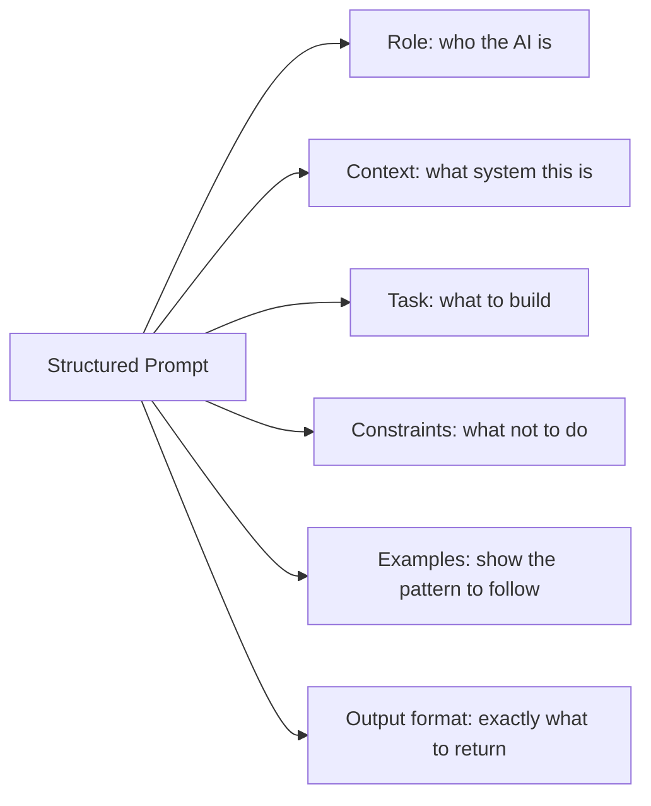
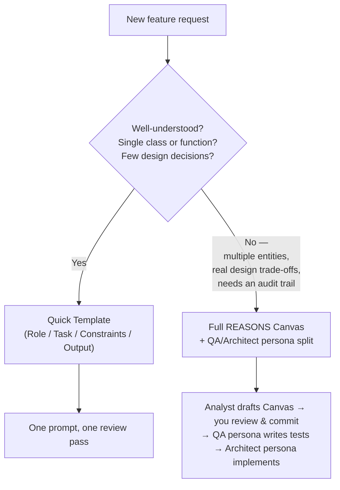

## TL;DR

- A structured prompt is a function signature: define role, task, constraints, and expected output explicitly.
- This post doesn't invent a new template — it takes the **REASONS Canvas and the QA/Architect persona split from [Agentic SPDD](/posts/agentic-spdd-multi-agent/)**, and the **SOLID / pattern vocabulary from [Design Patterns](/posts/design-patterns-part-1/)** and **layering vocabulary from [Software Architecture](/posts/architecture-intro/)**, and packages all of it into two reusable, plain-text templates you fill in by hand.
- Every template in this post is **text, not code** — copy it as-is into any AI tool, and replace only the bracketed placeholders.
- Security review for AI code focuses on injection, credentials, and trust boundaries that AI consistently overlooks.

---

## Prerequisites

- [Vibe Engineering Intro](/posts/vibe-engineering-intro/)
- [Agentic TDD: Zero-Code Test Generation](/posts/agentic-tdd-zero-code/) and [Agentic SDD & SPDD](/posts/agentic-spdd-multi-agent/) — this post reuses the QA/Architect persona split and the REASONS Canvas from these two posts directly
- Familiarity with at least one AI coding tool
- Python: type hints, `dataclasses`, `pydantic` basics

---

## Why This Post Exists in the Series

The previous post reviewed a vague, one-line prompt against a checklist and fixed five defects after the fact. That's a necessary skill — you will always need a review pass, no matter how good your prompt is — but it's also the more expensive way to get good code: you pay the cost of generating the bad version, reading it carefully, and re-explaining the fix, every single time.

This post attacks the problem from the input side, and it does so **without introducing a new framework**. [Agentic TDD & SPDD](/posts/agentic-tdd-zero-code/) already gave you two structured workflows for turning intent into code: the plain-English-requirements-to-QA-persona-to-Architect-persona pipeline, and its more formal successor, the REASONS Canvas produced by an Analyst persona under Spec-Driven Development. [Design Patterns](/posts/design-patterns-part-1/) gave you the vocabulary (SOLID, the pattern families) to say precisely what "well-structured" means. [Software Architecture](/posts/architecture-intro/) gave you the vocabulary (layers, boundaries) to say precisely what "respects the system" means.

What's been missing is putting all four of those together into one thing you can actually paste into a prompt box. That's what this post builds: two templates, entirely in plain text, with clearly marked fill-in-the-blank sections, that fold [Agentic SPDD](/posts/agentic-spdd-multi-agent/)'s process, [Design Patterns](/posts/design-patterns-part-1/)'s structural vocabulary, and [Software Architecture](/posts/architecture-intro/)'s boundary vocabulary into the Constraints of a single prompt (for a small task) or a single Canvas (for a larger one).

---

## Concept Explanation

**Structured prompting** treats your prompt the way you treat a function signature in a statically typed language: explicit inputs, explicit output contract, explicit constraints. A vague prompt ("write a stock analyser") produces vague code. A structured prompt produces code you can ship.

**Iterative prompt development** is the process of refining prompts over multiple rounds — adding constraints where the AI strays, removing ones that create unnecessary friction, and building a prompt library that encodes your team's standards.

---

## How It Works: Prompt Anatomy



Each component does distinct work:
- **Role** sets the quality bar (senior engineer vs. junior)
- **Context** prevents irrelevant code styles
- **Constraints** are the guardrails against known AI failure modes — and, as you'll see below, this is exactly where Modules 1–3 plug in
- **Examples** are the fastest way to communicate style
- **Output format** eliminates ambiguity about what you get back

---

## A Notation for the Templates in This Post

Every template below is **plain text — not a code snippet, not a Python string**. Copy the whole block, paste it into your AI tool, and replace the bracketed placeholders with your own words. One notation, used consistently:

```
[[FILL: a short instruction describing what goes here]]
```

Anything inside double square brackets starting with `FILL:` is a placeholder — replace the *entire* bracketed segment, brackets included, with your own text. Everything else in the template (headings, labels, fixed instructions) stays exactly as written; it's what makes the template reliable to reuse.

---

## From Vague to Structured: Rewriting the `PortfolioValuationService` Prompt

Here is the vague prompt from post 1, next to a structured version. Read the constraints column on the right — every single one traces back to a defect from post 1's checklist, and each is labelled with the module that already taught it.

**Vague (post 1):**

```
Write a Python class that calculates a user's portfolio value using live stock prices.
```

**Structured — plain text, ready to paste:**

```
ROLE
You are a senior Python engineer working on a portfolio management backend.
Stack: Python 3.11+, FastAPI, SQLAlchemy, pytest.

TASK
Implement PortfolioValuationService.get_valuation(user_id: str), returning the
current total market value of a user's portfolio and a per-position breakdown.

CONSTRAINTS
  - [[Design Patterns](/posts/design-patterns-part-1/) — Dependency Inversion] Inject the repository and price feed as
    constructor dependencies typed as typing.Protocol. Do not instantiate a
    database or HTTP client inside the class.
  - [[Design Patterns](/posts/design-patterns-part-1/) — Code contracts] All public methods must have type hints and a
    Google-style docstring.
  - [[Software Architecture](/posts/architecture-intro/) — Layering] Never build SQL with string interpolation inside this
    class — the service must not touch SQL at all; that belongs to the
    repository, one layer down.
  - [[Software Architecture](/posts/architecture-intro/) — Boundaries] Every external price lookup must have explicit
    error handling: catch ConnectionError, log a warning with the symbol, and
    raise a typed PriceUnavailableError — never let a network exception
    propagate raw.
  - [[Agentic SPDD](/posts/agentic-spdd-multi-agent/) — Make the contract testable] Return a dataclass (not a bare
    number) with total_value and a list of per-position dicts, so "zero
    holdings" and "valuation failed" are never ambiguous to a test — or a caller.

OUTPUT
Return ONLY the implementation file. No usage example, no explanation.
```

Reading the two side by side is the point of this section: every clause in the structured version exists because a specific, previously observed failure mode needed to be closed, and every one of those failure modes was already named in an earlier module. This is how you should build your own prompts over time — not by copying a generic template, but by mining your own review history for the defects that keep recurring, naming which module already has the vocabulary for that defect, and writing one constraint per defect.

### What the structured prompt produces

Running the structured prompt above through an AI coding tool produces code extremely close to the *corrected* version from post 1 — constructor-injected `Protocol` dependencies, a typed `PriceUnavailableError`, a `PortfolioValuation` dataclass return type. The review pass from post 1 doesn't disappear (you should still run the checklist), but it now finds far less to fix.

---

## Two Templates, Not One: Matching the Workflow to the Task Size

[Agentic TDD & SPDD](/posts/agentic-tdd-zero-code/) taught two workflows, and the reason there were two is important: a plain-English requirements doc handed to a QA/Architect persona pair is fast and appropriate for a well-understood, contained piece of work; a full REASONS Canvas drafted by an Analyst persona is slower to produce but earns its cost on anything with real design decisions, multiple constraints, or an audit trail requirement. The same split applies to prompting a single feature, and it's the split this post organises its templates around.



### Template A — the Quick Template (small, well-understood tasks)

This is the plain-text version of the Role/Task/Constraints/Output shape used above — blank, so you can fill it in for your own work.

```
ROLE
You are a senior [[FILL: language]] engineer working on [[FILL: one-line project description]].
Stack: [[FILL: languages, frameworks, key libraries]].

TASK
Implement: [[FILL: the one thing this prompt should produce — one class or function]]

CONSTRAINTS
  - [[Design Patterns](/posts/design-patterns-part-1/) — Dependency Inversion] [[FILL: which dependencies must be
    constructor-injected as Protocols, if any]]
  - [[Design Patterns](/posts/design-patterns-part-1/) — Code contracts] Type hints and [[FILL: docstring style, e.g.
    Google or NumPy]] docstrings on all public members.
  - [[Software Architecture](/posts/architecture-intro/) — Layering] [[FILL: which layer this code belongs to, and what
    it must NOT do directly — e.g. "must not touch SQL", "must not call
    another service's repository"]]
  - [[Software Architecture](/posts/architecture-intro/) — Boundaries] [[FILL: timeout/retry/error-handling requirement
    for any external call]]
  - [[Agentic SPDD](/posts/agentic-spdd-multi-agent/) — Testable contract] [[FILL: what the return value/exception
    contract must make unambiguous]]
  - Security: [[FILL: any input validation or secrets-handling requirement]]

EDGE CASES TO HANDLE EXPLICITLY
  - [[FILL: edge case 1]]
  - [[FILL: edge case 2]]

OUTPUT
Return ONLY:
  1. The implementation file
  2. A pytest test file covering the happy path, the edge cases above, and one error path
  3. A one-paragraph summary of any design decision not fully specified above
```

Use this template for anything you'd comfortably review in one sitting — a single method, a small utility class, a focused bug fix. It's the same shape as the structured `PortfolioValuationService` prompt above, generalised.

### Template B — the Full REASONS Canvas (larger features)

For anything bigger — multiple entities, a real design trade-off, something a compliance review might ask about later — reuse the REASONS Canvas from [Agentic SPDD](/posts/agentic-spdd-multi-agent/) directly, rather than inventing a new structure. The Canvas is still produced by an **Analyst persona**, reviewed and committed by you, and only then handed to an **Architect persona** — never merge those two steps into one prompt, for the same reason [Agentic TDD](/posts/agentic-tdd-zero-code/) warned against merging the QA and Architect personas: a single session optimises the spec to be easy for itself to implement, not to be correct.

**Step 1 — the Analyst prompt (blank, plain text):**

```
Act as a Lead Technical Business Analyst. Take my goal below and expand it
into a formal Structured Prompt using the REASONS Canvas framework
(Requirements, Entities, Approach, Structure, Operations, Norms, Safeguards).
Output only the Markdown Canvas — no code.

GOAL
[[FILL: two or three sentences describing what you need built, in your own words]]

INPUTS / EXISTING CONTRACTS
[[FILL: any existing schema, class, or Protocol this feature must integrate with]]

MUST EXPLICITLY ADDRESS IN SAFEGUARDS
[[FILL: the one or two things that must never happen — e.g. "commission must
never exceed the trade value", "a price lookup must never block indefinitely"]]
```

**Step 2 — the Canvas fields, and which module's vocabulary belongs in each one:**

```
R - Requirements
  [[FILL: what the system must do, in one paragraph — this is [Agentic SPDD](/posts/agentic-spdd-multi-agent/)'s
  "Specify" phase]]

E - Entities
  [[FILL: the data types involved — this is [Agentic SPDD](/posts/agentic-spdd-multi-agent/)'s "Specify" phase,
  and often maps directly onto a dataclass or Protocol from [Design Patterns](/posts/design-patterns-part-1/)]]

A - Approach
  [[FILL: the technical strategy — this is [Agentic SPDD](/posts/agentic-spdd-multi-agent/)'s "Plan" phase, and is
  where you name a Design Pattern from [Design Patterns](/posts/design-patterns-part-1/) if one applies, e.g.
  "use constructor injection (Dependency Inversion) for the price feed"]]

S - Structure
  [[FILL: file/module layout — this is where [Software Architecture](/posts/architecture-intro/)'s layering applies;
  state which layer each new file belongs to]]

O - Operations
  [[FILL: the ordered steps the implementation takes — this is [Agentic SPDD](/posts/agentic-spdd-multi-agent/)'s
  "Tasks" phase in miniature]]

N - Norms
  [[FILL: coding standards — type hints, docstring style, and any [Design Patterns](/posts/design-patterns-part-1/)
  pattern conventions your team follows]]

S - Safeguards
  [[FILL: hard constraints the implementation must never violate — this is
  where [Software Architecture](/posts/architecture-intro/)'s "no bare except", "explicit timeouts", and this module's
  security checklist items belong]]
```

**Step 3 — the same two-persona discipline from [Agentic SPDD](/posts/agentic-spdd-multi-agent/), applied here:**

```
1. Analyst persona drafts the Canvas above.
2. You review it — read Requirements/Entities as a Specify review, and
   Approach/Structure/Operations as a Plan+Tasks review, per [Agentic SPDD](/posts/agentic-spdd-multi-agent/).
3. Commit the Canvas to version control before any code exists.
4. QA persona (separate session): "Generate a pytest suite that verifies
   every Requirement and Safeguard in this Canvas. Do not write
   implementation code."
5. Architect persona (separate session): "Implement this Canvas so that it
   passes the attached test suite. Do not modify the tests."
6. If the implementation drifts from the Canvas, update the Canvas — never
   hand-patch the code — per [Agentic SPDD](/posts/agentic-spdd-multi-agent/)'s Closed Loop rule.
```

### Filling in the Full Canvas for `PortfolioValuationService`

```
R - Requirements
  Compute a user's current total portfolio value and a per-position
  breakdown, using live stock prices, without blocking indefinitely if a
  price lookup fails.

E - Entities
  - PortfolioValuation (total_value: float, positions: list[dict])
  - PortfolioRepository (Protocol: get_holdings(user_id) -> list[dict])
  - PriceFeed (Protocol: get_price(symbol) -> float)
  - PriceUnavailableError (raised when a price lookup fails)

A - Approach
  Constructor-inject PortfolioRepository and PriceFeed as typing.Protocol
  dependencies ([Design Patterns](/posts/design-patterns-part-1/) — Dependency Inversion). Loop over holdings,
  summing quantity * price per position.

S - Structure
  - services/portfolio_valuation_service.py (Business Logic layer —
    [Software Architecture](/posts/architecture-intro/): must not import a database driver or an HTTP client directly)
  - repositories/portfolio_repository.py (Data Access layer)
  - tests/services/test_portfolio_valuation_service.py

O - Operations
  1. Fetch holdings via PortfolioRepository.
  2. For each holding, fetch price via PriceFeed; on ConnectionError, log a
     warning and raise PriceUnavailableError.
  3. Accumulate total_value and the per-position breakdown.
  4. Return a PortfolioValuation instance.

N - Norms
  Type hints and Google-style docstrings on every public method. No bare
  except. Follow the constructor-injection pattern already used in
  services/valuation_service.py.

S - Safeguards
  - Never instantiate PortfolioRepository or PriceFeed inside this class.
  - Never let a raw ConnectionError propagate out of get_valuation.
  - A user with zero holdings returns total_value = 0.0, not an error.
```

This Canvas, handed to a QA persona and then an Architect persona exactly as [Agentic SPDD](/posts/agentic-spdd-multi-agent/) describes, is what produces the corrected `PortfolioValuationService` from post 1 as a *first* draft — with the added benefit that the Canvas itself is now a committed, versioned artifact your team can review the next time this service changes, not a prompt that lived only in a chat window.

---

## Python Code Example: Turning a Template into a Reusable Function

The templates above are meant to be filled in by hand, but nothing stops you from wrapping the Quick Template in code once you're generating many similar prompts — for example, from a script that reads your own backlog. This is the one place in this post where Python is appropriate, because the *output* being built is still plain text, not code:

```python
from dataclasses import dataclass


@dataclass
class QuickTemplateInputs:
    """Inputs to fill Template A (Quick Template) programmatically."""
    language: str
    project_description: str
    tech_stack: str
    task_description: str
    dependency_constraint: str
    layering_constraint: str
    boundary_constraint: str
    testable_contract: str
    edge_cases: list[str]

    def render(self) -> str:
        if not self.edge_cases:
            raise ValueError("At least one edge case must be specified.")
        edge_case_lines = "\n".join(f"  - {case}" for case in self.edge_cases)
        return f"""ROLE
You are a senior {self.language} engineer working on {self.project_description}.
Stack: {self.tech_stack}.

TASK
Implement: {self.task_description}

CONSTRAINTS
  - [[Design Patterns](/posts/design-patterns-part-1/) — Dependency Inversion] {self.dependency_constraint}
  - [[Software Architecture](/posts/architecture-intro/) — Layering] {self.layering_constraint}
  - [[Software Architecture](/posts/architecture-intro/) — Boundaries] {self.boundary_constraint}
  - [[Agentic SPDD](/posts/agentic-spdd-multi-agent/) — Testable contract] {self.testable_contract}

EDGE CASES TO HANDLE EXPLICITLY
{edge_case_lines}

OUTPUT
Return ONLY the implementation file and a pytest test file.
"""


# Usage — this produces the same structured prompt shown earlier, generated
# instead of hand-typed, for teams that want a small internal prompt library
prompt = QuickTemplateInputs(
    language="Python",
    project_description="a portfolio management backend",
    tech_stack="Python 3.11+, FastAPI, SQLAlchemy, pytest",
    task_description="PortfolioValuationService.get_valuation(user_id: str)",
    dependency_constraint="Inject PortfolioRepository and PriceFeed as Protocols.",
    layering_constraint="Must not touch SQL — delegate to the repository.",
    boundary_constraint="Catch ConnectionError on price lookups, raise PriceUnavailableError.",
    testable_contract="Return a PortfolioValuation dataclass, never a bare float.",
    edge_cases=["user has no holdings", "a price lookup fails mid-loop"],
).render()
print(prompt)
```

This is optional infrastructure, not a requirement — most teams will get more value from keeping the plain-text templates in a shared document and filling them in by hand for each new feature, exactly as shown above.

---

### Iterative Prompt Development — Example Session

Here is how to tighten a prompt across three iterations based on AI output failures. These are written as plain text, the way you'd actually type them into a chat tool:

```
Round 1 — Initial prompt (too vague)
"Write a caching decorator for Python."

What AI produced: correct basic implementation but
  - No @functools.wraps -> breaks introspection
  - Cache never evicts -> memory leak
  - Not thread-safe

Round 2 — Add targeted constraints
"Write a Python caching decorator with TTL-based expiry.
Constraints:
  - Must use @functools.wraps to preserve __name__ and __doc__
  - Cache entries must expire after ttl_seconds (per-entry expiry, not global)
  - Must be thread-safe: use threading.Lock for cache reads and writes
Output: decorator function only, no usage example."

What AI produced: correct TTL and @functools.wraps, but
  - Lock held during the function call itself -> performance bottleneck

Round 3 — Precise constraint on locking scope
"Write a Python caching decorator with TTL-based expiry.
Constraints:
  - Must use @functools.wraps to preserve __name__ and __doc__
  - Cache entries must expire after ttl_seconds (per-entry expiry)
  - Thread-safe: use threading.Lock ONLY for cache read/write operations,
    NOT for the wrapped function call itself (avoid holding the lock during I/O)
  - Expose cache_clear() on the wrapper function
Output: decorator function only."

Round 3 output: correct — the lock wraps only the dict operations, not the call.
```

The `PortfolioValuationService` prompt earlier in this post is the same process compressed into a single round, because the constraints were mined from a review that had already happened (post 1's checklist table) rather than discovered live. In practice you'll usually do both: start with constraints you already know you need from Modules 1–3, then iterate on the ones you didn't anticipate.

---

## Mismatch Detection: What AI Says vs. What It Builds

AI sometimes describes code accurately but builds something subtly different. Common mismatches:

| What AI Claims | What to Actually Check |
|---------------|----------------------|
| "This is thread-safe" | Is there a `Lock`? Is it acquired before every read AND write? |
| "This handles None inputs" | Is there an explicit `if value is None` guard, or does it just not crash on None? |
| "Tests cover all edge cases" | Are the "edge case" tests actually testing different code paths, or the same path with different values? |
| "No hardcoded values" | Search for string literals that look like URLs, keys, or environment names |
| "Uses dependency injection" | Is `ConcreteClass()` instantiated inside `__init__`? If yes, it's NOT injected ([Design Patterns](/posts/design-patterns-part-1/) — Dependency Inversion). |
| "Follows existing patterns" | Does it actually import from the reference file, or start from scratch? |

---

## Security Assessment Checklist for AI Code

```
SECURITY CHECKLIST

Input Handling
  [ ] User-supplied strings are validated before use (format, length, allowed characters)
  [ ] File paths are validated — no path traversal (../../etc/passwd)
  [ ] Numeric inputs checked for range and type before arithmetic
  [ ] No eval() or exec() on any data that originates from outside the process

Database
  [ ] All queries use parameterised statements — no f-string or .format() in SQL
  [ ] Database credentials come from environment variables
  [ ] No raw SQL exposed to API callers

Authentication & Secrets
  [ ] No secrets in source code (API keys, passwords, tokens)
  [ ] Secrets loaded from environment or a secrets manager (AWS Secrets Manager, HashiCorp Vault)
  [ ] Tokens compared with hmac.compare_digest(), not ==

HTTP & External Services
  [ ] HTTPS enforced for all external API calls
  [ ] Response payloads validated before use (check for expected keys, types)
  [ ] No sensitive data in query strings or URL paths (use POST body)
  [ ] HTTP response codes checked — 200 ≠ correct data

Error Messages
  [ ] Stack traces never exposed to API callers
  [ ] Error messages don't reveal system internals (file paths, library versions)
  [ ] Log entries don't contain PII or credentials
```

---

### Security Fix Example — SQL Injection

```python
# ── UNSAFE: AI-generated version ──────────────────────────────────────
def get_portfolio(user_id: str) -> list:
    query = f"SELECT * FROM portfolios WHERE user_id = '{user_id}'"
    return db.execute(query).fetchall()

# Attack: user_id = "'; DROP TABLE portfolios; --"
# Result: table deleted.


# ── SAFE: parameterised query ──────────────────────────────────────────
def get_portfolio(user_id: str) -> list:
    """Return all portfolio rows for the given user_id.

    Args:
        user_id: Validated UUID string from the authenticated session.

    Returns:
        List of portfolio row dicts.

    Raises:
        ValueError: If user_id format is invalid.
    """
    import re
    UUID_PATTERN = re.compile(
        r"^[0-9a-f]{8}-[0-9a-f]{4}-[0-9a-f]{4}-[0-9a-f]{4}-[0-9a-f]{12}$",
        re.IGNORECASE,
    )
    if not UUID_PATTERN.match(user_id):
        raise ValueError(f"Invalid user_id format: {user_id!r}")

    # Parameterised — the DB driver handles escaping
    query = "SELECT * FROM portfolios WHERE user_id = ?"
    return db.execute(query, (user_id,)).fetchall()
```

---

## AI in Development

**Prompt with purpose** — every prompt should answer four questions before you send it:

```
1. What is the AI's role? (sets quality expectation)
2. What must the output contain? (deliverables)
3. What must the output NOT do? (constraints — this is where most value is,
   and where Modules 1-3's vocabulary belongs)
4. What does "done" look like? (acceptance criteria)
```

**The "explain then fix" review prompt:**

```
Explain what this code does in plain English, step by step.
Then identify any correctness, security, or maintainability issues.
Then provide a corrected version.

Order matters: explanation first, issues second, fix third.
This prevents the AI from pattern-matching to "looks fine" without reading carefully.
```

**Constraint escalation strategy:**
Start with minimal constraints. Add one constraint per round, targeting the specific failure mode observed in the previous output. Avoid adding constraints pre-emptively for things the AI hasn't gotten wrong yet — over-constrained prompts produce rigid, unreadable code.

**Keep the personas separate — the rule doesn't change with a bigger Canvas:**

```
Do NOT ask a single prompt to draft the Canvas, write the tests, AND implement
the code. Exactly as [Agentic SPDD](/posts/agentic-spdd-multi-agent/) warns: a single session optimises the spec to be
easy for itself to implement. Analyst, QA, and Architect stay three separate
sessions, even when the Canvas took five minutes to fill in instead of thirty.
```

---

## Pro Tips

1. **Build a prompt library — of both templates.** Store the blank Quick Template and the blank REASONS Canvas as versioned text files in your repo under `docs/prompts/`. Treat them like code — review, test, and version them.
2. **Negative constraints outperform positive ones.** "Do not instantiate dependencies inside `__init__`" is more effective than "use dependency injection". Telling AI what to avoid is more precise than telling it what to do.
3. **One output format per prompt.** If you ask for code + tests + a summary + a changelog, you get four mediocre outputs. Ask for one thing per prompt; chain prompts for complex tasks.
4. **Temperature zero for code.** Most AI tools support temperature or creativity settings. For code generation, use the most deterministic setting available — you want consistency, not creativity.
5. **Test the prompt, not just the output.** If a prompt reliably produces code with a specific class of bugs, the prompt is defective. Fix the prompt, not every individual output.

---

## Common Mistakes

- **Vague task descriptions.** "Improve this code" produces random changes. "Refactor for testability using constructor injection" produces targeted, reviewable changes.
- **Over-constraining.** Adding 20 constraints produces paralysed, rule-following code with no coherent structure. Prioritise the 3-5 constraints that prevent the most damage.
- **Reviewing only what changed.** When AI modifies an existing file, review the *entire* file — AI sometimes silently removes logic while adding new features.
- **Trusting AI explanations over code.** AI will explain code it generated as if it's correct even when it's not. Read the code; don't just read the explanation of the code.
- **Not version-controlling prompts.** A prompt — or a Canvas — that produces high-quality output is as valuable as the code it generates. Treat it accordingly.
- **Reaching for the Full Canvas on a two-line fix, or the Quick Template on a five-entity feature.** Match the template to the task the way the decision diagram above does; either mismatch wastes time in a different direction.

---

## Exercises

1. Using the security-focused review dimension from Template B's Safeguards field, review the `get_portfolio` function (the unsafe version) and record what AI finds. Then compare AI's review against the Security Checklist above — what did AI miss?
2. Copy the blank Quick Template and fill it in for a real, small feature from your own codebase. Run it through an AI tool, then review the output against the Security and AI-Specific Red Flags checklists from post 1. Note which constraints the AI honoured and which it didn't.
3. Practice iterative prompt development: prompt an AI for a "rate limiter" function with no constraints. Record what's wrong. Add one constraint per round, citing the module each constraint comes from, until the output passes all items in the Universal Red Flags checklist from post 1.
4. Take a feature with at least three entities and one real design trade-off (e.g., "add a watchlist that notifies a user when a stock crosses a price threshold"). Fill in the blank Full REASONS Canvas for it, then run the three-persona sequence (Analyst → QA → Architect) exactly as [Agentic SPDD](/posts/agentic-spdd-multi-agent/) describes. Keep a note of which Canvas field each generated test traces back to.
5. Take the filled-in `PortfolioValuationService` Canvas above and deliberately remove the "A user with zero holdings returns total_value = 0.0" Safeguard before running the Architect persona. Does the generated implementation still handle that case correctly by accident, or does it start raising an error? What does that tell you about which Safeguards are safe to leave implicit?

---

## References

- [Anthropic — Prompt engineering guide](https://docs.anthropic.com/en/docs/build-with-claude/prompt-engineering/overview)
- [OpenAI — Prompt engineering best practices](https://platform.openai.com/docs/guides/prompt-engineering)
- [OWASP Top 10 for LLM Applications](https://owasp.org/www-project-top-10-for-large-language-model-applications/)
- [Google Python Style Guide — Docstrings](https://google.github.io/styleguide/pyguide.html#38-comments-and-docstrings)
- [Ruff — Python linter with security rules](https://docs.astral.sh/ruff/)

---

## Next Steps

You now have two plain-text templates — one quick, one a full Canvas — that fold three modules' worth of vocabulary into a prompt or spec you can reuse on any feature. The next post zooms out from a single prompt to the full lifecycle a feature like `PortfolioValuationService` actually goes through, and shows exactly where each of these templates, and each persona, re-enters at every stage.

Continue to [AI Dev Lifecycle →](/posts/ai-dev-lifecycle/)
