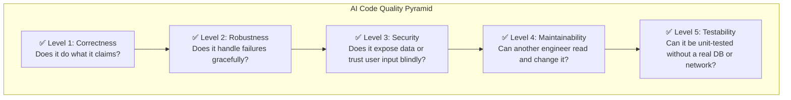

## TL;DR

- Vibe Engineering is the disciplined practice of directing, reviewing, and owning AI-generated code — not just accepting whatever the model outputs.
- AI tools produce code that compiles but routinely violates SOLID, skips error handling, and hides security issues.
- A systematic red-flag checklist and a quality pyramid are your first line of defence — and every item on that checklist is really a named concept from Modules 1–3 (TDD, Design Patterns, Architecture), applied at review time instead of write time.
- This post follows one example — `PortfolioValuationService` — from a vague prompt to a flawed first draft to a reviewed, corrected implementation. Posts 2 and 3 pick the same service back up to build the prompt that should have produced it and the lifecycle that keeps it healthy.

---

## Prerequisites

- Design Patterns Module (all four posts)
- Architecture Module (all three posts)
- Basic experience using any AI coding tool (GitHub Copilot, Claude Code, Cursor, etc.)

---

## Why This Module Exists in the Series

By this point you have three tools that, together, tell you *what* good code looks like. [Agentic TDD](/posts/agentic-tdd-zero-code/) tells you whether a piece of code is **correct** — does it pass a test that defines the requirement, and is it built so a test even *can* be written against it? [Design Patterns](/posts/design-patterns-part-1/) tell you whether it's **well-structured** — does it avoid a god object, a missing abstraction, a hardcoded dependency? [Software Architecture](/posts/architecture-intro/) tells you whether it **fits the system** — does it respect the boundary between layers, or the contract between services?

None of those three posts told you *when* to apply that judgment against something an AI just handed you. Vibe Engineering is that moment, made repeatable. It isn't a fourth, separate skill — it's the first three, compressed into a checklist you run on every AI-generated diff before it becomes your responsibility. You'll see that directly below: every category on this module's checklists is a named idea from an earlier module, not a new one.

This post — and the two that follow it — walk through one running example so the discipline isn't abstract:

1. **This post** — you ask an AI tool for a `PortfolioValuationService` with a vague prompt, get a plausible-looking but flawed result, and learn the checklist that catches the flaws — and which module each flaw traces back to.
2. **Next post** — you go back and build the *structured prompt* that should have produced a better first draft, reusing the SDD/SPDD workflow and the REASONS Canvas from [Agentic SPDD](/posts/agentic-spdd-multi-agent/).
3. **Third post** — you follow `PortfolioValuationService` through the full plan → code → test → refactor → document lifecycle, using the QA/Architect persona split from [Agentic TDD](/posts/agentic-tdd-zero-code/) and the pattern vocabulary from [Design Patterns](/posts/design-patterns-part-1/) at each stage.

---

## Concept Explanation

**Vibe Engineering** is the term for the engineering discipline that emerged once AI coding tools became fast enough to write entire modules in seconds. The challenge shifted from *writing* code to *directing* AI, *reviewing* its output, and *owning* the result as if you had written every line yourself.

Ad-hoc prompting ("write me a function that does X") produces code that works for the happy path but falls apart in production. Vibe Engineering replaces ad-hoc prompting with structured workflows: clear requirements, constrained generation, systematic review, and test-first verification.

> **The core principle:** AI generates, engineer decides. You are responsible for every line that reaches production — regardless of who (or what) wrote it first.

---

## How It Works: The Quality Pyramid



AI tools are optimised for **Level 1** (the code compiles and the happy path works). Levels 2–5 require deliberate human review and explicit constraints in your prompts — and, not coincidentally, Levels 1, 4, and 5 map almost directly onto TDD, Architecture, and Design Patterns respectively, which is why the checklist below cites them by name.

---

## Universal Code Red Flags

These apply to any code — human-written or AI-generated:

```python
# ── RED FLAG 1: Hardcoded credentials ─────────────────────────────────
# BAD
API_KEY = "sk-1234abcd5678efgh"

# GOOD
import os
API_KEY = os.environ["OPENAI_API_KEY"]  # raises KeyError if missing — intentional


# ── RED FLAG 2: Bare except clause ────────────────────────────────────
# BAD — silently swallows all errors including KeyboardInterrupt
try:
    result = fetch_stock_price("RELIANCE")
except:
    result = None

# GOOD — catch specific exceptions, log them
import logging
logger = logging.getLogger(__name__)
try:
    result = fetch_stock_price("RELIANCE")
except ConnectionError as exc:
    logger.error("Price fetch failed for RELIANCE: %s", exc)
    result = None


# ── RED FLAG 3: Missing input validation ──────────────────────────────
# BAD
def get_stock_report(symbol: str, days: int) -> dict:
    return query_db(f"SELECT * FROM stocks WHERE symbol='{symbol}' LIMIT {days}")

# GOOD
def get_stock_report(symbol: str, days: int) -> dict:
    if not symbol or not symbol.isalpha():
        raise ValueError(f"Invalid symbol: {symbol!r}")
    if not 1 <= days <= 365:
        raise ValueError(f"days must be 1–365, got {days}")
    return query_db("SELECT * FROM stocks WHERE symbol=? LIMIT ?", (symbol.upper(), days))


# ── RED FLAG 4: No error handling for external calls ──────────────────
# BAD
def fetch_price(symbol: str) -> float:
    response = requests.get(f"https://api.example.com/price/{symbol}")
    return response.json()["price"]  # crashes on network error, non-200, missing key

# GOOD
import requests
from requests.exceptions import RequestException

def fetch_price(symbol: str, timeout: float = 5.0) -> float:
    try:
        response = requests.get(
            f"https://api.example.com/price/{symbol}",
            timeout=timeout,
        )
        response.raise_for_status()
        data = response.json()
        if "price" not in data:
            raise ValueError(f"Unexpected response shape: {data}")
        return float(data["price"])
    except RequestException as exc:
        raise ConnectionError(f"Failed to fetch price for {symbol}: {exc}") from exc


# ── RED FLAG 5: Mutable default argument ──────────────────────────────
# BAD — the default list is shared across ALL calls (Python gotcha)
def add_symbol(symbol: str, portfolio: list = []) -> list:
    portfolio.append(symbol)
    return portfolio

# GOOD
def add_symbol(symbol: str, portfolio: list | None = None) -> list:
    if portfolio is None:
        portfolio = []
    portfolio.append(symbol)
    return portfolio


# ── RED FLAG 6: Identical repeated logic (no abstraction) ─────────────
# BAD — AI copy-pastes instead of extracting
def process_nse_data(data: dict) -> dict:
    result = {}
    for key, value in data.items():
        if isinstance(value, str):
            result[key] = value.strip().upper()
    return result

def process_bse_data(data: dict) -> dict:
    result = {}
    for key, value in data.items():
        if isinstance(value, str):
            result[key] = value.strip().upper()
    return result

# GOOD — extract the shared logic
def normalise_string_fields(data: dict) -> dict:
    return {
        key: value.strip().upper() if isinstance(value, str) else value
        for key, value in data.items()
    }
```

---

## Where Each Checklist Category Comes From

The checklists in this module aren't a new set of rules — they're the vocabulary from Modules 1–3, reorganised into something you can run against a diff in under a minute. Knowing the source matters, because if a checklist item trips, you already know *which* earlier post has the fuller explanation and the fix pattern.

| Checklist category (below) | Where it comes from | The one-line idea |
|---|---|---|
| Security | New in this module | AI treats input as trusted by default; you can't skip this one, but it's the least connected to earlier modules |
| Correctness / edge cases | **[Agentic TDD](/posts/agentic-tdd-zero-code/)** | If you can't write a failing test for the edge case, you haven't specified it — this is Red-Green-Refactor applied retroactively |
| Error Handling | **[Software Architecture](/posts/architecture-intro/)** | An unguarded external call is a boundary the system doesn't control being treated as if it were reliable |
| Testability (constructor injection, no global state) | **[Design Patterns](/posts/design-patterns-part-1/)** | "Depend on abstractions, not concretions" is the SOLID principle; a class that builds its own dependencies violates it |
| No repeated logic (DRY) | **[Design Patterns](/posts/design-patterns-part-1/)** | Copy-pasted logic across two functions is usually a missing abstraction a Factory or shared utility should own |
| Layering ("business logic must never write a query directly") | **[Software Architecture](/posts/architecture-intro/)** | This is the exact rule from the Architecture Intro post, restated as a review question |

---

## AI-Specific Red Flags Checklist

These patterns appear specifically in AI-generated code and are rarely caught without deliberate review:

```
REVIEW CHECKLIST — AI Code

Security
  [ ] No hardcoded credentials or API keys
  [ ] All user inputs validated before use
  [ ] No string-formatted SQL (use parameterised queries)
  [ ] No eval() or exec() on user-supplied data
  [ ] External dependencies version-pinned in requirements.txt

Correctness ([Agentic TDD](/posts/agentic-tdd-zero-code/))
  [ ] Edge cases handled (empty input, None, zero, negative numbers)
  [ ] Floating point: never use == for float comparison
  [ ] Datetime: timezone-aware datetimes for all external-facing values
  [ ] Concurrency: no shared mutable state without a lock

Error Handling ([Software Architecture](/posts/architecture-intro/) boundaries)
  [ ] No bare except clauses
  [ ] All exceptions logged before being caught or re-raised
  [ ] External calls have explicit timeouts
  [ ] Resources (files, DB connections) closed in finally or with context managers

Code Quality ([Design Patterns](/posts/design-patterns-part-1/) / SOLID)
  [ ] Type hints on all public function signatures
  [ ] Docstrings on all public methods (Google style or NumPy style)
  [ ] No mutable default arguments
  [ ] No identical repeated logic blocks (DRY)
  [ ] Singleton: thread-safe with a lock in __new__
  [ ] Decorator: uses @functools.wraps

Testability ([Design Patterns](/posts/design-patterns-part-1/) — Dependency Inversion)
  [ ] All external dependencies injected via constructor (not instantiated inside)
  [ ] No global state that tests can't reset
  [ ] Side effects (network, disk, DB) isolated behind injectable interfaces
```

---

## The Five Common Patterns in AI-Generated Code

| Pattern | What AI does | What to do | Module it connects to |
|---------|-------------|-----------|-----------|
| **God class** | Puts data access, business logic, and presentation in one class | Split by responsibility (SRP) | [Design Patterns](/posts/design-patterns-part-1/) — SOLID, Single Responsibility |
| **Shallow happy path** | Tests only the "it works" case; no edge cases, no error paths | Add parameterised tests for edge cases | [Agentic TDD](/posts/agentic-tdd-zero-code/) — TDD, edge-case coverage |
| **Hardcoded infrastructure** | `self.db = PostgreSQLDatabase()` inside `__init__` | Replace with constructor injection + Protocol | [Design Patterns](/posts/design-patterns-part-1/) — Dependency Inversion |
| **Copied logic** | Same transformation written 3× in different functions | Extract to a shared utility | [Design Patterns](/posts/design-patterns-part-1/) — Factory / DRY |
| **Fantasy architecture** | Imports modules that don't exist or calls methods with wrong signatures | Always run the code before committing | [Software Architecture](/posts/architecture-intro/) — validate the diagram against the code |

---

## A Complete Walkthrough: Vibe-Reviewing `PortfolioValuationService`

This is the running example for the whole module. Here's the scenario: you need a service that computes a user's total portfolio value in real time, using live stock prices. You give an AI coding tool a fast, informal prompt — the way most people actually start — and inspect exactly what comes back.

### The prompt (deliberately under-specified)

```
Write a Python class that calculates a user's portfolio value using live stock prices.
```

### What the AI returned

```python
# ⚠️ AI-generated first draft — looks complete, has five distinct problems
import requests

class PortfolioValuationService:
    def __init__(self):
        self.db = PostgresConnection("prod-db-1")  # (1)

    def get_valuation(self, user_id):                       # (2)
        holdings = self.db.query(
            f"SELECT * FROM holdings WHERE user_id = {user_id}"  # (3)
        )
        total = 0
        for h in holdings:
            price = requests.get(f"https://api.prices.com/{h['symbol']}").json()["price"]  # (4)
            total += h["quantity"] * price
        return total                                          # (5)
```

### Running it through the checklist — with the module each defect maps to

| # | What the code does | Checklist item it fails | Which earlier module already taught the fix |
|---|--------------------|--------------------------|-----------------------------------------------|
| 1 | Instantiates `PostgresConnection` directly inside `__init__` | Testability — dependencies injected via constructor | **[Design Patterns](/posts/design-patterns-part-1/)**: this is exactly the Dependency Inversion violation in the SOLID table — depend on an abstraction (a `Protocol`), not a concrete `PostgresConnection` |
| 2 | No type hints or docstring on a public method | Code Quality | **[Design Patterns](/posts/design-patterns-part-1/) / [Software Architecture](/posts/architecture-intro/)**: every worked example in Design Patterns and Architecture types and documents its public interfaces — this is the same contract discipline |
| 3 | Builds SQL with an f-string using `user_id` directly | Security — no string-formatted SQL | Security is the one category genuinely new to this module — but the *fix* (delegate to a repository) is the layering rule from **[Software Architecture](/posts/architecture-intro/)** |
| 4 | Calls `requests.get` with no `timeout`, no error handling, and assumes `"price"` always exists | Error Handling — explicit timeouts and edge cases | **[Software Architecture](/posts/architecture-intro/)**: an external call is a system boundary; **[Agentic TDD](/posts/agentic-tdd-zero-code/)**: "price missing from response" is exactly the kind of edge case a failing test would have forced you to specify before writing this line |
| 5 | Returns a bare number with no currency, no per-position breakdown, and silently returns `0` for a user with no holdings | Correctness — ambiguous contract | **[Agentic TDD](/posts/agentic-tdd-zero-code/)**: if you'd written the test first ("user with no holdings returns total_value=0, not an error"), the ambiguity between "zero value" and "valuation failed" would have surfaced before any code existed |

Five real defects, and the code still runs, still "looks right," and would probably pass a casual glance in a rushed review. Notice that **four of the five** are really Modules 1–3 showing up again, just at a different moment — the moment you're reading generated code instead of writing your own.

### The corrected version

```python
# ✅ Reviewed and corrected version
from dataclasses import dataclass
from typing import Protocol
import logging

logger = logging.getLogger(__name__)


@dataclass(frozen=True)
class PortfolioValuation:
    user_id: str
    total_value: float
    positions: list[dict]


class PriceFeed(Protocol):
    def get_price(self, symbol: str) -> float: ...


class PortfolioRepository(Protocol):
    def get_holdings(self, user_id: str) -> list[dict]: ...


class PortfolioValuationService:
    """Compute the current market value of a user's portfolio."""

    def __init__(self, repository: PortfolioRepository, price_feed: PriceFeed) -> None:
        self._repository = repository
        self._price_feed = price_feed

    def get_valuation(self, user_id: str) -> PortfolioValuation:
        """Return the current total value and per-position breakdown for user_id.

        Args:
            user_id: Validated UUID of the authenticated user.

        Returns:
            PortfolioValuation with total_value (0.0 if the user holds nothing)
            and a per-position breakdown.

        Raises:
            PriceUnavailableError: If a live price cannot be fetched for a holding.
        """
        holdings = self._repository.get_holdings(user_id)
        positions: list[dict] = []
        total = 0.0

        for holding in holdings:
            try:
                price = self._price_feed.get_price(holding["symbol"])
            except ConnectionError as exc:
                logger.warning("Price unavailable for %s: %s", holding["symbol"], exc)
                raise PriceUnavailableError(holding["symbol"]) from exc

            value = holding["quantity"] * price
            positions.append({"symbol": holding["symbol"], "value": value})
            total += value

        return PortfolioValuation(user_id=user_id, total_value=total, positions=positions)


class PriceUnavailableError(Exception):
    def __init__(self, symbol: str) -> None:
        super().__init__(f"Price unavailable for symbol: {symbol}")
```

Every one of the five defects is now addressed: `PortfolioRepository` and `PriceFeed` are injected as `Protocol`s ([Design Patterns](/posts/design-patterns-part-1/)'s Dependency Inversion — testable with fakes, no real DB or network needed), the SQL/user-id handling has moved behind the repository, respecting the layering boundary from [Software Architecture](/posts/architecture-intro/), the price call has explicit, logged error handling instead of an unguarded `requests.get`, and the return type is a documented dataclass instead of a bare float.

Notice what didn't change: the underlying idea (loop over holdings, multiply quantity by price, sum) is exactly the same. Vibe Engineering isn't about rewriting AI output from scratch — it's about running Modules 1–3's questions against it and closing exactly the gaps those questions surface.

**Keep this example open** — post 2 writes the structured prompt that should have produced something closer to the corrected version on the first try, using the same SDD/SPDD discipline from [Agentic SPDD](/posts/agentic-spdd-multi-agent/), and post 3 carries `PortfolioValuationService` through the rest of its lifecycle.

---

## AI in Development

Use this prompt to ask AI to *self-review* its output before you see it:

```
Before returning the code, review it against these criteria and fix all issues found:

1. Security: No hardcoded secrets. All inputs validated. SQL uses parameterised queries.
2. Error handling: No bare except. All external calls have explicit timeouts. Resources
   are closed in context managers.
3. Type hints: All public function signatures have type hints and docstrings.
4. Testability: Dependencies injected via constructor, not instantiated inside methods.
5. DRY: No logic block appears more than once.

If you find any violations, fix them silently and return only the corrected code.
Then append a one-line summary of what you changed.
```

This "fix before showing" instruction eliminates a full review-and-iterate round for the most common issues. Try it on the original `PortfolioValuationService` prompt above — most tools will independently catch defects 1, 3, and 4 from the table, though defect 5 (the ambiguous return contract) usually still needs a human to notice, because it's a design decision — exactly the kind of decision [Agentic TDD](/posts/agentic-tdd-zero-code/)'s Red phase forces you to make explicit *before* code exists, not after.

---

## Pro Tips

1. **The 10-second scan.** Before deep review, scan for the three cheapest red flags: bare `except`, hardcoded strings that look like secrets, and `self.X = ConcreteClass()` in `__init__`. These three alone catch 60% of AI code problems.
2. **Automated linting before human review.** Run `ruff` or `flake8` + `mypy` as a pre-commit hook. Catch type errors and style violations automatically so human review focuses on logic.
3. **Review the imports.** AI sometimes imports libraries that aren't installed, uses deprecated APIs, or imports from the wrong module. Verify every import statement.
4. **Run the tests first.** Never spend time reviewing code the tests already reject. Run the test suite before the code review — let failing tests guide where to look.
5. **Document your AI interaction.** Keep a short log of what you prompted for and what you changed. It's invaluable for debugging "why does this code do that?" six months later.

---

## Common Mistakes

- **Accepting AI code that "looks right" without running it.** AI confidently generates code with logical bugs, off-by-one errors, and wrong API signatures. Run it.
- **Skipping the security layer because "it's an internal tool."** Internal tools become external tools. Apply the same security bar from day one.
- **Using AI to generate tests for AI-generated code without human review.** AI will generate tests that are tautological — they pass because they test the implementation, not the requirement. Always write at least the edge-case tests yourself. (This is the exact "Mistake 2" from [Agentic TDD](/posts/agentic-tdd-zero-code/)'s zero-code post: not reading the generated test code.)
- **Treating the checklist as bureaucracy.** Each item on the checklist is there because of a real class of production failures. Use it as a mental model, not a compliance form.

---

## Exercises

1. Take any 50-line function generated by an AI tool (or write one intentionally with defects). Run through the checklist above. Count the violations and fix them one by one.
2. Write a `CodeReviewer` class with a method `scan(source_code: str) -> list[str]` that uses simple string/regex matching to detect: (a) bare `except:` clauses, (b) `= []` as a default argument, and (c) `requests.get(` without a `timeout=` argument. Return a list of warning strings.
3. Refactor the `process_nse_data` / `process_bse_data` example above into a single generic `normalise_string_fields` function. Write three pytest tests covering: empty dict, dict with mixed types, and dict with already-normalised values.
4. Take the *original* flawed `PortfolioValuationService` draft from the walkthrough. Before reading the corrected version again, write your own checklist findings independently — for each one you find, name which Module (1, 2, or 3) it traces back to, the way the table above does.
5. Extend the corrected `PortfolioValuationService` with a `get_summary(user_id)` method that returns the top 3 positions by value. Write it test-first ([Agentic TDD](/posts/agentic-tdd-zero-code/) style): define the test cases before the implementation, including the case where a user has fewer than 3 positions.

---

## References

- [Ruff — fast Python linter](https://docs.astral.sh/ruff/)
- [mypy — static type checker for Python](https://mypy.readthedocs.io/)
- [OWASP Top 10 — security risks](https://owasp.org/www-project-top-ten/)
- [Google Python Style Guide](https://google.github.io/styleguide/pyguide.html)
- [Real Python — Python Code Quality](https://realpython.com/python-code-quality/)
- [PEP 544 — Protocols: Structural subtyping](https://peps.python.org/pep-0544/) — the typing mechanism behind the injectable `PriceFeed` and `PortfolioRepository` interfaces above

---

## Next Steps

You've seen what happens when a prompt is too vague, and that most of what a disciplined review catches afterward is really [Agentic TDD](/posts/agentic-tdd-zero-code/), [Design Patterns](/posts/design-patterns-part-1/), and [Software Architecture](/posts/architecture-intro/) reapplied. The next post works the same problem from the other direction: it reuses the multi-agent, spec-first workflow from [Agentic SPDD](/posts/agentic-spdd-multi-agent/) to write the prompt so the AI's *first* draft already looks like the corrected version above.

Continue to [Prompting and Code Review →](/posts/prompting-code-review/)
