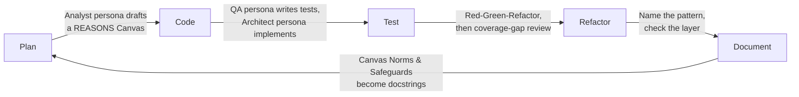

## TL;DR

- AI assists every stage of the development lifecycle — but engineering oversight is non-negotiable at each one.
- The rule: AI generates, engineer decides. Never approve code you don't understand.
- This post does not introduce new machinery for the five phases. **Plan reuses the Analyst persona and REASONS Canvas from Module 1. Code reuses the QA/Architect persona split and contract-first TDD from Module 1. Refactor names the Design Patterns from Module 2 and checks the layering rules from Module 3.** The lifecycle is what happens when you run all three earlier modules back to back, on one feature, in order.
- Professional responsibility is not reduced by AI involvement — it is transferred entirely to the engineer who merges the code.

---

## Prerequisites

- [Prompting and Code Review](/posts/prompting-code-review/) — this post assumes you have the Quick Template and REASONS Canvas from that post in hand
- All previous modules (TDD, Design Patterns, Architecture, Vibe Engineering Intro)
- Experience with a full feature development cycle (plan → deploy)

---

## Why This Post Exists in the Series

Posts 1 and 2 of this module each isolated a single moment: reviewing one AI-generated draft, and writing one well-structured prompt or Canvas. Both are necessary skills, but neither one, by itself, tells you how a feature actually gets built — because in practice a feature isn't one prompt and one review. It's a sequence, and every phase in that sequence already has a named tool from an earlier module. This post's only job is to show where each one plugs in:

| Lifecycle phase | Reuses this, from an earlier module |
|---|---|
| **Plan** | Module 1's Analyst persona and REASONS Canvas (Post 2's Template B) |
| **Code** | Module 1's QA-persona/Architect-persona split, applied contract-first (TDD, Module 1 Post 1) |
| **Test** | Module 1's Red-Green-Refactor discipline, extended with coverage-gap review |
| **Refactor** | Module 2's named patterns and SOLID vocabulary |
| **Document** | The Canvas's own Norms and Safeguards fields, turned into docstring content |

AI can participate in every one of those steps. That's genuinely useful — and it's also exactly where the "AI generates, engineer decides" principle from the introduction post is easiest to quietly abandon, because each individual step feels small and low-stakes on its own. This post walks the full lifecycle using `PortfolioValuationService` as the through-line, precisely so you see the engineer's decision re-enter at every phase using the exact tools Modules 1–3 already gave you — not a sixth, new set of rules to learn.

---

## Concept Explanation

The development lifecycle has five phases: **Plan → Code → Test → Refactor → Document**. AI tools accelerate all five. The risk is that acceleration without oversight produces systems that work today and fail unpredictably in production.

Each phase has a distinct AI leverage point and a distinct failure mode. Engineering mastery means knowing where to use AI freely, where to constrain it tightly, and where to do the work yourself.

---

## How It Works: AI Across the Lifecycle



---

## Phase 1: Plan — Requirements to Architecture, via the Analyst Persona

**What AI does well:** Breaking a feature description into subtasks, generating candidate architecture diagrams, listing assumptions that need validation, drafting the REASONS Canvas itself.

**What requires human judgment:** Trade-off decisions (monolith vs. microservice, SQL vs. NoSQL), defining the non-functional requirements (latency SLA, data retention), deciding what the system does NOT do (scope), and resolving every open question the Canvas surfaces before it moves to Code.

### Planning with the Analyst Persona and the REASONS Canvas — not a new prompt

Module 1's SPDD post already answered "how do you plan a feature with AI": an Analyst persona drafts a REASONS Canvas from a rough goal, you review and commit it, and only then does anything move to implementation. Post 2 of this module gave you that Canvas as a blank, plain-text template (Template B). Planning `PortfolioValuationService` means filling that same template in — not writing a new kind of prompt:

```
GOAL (what you hand the Analyst persona)
Build a real-time portfolio valuation service that recalculates a user's
portfolio value when a stock price updates, and pushes the new value to
connected clients.

INPUTS / EXISTING CONTRACTS
StockPriceFeed (Observer pattern, Module 2 — Behavioral Patterns), which
already publishes price-update events.

MUST EXPLICITLY ADDRESS IN SAFEGUARDS
A slow or failed price lookup must never block the notification pipeline
for other users' portfolios.
```

Handing that to the Analyst persona produces the Requirements/Entities/Approach/Structure/Operations/Norms/Safeguards Canvas the same way Module 1 walked through for the commission engine. Two of the fields are worth calling out because they're exactly where the open design questions live — and, just like the commission engine's `spec.md` in Module 1, an unresolved question here is a **blocked Canvas**, not a detail for the Architect persona to guess at later:

```
Open questions surfaced by the Analyst persona (must be resolved before Code):
  - Is "portfolio value" reported per-currency, or converted to one display currency?
  - Should a stale price (feed hasn't updated in N minutes) block valuation,
    or fall back to the last known price?
```

**Human planning checklist — the same one Module 1's Specify/Plan review gates use:**
- [ ] Is the scope defined? What is explicitly OUT of scope?
- [ ] Are NFRs (latency, throughput, availability) documented in the Canvas's Requirements?
- [ ] Are all external service dependencies listed in Entities?
- [ ] Is the data model sketched in Entities and Structure?
- [ ] Does every open question have an answer recorded in the Canvas, not just in your head?

Notice that the two open questions are genuine business decisions — currency handling and stale-price behaviour — not engineering ones. No amount of re-prompting the Analyst persona resolves them correctly; it can only make sure they get asked before 200 lines of code are generated around an unstated assumption.

---

## Phase 2: Code — the QA/Architect Split, Applied Contract-First

**The contract-first workflow, as Module 1 defined it:** write the interface (a `Protocol`, following Module 2's Dependency Inversion) and hand it to a QA persona for tests *before* an Architect persona ever writes implementation code. The Canvas from Phase 1 is the shared source both personas work from — neither one improvises past it.

```python
# Step 1: Define the contract (you write this, directly from the Canvas's
# Entities and Structure fields)
from typing import Protocol
from dataclasses import dataclass


@dataclass
class PortfolioValuation:
    user_id: str
    total_value: float
    positions: list[dict]
    last_updated: float


class PortfolioValuationService(Protocol):
    def get_valuation(self, user_id: str) -> PortfolioValuation:
        """Return current portfolio valuation for user_id.

        Args:
            user_id: Validated UUID of the authenticated user.

        Returns:
            PortfolioValuation with total_value and per-position breakdown.

        Raises:
            UserNotFoundError: If user_id does not exist.
            PriceUnavailableError: If one or more stock prices cannot be fetched.
        """
        ...
```

**Step 2 — the QA persona, prompted from the Canvas, not from scratch:**

```
Act as a strict QA Automation Engineer.
Here is the approved Canvas's Requirements and Safeguards: [[paste Phase 1 Canvas]]
Here is the Protocol it must satisfy: [[paste PortfolioValuationService Protocol]]

Generate a pytest suite (test_portfolio_valuation.py) that verifies every
Requirement and every Safeguard above — nothing more. Use Arrange-Act-Assert.
Do not write any implementation code.
```

```python
# test_portfolio_valuation.py — AI-generated, from the prompt above
import pytest
from unittest.mock import MagicMock

# These tests are the contract — they define what "correct" means.
# The Architect persona must produce code that passes ALL of these.

def test_returns_correct_total_for_single_position(mock_service):
    """Single position × price = total_value."""
    pass  # Fill in: position with 10 shares × ₹2450 → total ₹24500

def test_raises_user_not_found_for_unknown_user(mock_service):
    """Unknown user_id raises UserNotFoundError, not KeyError."""
    pass

def test_raises_price_unavailable_when_feed_is_down(mock_service):
    """Unavailable price raises PriceUnavailableError, not ConnectionError."""
    pass

def test_total_is_sum_of_all_positions(mock_service):
    """Multi-position portfolio: total equals sum of all position values."""
    pass

def test_returns_empty_positions_for_user_with_no_holdings(mock_service):
    """User with no holdings returns PortfolioValuation with total_value=0."""
    pass
```

**Step 3 — the Architect persona, in a separate session, per Module 1's golden rule:**

```
Act as a senior Python engineer (Architect persona).
Implement PortfolioValuationService so that it satisfies the Protocol below
and passes every test in the attached suite. Do not modify the tests.

Protocol: [[paste protocol]]
Tests: [[paste test file]]
Canvas Approach & Safeguards: [[paste relevant Canvas fields from Phase 1]]

Constraints:
- Inject StockPriceFeed and PortfolioRepository via constructor (Module 2 —
  Dependency Inversion)
- UserNotFoundError and PriceUnavailableError are custom exceptions
- All price lookups must time out after 3 seconds (Canvas Safeguard)
- Log a WARNING for each position where price is unavailable before raising
```

This is the same discipline as post 2's templates, applied specifically to the moment of implementation: the Protocol and the failing tests together *are* the constraints, expressed as code instead of prose. Note that `test_raises_user_not_found_for_unknown_user` is a case the Canvas's Requirements didn't spell out explicitly — the contract-first, QA-persona-first workflow catches requirements a Canvas can silently omit, because a missing test is much more visible than a missing sentence, exactly as Module 1 observed about the zero-code workflow.

---

## Phase 3: Test — Red-Green-Refactor, Then Coverage-Gap Review

**What AI does well:** Generating parameterised test cases for boundary values, listing edge cases you haven't thought of, generating test fixtures for complex data structures.

**What requires human judgment:** Deciding which tests are worth maintaining, verifying that AI-generated tests actually test requirements (not just implementation), reviewing test coverage meaningfully (100% line coverage ≠ correct behaviour).

The QA persona's suite from Phase 2 already ran the Red phase — every test failed before the Architect persona wrote a line, exactly as Module 1's Red-Green-Refactor loop requires. This phase is what comes after Green: finding what the suite still doesn't cover.

```
COVERAGE REVIEW PROMPT (plain text — paste directly)

I have the following function and its tests.
Identify any behaviour that the tests do NOT cover.
For each gap, write a pytest test case that covers it.

Function:
[[paste function code]]

Existing tests:
[[paste existing test file]]

Focus on:
- Boundary values (zero, negative, maximum, empty)
- Exception paths (network failure, invalid input, concurrent access)
- State transitions (what happens on the second call vs. the first)
- Interactions between parameters (what if both A and B are None?)
```

### Worked example: running the prompt against `PortfolioValuationService.get_valuation`

Given the five tests from Phase 2, a typical response identifies gaps like this:

```
Coverage gaps found:

1. Two positions in the same portfolio hold the SAME symbol (two separate lots).
   Not covered by "multi-position" test, which implicitly assumes distinct symbols.

   def test_sums_two_lots_of_the_same_symbol(mock_service):
       """Two positions with the same symbol contribute independently to total_value."""
       # 5 shares RELIANCE @ 2450 + 3 shares RELIANCE @ 2500 -> total 12250 + 7500 = 19750
       ...

2. get_valuation is called twice in a row for the same user — is a cached price reused
   or re-fetched? Not covered by any existing test.

   def test_second_call_refetches_price_not_cached(mock_service):
       """Calling get_valuation twice fetches the price feed twice — no stale caching."""
       ...

3. price_feed.get_price raises ConnectionError for the FIRST position but the portfolio
   has THREE positions — does the method fail fast, or does it fetch positions 2 and 3
   before raising?

   def test_fails_fast_on_first_unavailable_price(mock_service):
       """Raises PriceUnavailableError as soon as one price lookup fails, without
       fetching remaining positions."""
       ...
```

Run the three human review questions from Module 1's zero-code post against these: gap 1 and gap 3 both pass — they exercise genuinely different code paths and assert observable behaviour rather than internals. Gap 2 is weaker: "no stale caching" is really testing an *absence* of a feature that was never written into the Canvas's Requirements back in Phase 1. Before accepting it, go back to the Canvas: is caching out of scope, or is this an assumption that should have been an open question? That's a Plan-phase judgment call a coverage-gap prompt cannot supply on its own — it can find the untested branch, but not whether the branch *should* exist. If the answer is "yes, we do want caching," the fix is to update the Canvas first, per Module 1's Closed Loop rule — never to just accept the test and move on.

---

## Phase 4: Refactor — Name the Pattern, Check the Layer

**What AI does well:** Identifying code smells (long method, feature envy, data clumps), suggesting which Module 2 design pattern applies, generating the refactored version with the pattern applied, and — because Module 3 gave you the vocabulary for it — flagging a layering violation the way Module 3's worked example did.

**What requires human judgment:** Deciding whether a refactor is worth the risk, ensuring tests still pass after refactoring, reviewing whether the suggested pattern is the right one for the context, and confirming the refactor didn't cross a layer boundary while it was at it.

```
REFACTOR PROMPT (plain text — paste directly)

Review this code for the following code smells. For each smell found:
1. Name the smell
2. Quote the offending lines
3. Name the Module 2 design pattern that fixes it, if one applies
4. State whether the fix crosses a layer boundary (Module 3) — if so, flag it
   instead of silently generating a fix
5. Show the refactored code

Code smells to check:
- Long method (> 20 lines doing more than one thing)
- Feature envy (method uses another class's data more than its own)
- Data clumps (same group of parameters passed together repeatedly)
- Shotgun surgery (one change requires edits in many unrelated places)
- Primitive obsession (using str/int where a domain type would be clearer)
- Switch statements / long if-elif chains (Strategy pattern candidate)
- God class (class with too many responsibilities)
- Dead code (unreachable or unused functions/variables)

Code:
[[paste code to refactor]]
```

### Worked example: primitive obsession in `PortfolioValuationService`

Running the Refactor prompt against `PortfolioValuation.total_value` (typed as `float`) surfaces exactly this smell — a financial figure represented as a primitive instead of a domain type:

```python
# BAD — str/float for everything, no domain type
def create_trade(symbol: str, quantity: str, price: str, direction: str) -> dict:
    return {"symbol": symbol, "qty": int(quantity), "price": float(price), "direction": direction}

# AI suggests, naming the fix as a value-object refactor (Module 2 territory —
# not one of the three GoF families directly, but the same instinct as
# Builder's validation-on-construction): replace primitives with domain types
from dataclasses import dataclass
from enum import Enum, auto
from decimal import Decimal

class TradeDirection(Enum):
    BUY = auto()
    SELL = auto()

@dataclass(frozen=True)
class TradeOrder:
    symbol: str          # e.g. "RELIANCE"
    quantity: int        # number of shares, always positive
    price: Decimal       # use Decimal for financial calculations — never float
    direction: TradeDirection

    def __post_init__(self):
        if not self.symbol or not self.symbol.isalpha():
            raise ValueError(f"Invalid symbol: {self.symbol!r}")
        if self.quantity <= 0:
            raise ValueError(f"Quantity must be positive, got {self.quantity}")
        if self.price <= 0:
            raise ValueError(f"Price must be positive, got {self.price}")

# Usage is now self-documenting:
order = TradeOrder(
    symbol="RELIANCE",
    quantity=10,
    price=Decimal("2450.75"),
    direction=TradeDirection.BUY,
)
```

The same `float → Decimal` fix applies directly to `PortfolioValuation.total_value` and every per-position value in its breakdown — this is the answer to a design question left implicit all the way back in post 1's corrected implementation. Item 4 of the refactor prompt (check for a layer boundary crossing) comes back clean here: swapping a primitive for a `Decimal`-backed dataclass doesn't touch which layer anything lives in. It wouldn't always — Module 3's worked example showed an AI-suggested "refactor" that quietly had `ValuationService` query the database directly, which is precisely the kind of change this checklist item exists to catch before it's accepted as a tidy-up.

---

## Phase 5: Document — the Canvas's Norms and Safeguards, Turned into Docstrings

**What AI does well:** Generating Google/NumPy-style docstrings from function signatures and bodies, drafting README sections from code structure, generating OpenAPI/Swagger descriptions.

**What requires human judgment:** Ensuring docstrings describe intent (not implementation), verifying API descriptions are accurate and complete, writing the "why" that AI cannot know — which, for a feature planned with a Canvas, is often already sitting in that Canvas's Norms and Safeguards fields from Phase 1.

```
DOCSTRING PROMPT (plain text — paste directly)

Generate a Google-style docstring for the following Python function.
Use the attached Canvas Safeguards as the source for the Raises section —
do not invent exceptions that aren't in the Safeguards or the code.

The docstring must:
- Start with a one-line summary (imperative mood: "Return", "Calculate", "Fetch")
- Include Args section with type and description for each parameter
- Include Returns section describing the return value and type
- Include Raises section for each exception the function can raise
- NOT describe HOW the function works — describe WHAT it does and WHY
- NOT repeat information already in the type hints

Function:
[[paste function code]]

Canvas Safeguards (Phase 1):
[[paste Safeguards field from the Canvas]]
```

```python
# Example output review — what to check:
def get_valuation(self, user_id: str) -> PortfolioValuation:
    """Return current portfolio valuation for the specified user.

    Never blocks indefinitely on a slow price lookup; raises
    PriceUnavailableError instead, per the Safeguards this service was
    planned against.

    Args:
        user_id: UUID of the authenticated user whose portfolio to value.
            Must be a valid UUID4 string. See validators.is_valid_uuid().

    Returns:
        PortfolioValuation containing total_value (sum of all positions at
        current market price), a per-position breakdown, and the Unix
        timestamp of the valuation.

    Raises:
        UserNotFoundError: If no user exists with the given user_id.
        PriceUnavailableError: If live price cannot be fetched for any
            position within the timeout defined in the Canvas Safeguards.
    """
    ...

# Review checklist for AI-generated docstrings:
# [ ] First line is one sentence, imperative mood
# [ ] Args section has every parameter
# [ ] Returns section describes the VALUE, not the type (type hints handle types)
# [ ] Raises section matches the Canvas Safeguards exactly — no invented exceptions,
#     no Safeguard left undocumented
# [ ] No implementation details ("iterates over _positions list", "3-second timeout")
# [ ] The "why" is present where the intent is non-obvious
```

Compare this against the version from earlier drafts of this post: an unreviewed AI docstring will often write "Uses a 3-second timeout per price lookup" — a fact copied from the Safeguards, but framed as *how* the code works rather than *why* it's safe to call. Feeding the Canvas's Safeguards into the prompt directly, as shown above, nudges the output toward framing the guarantee ("never blocks indefinitely... raises PriceUnavailableError instead") rather than restating the implementation detail — but the review checklist item still has to be checked by hand, because the AI doesn't reliably make that distinction on its own.

---

## Maintaining Engineering Control

**The responsibility chain:**

```
Analyst persona drafts a Canvas (Plan)
        ↓
Engineer reviews and commits the Canvas — every open question resolved
        ↓
QA persona writes tests from the Canvas; Architect persona implements
against them, in separate sessions (Code)
        ↓
Engineer runs coverage-gap review; checks each gap against the Canvas (Test)
        ↓
Engineer runs the Refactor prompt; names the pattern, checks the layer (Refactor)
        ↓
Engineer reviews AI-generated docs against the Canvas's own Safeguards (Document)
        ↓
Engineer approves and merges — and owns the code in production, 100%
```

AI involvement at any step does not dilute your responsibility. If AI-generated code causes a production incident, the engineer who merged it is accountable. This is not a burden — it is the professional standard that makes software trustworthy.

**The "explain it back" test:**
Before merging any AI-generated code, be able to explain to a colleague:
1. What each function does and why it's structured that way
2. How it fails — what inputs or conditions will cause it to error
3. How it will be monitored in production

If you can't explain points 2 and 3, the code isn't ready to merge.

---

## AI in Development

**The "plan, then code" rule — which is really "Canvas, then persona split":**

```
When asking AI to implement a feature, always produce and commit the
REASONS Canvas (Module 1 / Post 2 Template B) before any code-generation
prompt. Then split QA and Architect into separate sessions, exactly as
Module 1's zero-code post requires — never let one session draft the
spec, write the tests, and implement, in sequence, without a human gate
between each.
```

**The limits of trust:**

```
Trust AI output for: boilerplate, repetitive transformations, test case generation,
                     docstring drafts, diagram generation, code formatting.

Do NOT trust AI output for: security-critical code (auth, crypto, secrets),
                             financial calculations (use Decimal, verify formulae),
                             concurrency (locks, async, race conditions),
                             data migrations (irreversible, production risk),
                             external API contracts (verify against real API docs).
```

Notice that `PortfolioValuationService.total_value` — a financial calculation — is exactly the category this table says not to trust blindly, and it's exactly where the walkthrough above found a real defect (`float` instead of `Decimal`). The lifecycle didn't prevent the mistake from being generated; it gave the mistake four separate chances (Code, Test, Refactor, and Document) to be caught before merge, because each phase reused a different module's checklist.

---

## Pro Tips

1. **Two-pass review.** First pass: does it work? Second pass: is it safe to maintain and extend? Most engineers do only the first pass. The second pass is where AI code quality diverges from human code quality.
2. **AI for "what could go wrong" brainstorming.** Before deploying a feature, prompt AI: "What are the 10 most likely failure modes for this system in production?" It's a fast way to surface edge cases you haven't considered — and a good source of new Safeguards for the Canvas.
3. **Commit AI prompts with the code.** Add a `PROMPTS.md` file to the PR describing the key prompts used, alongside the Canvas itself. It documents your intent and helps reviewers understand why the code looks the way it does.
4. **AI is fastest at refactoring safe code.** The less side-effectful a function is (pure functions, no I/O), the more safely you can delegate its refactoring to AI. Reserve the most careful human attention for code that touches external systems or crosses a layer boundary.
5. **Build AI review into your PR template.** Add a checklist item: "I have reviewed AI-generated sections against the Vibe Engineering checklist and confirmed the Canvas's Safeguards are all reflected in the code." Make the review obligation explicit and visible.

---

## Common Mistakes

- **Using AI in the code phase but not the test phase.** AI that generates code should also generate the initial edge-case test list — then you review and extend it. Don't let AI generate code and then write all tests yourself from scratch.
- **Merging without running the full test suite.** AI-generated code sometimes breaks unrelated tests by changing shared state, renaming symbols, or silently removing logic. Always run the full suite, not just tests for the new code.
- **AI refactoring without a safety net.** Never ask AI to refactor code that has no tests. If tests don't exist, write them first. AI refactoring without tests is a liability, not an asset.
- **Planning with AI and skipping human architectural review.** AI-generated Canvases are starting points, not decisions. Every architectural decision with production implications needs human review, ideally by more than one engineer.
- **Treating AI documentation as final.** AI docstrings are drafts. They often describe what the code does but miss what the code *should* do — the intent, the constraints, the "why this approach". Always add that layer, and always cross-check it against the Canvas.
- **Letting the Canvas and the code drift apart.** Per Module 1's Closed Loop rule: if a Refactor or Test-phase finding changes behaviour, update the Canvas first. A Canvas that no longer matches the code actively misleads the next engineer who reads it.

---

## References

- [Claude Code documentation](https://docs.anthropic.com/claude-code)
- [Refactoring — Martin Fowler](https://refactoring.com/)
- [Google Engineering Practices — Code Review](https://google.github.io/eng-practices/review/)
- [pytest — Writing and running tests](https://docs.pytest.org/en/stable/)
- [Architecture Decision Records](https://adr.github.io/)
- [Semantic Versioning for APIs](https://semver.org/)
- [Python `decimal` module](https://docs.python.org/3/library/decimal.html) — why financial calculations should never use `float`

---

## Next Steps

You've now followed `PortfolioValuationService` through review (post 1), a properly structured prompt and Canvas (post 2), and the full plan-to-document lifecycle (this post) — three modules' worth of tools, applied in sequence, on one running example. 
